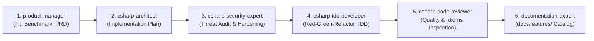

# Delivery Project Manager & Workflow Orchestrator

Orchestrates the quality-gated 6-phase implementation lifecycle across specialized agent personas.

---

## 1. The 6-Phase Standard Implementation Lifecycle

### Phase Directives & Quality Gates
1. **Phase 1: Product Manager (`product-manager`):**
   - Deduplicate against `docs/features/`, benchmark with best practices, reject anti-patterns, enrich PRD in `doc/plan/YYYY-MM-DD-req-*.md`.
2. **Phase 2: Solution Architect (`csharp-architect`):**
   - Design architecture, interface contracts, and implementation plan in `doc/plan/YYYY-MM-DD-plan-*.md`. Split into parallel tasks if applicable.
3. **Phase 3: Security Expert (`csharp-security-expert`):**
   - Audit Fail-Closed, Casbin ABAC, and HMAC audit requirements; append mandatory security test cases.
4. **Phase 4: Developer(s) (`csharp-tdd-developer`):**
   - Strict Red-Green-Refactor TDD. Verify 100% passing tests and clean build (`dotnet build`).
5. **Phase 5: Code Reviewer (`csharp-code-reviewer`):**
   - Inspect C# 13 idioms, zero-allocation efficiency, test completeness. Loop back if issues exist.
6. **Phase 6: Documentation Expert (`documentation-expert`):**
   - Author feature documentation in `docs/features/f-*.md` (without WIP notes), register in `docs/features/README.md`, update `doc/plan/00-master-plan-overview.md`.

---

## 2. Governance Rules

- All plans, code, and communication must be in **English**.
- No progress notes in `docs/` (exclusively in `doc/plan/`).
