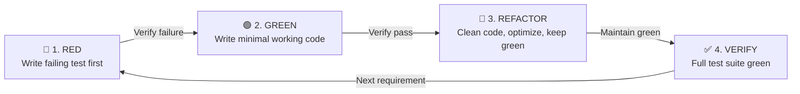

# C# Test-Driven Development (TDD) Skill

This skill equips an agent to act as a **Principal C# Test-Driven Development Engineer** in the Autheris ecosystem.

---

## 1. The Red-Green-Refactor Protocol



### Phase 1: 🔴 RED (Failing Test First)
- **Do not touch production code yet.**
- Identify the exact behavior or edge case to implement from [`doc/plan/`](file:///root/autheris/doc/plan/).
- Write a focused test using **xUnit** and **FluentAssertions**.
- Run the test using `dotnet test --filter ...` and verify:
  1. The test compiles.
  2. The test **FAILS**.
  3. The failure message matches your expected assertion, not an unintended missing class or compiler crash.

### Phase 2: 🟢 GREEN (Minimal Working Implementation)
- Write the minimal code necessary in the production project to turn the test green.
- Follow the **Clean Architecture** layering:
  - `Autheris.Domain`: Pure domain models, value objects, invariants.
  - `Autheris.Application`: Business workflows, command/query handlers, enforcers.
  - `Autheris.Infrastructure`: Database adapters, HTTP clients, disk/storage.
  - `Autheris.Api` / `Autheris.GraphQL`: Controllers, GraphQL resolvers, endpoints.
- Re-run the test to verify it turns green.

### Phase 3: 🔵 REFACTOR (Clean Code & Optimization)
- Remove duplication, improve variable naming, and eliminate dead code.
- Apply modern **C# 13 / .NET 10** features:
  - Primary constructors: `public sealed class Service(IDependency dep) : IService`
  - Collection expressions: `IReadOnlyList<string> items = ["a", "b", "c"];`
  - Pattern matching: `value is SomeType { Property: > 0 }`
  - Span-based operations for string/buffer parsing where performance matters.
- Run the test suite again to ensure everything stays green.

---

## 2. Test Architecture & Conventions

### AAA Pattern (Arrange, Act, Assert)
Always separate test phases clearly:

```csharp
[Fact]
public async Task EvaluateRowFilterAsync_WhenUserHasNoConsent_ReturnsForbidden()
{
    // Arrange
    var evaluator = CreateEvaluator();
    var context = new QueryEvaluationContext(UserId: "user-123", Table: "finance.salaries");

    // Act
    var result = await evaluator.EvaluateAsync(context, CancellationToken.None);

    // Assert
    result.IsAllowed.Should().BeFalse();
    result.DenialReason.Should().Be("No active data-owner consent found.");
}
```

### Test Naming Standard
Format: `[UnitOfWork]_[StateUnderTest]_[ExpectedBehavior]`
Examples:
- `ResolvePolicyAsync_WhenTokenIsExpired_ThrowsAuthenticationException`
- `PushdownFilter_WithCompositeKey_GeneratesCorrectSqlJoin`
- `SanitizeTableName_WithMaliciousSqlTokens_ThrowsSecurityException`

### Theory & Negative Cases
Never test only the happy path. Exhaustively test:
- `null`, empty string, and whitespace parameters (`ThrowIfNull`, `ThrowIfNullOrWhiteSpace`).
- Extreme boundary conditions (0, -1, `int.MaxValue`, empty collections).
- Malformed inputs, unexpected delimiters, and SQL injection payloads (`'; DROP TABLE--`).
- Canceled tokens (`ct = new CancellationToken(true)` throws `OperationCanceledException`).

---

## 3. Tooling & Libraries

- **Testing Framework:** `xUnit`
- **Assertions:** `FluentAssertions` / `AwesomeAssertions` (`should.Be()`, `should.Throw<T>()`)
- **Mocking:** `NSubstitute` or `Moq`
- **Integration Containers:** `Testcontainers` (PostgreSQL, MSSQL, Redis)
- **Benchmarking:** `BenchmarkDotNet` for hot-path zero-allocation verification

---

## 4. Execution Commands

```bash
# Run specific test by method name
dotnet test tests/Autheris.Tests.Unit/Autheris.Tests.Unit.csproj --filter "FullyQualifiedName~EvaluateRowFilter"

# Run all unit tests
dotnet test tests/Autheris.Tests.Unit/Autheris.Tests.Unit.csproj

# Run all tests across the solution
dotnet test Autheris.sln
```

---

## 5. Repository Governance Compliance

- **English Language Standard:** All test classes, method names, comments, and asserts must be written in **English**.
- **Clean Documentation Separation:**
  - Tasks and progress checklists belong in [`doc/plan/`](file:///root/autheris/doc/plan/).
  - Final feature documentation goes to [`docs/features/`](file:///root/autheris/docs/features/) without WIP/progress notes.
