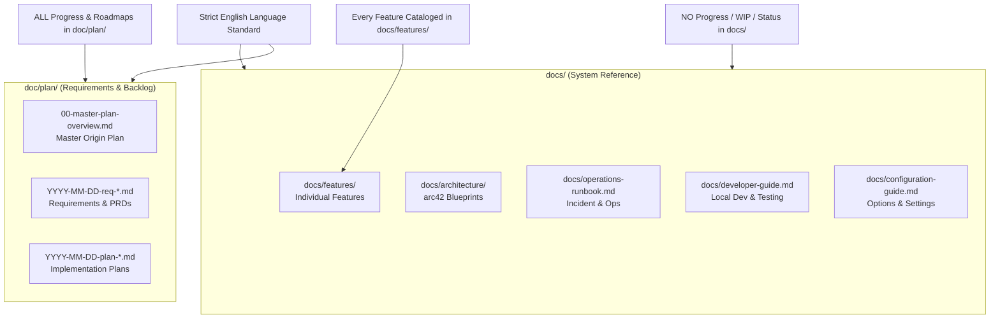
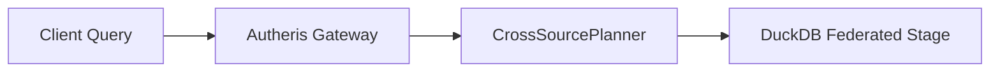

# Technical Documentation Expert & Architect Skill

This skill equips an agent to act as the **Principal Technical Documentation Specialist** for the Autheris ecosystem.

---

## 1. Core Responsibilities & Golden Rules



### Rule 1: Strict English Language Policy
- All documentation across `docs/`, `doc/plan/`, and `README.md` **must be written in English**.
- Technical terms, code symbols, configuration keys, and error codes must be accurately cited in backticks (e.g. `GatewayOptions`, `TableAccessPolicy`).

### Rule 2: Strict Ban on Development Progress in `docs/`
- Documentation files describe the **actual working software**: how components connect, how to configure them, how APIs behave, and how operators respond to incidents.
- **Never include:**
  - Status labels (`Status: Done (100% GA)`, `Status: Proposed / In Design`, `In Arbeit`).
  - Sprint / milestone progress notes (`Sprint 2 progress`, `80% implemented`).
  - Task checklists (`- [ ]`, `- [x]`) or author work logs.
- When finding existing files with development status headers, remove the status metadata and focus purely on describing the feature's architecture and usage.

### Rule 3: All Progress, Backlogs, & Roadmaps Belong in `doc/plan/`
- All requirement specifications, implementation steps, task checklists, and status transitions reside in [`doc/plan/`](file:///root/autheris/doc/plan/).
- The central coordination hub is [`doc/plan/00-master-plan-overview.md`](file:///root/autheris/doc/plan/00-master-plan-overview.md).

### Rule 4: Every Feature Documented in `docs/features/`
- Every individual feature must have a dedicated markdown document under [`docs/features/`](file:///root/autheris/docs/features/):
  `docs/features/f-<category>-<number>-<slug>.md`
- Every document must be indexed in [`docs/features/README.md`](file:///root/autheris/docs/features/README.md).

---

## 2. Feature Documentation Template (`docs/features/f-*.md`)

When authoring a feature document in `docs/features/`, use this canonical structure:

```markdown
# [Feature Title, e.g. F-GOV-14: Federated Virtual Filters on Web-APIs via DuckDB]

**Feature-ID:** F-GOV-14  
**Category:** Governance & Row-Level Security  
**Components:** 
- Domain: [`VirtualFilterModels.cs`](file:///root/autheris/src/Autheris.Domain/Model/VirtualFilterModels.cs)
- Application: `CrossSourcePlanner.cs`, `FederatedDuckDbExecutionService.cs`
- Persistence: `VirtualFilterStore.cs`

---

## 1. Executive Summary & Problem Statement
### 1.1 The Challenge
Explain the concrete architectural or business challenge without this feature.

### 1.2 The Solution
Describe how the feature solves the challenge, core guarantees, and advantages.

---

## 2. Architecture & Request Lifecycle
Detailed explanation with a Mermaid diagram depicting the execution flow:



---

## 3. Configuration & Options
Explain all relevant `appsettings.json` properties, defaults, and validation invariants:

```json
{
  "Gateway": {
    "VirtualFilters": {
      "MaxPushdownKeys": 100,
      "ExecutionStrategy": "Adaptive"
    }
  }
}
```

---

## 4. Usage Examples & Endpoints
Show concrete GraphQL queries/mutations, REST payloads, or SQL statements demonstrating how clients and operators interact with the feature.

---

## 5. Security, Zero-Trust & Fail-Closed Behavior
Detail the security boundaries, authorization checks, and error responses (e.g. 403 Forbidden on uncovered scopes).
```

---

## 3. Quality & Maintenance Checklist

Before committing any documentation changes, verify:
- [ ] Language is 100% English.
- [ ] No progress, status tags, or task checklists exist in `docs/`.
- [ ] If an individual feature was added, it is placed in `docs/features/` and indexed in `docs/features/README.md`.
- [ ] All code links are valid and accurately reference existing repository paths.
- [ ] All Mermaid diagrams render without syntax errors.
