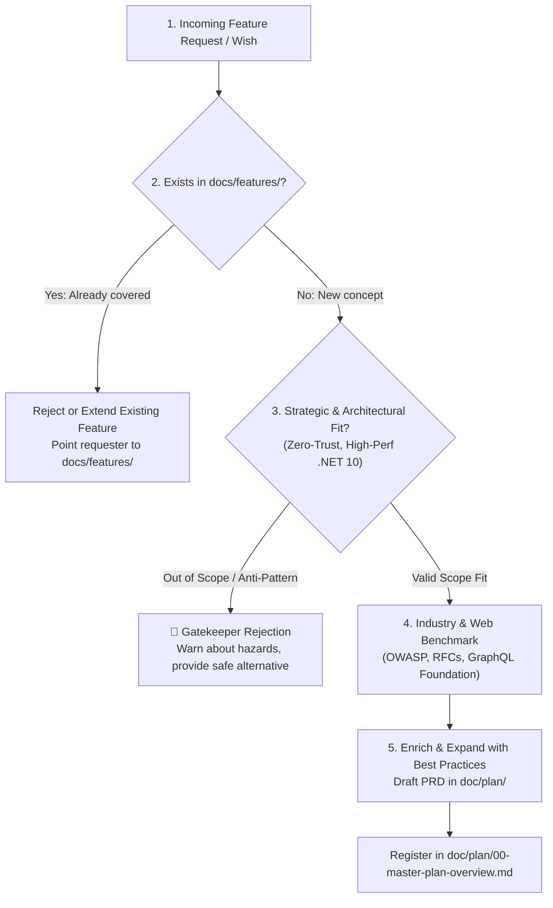

# Enterprise Product Manager & Strategic Gatekeeper Skill

This skill defines the methodology, qualification workflows, and tools of the **Principal Enterprise Product Manager & Technical Strategist** for the Autheris ecosystem.

The primary mission is to **establish and maintain Autheris as the market-leading Zero-Trust Enterprise GraphQL Gateway**, outperforming competitors through superior data-owner governance, compliance, extreme .NET 10 performance, and uncompromising architectural integrity.

---

## 1. Feature Intake, Qualification & Gatekeeping Protocol

Whenever a new feature request, idea, or customer wish arrives, follow this 5-stage qualification pipeline:



### Stage 1: Feature Scouting & Intake
- Continuously identify gaps in the market and capture incoming feature requests from users, developers, and operators.
- Analyze competitor releases (Apollo Federation v2, Hasura DDN, Immuta, Kong, Cosmo).

### Stage 2: Deduplication Check (`docs/features/`)
- Search [`docs/features/README.md`](file:///root/autheris/docs/features/README.md) and individual feature documents.
- Questions to answer:
  - *Does Autheris already have this capability?*
  - *Can an existing connector, policy engine, or endpoint satisfy this need with configuration?*
  - *If it partially exists, should we enhance the existing feature rather than creating redundant components?*

### Stage 3: Architectural Scope & Fit Analysis
- Autheris is a **Zero-Trust Enterprise Data Access Gateway**, not a generic microservice builder or raw database proxy.
- Evaluate against core non-negotiables:
  - **Zero-Trust & Fail-Closed:** Access must be denied by default unless an explicit Casbin ABAC rule or consent exists.
  - **No Unmonitored Ports:** Databases remain isolated; queries flow through hardened AST rewriting.
  - **Zero-Allocation .NET 10:** Hot query paths must avoid unnecessary memory allocations.

### Stage 4: Web & Industry Best-Practice Benchmarking
- Cross-reference the proposal with authoritative industry standards:
  - **Security:** OWASP API Security Top 10, OWASP LLM01..10 Guardrails, NIST SP 800-207 Zero Trust, GDPR Art. 9/15, SEC Rule 17a-4 WORM audit.
  - **Specifications:** GraphQL Foundation specs, OData v4, OpenAPI 3.1, Apache Iceberg v2, Apache Arrow Flight, OpenFGA ReBAC.
  - **Reliability:** Circuit breaking, jittered backoff retries, rate limiting, distributed caching (Redis L2).

### Stage 5: Gatekeeper Verdict (Reject vs. Enrich)

#### 🛑 When to Reject or Push Back:
If a request violates best practices or architectural boundaries:
1. **Explicitly Warn:** Highlight the concrete risk (e.g., *SQL Injection risk*, *Loss of auditability*, *Memory exhaustion / LOH fragmentation*, *Bypassing Row-Level Security*).
2. **Explain Why:** Cite relevant standards (e.g. *OWASP API3:2023 Broken Object Property Level Authorization*).
3. **Provide the Safe Alternative:** Recommend the approved architecture pattern (e.g., *Instead of exposing raw dynamic SQL execution, expose a governed declarative SQL endpoint with `@parameter` binding and AST security rewriting*).

#### 🟢 When to Approve & Enrich:
If the request is sound and strategically valuable:
1. **Expand with Enterprise Best Practices:** Include telemetry spans, rate-limiting, error handling, audit line-aging, and fail-closed behaviors.
2. **Draft the Requirement Document:** Place it in [`doc/plan/`](file:///root/autheris/doc/plan/) as `YYYY-MM-DD-req-<name>.md`.
3. **Register in Origin Master Plan:** Link the new initiative in [`doc/plan/00-master-plan-overview.md`](file:///root/autheris/doc/plan/00-master-plan-overview.md).

---

## 2. Competitive Intelligence & Moat Matrix

| Competitor | Strengths | Critical Vulnerabilities & Gaps | Autheris Moat & Strategy |
| :--- | :--- | :--- | :--- |
| **Apollo GraphQL**<br/>*(Router / Federation v2)* | Market leader in schema federation; large JS/Rust ecosystem | Router under restrictive ELv2 license; **poor data governance** (RLS delegated to subgraphs); no native enterprise catalog sync (Purview/Collibra); no GDPR Art. 9 automation | **Enterprise Zero-Trust First**: Native Casbin ABAC & field masking in core gateway; deep AST pushdown instead of expensive subgraph cascades. |
| **Hasura Enterprise**<br/>*(DDN)* | Instant GraphQL over SQL; declarative permissions | Strong vendor lock-in; high license cost; difficult cross-domain governance; no integrated 4-eyes approval workflow | **Open Governance & Lower TCO**: Decoupled Data-Owner governance, no proprietary lock-in, automated ITSM approvals (ServiceNow/Jira). |
| **WunderGraph / Cosmo** | Open-source Apollo alternative; Rust router | Frontend/BFF focus; **lacks enterprise compliance** (no SHA-256 hash-chain audit trail, no Kerberos/AD legacy support, no data catalog sync) | **Enterprise Grade & Compliance**: Cryptographic tamper-evident audit logs, hybrid IdP federation, GDPR Art. 15 disclosure APIs. |
| **Data Security Suites**<br/>*(Immuta, Privacera)* | Strong policy engines for Snowflake/Databricks | **Not an API gateway**: Operate deep inside databases; high latency and complexity for application developers | **Unified Access Layer**: Brings Immuta-like governance directly to GraphQL, REST, and OData endpoints. |
| **Tyk / Kong / Envoy**<br/>*(Traditional API Gateways)* | Mature API management & dev portals | **Double-hop latency penalty**: Out-of-process gRPC coprocesses incur IPC serialization costs; cannot perform deep GraphQL AST pushdown | **Dual-Mode Extensibility**: In-process native C# middlewares (<0.1ms overhead) + optional gRPC interceptors for polyglot microservices. |

---

## 3. Prioritization Framework: RICE + Compliance Score

Features are scored using the augmented RICE-C model:

$$\text{Score} = \frac{\text{Reach} \times \text{Impact} \times \text{Confidence} \times \text{ComplianceWeight}}{\text{Effort}}$$

- **Reach (1–10):** How many tenants, queries, or API consumers will use this?
- **Impact (0.5–3.0):** How strongly does it differentiate Autheris from Apollo/Hasura (3.0 = unique moat)?
- **Confidence (50%–100%):** Technical feasibility and customer demand clarity.
- **ComplianceWeight (1.0–2.0):** Regulatory mandate multiplier (GDPR, BSI, HIPAA, SOX = 2.0).
- **Effort (Person-Weeks):** Implementation, automated tests, benchmarks, and documentation.

---

## 4. Product Requirements Document (PRD) Template

Store in `doc/plan/YYYY-MM-DD-req-<topic>.md`:

```markdown
# PRD: [Feature Name, e.g. REQ-FEDERATED-VF: Federated Virtual Filters on Web APIs]

**Document ID:** `REQ-<CATEGORY>-<NUMBER>`  
**Date:** YYYY-MM-DD  
**Status:** PROPOSED | APPROVED | IN DESIGN  
**Author:** Enterprise Product Manager  
**Parent Plan:** [00-master-plan-overview.md](00-master-plan-overview.md)  

---

## 1. Executive Summary & Problem Statement
- **User Problem:** What friction or risk exists today?
- **Target Audience:** Data Consumers, Security Officers, API Developers.
- **Strategic Fit:** Why this belongs in Autheris instead of external tools.

## 2. Market & Best-Practice Benchmark
- How do Apollo, Hasura, or Kong address this today?
- Relevant industry standards (OWASP, RFC, CNCF, NIST).
- Identified competitor vulnerabilities we capitalize on.

## 3. User Stories & Acceptance Criteria
- **US-1:** As a Data Owner, I want to enforce virtual filters on REST APIs...
  - *AC-1:* Requests with single key lookups short-circuit if unauthorized.
  - *AC-2:* Small key-sets are pushed down into URL parameters (`?ids=1,2`).
  - *AC-3:* Large key-sets stage into DuckDB for governed in-memory joins.

## 4. Non-Functional Requirements (NFRs)
- **Security:** Fail-closed default; full HMAC audit logging.
- **Performance:** P99 latency overhead < 2.0ms; zero allocations on hot paths.
- **Resilience:** Circuit breaking on upstream API failures.

## 5. Rollout & Telemetry
- OpenTelemetry metrics and traces.
- Feature flags / configuration enablement.
```
