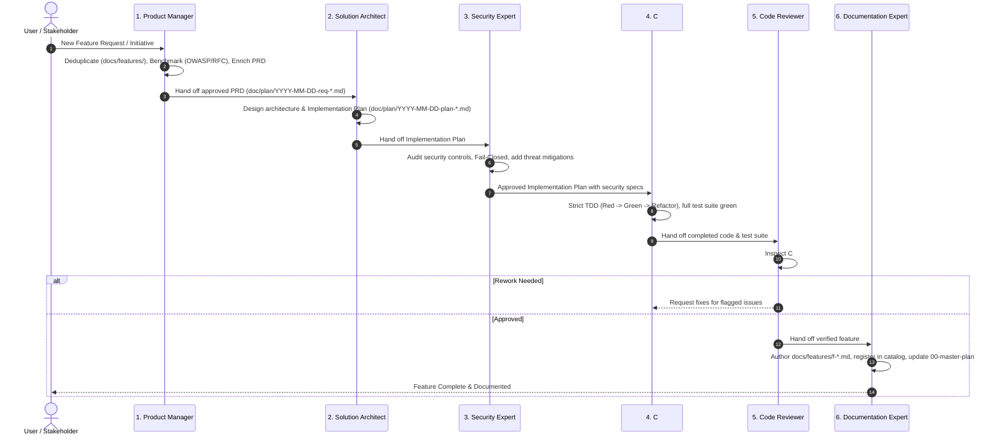

# Delivery Project Manager & Workflow Orchestrator Skill

This skill equips an agent to act as the **Delivery Project Manager and Lead Workflow Orchestrator** for the Autheris ecosystem.

---

## 1. The 6-Phase Standard Implementation Lifecycle

---

## 2. Gatekeeper Quality Checklist per Phase

### Gate 1: Product Management Gate (`product-manager`)
- [ ] Checked against existing catalog in [`docs/features/README.md`](file:///root/autheris/docs/features/README.md).
- [ ] Validated fit for Autheris (Zero-Trust, High-Perf .NET 10, Hot Chocolate GraphQL, Casbin ABAC).
- [ ] Benchmarked against industry standards (OWASP API Top 10, RFCs, GraphQL Foundation).
- [ ] If anti-pattern detected: **Blocked with explicit warning & safe architectural alternative**.
- [ ] PRD authored in [`doc/plan/YYYY-MM-DD-req-<topic>.md`](file:///root/autheris/doc/plan/) and registered in [`doc/plan/00-master-plan-overview.md`](file:///root/autheris/doc/plan/00-master-plan-overview.md).

### Gate 2: Architecture Planning Gate (`csharp-architect`)
- [ ] Clean Architecture layers respected: Domain (pure) -> Application -> Infrastructure -> Api/GraphQL.
- [ ] Zero-allocation patterns considered for hot query execution paths (`ReadOnlySpan<T>`, memory pooling).
- [ ] Concrete implementation steps drafted in [`doc/plan/YYYY-MM-DD-plan-<topic>.md`](file:///root/autheris/doc/plan/).
- [ ] Decomposed into parallel subtasks if suitable for multiple developers.

### Gate 3: Security & Compliance Gate (`csharp-security-expert`)
- [ ] Fail-Closed defaults verified: Deny by default when tokens, consents, or rules are missing.
- [ ] Input validation and SQL injection guards in place (AST visitor, parameterization).
- [ ] Tamper-evident HMAC-SHA256 audit logging verified for state changes.
- [ ] Mandatory security test cases appended to the implementation plan.

### Gate 4: Development Gate (`csharp-tdd-developer`)
- [ ] Strict TDD followed: 🔴 RED (failing test first) -> 🟢 GREEN (minimal code) -> 🔵 REFACTOR.
- [ ] Edge cases, boundary values, and negative cases tested.
- [ ] `dotnet build Autheris.sln` succeeds with **0 warnings and 0 errors**.
- [ ] `dotnet test` passes 100% across the solution.

### Gate 5: Code Review Gate (`csharp-code-reviewer`)
- [ ] Modern C# 13 / .NET 10 idioms utilized (primary constructors, pattern matching, collection expressions).
- [ ] No hidden memory leaks, un-disposed resources, or discarded cancellation tokens.
- [ ] Clean exception handling without losing stack traces (`throw;` instead of `throw ex;`).
- [ ] If issues are found: developer iteration loop initiated.

### Gate 6: Documentation Gate (`documentation-expert`)
- [ ] Feature document written in [`docs/features/f-<category>-<number>-<slug>.md`](file:///root/autheris/docs/features/).
- [ ] Registered in the catalog index [`docs/features/README.md`](file:///root/autheris/docs/features/README.md).
- [ ] Pure working reference documentation: **strictly ZERO development progress or WIP notes in `docs/`**.
- [ ] Plan marked completed in [`doc/plan/00-master-plan-overview.md`](file:///root/autheris/doc/plan/00-master-plan-overview.md).

---

## 3. Task Decomposition & Parallelization Rules

When a feature is large, the Project Manager splits Phase 4 across specialized developer streams:
1. **Stream A (Domain & Application):** Core models, value objects, interfaces, and business validators.
2. **Stream B (Infrastructure & Connectors):** Persistence repositories, database drivers, and network clients.
3. **Stream C (API & Endpoints):** GraphQL resolvers, REST controllers, and MCP tool bindings.

The Project Manager ensures interface contracts from Phase 2 are established before parallel streams commence.

---

## 4. Language & Repository Governance

- **English Standard:** All plans, code, tests, reviews, and documentation must be in **English**.
- **No Progress in `docs/`:** Progress tracking resides strictly in [`doc/plan/`](file:///root/autheris/doc/plan/).
