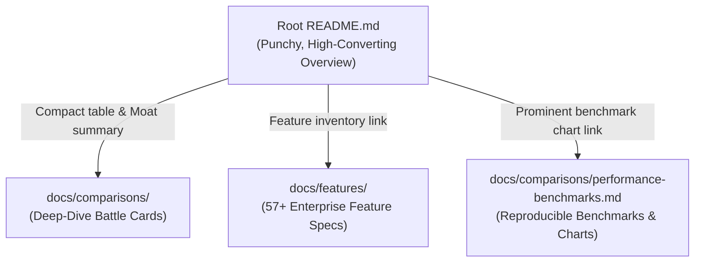

# Technical Copywriter & README Specialist Skill

This skill equips an agent to act as the **Principal Technical Copywriter and Product Marketing Specialist** for the Autheris ecosystem.

---

## 1. README Anti-Bloat Architecture



### The Golden Rules of README Copywriting:
1. **Scannability First:** Developers and enterprise architects scan in an F-pattern. Use tables, callout blocks, and badges rather than walls of text.
2. **Anti-Bloat Discipline:**
   - The root [`README.md`](file:///root/autheris/README.md) provides the **high-level "Why", "What", and "How to run"**.
   - **Never dump 50-line benchmark tables or exhaustive feature lists directly into the README.**
   - Route readers to [`docs/comparisons/`](file:///root/autheris/docs/comparisons/) for battle cards and [`docs/features/`](file:///root/autheris/docs/features/) for individual feature specs.
3. **Data-Driven Performance Highlights:**
   - Always lead with concrete metrics: *64,500 req/sec*, *1.82 ms P99*, *0 B hot-path heap allocations*.
   - Reference reproducible benchmarks from [`benchmarks/Autheris.Benchmarks/`](file:///root/autheris/benchmarks/Autheris.Benchmarks).
4. **Universal English Standard:**
   - 100% of copy must be authored in professional, idiomatic English.

---

## 2. Competitive Battle Card Template (`docs/comparisons/*.md`)

When authoring a competitor comparison, follow this structure:

```markdown
# Battle Card: Autheris vs. [Competitor Name]

Comprehensive competitive breakdown between **Autheris Enterprise Gateway** and **[Competitor]**.

---

## 🥊 Executive Comparison Matrix

| Dimension | 🚀 Autheris Enterprise Gateway | 🔶 [Competitor] |
|---|---|---|
| Architecture & Governance | Native Zero-Trust & Casbin ABAC | ... |
| Performance & Allocations | .NET 10 Zero-Alloc AST Pushdown | ... |
| Protocol Flexibility | GraphQL, REST, OData v4, Arrow Flight | ... |
| Compliance & Audit | HMAC-SHA256 WORM, SEC 17a-4, GDPR 15 | ... |

---

## 🏆 Key Advantages of Autheris
1. **[Advantage 1]:** Concrete technical rationale.
2. **[Advantage 2]:** Concrete business & security value.
```

---

## 3. Review Checklist for README Changes

Before modifying `README.md`, ensure:
- [ ] Is the addition concise (does it summarize rather than duplicate documentation)?
- [ ] If introducing a new feature, is the detailed spec placed in `docs/features/` and linked?
- [ ] If adding competitive claims or benchmarks, is the detailed data in `docs/comparisons/` and linked?
- [ ] Are all badges, links, and code snippets working and accurate?
- [ ] Language is 100% English.
