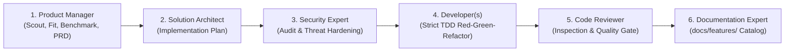

# Autheris Agent Governance & Engineering Instructions

This document governs all AI agents, assistant models (Antigravity, Claude, Copilot, Cursor, etc.), and human contributors working within the `Autheris` repository.

---

## 1. 🌐 Universal Language Requirement (Strict English Standard)

* **Universal Implementation Standard:** English is the **sole standard language** across the entire Autheris repository for:
  - All source code, unit/integration tests, docstrings, and inline code comments.
  - All documentation in `docs/` and planning files in `doc/plan/`.
  - The root [`README.md`](file:///root/autheris/README.md) and competitive comparisons in `docs/comparisons/`.
  - All git commit messages, PR descriptions, and inter-agent communication.
* **Alignment with Root README:** The canonical [README.md](file:///root/autheris/README.md) is written in English. All supporting documentation and code must consistently adhere to English.
* **Multilingual User Interaction:** While user discussions or prompts in conversational chats may occur in other languages (such as German), all generated repository artifacts, planning documents, code, and architectural decisions must strictly be authored in English.

---

## 2. 🚫 Strict Ban on Development Progress in Documentation (`docs/`)

> [!CAUTION]
> **Documentation (`docs/`) is strictly for actual system reference and user/operator manuals.**
> **Development progress notes, WIP statuses, and implementation roadmaps DO NOT BELONG in `docs/`!**

* **What belongs in `docs/`:**
  - Technical architecture (arc42), configuration guides, operational runbooks, API specifications, and feature manuals.
  - Documentation **must describe the actual, working state of the software as it currently exists**.
* **What is STRICTLY FORBIDDEN in `docs/`:**
  - **No development progress or status tags:** Never write `Status: In Progress`, `Status: Done (Wave 1)`, `WIP`, `Stand: YYYY-MM-DD`, `80% completed`, or `In Arbeit` inside `docs/` files.
  - **No sprint or task checklists:** Checklists (`- [ ]`, `- [x]`) and task breakdowns do not belong in system documentation.
  - **No implementation plans or roadmaps:** Documents titled `*implementation-plan*`, `*roadmap*`, or `*backlog*` must NEVER be placed in `docs/` (e.g. not in `docs/architecture/` or `docs/features/`).
  - **No personal/agent work logs:** Discussion of what an agent did today, what needs to be fixed tomorrow, or internal handoff notes.
* **Where does development progress belong?**
  - **EXCLUSIVELY in `doc/plan/`!** Every status update, roadmap, task checklist, and progress note must live in [`doc/plan/`](file:///root/autheris/doc/plan/) and be anchored in [`doc/plan/00-master-plan-overview.md`](file:///root/autheris/doc/plan/00-master-plan-overview.md).

---

## 3. 📁 Requirements & Planning Location (`doc/plan/`)

All new requirements, architectural designs, technical proposals, and implementation roadmaps **MUST be placed in `doc/plan/`** (symlinked to `docs/plans/`).

### Standardized Naming Convention
* **Requirements / PRDs:** `doc/plan/YYYY-MM-DD-req-<topic>.md`
* **Architecture Concepts & Designs:** `doc/plan/YYYY-MM-DD-concept-<topic>.md`
* **Implementation Plans & Roadmaps:** `doc/plan/YYYY-MM-DD-plan-<topic>.md`

---

## 4. 🎯 Origin Plan Protocol ("Ursprungsplan")

The central origin/master plan for the entire project is:
👉 **[`doc/plan/00-master-plan-overview.md`](file:///root/autheris/doc/plan/00-master-plan-overview.md)**

### Mandatory Workflow for All Agents:

1. **Consult the Origin Plan First:**
   Before beginning any work, analyze `doc/plan/00-master-plan-overview.md` to identify active tracks, architectural boundaries, and dependencies.
2. **Refine & Build on the Origin Plan:**
   Agents must never create isolated, disconnected plans. Any new requirement or feature stream must be registered in `00-master-plan-overview.md`.
3. **Continuous Plan Refinement:**
   When an agent refines an existing concept (e.g., breaking down a concept into execution steps, designing schema models, or writing test specifications), the agent must:
   * Update the specific detailed plan file in `doc/plan/`.
   * Update the status, checklist, and notes in the origin plan (`00-master-plan-overview.md`).
4. **Lifecycle & Status Transitions:**
   Track statuses in the origin plan table:
   * `PROPOSED` 📝
   * `IN PROGRESS` 🚀
   * `UNDER REVIEW` 🔍
   * `COMPLETED & VERIFIED` ✅
   * `DEPRECATED / ARCHIVED` 📦

---

## 5. 🌟 Individual Feature Documentation Location (`docs/features/`)

> [!IMPORTANT]
> **Every individual feature must always be documented in the [`docs/features/`](file:///root/autheris/docs/features/) catalog.**

* **Mandatory File Location & Naming:**
  - Individual feature specifications and technical reference docs **must always reside in `docs/features/`**.
  - File naming standard: `docs/features/f-<category>-<number>-<slug>.md` (e.g., `f-gov-14-federated-virtual-filters.md`, `f-ai-15-doc-mcp-gateway.md`).
* **Catalog Index Registration:**
  - Whenever a new feature document is created or updated, register it in the master feature index: [`docs/features/README.md`](file:///root/autheris/docs/features/README.md).
* **Required Content Structure:**
  1. **Executive Summary & Problem Statement**: What customer/architectural challenge is solved.
  2. **Architecture & Component Wiring**: Affected domain models, application services, DI extensions, and enforcers.
  3. **Configuration & Usage Examples**: Concrete `appsettings.json`, GraphQL queries/mutations, REST endpoints, or MCP tool invocations.
  4. **Security, Zero-Trust & Fail-Closed Behavior**: RLS pushdown, Casbin rules, and error handling.
* **Separation of Concerns Reminder:**
  - Feature documents in `docs/features/` describe **how the feature works and how to use it**.
  - Feature documents **MUST NOT contain development progress, WIP notes, sprint roadmaps, or task checklists** (those belong in `doc/plan/`).

---

## 6. 🔄 The 6-Phase Standard Implementation Lifecycle

Every feature, requirement, or significant change must pass through the standard 6-phase quality-gated delivery pipeline:

1. **Phase 1: Product Management (`product-manager`)**
   - Qualifies incoming requests, deduplicates against [`docs/features/`](file:///root/autheris/docs/features/), benchmarks with web/industry best practices (OWASP, RFCs).
   - Gatekeeper role: Rejects/warns on anti-patterns with safe alternatives. Enriches valid requests into PRDs in `doc/plan/YYYY-MM-DD-req-*.md`.
2. **Phase 2: Architectural Implementation Plan (`csharp-architect`)**
   - Designs architecture, interfaces, and concrete step-by-step implementation plan in `doc/plan/YYYY-MM-DD-plan-*.md`.
   - Splits into parallel developer streams if applicable.
3. **Phase 3: Security & Compliance Review (`csharp-security-expert`)**
   - Audits plan against Zero-Trust, Fail-Closed, Casbin ABAC, and HMAC audit requirements. Expands plan with security test criteria.
4. **Phase 4: Test-Driven Development (`csharp-tdd-developer`)**
   - Strictly applies Red-Green-Refactor with xUnit and FluentAssertions. Ensures full test suite is green.
5. **Phase 5: Code Review & Quality Gate (`csharp-code-reviewer`)**
   - Audits code quality, C# 13 idioms, allocation efficiency, and test completeness. Loops back to developers if issues arise.
6. **Phase 6: Documentation & Cataloging (`documentation-expert`)**
   - Authors official feature documentation in `docs/features/f-*.md` (without WIP notes), registers it in `docs/features/README.md`, and marks plan completed in `doc/plan/00-master-plan-overview.md`.

---

## 7. 🥊 Competitive Comparisons, Benchmarks & README Anti-Bloat (`docs/comparisons/`)

* **Role of `readme-copywriter`:**
  - Manages the root [`README.md`](file:///root/autheris/README.md), highlighting new features, moats, and performance numbers.
* **Strict Anti-Bloat Rule for `README.md`:**
  - The root `README.md` must stay punchy, scannable, and focused on the core "Why", "What", and "How to run".
  - **Never dump deep benchmark tables or exhaustive battle cards directly into `README.md`!**
* **Dedicated Comparison Hub (`docs/comparisons/`):**
  - All detailed competitive head-to-head comparisons and benchmark data must reside in [`docs/comparisons/`](file:///root/autheris/docs/comparisons/):
    - [`performance-benchmarks.md`](file:///root/autheris/docs/comparisons/performance-benchmarks.md): 64,500+ req/s, sub-ms P99 latency, 0B allocation charts.
    - [`autheris-vs-apollo.md`](file:///root/autheris/docs/comparisons/autheris-vs-apollo.md): AST pushdown & in-gateway RLS vs. delegated auth in subgraphs.
    - [`autheris-vs-hasura.md`](file:///root/autheris/docs/comparisons/autheris-vs-hasura.md): Open standards & low TCO vs. proprietary DDN lock-in.
    - [`autheris-vs-wundergraph-cosmo.md`](file:///root/autheris/docs/comparisons/autheris-vs-wundergraph-cosmo.md): Enterprise WORM compliance vs. pure BFFs.
    - [`autheris-vs-immuta.md`](file:///root/autheris/docs/comparisons/autheris-vs-immuta.md): Unified L7 API access vs. DB-specific storage plugins.
  - The root `README.md` includes only high-level summary tables linking directly to these battle cards.

---

## 8. 🏗️ Architectural & Security Principles

* **Zero-Trust & Fail-Closed:** Everything is denied by default unless covered by an explicit Casbin ABAC rule or approved Data-Owner Consent.
* **AST Pushdown First:** Row-level security and column masking must be rewritten directly into SQL/AST trees whenever possible, minimizing post-retrieval in-memory filtering.
* **High Performance .NET 10:** Zero-allocation patterns, memory pooling, and `ReadOnlySpan<T>` usage in hot paths.
* **Testing & Verification:** Every functional addition must include corresponding unit/integration tests under `tests/`. Always run `dotnet build Autheris.sln` before declaring tasks complete.
