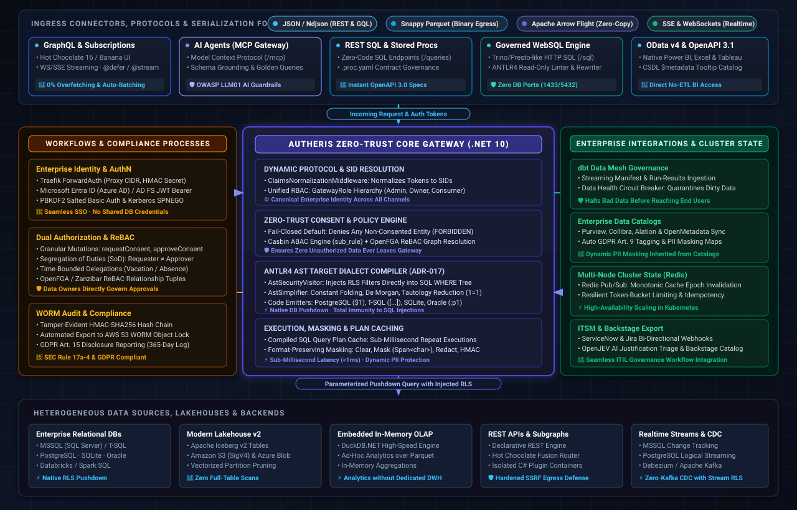

# Autheris - Enterprise GraphQL Gateway with Data-Owner-Consent

[](https://dotnet.microsoft.com/)
[](https://chillicream.com/)
[](#-agentic-ai--model-context-protocol-mcp-gateway)
[](#)
[](#)
[](#)
[](.github/workflows/ci.yml)
[](tests/Autheris.Tests.Unit)
[](security-review-2026-10-02.md)
[](https://github.com/themulle/autheris/pkgs/container/autheris)
[](docs/architecture/arc42.md)
[](#-architecture--capabilities-overview-at-a-glance)
[](docs/features/README.md)
[](#-license)

Autheris is a high-performance, secure, centralized enterprise GraphQL gateway built with **.NET 10** and **Hot Chocolate 16.6.7**. It provides unified GraphQL access to heterogeneous enterprise databases (**Microsoft SQL Server / MSSQL, SQLite, PostgreSQL, Databricks, Oracle**), modern **Apache Iceberg Lakehouses**, REST APIs, and federated **Hot Chocolate Fusion Subgraphs** while enforcing a strict **Zero-Trust Data-Owner-Consent** governance model.

Instead of traditional coarse-grained role-based access control (RBAC), access to tables, rows, and columns requires explicitly granted, time-bounded, and auditable consents governed directly by data owners.

> 📚 **Product & Architecture Documentation**:
> - [📋 Complete Enterprise Feature Catalog (docs/features/README.md)](docs/features/README.md) — Comprehensive inventory and deep-dive documentation for all 45+ enterprise features.
> - [🏛️ Architecture Documentation (arc42.md)](docs/architecture/arc42.md) — System context, building blocks, runtime view, and quality goals.
> - [🔒 Threat Model & Security Whitepaper](docs/threat-model/threat-model.md) — STRIDE analysis, attack surface, mitigation matrices, and cryptographic guarantees.
> - [⚙️ Configuration Guide](docs/configuration-guide.md) — Comprehensive reference of all `appsettings.json` sections and environment variables.
> - [🛠️ Endpoints & Testing Guide](docs/endpoints-and-testing.md) — Complete inventory of 100+ mapped API endpoints and testing strategy.

---



---

### 🎯 What Autheris Does & Core Business Value

Autheris is a **Zero-Trust Enterprise Data Access Gateway** that securely exposes heterogeneous data sources over modern protocols — **without opening direct database ports (1433/5432)** and **without unmonitored service accounts**.

| Dimension | Challenge Without Autheris | 🚀 Autheris Advantage & Value Added |
|---|---|---|
| **🛡️ Perimeter & Data Security** | Open database ports across corporate networks, static credentials, high risk of SQL injection, and data exfiltration. | **Zero-Port Exposure:** Databases remain isolated. All queries flow through hardened APIs with native ANTLR4 AST validation and rewriting. |
| **🔐 Access Control & Governance** | Rigid, coarse-grained RBAC; central IT assigns blanket rights; data owners have zero visibility or control. | **Data-Owner Consent & ReBAC:** Data owners govern table, row, and column permissions directly — with Dual Authorization (SoD) and vacation delegations. |
| **⚡ Performance & Scalability** | N+1 roundtrips in REST/GraphQL, slow full-table scans, high latency from post-retrieval in-memory filtering. | **Deep AST Pushdown & Plan Cache:** RLS predicates injected directly into the SQL `WHERE` tree; compiled query plan cache (<1ms latency) & L1/L2 Redis caching. |
| **🤖 Agentic AI & LLMs** | AI agents hallucinate schemas, execute destructive queries, and risk prompt injection attacks. | **Enterprise MCP Gateway:** Semantic schema grounding, golden queries, OWASP LLM01 guardrails, FOCUS FinOps token budgets, and HITL approvals. |
| **📜 Compliance & Audit** | Incomplete logs, high audit friction, and labor-intensive GDPR Art. 15 disclosure requests. | **Cryptographic WORM Audit:** HMAC-SHA256 tamper-evident hash chaining, SEC Rule 17a-4 S3 export, and one-click GDPR Art. 15 disclosure reports. |
| **🔌 Multi-Protocol Flexibility** | Data silos split between app developers (GraphQL/REST), BI analysts (Power BI/Excel), and data scientists (Python/Spark). | **Universal Data Access:** Identical governed data exposed as GraphQL, REST, WebSQL, OData v4, Apache Parquet, or Apache Arrow Flight. |

---

## 🌟 Complete Enterprise Feature Inventory

Autheris encompasses **45+ production-ready enterprise features**, documented in [`docs/features/`](docs/features/README.md). These capabilities are structured across 7 strategic pillars:

### Pillar 1: Multi-Protocol Data Access & Execution Engines

- **Enterprise GraphQL Gateway with Hot Chocolate 16.6.7**:
  - Dynamic schema generation and type projection driven by the active governance catalog.
  - Incremental data delivery via `@defer` and `@stream` ([`F-PERF-12`](docs/features/f-perf-12-incremental-delivery.md)) to dramatically reduce Time-to-First-Byte (TTFB) for large payloads.
  - GraphQL-to-SQL AST Single-Query Compiler ([`F-PERF-09`](docs/features/f-perf-09-single-query-pushdown.md)): Compiles deeply nested GraphQL selections directly into a single optimized SQL statement with relational `JOIN`s, eliminating N+1 roundtrips.
  - Cross-source joins run through the DuckDB OLAP endpoint; the multi-stage pushdown design ([`F-GOV-06`](docs/features/f-gov-06-cross-domain-joins.md)) is not implemented.
  - Dynamic Schema Contracts & Tag-Based Projection via `@tag` ([`F-GOV-08`](docs/features/f-gov-08-schema-contracts-tag-projection.md)).
  - OpenSchema Mode, Multi-File OpenAPI & Catalog Slicing ([`F-OPEN-01`](docs/features/f-open-01-openschema-catalog-slicing.md)).
- **Governed WebSQL Engine ([`F-DATA-02`](docs/features/f-data-02-governed-websql.md))**:
  - Secure HTTP-based SQL execution (`POST /api/v1/sql` & `/api/sql`) modeled after Trino/Presto — eliminates open database ports (1433/5432) across the corporate network.
  - AST-Level Security Linter & Rewriter (ANTLR4-based): Enforces strict read-only semantics (`SELECT`), rejects multiple statements (`;`), comments, and system functions (`@@`).
  - DML Guardrails (`WebSql.AllowDml`): DML requires dedicated `WebSql.DmlWriterRoles`; unfiltered `UPDATE`/`DELETE` queries (`WHERE 1=1`, `WHERE true`) are strictly rejected (`RejectUnfilteredDml`); automated transaction limits with rollback on exceeding `WebSql.MaxAffectedRows` (default: 1,000 rows); cryptographic audit logging of all DML events.
- **Declarative SQL-to-API REST Engine & Auto-OpenAPI 3.0 ([`F-SQL-01`](docs/features/f-sql-01-declarative-sql-endpoints.md))**:
  - Zero-code REST endpoints directly from versioned `.sql` files (`GET` / `POST /api/v1/queries/{name}`).
  - Universal parameter syntax: Automatic extraction and AST normalization for `@param` as well as mustache template syntax `{{param}}`.
  - Auto-generated OpenAPI 3.0 specification (`/api/v1/queries/openapi.json`) with embedded Swagger UI for interactive API exploration.
  - Automatic injection of tenant isolation, Casbin ABAC, and RLS filters into the compiled query plan.
- **Zero-Privilege Contract-First Stored Procedures ([`F-SQL-02`](docs/features/f-sql-02-governed-stored-procedures.md), `ADR-018`)**:
  - Declarative `.proc.yaml` contracts: Requires only `GRANT EXECUTE` in the production database (zero `VIEW DEFINITION` or DBA permissions required).
  - Source Column Governance (`source_table`, `source_column`): Transparently inherits table and column consents, ABAC rules, and masking policies onto stored procedure return types.
  - Fail-Closed Result Pruning: Undeclared result columns are stripped before leaving the gateway.
  - DDL Integrity Verification via SHA-256 (`integrity.ddl_hash`) to detect and reject unauthorized database schema drift.
  - Offline CI/CD generator tool (`ProcedureYamlGenerator`) for automated contract generation from staging databases.
- **Dual-Access OData v4 & Dynamic OpenAPI 3.1 ([`F-API-03`](docs/features/f-api-03-odata-openapi.md))**:
  - Full-featured OData v4 endpoint (`/odata/v4/{domain}/{schema}/{table}`) for standard BI clients (Power BI, Microsoft Excel, Tableau) with CSDL `$metadata`.
  - Dynamic OpenAPI 3.1 specification (`/odata/v4/$openapi`) with integrated offline-capable Swagger UI (`/docs`, `/ui/swagger`).
- **Apache Arrow Flight SQL & Arrow Binary Egress ([`F-DATA-04`](docs/features/f-data-04-arrow-flight-sql.md))**:
  - High-speed zero-copy columnar data transport for Data Science (Python Pandas, Polars, Apache Spark) via Apache Arrow Flight SQL (`/api/v1/flight/sql/*`) and Arrow Binary Export (`/api/v1/export/arrow`).
- **Hierarchical Apache Parquet Binary Egress ([`F-DATA-01`](docs/features/f-data-01-parquet-egress.md))**:
  - On-the-fly serialization to authentic, Snappy-compressed Parquet files across all data channels (GraphQL, WebSQL, SQL endpoints, OData) when requested via `Accept: application/vnd.apache.parquet`.
  - Strict Zero-Trust guarantee: Parquet serialization occurs post-RLS, post-masking, and post-consent — files contain only authorized, sanitized data.
- **Embedded In-Memory OLAP via DuckDB.NET ([`F-DATA-03`](docs/features/f-data-03-duckdb-olap.md))**:
  - Fast analytical query execution (`POST /api/v1/olap/query`) over in-memory tables and Parquet files without requiring a separate OLAP cluster.
- **Modern Lakehouse Connector (Apache Iceberg v2, `P4`)**:
  - Direct querying of Apache Iceberg v2 tables on Amazon S3 (SigV4), Azure Blob Storage, and local filesystems.
  - Vectorized partition pruning, min/max metadata statistics pruning, and L1 manifest caching.
- **Declarative REST Data Source Engine & Isolated C# Plugins (`P9`, [`F-ARCH-10`](docs/features/f-arch-10-connector-spi.md))**:
  - Integration of external REST APIs with URL templates, header pushdown (`X-Tenant-Id`, `X-User-Sid`), adaptive batching strategies, and built-in SSRF protection.
  - Standardized Connector SPI and isolated `AssemblyLoadContext` sandboxes for DLL/NuGet extensions without dependency conflicts.
- **Hot Chocolate Fusion Subgraph Router (`P7`)**:
  - Composes distributed microservice subgraphs into a unified supergraph schema with Zero-Trust token forwarding and in-memory result masking.

---

### Pillar 2: Zero-Trust Governance, Access Control & Privacy

- **Sovereign Data-Owner-Consent Engine (`P10`)**:
  - Fail-Closed default: Any entity, row, or column without explicit, valid consent returns `FORBIDDEN`.
  - Native Active Directory Windows Security Identifiers (`Sid`) for enterprise users and security groups.
  - Dual Authorization & Segregation of Duties (SoD): Requesters cannot approve their own requests; duplicate approvals are strictly blocked.
  - Time-bounded vacation delegations (`DATA_OWNER_DELEGATIONS`).
  - Distributed idempotency and replay protection: 24-hour distributed idempotency keys (`RedisIdempotencyStore`) preventing duplicate submissions.
- **Relationship-Based Access Control / ReBAC ([`F-SEC-04`](docs/features/f-sec-04-rebac-openfga.md))**:
  - Fine-grained authorization following the Google Zanzibar / OpenFGA model (`/api/v1/rebac/tuples`, `/check`, `/batch-check`).
  - Graph-based relation evaluation (e.g., `user:alice` is `editor` of `folder:finance` -> inherits `viewer` of `report:q4`).
- **Casbin ABAC / RBAC Engine**:
  - Dynamic attribute-based access control with sub-rule evaluation and standalone policy linter (`tools/casbin-policy-lint`).
- **Unified RBAC & Claims Normalizer (`ADR-017 Pillar 3`)**:
  - Central, type-safe `GatewayRole` enum with role inheritance hierarchy (`ClusterAdmin`, `GovernanceAdmin`, `DataOwner`, `DataConsumer`, `Auditor`, `PrivacyAdmin`, `FinOpsAdmin`, `SecurityAdmin`, `DbtAdmin`, `IngestionService`, `LLMAgent`).
  - `ClaimsNormalizationMiddleware` deterministically normalizes AD SIDs, OIDC claims, and certificates into canonical claims upon boundary entry.
  - `IGatewayRoleEvaluator` serves as the Single Source of Truth for all authorization decisions (including tenant-qualified roles `TenantId:Role`).
- **Column Masking & Differential Privacy**:
  - Column policies: `Clear`, `Mask` (format-preserving redaction via `ReadOnlySpan<char>`), HMAC-SHA256 pseudonymization (`HMACSHA256.HashData`), or `Deny`.
  - Side-Channel Inference Defense (Rule 5): GraphQL and SQL filters (`WHERE` clauses) on masked or denied columns are blocked with a `SecurityException` to prevent bisection and inference attacks.
  - Differential Privacy: Dynamic Laplace noise injection and epsilon budgeting for privacy-preserving analytical aggregations.
- **GDPR Art. 9 & Art. 15 Compliance**:
  - Automated protection for special category data (GDPR Art. 9: health, genetics, biometrics, religious beliefs): Automatically elevated to `HIGH` sensitivity, mandatory Dual Authorization, and `REDACT` masking (`[REDACTED-GDPR-ART9]`).
  - GDPR Art. 15 Disclosure Report (`gdprDataDisclosureReport`): Generates legally compliant disclosure reports covering all recipients, columns, masking rules, and purposes over a rolling 365-day retention window.
- **Cryptographic WORM Audit Logging (`P8`)**:
  - Unbroken HMAC-SHA256 hash chaining (`PrevHash -> EntryHash`) for every consent decision and data access event.
  - Automated export to WORM storage (AWS S3 Object Lock Compliance Mode / Read-Only Filesystem) satisfying SEC Rule 17a-4 and GDPR compliance standards.

---

### Pillar 3: Agentic AI & Model Context Protocol (MCP)

- **Enterprise MCP Server Gateway ([`ADR-014`](docs/adr/ADR-014-enterprise-model-context-protocol-and-ai-data-guardrails.md))**:
  - Standard I/O runner (`McpStdioRunner`) and streaming HTTP/SSE endpoints (`/mcp`, `/mcp/sse`) for AI agents (Claude, Cursor, LangChain).
- **MCP Dataset Tools ([`F-AI-11`](docs/features/f-ai-11-mcp-dataset-tools.md))**:
  - `list_datasets`, `describe_dataset` and `sample_rows` let agents discover every dataset they may use, with the same consent, row filter and masking rules as REST and GraphQL.
- **Semantic MCP Compiler & Schema Grounding ([`F-AI-02`](docs/features/f-ai-02-semantic-mcp-compiler.md))**:
  - Automatically transforms GraphQL and relational database schemas into semantically enriched, LLM-optimized tool signatures.
- **Dynamic Few-Shot Golden Query Injection ([`F-AI-03`](docs/features/f-ai-03-golden-queries.md))**:
  - Dynamically injects validated, canonical example queries into agent prompts to eliminate schema hallucinations.
- **Pre-Flight Query Simulator & Safety Limits ([`F-AI-04`](docs/features/f-ai-04-preflight-simulator.md))**:
  - Simulates query execution costs, query plans, and AST complexity prior to execution to protect backends from Denial-of-Service.
- **Human-in-the-Loop (HITL) Step-Up Approval ([`F-AI-05`](docs/features/f-ai-05-hitl-step-up-approval.md))**:
  - Generates approval tickets (`/api/governance/hitl/*`) with multi-node state synchronization for security-critical AI tool calls.
- **Explainable AI & Provenance Footnotes ([`F-AI-06`](docs/features/f-ai-06-provenance-footnoting.md))**:
  - Appends transparent provenance footnotes to AI tool responses, citing origin tables, applied masking rules, and audit trail references.
- **Dynamic Semantic Schema Pruning & Just-in-Time Tools ([`F-AI-07`](docs/features/f-ai-07-dynamic-semantic-schema-pruning.md))**:
  - Minimizes LLM token context by filtering schemas down to task-relevant entities and attributes.
- **FOCUS FinOps Token & Compute Accounting ([`F-AI-08`](docs/features/f-ai-08-focus-finops-accounting.md))**:
  - FinOps Open Cost and Usage Specification accounting (`/api/v1/finops/*`) with tenant- and user-level budget tracking for LLM tokens and compute latency.

---

### Pillar 4: AST Target Dialect Compiler Pipeline (`ADR-017` / `TrinoSqlEngine`)

- **High-Performance Compiler Architecture**:
  - Replaced brittle regex/token rewriting with a multi-stage ANTLR4-based AST compiler pipeline:
    1. ParseTree -> Strongly typed, dialect-neutral AST via `SqlAstBuilder`.
    2. `AstSecurityVisitor`: Direct in-tree injection of tenant isolation, Row-Level Security (RLS) predicates, and column masking rules.
    3. `AstSimplificationVisitor`: Compile-time constant folding, Boolean algebra simplification (identity laws, absorption, De Morgan's laws), tautology elimination (`1 = 1`), and contradiction detection (`1 = 0`).
    4. `ISqlDialectGenerator`: High-performance code emitters tailored to target dialects.
- **Multi-Dialect Code Generation**:
  - **PostgreSQL**: Double-quoted lowercase identifiers, standard ANSI Boolean expressions, positional parameters (`$1, $2`).
  - **Microsoft SQL Server (T-SQL)**: Bracket identifiers `[...]`, Unicode string literals `N'...'`, wrapped Boolean projections (`CASE WHEN ... THEN 1 ELSE 0 END`), `OFFSET / FETCH` pagination, `@p1` parameters.
  - **SQLite**: Standard SQL types, identifier escaping, `?1` parameter emitters.
  - **Oracle Database**: Uppercase identifiers, double-quote escaping, omitted `AS` keyword on `FROM` table aliases, `NUMBER(1)` Booleans, `:p1` parameters, `OFFSET ... ROWS FETCH NEXT ... ROWS ONLY`.
  - **Analytical Dialects**: Dedicated AST generators for DuckDB, Databricks / Spark SQL, Snowflake, and Trino.
- **Compiled SQL Query Plan Cache (`ICompiledSqlQueryPlanCache`)**:
  - Thread-safe, tenant-isolated cache for compiled AST plans providing sub-millisecond latency for parameterized recurring queries.
- **Security Invariants**:
  - Recursion depth guards (Anti-DoS), subquery correlation cycle detection, strict parameter count limits, and total comment stripping.

---

### Pillar 5: Realtime Event Streaming & CDC (Change Data Capture)

- **GraphQL Subscriptions (`P5`)**:
  - Full WebSocket (`graphql-transport-ws`) and Server-Sent-Events (SSE) support with token authentication during `connection_init`.
- **In-Stream Row-Level Security (`StreamRlsPolicyEnforcer`)**:
  - Evaluates dynamic Casbin ABAC permissions for every emitted event and discards unauthorized events directly within the stream.
- **Native MSSQL Change Tracking Ingestion ([`F-CDC-02`](docs/features/f-cdc-02-mssql-change-tracking.md))**:
  - Continuous capture of modified database rows directly via SQL Server Change Tracking.
- **Zero-Kafka PostgreSQL CDC via Logical Streaming Replication ([`F-CDC-03`](docs/features/f-cdc-03-zero-kafka-postgresql-cdc.md))**:
  - Direct CDC streaming using PostgreSQL Logical Replication (`pgoutput` plugin) without requiring an intermediate Kafka cluster.
- **Debezium / Kafka CDC Ingestion**:
  - Decodes change events (`op: c, u, d`) with strict tenant stream isolation and in-stream column masking.

---

### Pillar 6: Data Catalog Integration & dbt Data Mesh

- **Multi-Catalog Connectors (`P1`)**:
  - Unified provider abstraction (`IDataCatalogClient`) for **Microsoft Purview** (Apache Atlas REST), **Collibra** (REST Core v2), **Alation** (API v2), and **OpenMetadata**.
  - **Mirror Mode** (synchronization into local governance store) and **Reference Mode** (federated on-demand metadata queries).
- **dbt Data Health Circuit Breaker ([`F-DBT-01`](docs/features/f-dbt-01-health-circuit-breaker.md))**:
  - Quarantines tables with failed `dbt test` runs (`CircuitBreaker: Open`) to halt corrupted data propagation to consumers.
- **dbt Model Contract Enforcement & Breaking-Change CI Gate ([`F-DBT-02`](docs/features/f-dbt-02-contract-enforcement.md))**:
  - Blocks breaking schema changes between dbt model contracts and active gateway schemas during CI/CD.
- **Live Telemetry in dbt Exposures ([`F-DBT-03`](docs/features/f-dbt-03-telemetry-exposures.md))**:
  - Feeds actual query frequencies and consumer metadata back into dbt `exposure` declarations.
- **Zero-Touch dbt Orchestrator Webhooks ([`F-DBT-04`](docs/features/f-dbt-04-orchestrator-webhooks.md))**:
  - Webhook endpoints (`/api/extensions/dbt/webhook`) for dbt Cloud, Airflow, and Dagster for instant schema synchronization.
- **Policy & RLS Auto-Sync ([`F-DBT-06`](docs/features/f-dbt-06-policy-rls-sync.md))**:
  - Automatically translates dbt security tags and row filters into Casbin ABAC rules and SQL RLS predicates.
- **Omnichannel Semantic Documentation Passthrough ([`F-DOC-01`](docs/features/f-doc-01-omnichannel-documentation.md))**:
  - Lossless propagation of Markdown descriptions from dbt and enterprise catalogs to GraphQL Banana Cake Pop, Swagger UI, MCP AI tool definitions, and OData CSDL `$metadata`.

---

### Pillar 7: Enterprise Identity, Edge Defense & Multi-Node Clustering

- **Multi-Protocol Authentication & Smart Scheme Selector**:
  - **Traefik Ingress ForwardAuth**: Validates proxy CIDR networks (`TrustedNetworks`) and timing-safe shared secrets (`X-Forwarded-Secret`).
  - **Microsoft Entra ID (Azure AD) & AD FS**: JWT Bearer tokens with claims transformation (`EnterpriseClaimsTransformation`).
  - **HTTP Basic Auth**: Dedicated verification endpoint (`/api/auth/login`) with PBKDF2 salted hashing in production.
  - **Kerberos / SPNEGO**: Windows Integrated Authentication with automated group SID resolution.
- **Pluggable Multi-Node Cluster State Synchronization (`ADR-017 Pillar 1`)**:
  - `IDistributedClusterStateProvider` with implementations for **Redis** (`RedisClusterStateProvider`) and In-Memory.
  - Synchronizes HITL Step-Up approval tickets, MCP sessions, FinOps token budgets, and token revocations across horizontally scaled Kubernetes pods.
  - Instant cluster-wide cache invalidation via Redis Pub/Sub policy epochs (`RedisEventBus`).
  - Resilient distributed token-bucket rate limiting (`RedisRateLimiterService`) with seamless fallback to `InMemoryRateLimiterService`.
- **Token Revocation Endpoint (`POST /api/admin/tokens/revoke`)**:
  - Cluster-wide JTI blacklisting for immediate token invalidation.
- **AST-Aware Production Traffic Shadowing & Dark Replay ([`F-OPS-01`](docs/features/f-ops-01-traffic-shadowing-dark-replay.md))**:
  - Asynchronous shadowing of live queries to benchmark and validate new versions without impacting production traffic.
- **SSRF Defense & Reverse Proxy Hardening**:
  - `SsrfProtectionHandler`: DNS pre-resolution blocks RFC 1918, loopback, link-local, and cloud metadata addresses (169.254.169.254).
  - Strict internal CIDR allowlists (`TrustedInternalNetworks`) for approved on-premises systems (Jira, ServiceNow).
  - HTTP redirects disabled (`AllowAutoRedirect = false`) to thwart redirect-based SSRF exploits.
- **Developer Quickstart & Insecure Mode Governance ([`F-DX-01`](docs/features/f-dx-01-developer-quickstart.md), `ADR-012`)**:
  - Turnkey getting-started container with embedded Microsoft Garnet cache and pre-seeded demo personas.
  - Strict startup validation: Risk switches categorized into `DANGER` (immediate startup abortion outside of `Development`) and `WARN` (production warning banners).

| Configuration Switch | Classification | Behavior |
|---|---|---|
| `danger_allow_anonymous_access`, `danger_bypass_consent_checks`, `danger_disable_column_masking`, `danger_allow_insecure_transport`, `danger_bypass_webhook_signature_validation`, `danger_bypass_mcp_auth`, `danger_bypass_websql_governance`, `OpenSchema`, `Itsm.LegacyGlobalWebhookSecret` | DANGER | Outside of `Development`, the gateway strictly refuses to start (`ValidateGatewayOptions`). `/health/ready` reports 503 Unhealthy. |
| `warn_allow_unmasked_ai_access`, `warn_mock_external_systems_if_unreachable`, `warn_auto_approve_access_requests`, `warn_disable_rate_limiting`, `warn_allow_unsigned_s3_requests`, `warn_fallback_default_tenant_for_webhooks` | DANGER (Legacy Prefix) | Fatal startup error outside of `Development`. |
| `warn_allow_all_cors_origins`, `warn_relaxed_query_limits`, `warn_enable_introspection`, `Catalog.AllowLegacyPayloadOnlySignature` | WARN | Permitted in production, but generates console warning banners and marks health status as `degraded`. |
| `WebSql.AllowDml` (+ mandatory `WebSql.DmlWriterRoles`) | Regular Option | Transactional DML execution with automated rollback and cryptographic audit trail logging. |

---

## 🏛 Architecture Overview

The solution adheres strictly to **Clean / Onion Architecture** principles with clear layer boundaries:

```
                  ┌───────────────────────────────┐
                  │       Autheris.Api          │  ASP.NET Core Host, Middleware,
                  │                               │  Health Checks, DI Configuration, Webhooks
                  └──────────────┬────────────────┘
                                 │
                  ┌──────────────▼────────────────┐
                  │      Autheris.GraphQL       │  Hot Chocolate Schema, Types, Subscriptions,
                  │                               │  Fusion Router, DataLoaders, MCP Server
                  └──────────────┬────────────────┘
                                 │
                  ┌──────────────▼────────────────┐
                  │     Autheris.Application    │  Use Cases, Consent Resolution, Masking,
                  │                               │  Casbin ABAC, RLS Generation, Streaming RLS
                  └──────────────┬────────────────┘
                                 │
         ┌───────────────────────┴───────────────────────┐
         │                                               │
┌────────▼───────────────────────┐             ┌─────────▼─────────────────────┐
│    Autheris.Infrastructure   │             │       Autheris.Domain       │
│                                │             │                               │
│ SQLite/ADO.NET, Redis/Memory,  │             │ Domain Entities, Value Objects│
│ Cryptography, OpenMetadataSync │             │ (Sid, TableIdentifier), Enums │
└────────────────────────────────┘             └───────────────────────────────┘
```

### Architecture: Core vs. Extensions

The Core (`src/*`) contains interfaces, execution orchestration, and governance logic (Consent, RLS, Masking, Ratchet, Outbox, and Stream Backbone). **All external system connectors** reside in `src/Autheris.Extensions` (one folder per integration) and are registered cleanly via `services.AddGatewayExtensions(gatewayOptions)` in `AddGatewayInfrastructure`:

| Integration | Extensions Folder | Remaining in Core | Background Worker Active When |
|---|---|---|---|
| Data Catalogs (Purview, Collibra, Alation, OpenMetadata) | `DataCatalog/` | Interfaces, `CatalogGovernanceRatchet`, OpenAPI Ingestion | `Gateway:Catalog:Enabled` |
| ITSM (ServiceNow, Jira, Webhooks) | `Itsm/` | `ItsmWorkflowDispatcher`, Recertification, Outbox Worker | `Gateway:Itsm:Enabled` (Core Worker) |
| OpenMetadata Policy Sync | `OpenMetadata/` | Interfaces | `Gateway:OpenMetadata:Enabled` |
| Lineage Export (OpenLineage, OpenJEV) | `Lineage/` | `LineageGraphStore`, Impact Analysis | – |
| Backstage Export | `Backstage/` | `IBackstageCatalogExportService`, Endpoints | – (Endpoints: `Gateway:Backstage:Enabled`) |
| CDC Sources (MSSQL Change Tracking, Debezium) | `Cdc/` | `InMemoryCdcEventChannel`, Stream RLS | `Gateway:MssqlChangeTracking:Enabled` |
| dbt, OData, Iceberg Lakehouse | `Dbt/`, `OData/`, `Lakehouse/` | Endpoints / Executor Pipeline | – |

Dependency Direction: Extensions → Application/Domain; Api → Extensions. Domain/Application/Infrastructure/GraphQL do not reference Extensions and contain no foreign system client SDKs (enforced by architecture tests `CoreLayers_ShouldNotHaveDependencyOnExtensions` and `CoreLayers_ShouldNotContainForeignSystemClients`). The shared `SsrfProtectionHandler` resides in `Autheris.Application.Security`.

**Internal Targets (On-Premises Integrations):** All HTTP clients within Extensions run through `SsrfProtectionHandler`, which blocks private, loopback, and cloud metadata addresses by default and strictly enforces HTTPS outside of Development. For internal on-premises systems such as Jira, ServiceNow, OpenMetadata, or OpenLineage within the corporate network, target hosts and CIDRs must be explicitly allowlisted:

```json
"Gateway": {
  "Egress": {
    "TrustedInternalHosts": [ "jira.corp.local", "servicenow.corp.local" ],
    "TrustedInternalNetworks": [ "10.20.0.0/16" ]
  }
}
```

Allowlisted destinations are exempt solely from the private address restriction. Cloud metadata endpoints (169.254.169.254, etc.), loopback addresses, and link-local ranges remain permanently blocked, and HTTPS remains strictly required outside of Development.

Additional Security Invariants (Audit E-01 through E-04):
- The allowlist applies only to integrations listed in `Egress:TrustedIntegrations` (default: `Itsm`, `Catalog`, `OpenMetadata`, `Lineage`; additionally permitted: `AuditWorm`, `Cdn`). `Lakehouse` can never use the allowlist because its target URLs originate from Iceberg metadata manifests.
- Entries are strictly validated at startup across all environments: invalid CIDRs, IPv4 subnets broader than /8, IPv6 subnets broader than /32, or subnets intersecting 0.0.0.0/8, 127.0.0.0/8, 169.254.0.0/16, 100.64.0.0/10, multicast/broadcast, `::`, `::1`, fe80::/10, `::ffff:0:0/96`, or fd00:ec2::/32 immediately abort startup. ULA networks (fc00::/7) for specific corporate sites remain permissible. An active allowlist is reported as a `WARN:` in the startup bypass inventory.
- Permanently blocked even for allowlisted targets: 0.0.0.0/8, `::`, 100.64.0.0/10, multicast, broadcast, IPv4-mapped addresses (normalized to IPv4), and metadata IPs (169.254.169.254, 169.254.170.2, 100.100.100.200, fd00:ec2::254, 168.63.129.16). Unresolvable hostnames result in immediate request rejection.
- All integration clients strictly disable HTTP redirects (`AllowAutoRedirect = false`): any 3xx response is treated as an error. Connections are established exclusively to validated IP addresses resolved at connect time (preventing DNS rebinding attacks). System proxy configurations (`HTTPS_PROXY`) remain exempt.

### Projects

| Project | Target | Description |
|---|---|---|
| [`Autheris.Domain`](src/Autheris.Domain) | `net10.0` | Value Objects (`Sid`, `TableIdentifier`, `CompositeKey`), Models, Options, Enums, `GatewayRole` |
| [`Autheris.Application`](src/Autheris.Application) | `net10.0` | Central execution engine (`GatewayExecutionService`), business services (`ConsentResolutionService`, `ColumnMaskingProvider`, `RlsFilterGenerator`), streaming RLS (`StreamRlsPolicyEnforcer`), MCP services, procedures (`ProcedureRegistrationService`), compiled plan cache (`CompiledSqlQueryPlanCache`) |
| [`Autheris.Infrastructure`](src/Autheris.Infrastructure) | `net10.0` | Persistence (`SqliteGovernanceRepository`, `SqlConnectionFactory`), Caching (`ConsentCacheService`), Multi-Instance Messaging (`RedisEventBus`), Rate Limiting (`RedisRateLimiterService`), Security Handlers (`ForwardAuthAuthenticationHandler`, `BasicAuthenticationHandler`), Cluster State (`RedisClusterStateProvider`) |
| [`Autheris.GraphQL`](src/Autheris.GraphQL) | `net10.0` | Hot Chocolate 16.6.7 GraphQL engine, dynamic schemas, Subscriptions, Fusion Router (`FusionGatewayExtensions`), MCP Server, queries & mutations |
| [`Autheris.Api`](src/Autheris.Api) | `net10.0` | ASP.NET Core Host, Basic Auth Login (`/api/auth/login`), ForwardAuth header security, rate limiting, anti-CSRF, health probes, ITSM webhooks, MCP endpoints, WebSQL, Declarative SQL & Stored Procedure endpoints, FinOps, ReBAC |
| [`Autheris.Extensions`](src/Autheris.Extensions) | `net10.0` | All connectors to foreign systems: Data Catalogs (Purview, Collibra, Alation, OpenMetadata), ITSM (ServiceNow, Jira, webhooks), OpenMetadata sync, dbt, OData, Iceberg Lakehouse, OpenLineage/OpenJEV, Backstage export, CDC sources (MSSQL Change Tracking, Debezium) |
| [`TrinoSqlEngine`](src/TrinoSqlEngine) | `net10.0` | High-performance ANTLR4 SQL Parser, AST Rewriter, WebSQL engine, multi-dialect AST generators (PostgreSQL, T-SQL, SQLite, Oracle, DuckDB, Databricks, Snowflake), and parameter extractor (1,072 tests) |
| [`Autheris.Benchmarks`](benchmarks/Autheris.Benchmarks) | `net10.0` | BenchmarkDotNet suites for throughput, cache hit/miss, and masking allocations |
| [`Autheris.Tests.Unit`](tests/Autheris.Tests.Unit) | `net10.0` | 2,288 Unit & Property-Based tests (xUnit, Shouldly, FsCheck, NSubstitute) |
| [`Autheris.Tests.Architecture`](tests/Autheris.Tests.Architecture) | `net10.0` | 12 NetArchTest/reflection rules enforcing Clean Architecture dependency directions (incl. Core vs. Extensions) |
| [`Autheris.Tests.Integration`](tests/Autheris.Tests.Integration) | `net10.0` | 239 End-to-end integration tests using `WebApplicationFactory<Program>` |
| [`Autheris.Extensions.Tests`](tests/Autheris.Extensions.Tests) | `net10.0` | 117 Unit & Integration tests for Iceberg Lakehouse, Data Catalogs, dbt, ITSM, and OData |

---

## 🚀 Quick Start

### Prerequisites

- [.NET 10.0 SDK](https://dotnet.microsoft.com/download/dotnet/10.0) or higher
- C# 14 compatible toolchain (Visual Studio 2026, JetBrains Rider 2025.3+, or VS Code with C# Dev Kit)

### 1. Build Solution

```bash
dotnet build Autheris.sln -c Release
```
*Note: The solution enforces `<TreatWarningsAsErrors>true</TreatWarningsAsErrors>` (0 warnings, 0 errors).*

### 2. Run Tests

```bash
dotnet test Autheris.sln -c Release
```
Currently passes **3,728 / 3,728 tests (100% green)** across all test suites:
- **1,072 TrinoSqlEngine & WebSQL Parser / Dialect Tests** (ANTLR4 parsing, AST statement validation, multi-dialect code generators for PostgreSQL, MSSQL, SQLite, Oracle, DuckDB, Databricks, parameter extraction, RLS AST-injection, type inference)
- **2,288 Unit Tests** (Authentication & ForwardAuth Security, Multi-Dialect RLS, Declarative SQL-to-API Execution, Contract-First Stored Procedures, Casbin ABAC Hot-Reload, Dual Authorization & Delegation Stress, Concurrency & Audit Replication, DataLoader Odd Batching, AST Filter Inference Defense, Zero-Allocation Column Masking, Downstream Lineage BFS, GDPR Art. 15 Disclosure, MCP Guardrails, Differential Privacy)
- **239 Integration Tests** (End-to-end GraphQL pipeline, Traefik ForwardAuth Ingress, Basic Auth Login & Query Verification, Declarative REST & Plugin Zero-Trust enforcement, Declarative SQL Endpoints & OpenAPI 3.0 Generation, Anti-CSRF, Dual Authorization Multi-Step Approval, Vacation Delegation, Red-Team Prompt Injection Defense, Insecure Mode Guardrails, Subscriptions & In-Stream RLS, Fusion Federation)
- **117 Extensions Tests** (Apache Iceberg v2 Lakehouse connector & partition pruning, Microsoft Purview, Collibra, Alation, OpenMetadata catalog sync, GDPR Art. 9 tag enforcement, dbt manifest ingestion & contract validation, ServiceNow/Jira webhooks, OData)
- **12 Architecture Tests** (Clean Architecture layering enforcement via NetArchTest including zero-dependency checks on AspNetCore in Domain and Application and the Core-vs-Extensions boundary)

### 3. Run Gateway via Docker Container (Fastest / Getting Started)

A turnkey container image featuring the integrated **Microsoft Garnet .NET Cache**, in-memory governance database (pre-seeded with 10 domains), and interactive web UI is available via GitHub Container Registry:

> **Security Notice:** The container starts in `Production` by default. The getting-started mode below
> explicitly sets `ASPNETCORE_ENVIRONMENT=Development` and the opt-in `AUTHERIS_ALLOW_DEV_IN_CONTAINER=true`,
> and is strictly intended for local developer evaluation.
>
> **Warning:** Development mode exposes built-in development users (for example `dev-admin` with
> ClusterAdmin rights) without real authentication. Always publish the ports on the loopback
> interface only (`127.0.0.1`), as shown below. Never bind them to `0.0.0.0` or a public address.

```bash
# Direct Docker run (Port 8080 HTTP) – local getting-started mode
docker run -d -p 127.0.0.1:8080:8080 \
  -e ASPNETCORE_ENVIRONMENT=Development -e AUTHERIS_ALLOW_DEV_IN_CONTAINER=true \
  -v autheris-data:/app/data \
  --name gql-gateway ghcr.io/themulle/autheris:getting-started

# Or via Docker Compose (Base = Production, Override = local Dev mode)
docker compose -f docker-compose.yml -f docker-compose.dev.yml up -d
```

#### Out-of-the-Box Endpoints on Port 8080:
- **Banana Cake Pop GraphQL IDE**: [`http://localhost:8080/graphql`](http://localhost:8080/graphql)
- **Swagger UI (REST / OpenAPI Explorer)**: [`http://localhost:8080/docs`](http://localhost:8080/docs) (Aliase: `/ui/swagger`, `$swagger`)
- **Declarative SQL OpenAPI 3.0 Specification**: [`http://localhost:8080/api/v1/queries/openapi.json`](http://localhost:8080/api/v1/queries/openapi.json)
- **Declarative SQL-to-API Endpoints**: `GET` / `POST http://localhost:8080/api/v1/queries/{name}`
- **Zero-Privilege Stored Procedures**: `POST http://localhost:8080/api/v1/procedures/{name}`
- **Governed WebSQL Execution**: `POST http://localhost:8080/api/v1/sql` & `/api/sql`
- **OData v4 Data Access (REST / Excel / Power BI)**: `GET http://localhost:8080/odata/v4/{domain}/{schema}/{table}`
- **OpenAPI 3.1 Specification (OData)**: [`http://localhost:8080/odata/v4/$openapi`](http://localhost:8080/odata/v4/$openapi)
- **Model Context Protocol (MCP for AI Agents)**: `POST http://localhost:8080/mcp`, SSE: `/mcp/sse`
- **Apache Arrow Flight SQL & Export**: `POST http://localhost:8080/api/v1/flight/sql/*`, `POST http://localhost:8080/api/v1/export/arrow`
- **DuckDB In-Memory OLAP**: `POST http://localhost:8080/api/v1/olap/query`
- **ReBAC Relationship Tuples & Check**: `POST http://localhost:8080/api/v1/rebac/tuples`, `/check`
- **FinOps Token & Compute Accounting**: `GET/POST http://localhost:8080/api/v1/finops/focus`, `/budget/{tenant}`
- **Human-in-the-Loop (HITL) Approvals**: `POST http://localhost:8080/api/governance/hitl/{pending,approve,reject}`
- **CDC Realtime Event Streaming**: `GET http://localhost:8080/api/v1/cdc/events`, `/subscriptions`
- **Token Revocation (JTI Blacklisting)**: `POST http://localhost:8080/api/admin/tokens/revoke`
- **Health Checks**: [`http://localhost:8080/health/live`](http://localhost:8080/health/live) & [`/health/ready`](http://localhost:8080/health/ready)

### 4. Run Gateway Locally from Source

```bash
dotnet run --project src/Autheris.Api/Autheris.Api.csproj
```

The service starts locally on `http://localhost:5000` (or `https://localhost:5001`). In `Development` mode, the Hot Chocolate Banana Cake Pop GraphQL IDE is accessible at:
- `http://localhost:5000/graphql`

---

## 🔒 Enterprise Authentication & Ingress Integration

Autheris features a Smart Dynamic Authentication Scheme Selector supporting multiple production and development authentication mechanisms:

### 1. Kubernetes Ingress / Traefik ForwardAuth
When running behind an ingress controller (such as Traefik Ingress) that performs authentication (via Authelia, Keycloak, Authentik, or OAuth2-Proxy):
- Ingress passes caller identity and groups via headers:
  - `X-Forwarded-User`: Username or user SID
  - `X-Forwarded-Groups`: Comma-separated group SIDs or names
  - `X-Forwarded-Roles`: Comma-separated roles (e.g. `GovernanceAdmin,DataOwner`)
  - `X-Forwarded-Email`: User email address
  - `X-Forwarded-Secret`: Pre-shared secret header ensuring header authenticity
- Gateway verifies incoming proxy IP against `TrustedNetworks` (CIDR blocks) and `TrustedProxies`.
- Timing-safe comparison of `X-Forwarded-Secret` against Key Vault / AppSettings.

```bash
curl -X POST http://localhost:5000/graphql \
  -H "Content-Type: application/json" \
  -H "GraphQL-Preflight: 1" \
  -H "X-Forwarded-User: S-1-5-21-CONSUMER-1" \
  -H "X-Forwarded-Groups: S-1-5-21-FINANCE-ANALYSTS" \
  -H "X-Forwarded-Secret: YOUR-SHARED-SECRET" \
  -d '{"query": "{ catalog { domain schemaName tableName displayName } }"}'
```

### 2. HTTP Basic Authentication & `/api/auth/login`
Supports direct Basic Auth headers on GraphQL requests and a dedicated login endpoint:
- `GET /api/auth/login` or `POST /api/auth/login` verifies credentials and returns user identity metadata.
- GraphQL queries authenticate directly via `Authorization: Basic base64(user:password)`.

```bash
# Verify credentials via login endpoint
curl -u "analyst:Secret123!" http://localhost:5000/api/auth/login

# Direct GraphQL query with Basic Auth
curl -X POST http://localhost:5000/graphql \
  -u "analyst:Secret123!" \
  -H "Content-Type: application/json" \
  -H "GraphQL-Preflight: 1" \
  -d '{"query": "{ catalog { domain schemaName tableName } }"}'
```

### 3. Microsoft Entra ID (Azure AD) & AD FS JWT Bearer
- Native JWT Bearer validation against Entra ID / ADFS authority.
- `EnterpriseClaimsTransformation` normalizes Active Directory object IDs (`oid`), on-premises SIDs (`onprem_sid`), and primary group SIDs (`primarygroupsid`) into canonical `ClaimTypes.PrimarySid` and `ClaimTypes.GroupSid`.

```bash
curl -X POST http://localhost:5000/graphql \
  -H "Authorization: Bearer eyJhbGciOi..." \
  -H "Content-Type: application/json" \
  -H "GraphQL-Preflight: 1" \
  -d '{"query": "{ catalog { domain schemaName tableName } }"}'
```

### 4. Authentication Simulation in Development
In `Development` mode (with `Gateway:Authentication:EnableTestAuthHandler = true`), you can test any SID, role, and group membership using custom HTTP request headers:

| Header | Description | Example |
|---|---|---|
| `X-Test-User-Sid` | Caller user SID | `S-1-5-21-DATAOWNER-1` or `S-1-5-21-CONSUMER-1` |
| `X-Test-Group-Sids` | Comma-separated group SIDs | `S-1-5-21-FINANCE-ANALYSTS,S-1-5-21-STAFF` |
| `X-Test-Roles` | Comma-separated roles | `GovernanceAdmin` or `ClusterAdmin` |
| `GraphQL-Preflight` | Anti-CSRF header (required on POST) | `1` |

> ⚠️ **Security Warning**: `TestAuthHandler` is strictly blocked in production environments (`IsProduction()`). Any attempt to enable it outside of `Development` triggers a fatal startup validation exception.

### Example: Query Gateway Schema (Introspection)

```bash
curl -X POST http://localhost:5000/graphql \
  -H "Content-Type: application/json" \
  -H "GraphQL-Preflight: 1" \
  -d '{"query": "{ __schema { queryType { name } } }"}'
```

### Example: Query Active Catalog via cURL

```bash
curl -X POST http://localhost:5000/graphql \
  -H "Content-Type: application/json" \
  -H "GraphQL-Preflight: 1" \
  -H "X-Test-User-Sid: S-1-5-21-CONSUMER-1" \
  -d '{"query": "{ catalog { domain schemaName tableName displayName isConsented columns } }"}'
```

### Example: Request Access to a Table

```bash
curl -X POST http://localhost:5000/graphql \
  -H "Content-Type: application/json" \
  -H "GraphQL-Preflight: 1" \
  -H "X-Test-User-Sid: S-1-5-21-CONSUMER-1" \
  -d '{"query": "mutation { requestTableAccess(domain: \"finance\", schema: \"dbo\", table: \"finance_table_1\", justification: \"Q4 Financial Audit Analysis\", daysValid: 30) { requestId status message } }"}'
```

---

## ⚙️ Configuration (`appsettings.json`)

Key configuration settings under the `Gateway` section:

```json
{
  "Gateway": {
    "HighAvailability": {
      "DrainDelaySeconds": 5,
      "ShutdownTimeoutSeconds": 40
    },
    "Authentication": {
      "Domain": "CORP.LOCAL",
      "EnableTestAuthHandler": false,
      "ForwardAuth": {
        "Enabled": true,
        "UserHeader": "X-Forwarded-User",
        "GroupsHeader": "X-Forwarded-Groups",
        "RolesHeader": "X-Forwarded-Roles",
        "SharedSecretHeader": "X-Forwarded-Secret",
        "SharedSecret": "YOUR-SHARED-SECRET",
        "RequireTrustedProxy": true,
        "TrustedNetworks": ["127.0.0.1/32", "::1/128", "10.244.0.0/16"]
      },
      "BasicAuth": {
        "Enabled": true,
        "Users": [
          {
            "Username": "analyst",
            "Password": "SecretPassword123!",
            "Roles": ["DataConsumer"],
            "UserSid": "S-1-5-21-CONSUMER-1",
            "GroupSids": ["S-1-5-21-FINANCE-ANALYSTS"]
          }
        ]
      },
      "EntraId": {
        "Enabled": false,
        "TenantId": "00000000-0000-0000-0000-000000000000",
        "ClientId": "00000000-0000-0000-0000-000000000000",
        "Audience": "api://gql-gateway"
      },
      "Adfs": {
        "Enabled": false,
        "MetadataAddress": "https://adfs.corp.local/federationmetadata/2007-06/federationmetadata.xml",
        "Audience": "microsoft:identityserver:gql-gateway"
      }
    },
    "GovernanceDb": {
      "Provider": "Sqlite",
      "ConnectionString": "Data Source=governance.db",
      "SeedDemoData": true
    },
    "DataSources": {
      "finance": {
        "Provider": "SqlServer",
        "ConnectionString": "Server=sql-finance.corp.local;Database=FinanceDb;Integrated Security=SSPI;"
      },
      "hr": {
        "Provider": "PostgreSql",
        "ConnectionString": "Host=pg-hr.corp.local;Database=HrDb;Username=gql_app;Password=secret"
      }
    },
    "Caching": {
      "L1MemoryCache": {
        "SizeLimitMb": 512,
        "DefaultTtlMinutes": 10
      },
      "Redis": {
        "Configuration": "redis-cluster.corp.local:6379,abortConnect=false"
      }
    },
    "ReverseProxy": {
      "Enabled": true,
      "KnownNetworks": ["127.0.0.1/32", "::1/128", "10.0.0.0/8"],
      "KnownProxies": []
    },
    "GraphQL": {
      "EndpointPath": "/graphql",
      "MaxAllowedExecutionDepth": 10,
      "MaxAllowedComplexity": 1500
    },
    "DataMasking": {
      "HmacKeyId": "key-2026-q1"
    },
    "Catalog": {
      "Enabled": true,
      "Provider": "MicrosoftPurview",
      "SyncMode": "Mirror",
      "SyncIntervalMinutes": 60,
      "Purview": {
        "Endpoint": "https://corp-purview.purview.azure.com",
        "TenantId": "72f988bf-86f1-41af-91ab-2d7cd011db47",
        "ClientId": "a820c78a-f326-4d1d-91b4-2195f1342618"
      }
    },
    "Insecure": {
      "warn_allow_all_cors_origins": false,
      "warn_disable_rate_limiting": false,
      "danger_bypass_authorization": false,
      "danger_allow_anonymous_queries": false,
      "danger_bypass_webhook_signature_validation": false
    }
  }
}
```

---

## 🔍 Data Catalog, Lineage & GDPR Operations

Autheris exposes comprehensive administrative and governance operations via GraphQL:

### 1. Synchronize Data Catalog (Microsoft Purview / Collibra / Alation / OpenMetadata)

Trigger an on-demand catalog sync (or dry-run) to mirror metadata and update GDPR Art. 9 / PII tag classifications:

```graphql
mutation SyncEnterpriseCatalog {
  syncDataCatalog(dryRun: false) {
    success
    syncedTablesCount
    syncedColumnsCount
    maskedColumnsCount
    art9ProtectedTablesCount
    affectedTables {
      domain
      schema
      tableName
    }
    warnings
  }
}
```

### 2. Pre-Schema-Change Impact Analysis (Downstream Consumers)

Before renaming or dropping columns, assess affected BI dashboards, ETL pipelines, and active readers:

```graphql
query AssessSchemaChangeImpact {
  tableConsumers(domain: "sales", schema: "dbo", tableName: "orders", timeWindowDays: 30) {
    table
    breakingChangeRisk # CRITICAL, HIGH, MEDIUM, LOW
    totalDownstreamCount
    activeReadersCount
    lastAccessedAt
    downstreamConsumers {
      id
      name
      type # Dashboard, Pipeline, ExternalService
      ownerTeam
      ownerEmail # Masked for non-admins (Zero-Trust)
      distanceFromRoot
    }
    runtimeConsumers {
      actorSid
      clientType # ServicePrincipal, InteractiveUser, DownstreamSystem
      queryCount
      lastSeenAt
    }
    recommendedMitigations
  }
}
```

### 3. GDPR Art. 15 Disclosure Reporting (Right of Access)

Generate legally binding disclosure reports under GDPR Article 15(1)(c) for auditors or data subjects:

```graphql
query GenerateGdprDisclosureReport {
  gdprDataDisclosureReport(
    domain: "healthcare"
    schema: "dbo"
    tableName: "patient_diagnoses"
    timeWindowDays: 365
  ) {
    targetTable
    totalAccessEvents
    sensitivityCategories
    legalBasisNotice
    disclosedRecipients {
      recipientSid
      recipientCategory
      purpose
      firstAccess
      lastAccess
      totalQueries
      accessedColumns
      maskingRuleApplied
    }
  }
}
```

## 📦 Parquet Egress Output

All data egress channels can deliver results as authentic Apache Parquet binary files (Parquet.Net, single row group, Snappy-compressed) instead of JSON:

```bash
curl -H "Accept: application/vnd.apache.parquet" -H "GraphQL-Preflight: 1" \
     -H "Content-Type: application/json" \
     -d '{"query":"{ table(domain:\"sales\", name:\"orders\") { jsonRows } }"}' \
     -o orders.parquet http://localhost:8080/graphql
```

- **Headers:** `Accept: application/vnd.apache.parquet` (alias `application/x-parquet`). Parquet format is selected only when explicitly requested with quality factor q > 0 and no other media type has higher preference (`*/*` does not trigger Parquet). Responses include `Content-Type: application/vnd.apache.parquet`, `Content-Disposition: attachment`, `X-Row-Count`, `X-Export-Truncated`, `Vary: Accept`, and `Cache-Control: no-store`.
- **Supported Channels:** GraphQL (`/graphql`), WebSQL (`POST /api/sql`, `/api/v1/sql`), SQL Endpoints (`/api/v1/queries/{name}`), and OData entity sets (`/odata/v4/{domain}/{schema}/{table}`). Other routes respond to pure Parquet accept headers with `406 Not Acceptable`; if the header includes `application/json` or `*/*`, JSON is returned normally.
- **Governance Integrity:** Conversion is a pure egress transformation applied strictly post-RLS, post-masking, post-consent, and post-egress interceptors—Parquet files contain the exact sanitized data of the JSON response (masked values remain masked).
- **Limits & Safeguards:** `GatewayOptions:ParquetEgress:MaxRowsPerFile` (default 100,000; exceeding results sets `X-Export-Truncated: true`), `MaxBufferedSourceBytes` (default 64 MB buffered JSON response; exceeding triggers HTTP `413`), `Compression` (`None`/`Snappy`/`Gzip`), `FlattenNestedStructures` (nested objects flattened to `parent.child` columns; arrays formatted as JSON strings).
- **GraphQL Semantics:** Exactly one root field per operation; row source is `jsonRows`, a collection named `rows`/`items`/`nodes`, `edges[].node`, or a list of objects. Scalar responses return `406 Not Acceptable`.
- **Errors Remain JSON:** GraphQL `errors` (header `X-Parquet-Conversion: skipped-errors`), policy/validation failures, and all non-200 HTTP statuses are delivered untouched as JSON.
- **Exempt Endpoints:** MCP (`/mcp`, JSON-RPC protocol), Subscriptions/SSE/WebSockets, Webhooks, Health, and Metrics are never converted.
- `GET /api/export/parquet/{domain}/{table}` continues to return schema-only scaffolding without rows.

## 📝 Code Review & Export Artifacts

For offline security audits, external architecture reviews, or LLM-assisted code reviews, pre-bundled review and diff files can be generated in the repository root:

| Artifact | Size | Description | Target Audience |
| :--- | :--- | :--- | :--- |
| [`review.txt`](file:///root/lis-git/autheris/review.txt) | ~436 KB | Consolidated bundle of all production C# source code (`src/**/*.cs`, 73 files) with a Table of Contents and standard file separators (`FILE: <path>`). | AI/LLM Reviewers, Single-File Ingestion |
| [`src_codebase_review.txt`](file:///root/lis-git/autheris/src_codebase_review.txt) | ~436 KB | Exact mirror of `review.txt` for tooling expecting the `src_codebase_review` naming convention. | Automated CI/CD Review Pipelines |
| [`full_codebase_review.txt`](file:///root/lis-git/autheris/full_codebase_review.txt) | ~812 KB | Extended bundle including all production (`src/`), test (`tests/`), and benchmark (`benchmarks/`) C# code (108 files total). | Comprehensive Test & Benchmark Audits |
| [`review_diff.patch`](file:///root/lis-git/autheris/review_diff.patch) / [`codebase.diff`](file:///root/lis-git/autheris/codebase.diff) | ~928 KB | Complete unified Git diff across all commits relative to upstream `origin/main`. | Git / Patch Tools, PR Reviewers |
| [`src_codebase.diff`](file:///root/lis-git/autheris/src_codebase.diff) | ~454 KB | Unified Git diff restricted strictly to production code under `src/`. | Production Code Reviewers |

### Re-generating Review Artifacts

To regenerate these review bundles and diffs after modifying code:

```bash
# 1. Regenerate production source bundle (review.txt)
(
  echo "================================================================================"
  echo "AUTHERIS PRODUCTION SOURCE CODE EXPORT (src/**/*.cs)"
  echo "Generated: $(date -u '+%Y-%m-%d %H:%M:%SZ')"
  echo "================================================================================"
  echo ""
  echo "TABLE OF CONTENTS:"
  find src -name "*.cs" | sort | while read -r f; do echo "  - $f"; done
  echo ""
  find src -name "*.cs" | sort | while read -r f; do
    echo "================================================================================"
    echo "FILE: $f"
    echo "================================================================================"
    cat "$f"
    echo ""
  done
) > review.txt

# 2. Regenerate git diffs against origin/main
git diff origin/main...HEAD > review_diff.patch
git diff origin/main...HEAD -- src > src_codebase.diff
```

---

## 📊 Benchmarks

Run the benchmark suite using BenchmarkDotNet:

```bash
dotnet run --project benchmarks/Autheris.Benchmarks/Autheris.Benchmarks.csproj -c Release
```

Included benchmark suites:
- **`ConsentResolutionBenchmark`**: Resolution latency across 100+ subject SIDs and permissive consent rules.
- **`ConsentCacheBenchmark`**: L1/L2 cache hit vs. miss latency with epoch invalidation checks.
- **`ColumnMaskingBenchmark`**: Throughput and memory allocation across Redaction, Masking, and HMAC Pseudonymization.
- **`GatewayLoadBenchmark`**: High-concurrency end-to-end GraphQL execution.

---

## 📚 Detailed Documentation

For comprehensive engineering and operational guides, consult the `docs/` directory:

- [**arc42 Architecture Documentation**](docs/architecture/arc42.md) – System context, building blocks, runtime view, deployment, and quality goals.
- [**Configuration Guide**](docs/configuration-guide.md) – Comprehensive reference of all `appsettings.json` sections, environment variables, startup validations, and production hardening.
- [**Developer Guide**](docs/developer-guide.md) – Guidelines for extending services, adding resolvers, writing TDD tests, and coding standards.
- [**Threat Model & Security Whitepaper**](docs/threat-model/threat-model.md) – STRIDE analysis, attack surface, mitigation matrices, and cryptographic guarantees.
- [**Operations & HA Runbook**](docs/operations-runbook.md) – Rolling updates, graceful traffic drain protocol, alerts, backup & restore procedures.
- [**Architecture Decision Records (ADRs)**](docs/adr/) – Key architectural decisions (ADR-001 through ADR-009).

---

## 📄 License

This repository follows a dual-licensing / Open-Core model:

- **Autheris Core (`src/` & `src/TrinoSqlEngine/`)**: Licensed under the **[Business Source License 1.1 (BSL 1.1)](LICENSE)**.
  - **Free for Internal Use**: Free to use in development, testing, and internal enterprise production environments.
  - **Cloud Hosting & Managed Services**: Offering Autheris as a hosted service, managed API gateway, or cloud service to third parties is strictly subject to a commercial license.
  - **Change License**: Transitions automatically to the **Apache License, Version 2.0** on **2029-10-01**.
- **Enterprise Extensions (`src/Autheris.Extensions/`)**: Proprietary enterprise modules (Apache Iceberg Lakehouse, Data Catalog Sync for Microsoft Purview/Collibra, ServiceNow/Jira ITSM, WORM S3 Compliance Export) are subject to a **[Commercial Enterprise License](LICENSE)**. Commercial distribution and reselling are reserved exclusively for the copyright holders.
