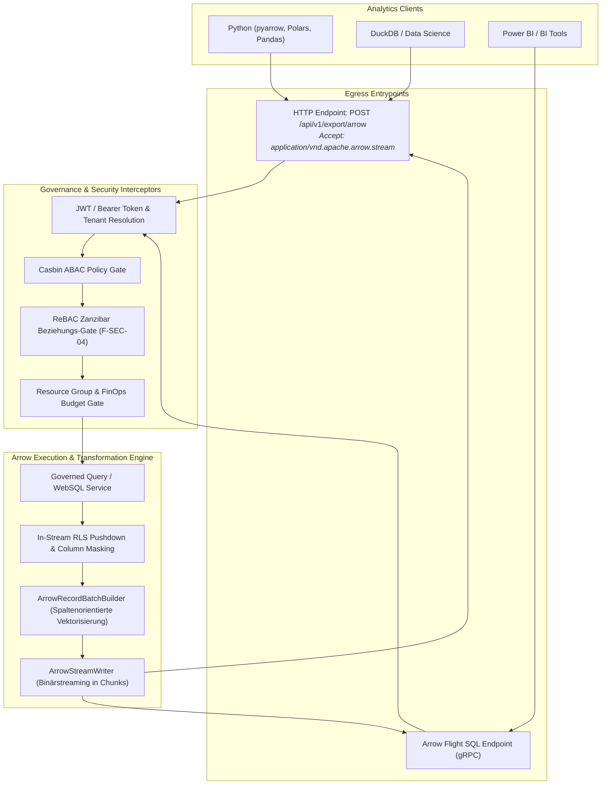

# Architektur-Implementierungsplan: Native Apache Arrow IPC & Flight SQL Egress (F-DATA-04)

**Datum:** 2026-10-03  
**Status:** In Umsetzung (Phase 4 – Analytics & Massendaten)  
**Rolle:** Platform & Data Architect  
**Scope:** Autheris (Application, Api, Domain, Infrastructure)  
**Bezug:** F-DATA-04, F-DATA-01 (Parquet Egress), F-DATA-02 (Governed WebSQL), F-SEC-04 (ReBAC)

---

## 1. Problemstellung & Business Value

### 1.1 Das Problem traditioneller API-Gateways bei Massendaten
Textbasierte Formate (JSON, CSV) und klassische REST/GraphQL-Antworten sind für Data-Science- und Analytics-Workloads (Pandas, Polars, DuckDB, Power BI) ungeeignet:
* **JSON-Serialisierungs-Overhead:** Bei 500.000+ Zeilen entfallen bis zu 70 % der Request-Zeit rein auf String-Konvertierung, Klammerung und UTF-8-Encoding.
* **Heap- & LOH-Belastung (Large Object Heap):** Große JSON-Strings erzeugen massive Garbage-Collection-Pausen in Kestrel / .NET.
* **Client-Deserialisierung:** Der Python-/Analytics-Client muss das JSON erneut parsen und zeilenweise in spaltenorientierte DataFrames konvertieren.

### 1.2 Die Lösung: Native Apache Arrow IPC & Flight SQL
* **Apache Arrow** ist der globale Standard für spaltenorientiertes In-Memory-Computing.
* **Arrow IPC Streaming Format (`application/vnd.apache.arrow.stream`):** Liefert binäre RecordBatches ohne Zwischenkonvertierung. Python (`pyarrow`) oder Polars können diese **Zero-Copy** direkt in DataFrames laden.
* **Arrow Flight SQL:** Bietet ein standardisiertes gRPC-Protokoll für tabellarische Datenabfragen mit integrierter Authentifizierung, Schemainformation (`GetFlightInfo`) und binärem Stream-Download (`DoGet`).
* **Durchsatzsteigerung:** Bis zu 20–50x schneller als JSON-Export bei 80 % weniger CPU-Last.

---

## 2. Ziel-Architektur & Komponenten



---

## 3. Technische Spezifikation der Komponenten

### 3.1 Domain-Modelle & Optionen (`Autheris.Domain`)
* **`ArrowExportOptions` in `GatewayOptions.cs`:**
  * `Enabled` (bool, default `true`)
  * `BatchSize` (int, default `64000` Zeilen pro RecordBatch zur Vermeidung von Speicherüberläufen)
  * `MaxExportRows` (int, default `1000000`)
  * `EnableFlightSql` (bool, default `true`)
* **`ArrowExportRequest` & `ArrowExportResult`:**
  * Kapselt SQL-Query, Tabellenreferenz, Parameter, Tenant, User-SID und Governance-Metadaten.

### 3.2 Spaltenorientierter RecordBatch-Builder (`ArrowRecordBatchBuilder`)
* Typ-Mapping von relationalen C#-Daten auf native Arrow `Field`- und `Array`-Typen:
  * `int`, `short`, `byte` $\rightarrow$ `Int32Array`
  * `long` $\rightarrow$ `Int64Array`
  * `double`, `float` $\rightarrow$ `DoubleArray`
  * `decimal` $\rightarrow$ `Decimal128Array`
  * `bool` $\rightarrow$ `BooleanArray`
  * `DateTime`, `DateTimeOffset` $\rightarrow$ `TimestampArray` (Microseconds / UTC)
  * `byte[]` $\rightarrow$ `BinaryArray`
  * `string`, `Guid`, sonstige $\rightarrow$ `StringArray`
* **Zero-LOH Chunking:** Daten werden in Batches von maximal `BatchSize` Zeilen aggregiert und sofort über `ArrowStreamWriter` in den Response-Stream geschrieben.

### 3.3 Application Service (`IArrowExportService` / `ArrowExportService`)
* **Schnittstelle:**
  ```csharp
  public interface IArrowExportService
  {
      ValueTask ExportToStreamAsync(
          IEnumerable<IReadOnlyDictionary<string, object?>> rows,
          Stream outputStream,
          CancellationToken ct = default);

      ValueTask<byte[]> ExportToBytesAsync(
          IEnumerable<IReadOnlyDictionary<string, object?>> rows,
          CancellationToken ct = default);
  }
  ```
* Pure Transformation-Pipeline: Verarbeitet ausschließlich Zeilen, die RLS und Maskierung bereits passiert haben.

### 3.4 REST & HTTP Minimal API (`ArrowExportEndpoints.cs`)
* `POST /api/v1/export/arrow`
* Content-Type: `application/vnd.apache.arrow.stream`
* Header `Content-Disposition: attachment; filename="export.arrow"`
* ReBAC- und Casbin-gesichert via `RequireRebac` / `EndpointSecurity`.

### 3.5 Arrow Flight Service (`ArrowFlightSqlService`)
* Flight-Ablauf:
  * `GetFlightInfo`: Validiert AuthN/AuthZ, ermittelt Schema und stellt Ticket aus.
  * `DoGet`: Verarbeitet Ticket, führt Abfrage aus und streamt Arrow-Batches über den Flight/gRPC-Kanal.

---

## 4. Phasenplan (TDD)
1. **Paket-Referenz:** Hinzufügen von `Apache.Arrow` (v23.0.0) zu `Autheris.Application`.
2. **Domain & Options:** Konfiguration und Request-/Response-Modelle.
3. **Core Builder & Serializer:** `ArrowRecordBatchBuilder` und `ArrowExportService`.
4. **API Endpoints:** `POST /api/v1/export/arrow` mit Content-Negotiation.
5. **Security & Integrationstests:** Strikte Validierung von PII-Maskierung, RLS-Einhaltung, ReBAC-Enforcement und DoS-Schutz.
