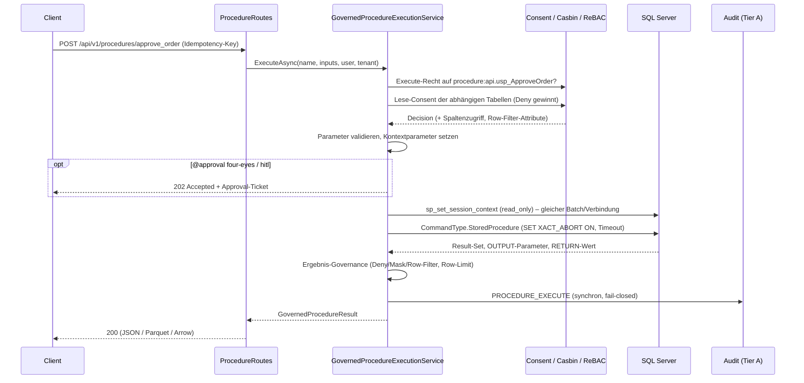

# Architektur-Implementierungsplan: Governed Stored Procedures (F-SQL-02)

**Datum:** 2026-10-05
**Status:** Entwurf, zur Freigabe
**Rolle:** C#/.NET Solution Architect
**Scope:** Autheris (Domain, Application, Infrastructure, Api)
**Bezug:**
- F-SQL-01 (Declarative SQL-to-API Engine & Auto-OpenAPI)
- F-DATA-02 (Governed WebSQL)
- F-SEC-04 (ReBAC)
- F-AI-05 (HitL)
- ADR-001 (Trusted Subsystem)

**Zieldatenbank Phase 1–2:** Microsoft SQL Server (MSSQL)

---

## 1. Problemstellung

**Ausgangslage:** Viele Fachsysteme kapseln ihre Logik in Stored Procedures. Beispiele sind Auftragsfreigaben, Buchungen und Reports mit komplexen Joins. Diese Prozeduren sind von DBAs optimiert, versioniert und oft die einzige zulässige Schnittstelle zur Datenbank.

**Ziel:** F-SQL-01 kann bisher nur `.sql`-Dateien mit `SELECT` veröffentlichen. F-SQL-02 erweitert die Engine so, dass sich auch Stored Procedures deklarativ als REST-Endpoint veröffentlichen lassen. Dazu gehören OpenAPI, Parametervalidierung, Audit und Governance. Unterstützt werden sowohl **lesende** als auch **schreibende** Prozeduren.

**Kernproblem:** Der Rumpf einer Prozedur ist für das Gateway eine Blackbox. Das bisherige RLS-Verfahren funktioniert deshalb hier nicht. Dabei parst das Gateway das SQL, injiziert Tenant- und Consent-Filter in den AST und maskiert Spalten im SQL. Antwort auf die Frage dazu in Abschnitt 3.

---

## 2. Leitentscheidungen (Kurzfassung)

| # | Entscheidung | Begründung |
|---|---|---|
| D1 | Prozeduren werden als **neue Art von SQL-Endpoint** (`SqlEndpointKind.Procedure`) im bestehenden Registry-, Loader- und OpenAPI-Pfad geführt. Es gibt kein paralleles Subsystem. | Wiederverwendung von Hot-Reload, Routen, OpenAPI und Audit. Keine zweite Abstraktion nötig (YAGNI). |
| D2 | Aufruf ausschließlich über `CommandType.StoredProcedure` mit typisierten `SqlParameter`s. **Kein** zusammengesetzter `EXEC`-Text. | Das verhindert Injection über den Prozedurnamen oder die Parameter. |
| D3 | RLS wird **in der Datenbank** durchgesetzt: SQL-Server-RLS (`SECURITY POLICY`) liest den vom Gateway gesetzten, schreibgeschützten `SESSION_CONTEXT`. Ergänzend filtert und maskiert das Gateway die Ergebnismenge. | Nur die Datenbank sieht, was die Prozedur intern liest. Abschnitt 3 beschreibt das Modell. |
| D4 | Die Prozeduren laufen unter einem **eigenen technischen Login**, das nur `EXECUTE` auf einem freigegebenen Schema hat (z. B. `api`). Es bekommt **kein** `SELECT` und kein DML auf Tabellen. | Ownership Chaining gibt der Prozedur Zugriff auf die Tabellen, das Login selbst kann aber kein Ad-hoc-SQL ausführen. Das erweitert ADR-001 (siehe ADR-018). |
| D5 | Signatur und Ergebnisstruktur werden **beim Laden gegen die Datenbank-Metadaten validiert**. Bei Abweichungen ist der Ablauf fail-closed. | Verhindert Drift zwischen Deklaration und Datenbank. Die OpenAPI-Beschreibung entspricht der realen Prozedur. |
| D6 | Schreibende Prozeduren brauchen Rolle **und** Consent-Aktion `execute`, einen `Idempotency-Key`, ein synchrones Audit und optional Vier-Augen bzw. HitL. | Schreiben ist ein eigenständiges Recht. Bisher geben Consents nur Lesezugriff. |

---

## 3. Kann RLS bei Stored Procedures eingesetzt werden?

**Kurzantwort:** Nicht so wie bei SELECT-Endpoints, also nicht durch Umschreiben des SQL im Gateway. Es gibt aber drei kombinierbare Wege. Zwei davon sind belastbar.

### 3.1 Option A – Native SQL-Server-RLS über `SESSION_CONTEXT` (empfohlen, Pflicht in Produktion)

**Ablauf:**
1. Das Gateway setzt direkt vor dem Aufruf auf derselben Verbindung den Sicherheitskontext. Er ist schreibgeschützt (`@read_only = 1`), die Prozedur kann ihn also nicht überschreiben:
   ```sql
   EXEC sys.sp_set_session_context @key = N'autheris.tenant_id', @value = @t, @read_only = 1;
   EXEC sys.sp_set_session_context @key = N'autheris.user_sid',  @value = @u, @read_only = 1;
   EXEC sys.sp_set_session_context @key = N'autheris.purpose',   @value = @p, @read_only = 1;
   ```
   Das Gateway sendet das als einen parametrisierten Batch. Danach folgt der `StoredProcedure`-Command auf derselben offenen Verbindung.
2. Die DBAs definieren pro geschützter Tabelle eine Security Policy, zum Beispiel:
   ```sql
   CREATE FUNCTION sec.fn_tenant_predicate(@tenant_id nvarchar(64))
   RETURNS TABLE WITH SCHEMABINDING AS
   RETURN SELECT 1 AS ok WHERE @tenant_id = CAST(SESSION_CONTEXT(N'autheris.tenant_id') AS nvarchar(64));

   CREATE SECURITY POLICY sec.TenantIsolation
     ADD FILTER PREDICATE sec.fn_tenant_predicate(tenant_id) ON sales.orders,
     ADD BLOCK  PREDICATE sec.fn_tenant_predicate(tenant_id) ON sales.orders AFTER INSERT,
     ADD BLOCK  PREDICATE sec.fn_tenant_predicate(tenant_id) ON sales.orders AFTER UPDATE
   WITH (STATE = ON);
   ```
   Der Filter-Predicate wirkt auf **jeden** Lesezugriff innerhalb der Prozedur, auch auf Joins, Unterabfragen und temporäre Kopien. Die Block-Predicates verhindern, dass schreibende Prozeduren Zeilen für einen fremden Tenant anlegen.
3. Das Connection-Pooling bleibt erhalten. `sp_reset_connection` leert den `SESSION_CONTEXT` bei der Wiederverwendung, und das Gateway setzt ihn bei **jedem** Aufruf neu. Das wird per Integrationstest abgesichert.
4. **Registrierungs-Check (fail-closed):**
   - Beim Laden ermittelt das Gateway über `sys.sql_expression_dependencies` die Tabellen, die die Prozedur referenziert.
   - Für jede katalogisierte Tabelle mit Tenant-Spalte verlangt es eine aktive Security Policy (`sys.security_policies` / `sys.security_predicates`, `is_enabled = 1`).
   - Fehlt sie, wird die Prozedur außerhalb von Development **nicht registriert**.

**Grenzen:**
- Feingranulare Consent-Zeilenfilter (z. B. „nur Region EMEA für Gruppe X") lassen sich nur abbilden, wenn der Predicate sie aus dem Kontext lesen kann. Phase 1 liefert dafür einen begrenzten, typisierten Kontext: die erlaubten Werte eines Consent-Filters als JSON in `autheris.rls.<attribut>`. Beliebige Consent-SQL-Ausdrücke werden **nicht** übertragen.
- Dynamisches SQL in der Prozedur (`sp_executesql`, `EXEC(@sql)`) unterbricht das Ownership Chaining und kann Injection innerhalb der Prozedur enthalten. Es wird beim Laden erkannt (Prüfung von `sys.sql_modules.definition`). Freigegeben wird es nur mit dem expliziten Flag `-- @allow-dynamic-sql` und einem dokumentierten DBA-Review.

### 3.2 Option B – Kontextparameter, die das Gateway setzt („Parameter Pinning“)

**Ablauf:**
- Die Deklaration bindet Prozedurparameter an Werte aus dem Sicherheitskontext:
  ```
  -- @context tenant_id -> @TenantId
  -- @context user_sid  -> @ActorSid
  ```
- Diese Parameter erscheinen **nicht** in der OpenAPI-Beschreibung.
- Liefert der Client sie trotzdem mit, wird der Aufruf mit 400 abgelehnt, nicht stillschweigend ignoriert.

**Einschätzung:**
- Für Prozeduren, die ohnehin `@TenantId` erwarten, ist das einfach und sinnvoll.
- Die Durchsetzung beruht aber auf **Vertrauen in den Prozedurcode**. Das Gateway kann nicht prüfen, ob die Prozedur den Parameter wirklich zum Filtern nutzt.
- Deshalb gilt Option B nur **zusätzlich** zu A, nicht als Ersatz.

### 3.3 Option C – Governance auf der Ergebnismenge im Gateway

**Ablauf:**
- Die Deklaration ordnet die Ergebnismenge einer Katalogtabelle zu (`-- @result-table sales.orders`) oder einzelne Spalten Katalogspalten (`-- @result-column total -> sales.orders.amount`).
- Das Gateway wendet auf jede Ergebniszeile die bestehende Pipeline an:
  - Spalten-Consent (Deny entfernt die Spalte, Mask maskiert sie),
  - Katalog-Sensitivität,
  - Consent-Zeilenfilter im Speicher.

**Einschätzung:**
- **Masking und Spalten-Deny funktionieren immer zuverlässig**, solange das Spalten-Mapping stimmt. Unbekannte Ergebnisspalten werden fail-closed entfernt, solange sie nicht als `-- @result-column x clear` freigegeben sind.
- **Zeilenfilterung** wirkt nur bei Ergebnissen auf Zeilenebene. Aggregierte Ergebnisse (`SUM`, `COUNT`) lassen sich nachträglich nicht korrekt filtern. Für solche Prozeduren ist Option A Pflicht.
- Die In-Memory-Filter haben heute Semantik-Abweichungen gegenüber SQL (Deep-Dive E-6). Diese müssen **vor** F-SQL-02 behoben werden, weil Option C darauf aufbaut.

### 3.4 Bewertung

| Kriterium | A: DB-RLS via SESSION_CONTEXT | B: Kontextparameter | C: Ergebnis-Governance |
|---|---|---|---|
| Wirkt auf interne Lesezugriffe der Prozedur | ✅ | nur wenn die Prozedur ihn nutzt | ❌ |
| Wirkt auf Schreibzugriffe | ✅ (Block-Predicates) | nur wenn die Prozedur ihn nutzt | ❌ |
| Aggregierte Ergebnisse | ✅ | wie oben | ❌ |
| Spalten-Masking / Spalten-Deny | ❌ (nur Dynamic Data Masking, nicht empfohlen) | ❌ | ✅ |
| Vom Gateway überprüfbar | ✅ (Policy-Check beim Laden) | ❌ | ✅ |
| Aufwand für DBAs | mittel (Policy pro Tabelle) | gering | keiner |

**Empfehlung:**
- **A + C** als Standard: Die DB schützt die Zeilen, das Gateway schützt die Spalten.
- **B** nur als Komfortfunktion für Bestandsprozeduren mit `@TenantId`-Parameter.
- Prozeduren ohne A dürfen nur in Development oder mit dem Ausnahme-Flag `-- @rls none` registriert werden. Dieses Flag ist außerhalb von Development **gesperrt**, analog zu den `danger_*`-Flags.

---

## 4. Deklaration (GitOps, analog F-SQL-01)

Die Dateien liegen unter `procedures/*.proc.sql` und enthalten nur den Header. Den Prozeduraufruf erzeugt das Gateway selbst.

```sql
-- @name approve_order
-- @procedure api.usp_ApproveOrder
-- @mode write                      -- read | write
-- @datasource erp-mssql
-- @summary Gibt einen Auftrag frei und schreibt den Freigabevermerk
-- @param order_id int required      Auftragsnummer
-- @param comment nvarchar(400) optional Freigabekommentar
-- @context tenant_id -> @TenantId
-- @context user_sid  -> @ActorSid
-- @rls session-context              -- session-context | none (nur Development)
-- @result-table sales.orders
-- @approval four-eyes               -- none | four-eyes | hitl
-- @timeout 30
```

**Validierung beim Laden** (`StoredProcedureCatalogValidator`):

1. **Name:** `@procedure` muss im Format `schema.name` vorliegen. Das Schema muss in `SqlEndpoints.Procedures.AllowedSchemas` stehen. Dreiteilige Namen (andere Datenbank), `sys.*`, `xp_*`, `sp_*` und Linked Server werden abgelehnt.
2. **Existenz:** `OBJECT_ID(@procedure, 'P')` muss auflösbar sein, und das Login muss `EXECUTE`-Recht haben (`HAS_PERMS_BY_NAME`).
3. **Signatur:** Die deklarierten Parameter werden gegen `sys.parameters` abgeglichen: Name, SQL-Typ, `max_length`, `is_output`, Default.
   - Undeklarierte Pflichtparameter → Fehler.
   - Kontextparameter müssen existieren.
4. **Ergebnisstruktur:** Das Gateway ermittelt sie über `sys.dm_exec_describe_first_result_set_for_object`. Daraus entsteht das Response-Schema in der OpenAPI-Beschreibung.
   - Ist die Struktur nicht bestimmbar (z. B. mehrere oder dynamische Result-Sets), muss die Deklaration `-- @result-schema` explizit angeben, sonst Fehler.
5. **RLS:** der Policy-Check aus Abschnitt 3.1, Punkt 4.
6. **Dynamisches SQL:** Prüfung wie in Abschnitt 3.1 beschrieben.
7. **Modus:** Wird eine Prozedur als `read` deklariert, schreibt aber in Tabellen (erkennbar an `sys.dm_sql_referenced_entities` mit `is_updated = 1`), schlägt die Validierung fehl.

Die Validierung läuft beim Start, beim Hot-Reload und zyklisch (Standard: alle 15 Minuten). Dadurch werden Schema-Änderungen der DBAs erkannt. Schlägt sie fehl, wird der Endpoint deaktiviert (503) und ein Audit-Event geschrieben.

---

## 5. Ausführungsablauf



### 5.1 Autorisierung
- **Neue Ressource im Katalog:** `ROUTINES` mit Owner, Sensitivität und `requires_four_eyes`. Consents bekommen eine Aktion: `read` (bisher implizit) bzw. `execute`.
- **Casbin:** Aktion `execute` auf `procedure:<schema>.<name>`.
- **ReBAC:** Relation `can_execute` auf das Objekt `procedure:<schema>.<name>`.
- **Lesende Prozeduren** brauchen zusätzlich Lese-Consent auf jede abhängige Katalogtabelle. Ein Deny auf einer abhängigen Tabelle blockiert den Aufruf.
- **Schreibende Prozeduren** brauchen zusätzlich:
  - eine Rolle aus `SqlEndpoints.Procedures.WriterRoles` (analog `WebSql.DmlWriterRoles`),
  - eine Execute-Consent mit dem Grant Type „write“.

  Für diese Consent gelten Vier-Augen-Prinzip und Funktionstrennung wie bei Lese-Consents. Das setzt den Fix von M-3/R2-6 voraus: Die Antragsteller-Identitäten müssen persistiert werden.

### 5.2 Parameter
- Typen werden strikt auf CLR-Typen abgebildet, mit Längen- und Präzisionsprüfung aus `sys.parameters`. `nvarchar(400)` bedeutet also maximal 400 Zeichen, `decimal(p,s)` wird geprüft.
- Unbekannte Parameter werden mit 400 abgelehnt. Kontextparameter vom Client führen ebenfalls zu 400.
- `OUTPUT`-Parameter und der `RETURN`-Wert kommen als `outputs` und `returnValue` zurück. Sie laufen durch dieselbe Spalten-Governance, sofern sie gemappt sind. Nicht gemappte OUTPUT-Werte werden nur zurückgegeben, wenn sie als `clear` deklariert sind.
- Table-Valued Parameters gehören nicht zu Phase 1 und 2.

### 5.3 Ausführung und Fehler
- Jeder Aufruf setzt auf derselben Verbindung:
  - `SET XACT_ABORT ON`,
  - `SET LOCK_TIMEOUT` (aus der Konfiguration),
  - den Command-Timeout aus `@timeout`, begrenzt auf `CommandTimeoutSeconds`.
- Transaktionen steuert die Prozedur. Das Gateway öffnet keine eigene Transaktion um den Aufruf herum.
- Fehlerbehandlung:

  | SQL-Fehler | Antwort |
  |---|---|
  | Fachlicher Fehler aus `THROW 50000–59999` | 409 bzw. 422 mit der Fehlermeldung der Prozedur. Erlaubt sind nur Länge ≤ 500 und keine Steuerzeichen. |
  | Alle anderen | `ErrorSanitizingFilter`: generische Meldung mit TraceId |

- **Ergebnisgröße:** `GraphQL.MaxResponseRows` gilt auch hier. Werden mehr Zeilen geliefert, bricht das Gateway das Lesen ab und setzt den Header `X-Autheris-Truncated`. Weiter gestreamt wird über die bestehenden Parquet/Arrow-Pfade (`ParquetResponseWriter`).

### 5.4 Schreibende Prozeduren – zusätzliche Regeln
- Nur `POST`, kein `GET`.
- Der Header `Idempotency-Key` ist Pflicht.
  - Gespeichert wird er pro (Tenant, Nutzer, Endpoint, Key), mit 24 h Aufbewahrung, im Distributed Cache bzw. in Redis.
  - Eine Wiederholung liefert das gespeicherte Ergebnis zurück und führt die Prozedur **nicht** erneut aus.
- **Audit:** Tier A, also synchron und fail-closed, vor der Antwort an den Client.
  - Das Event `PROCEDURE_EXECUTE` enthält Actor, Tenant, Prozedur, Parameter-Hashes und Klartext nur für nicht-sensitive Parameter, sowie Rückgabecode und betroffene Zeilen.
  - Das ist ausdrücklich **nicht** der asynchrone Tier-B-Pfad aus `171ba78`, siehe R2-3.
- **Freigaben:**
  - `@approval four-eyes`: Der Aufruf wird als Antrag gespeichert und erst nach der zweiten Freigabe durch eine andere Identität ausgeführt.
  - `@approval hitl`: Wiederverwendung von `HitLStepUpApprovalService`.
- **Kein Cache:** Responses sind immer `Cache-Control: no-store`.
- **MCP:** Schreibende Prozeduren werden standardmäßig **nicht** als MCP-Tool veröffentlicht. Erst ab Phase 3 und nur mit `@approval hitl`.

---

## 6. Komponenten und Änderungen

| Schicht | Komponente | Art | Inhalt |
|---|---|---|---|
| Domain | `SqlEndpointModels.cs` | erweitert | `SqlEndpointKind { Query, Procedure }`, `ProcedureMode { Read, Write }`. Neue optionale Properties an `SqlEndpointDefinition`: `ProcedureName`, `Mode`, `ContextBindings`, `RlsMode`, `ResultColumnMappings`, `ApprovalPolicy`. |
| Domain | `GatewayOptions.SqlEndpointsOptions` | erweitert | Unterobjekt `Procedures`: `Enabled`, `Directory`, `AllowedSchemas`, `WriterRoles`, `ConnectionName`, `RevalidationInterval`, `LockTimeoutMs` |
| Domain | `GovernanceModels` / Katalog | erweitert | Entität `Routine` und Consent-Aktion `Execute` |
| Application | `SqlEndpointLoader` | erweitert | Parser für die `.proc.sql`-Header (Abschnitt 4), gleiche Regeln für Datei- und Symlink-Prüfung |
| Application | `StoredProcedureCatalogValidator` | neu | Metadaten-Prüfung (Abschnitt 4). Nutzt `ISqlConnectionFactory`. |
| Application | `GovernedProcedureExecutionService` | neu | Autorisierung, Parameterbindung, Session-Kontext, Aufruf, Ergebnis-Governance, Audit. Nutzt `ConsentResolutionService`, `ColumnMaskingProvider` und `IRebacEvaluator` wieder. |
| Application | `SqlEndpointExecutionService` | angepasst | Delegiert bei `Kind == Procedure` an den neuen Service |
| Infrastructure | `SqliteGovernanceRepository.Catalog/Consent` | erweitert | Tabelle `ROUTINES`, Spalte `CONSENTS.action`, Migration |
| Api | `ProcedureEndpointRoutes` | neu | `GET`/`POST /api/v1/procedures/{name}` und `GET /api/v1/procedures/openapi.json`. Die Liste zeigt nur Prozeduren, auf die der Aufrufer Execute-Recht hat (Lehre aus Deep-Dive Low-26). |
| Api | `DynamicOpenApiGenerator` | erweitert | Request-Schema aus `sys.parameters`, Response-Schema aus Result-Set plus `outputs` und `returnValue`, `x-autheris-mode`, Header `Idempotency-Key` |
| Tests | Unit/Integration | neu | siehe Abschnitt 8 |

Das sind bewusst **keine** neuen Interfaces für Dialekte. Bis PostgreSQL tatsächlich hinzukommt, kapselt eine interne Klasse `MssqlProcedureInvoker` alles, was SQL-Server-spezifisch ist.

**DI-Lifetimes:**
- Validator: Singleton mit Hintergrund-Revalidierung als `IHostedService`.
- Execution-Service: Scoped, weil Request-Kontext.
- Registry: unverändert Singleton.

---

## 7. Datenbank-Seite (Betriebsvoraussetzungen für DBAs)

```sql
-- 1. Eigener technischer Login nur für Prozeduraufrufe (Ergänzung zu ADR-001)
CREATE USER autheris_proc FOR LOGIN autheris_proc;
GRANT EXECUTE ON SCHEMA::api TO autheris_proc;     -- nur das freigegebene Schema
-- KEIN GRANT SELECT/INSERT/UPDATE/DELETE auf Tabellen-Schemata

-- 2. Prozeduren im Schema api, Eigentümer = Tabellen-Eigentümer (Ownership Chaining)
--    kein EXECUTE AS OWNER ohne Review, kein dynamisches SQL ohne Freigabe

-- 3. Security Policy je geschützter Tabelle (siehe 3.1), STATE = ON

-- 4. Für den Validator: VIEW DEFINITION auf Schema api, VIEW DATABASE STATE
GRANT VIEW DEFINITION ON SCHEMA::api TO autheris_proc;
```

Der Login braucht kein `ALTER ANY SECURITY POLICY`. Er kann die Policies also nicht abschalten.

---

## 8. Teststrategie

**Unit:**
- Header-Parser, Schema-Allowlist und abgelehnte Namen (`sys.`, `xp_`, dreiteilige Namen).
- Typ- und Längenprüfung.
- Ein vom Client geschickter Kontextparameter führt zu 400.
- Fehler-Mapping für 50000–59999 gegenüber Systemfehlern.
- Idempotenz: Wiederholung führt nicht erneut aus.
- Ergebnis-Governance: Deny entfernt die Spalte, Mask maskiert, nicht gemappte Spalten werden entfernt.

**Integration** (Testcontainers `mcr.microsoft.com/mssql/server`):
1. Tenant A ruft eine lesende Prozedur auf und sieht nur Zeilen von A. Das beweist die Security Policy.
2. Die Prozedur versucht `sp_set_session_context` mit `autheris.tenant_id` erneut und scheitert, weil der Wert schreibgeschützt ist.
3. Zwei aufeinanderfolgende Aufrufe verschiedener Tenants auf derselben Pool-Verbindung behalten keinen alten Kontext.
4. Eine Prozedur auf einer Tabelle ohne Policy wird nicht registriert. In Development erscheint stattdessen eine Warnung.
5. Eine als `read` deklarierte Prozedur mit `UPDATE` wird bei der Validierung abgelehnt.
6. Eine schreibende Prozedur für einen fremden Tenant scheitert am Block-Predicate.
7. Dynamisches SQL ohne Flag wird bei der Validierung abgelehnt.
8. Schema-Drift: Ein Parameter wird umbenannt. Die Revalidierung deaktiviert den Endpoint (503) und schreibt ein Audit-Event.
9. Der Login `autheris_proc` kann kein `SELECT` auf `sales.orders` ausführen. Das ist ein Negativtest.

**Security-Regression:** Die Tests laufen im bestehenden Ordner `tests/Autheris.Tests.Unit/Security`.

---

## 9. Phasen

| Phase | Inhalt | Voraussetzungen |
|---|---|---|
| **P1 – Lesend (MSSQL)** | Deklaration, Validator, `GovernedProcedureExecutionService` (read), Option A + C, OpenAPI, Audit, Parquet/Arrow-Ausgabe | Fix E-6 (In-Memory-Filter) und E-5 (einheitliche Tenant-Spalte) aus dem Deep-Dive |
| **P2 – Schreibend** | Modus `write`, `WriterRoles`, Consent-Aktion `execute`, Idempotenz, synchrones Audit, `@approval four-eyes` | Fix M-3/R2-6 (Persistenz der Antragsteller-Identitäten), R2-1 (Identitätsauflösung), E-9 (ITSM-Status) |
| **P3 – Erweiterungen** | GraphQL-Felder und -Mutationen, MCP-Tools (read; write nur mit HitL), mehrere Result-Sets, Table-Valued Parameters | – |
| **später** | PostgreSQL (`CALL` / Set-Returning-Functions, RLS über `set_config` + `CREATE POLICY`), Oracle | Bedarf |

---

## 10. Architekturentscheidung (Vorschlag ADR-018)

**Titel:** Stored Procedures als Governed Endpoints mit datenbankseitiger RLS über `SESSION_CONTEXT`

**Kontext:** Das Gateway kann Prozedurrümpfe nicht umschreiben. ADR-001 sieht ein reines Lese-Dienstkonto vor.

**Entscheidung:**
- Ein zweites, getrenntes Dienstkonto mit ausschließlich `EXECUTE` auf einem freigegebenen Schema.
- Zeilensicherheit über SQL-Server-Security-Policies mit schreibgeschütztem `SESSION_CONTEXT`.
- Spalten-Governance im Gateway.
- Schreibende Prozeduren nur mit eigener Consent-Aktion `execute`, Idempotenz und synchronem Audit.

**Konsequenzen:**
- (+) Lässt sich mit dem bestehenden Governance-Modell prüfen.
- (+) Kein Ad-hoc-SQL mit erweitertem Login möglich.
- (+) Pooling bleibt erhalten.
- (−) DBAs müssen Security Policies pflegen.
- (−) Prozeduren mit dynamischem SQL brauchen ein Review.
- (−) Komplexe Consent-Zeilenfilter lassen sich nur über typisierte Kontextattribute abbilden.

---

## 11. Offene Fragen

1. Können bzw. wollen die DBAs der Zielsysteme Security Policies pflegen? Ohne Option A ist der Einsatz in Produktion nach diesem Plan nicht möglich.
2. Gibt es Prozeduren, die mehrere Result-Sets liefern und schon in Phase 1 gebraucht werden?
3. Sollen schreibende Prozeduren standardmäßig `@approval four-eyes` verlangen, oder nur für Tabellen mit `requires_four_eyes`?
4. Gibt es Bestandsprozeduren mit `EXECUTE AS OWNER` oder signierten Modulen? Diese brauchen eine eigene Bewertung.
