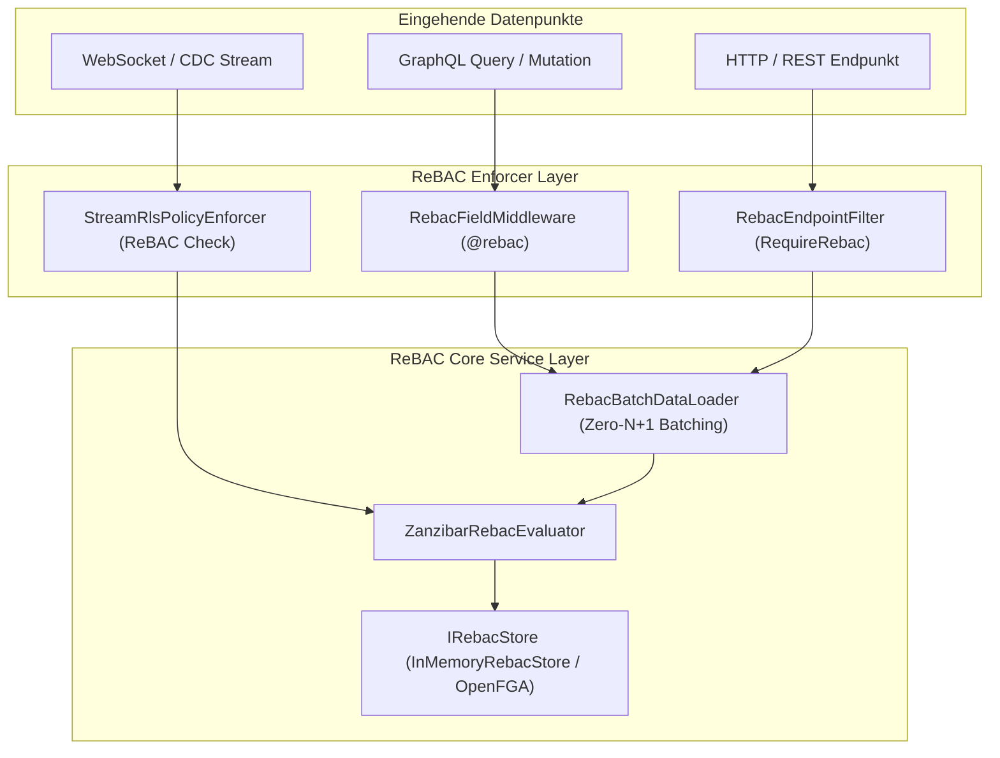

# Architektur-Implementierungsplan: Universelle ReBAC-Durchsetzung über alle Datenpunkte (GraphQL, HTTP/REST, Streaming)

**Datum:** 2026-10-03  
**Status:** In Umsetzung  
**Scope:** Autheris (GraphQL, ASP.NET Core Minimal APIs / HTTP, Streaming / Subscriptions)  
**Bezug:** F-SEC-04 (ReBAC nach Google-Zanzibar / OpenFGA)

---

## 1. Motivation & Zielsetzung
Die in Welle 3 implementierte ReBAC-Engine (`ZanzibarRebacEvaluator`, `InMemoryRebacStore`, `RebacBatchDataLoader`) bietet ein hochperformantes Beziehungs-Berechtigungsmodell nach Google-Zanzibar-Vorbild mit Mandantenisolation und Zyklenerkennung.
Bislang existierten jedoch nur REST-Endpunkte zur manuellen Prüfung (`/api/v1/rebac/check`) und DI-Injektion in C#-Services.

**Ziel:** Deklarative und automatische ReBAC-Sicherung für **alle** Datenpunkte des Gateways:
1. **GraphQL:** Deklarative `@rebac`-Direktive an Feldern und Mutationen mit automatischer Ausführung via HotChocolate Field-Middleware.
2. **HTTP / REST:** Deklarativer Endpoint-Filter (`RequireRebac` / `RebacEndpointFilter`) für ASP.NET Core Minimal APIs.
3. **Streaming / Subscriptions:** ReBAC-basierte Topic- & Tabellenüberprüfung in der Subscription- und Streaming-Pipeline (`StreamRlsPolicyEnforcer`).

---

## 2. Architektur nach Datenpunkten

### 2.1 GraphQL-Datenpunkt (HotChocolate)

#### A. Direktive `@rebac`
```graphql
directive @rebac(
  relation: String!
  objectType: String!
  objectArg: String
) on FIELD_DEFINITION
```
* `relation`: Erforderliche Zanzibar-Relation (z. B. `"viewer"`, `"editor"`, `"owner"`).
* `objectType`: Typ des Zielobjekts (z. B. `"dataset"`, `"folder"`, `"document"`).
* `objectArg`: Name des GraphQL-Arguments, das die Objekt-ID enthält (z. B. `"id"`, `"datasetId"`). Falls nicht angegeben, wird standardmäßig ein Argument `"id"` gesucht oder die ID des Parent-Objekts (`context.Parent<T>()`) herangezogen.

#### B. HotChocolate Field-Middleware (`RebacFieldMiddleware`)
* **Pipeline-Position:** Greift **vor** dem eigentlichen Field-Resolver.
* **Ablauf:**
  1. Extraktion des `ClaimsPrincipal` aus dem `IMiddlewareContext` (unterstützt HTTP-Kontext sowie MCP-Session-State).
  2. Bestimmung der Caller-Identity (User-SID oder Name) und des `TenantId` (über Claims oder Tenant-Header).
  3. Auflösung der Objekt-ID (aus Argumenten `context.ArgumentValue<string>(argName)`).
  4. Abfrage über `IRebacBatchDataLoader.CheckAsync(tenantId, user, relation, $"{objectType}:{objectId}", ct)` $\rightarrow$ automatisches Zero-$N+1$ Batching für Listen.
  5. Bei `allowed == true`: `next(context)` wird aufgerufen.
  6. Bei `allowed == false`: Abbruch und Rückgabe eines standardisierten GraphQL-Fehlers (`AUTH_NOT_AUTHORIZED` / `FORBIDDEN`).

---

### 2.2 HTTP / REST-Datenpunkte (ASP.NET Core Minimal APIs)

#### A. Endpoint Extension `.RequireRebac(...)`
```csharp
app.MapGet("/api/v1/datasets/{id}", (string id) => ...)
   .RequireRebac(relation: "viewer", objectType: "dataset", routeParam: "id");
```

#### B. ASP.NET Core Endpoint-Filter (`RebacEndpointFilter`)
* Prüft beim Aufruf des HTTP-Endpunkts:
  1. `EndpointSecurity.GetCallerIdentity(httpContext.User)`.
  2. `EndpointSecurity.GetRequestTenant(httpContext)`.
  3. Extraktion der Objekt-ID aus `RouteValues[routeParam]`, `Query[queryParam]` oder Header.
  4. Prüfung via `IRebacBatchDataLoader` / `IRebacEvaluator`.
  5. Bei Verweigerung: Sofortige Rückgabe von `Results.Problem(statusCode: 403, title: "Forbidden", detail: "ReBAC authorization denied.")`.

---

### 2.3 Streaming & WebSocket-Datenpunkt

* Integration in `StreamRlsPolicyEnforcer`:
  * Bei Start eines Stream-Abonnements oder WebSocket-Subscriptions wird geprüft, ob für die Ziel-Tabelle / das Thema eine ReBAC-Berechtigung vorliegt (z. B. `(tenant, user, "subscriber", $"stream:{topic}")`).
  * Fail-Closed-Verhalten bei fehlender Berechtigung.

---

## 3. Komponenten-Übersicht



---

## 4. Phasenplan
1. **Phase 1 (GraphQL):** Implementierung `RebacDirectiveType`, `RebacFieldMiddleware` und Schema-Registrierung in `Autheris.GraphQL`.
2. **Phase 2 (HTTP/REST):** Implementierung `RebacEndpointFilter` und `RequireRebac`-Extensions in `Autheris.Api`.
3. **Phase 3 (Streaming):** Erweiterung des `StreamRlsPolicyEnforcer` um optionale ReBAC-Beziehungsprüfung.
4. **Phase 4 (Security Härtung & Tests):** Unit- und Integrationstests über alle drei Datenpunkte.
