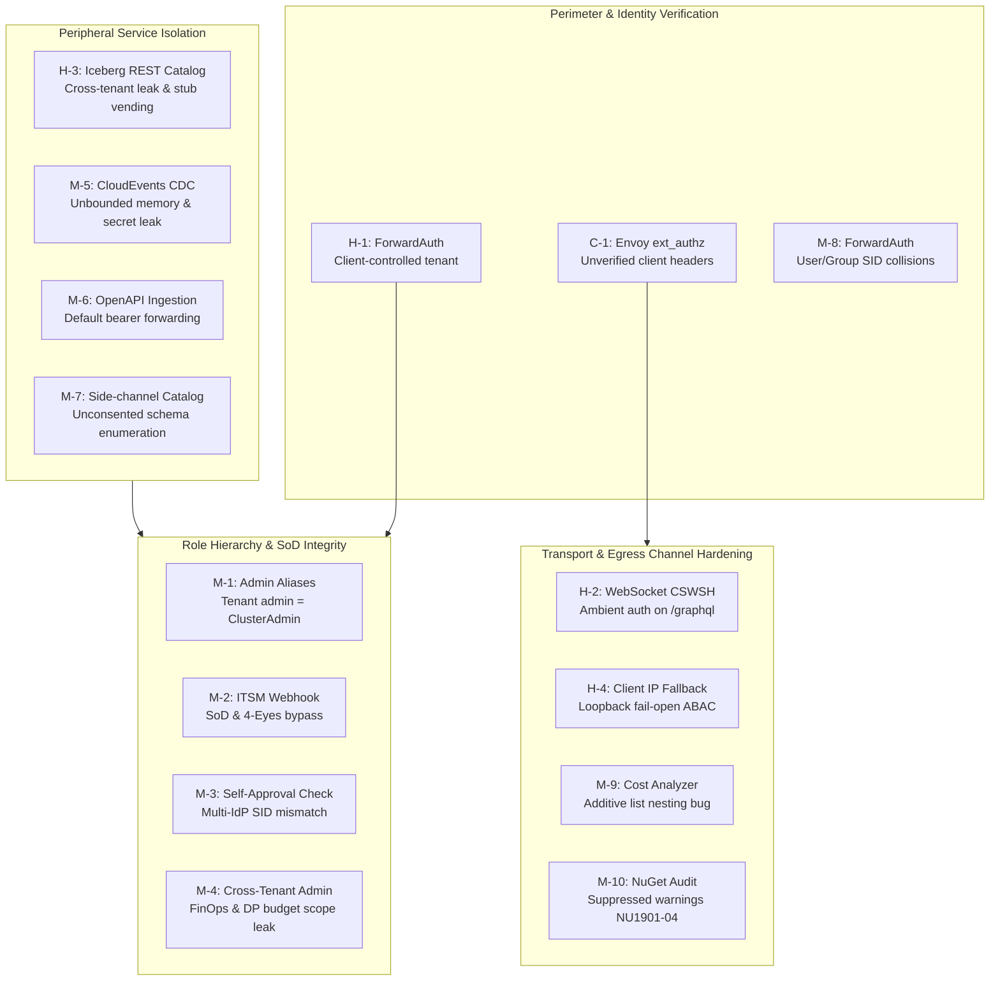
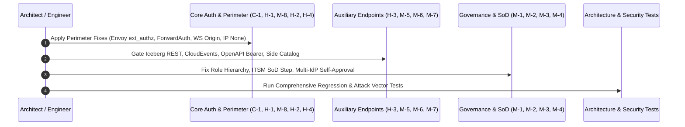

# Architecture & Implementation Plan: Security Remediation & Perimeter Hardening (2026-10-04)

> **Document ID:** PLAN-SEC-2026-10-04-MASTER  
> **Status:** Approved for Implementation (Master Architecture Blueprint)  
> **Target Scope:** Core Solution (`src/Autheris.Application`, `src/Autheris.Api`, `src/Autheris.Domain`, `src/Autheris.GraphQL`, `src/Autheris.Extensions`, `Directory.Build.props`)  
> **Primary Security Review Reference:** [Autheris Security Review — 2026-10-04](../../security-review-2026-10-04.md)

---

## 1. Architectural Assessment & Security Posture

The security review dated 2026-10-04 affirmed that the **core execution pipeline** (Trino AST SQL rewriter, parameterization, consent resolution, masking, and declarative HTTP SSRF protections) is rock solid. The critical and high-severity residual risks reside in **peripheral and auxiliary endpoints** that bypass the central governance pipeline or trust client-controlled headers:

---

## 2. Work Packages & Component-Level Design

### Work Package 1: Perimeter Identity & ForwardAuth Hardening (C-1, H-1, M-8)

#### 1.1 Remediation of C-1 (Envoy ext_authz Identity & SQL Leak)
- **Files:** `src/Autheris.Application/Mesh/Services/EnvoyExtAuthzService.cs`, `src/Autheris.Api/Endpoints/EnvoyExtAuthzEndpoints.cs`, `src/Autheris.Domain/Model/EnvoyAuthModels.cs`
- **Architectural Rules:**
  1. **Strict Context Binding:** `EnvoyExtAuthzService.CheckAsync` and `CheckHttpAsync` must derive the calling identity exclusively from the validated `ClaimsPrincipal` (`context.User`) or a verified mTLS `source.principal` matching the configured Envoy/Istio SPIFFE ID.
  2. **Eliminate Header Fallbacks:** Drop `x-autheris-principal`, `x-user-id`, and unverified base64 JWT payload parsing.
  3. **Endpoint Authorization:** Add `.RequireAuthorization()` to `/api/v1/envoy/authz` and `/api/v1/envoy/check`, restricting invocation to mesh service accounts.
  4. **Eliminate RLS SQL Exposure:** Stop injecting `x-autheris-rls-filter` with raw SQL into `EnvoyCheckResponse.Allow`. RLS decisions must stay within gateway boundaries or vend pre-signed tokens.
  5. **EnvoyFilter Template Cleanliness:** Remove `x-autheris-principal` and `x-roles` from `allowed_headers` in `GenerateIstioEnvoyFilterYaml`.

#### 1.2 Remediation of H-1 (ForwardAuth Tenant Forgery)
- **Files:** `src/Autheris.Api/Security/ForwardAuthAuthenticationHandler.cs`, `src/Autheris.Domain/Options/GatewayOptions.cs`, `docs/configuration-guide.md`
- **Architectural Rules:**
  1. Introduce explicit `ForwardAuthOptions.TrustUpstreamTenant` (default: `false`).
  2. If `TrustUpstreamTenant` is `false`, `X-Forwarded-Tenant` is ignored, falling back to `DefaultTenantId`.
  3. If `TrustUpstreamTenant` is `true`, `tenant` is accepted **only** if it belongs to an explicitly populated `AllowedTenantIds` list. If `AllowedTenantIds` is empty, authentication fails closed (`AuthenticateResult.Fail`).

#### 1.3 Remediation of M-8 (ForwardAuth SID Collision)
- **Files:** `src/Autheris.Api/Security/ForwardAuthAuthenticationHandler.cs`
- **Architectural Rules:**
  1. Enforce strict disjoint SID prefixes:
     - User SIDs: `S-1-5-21-FORWARD-USR-{UrlTokenEncode(username)}`
     - Group SIDs: `S-1-5-21-FORWARD-GRP-{UrlTokenEncode(groupName)}`
  2. Never allow raw unescaped passthrough of values starting with `S-1-5-21-FORWARD-`.

---

### Work Package 2: Transport & Channel Security (H-2, H-4, M-9, M-10)

#### 2.1 Remediation of H-2 (Cross-Site WebSocket Hijacking on /graphql)
- **Files:** `src/Autheris.Api/Extensions/GatewayApplicationBuilderExtensions.cs`, `src/Autheris.GraphQL/Subscriptions/WebSocketAuthInterceptor.cs`
- **Architectural Rules:**
  1. **Origin Validation:** In `app.UseWebSockets()`, validate the HTTP upgrade `Origin` against `GatewayOptions.GraphQL.TrustedOrigins` (or same-origin comparison).
  2. **Require Connection Token for Ambient Credentials:** In `WebSocketAuthInterceptor`, if an `Origin` header is present and the connection relies on ambient HTTP credentials (cookies, Negotiate, Basic), reject the handshake unless a valid token is provided in `connection_init`.

#### 2.2 Remediation of H-4 (IP-based ABAC Fail-Open)
- **Files:** `src/Autheris.Application/Connectors/CrossDomain/DefaultCrossDomainAccessResolver.cs`, `src/Autheris.Application/Services/GatewayExecutionService.cs`, `src/Autheris.Application/Mcp/Services/AiDataGuardrailService.cs`
- **Architectural Rules:**
  1. Replace all occurrences of `IPAddress.Loopback` as fallback with `IPAddress.None`.
  2. Do not trust an unverified `"ip"` claim from tokens. Always resolve client IP via `IClientIpResolver` (which inspects the verified socket or trusted proxy `X-Forwarded-For`).
  3. If IP resolution returns null or unparseable, evaluate as `IPAddress.None`, causing "internal network only" ABAC policies to fail closed.

#### 2.3 Remediation of M-9 (Query Cost Analyzer Nested List Multiplication)
- **Files:** `src/Autheris.GraphQL/Validation/QueryCostAnalyzerRule.cs`
- **Architectural Rules:**
  1. Change nested list cost computation from additive (`current + child`) to multiplicative (`current + (effectiveRows * child)`).
  2. Use saturating/checked arithmetic to prevent integer overflow on deeply nested queries.

#### 2.4 Remediation of M-10 (NuGet Vulnerability Audit Suppression)
- **Files:** `Directory.Build.props`
- **Architectural Rules:**
  1. Remove `NU1901;NU1902;NU1903;NU1904` from `<NoWarn>`.
  2. Set `<NuGetAudit>true</NuGetAudit>`, `<NuGetAuditMode>all</NuGetAuditMode>`, and `<NuGetAuditLevel>moderate</NuGetAuditLevel>`.
  3. Treat vulnerability warnings as errors in CI.

---

### Work Package 3: Auxiliary Endpoint Isolation & Catalog Governance (H-3, M-5, M-6, M-7)

#### 3.1 Remediation of H-3 (Iceberg REST Catalog Scoping & Stub Vending)
- **Files:** `src/Autheris.Extensions/Lakehouse/Services/IcebergRestCatalogFederationService.cs`, `src/Autheris.Api/Endpoints/IcebergRestCatalogEndpoints.cs`
- **Architectural Rules:**
  1. `ListNamespacesAsync` and `ListTablesAsync` must filter metadata strictly by the caller's verified `tenantId`.
  2. `LoadTableAsync`: Remove fallback lookup across tenants (`allTables.FirstOrDefault(...)`). If table not found for the caller's tenant, return 404.
  3. Pre-Flight Governance: In `LoadTableAsync`, verify caller has active consent and ReBAC permissions before returning metadata.
  4. Credential Vending: Return HTTP 501 Not Implemented (`VendCredentialAsync` throws `NotSupportedException` until real STS/SAS credentials are implemented). Do not vend forgeable fake keys.

#### 3.2 Remediation of M-5 (CloudEvents CDC Subscriptions Hardening)
- **Files:** `src/Autheris.Api/Endpoints/StreamingCdcEndpoints.cs`, `src/Autheris.Application/Events/Services/CloudEventSubscriptionStore.cs`
- **Architectural Rules:**
  1. Gate `/api/v1/streaming/subscriptions` with `.RequireGatewayRole(GatewayRole.GovernanceAdmin, GatewayRole.SchemaPublisher)`.
  2. Generate subscription `Id` server-side (`Guid.NewGuid()`).
  3. Redact `HmacSecret` from all GET responses.
  4. Enforce max subscription limit (e.g. 100 entries per tenant).
  5. Dispatcher SSRF check: Route webhook delivery through `SsrfProtectionHandler` / `EgressUrlPolicy`.

#### 3.3 Remediation of M-6 (OpenAPI Ingestion Bearer Forwarding)
- **Files:** `src/Autheris.Application/DataCatalog/Services/OpenApiIngestionService.cs`, `src/Autheris.Domain/Model/OpenApiIngestionModels.cs`
- **Architectural Rules:**
  1. Default `AuthMode` to `AuthMode.None` (instead of `ForwardBearerToken`).
  2. If `ForwardBearerToken` is explicitly selected, enforce an allowlist of permitted destination hostnames. Reject arbitrary third-party targets.

#### 3.4 Remediation of M-7 (Catalog Enumeration Defense)
- **Files:** `src/Autheris.Api/Endpoints/BackstageEndpoints.cs`, `src/Autheris.Api/Endpoints/ArrowFlightSqlEndpoints.cs`, `src/Autheris.Api/Endpoints/SchemaRegistryEndpoints.cs`
- **Architectural Rules:**
  1. Apply tenant isolation and active consent filtering to Backstage export, Flight SQL `GetTables`, and Schema Registry endpoints. Non-consented tables must not be enumerated.

---

### Work Package 4: Governance & Workflow Integrity (M-1, M-2, M-3, M-4)

#### 4.1 Remediation of M-1 & M-4 (Admin Role Scope Integrity)
- **Files:** `src/Autheris.Domain/Security/GatewayRole.cs`, `src/Autheris.Api/Endpoints/EndpointSecurity.cs`, `src/Autheris.Api/Endpoints/FinOpsEndpoints.cs`, `src/Autheris.Api/Endpoints/GovernanceEndpoints.cs`
- **Architectural Rules:**
  1. In `GatewayRoleExtensions.NameToRole`:
     - Disentangle `PlatformAdmin` and `GatewayAdmin` from global `ClusterAdmin`. Map them to `TenantAdmin`.
     - Disentangle `PrivacyAdmin` from `GovernanceAdmin`.
  2. Define `IsCanonicalClusterAdmin(ClaimsPrincipal?)`: returns true only if the user explicitly carries `ClusterAdmin` without tenant scoping.
  3. In `FinOpsEndpoints` and `GovernanceEndpoints`: Cross-tenant operations (e.g. `?tenantId=...`, EU AI Act export, DP budget reset) require `IsCanonicalClusterAdmin`.

#### 4.2 Remediation of M-2 (ITSM Approval Segregation of Duties)
- **Files:** `src/Autheris.Extensions/Itsm/ItsmWebhookHandler.cs`
- **Architectural Rules:**
  1. In `ItsmWebhookHandler`, replace direct `ActivateConsentAsync` with `ApproveConsentRequestStepAsync`.
  2. Verify four-eyes rules (`RequiresFourEyes`), verify approver != requester, and record the ITSM approver SID.

#### 4.3 Remediation of M-3 (Multi-IdP Self-Approval Detection)
- **Files:** `src/Autheris.GraphQL/Types/MutationTypes.cs`, `src/Autheris.Application/Mcp/Services/HitLStepUpApprovalService.cs`
- **Architectural Rules:**
  1. Expose `HitLStepUpApprovalService.IsSameIdentity(ClaimsPrincipal approver, string requesterSid)` or a shared domain identity matcher.
  2. In `MutationTypes.ApproveConsent`, evaluate `IsSameIdentity` across primary SID, objectSid, OID, UPN, and email claims.

---

## 3. Step-by-Step Implementation Sequence

1. **Step 1:** Implement WP1 (C-1, H-1, M-8).
2. **Step 2:** Implement WP2 (H-2, H-4, M-9, M-10).
3. **Step 3:** Implement WP3 (H-3, M-5, M-6, M-7).
4. **Step 4:** Implement WP4 (M-1, M-2, M-3, M-4).
5. **Step 5:** Execute automated test suites (`dotnet test Autheris.sln`).
6. **Step 6:** Conduct Code and Security Review of all modified lines.

---

## 4. Verification & Testing Criteria

- **Architecture Tests (`Autheris.Tests.Architecture`):**
  - Verify that no untrusted headers can bypass claims transformation.
  - Verify layer decoupling between peripheral endpoints and domain models.
- **Unit & Security Tests (`Autheris.Tests.Unit`):**
  - `EnvoyExtAuthzSecurityTests`: Verify that spoofed `x-autheris-principal` or unverified JWTs are rejected; verify that RLS SQL is never returned in headers.
  - `ForwardAuthSecurityTests`: Verify tenant rejection when `TrustUpstreamTenant = false` or not in `AllowedTenantIds`; verify user/group SID namespace separation.
  - `WebSocketCsrfTests`: Verify cross-origin WS handshake rejection when ambient auth is used without token.
  - `IcebergRestCatalogSecurityTests`: Verify tenant scoping and 501 on stub credential vending.
  - `ItsmApprovalSoDTests`: Verify that ITSM approval cannot self-approve or bypass four-eyes.
  - `ClientIpResolverTests`: Verify that unresolvable client IPs evaluate to `IPAddress.None` and fail closed.
  - `QueryCostAnalyzerTests`: Verify multiplicative cost calculation on nested lists.
