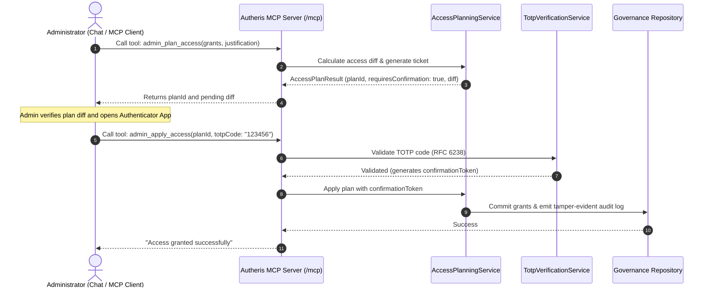

# F-AI-13: Admin MCP Tools & Two-Phase Access Planning (HitL)

## 1. Overview & Business Value

The **Admin MCP Tools** empower privileged administrators and AI agents to manage data sources, register APIs, and grant access permissions through natural language in chat clients (such as Claude Desktop or Talos Citizen Dev) — while strictly preventing accidental or unverified privilege escalations through a **Two-Phase Confirmation Protocol (HitL)**.

### Architectural Workflow:

### Available Admin Tools:
- **`admin_plan_access`:** Pre-flights an access change request, resolves usernames to SIDs, computes permissions diff, and issues an ephemeral `planId`.
- **`admin_apply_access`:** Requires the `planId` and a valid 6-digit TOTP code. Validates the code, consumes the ticket, and applies the changes.
- **`admin_register_datasource`:** Onboards Swagger/OpenAPI specifications via chat.
- **`admin_set_dataset_state`:** Activates or disables datasets.
- **`admin_resolve_principal`:** Resolves human-readable identities to enterprise SIDs.

## 2. Implementation Details

- **Service:** `AccessPlanningService` in `src/Autheris.Application/AccessPlanning/AccessPlanningService.cs`.
- **Admin Tools:** `AdminMcpTools` in `src/Autheris.Application/Mcp/Tools/AdminMcpTools.cs`.
- **Audit Verification:** All plan executions are sealed in `AuditLogEntry` with HMAC-SHA256 chaining.
