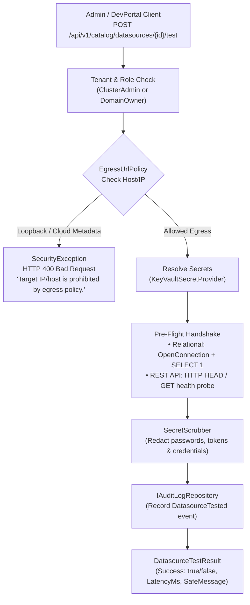

# F-API-09: Pre-Flight Datasource Connectivity Testing & Secret Scrubbing

**Status:** [Done] (100% GA – Production-Ready)  
**Components:** [`DatasourceTestingService.cs`](file:///root/autheris/src/Autheris.Application/Catalog/Services/DatasourceTestingService.cs), [`IDatasourceTestingService.cs`](file:///root/autheris/src/Autheris.Application/Catalog/Interfaces/IDatasourceTestingService.cs), [`CatalogApiEndpoints.cs`](file:///root/autheris/src/Autheris.Api/Endpoints/CatalogApiEndpoints.cs), [`EgressUrlPolicy.cs`](file:///root/autheris/src/Autheris.Application/Security/EgressUrlPolicy.cs), [`SecretScrubber.cs`](file:///root/autheris/src/Autheris.Domain/Security/SecretScrubber.cs)

---

## 1. Overview & Problem Statement

When onboarding new upstream databases (PostgreSQL, SQL Server, Oracle, Snowflake, DuckDB) or declarative REST APIs into the data catalog, misconfigured credentials, network firewalls, or invalid connection strings frequently cause runtime query failures for end users. Furthermore, testing connections naively introduces two severe enterprise vulnerabilities:
1. **Server-Side Request Forgery (SSRF)**: Malicious administrators or compromised credentials targeting loopback interfaces (`127.0.0.1`) or Cloud Instance Metadata Services (`169.254.169.254`).
2. **Credential Leakage in Error Logs**: Database driver connection strings containing embedded passwords or bearer tokens leaked in stack traces and UI error dialogs.

**F-API-09** introduces a hardened pre-flight **Datasource Connectivity Testing Service** via `POST /api/v1/catalog/datasources/{id}/test`. It validates connection handshakes without querying real business data, enforces strict egress security policies, and guarantees zero password leakage.

---

## 2. Business Value

- **Zero-Data Probing**: Executes strictly isolated ping/handshake queries (e.g. `SELECT 1` or HTTP `HEAD`) without touching customer tables.
- **SSRF Protection by Default**: Validates hostnames and IP addresses against `EgressUrlPolicy`. Disallows loopback (`127.0.0.0/8`), link-local (`169.254.0.0/16`), RFC 1918 private subnets, and IPv6 loopback (`::1`) unless explicitly permitted in dev environments.
- **Automated Secret Scrubbing**: All connection errors, exception messages, and socket timeouts pass through `SecretScrubber`, redacting database passwords, API keys, and connection strings before returning them to the client.
- **WORM Audit Trail**: Every connection test is recorded to the immutable audit log with tenant, user SID, target host, and result status.

---

## 3. Architecture & Validation Pipeline



---

## 4. Usage Examples

### Testing a Relational Database Connection

**Request:**
```bash
curl -X POST "http://localhost:8080/api/v1/catalog/datasources/finance_db/test" \
  -H "Authorization: Bearer <admin-token>" \
  -H "Content-Type: application/json" \
  -d '{
    "timeoutSeconds": 5
  }'
```

**Successful Response:**
```json
{
  "datasourceId": "finance_db",
  "success": true,
  "statusCode": 200,
  "latencyMs": 14.2,
  "message": "Connection handshake and probe query (SELECT 1) succeeded."
}
```

**Failed Response with Secret Scrubbing (Password Redacted):**
```json
{
  "datasourceId": "finance_db",
  "success": false,
  "statusCode": 400,
  "latencyMs": 2005.1,
  "message": "Connection to host 'db.internal.corp:5432' failed: Password authentication failed for user 'finance_svc' [PASSWORD REDACTED]."
}
```

---

## 5. Configuration Example

```json
{
  "Gateway": {
    "DatasourceTesting": {
      "Enabled": true,
      "DefaultTimeoutSeconds": 5,
      "MaxTimeoutSeconds": 30,
      "AllowPrivateIps": false,
      "ProhibitedHosts": [
        "169.254.169.254",
        "metadata.google.internal",
        "localhost",
        "127.0.0.1"
      ]
    }
  }
}
```
