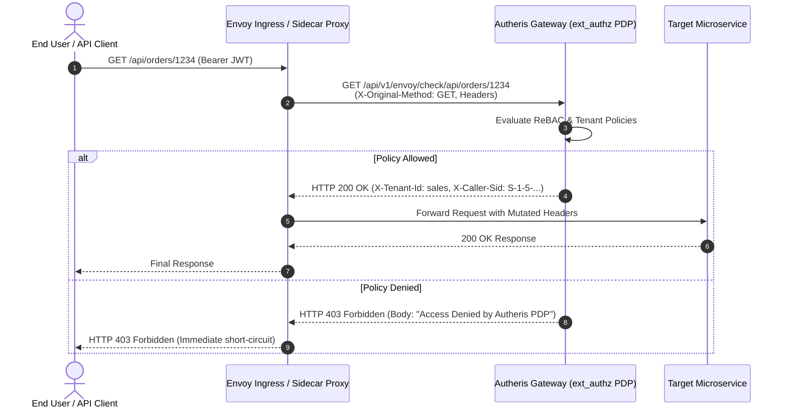

# F-ARCH-11: Envoy External Authorization (ext_authz) & Istio Service Mesh Integration

**Status:** [Done] (100% GA – Production-Ready)  
**Components:** [`EnvoyExtAuthzEndpoints.cs`](file:///root/autheris/src/Autheris.Api/Endpoints/EnvoyExtAuthzEndpoints.cs), [`IEnvoyExtAuthzService.cs`](file:///root/autheris/src/Autheris.Application/Mesh/Interfaces/IEnvoyExtAuthzService.cs), [`EnvoyExtAuthzService.cs`](file:///root/autheris/src/Autheris.Application/Mesh/Services/EnvoyExtAuthzService.cs)

---

## 1. Overview & Problem Statement

Modern microservice architectures rely on service meshes such as **Istio** or **Envoy Proxy** to enforce ingress traffic policies, mutual TLS (mTLS), and service-to-service communication. However, delegating complex data governance decisions (multi-tenant ReBAC, consent matching, and column-level authorization) directly inside distributed Envoy sidecars is impractical due to policy sprawl and cache invalidation challenges.

**F-ARCH-11** integrates Autheris as an official **External Authorization Provider (`ext_authz`)** for Envoy and Istio. When an Envoy sidecar or ingress gateway intercepts an incoming HTTP request across the mesh, it queries Autheris over the standard Envoy `ext_authz` HTTP protocol (`/api/v1/envoy/check/{**originalPath}`). Autheris evaluates the end-user's token, checks ReBAC/ABAC policies, and returns either `200 OK` (with enriched response headers) or `403 Forbidden`.

---

## 2. Business Value

- **Centralized Zero-Trust Mesh Policy**: Unifies authorization across REST microservices, GraphQL gateways, and Trino/WebSQL analytics through a single centralized Policy Decision Point (PDP).
- **Prevention of Confused-Deputy Attacks**: The header-mode check preserves the original caller's credentials and path (`X-Original-URI`, `X-Original-Method`), evaluating the policy in the security context of the actual user rather than the calling mesh proxy.
- **Automated Infrastructure-as-Code (IaC)**: Autheris dynamically exports ready-to-apply Kubernetes Custom Resource Definitions (CRDs) for Istio `EnvoyFilter` and `WasmPlugin`.
- **In-Stream Header Mutation**: On allow decisions, Autheris can inject tenant claims, sanitized user identifiers, and rate-limit headers directly into the upstream request payload forwarded by Envoy.

---

## 3. Architecture & Service Mesh Flow



---

## 4. Usage & Integration

### A. Envoy HTTP Check Endpoint

```bash
curl -X GET "http://localhost:8080/api/v1/envoy/check/finance/invoices" \
  -H "Authorization: Bearer <user-jwt>" \
  -H "X-Original-Method: GET" \
  -H "X-Original-URI: /finance/invoices"
```

### B. Exporting Istio `EnvoyFilter` CRD

Autheris can generate the required Istio configuration on demand:

```bash
curl -X GET "http://localhost:8080/api/v1/envoy/export/envoyfilter.yaml?namespace=istio-system&host=autheris.autheris.svc.cluster.local&port=8080" \
  -o istio-envoyfilter.yaml

kubectl apply -f istio-envoyfilter.yaml
```

**Exported Manifest Snippet:**
```yaml
apiVersion: networking.istio.io/v1alpha3
kind: EnvoyFilter
metadata:
  name: autheris-ext-authz
  namespace: istio-system
spec:
  workloadSelector:
    labels:
      istio: ingressgateway
  configPatches:
    - applyTo: HTTP_FILTER
      match:
        context: GATEWAY
        listener:
          filterChain:
            filter:
              name: "envoy.filters.network.http_connection_manager"
      patch:
        operation: INSERT_BEFORE
        value:
          name: envoy.filters.http.ext_authz
          typed_config:
            "@type": type.googleapis.com/envoy.extensions.filters.http.ext_authz.v3.ExtAuthz
            http_service:
              server_uri:
                uri: http://autheris.autheris.svc.cluster.local:8080
                cluster: outbound|8080||autheris.autheris.svc.cluster.local
                timeout: 0.25s
              path_prefix: /api/v1/envoy/check
```

---

## 5. Configuration Example

```json
{
  "Gateway": {
    "Envoy": {
      "Enabled": true,
      "AllowedHeaderForwardPrefixes": ["X-Autheris-", "X-Tenant-", "X-User-"],
      "DecisionCacheTtlSeconds": 5,
      "TimeoutMs": 250
    }
  }
}
```
