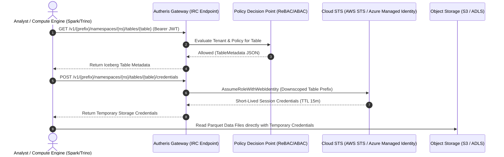

# F-DATA-05: Apache Iceberg REST Catalog (IRC) & Dynamic STS Credential Vending

**Status:** [Done] (100% GA – Production-Ready)  
**Components:** [`IcebergRestCatalogEndpoints.cs`](file:///root/autheris/src/Autheris.Api/Endpoints/IcebergRestCatalogEndpoints.cs), [`IIcebergRestCatalogFederationService.cs`](file:///root/autheris/src/Autheris.Extensions/Lakehouse/Interfaces/IIcebergRestCatalogFederationService.cs), [`LakehouseServiceCollectionExtensions.cs`](file:///root/autheris/src/Autheris.Extensions/Lakehouse/LakehouseServiceCollectionExtensions.cs)

---

## 1. Overview & Problem Statement

Modern Data Lakehouses standardize on Apache Iceberg as their open table format. However, connecting distributed compute engines (such as Apache Spark, Trino, Snowflake, or DuckDB) to enterprise object storage (AWS S3, Azure Data Lake Storage Gen2, or MinIO) typically requires distributing static cloud storage credentials or IAM keys to users and workloads. This creates severe security risks, credential sprawl, and multi-tenant data leakage.

**F-DATA-05** implements the official **Apache Iceberg REST Catalog (IRC) Specification** natively within Autheris. Autheris acts as the governed metadata authority for Iceberg tables. When a compute engine connects, Autheris enforces tenant isolation, evaluates ReBAC/ABAC policies, and dynamically vends short-lived, downscoped **Security Token Service (STS)** storage credentials valid only for the requested table files and lifespan of the query.

---

## 2. Business Value

- **Zero Static Storage Secrets**: External compute engines never receive permanent AWS access keys or Azure storage shared keys.
- **Table-Scoped Downscoping**: Vended storage credentials only grant read/write access to the specific S3/ADLS bucket prefixes holding the requested table's Parquet files.
- **Universal Engine Compatibility**: Works out-of-the-box with any client supporting the standard Iceberg REST Catalog specification (PyIceberg, Apache Spark, Trino, DuckDB Iceberg extension, StarRocks).
- **Zero Enumeration Oracle**: Inactive tables, missing tables, and unauthorized tables all return identical HTTP `403 Forbidden` responses in production, preventing catalog reconnaissance.

---

## 3. Architecture & Capabilities



### Supported RFC Endpoints

- `GET /v1/{prefix}/namespaces`: Lists accessible schemas/domains within caller's tenant.
- `GET /v1/{prefix}/namespaces/{namespace}/tables`: Lists tables within a specific namespace.
- `GET /v1/{prefix}/namespaces/{namespace}/tables/{table}`: Loads Iceberg table metadata and schema definition.
- `POST /v1/{prefix}/namespaces/{namespace}/tables/{table}/credentials`: Vends short-lived, downscoped storage access tokens.

---

## 4. Usage Example

### Connecting PyIceberg or DuckDB

```python
from pyiceberg.catalog import load_catalog

# Connect to Autheris Governed Iceberg REST Catalog
catalog = load_catalog(
    "autheris_lakehouse",
    **{
        "type": "rest",
        "uri": "http://localhost:8080/v1/default",
        "token": "<analyst-jwt-token>",
        "warehouse": "s3://lakehouse-warehouse"
    }
)

# Load governed table
table = catalog.load_table("analytics.customer_churn")
df = table.scan().to_pandas()
print(df.head())
```

### Direct HTTP Request

```bash
# Fetch Iceberg Table Metadata
curl -X GET "http://localhost:8080/v1/default/namespaces/sales/tables/orders" \
  -H "Authorization: Bearer <jwt-token>" \
  -H "Accept: application/json"
```

---

## 5. Configuration Example

```json
{
  "Gateway": {
    "Lakehouse": {
      "Enabled": true,
      "CatalogType": "RestCatalog",
      "Prefix": "default",
      "StorageProvider": "S3",
      "S3": {
        "Endpoint": "https://s3.eu-central-1.amazonaws.com",
        "RoleArn": "arn:aws:iam::123456789012:role/AutherisTableVendingRole",
        "SessionDurationSeconds": 900
      }
    }
  }
}
```
