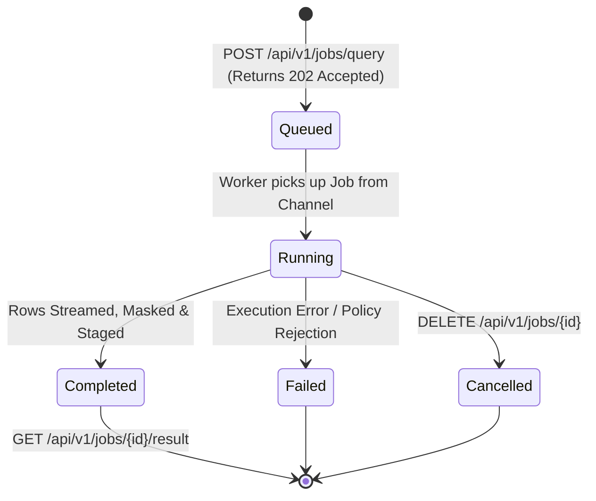

# F-DATA-07: Asynchronous Query Job Engine & Sandbox Storage

**Status:** [Done] (100% GA – Production-Ready)  
**Components:** [`AsyncJobEndpoints.cs`](file:///root/autheris/src/Autheris.Api/Endpoints/AsyncJobEndpoints.cs), [`AsyncQueryJobManager.cs`](file:///root/autheris/src/Autheris.Application/Jobs/AsyncQueryJobManager.cs), [`IAsyncQueryJobManager.cs`](file:///root/autheris/src/Autheris.Application/Jobs/Interfaces/IAsyncQueryJobManager.cs), [`AsyncJobStorage.cs`](file:///root/autheris/src/Autheris.Infrastructure/Jobs/AsyncJobStorage.cs)

---

## 1. Overview & Problem Statement

Heavy analytical queries, federated multi-source aggregations, and large dataset extracts can take minutes to process. Executing these queries synchronously over standard HTTP connections causes client-side connection drops, Gateway reverse-proxy timeouts (e.g. NGINX 504 Gateway Timeout), and thread pool starvation under high concurrent traffic.

**F-DATA-07** introduces a high-performance **Asynchronous Query Job Engine** based on bounded .NET `System.Threading.Channels`. Long-running queries are accepted immediately with HTTP `202 Accepted`, executed asynchronously in background workers, and their governed results are staged in a sandboxed, tenant-isolated storage partition for later retrieval.

---

## 2. Business Value

- **No HTTP Gateway Timeouts**: Clients submit queries and immediately receive a `JobId` without keeping long-lived TCP connections open.
- **Pre-Storage Governance (Zero-IDOR Security)**: Row-Level Security (RLS) predicates and Dynamic Data Masking (DDM) are applied *during* row streaming **before** results are written to disk. Even if disk files were compromised, they contain only masked, authorized data.
- **Tenant & User Isolation**: Jobs and result files are bound to the submitting caller's `TenantId + UserSID`. Unauthorized access attempts return HTTP `404 Not Found` (Zero Information Leakage).
- **Automated Lifecycle & Storage Cleanup**: Staged result files expire automatically after a configurable retention window (default 24h) to prevent disk exhaustion.

---

## 3. Architecture & Lifecycle



### API Endpoints

| Method | Endpoint | Description |
| :--- | :--- | :--- |
| `POST` | `/api/v1/jobs/query` | Submits an asynchronous query job. Returns HTTP `202 Accepted` with polling URL. |
| `GET` | `/api/v1/jobs/{jobId}/status` | Checks job execution status (`Queued`, `Running`, `Completed`, `Failed`, `Cancelled`). |
| `GET` | `/api/v1/jobs/{jobId}/result` | Streams the staged result file (JSON or Parquet format) with chunked transfer. |
| `DELETE` | `/api/v1/jobs/{jobId}` | Cancels a running job and removes staged temporary files immediately. |

---

## 4. Usage Examples

### A. Submitting an Asynchronous Job

```bash
curl -X POST "http://localhost:8080/api/v1/jobs/query" \
  -H "Authorization: Bearer <jwt-token>" \
  -H "Content-Type: application/json" \
  -d '{
    "query": "SELECT customer_id, SUM(amount) AS total_spend FROM sales.orders GROUP BY customer_id",
    "dialect": "PostgreSQL",
    "format": "json"
  }'
```

**Response (HTTP 202 Accepted):**
```http
HTTP/1.1 202 Accepted
Location: /api/v1/jobs/job_98a7f23c_1b44/status
```
```json
{
  "jobId": "job_98a7f23c_1b44",
  "state": "Queued",
  "createdAt": "2026-10-10T03:30:00Z",
  "resultDownloadUrl": "/api/v1/jobs/job_98a7f23c_1b44/result"
}
```

---

### B. Checking Status & Downloading Results

```bash
# Poll Status
curl -X GET "http://localhost:8080/api/v1/jobs/job_98a7f23c_1b44/status" \
  -H "Authorization: Bearer <jwt-token>"

# Response:
# {
#   "jobId": "job_98a7f23c_1b44",
#   "state": "Completed",
#   "rowsProduced": 45000,
#   "bytesProduced": 3410520,
#   "completedAt": "2026-10-10T03:30:14Z"
# }

# Download Final Result
curl -X GET "http://localhost:8080/api/v1/jobs/job_98a7f23c_1b44/result" \
  -H "Authorization: Bearer <jwt-token>" \
  -o result.json
```

---

## 5. Configuration Example

```json
{
  "Gateway": {
    "AsyncJobs": {
      "Enabled": true,
      "MaxConcurrentJobs": 16,
      "ChannelCapacity": 1000,
      "ResultRetentionHours": 24,
      "MaxResultRows": 500000,
      "MaxResultSizeBytes": 268435456,
      "StoragePath": "/var/autheris/job-sandbox"
    }
  }
}
```
