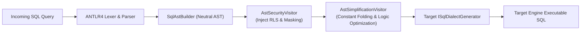

# F-DIALECT-01: Multi-Target SQL AST Compiler & Native Dialect Pushdown

## Executive Summary

Autheris abandons fragile string-replacement and token-based regex rewriting in favor of a full-fledged, multi-pass **SQL AST Compiler Pipeline** (implemented in [`TrinoSqlEngine`](../../src/TrinoSqlEngine)).

The compiler parses incoming SQL statements into an Abstract Syntax Tree, validates security invariants, injects Row-Level Security (RLS) predicates and column masking expressions in-tree, optimizes Boolean algebra, and compiles the final tree into native, dialect-accurate SQL for heterogeneous destination engines.

---

## Supported Target Dialects

| Dialect | Engine Targets | Key Code Generation Features |
|---|---|---|
| **T-SQL** | Microsoft SQL Server, Azure SQL DB | Bracket quoting (`[column]`), Unicode prefixing (`N'value'`), wrapped Boolean projections (`CASE WHEN ... THEN 1 ELSE 0 END`), `OFFSET ... FETCH NEXT ... ROWS ONLY`, `ISNULL()`, `HASHBYTES()`. |
| **PostgreSQL** | PostgreSQL 12+, AWS Aurora PG, TimescaleDB | Double-quote escaping (`"column"`), native standard Booleans (`true`/`false`), positional parameters (`$1, $2`), `LIMIT / OFFSET`, `COALESCE()`. |
| **SQLite** | SQLite 3 in-memory and disk databases | ANSI quoting, standard SQLite type casting, parameter index emitters (`?1, ?2`), `IFNULL()`. |
| **DuckDB** | DuckDB in-memory OLAP engine | Advanced analytical projection syntax, native regex matching, vectorized timestamp functions. |
| **Snowflake** | Snowflake Cloud Data Platform | Case-sensitive identifier quoting, native JSON traversal pushdown, native hashing and zero-copy string functions. |
| **Oracle** | Oracle Database 19c / 21c / 23ai | Uppercase normalized identifiers, omitted `AS` keyword on `FROM` table aliases, `NUMBER(1)` Boolean representations, `:p1` bind variables. |

---

## Compiler Pipeline Architecture

### Compiler Phases:
1. **Parsing:** ANTLR4 converts raw SQL into a concrete syntax parse tree.
2. **AST Construction:** `SqlAstBuilder` maps parse trees into strongly typed, immutable AST nodes (`QuerySpecification`, `TableReference`, `BinaryExpression`, `FunctionCall`).
3. **Security Visitor (`AstSecurityVisitor`):** Inspects queried tables, validates column access rights, and grafts tenant isolation filters (`tenant_id = @p0`) and virtual filters into the `WHERE` clause tree using logical `AND`. Injects dialect masking functions directly into projected expressions.
4. **Simplification (`AstSimplificationVisitor`):** Evaluates compile-time constants, eliminates tautologies (`WHERE 1=1 AND status = 'active'` -> `WHERE status = 'active'`), and optimizes Boolean logic using De Morgan's laws.
5. **Code Emission:** The target dialect generator formats the optimized AST into syntactically perfect SQL for the target database.

---

## Security Invariants & Protections

- **Anti-DoS Depth Guard:** Rejects deeply nested or cyclical recursive queries exceeding configured complexity limits.
- **Comment & System Variable Stripping:** Automatically removes SQL comments and disallows server configuration reads (such as `@@version`, `current_user()`).
- **Strict Single-Statement Enforcement:** Terminates with a security violation if multiple statements or statement terminators (`;`) are present.
