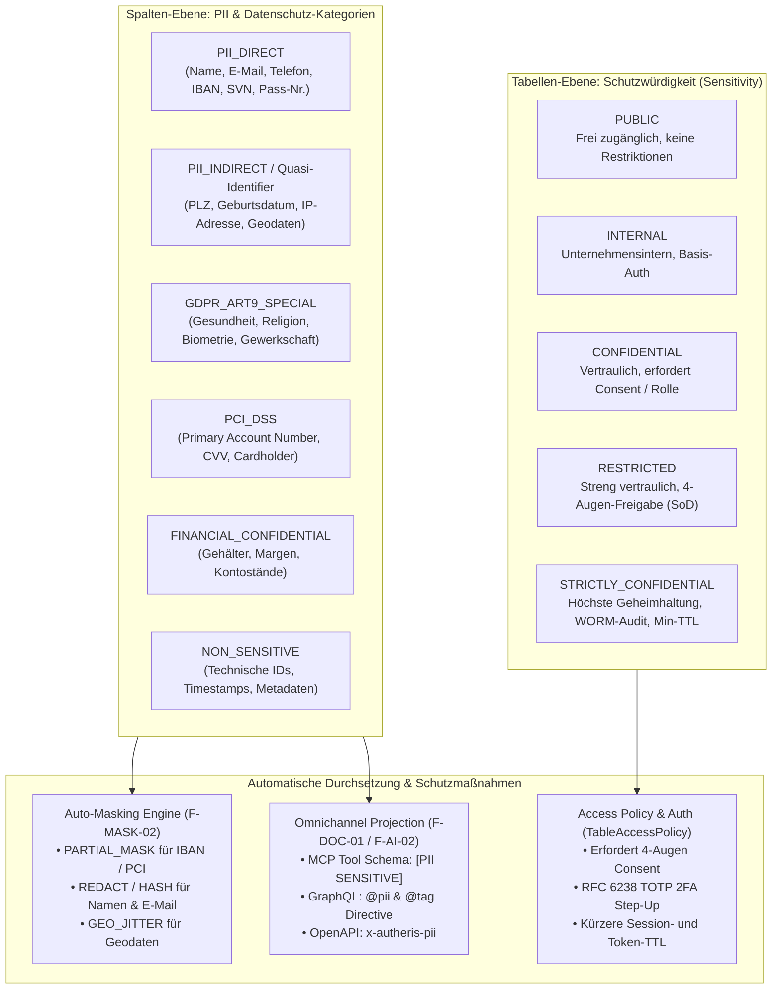
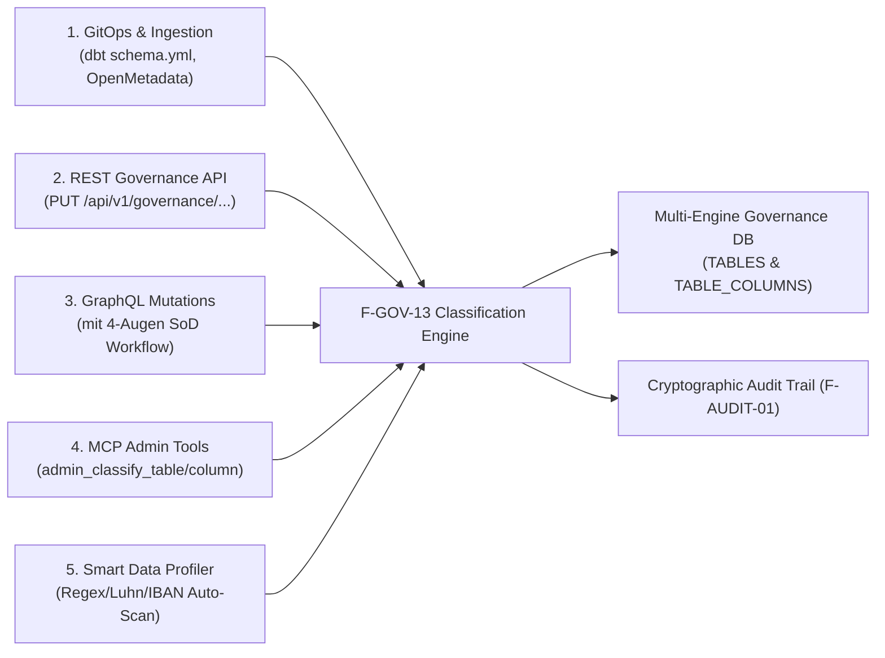

# F-GOV-13: Enterprise Data Classification, PII Tagging & Sensitivity Governance Engine

**Status:** [Proposed / In Design] (Strategic Governance Roadmap – Wave 2)  
**Feature-ID:** F-GOV-13  
**Authors:** Principal .NET & C# Solution Architect & Lead AI/Data Governance Architect  
**Components:** 
- Domain: [`TableModels.cs`](../../src/Autheris.Domain/Model/TableModels.cs), `ClassificationModels.cs`
- Application: `DataClassificationService.cs`, `SmartDataClassifier.cs`, `AutoMaskingPolicyEnforcer.cs`
- Persistence: `SqliteGovernanceRepository.Catalog.cs`, `PostgreSqlGovernanceRepository.Catalog.cs`, `SqlServerGovernanceRepository.Catalog.cs`
- API & MCP: `ClassificationEndpoints.cs`, `ClassificationMutationTypes.cs`, `McpAdminTools.cs`
- Enforcers: [`TableAccessPolicy.cs`](../../src/Autheris.Application/Policy/TableAccessPolicy.cs), [`ColumnMaskingProvider.cs`](../../src/Autheris.Application/Services/ColumnMaskingProvider.cs), [`AstSecurityVisitor.cs`](../../src/TrinoSqlEngine/AstSecurityVisitor.cs)

---

## 1. Executive Summary & Problemstellung

### 1.1 Das Problem: Das "Compliance-Vakuum" bei dezentraler Datenintegration
Moderne Enterprise-Datenplattformen binden Dutzende Datenquellen (ERP, CRM, SQL-Datenbanken, S3/Parquet Lakehouses) an. Dabei treten gravierende Governance-Lücken auf:
1. **Undokumentierte PII-Felder:** Entwickler und Data Engineers wissen oft nicht, welche Tabellen und Spalten sensible personenbezogene Daten (PII), Zahlungsdaten (PCI-DSS) oder besondere Kategorien nach DSGVO Art. 9 enthalten.
2. **Reaktive statt proaktive Maskierung:** Maskierungsregeln werden heute oft manuell pro Spalte konfiguriert (`F-MASK-02`). Fehlt eine Konfiguration, fließen Klardaten ungehindert an API-Konsumenten und KI-Agenten ab.
3. **Mangelnde Auditierbarkeit von Einstufungen:** Wer hat eine Tabelle als `CONFIDENTIAL` markiert? Wer hat eine Spalte herabgestuft? Es fehlt ein revisionssicherer Workflow mit 4-Augen-Prinzip (SoD).
4. **Fehlende Signalwirkung an KI-Agenten:** LLMs via MCP sehen Spalten als reine Typen (`email: String`, `iban: String`) ohne Hinweis auf Schutzwürdigkeit oder rechtliche Konsequenzen.

### 1.2 Die Lösung: F-GOV-13 Enterprise Data Classification Engine
**F-GOV-13** etabliert ein zentrales, richtliniengesteuertes Klassifizierungs- und PII-Framework direkt im Autheris Gateway:
- **Zweistufige Taxonomie:** Deklarative Festlegung von **Schutzklassen** auf Tabellenebene und **PII-/Regulatorik-Kategorien** auf Spaltenebene.
- **5 Festlegungs-Wege:** GitOps/dbt Ingestion, REST Governance API, GraphQL Mutations mit 4-Augen-Freigabe, MCP Admin Tools für KI-Agenten und ein automatischer Heuristik-Profiler (Scanner).
- **Automatisches Policy- & Masking-Enforcement:** Einstufungen binden automatisch passende Schutzmaßnahmen (z. B. `PII_DIRECT` -> automatische Teilmaskierung von IBAN/Kreditkarten, Step-Up-Auth bei `RESTRICTED`).
- **Omnichannel-Propagation:** Klassifizierungen werden verlustfrei in GraphQL Introspection (`@tag`, `@pii`), MCP Tool-Signaturen, OpenAPI 3.1 und OData CSDL Annotations projiziert.

---

## 2. Die Klassifizierungs-Taxonomie



### 2.1 Frei konfigurierbare Schutzklassen für Tabellen (`SensitivityLevels`)

Die Schutzklassen sind vollständig deklarativ über `GatewayOptions.Classification.SensitivityLevels` konfigurierbar. Durch numerische Ränge mit Abständen (z. B. `10, 20, 25, 30, 35, 40, 50`) können jederzeit **beliebig viele branchen- oder unternehmensspezifische Zwischenstufen** definiert werden, ohne bestehende Logik zu brechen:

| Schutzklasse (Key) | Rang | Beschreibung | 4-Augen (SoD) | Step-Up 2FA | Max Consent TTL |
| :--- | :---: | :--- | :---: | :---: | :---: |
| `PUBLIC` | 10 | Öffentlich zugängliche Stammdaten (Produktkatalog, Wechselkurse). | ❌ | ❌ | 365 Tage |
| `INTERNAL` | 20 | Interne Betriebsdaten (Lagerbestände, interne Abteilungscodes). | ❌ | ❌ | 180 Tage |
| `INTERNAL_AUDIT_ONLY` *(Zwischenstufe)* | 25 | Intern für Revision & Compliance; beschränkte Sichtbarkeit. | ❌ | ❌ | 90 Tage |
| `CONFIDENTIAL` | 30 | Sensible Geschäfts-/Kundendaten (Bestellungen, Rechnungen). | ❌ | ❌ | 60 Tage |
| `CONFIDENTIAL_FINANCE` *(Zwischenstufe)* | 35 | Vertrauliche Finanz- & Deckungsbeitragsdaten. | ✅ | ❌ | 30 Tage |
| `RESTRICTED` | 40 | Hochsensible Daten (HR-Gehälter, Bonitätsdaten). | ✅ | ✅ | 30 Tage |
| `STRICTLY_CONFIDENTIAL` | 50 | Höchste Geheimhaltungsstufe (Vorstand, M&A, Ermittlungsdaten). | ✅ | ✅ | 7 Tage |

### 2.2 PII- & Datenschutz-Kategorien für Spalten (`ColumnClassification`)

| Kategorie | Typische Beispiele | Zugeordnetes Auto-Masking (`F-MASK-02`) | Regulatorik |
| :--- | :--- | :--- | :--- |
| `PII_DIRECT` | Vorname, Nachname, E-Mail, Telefon, IBAN, Personalausweis | `PARTIAL_MASK` (IBAN) oder `REDACT` (Name/Mail) | DSGVO Art. 4, CCPA |
| `PII_INDIRECT` | Postleitzahl, Geburtsdatum, IP-Adresse, GPS-Koordinaten | `GEO_JITTER` (GPS) oder `REDACT_YEAR` (Geburt) | DSGVO Erw. 26 |
| `GDPR_ART9_SPECIAL` | Gesundheitsdaten, Religion, Biometrie, Ethnie, Parteizugehörigkeit | `NULLING` / `BLOCKED` (außer bei Compliance-Profil) | DSGVO Art. 9 |
| `PCI_DSS` | Kreditkartennummer (PAN), Gültigkeitsdatum, CVV | `PARTIAL_MASK` (erste 4 + letzte 4) oder `TOKENIZATION` | PCI-DSS v4.0 |
| `FINANCIAL_CONFIDENTIAL` | Jahresgehalt, Bonuszahlung, Kontosalden, Deckungsbeitrag | `NOISE` (Differential Privacy) oder `REDACT` | SOX, FinOps |
| `NON_SENSITIVE` | Primärschlüssel (`id`), Status-Flags, Timestamps | Keine Maskierung (Klardaten) | - |

> [!NOTE]
> Die Zuordnung von Kategorien zu Maskierungen ist nicht starr: Über `GatewayOptions.Classification.MaskingRules` können benutzerdefinierte Regeln mit freien Parametern definiert werden (z. B. `IBAN_STANDARD_4_4`, `EMAIL_DOMAIN_RETAIN`, `CREDIT_CARD_LAST_4`). Über die `AutoMaskingPolicyMatrix` lässt sich konfigurieren, welches Masking bei welcher Kombination aus PII-Typ, Datentyp und Spaltennamens-Muster greift.

---

## 3. Die 5 Festlegungs-Mechanismen (Ingestion & APIs)



### Kanal 1: Deklarativer GitOps- & dbt-Ansatz (`schema.yml`)
Unternehmen pflegen Klassifizierungen direkt in dbt-Modellen oder OpenMetadata-Katalogen. Der Autheris Ingestion-Layer (`F-DBT-06` und `F-DOC-01`) synchronisiert diese verlustfrei:

```yaml
# dbt schema.yml
version: 2
models:
  - name: customers
    meta:
      autheris:
        sensitivity: RESTRICTED
        data_owner: "finance-governance@corp.local"
    columns:
      - name: email
        meta:
          autheris:
            classification: PII_DIRECT
            auto_mask: REDACT
            regulatory_tags: ["GDPR", "CCPA"]
      - name: iban
        meta:
          autheris:
            classification: PII_DIRECT
            auto_mask: PARTIAL_MASK
            mask_prefix: 4
            mask_suffix: 4
```

---

### Kanal 2: REST Governance API (`/api/v1/governance/classification/*`)

Ermöglicht Portalen, CI/CD-Pipelines und externen Katalogen das Setzen von Klassifizierungen:

#### 1. Tabelle klassifizieren:
```http
PUT /api/v1/governance/tables/550e8400-e29b-41d4-a716-446655440000/classification
Content-Type: application/json
Authorization: Bearer <DataOwner-Token>

{
  "sensitivity": "RESTRICTED",
  "dataOwner": "steward-team@corp.local",
  "governanceTier": "Tier-1",
  "tags": ["Finance", "CoreBanking"],
  "justification": "Annual GDPR Data Protection Impact Assessment audit alignment"
}
```

#### 2. Spalte klassifizieren:
```http
PUT /api/v1/governance/columns/7c9e6679-7425-40de-944b-e07fc1f90ae7/classification
Content-Type: application/json
Authorization: Bearer <DataOwner-Token>

{
  "piiType": "PII_DIRECT",
  "sensitivityOverride": "CONFIDENTIAL",
  "regulatoryTags": ["GDPR", "Art6"],
  "autoMaskRule": "PARTIAL_MASK",
  "justification": "IBAN column classification"
}
```

---

### Kanal 3: GraphQL Mutations mit 4-Augen-Freigabe (SoD)

Änderungen an hochgradig sensiblen Einstufungen (`RESTRICTED` oder `STRICTLY_CONFIDENTIAL`), insbesondere **Herabstufungen** (z. B. Herabstufung von `RESTRICTED` auf `INTERNAL`), dürfen niemals von einer einzelnen Person unbemerkt durchgeführt werden.

```graphql
# 1. Antrag zur Klassifizierungs-Änderung stellen:
mutation ProposeClassificationChange {
  proposeClassification(
    targetType: TABLE
    targetId: "550e8400-e29b-41d4-a716-446655440000"
    newSensitivity: "INTERNAL" # Downgrade!
    justification: "Table no longer contains customer credit scores after migration."
    idempotencyKey: "prop-class-20261010-001"
  ) {
    proposalId
    status # PENDING_FOUR_EYES_APPROVAL
  }
}

# 2. Zweiter autorisierter Data Steward bestätigt:
mutation ApproveClassificationChange {
  approveClassificationProposal(
    proposalId: "prop-class-20261010-001"
    idempotencyKey: "appr-class-20261010-001"
  ) {
    status # APPROVED
    effectiveSensitivity # INTERNAL
  }
}
```

---

### Kanal 4: MCP Admin Tools für autonome KI-Agenten (`F-AI-13`)

Autonome KI-Agenten (z. B. Data-Governance-Agents im DevPortal) können Tabellen und Spalten über dedizierte MCP-Tools einstufen:

```json
{
  "name": "admin_classify_column",
  "description": "Sets the sensitivity, PII category, and auto-masking strategy for a specific dataset column.",
  "arguments": {
    "dataset": "finance.dbo.customers",
    "column": "tax_id",
    "piiType": "PII_DIRECT",
    "sensitivity": "RESTRICTED",
    "regulatoryTags": ["GDPR", "FINANCIAL"],
    "autoMaskRule": "HASH",
    "justification": "Tax identifier classification according to EU fiscal transparency act."
  }
}
```

---

### Kanal 5: Intelligenter Auto-Detection Profiler (`SmartDataClassifier`)

Um Bestandsdatenbanken mit hunderten unkommentierten Spalten schnell zu klassifizieren, enthält Autheris einen integrierten Profiler:
- **Validierte Erkennungsalgorithmen:**
  - **IBAN:** Regex + ISO 7064 Modulo 97 Prüfziffern-Validierung.
  - **Kreditkarten (PAN):** Regex + Luhn-Algorithmus (Mod 10).
  - **E-Mail-Adressen:** RFC 5322 Konformität.
  - **IP-Adressen:** IPv4- und IPv6-Parser.
  - **Geodaten:** Numerischer Bereich Latitude [-90, +90] und Longitude [-180, +180].
- **Batch-Scan API (`POST /api/v1/governance/classification/scan/{tableId}`):**
  Liefert Vorschläge mit Konfidenzwerten (`0.85` - `1.0`), die der Steward mit einem Klick freigeben kann.

---

## 4. Datenbank-Schema-Erweiterung (Multi-Engine Governance)

Die Persistenz wird in allen drei unterstützten Governance-Datenbanken (SQLite, PostgreSQL, Microsoft SQL Server) abwärtskompatibel erweitert:

### 1. Erweiterung `TABLES`:
```sql
ALTER TABLE TABLES ADD COLUMN sensitivity VARCHAR(64) DEFAULT 'UNCLASSIFIED';
ALTER TABLE TABLES ADD COLUMN data_owner VARCHAR(256) NULL;
ALTER TABLE TABLES ADD COLUMN governance_tier VARCHAR(64) DEFAULT 'Tier-2';
ALTER TABLE TABLES ADD COLUMN classification_version INT DEFAULT 1;
ALTER TABLE TABLES ADD COLUMN worm_signature VARCHAR(128) NULL;
ALTER TABLE TABLES ADD COLUMN classification_updated_at TEXT NULL;
```

### 2. Erweiterung `TABLE_COLUMNS`:
```sql
ALTER TABLE TABLE_COLUMNS ADD COLUMN pii_type VARCHAR(64) DEFAULT 'NON_SENSITIVE';
ALTER TABLE TABLE_COLUMNS ADD COLUMN classification_level VARCHAR(64) NULL;
ALTER TABLE TABLE_COLUMNS ADD COLUMN regulatory_tags_json TEXT DEFAULT '[]';
ALTER TABLE TABLE_COLUMNS ADD COLUMN auto_mask_rule VARCHAR(64) NULL;
ALTER TABLE TABLE_COLUMNS ADD COLUMN classification_source VARCHAR(64) DEFAULT 'MANUAL';
ALTER TABLE TABLE_COLUMNS ADD COLUMN classification_version INT DEFAULT 1;
ALTER TABLE TABLE_COLUMNS ADD COLUMN worm_signature VARCHAR(128) NULL;
```

---

## 5. Omnichannel Propagation & Agent Experience

Sobald eine Klassifizierung aktiv ist, synchronisiert Autheris diese automatisch in alle 4 Egress-Kanäle:

1. **GraphQL Introspection:**
   - Typen und Felder erhalten Direktiven: `@pii(type: DIRECT, masking: PARTIAL_MASK)` und `@tag(name: "restricted")`.
   - Tooltips in Web-IDEs (Banana Cake Pop) zeigen Compliance-Warnhinweise an.
2. **MCP Tool-Signaturen (`tools/list` & `resources/read`):**
   - Das JSON-Schema signalisiert dem LLM-Agenten vorab:
     `"iban": { "type": "string", "description": "[SENSITIVE - PII_DIRECT - Auto-Masked] International Bank Account Number." }`
   - Agenten erkennen dadurch sofort, dass sie für Rohdaten eine Step-Up-Genehmigung benötigen.
3. **OpenAPI 3.1 & Swagger:**
   - Property Extensions: `x-autheris-pii: PII_DIRECT`, `x-autheris-sensitivity: RESTRICTED`.
4. **OData v4 CSDL:**
   - OASIS CSDL Annotation: `<Annotation Term="Core.Description" String="[PII: DIRECT] Customer banking identifier" />`.

---

## 6. Verifikations- und Teststrategie

| Testfall-ID | Testfokus | Verifikationsmethode |
|---|---|---|
| **TEST-CLASS-01** | Taxonomie-Hierarchie: Rangprüfung (`SensitivityRank`) und Downgrade-Sperre. | Unit Test in `ClassificationTaxonomyTests.cs` |
| **TEST-CLASS-02** | Auto-Masking Bindung: Sobald Spalte `PII_DIRECT` ist, greift automatisch `ColumnMaskingProvider`. | Integrationstest mit anonymem Query-Aufruf |
| **TEST-CLASS-03** | 4-Augen-Freigabe (SoD): Ein Downgrade einer `RESTRICTED` Tabelle durch dieselbe Person wird blockiert. | GraphQL Mutation Test (`AntiSelfApproval`) |
| **TEST-CLASS-04** | Smart Profiler: Erkennung von echten IBANs und Kreditkarten mit Prüfziffern-Validierung. | Unit Test in `SmartDataClassifierTests.cs` |
| **TEST-CLASS-05** | MCP Schema Enrichment: `tools/list` enthält PII-Hinweise im `InputSchema`. | MCP Protocol Runner Test |
| **TEST-CLASS-06** | Multi-DB Persistenz: Migrationen laufen fehlerfrei auf SQLite, Postgres und MSSQL. | Testcontainers Integrationstest |
