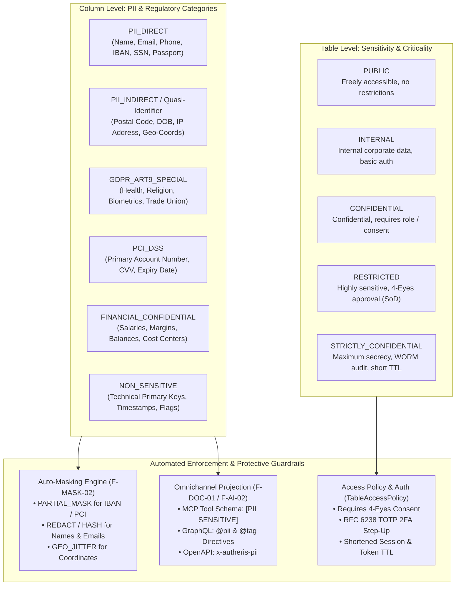
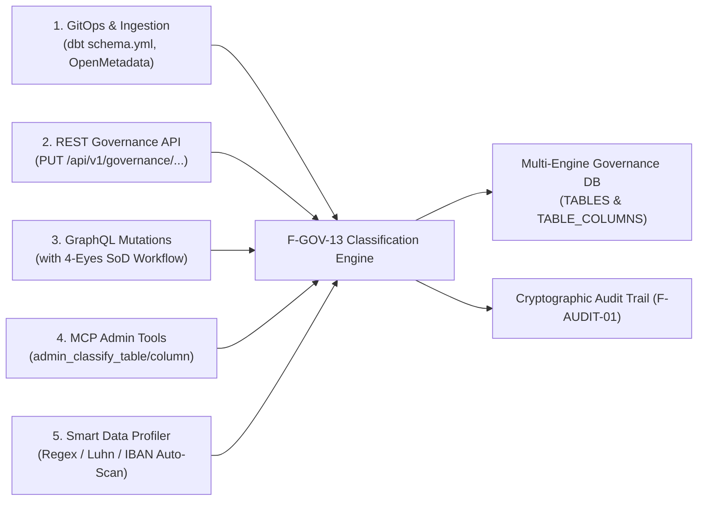

# F-GOV-13: Enterprise Data Classification, PII Tagging & Sensitivity Governance Engine

**Status:** [Proposed / In Design] (Strategic Governance Roadmap – Wave 2)  
**Feature-ID:** F-GOV-13  
**Authors:** Principal .NET & C# Solution Architect & Lead AI/Data Governance Architect  
**Components:** 
- Domain: [`TableModels.cs`](file:///root/autheris/src/Autheris.Domain/Model/TableModels.cs), `ClassificationModels.cs`
- Application: `DataClassificationService.cs`, `SmartDataClassifier.cs`, `AutoMaskingPolicyEnforcer.cs`
- Persistence: `SqliteGovernanceRepository.Catalog.cs`, `PostgreSqlGovernanceRepository.Catalog.cs`, `SqlServerGovernanceRepository.Catalog.cs`
- API & MCP: `ClassificationEndpoints.cs`, `ClassificationMutationTypes.cs`, `McpAdminTools.cs`
- Enforcers: [`TableAccessPolicy.cs`](file:///root/autheris/src/Autheris.Application/Policy/TableAccessPolicy.cs), [`ColumnMaskingProvider.cs`](file:///root/autheris/src/Autheris.Application/Services/ColumnMaskingProvider.cs), [`AstSecurityVisitor.cs`](file:///root/autheris/src/TrinoSqlEngine/AstSecurityVisitor.cs)

---

## 1. Executive Summary & Problem Statement

### 1.1 The Challenge: The Compliance Vacuum in Decentralized Data Architectures
Modern enterprise data platforms integrate dozens of data sources (ERP, CRM, relational SQL databases, S3/Parquet Lakehouses). In practice, severe governance gaps emerge:
1. **Undocumented PII Fields**: Developers and data engineers often lack clear visibility into which tables and columns contain Personally Identifiable Information (PII), payment card data (PCI-DSS), or special category data under GDPR Article 9.
2. **Reactive Instead of Proactive Masking**: Masking rules are frequently configured manually per column (`F-MASK-02`). If an administrator forgets to configure a column rule, plaintext personal data leaks silently to API consumers and AI agents.
3. **Lack of Auditability for Classification Changes**: Who marked a table as `CONFIDENTIAL`? Who downgraded a column's sensitivity? Platforms lack a tamper-proof audit trail enforced by Four-Eyes Segregation of Duties (SoD).
4. **Missing Guidance for AI Agents**: LLMs connected via Model Context Protocol (MCP) perceive columns merely as raw data types (`email: String`, `iban: String`) without understanding legal obligations or sensitivity boundaries.

### 1.2 The Solution: F-GOV-13 Enterprise Data Classification Engine
**F-GOV-13** introduces a centralized, policy-driven data classification and PII governance framework embedded directly within the Autheris Gateway:
- **Two-Tier Taxonomy**: Declarative assignment of **Sensitivity Levels** at the table level and **PII / Regulatory Categories** at the column level.
- **5 Governance Ingestion Channels**: Declarative GitOps/dbt ingestion, REST Governance API, GraphQL mutations with 4-Eyes approval workflows, MCP Admin Tools for AI agents, and an intelligent automated heuristic profiler (`SmartDataClassifier`).
- **Automated Policy & Masking Enforcement**: Classifications automatically trigger protective measures (e.g. `PII_DIRECT` automatically activates partial masking on IBANs and credit cards; `RESTRICTED` enforces Step-Up 2FA).
- **Omnichannel Propagation**: Classifications are projected losslessly into GraphQL introspection (`@tag`, `@pii`), MCP tool schema definitions, OpenAPI 3.1 specifications, and OData CSDL annotations.

---

## 2. Classification Taxonomy



### 2.1 Configurable Sensitivity Levels for Tables (`SensitivityLevels`)

Sensitivity levels are fully declarative and configurable via `GatewayOptions.Classification.SensitivityLevels`. Using spaced numeric ranks (e.g. `10, 20, 25, 30, 35, 40, 50`), organizations can define arbitrary industry-specific intermediate tiers without breaking existing authorization logic:

| Sensitivity Level (Key) | Rank | Description | 4-Eyes (SoD) | Step-Up 2FA | Max Consent TTL |
| :--- | :---: | :--- | :---: | :---: | :---: |
| `PUBLIC` | 10 | Publicly accessible master data (product catalog, foreign exchange rates). | ❌ | ❌ | 365 Days |
| `INTERNAL` | 20 | Internal operational data (inventory levels, department codes). | ❌ | ❌ | 180 Days |
| `INTERNAL_AUDIT_ONLY` *(Intermediate)* | 25 | Internal compliance & audit logs; restricted visibility. | ❌ | ❌ | 90 Days |
| `CONFIDENTIAL` | 30 | Sensitive business & customer data (sales orders, invoices). | ❌ | ❌ | 60 Days |
| `CONFIDENTIAL_FINANCE` *(Intermediate)* | 35 | Confidential corporate financial reports & contribution margins. | ✅ | ❌ | 30 Days |
| `RESTRICTED` | 40 | Highly sensitive personal/financial records (HR payroll, credit scores). | ✅ | ✅ | 30 Days |
| `STRICTLY_CONFIDENTIAL` | 50 | Highest corporate secrecy (Executive board, M&A, legal investigations). | ✅ | ✅ | 7 Days |

### 2.2 Column PII & Regulatory Categories (`ColumnClassification`)

| Category | Typical Examples | Associated Auto-Masking (`F-MASK-02`) | Regulatory Scope |
| :--- | :--- | :--- | :--- |
| `PII_DIRECT` | First Name, Last Name, Email, Phone, IBAN, National ID | `PARTIAL_MASK` (IBAN) or `REDACT` (Name/Email) | GDPR Art. 4, CCPA |
| `PII_INDIRECT` | Postal Code, Date of Birth, IP Address, GPS Coordinates | `GEO_JITTER` (GPS) or `REDACT_YEAR` (Birthdate) | GDPR Recital 26 |
| `GDPR_ART9_SPECIAL` | Health Data, Religious Beliefs, Biometrics, Ethnic Origin | `NULLING` / `BLOCKED` (unless compliance profile granted) | GDPR Art. 9 |
| `PCI_DSS` | Primary Account Number (PAN), Cardholder Name, CVV | `PARTIAL_MASK` (First 4 + Last 4) or `TOKENIZATION` | PCI-DSS v4.0 |
| `FINANCIAL_CONFIDENTIAL` | Annual Salary, Bonus Payments, Account Balances | `NOISE` (Differential Privacy) or `REDACT` | SOX, FinOps |
| `NON_SENSITIVE` | Technical Primary Keys (`id`), Status Flags, Timestamps | No Masking (Plaintext) | - |

> [!NOTE]
> The mapping between categories and masking algorithms is completely customizable. Via `GatewayOptions.Classification.MaskingRules`, administrators can define custom parameterized rules (e.g. `IBAN_STANDARD_4_4`, `EMAIL_DOMAIN_RETAIN`, `CREDIT_CARD_LAST_4`). The `AutoMaskingPolicyMatrix` maps specific combinations of PII type, SQL datatype, and column name regex patterns to target masking transformations.

---

## 3. Five Ingestion & Management Channels



### Channel 1: Declarative GitOps & dbt Ingestion (`schema.yml`)
Data teams can maintain classifications directly within dbt models or OpenMetadata catalogs. The Autheris ingestion layer (`F-DBT-06` and `F-DOC-01`) ingests them losslessly:

```yaml
# dbt schema.yml
version: 2
models:
  - name: customers
    meta:
      autheris:
        sensitivity: RESTRICTED
        data_owner: "finance-governance@corp.local"
    columns:
      - name: email
        meta:
          autheris:
            classification: PII_DIRECT
            auto_mask: REDACT
            regulatory_tags: ["GDPR", "CCPA"]
      - name: iban
        meta:
          autheris:
            classification: PII_DIRECT
            auto_mask: PARTIAL_MASK
            mask_prefix: 4
            mask_suffix: 4
```

---

### Channel 2: REST Governance API (`/api/v1/governance/classification/*`)

Enables CI/CD pipelines, internal developer portals, and catalog sync daemons to manage classifications programmatically:

#### 1. Classify a Table:
```http
PUT /api/v1/governance/tables/550e8400-e29b-41d4-a716-446655440000/classification
Content-Type: application/json
Authorization: Bearer <DataOwner-Token>

{
  "sensitivity": "RESTRICTED",
  "dataOwner": "steward-team@corp.local",
  "governanceTier": "Tier-1",
  "tags": ["Finance", "CoreBanking"],
  "justification": "Annual GDPR Data Protection Impact Assessment audit alignment"
}
```

#### 2. Classify a Column:
```http
PUT /api/v1/governance/columns/7c9e6679-7425-40de-944b-e07fc1f90ae7/classification
Content-Type: application/json
Authorization: Bearer <DataOwner-Token>

{
  "piiType": "PII_DIRECT",
  "sensitivityOverride": "CONFIDENTIAL",
  "regulatoryTags": ["GDPR", "Art6"],
  "autoMaskRule": "PARTIAL_MASK",
  "justification": "IBAN column classification"
}
```

---

### Channel 3: GraphQL Mutations with 4-Eyes Segregation of Duties (SoD)

Modifications to highly sensitive classifications (`RESTRICTED` or `STRICTLY_CONFIDENTIAL`), and especially **sensitivity downgrades** (e.g. downgrading from `RESTRICTED` to `INTERNAL`), can never be performed unilaterally by a single administrator:

```graphql
# 1. Propose Classification Downgrade:
mutation ProposeClassificationChange {
  proposeClassification(
    targetType: TABLE
    targetId: "550e8400-e29b-41d4-a716-446655440000"
    newSensitivity: "INTERNAL" # Downgrade!
    justification: "Table no longer contains customer credit scores after migration."
    idempotencyKey: "prop-class-20261010-001"
  ) {
    proposalId
    status # PENDING_FOUR_EYES_APPROVAL
  }
}

# 2. Second Authorized Data Steward Approves:
mutation ApproveClassificationChange {
  approveClassificationProposal(
    proposalId: "prop-class-20261010-001"
    idempotencyKey: "appr-class-20261010-001"
  ) {
    status # APPROVED
    effectiveSensitivity # INTERNAL
  }
}
```

---

### Channel 4: MCP Admin Tools for Autonomous AI Agents (`F-AI-13`)

Authorized data governance agents operating through the Model Context Protocol can inspect and update dataset classifications:

```json
{
  "name": "admin_classify_column",
  "description": "Sets the sensitivity, PII category, and auto-masking strategy for a specific dataset column.",
  "arguments": {
    "dataset": "finance.dbo.customers",
    "column": "tax_id",
    "piiType": "PII_DIRECT",
    "sensitivity": "RESTRICTED",
    "regulatoryTags": ["GDPR", "FINANCIAL"],
    "autoMaskRule": "HASH",
    "justification": "Tax identifier classification according to EU fiscal transparency act."
  }
}
```

---

### Channel 5: Intelligent Heuristic Profiler (`SmartDataClassifier`)

To classify existing databases containing hundreds of untagged legacy columns, Autheris provides an automated inspection profiler:
- **Validated Detection Algorithms**:
  - **IBAN**: Regex + ISO 7064 Modulo 97 checksum validation.
  - **Credit Cards (PAN)**: Regex + Luhn algorithm (Mod 10).
  - **Email Addresses**: RFC 5322 compliance checking.
  - **IP Addresses**: Strict IPv4 and IPv6 parsing.
  - **Geodata**: Latitude range `[-90, +90]` and Longitude range `[-180, +180]`.
- **Batch Profiling Endpoint (`POST /api/v1/governance/classification/scan/{tableId}`)**:
  Produces classification suggestions with confidence scores (`0.85` – `1.0`) that data stewards can confirm with a single click.

---

## 4. Multi-Engine Governance Database Schema

Persistence is implemented backward-compatibly across SQLite, PostgreSQL, and Microsoft SQL Server:

### 1. `TABLES` Schema Extensions:
```sql
ALTER TABLE TABLES ADD COLUMN sensitivity VARCHAR(64) DEFAULT 'UNCLASSIFIED';
ALTER TABLE TABLES ADD COLUMN data_owner VARCHAR(256) NULL;
ALTER TABLE TABLES ADD COLUMN governance_tier VARCHAR(64) DEFAULT 'Tier-2';
ALTER TABLE TABLES ADD COLUMN classification_version INT DEFAULT 1;
ALTER TABLE TABLES ADD COLUMN worm_signature VARCHAR(128) NULL;
ALTER TABLE TABLES ADD COLUMN classification_updated_at TEXT NULL;
```

### 2. `TABLE_COLUMNS` Schema Extensions:
```sql
ALTER TABLE TABLE_COLUMNS ADD COLUMN pii_type VARCHAR(64) DEFAULT 'NON_SENSITIVE';
ALTER TABLE TABLE_COLUMNS ADD COLUMN classification_level VARCHAR(64) NULL;
ALTER TABLE TABLE_COLUMNS ADD COLUMN regulatory_tags_json TEXT DEFAULT '[]';
ALTER TABLE TABLE_COLUMNS ADD COLUMN auto_mask_rule VARCHAR(64) NULL;
ALTER TABLE TABLE_COLUMNS ADD COLUMN classification_source VARCHAR(64) DEFAULT 'MANUAL';
ALTER TABLE TABLE_COLUMNS ADD COLUMN classification_version INT DEFAULT 1;
ALTER TABLE TABLE_COLUMNS ADD COLUMN worm_signature VARCHAR(128) NULL;
```

---

## 5. Omnichannel Propagation & Agent Experience

Once a classification is activated, Autheris projects it across all 4 client interfaces:

1. **GraphQL Introspection**:
   - Fields and types receive schema directives: `@pii(type: DIRECT, masking: PARTIAL_MASK)` and `@tag(name: "restricted")`.
   - Web IDEs (Banana Cake Pop) display compliance tooltips to analysts.
2. **MCP Tool Schemas (`tools/list` & `resources/read`)**:
   - JSON schemas inform LLM agents upfront:
     `"iban": { "type": "string", "description": "[SENSITIVE - PII_DIRECT - Auto-Masked] International Bank Account Number." }`
   - Agents recognize immediately that accessing raw values requires Step-Up approval.
3. **OpenAPI 3.1 & Swagger UI**:
   - Emits standardized specification extensions: `x-autheris-pii: PII_DIRECT`, `x-autheris-sensitivity: RESTRICTED`.
4. **OData v4 CSDL**:
   - Emits OASIS CSDL annotations: `<Annotation Term="Core.Description" String="[PII: DIRECT] Customer banking identifier" />`.

---

## 6. Verification & Test Strategy

| Test Case ID | Focus | Verification Method |
|---|---|---|
| **TEST-CLASS-01** | Taxonomy hierarchy: Rank enforcement (`SensitivityRank`) and downgrade lock. | Unit Test in `ClassificationTaxonomyTests.cs` |
| **TEST-CLASS-02** | Auto-masking binding: Verifies `ColumnMaskingProvider` triggers whenever a column is `PII_DIRECT`. | Integration Test with unauthenticated query |
| **TEST-CLASS-03** | 4-Eyes Segregation of Duties: Unilateral downgrade of `RESTRICTED` table is rejected. | GraphQL Mutation Test (`AntiSelfApproval`) |
| **TEST-CLASS-04** | Smart Profiler: Verified detection of IBANs and credit card numbers with checksum validation. | Unit Test in `SmartDataClassifierTests.cs` |
| **TEST-CLASS-05** | MCP Schema Enrichment: `tools/list` reflects PII annotations in `InputSchema`. | MCP Protocol Runner Test |
| **TEST-CLASS-06** | Multi-DB Persistence: Migrations execute cleanly on SQLite, Postgres, and SQL Server. | Testcontainers Integration Test |
