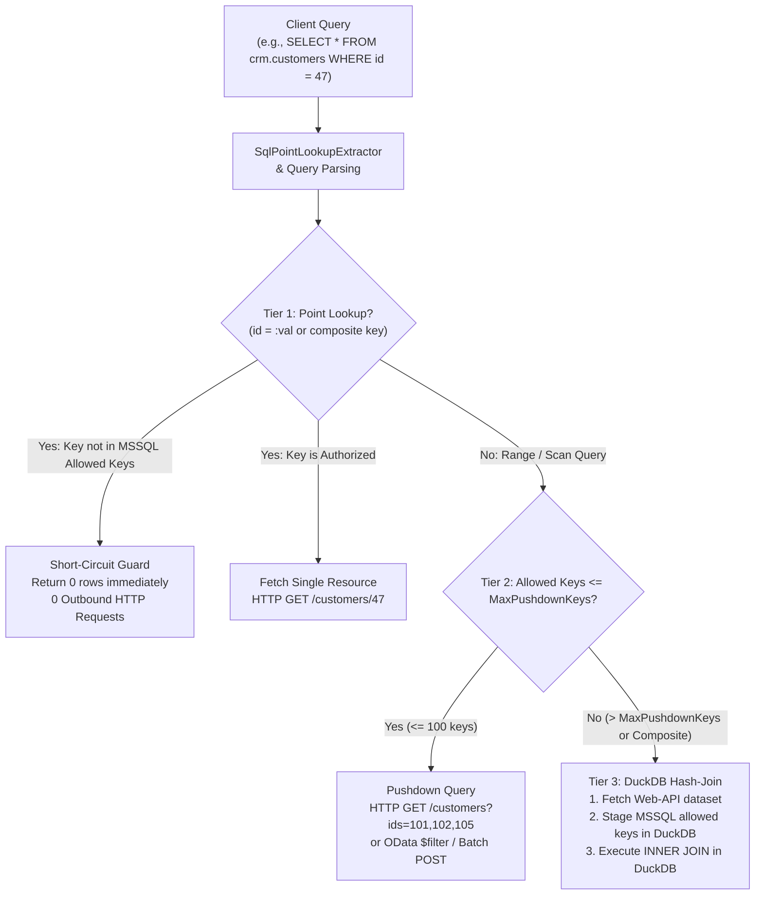

# F-GOV-14: Federated Virtual Filters on Web-APIs via DuckDB & Adaptive Pushdown

## Executive Summary & Problem Statement

Organizations frequently maintain core master data, authorization grants, or customer tenancy in relational databases (such as Microsoft SQL Server or PostgreSQL) while accessing operational business entities via external REST/HTTP Web APIs or microservices. 

Standard virtual views and Row-Level Security (RLS) mechanisms rewrite SQL `WHERE` clauses directly against a database engine's storage tables. However, when querying third-party Web APIs or microservices, traditional database-native SQL views cannot filter outbound HTTP traffic. This previously led to two undesirable extremes:
1. **Unfiltered Data Ingestion:** All rows were retrieved over HTTP into memory before being filtered, risking severe egress data over-fetching, API rate limiting, and compliance breaches.
2. **Missing Point-Lookup Protection:** Queries targeting specific non-existent or unauthorized keys triggered unnecessary external API calls before being rejected.

**F-GOV-14** introduces a federated, multi-tier virtual filter execution engine for external Web APIs, combining in-memory short-circuit point evaluation, outbound HTTP semi-join pushdown, and in-memory DuckDB hash joins.

---

## Architecture & Multi-Tier Execution Pipeline

The federated virtual filter engine uses an adaptive three-tier execution hierarchy:



### 1. Tier 1: In-Memory Short-Circuit Guard
When a user executes a point query (e.g., `WHERE customer_id = 47` or composite `WHERE tenant_id = 't1' AND client_id = 42`), [`VirtualFilterShortCircuitEvaluator`](file:///root/autheris/src/Autheris.Application/VirtualFilters/Services/VirtualFilterShortCircuitEvaluator.cs) extracts the equality predicates using [`SqlPointLookupExtractor`](file:///root/autheris/src/Autheris.Application/Sql/Services/SqlPointLookupExtractor.cs) and checks them against the cached authorized key set from the backing SQL Virtual Filter.
- **Unauthorized / Missing Key:** The query terminates immediately with an empty result set (0 rows). Zero outbound HTTP requests are dispatched to the external web service.
- **Point Hit:** Execution proceeds directly to request that specific resource.

### 2. Tier 2: Semi-Join Pushdown
When the number of authorized keys from the SQL Virtual Filter view is within the configured `MaxPushdownKeys` threshold (default: 100), [`PushdownUrlFormatter`](file:///root/autheris/src/Autheris.Application/VirtualFilters/Services/PushdownUrlFormatter.cs) compiles the allowed keys into the outbound request parameters. Supported pushdown formats include:
- `CommaSeparated`: `?ids=101,102,105`
- `RepeatedParam`: `?id=101&id=102&id=105`
- `ODataIn`: `?$filter=id in (101, 102, 105)`
- `PostBatch`: JSON array body `{ "filterIds": ["101", "102", "105"] }`

### 3. Tier 3: In-Memory DuckDB Hash-Join
When the authorized key count exceeds `MaxPushdownKeys` or when composite keys (`tenant_id`, `client_id`) are utilized:
1. The Web API connector retrieves the candidate dataset into memory.
2. The virtual filter key tuples extracted from MSSQL are staged in an in-memory DuckDB relation table (`s1`).
3. [`CrossSourcePlanner`](file:///root/autheris/src/Autheris.Application/Sql/Services/CrossSourcePlanner.cs) rewrites the query AST to inject an `INNER JOIN` between the Web API staging table and the virtual filter allowed tuple table.
4. The DuckDB OLAP engine executes a vectorized hash-join and returns the final filtered dataset.

---

## Domain Model & Binding Configuration

Federated virtual filter execution is configured via `FilterBinding` records in [`VirtualFilterModels.cs`](file:///root/autheris/src/Autheris.Domain/Model/VirtualFilterModels.cs):

| Property | Type | Description |
| :--- | :--- | :--- |
| `Strategy` | `VirtualFilterExecutionStrategy` | `Adaptive`, `ShortCircuitOnly`, `DuckDbHashJoin`, or `PushdownOnly`. |
| `PushdownFormat` | `PushdownParameterFormat` | `CommaSeparated`, `RepeatedParam`, `ODataIn`, or `PostBatch`. |
| `MaxPushdownKeys` | `int` | Maximum allowed keys to push down before falling back to DuckDB join. |
| `CompositeKeys` | `IReadOnlyList<string>` | Composite key column names (e.g., `["tenant_id", "client_id"]`). |
| `ColumnMap` | `IReadOnlyDictionary<string, string>` | Mapping between SQL filter key names and Web API payload attributes. |
| `TargetPattern` | `string` | Regex pattern (prefixed by `^` or `regex:`) matching target Web API tables. |

---

## Usage Example

### Defining an MSSQL Virtual Filter on an External Web API

#### 1. SQL Virtual Filter Definition (MSSQL Data Source)
```sql
CREATE VIEW dbo.v_authorized_customers AS
SELECT customer_id, tenant_id
FROM dbo.tenancy_grants
WHERE user_sid = 'S-1-5-21-CORP-USER';
```

#### 2. Virtual Filter & Binding Profile Configuration
```json
{
  "VirtualFilters": [
    {
      "Name": "vf_authorized_customers",
      "Source": "mssql_corp",
      "KeyColumns": ["client.customer_id"],
      "Status": "Active"
    }
  ],
  "Profiles": [
    {
      "Name": "sales_representative_profile",
      "GranteeType": "Role",
      "RoleName": "SalesRepresentative",
      "Scope": "web_crm.*.*",
      "Uncovered": "Skip",
      "Bindings": [
        {
          "FilterName": "vf_authorized_customers",
          "TargetPattern": "^web_crm\\.public\\.customers$",
          "Strategy": "Adaptive",
          "PushdownFormat": "CommaSeparated",
          "MaxPushdownKeys": 100,
          "ColumnMap": {
            "customer_id": "id"
          }
        }
      ]
    }
  ]
}
```

#### 3. Client WebSQL Invocation
```sql
-- Point lookup: if customer 999 is not in dbo.v_authorized_customers,
-- WebSQL immediately returns 0 rows without sending any HTTP request.
SELECT id, name, email 
FROM web_crm.public.customers 
WHERE id = 999;
```

---

## Security & Fail-Closed Invariants

1. **Fail-Closed Availability:** If the upstream SQL server backing the Virtual Filter is unreachable or throws a connection error, [`DefaultVirtualFilterKeyProvider`](file:///root/autheris/src/Autheris.Application/VirtualFilters/Services/DefaultVirtualFilterKeyProvider.cs) throws a `GatewaySecurityException` ("ERR_DB_UNAVAILABLE"). Egress Web API requests are unconditionally blocked.
2. **ReDoS Protection:** All regex matching against `TargetPattern` enforces a strict 50ms regex timeout (`TimeSpan.FromMilliseconds(50)`).
3. **RAM & Budget Boundaries:** Federated staging obeys `FederationBudget` restrictions, capping maximum staged rows and memory consumption per table.
4. **Zero-Trust Cache Isolation:** In-memory cached key sets in `IMemoryCache` are segmented per tenant and caller SID (`vf_tuples:{tenant}:{filter}:{sid}`).
