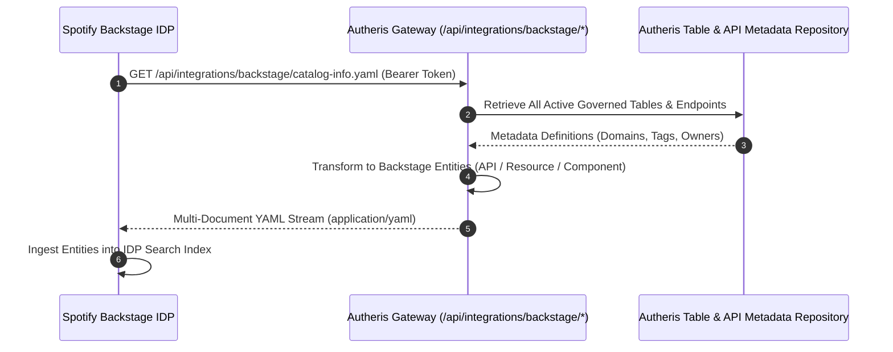

# F-INT-01: Spotify Backstage Software Catalog Integration

**Status:** [Done] (100% GA – Production-Ready)  
**Components:** [`BackstageEndpoints.cs`](file:///root/autheris/src/Autheris.Api/Endpoints/BackstageEndpoints.cs), [`IBackstageCatalogExportService.cs`](file:///root/autheris/src/Autheris.Application/Integrations/Backstage/IBackstageCatalogExportService.cs), [`BackstageCatalogExportService.cs`](file:///root/autheris/src/Autheris.Application/Integrations/Backstage/BackstageCatalogExportService.cs), [`BackstageYamlSerializer.cs`](file:///root/autheris/src/Autheris.Application/Integrations/Backstage/BackstageYamlSerializer.cs)

---

## 1. Overview & Problem Statement

Enterprises increasingly deploy **Spotify Backstage** as their central Internal Developer Portal (IDP) to track software components, APIs, and microservice dependencies. However, maintaining API and data asset documentation in Backstage manually leads to stale schemas, undocumented endpoints, and compliance drift.

**F-INT-01** provides native integration between Autheris and the **Backstage Software Catalog**. Autheris automatically projects its governed datasets, declarative SQL/OData/GraphQL endpoints, and system resources as standard Backstage `API`, `Resource`, and `Component` entities in both JSON and YAML formats.

---

## 2. Business Value

- **Zero-Touch Developer Portal Discovery**: Data products, relational tables, and federated endpoints registered in Autheris appear automatically in the enterprise Backstage catalog.
- **Always Up-to-Date OpenAPI & Graph Specs**: Backstage entities link directly to live, governed OpenAPI 3.1 definitions and GraphQL schemas served by the gateway.
- **Standardized Backstage Entity Schema**: Emits valid `apiVersion: backstage.io/v1alpha1` entity descriptors compatible with official Backstage catalog ingestion processors.
- **RBAC-Protected Discovery**: Ingestion endpoints require authorized synchronization roles (`ClusterAdmin`, `CatalogSync`, or `GlobalGovernanceAdmin`).

---

## 3. Architecture & Ingestion Flow



### Supported Integration Endpoints

| Method | Endpoint | Response Format | Description |
| :--- | :--- | :--- | :--- |
| `GET` | `/api/integrations/backstage/catalog-entities` | JSON / YAML | Lists all catalog entities, filterable by `?kind=API` or `?type=openapi`. |
| `GET` | `/api/integrations/backstage/catalog-entities/{name}` | JSON / YAML | Retrieves a single entity descriptor by its canonical name. |
| `GET` | `/api/integrations/backstage/catalog-info.yaml` | Multi-doc YAML | Standard `catalog-info.yaml` stream for Backstage URL registration. |

---

## 4. Usage Example

### Registering in Backstage `app-config.yaml`

```yaml
catalog:
  locations:
    - type: url
      target: http://autheris-gateway.autheris.svc.cluster.local:8080/api/integrations/backstage/catalog-info.yaml
      rules:
        - allow: [Component, API, Resource]
```

### Querying Entities via cURL

```bash
# Fetch complete catalog in YAML format
curl -X GET "http://localhost:8080/api/integrations/backstage/catalog-info.yaml" \
  -H "Authorization: Bearer <catalog-sync-token>"
```

**Exported Entity Sample:**
```yaml
apiVersion: backstage.io/v1alpha1
kind: API
metadata:
  name: sales-invoices-api
  title: Sales Invoices Governed Data API
  description: Governed REST and OData v4 endpoint for sales invoices.
  tags:
    - autheris-governed
    - sales
    - confidential
spec:
  type: openapi
  lifecycle: production
  owner: group:data-engineering-sales
  definition:
    $text: http://localhost:8080/odata/v4/sales/openapi.json
```

---

## 5. Configuration Example

```json
{
  "Gateway": {
    "Backstage": {
      "Enabled": true,
      "DefaultOwner": "group:platform-governance",
      "DefaultLifecycle": "production",
      "IncludeInactiveTables": false
    }
  }
}
```
