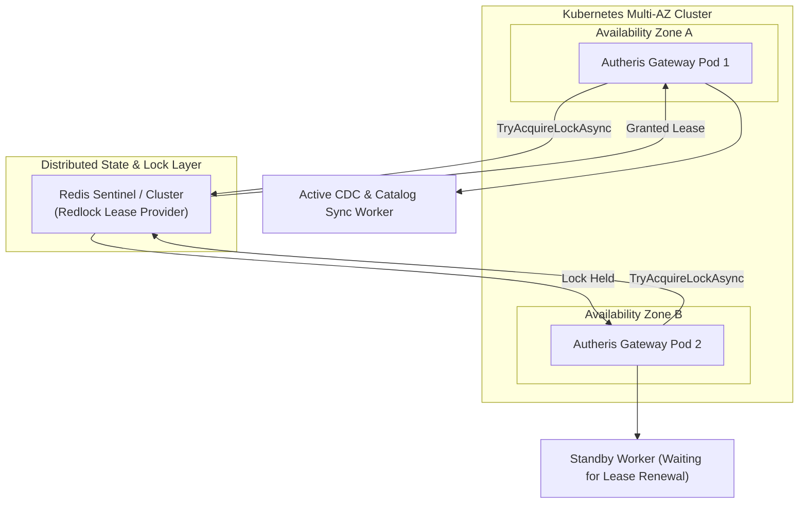

# F-OPS-02: Enterprise High Availability, Kubernetes Helm & Distributed Concurrency

**Status:** [Done] (100% GA – Production-Ready)  
**Components:** [`deploy/helm/autheris/`](file:///root/autheris/deploy/helm/autheris), [`IDistributedLockProvider.cs`](file:///root/autheris/src/Autheris.Application/Distributed/IDistributedLockProvider.cs), [`RedisDistributedLockProvider.cs`](file:///root/autheris/src/Autheris.Infrastructure/Distributed/RedisDistributedLockProvider.cs), [`HitLStepUpApprovalService.cs`](file:///root/autheris/src/Autheris.Application/Security/HitLStepUpApprovalService.cs), [`prometheusrule.yaml`](file:///root/autheris/deploy/helm/autheris/templates/prometheusrule.yaml)

---

## 1. Overview & Problem Statement

Running enterprise data governance gateways across multi-node Kubernetes clusters introduces complex distributed systems challenges:
1. **Split-Brain & Duplicate Execution**: Background synchronization services (e.g. Change Data Capture polling, catalog re-indexing, consent recertification) executed across multiple replicas can corrupt state or trigger duplicate side-effects.
2. **Cluster Partition Vulnerabilities**: Distributed approval workflows (such as Human-in-the-Loop step-up token generation) may become inconsistent during network splits.
3. **Rolling Update Downtime**: Pod evictions during cluster autoscaling or node maintenance can terminate active in-flight queries prematurely.

**F-OPS-02** provides an end-to-end **High Availability (HA) & Operational Excellence** architecture. It includes distributed lease-locking for background singletons, partition-tolerant approval synchronizations, a production-grade Kubernetes Helm Chart, and out-of-the-box Prometheus SLO alerting rules.

---

## 2. Business Value

- **Zero-Downtime Rolling Upgrades**: Guaranteed by Kubernetes `PodDisruptionBudget` (`minAvailable: 1`) combined with a 15-second `preStop` container lifecycle drain hook.
- **Multi-AZ Disaster Resilience**: Enforces Kubernetes `topologySpreadConstraints` across `topology.kubernetes.io/zone`, ensuring Gateway pods survive total availability zone outages.
- **Fail-Closed Security on Partition**: When Redis cluster partitions occur, critical Human-in-the-Loop (HitL) approvals fail closed rather than allowing unconfirmed privilege step-ups.
- **Automated SRE Observability**: Pre-configured PrometheusRule alerts detect 5xx error rate spikes ($> 0.5\%$), P99 latency regressions ($> 250\text{ms}$), and audit log dead-letter queue backlogs.

---

## 3. Architecture & Distributed Locking



### Managed Background Singletons

The following background hosted services utilize `IDistributedLockProvider`:
- `MssqlChangeTrackingHostedService`: Polls SQL Server CDC changes without duplicate event dispatch.
- `DataCatalogSyncBackgroundService`: Synchronizes Purview/Collibra catalog schemas.
- `OpenMetadataSyncBackgroundService`: Incremental OpenMetadata entity replication.
- `ConsentRecertificationHostedService`: Executes periodic GDPR/Consent recertification sweeps.

---

## 4. Kubernetes Deployment via Helm

### Deploying the Production Chart

```bash
helm upgrade --install autheris ./deploy/helm/autheris \
  --namespace autheris \
  --create-namespace \
  -f ./deploy/helm/autheris/values.production.yaml
```

### Helm Configuration Highlights (`values.yaml`)

```yaml
replicaCount: 2

autoscaling:
  enabled: true
  minReplicas: 2
  maxReplicas: 10
  targetCPUUtilizationPercentage: 75
  targetMemoryUtilizationPercentage: 80

podDisruptionBudget:
  enabled: true
  minAvailable: 1

topologySpreadConstraints:
  - maxSkew: 1
    topologyKey: topology.kubernetes.io/zone
    whenUnsatisfiable: ScheduleAnyway
    labelSelector:
      matchLabels:
        app.kubernetes.io/name: autheris

lifecycle:
  preStop:
    exec:
      command: ["/bin/sh", "-c", "sleep 15"]

monitoring:
  serviceMonitor:
    enabled: true
  prometheusRule:
    enabled: true
```

---

## 5. Pre-Configured SRE Alerting Rules

The chart automatically deploys CoreOS `PrometheusRule` resources:

| Alert Name | Severity | Condition | Description |
| :--- | :--- | :--- | :--- |
| **`AutherisHigh5xxRate`** | `critical` | 5xx error rate $> 0.5\%$ for 1m | Alerts when gateway HTTP 5xx responses spike. |
| **`AutherisHighP99Latency`** | `warning` | P99 latency $> 250\text{ms}$ for 3m | Warns when query execution times exceed SLA threshold. |
| **`AutherisAuditDeadLetterQueueGrowing`** | `critical` | Increase in DLQ $> 0$ for 1m | Fails loudly if audit logs fail to commit to primary store. |
| **`AutherisRedisClusterDisconnected`** | `critical` | Redis state connected $= 0$ for 30s | Pods operating in degraded in-memory fallback mode. |
