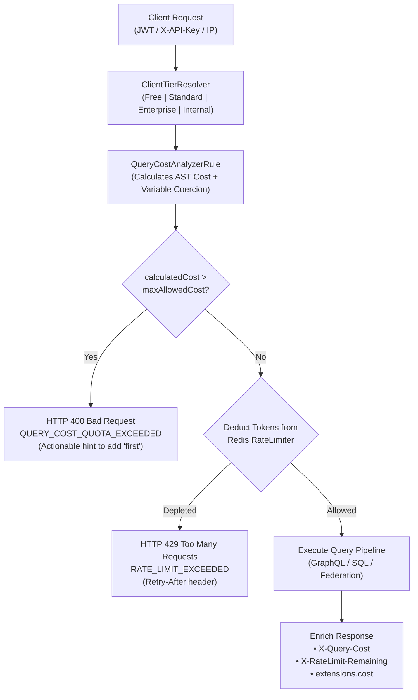

# F-PERF-13: GraphQL Cost & Client-Tier Quota Rate Limiting

**Status:** [Done] (100% GA – Production-Ready)  
**Components:** [`CostAndQuotaMiddleware.cs`](file:///root/autheris/src/Autheris.GraphQL/Interceptors/CostAndQuotaMiddleware.cs), [`ClientTierResolver.cs`](file:///root/autheris/src/Autheris.Application/Caching/Services/ClientTierResolver.cs), [`QueryCostAnalyzerRule.cs`](file:///root/autheris/src/Autheris.GraphQL/Validation/QueryCostAnalyzerRule.cs), [`RedisRateLimiterService.cs`](file:///root/autheris/src/Autheris.Infrastructure/RateLimiting/RedisRateLimiterService.cs), [`ClientTierModels.cs`](file:///root/autheris/src/Autheris.Domain/Model/ClientTierModels.cs)

---

## 1. Overview & Problem Statement

GraphQL APIs give clients flexible data querying capabilities, but this flexibility exposes backend databases to Denial-of-Service (DoS) and Denial-of-Wallet attacks. Malicious or poorly optimized queries with deep nesting, cartesian product joins, or missing pagination limits can easily monopolize database CPU, exhaust connection pools, and degrade latency for all tenants.

**F-PERF-13** provides an intelligent, pre-execution defense layer implemented by the [`CostAndQuotaMiddleware`](file:///root/autheris/src/Autheris.GraphQL/Interceptors/CostAndQuotaMiddleware.cs). Before any query reaches the execution pipeline or contacts a data source:
1. The query AST complexity is statically calculated and weighted against runtime pagination variables.
2. The caller is mapped to a governed **Client Tier** (`Free`, `Standard`, `Enterprise`, or `Internal`).
3. If the query exceeds the tier's maximum allowable complexity per query, it is rejected immediately (**Fail-Fast**).
4. If the query cost is within budget, that exact cost is atomically deducted from the caller's distributed **Token Bucket** in Redis.
5. If the caller's token bucket is depleted, the request is throttled with HTTP `429 Too Many Requests` and a standard `Retry-After` header.

---

## 2. Business Value

- **Zero Database Load on Rejection**: Expensive or malicious queries are aborted in microseconds at the gateway layer before dispatching SQL or GraphQL queries to underlying stores.
- **Fair Resource Allocation & SLA Guarantees**: Higher-paying Enterprise clients and internal critical services receive higher throughput and complexity budgets, while free/unauthenticated callers are strictly contained.
- **Actionable Developer Feedback**: When a query exceeds the cost budget, the engine returns a detailed explanation and hints (e.g. suggesting adding `first: 10` on nested list selections) rather than an opaque timeout.
- **Anti-Spoofing Multi-Tenant Isolation**: In compliance with invariant **SEC M-16**, quota buckets are bound to the caller's `TenantId + UserSID`, preventing clients from bypassing rate limits by rotating API keys or client headers.

---

## 3. Architecture & Capabilities



### Default Client Tiers & Policies

| Client Tier | Max Cost / Query | Max AST Depth | Token Capacity | Refill Rate / Sec | Expose Cost Extensions |
| :--- | :--- | :--- | :--- | :--- | :--- |
| **`Free`** (Anonymous / Unauthenticated) | `50` | `5` | `100` | `2.0 / s` | `false` |
| **`Standard`** (Default Authenticated) | `250` | `10` | `1,000` | `20.0 / s` | `true` |
| **`Enterprise`** (Contracted / High Volume) | `1,000` | `20` | `10,000` | `200.0 / s` | `true` |
| **`Internal`** (Service-to-Service / Admin) | `5,000` | `30` | `50,000` | `1,000.0 / s` | `true` |

*(All tier thresholds are fully configurable via `RateLimiting:ClientTiers:TierLimits`)*.

---

## 4. Usage & Response Examples

### A. Successful Query Execution with Cost Headers

**Request:**
```bash
curl -X POST http://localhost:8080/graphql \
  -H "Authorization: Bearer <jwt-token>" \
  -H "Content-Type: application/json" \
  -d '{
    "query": "query GetOrders($limit: Int) { orders(first: $limit) { id total customer { name } } }",
    "variables": { "limit": 10 }
  }'
```

**Response Headers:**
```http
HTTP/1.1 200 OK
Content-Type: application/json; charset=utf-8
X-Query-Cost: 22
X-RateLimit-Remaining: 978
```

**Response Body (with `extensions.cost`):**
```json
{
  "data": {
    "orders": [
      { "id": "1001", "total": 149.99, "customer": { "name": "Acme Corp" } }
    ]
  },
  "extensions": {
    "cost": {
      "requestedQueryCost": 22,
      "maxAllowedCost": 250,
      "tier": "Standard"
    }
  }
}
```

---

### B. Query Exceeding Maximum Complexity Limit

When a client attempts to fetch an unpaginated nested list that exceeds the tier's single-query cost ceiling:

**Response Body:**
```http
HTTP/1.1 400 Bad Request
Content-Type: application/json; charset=utf-8
```
```json
{
  "errors": [
    {
      "message": "The query cost (450) exceeds the limit of 250. Nested list fields require 'first' (e.g. first: 10) or lower pagination limits to bound query cost within budget.",
      "extensions": {
        "code": "QUERY_COST_QUOTA_EXCEEDED",
        "calculatedCost": 450,
        "maxAllowedCost": 250,
        "hint": "Add 'first: <n>' to nested list selections or declare lower pagination limits to reduce query cost within budget."
      }
    }
  ]
}
```

---

### C. Rate Limit Exhaustion (Token Bucket Depleted)

When a client submits queries faster than the token refill rate:

**Response Headers & Body:**
```http
HTTP/1.1 429 Too Many Requests
Content-Type: application/json; charset=utf-8
Retry-After: 15
```
```json
{
  "errors": [
    {
      "message": "Rate limit exceeded. Wait until the next time window.",
      "extensions": {
        "code": "RATE_LIMIT_EXCEEDED",
        "retryAfterSeconds": 15
      }
    }
  ]
}
```

---

## 5. Configuration Example

In `appsettings.json` or Kubernetes ConfigMap:

```json
{
  "Gateway": {
    "RateLimiting": {
      "PreAuthIpRateLimit": {
        "PermitLimit": 100,
        "WindowSeconds": 60,
        "QueueLimit": 0
      },
      "PostAuthSidRateLimit": {
        "TokenBucketCapacity": 500,
        "TokensPerSecond": 50,
        "MaxCostPerMinute": 10000
      },
      "ClientTiers": {
        "RoleTierMappings": {
          "FinanceSuperUser": "Enterprise",
          "AnalyticsAgent": "Standard",
          "InternalSystemAdmin": "Internal"
        },
        "ApiKeys": {
          "ak_live_premium_client_123": "Enterprise"
        },
        "TierLimits": {
          "Standard": {
            "MaxCostPerQuery": 300,
            "MaxTokensCapacity": 2000,
            "TokenRefillRatePerSecond": 30.0,
            "ExposeCostExtensions": true
          },
          "Enterprise": {
            "MaxCostPerQuery": 2000,
            "MaxTokensCapacity": 20000,
            "TokenRefillRatePerSecond": 400.0,
            "ExposeCostExtensions": true
          }
        }
      }
    },
    "GraphQL": {
      "MaxAllowedComplexity": 500,
      "MaxAllowedExecutionDepth": 10,
      "MaxResponseRows": 1000
    }
  }
}
```
