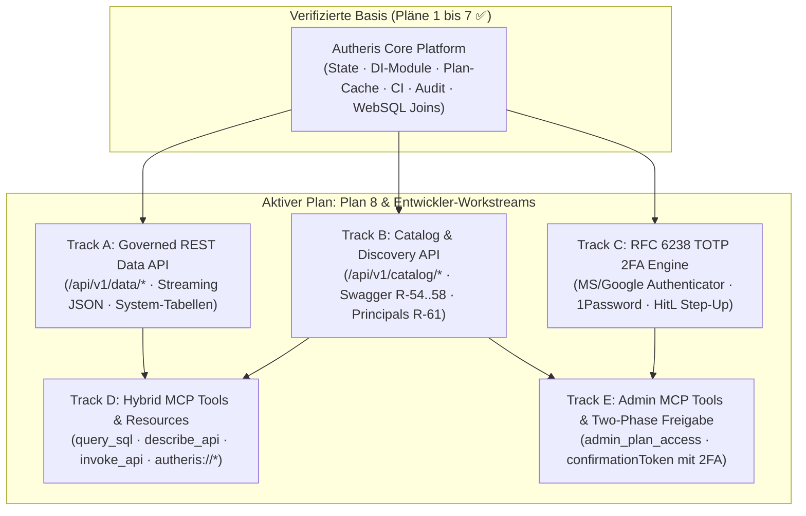

# Gesamtübersicht der Architektur- & Implementierungspläne

**Stand:** 09.10.2026 · **Zweig:** `feat/ast-target-dialect-generator`  
**Rolle:** C# & .NET Solution Architect  
**Ziel:** Strukturierte Übersicht und Ausführungsgraph des aktiven Backlogs in `docs/plans/`. Abgeschlossene Pläne (1–7) wurden nach erfolgreicher Implementierung und Verifikation bereinigt.

---

## 1. Aktive Implementierungspläne

| Plan / Dokument | Thema / Feature | Behandelte Befunde & Anforderungen | Status |
|---|---|---|---|
| **[Plan 8: Vollständige Daten-API & MCP-Bereitstellung](plan-vollstaendige-daten-api-und-mcp-bereitstellung.md)** | Governed REST Data API (`/api/v1/data/*`), Discovery & MCP-Ökosystem (Tools, Resources, Prompts) | **R-54 bis R-66, PoC Citizen Dev & MCP** | Neu erstellt – bereit zum Review ⏳ |
| **[Entwickler-Workstreams & TDD-Spezifikation](plan-workstreams-entwickler-details.md)** | Detaillierte Modellspezifikationen, C#-Interfaces, Testpläne und Aufteilung in 5 parallele Entwickler-Tracks (A bis E) | **Umsetzungs-Blueprint für Entwickler-Agents** | Spezifiziert & bereit zur TDD-Ausführung ⏳ |
| **[SQL-AST Keyword- & Downstream-Analyse](2026-10-09-sql-ast-keyword-support-und-downstream-analyse.md)** | Prüfung aller SQL-Keywords im AST, Fail-Loud-Verhalten und Ziel-Dialekt-Generierung | **Befunde F-01 bis F-04, WebSQL AST-Compiler** | Dokumentiert & bereit zur Behebung ⏳ |

---

## 2. Historie: Erfolgreich umgesetzte & verifizierte Pläne ✅

Alle vorherigen Pläne wurden vollständig umgesetzt, bereinigt und durch **3.761 Unit-Tests**, **13 Architektur-Tests** und **1.628 Engine-/Extensions-Tests** mit **0 Fehlern und 0 Warnungen** verifiziert:

- **Plan 1 (Distributed State & Invalidation):** AR-01 bis AR-04, AR-12. Epoch-Keyed Caching, generation pull-validation, atomare Redis Lua-Scripts für DP-Budget & FinOps, lock-freier Casbin-Matcher.
- **Plan 2 (God-Classes Refactoring & Modularisierung):** AR-05, AR-06, AR-07, AR-11, AR-18. DI-Modularisierung (`AddAutheris*`), `GovernedSqlRewriter`/`Executor` ($\le 800$ Zeilen), typsichere `TableIdentifier`.
- **Plan 3 (Performance, Caching & Dialekte):** AR-08 bis AR-10, AR-13 bis AR-15, AR-19. Bounded LRU Plan-Cache, Policy-Fingerprinting, `SqlDialectMapper`, SQLite-Produktionswarnung.
- **Plan 4 (Supply Chain & CI-Härtung):** SC-01 bis SC-18. Trivy-Scanning, Cosign Keyless-Signing, Syft-SBOM, Non-Root-User `10001:10001`, Seccomp, Read-Only RootFS.
- **Plan 5 (PoC Arrow/OLAP & MCP Staging):** Befunde 3.1 & 3.2. ReBAC-Hierarchie (`schema:`, `domain:`), Fail-Closed Evaluator, RFC-9728 Discovery, Dev-CORS, Batch-Rejection.
- **Plan 6 (Lückenloses Zugriffs-Audit):** Lücken L-1 bis L-9. `AccessAuditMiddleware`, 100% Endpoint-Audit, `AuditDetailsBuilder` PII-Maskierung, `AuthFailureAggregator`.
- **Plan 7 (WebSQL Heterogene API Federation & Joins):** `CrossSourceQueryRouter`, `CrossSourcePlanner`, `FederatedDuckDbExecutionService`, Pre-Staging Masking vor DuckDB-Ingest.
- **Frühere Kernfunktionen:** dbt-Governance (B-01..06, R-50..51), erweiterte Maskierung (R-53, R-25), Klartext je Person (R-52), KMS-Audit (AU-01..19), Security Review Phasen 1–3 (SG-01..39).

---

## 3. Ausführungsgraph des verbleibenden Backlogs

---

## 4. Quelltexte und Referenzdokumente

- [Plan 8: Vollständige Daten-API & MCP-Bereitstellung](plan-vollstaendige-daten-api-und-mcp-bereitstellung.md)
- [Entwickler-Workstreams & TDD-Spezifikation (Tracks A bis E)](plan-workstreams-entwickler-details.md)
- [Feature Request: Admin-Datenquellen & MCP (R-54 bis R-66)](2026-10-09-feature-request-admin-datenquellen-und-mcp.md)
- [SQL-AST Keyword- & Downstream-Analyse](2026-10-09-sql-ast-keyword-support-und-downstream-analyse.md)
