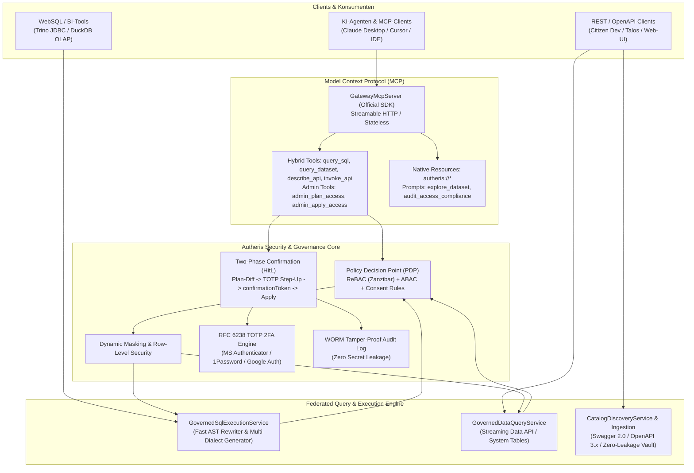

# Gesamtübersicht der Architektur- & Implementierungspläne

**Stand:** 09.10.2026 · **Zweig:** `feat/ast-target-dialect-generator`  
**Rolle:** C# & .NET Solution Architect  
**Ziel:** Strukturierte Übersicht und Ausführungsgraph des aktiven Backlogs in `docs/plans/`. Abgeschlossene Pläne (1–7, SQL-AST Härtung sowie Tracks A, B, C) wurden nach erfolgreicher Implementierung und Verifikation bereinigt.

---

## 1. Aktive Implementierungspläne (Noch OFFEN ⏳)

Basierend auf der Produktmanager-Gap-Analyse wurde der architektonische Implementierungsplan **Plan 9** erstellt und zur Umsetzung freigegeben:

| Plan / Dokument | Thema / Feature | Behandelte Anforderungen & Komponenten | Status |
|---|---|---|---|
| **[Plan 9: Restliche Lücken – Onboarding, Paginierung, UI & Jobs](2026-10-09-implementierungsplan-restliche-luecken-onboarding-pagination-ui-jobs.md)** | • **AP-9.1:** Verbindungstest für Datenquellen (`POST /api/v1/catalog/datasources/{id}/test`) • **AP-9.2:** Multi-Page HTTP Staging Pagination Engine (`offset/limit`, `nextLink`, `cursor`) • **AP-9.3:** 2FA & HitL Web Console im DevPortal (`/portal/2fa/enroll`, `/portal/approvals`) • **AP-9.4:** Async Long-Running Query Job Engine (`/api/v1/jobs/query`, `GET /status`, `GET /result`) | **R-55, R-56, R-60, R-64 UX, F-DATA-05** • `DatasourceTestingService.cs` • `DeclarativeHttpDataSourceExecutor.cs` • `DevPortalEndpoints.cs` • `AsyncQueryJobManager.cs` | **OFFEN ⏳** Bereit zur TDD-Umsetzung |

---

## 2. Historie: Erfolgreich umgesetzte & verifizierte Pläne ✅

Alle nachfolgenden Arbeitspakete wurden vollständig implementiert, durch automatisierte Tests verifiziert und aus dem aktiven Backlog bereinigt:

- **Plan 8 – Vollständige Daten-API & MCP-Bereitstellung (Tracks A bis E):** ✅
  - **Track A (Governed REST Data API):** `/api/v1/data/{domain}/{table}` mit Streaming, Paging, Maskierung und System-Tabellen (`governance.system.*`).
  - **Track B (Catalog & Discovery API & Swagger Ingestion):** `/api/v1/catalog/*`, Swagger 2.0 / OpenAPI Ingestion, Zero-Leakage Secrets, ReBAC Filterung.
  - **Track C (RFC 6238 TOTP 2FA Engine):** Enrollment, Replay-Schutz, Validierung für Microsoft Authenticator, Google Authenticator, 1Password.
  - **Track D (Hybrid MCP Tools & Resources):** High-Level Tools (`query_sql`, `query_dataset`, `search_catalog`, `get_my_permissions`, `list_datasources`, `get_data_lineage`, `describe_api`, `invoke_api`), native MCP Resources (`autheris://*`) und Prompts (`explore_dataset`, `audit_access_compliance`).
  - **Track E (Admin MCP Tools & Two-Phase Freigabe):** `admin_plan_access`, `admin_apply_access`, `admin_register_datasource`, `admin_set_dataset_state`, `admin_resolve_principal` mit TOTP 2FA Step-Up und WORM-Audit.
- **SQL-AST Keyword-Support & Fail-Loud Härtung (AP-1 bis AP-5):** ✅
  - Härtung gegen Silent Dropping bei `TABLESAMPLE`, `PIVOT`, `MATCH_RECOGNIZE` (`SqlAstBuilder.VisitSampledRelation`).
  - Modellierung und Codegenerierung von `FETCH ... ROWS WITH TIES` über alle Dialekte (SQL Server, Postgres, Oracle, Snowflake, DuckDB, SQLite).
  - Lexer-Regex-Erweiterung für alphanumerische Keywords (`UTF8`, `UTF16`, `UTF32`) in `SqlKeywords.cs`.
  - Case-Insensitive Snowflake Identifier Quoting (`"USER"`, `"ORDERS"`) gegen Keyword-Kollisionen.
  - Verifiziert durch **1.421 Tests mit 0 Fehlern** in `TrinoSqlEngine.Tests`.
- **Pläne 1 bis 7 (Autheris Core Platform):** ✅
  - Distributed State & Invalidation (Plan 1), Modularisierung (Plan 2), Plan-Cache & Dialekte (Plan 3), CI-Härtung (Plan 4), PoC Arrow/OLAP & ReBAC (Plan 5), Lückenloses Zugriffs-Audit (Plan 6), WebSQL heterogene Cross-Source Joins (Plan 7).

---

## 3. Architektur-Zustand des Gesamtsystems

---

## 4. Quelltexte und Referenzdokumente

- **Aktiver Implementierungsplan:** [Plan 9: Restliche Lücken – Onboarding, Paginierung, UI & Jobs](2026-10-09-implementierungsplan-restliche-luecken-onboarding-pagination-ui-jobs.md)
- **Historische Pläne (1–8, SQL-AST Härtung, Feature Requests):** Vollständig implementiert, verifiziert und in der Git-Historie archiviert.
