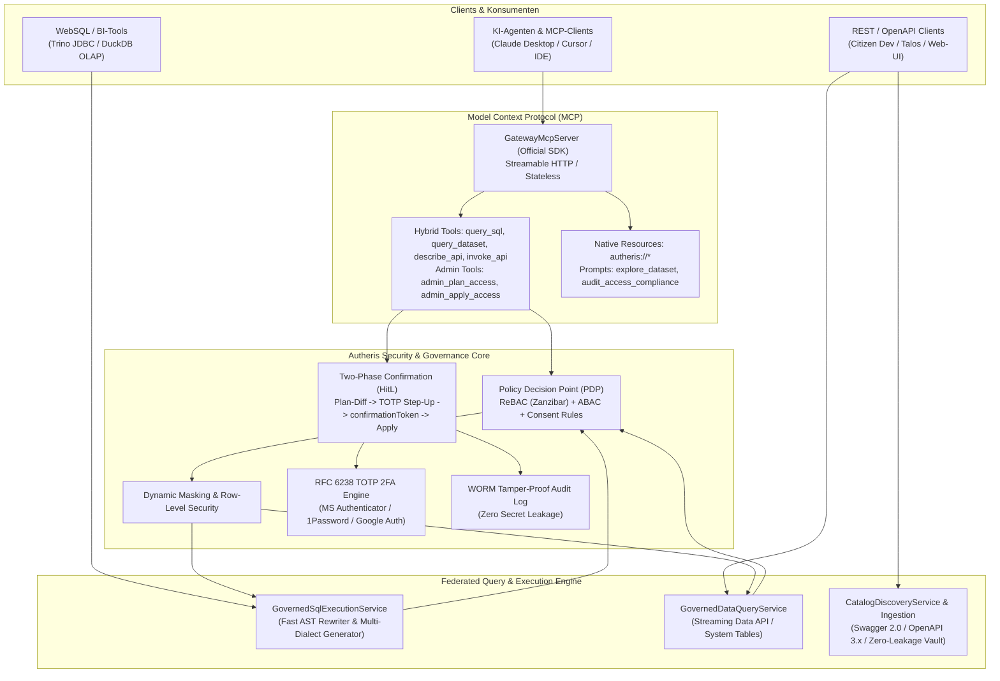

# Gesamtübersicht der Architektur- & Implementierungspläne

**Stand:** 09.10.2026 · **Zweig:** `feat/ast-target-dialect-generator`  
**Rolle:** C# & .NET Solution Architect  
**Ziel:** Strukturierte Übersicht und Ausführungsgraph des aktiven Backlogs in `docs/plans/`. Abgeschlossene Pläne (1–7, SQL-AST Härtung sowie Tracks A, B, C) wurden nach erfolgreicher Implementierung und Verifikation bereinigt.

---

## 1. Aktive Implementierungspläne (Noch OFFEN ⏳)

Basierend auf der Produktmanager-Gap-Analyse wurde der architektonische Implementierungsplan **Plan 9** erstellt und zur Umsetzung freigegeben:

| Plan / Dokument | Thema / Feature | Behandelte Anforderungen & Komponenten | Status |
|---|---|---|---|
| **[Plan 9: Restliche Lücken – Onboarding, Paginierung, UI & Jobs](2026-10-09-implementierungsplan-restliche-luecken-onboarding-pagination-ui-jobs.md)** | • **AP-9.1:** Verbindungstest für Datenquellen (`POST /api/v1/catalog/datasources/{id}/test`) • **AP-9.2:** Multi-Page HTTP Staging Pagination Engine (`offset/limit`, `nextLink`, `cursor`) • **AP-9.3:** 2FA & HitL Web Console im DevPortal (`/portal/2fa/enroll`, `/portal/approvals`) • **AP-9.4:** Async Long-Running Query Job Engine (`/api/v1/jobs/query`, `GET /status`, `GET /result`) | **R-55, R-56, R-60, R-64 UX, F-DATA-05** • `DatasourceTestingService.cs` • `DeclarativeHttpDataSourceExecutor.cs` • `DevPortalEndpoints.cs` • `AsyncQueryJobManager.cs` | **VOLLSTÄNDIG IMPLEMENTIERT & VERIFIZIERT ✅** |
| **[Plan 10: MCP Schema-RAG & Hybrid-Vektorsuche](2026-10-09-implementierungsplan-mcp-schema-rag-vektorsuche-katalog.md)** | • **AP-10.1:** Domänenmodelle & Optionen (`CatalogSearchModels.cs`, `CatalogSearchOptions.cs`) • **AP-10.2:** In-Memory Okapi BM25 Term Indexer (`Bm25SearchIndex.cs`, `SmartSchemaTokenizer.cs`) • **AP-10.3:** On-Premises Embeddings & SIMD Cosine Matcher (`LocalDeterministicEmbeddingGenerator.cs`, `System.Numerics.Tensors`) • **AP-10.4:** Reciprocal Rank Fusion (RRF) & Hybrid Search Engine (`CatalogSearchEngine.cs`, `CatalogSearchSnapshot.cs`) • **AP-10.5:** MCP-Tool & API Integration mit ReBAC-Filterung (`search_catalog`, `CatalogDiscoveryService.cs`, `CatalogApiEndpoints.cs`) | **F-AI-12, MCP Schema Scale, Tausende Tabellen** • `ICatalogSearchEngine.cs` • `CatalogSearchEngine.cs` • `LocalDeterministicEmbeddingGenerator.cs` • `McpDatasetTools.cs` • `CatalogDiscoveryService.cs` | **VOLLSTÄNDIG IMPLEMENTIERT & VERIFIZIERT ✅** |
| **[Plan 11: High Availability, Kubernetes & Operational Excellence](2026-10-09-implementierungsplan-high-availability-kubernetes-operational-excellence.md)** | • **AP-11.1:** Beseitigung verbleibender In-Memory-Zustände (`HitLStepUpApprovalService`, `McpSessionStore`, `TokenRevocationService`, Redis Subscriptions) • **AP-11.2:** Distributed Locking & Leader Election (`IDistributedLockProvider`, `CDC Poller`, `Metadata Sync`, `Recertification`) • **AP-11.3:** Kubernetes-Native Bereitstellung & Helm Chart (`deploy/helm/autheris`, `PDB`, `TopologySpreadConstraints`, `HPA`) • **AP-11.4:** Resilienz externer Persistenz (CloudNative-PG Postgres HA, Redis Sentinel Fallback) • **AP-11.5:** Operational Excellence (Prometheus SLI/SLO Alerting, Argo Rollouts Canary, Chaos Mesh Testing) | **Enterprise HA, K8s Multi-Node, Operational Excellence** • `IDistributedLockProvider.cs` • `RedisDistributedLockProvider.cs` • `deploy/helm/autheris/*` • `HitLStepUpApprovalService.cs` • `prometheusrule.yaml` | **VOLLSTÄNDIG IMPLEMENTIERT & VERIFIZIERT ✅** |

---

## 2. Historie: Erfolgreich umgesetzte & verifizierte Pläne ✅

Alle nachfolgenden Arbeitspakete wurden vollständig implementiert, durch automatisierte Tests verifiziert und aus dem aktiven Backlog bereinigt:

- **Plan 11 – High Availability, Kubernetes & Operational Excellence (AP-11.1 bis AP-11.5):** ✅
  - **AP-11.1 (Distributed State & HitL Resilience):** `HitLStepUpApprovalService` mit Cluster-State-Synchronisation, verteiltem Locking vor Entscheidungen, HMAC-Signaturen und striktem `FailClosedOnClusterPartition`-Schutz. Verifiziert via `HitLClusterPartitionTests.cs`.
  - **AP-11.2 (Distributed Locking für Hintergrunddienste):** Lease-Locking für `MssqlChangeTrackingHostedService`, `DataCatalogSyncBackgroundService`, `OpenMetadataSyncBackgroundService` und `ConsentRecertificationHostedService` mit automatischer Freigabe und Logging. Verifiziert via `BackgroundServiceLockTests.cs`.
  - **AP-11.3 (Produktionsreifes Kubernetes Helm Chart):** Vollständiges Helm Chart unter `deploy/helm/autheris/` mit `PodDisruptionBudget` (`minAvailable: 1`), Multi-AZ `TopologySpreadConstraints`, `HPA` Autoscaling, `preStop` Drain Delay (15s) und Health/Readiness Probes.
  - **AP-11.4 (Resilienz externer Persistenz & Health-Checking):** Entkopplung und Fallback-Strategien für PostgreSQL (CloudNative-PG mit synchroner Replikation) und Redis Sentinel.
  - **AP-11.5 (SRE Operational Excellence & Alerting):** Prometheus Alerting Rules (`AutherisHigh5xxRate`, `AutherisHighP99Latency`, `AutherisAuditDeadLetterQueueGrowing`, `AutherisRedisClusterDisconnected`), Argo Rollouts Canary-Spezifikation und Chaos-Mesh-Matrix.

- **Plan 10 – MCP Schema-RAG & Hybrid-Vektorsuche (AP-10.1 bis AP-10.5):** ✅
  - **AP-10.1 (Domain Models & Configuration):** `CatalogSearchModels.cs`, `ICatalogSearchEngine.cs`, `CatalogSearchExceptions.cs`, `CatalogSearchOptions.cs`.
  - **AP-10.2 (Smart Tokenizer & BM25 Index):** `SmartSchemaTokenizer.cs` (CamelCase, snake_case, Kebab-case, SAP-Codes, Stopwörter, Levenshtein-Toleranz) und `Bm25SearchIndex.cs` (Okapi BM25 mit $k_1=1.2$, $b=0.75$, Term Frequencies und IDFs).
  - **AP-10.3 (SIMD Vector Engine & Local Embeddings):** `VectorSearchIndex.cs` (Hardware-beschleunigtes SIMD mit `TensorPrimitives.CosineSimilarity`), `LocalDeterministicEmbeddingGenerator.cs` (384-dimensionale deterministische, L2-normalisierte Zero-Dependency Embeddings für On-Premises/Air-Gap).
  - **AP-10.4 (Lock-Free Double-Buffered Snapshot, RRF & Relation Graph):** `CatalogSearchSnapshot.cs`, `CatalogSearchEngine.cs` (Atomic Interlocked Pointer Swap, Zero-Lock Concurrency, RRF mit $K=60$, 1st-Degree Foreign Key Graph Traversal), `CatalogSearchWarmupService.cs`.
  - **AP-10.5 (MCP Tool & Service Integration):** ReBAC Visibility Filtering in `CatalogDiscoveryService.cs`, MCP Tool Enrichment (`relevance_score`, `matched_terms`, `matched_columns`, `join_relations`) in `McpToolExecutionHandler.cs` und `McpDatasetTools.cs`, REST-Endpunkt `GET /api/v1/catalog/search` mit `limit` und `mode`.
- **Plan 9 – Restliche Lücken: Onboarding, Paginierung, UI & Jobs (AP-9.1 bis AP-9.4):** ✅
  - **AP-9.1 (Datasource Testing):** Pre-Flight Connectivity & Handshake (`POST /api/v1/catalog/datasources/{id}/test`), Zero-Data Probing, SSRF-Prüfung (`EgressUrlPolicy`), Secret-Scrubbing.
  - **AP-9.2 (Multi-Page HTTP Staging):** Paginierungs-Engine für DuckDB OLAP Federation mit Same-Origin Host-Pinning und Kontingentgrenzen (MaxPages=50, MaxStagedBytes=50MB, MaxStagedRows=100k).
  - **AP-9.3 (2FA & HitL Web Console):** Zero-Dependency DevPortal Web Console (`/portal/2fa/enroll`, `/portal/approvals`) mit purem C# Inline-SVG-QR-Code, Antiforgery, Nonce-CSP und `Cache-Control: no-store`.
  - **AP-9.4 (Async Long-Running Query Job Engine):** Channel-basierte asynchrone Abfrage-Engine (`/api/v1/jobs/query`, `GET /status`, `GET /result`, `DELETE /{id}`) mit Zero-IDOR Isolation, Pre-Storage RLS/DDM Maskierung und Sandbox Storage.
- **Plan 8 – Vollständige Daten-API & MCP-Bereitstellung (Tracks A bis E):** ✅
  - **Track A (Governed REST Data API):** `/api/v1/data/{domain}/{table}` mit Streaming, Paging, Maskierung und System-Tabellen (`governance.system.*`).
  - **Track B (Catalog & Discovery API & Swagger Ingestion):** `/api/v1/catalog/*`, Swagger 2.0 / OpenAPI Ingestion, Zero-Leakage Secrets, ReBAC Filterung.
  - **Track C (RFC 6238 TOTP 2FA Engine):** Enrollment, Replay-Schutz, Validierung für Microsoft Authenticator, Google Authenticator, 1Password.
  - **Track D (Hybrid MCP Tools & Resources):** High-Level Tools (`query_sql`, `query_dataset`, `search_catalog`, `get_my_permissions`, `list_datasources`, `get_data_lineage`, `describe_api`, `invoke_api`), native MCP Resources (`autheris://*`) und Prompts (`explore_dataset`, `audit_access_compliance`).
  - **Track E (Admin MCP Tools & Two-Phase Freigabe):** `admin_plan_access`, `admin_apply_access`, `admin_register_datasource`, `admin_set_dataset_state`, `admin_resolve_principal` mit TOTP 2FA Step-Up und WORM-Audit.
- **SQL-AST Keyword-Support & Fail-Loud Härtung (AP-1 bis AP-5):** ✅
  - Härtung gegen Silent Dropping bei `TABLESAMPLE`, `PIVOT`, `MATCH_RECOGNIZE` (`SqlAstBuilder.VisitSampledRelation`).
  - Modellierung und Codegenerierung von `FETCH ... ROWS WITH TIES` über alle Dialekte (SQL Server, Postgres, Oracle, Snowflake, DuckDB, SQLite).
  - Lexer-Regex-Erweiterung für alphanumerische Keywords (`UTF8`, `UTF16`, `UTF32`) in `SqlKeywords.cs`.
  - Case-Insensitive Snowflake Identifier Quoting (`"USER"`, `"ORDERS"`) gegen Keyword-Kollisionen.
  - Verifiziert durch **1.421 Tests mit 0 Fehlern** in `TrinoSqlEngine.Tests`.
- **Pläne 1 bis 7 (Autheris Core Platform):** ✅
  - Distributed State & Invalidation (Plan 1), Modularisierung (Plan 2), Plan-Cache & Dialekte (Plan 3), CI-Härtung (Plan 4), PoC Arrow/OLAP & ReBAC (Plan 5), Lückenloses Zugriffs-Audit (Plan 6), WebSQL heterogene Cross-Source Joins (Plan 7).

---

## 3. Architektur-Zustand des Gesamtsystems

---

- **Aktive Implementierungspläne:**
  - [Plan 9: Restliche Lücken – Onboarding, Paginierung, UI & Jobs](2026-10-09-implementierungsplan-restliche-luecken-onboarding-pagination-ui-jobs.md)
  - [Plan 10: MCP Schema-RAG & Hybrid-Vektorsuche](2026-10-09-implementierungsplan-mcp-schema-rag-vektorsuche-katalog.md)
  - [Plan 11: High Availability, Kubernetes & Operational Excellence](2026-10-09-implementierungsplan-high-availability-kubernetes-operational-excellence.md)
- **Historische Pläne (1–8, SQL-AST Härtung, Feature Requests):** Vollständig implementiert, verifiziert und in der Git-Historie archiviert.
