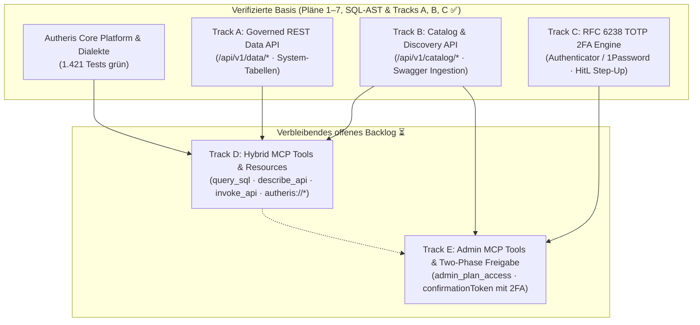

# Gesamtübersicht der Architektur- & Implementierungspläne

**Stand:** 09.10.2026 · **Zweig:** `feat/ast-target-dialect-generator`  
**Rolle:** C# & .NET Solution Architect  
**Ziel:** Strukturierte Übersicht und Ausführungsgraph des aktiven Backlogs in `docs/plans/`. Abgeschlossene Pläne (1–7, SQL-AST Härtung sowie Tracks A, B, C) wurden nach erfolgreicher Implementierung und Verifikation bereinigt.

---

## 1. Aktive Implementierungspläne (Noch OFFEN ⏳)

Aus dem aktuellen Planungsstand sind nur noch **zwei Workstreams** (Tracks D und E aus Plan 8) offen:

| Workstream | Thema / Feature | Behandelte Anforderungen | Status |
|---|---|---|---|
| **[Track D: Hybrid MCP Tools & Resources](plan-workstreams-entwickler-details.md#5-workstream-d-hybrid-mcp-tools-resources--prompts)** | • High-Level MCP Tools (`query_sql`, `query_dataset`, `search_catalog`, `get_my_permissions`, `list_datasources`, `get_data_lineage`) • Universal API Dispatcher (`describe_api`, `invoke_api`) • MCP Resources (`autheris://catalog/*`, `autheris://api/*`) & Prompts (`explore_dataset`, `audit_access_compliance`) | **R-63, R-65** | **OFFEN ⏳** Bereit zur TDD-Umsetzung |
| **[Track E: Admin MCP Tools & Two-Phase-Freigabe](plan-workstreams-entwickler-details.md#6-workstream-e-admin-mcp-tools-access-planning--two-phase-confirmation)** | • Administrative MCP Werkzeuge (`admin_plan_access`, `admin_apply_access`) • Access-Planning mit Diff-Vorschau ohne Seiteneffekte • Human-in-the-Loop Two-Phase Confirmation (`confirmationToken`) gebunden an 2FA TOTP • WORM-Audit-Logging für alle MCP-Mutationen | **R-60, R-62** | **OFFEN ⏳** Bereit zur TDD-Umsetzung |

---

## 2. Historie: Erfolgreich umgesetzte & verifizierte Pläne ✅

Alle nachfolgenden Arbeitspakete wurden vollständig implementiert, durch automatisierte Tests verifiziert und aus dem aktiven Backlog bereinigt:

- **SQL-AST Keyword-Support & Fail-Loud Härtung (AP-1 bis AP-5):** ✅
  - Härtung gegen Silent Dropping bei `TABLESAMPLE`, `PIVOT`, `MATCH_RECOGNIZE` (`SqlAstBuilder.VisitSampledRelation`).
  - Modellierung und Codegenerierung von `FETCH ... ROWS WITH TIES` über alle Dialekte (SQL Server, Postgres, Oracle, Snowflake, DuckDB, SQLite).
  - Lexer-Regex-Erweiterung für alphanumerische Keywords (`UTF8`, `UTF16`, `UTF32`) in `SqlKeywords.cs`.
  - Case-Insensitive Snowflake Identifier Quoting (`"USER"`, `"ORDERS"`) gegen Keyword-Kollisionen.
  - Verifiziert durch **1.421 Tests mit 0 Fehlern** in `TrinoSqlEngine.Tests`.
- **Plan 8 – Track A (Governed REST Data API):** ✅
  - Universelle REST Data API (`/api/v1/data/*`) mit Utf8JsonWriter-Streaming, Paging (`limit`, `offset`) und Filterung.
  - Virtuelle System-Tabellen (`governance.system.datasources`, `policies`, `rebac_tuples`, `virtual_filters`, `audit_trail`).
- **Plan 8 – Track B (Catalog & Discovery API & Datasource Onboarding):** ✅
  - Endpunkte `/api/v1/catalog/datasets`, `/datasources`, `/search` und `/api/governance/principals`.
  - OpenAPI/Swagger-Ingestion mit Zero-Leakage Vaulting via `IKeyVaultSecretProvider`.
  - ReBAC `can_query` Filterung und Identity-Linking mit Namensauflösung (R-54 bis R-58, R-61).
- **Plan 8 – Track C (RFC 6238 TOTP 2FA Engine & HitL Step-Up):** ✅
  - Standard-TOTP-Engine (kompatibel mit Microsoft Authenticator, Google Authenticator, 1Password, Bitwarden).
  - Enrollment-Endpunkte (`/api/v1/governance/2fa/enroll`, `/verify-enrollment`) mit `otpauth://`-URI und QR-Code.
  - Distributed Replay-Schutz im Cluster-State (90s TTL) und Step-Up-Anbindung in `HitLStepUpApprovalService` (R-64).
- **Pläne 1 bis 7 (Autheris Core Platform):** ✅
  - Distributed State & Invalidation (Plan 1), Modularisierung (Plan 2), Plan-Cache & Dialekte (Plan 3), CI-Härtung (Plan 4), PoC Arrow/OLAP & ReBAC (Plan 5), Lückenloses Zugriffs-Audit (Plan 6), WebSQL heterogene Cross-Source Joins (Plan 7).

---

## 3. Ausführungsgraph des verbleibenden Backlogs

---

## 4. Quelltexte und Referenzdokumente

- [Plan 8: Vollständige Daten-API & MCP-Bereitstellung](plan-vollstaendige-daten-api-und-mcp-bereitstellung.md)
- [Entwickler-Workstreams & TDD-Spezifikation (Tracks D & E)](plan-workstreams-entwickler-details.md)
- [Feature Request: Admin-Datenquellen & MCP (R-54 bis R-66)](2026-10-09-feature-request-admin-datenquellen-und-mcp.md)
