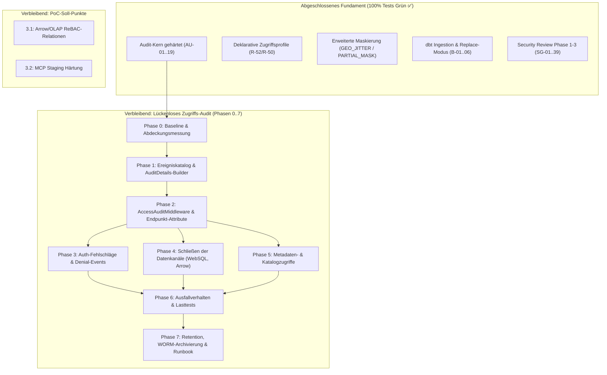

# Gesamtübersicht der Architektur- & Implementierungspläne

**Stand:** 09.10.2026 · **Zweig:** `feat/ast-target-dialect-generator`  
**Ziel:** Strukturierte Übersicht aller abgeschlossenen und noch offenen Pläne, Anforderungen und Features in `docs/plans/`.

---

## 1. Übersicht: Abgeschlossene vs. Offene Pläne

### 1.1 Erfolgreich umgesetzte & verifizierte Pläne (aus den offenen Plänen entfernt ✅)

| Plan / Thema | Behandelte Befunde & Anforderungen | Umsetzungsnachweis | Status |
|---|---|---|---|
| **Plan 1: Governance-Import & dbt** | B-01 bis B-06, R-50, R-51 | Commits `ebf1544`, `a87fac0`; `DbtMetadataIngestionService`, `DbtTests.cs` | Vollständig implementiert ✅ |
| **Plan 2: Erweiterte Maskierungsregeln** | R-53, R-25, B-06 (`GEO_JITTER`, `PARTIAL_MASK`, `TOKENIZATION`) | Commit `a87fac0`; `ColumnMaskingProvider`, `AstSecurityVisitor`, `AdvancedMaskingRuleTests.cs` | Vollständig implementiert ✅ |
| **Plan 3: Klartext je Person & Profile** | R-52, R-50, R-20 (`AccessProfile`, `david` unmasked vs. `philipp` default, `/api/v1/consents/bulk`) | Commit `a87fac0`; `AccessProfile`, `TableAccessPolicy`, `AccessProfileTests.cs` | Vollständig implementiert ✅ |
| **Plan 4: Audit-Architektur-Härtung (Kern)** | AU-01 bis AU-19 (KMS-Anker, Fail-Closed, transaktionale Kopplung, Dead-Letter) | Commit `a87fac0`; `AuditCanonicalizer`, `AuditArchitectureHardeningAu01To19Tests.cs` | Vollständig implementiert ✅ |
| **Plan 5: Security Review Phase 3 & CI/CD** | SG-01 bis SG-39, Release Build Cross-Compile Fix (NU1004) | Commits `1fcada0`, `a87fac0`; 3.600+ Unit-Tests grün | Vollständig implementiert ✅ |

> [!NOTE]
> Die detaillierten Spezifikationsdokumente der vollständig umgesetzten Pläne (Pläne 1–5, PoC-Befunde v1.1.5, R-52, R-53, AU-01..19, SG-01..39) wurden vereinbarungsgemäß aus `docs/plans/` entfernt bzw. bereinigt, da alle Punkte im Quelltext integriert und testseitig abgedeckt sind.

---

### 1.2 Verbleibende offene Pläne & Anforderungen (Aktiv in `docs/plans/` ⏳)

| Dokument | Thema | Offene Punkte | Prio / Status |
|---|---|---|---|
| **[Feature Lückenloses Zugriffs-Audit](2026-10-09-feature-lueckenloses-zugriffs-audit.md)** | Lückenloses „Audit by default“ über alle Kanäle | Lücken L-1 bis L-9 (Auth-Fehlschläge, Denial-Audit, Metadaten-Read-Audit) | In Vorbereitung ⏳ |
| **[Umsetzungsplan Zugriffs-Audit](2026-10-09-umsetzungsplan-lueckenloses-zugriffs-audit.md)** | Phasenweiser Rollout der Audit-Erweiterung | Phasen 0 bis 7 (Messung, Middleware, Auth-Events, Datenkanäle, Retention) | Bereit zur Umsetzung ⏳ |
| **[PoC Offene Anforderungen](2026-10-09-requirements-poc-v1-1-2.md)** | Nachgelagerte Soll-Anforderungen aus dem PoC | 3.1 (Arrow-Export/OLAP ReBAC) & 3.2 (MCP OAuth Discovery/Batches) | Soll (Staging / Nachgelagert) ⏳ |

---

## 2. Abhängigkeits- & Ausführungsgraph des verbleibenden Backlogs

---

## 3. Quelltexte und Referenzdokumente der aktiven Pläne

- [Feature Lückenloses Zugriffs-Audit](2026-10-09-feature-lueckenloses-zugriffs-audit.md)
- [Umsetzungsplan Lückenloses Zugriffs-Audit](2026-10-09-umsetzungsplan-lueckenloses-zugriffs-audit.md)
- [Offene Anforderungen PoC Citizen Dev](2026-10-09-requirements-poc-v1-1-2.md)
