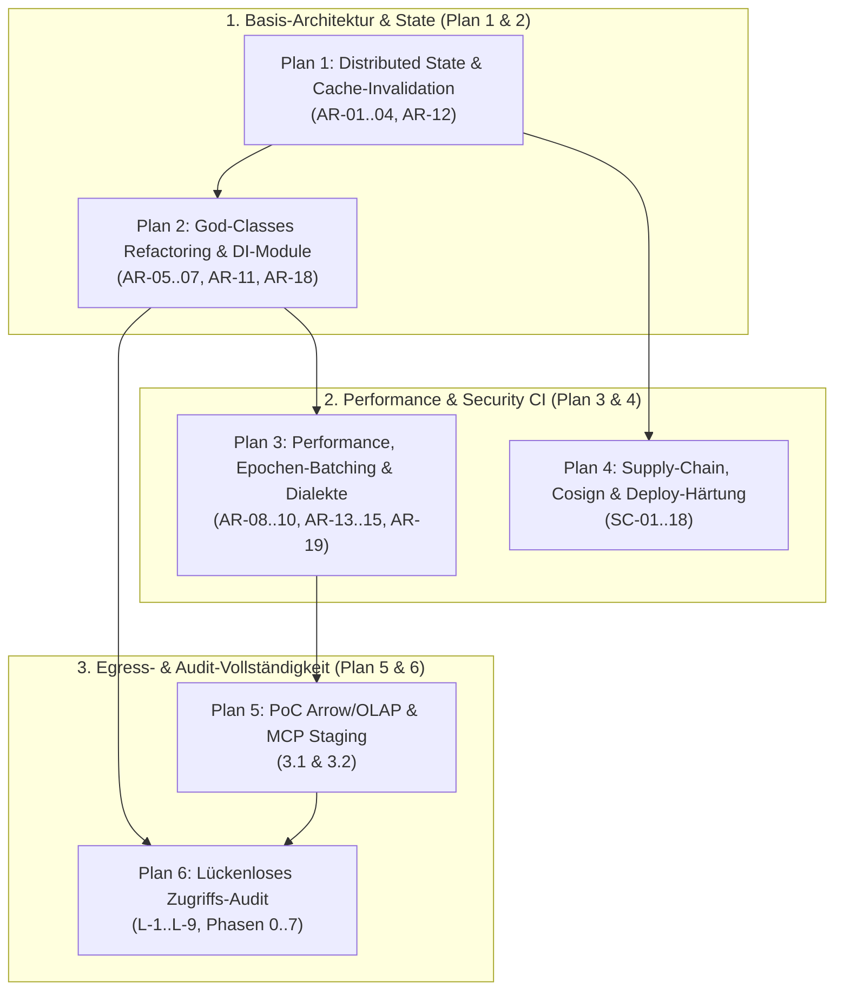

# Gesamtübersicht der Architektur- & Implementierungspläne

**Stand:** 09.10.2026 · **Zweig:** `feat/ast-target-dialect-generator`  
**Rolle:** C# & .NET Solution Architect  
**Ziel:** Strukturierte Übersicht und Ausführungsgraph aller abgeschlossenen sowie neu erstellten, feature-bezogenen Implementierungspläne in `docs/plans/`.

---

## 1. Übersicht der Implementierungspläne pro Feature

| Plan / Dokument | Thema / Feature | Behandelte Befunde & Anforderungen | Status |
|---|---|---|---|
| **[Plan 1: Distributed State & Invalidation](plan-architektur-distributed-state-invalidation.md)** | Cache-Konsistenz, ReBAC-Invalidierung & Shared State | **AR-01, AR-02, AR-03, AR-04, AR-12** | Bereit zur Umsetzung ⏳ |
| **[Plan 2: God-Classes & Modularisierung](plan-architektur-refactoring-godclasses-modules.md)** | Refactoring von `GovernedSqlExecutionService`, DI Composition Root & Repositories | **AR-05, AR-06, AR-07, AR-11, AR-18** | Bereit zur Umsetzung ⏳ |
| **[Plan 3: Performance & Caching](plan-architektur-performance-caching-dialekte.md)** | Epochen-Pipelining, Bounded LRU Plan-Cache & Dialekt-Konsistenz | **AR-08, AR-09, AR-10, AR-13, AR-14, AR-15, AR-19** | Bereit zur Umsetzung ⏳ |
| **[Plan 4: Supply Chain, CI & Deploy](plan-security-supply-chain-ci-deploy.md)** | Container-Scanning (Trivy), Cosign-Signierung, Attestations & Root-Drop | **SC-01 bis SC-18** | Bereit zur Umsetzung ⏳ |
| **[Plan 5: PoC Arrow/OLAP & MCP Staging](plan-poc-arrow-olap-rebac-und-mcp-staging.md)** | ReBAC-Fallback für Arrow/OLAP, anonyme OAuth-Discovery & JSON-RPC-Batches | **Befunde 3.1 & 3.2** | Bereit zur Umsetzung ⏳ |
| **[Plan 6: Lückenloses Zugriffs-Audit](plan-lueckenloses-zugriffs-audit-by-default.md)** | „Audit by Default“ über alle Endpunkte & Middleware, Denial-Audit | **Lücken L-1 bis L-9 (Phasen 0 bis 7)** | Bereit zur Umsetzung ⏳ |
| **[Plan 7: WebSQL API Federation Join](plan-websql-heterogene-api-federation-join.md)** | Heterogene Joins zwischen SQL-Tabellen und Web-APIs via WebSQL & DuckDB Routing | **WebSQL Query Federation & API Joins** | Bereit zur Umsetzung ⏳ |

---

## 2. Historie: Bereits umgesetzte & verifizierte Features ✅

Alle ursprünglichen Kernfunktionen des Branches wurden vollständig umgesetzt, getestet und durch 3.600+ Unit-Tests verifiziert:
- **dbt-Governance & Metadata Streaming:** B-01 bis B-06, R-50, R-51 (`replace`-Modus, typgerechtes `REDACT`).
- **Erweiterte Maskierungsregeln:** R-53, R-25 (`GEO_JITTER`, `PARTIAL_MASK`, `TOKENIZATION`).
- **Klartext je Person & Profile:** R-52, R-50, R-20 (`AccessProfile`, `david` unmasked vs. `philipp` default).
- **Audit-Kern-Härtung:** AU-01 bis AU-19 (KMS-Anker, Transaktionskopplung, Dead-Letter Queue).
- **Security Review Phasen 1–3:** SG-01 bis SG-39, Release Cross-Compile Fix (NU1004).

---

## 3. Ausführungsgraph des verbleibenden Backlogs

---

## 4. Quelltexte und Referenzdokumente

- [Plan 1: Distributed State & Invalidation](plan-architektur-distributed-state-invalidation.md)
- [Plan 2: God-Classes & Modularisierung](plan-architektur-refactoring-godclasses-modules.md)
- [Plan 3: Performance & Caching](plan-architektur-performance-caching-dialekte.md)
- [Plan 4: Supply Chain, CI & Deploy](plan-security-supply-chain-ci-deploy.md)
- [Plan 5: PoC Arrow/OLAP & MCP Staging](plan-poc-arrow-olap-rebac-und-mcp-staging.md)
- [Plan 6: Lückenloses Zugriffs-Audit](plan-lueckenloses-zugriffs-audit-by-default.md)
- [Plan 7: WebSQL API Federation Join](plan-websql-heterogene-api-federation-join.md)
- [Architektur-Review 2026-10-09](2026-10-09-architecture-review.md)
- [Security Review Build & Supply Chain 2026-10-09](2026-10-09-security-review-supply-chain-deploy.md)
- [Feature Lückenloses Zugriffs-Audit](2026-10-09-feature-lueckenloses-zugriffs-audit.md)
- [Requirements PoC Citizen Dev](2026-10-09-requirements-poc-v1-1-2.md)
