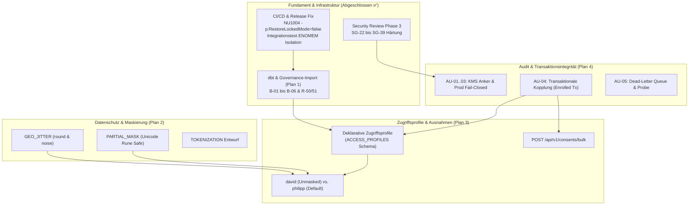
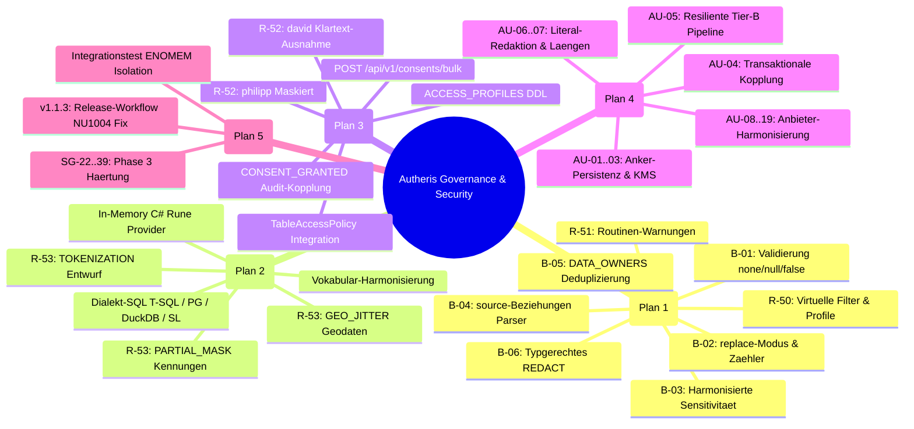
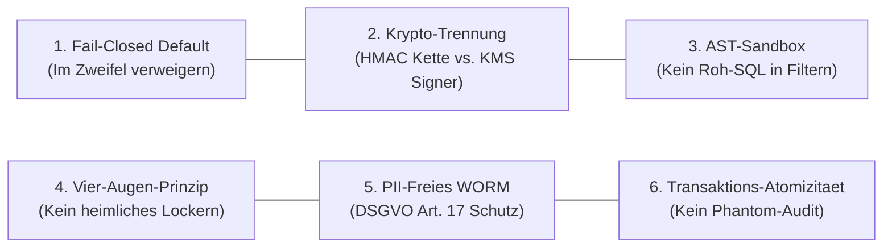

# Gesamtübersicht der Architektur- & Implementierungspläne

**Stand:** 09.10.2026 · **Zweig:** `feat/ast-target-dialect-generator`  
**Ziel:** Strukturierte Übersicht und Ausführungsgraph aller Anforderungen, PoC-Befunde, Audit-Befunde und Security-Reviews, aufgeteilt in thematisch fokussierte Architekturdokumente in `docs/plans/`.

---

## 1. Thematische Aufteilung & Umsetzungsstatus

| Plan | Thema | Behandelte Befunde & Anforderungen | Status |
|---|---|---|---|
| **[Plan 1: Governance-Import & dbt](plan-governance-import-dbt.md)** | dbt-Integration, Metadaten-Streaming, Bereinigung, `replace`-Modus, typgerechtes `REDACT` & Katalog | **B-01, B-02, B-03, B-04, B-05, B-06, R-50, R-51** | Implementiert & Verifiziert ✅ |
| **[Plan 2: Erweiterte Maskierungsregeln](plan-erweiterte-maskierungsregeln.md)** | Geodaten-Schutz (`GEO_JITTER`), Teilmaskierung (`PARTIAL_MASK`), Tokenisierung & Vokabular | **R-53, R-25, B-06** | Detaillierte Architektur & Spezifikation bereit ⏳ |
| **[Plan 3: Klartext je Person & Profile](plan-klartext-ausnahmen-zugriffsprofile.md)** | Deklarative Zugriffsprofile, Klartext-Ausnahmen (david vs philipp), Bulk-Consent-API & Audit | **R-52, R-50, R-20** | Detaillierte Architektur & DDL/API-Design bereit ⏳ |
| **[Plan 4: Audit-Architektur-Härtung](plan-audit-architektur-haertung.md)** | Lückenloses Zugriffs-Audit, kryptografische Anker, Transaktionsintegrität & Resilienz | **AU-01 bis AU-19** | Detaillierter Architekturplan & Phasenplan bereit ⏳ |
| **[Plan 5: Security Review Phase 3 & CI/CD](plan-security-review-phase3.md)** | Security-Befunde Niedrig & Härtung, Release-Cross-Compile Fix (NU1004), Teststabilität | **SG-22 bis SG-39, Build v1.1.3** | Implementiert & 100% Tests Grün ✅ |

---

## 2. Abhängigkeits- & Ausführungsgraph

---

## 3. Vollständige Mindmap aller Anforderungen & Befunde

---

## 4. Übergreifende Sicherheits- & Governance-Prinzipien (Security Expert Review)

Alle fünf Fachpläne unterliegen sechs nicht verhandelbaren Sicherheits-Invarianten:

1. **Fail-Closed als universelles Grundprinzip:**
   - Bei unvollständiger Konfiguration, fehlenden Richtlinien, unbekannten Maskierungstypen oder gestörter Audit-Pipeline verweigert das Gateway den Zugriff (`403 Forbidden` bzw. `503 Service Unavailable`).
   - Ein Fallback auf unmaskierte Klartextdaten oder das stillschweigende Übergehen von Schutzregeln ist architekturell ausgeschlossen.
2. **Kryptografische Domänentrennung:**
   - Symmetrischer Hochdurchsatz-Schlüssel (HMAC-SHA256) für die In-Process-Verkettung.
   - Asymmetrische Hardwareschlüssel (KMS/HSM) für WORM-Anker-Zertifikate, die kein interner DBA manipulieren kann.
3. **AST-Validierung dynamischer Ausdrücke:**
   - Virtuelle Filter und Profil-Prädikate werden vor der Persistenz als syntaktische Bäume (AST) gegen eine strikte Whitelist geprüft (nur spaltenbezogene Boolesche Operatoren, keine DDL/DML, keine externen Funktionen).
4. **Schutz vor heimlicher Schutzbedarfs-Lockerung (Ratsche & Vier-Augen):**
   - Das Entfernen oder Abschwächen von Maskierungsregeln im dbt-Import oder das Vergeben von `Unmasked`-Profilen erfordert zwingend eine Begründung und die Freigabe eines zweiten Sicherheitsbeauftragten (SG-22).
5. **Datenschutzkonformes WORM-Audit (DSGVO Art. 17 vs. Unveränderlichkeit):**
   - Personenbezogene Literale werden vor dem Schreiben in unveränderliche Audit-Trails anonymisiert (`@p_redacted`), während die Integrität über deterministische Hashes gewahrt bleibt.
6. **Transaktionale Koppelung von Daten & Audit:**
   - Audit-Ereignisse für Berechtigungen und Profile werden in derselben DB-Transaktion persistiert. Ein Rollback verhindert Phantom-Einträge im Audit-Log.

---

## 5. Quelltexte und Referenzdokumente

- [Plan 1: Governance-Import & dbt](plan-governance-import-dbt.md)
- [Plan 2: Erweiterte Maskierungsregeln](plan-erweiterte-maskierungsregeln.md)
- [Plan 3: Klartext je Person & Profile](plan-klartext-ausnahmen-zugriffsprofile.md)
- [Plan 4: Audit-Architektur-Härtung](plan-audit-architektur-haertung.md)
- [Plan 5: Security Review Phase 3 & CI/CD](plan-security-review-phase3.md)
- [PoC v1.1.5 Befunde (09.10.2026)](2026-10-09-poc-befunde-v1-1-5.md)
- [PoC v1.1.2 Requirements-Bericht](2026-10-09-requirements-poc-v1-1-2.md)
- [Feature-Request Klartext je Person (R-52)](2026-10-09-feature-request-klartext-je-person.md)
- [Feature-Request Maskierungsregeln (R-53)](2026-10-09-feature-request-maskierungsregeln.md)
- [Befunde zur Audit-Architektur (AU-01 bis AU-19)](2026-10-09-audit-architektur-befunde.md)
- [Feature Lückenloses Zugriffs-Audit](2026-10-09-feature-lueckenloses-zugriffs-audit.md)
- [Security Review Gesamtprojekt (SG-01 bis SG-39)](2026-10-09-security-review-gesamtprojekt.md)

