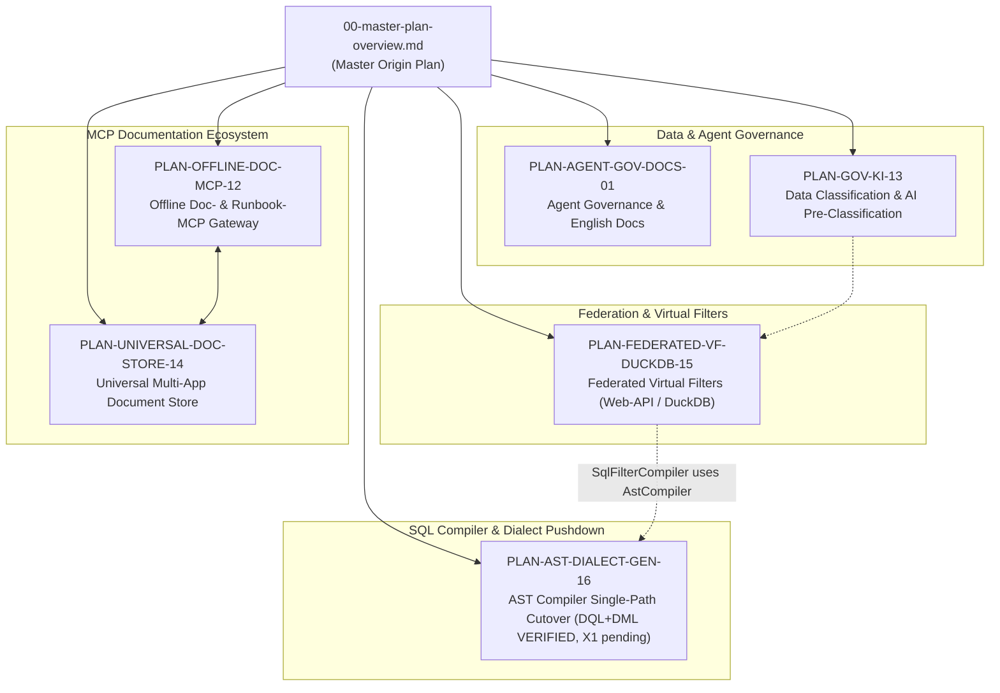

# Master Architecture & Implementation Backlog

**Last Updated:** October 10, 2026 · **Branch:** `feat/ast-target-dialect-generator`  
**Role:** Solution Architect & Agent Coordinator  
**Location:** `doc/plan/00-master-plan-overview.md` (or `docs/plans/00-master-plan-overview.md`)  
**Purpose:** Canonical origin plan, dependency graph, and active track status for all AI agents and engineers working on the Autheris ecosystem.

---

## 🧭 Origin Plan Protocol for AI Agents

> [!IMPORTANT]
> **Directive for all AI agents and contributors:**
> 1. **Language:** All plans, requirements, and documentation must be written in **English** (aligned with [README.md](file:///root/autheris/README.md)).
> 2. **Repository of Requirements:** All new requirements, design documents, and feature requests must be stored in [`doc/plan/`](file:///root/autheris/doc/plan/).
> 3. **Refinement on the Origin Plan:** When refining an existing feature or adding a new requirement, agents must:
>    - Create or update the detailed plan in `doc/plan/` (e.g., `YYYY-MM-DD-plan-<topic>.md`).
>    - Update the execution matrix and status below in this Origin Plan.
>    - Maintain traceable bidirectional links between parent and child documents.

---

## 1. 🚀 Active Execution Tracks & Plan Matrix

| Plan / Document ID | Topic & Scope | Addressed Requirements & Components | Status | Next Milestone |
|---|---|---|---|---|
| [`2026-10-10-konzept-federated-virtual-filter-web-api-duckdb.md`](file:///root/autheris/doc/plan/2026-10-10-konzept-federated-virtual-filter-web-api-duckdb.md) `PLAN-FEDERATED-VF-DUCKDB-15` | **Federated Virtual Filters on Web-APIs via DuckDB** | 3-stage adaptive federation (Short-circuit, Key-set pushdown, DuckDB staging); dynamic regex matching; composite key joins in `VirtualFilterStore` | **COMPLETED & VERIFIED ✅** | Documented in `docs/features/f-gov-14-federated-virtual-filters.md` & verified with unit/integration test suite |
| [`2026-10-10-konzept-datenklassifizierung-ki-vorklassifizierung.md`](file:///root/autheris/doc/plan/2026-10-10-konzept-datenklassifizierung-ki-vorklassifizierung.md) `PLAN-GOV-KI-13` | **Data Object Classification & AI Pre-Classification** | Fail-Closed `UNCLASSIFIED` initial state; optional AI pre-classification with 150ms timeout guard; auto-preclassify at confidence $\ge 95\%$; dual-sign-off workflows | **IMPLEMENTED / IN REVIEW 🛡️** | Finalize UI workflow endpoints and telemetry hooks |
| [`2026-10-10-implementierungsplan-offline-doc-mcp-gateway.md`](file:///root/autheris/doc/plan/2026-10-10-implementierungsplan-offline-doc-mcp-gateway.md) `PLAN-OFFLINE-DOC-MCP-12` | **Offline Doc- & Runbook-MCP Gateway** | Ingestion pipeline for Markdown, arc42, Runbooks, OpenAPI, Error Catalogs; local BM25/SIMD hybrid search; `GatewayMcpServer` stdio/SSE bridge | **IN PROGRESS / DRAFT 🛡️** | Implement BM25 SIMD vector tokenizer and document deposit endpoint |
| [`2026-10-10-konzept-universelle-dokumentenablage-mcp.md`](file:///root/autheris/doc/plan/2026-10-10-konzept-universelle-dokumentenablage-mcp.md) `PLAN-UNIVERSAL-DOC-STORE-14` | **Universal Document Store for Multi-App MCP** | 4 deposit options (GitOps, S3/MinIO, Ingestion API/MCP-Deposit, Shared Volume); 100% Air-Gapped/Offline support; Multi-App catalog & search | **CONCEPT COMPLETE 📚** | Draft concrete storage abstraction interfaces in `Autheris.Application` |
| [`2026-10-10-plan-ast-dialect-generator.md`](file:///root/autheris/doc/plan/2026-10-10-plan-ast-dialect-generator.md) PRD: [`2026-10-10-req-ast-dialect-generator.md`](file:///root/autheris/doc/plan/2026-10-10-req-ast-dialect-generator.md) `PLAN-AST-DIALECT-GEN-16` | **AST Target Dialect Generator: Single-Path Compiler Cutover** | Phase 2 plan: one AST compiler path (legacy `RlsListener`, `SqlRewriterEngine` and `ShadowDualRun` removed in one revertable cutover commit), every value bound, typed policy/mask IR replacing `TrustedSqlExpression`, dialect capability table, DML + `MERGE`, Databricks as production dialect (Snowflake experimental), pre-merge CI evidence gate `sql-compiler-gate` (differential vs legacy, property/fuzz, Testcontainers + SQLite/DuckDB + Spark/Delta execution, security regression, BenchmarkDotNet); work packages in streams A-E; supersedes German draft [`2026-10-06-implementation-plan-ast-dialect-generator.md`](file:///root/autheris/doc/plan/2026-10-06-implementation-plan-ast-dialect-generator.md); amends [ADR-017 §2](file:///root/autheris/docs/adr/ADR-017-distributed-state-ast-generator-and-rbac.md); Phase 3 security review delivered (plan §16): findings SEC-ADG-01..29 (Critical: plan-cache value reuse, consumer rendering parity, Oracle positional binding), invariants INV-11..INV-17, CI gate additions M-1..M-12 plus gate G10, Oracle runtime as production dialect (SD-8, Stream F); Phase 5 code review of the DQL branches (plan §19): changes requested, Blockers CR-ADG-01 (CTE name resolution, cross-tenant read on Oracle) and CR-ADG-02 (unmapped functions pass through); integrate on `feat/ast-dql`; Oracle driver license review is a release gate; Phase 4 loop-back (plan §20): CR-ADG-01..24 fixed on `feat/ast-dql` (blocked: `trustedSigners` for `Oracle.*`; X1 preconditions listed in §20.3), Databricks Experimental, Oracle Production (compiler tier) | **DQL and DML COMPLETED & VERIFIED ✅** (Phase 5 approved at `fd5179d`, plus the pre-Phase-6 fixes at `a4ce0e4`; documented in `docs/features/f-dialect-02-ast-sql-compiler.md`) | **X1 cutover — preconditions in plan §20.3/§24.3/§25.4/§26**: production wiring (no production service calls `ISqlEngine.Compile` yet; `SqlRewriterEngine=AstCompiler` still routes to the older `GenerateGovernedSql` string path; concrete provider binders incl. the Oracle `BindByName` binder exist only in test projects and must move to `Autheris.Infrastructure`); runtime wiring of `DmlErrorSanitizer` and `CheckedDmlExecutor` (CR-ADG-34/-35/-43); catalog column types and collation from database metadata (CR-ADG-47); tenant registry (CR-ADG-31); literal bind types (SEC-ADG-16 item 2); Oracle driver license review and package signing (`trustedSigners`); a Databricks G9 run (Experimental until then); GraphQL and other text consumers (OQ-GQL / OQ-4)
| [`README.md`](file:///root/autheris/doc/plan/README.md) `PLAN-AGENT-GOV-DOCS-01` | **Agent Governance & English Documentation Standards** | Project-wide English documentation policy; central `doc/plan/` repository; agent refinement lifecycle rules; root `AGENTS.md` & `CLAUDE.md` | **ACTIVE & ADOPTED ✅** | Ongoing enforcement across all sub-agent and tool invocations |

---

## 2. 🗺️ Dependency & Refinement Graph

---

## 3. 📋 Historical Completed Tracks (Archive)

> [!NOTE]
> All prior foundation tracks (Plans 1 through 11, SQL-AST Hardening, and Tracks A through E) were 100% completed, verified through 5,600+ automated unit & integration tests, and archived in accordance with repository clean-up guidelines.
