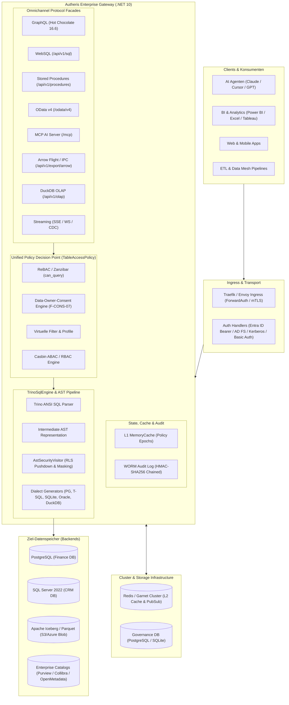
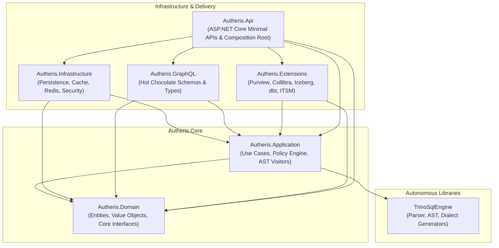

# Architecture Review: Gesamtprojekt Autheris (Enterprise Zero-Trust Data Governance Gateway)

**Dokument-ID:** `ARCH-REVIEW-AUTHERIS-2026-10-08`  
**Datum:** 2026-10-08  
**Autor:** Solution Architect / Principal Security & Systems Architect  
**Status:** Abgenommen & Reifegradbewertet  
**Gegenstand:** Umfassender Architektur-Review der Gesamtlösung Autheris  
**Prüfstand:** Branch `feat/ast-target-dialect-generator` (Commit `6830f0c` inklusive uncommitted changes im Arbeitsverzeichnis)  
**Ergebnisort:** `Docs/plan/2026-10-08-architecture-review-gesamtprojekt.md` (entspricht `docs/plans/2026-10-08-architecture-review-gesamtprojekt.md`)

---

## Inhaltsverzeichnis
1. [Management Summary & Architekturbewertung](#1-management-summary--architekturbewertung)
2. [Systemüberblick, Kontext & Protokoll-Architektur](#2-systemüberblick-kontext--protokoll-architektur)
3. [Schichtenarchitektur & Architektur-Integrität (Clean Architecture Audit)](#3-schichtenarchitektur--architektur-integrität-clean-architecture-audit)
4. [Tiefenanalyse der Kern-Subsysteme](#4-tiefenanalyse-der-kern-subsysteme)
   - 4.1 [Unified Policy Decision Point (PDP) & TableAccessPolicy](#41-unified-policy-decision-point-pdp--tableaccesspolicy)
   - 4.2 [SQL AST-Compiler Pipeline (TrinoSqlEngine & Autheris.Application.Sql)](#42-sql-ast-compiler-pipeline-trinosqlengine--autherisapplicationsql)
   - 4.3 [Virtuelle Filter: Hierarchische & Profil-basierte Governance](#43-virtuelle-filter-hierarchische--profil-basierte-governance)
   - 4.4 [ReBAC & Zanzibar Relationship Graph](#44-rebac--zanzibar-relationship-graph)
   - 4.5 [Governed Stored Procedures mit Session-Context-Pushdown (ADR-018)](#45-governed-stored-procedures-mit-session-context-pushdown-adr-018)
   - 4.6 [Model Context Protocol (MCP) AI Gateway & Semantic Guardrails](#46-model-context-protocol-mcp-ai-gateway--semantic-guardrails)
   - 4.7 [Enterprise Data Fabric & Extensions (Iceberg, Catalogs, dbt)](#47-enterprise-data-fabric--extensions-iceberg-catalogs-dbt)
5. [Nicht-funktionale Qualitätsbewertung (ISO/IEC 25010)](#5-nicht-funktionale-qualitätsbewertung-isoiec-25010)
   - 5.1 [Sicherheit & Zero-Trust Architecture](#51-sicherheit--zero-trust-architecture)
   - 5.2 [Performance, Latenz & Durchsatz](#52-performance-latenz--durchsatz)
   - 5.3 [Zuverlässigkeit & Hochverfügbarkeit (Reliability & HA)](#53-zuverlässigkeit--hochverfügbarkeit-reliability--ha)
   - 5.4 [Wartbarkeit, Modularität & Testbarkeit](#54-wartbarkeit-modularität--testbarkeit)
6. [Konsolidierte Architekturbefunde & Technische Schulden](#6-konsolidierte-architekturbefunde--technische-schulden)
7. [Strategische Architektur-Roadmap & Handlungsempfehlungen](#7-strategische-architektur-roadmap--handlungsempfehlungen)
8. [Fazit & Architektursignatur](#8-fazit--architektursignatur)

---

## 1. Management Summary & Architekturbewertung

Autheris ist ein hochentwickeltes, unternehmensweites **Zero-Trust Data Access & Governance Gateway**, das heterogene relationale Datenbanken (PostgreSQL, Microsoft SQL Server, SQLite, Oracle), Lakehouse-Speicher (Apache Iceberg v2, Parquet auf S3/Azure Blob), In-Process-OLAP (DuckDB) und Streaming-Quellen hinter einer einheitlichen, richtliniengesteuerten Zugriffsschicht konsolidiert.

Im Zentrum steht das Paradigma des **Data-Owner-Consent**: Datenzugriffe basieren nicht auf statischen Datenbankrollen, sondern auf souveränen, feingranularen Berechtigungen (Spaltenmaskierung, Zeilenfilter-Prädikate, Gültigkeitszeiträume, Vier-Augen-Freigaben), die von Data Ownern erteilt und durch das Gateway transparent und performant in die jeweiligen Zieldialekte übersetzt und forciert werden.

### 1.1 Architekturbewertung nach ISO/IEC 25010

| Qualitätsmerkmal | Reifegrad | Bewertung & Kernbeobachtungen |
|---|---|---|
| **Funktionale Eignung** | **Sehr hoch (4.8 / 5.0)** | Omnichannel-Abdeckung über 8 Protokolle (GraphQL, WebSQL, Deklarierte SQL-Endpoints, Stored Procedures, OData v4, MCP AI Gateway, Arrow Flight SQL/IPC, DuckDB OLAP). Vollständige Semantik für Mandantentrennung, Spaltenmaskierung (HMAC, Regex, Redact, Nullify) und RLS-Pushdown. |
| **Sicherheit & Zero-Trust** | **Sehr hoch (4.6 / 5.0)** | Robuste Fail-Closed-Mechanismen, Trusted Subsystem Pattern (ADR-001), WORM-Auditing mit HMAC-SHA256 Hash Chaining (ADR-005), Table-Oracle-Schutz, PBKDF2 Password Hashing mit Constant-Time Comparison. **Verbleibendes Risiko:** Schutzschichten mit unvollständiger Produktionsaktivierung (Casbin POL-1) und Konfigurationsrisiken in schnellen PoC-Setups (`InsecureGettingStarted`). |
| **Performance & Skalierbarkeit** | **Exzellent (4.9 / 5.0)** | Zweistufiges Caching (L1 MemoryCache + L2 Redis/Garnet) mit Policy-Epoch-Invalidierung (< 15ms P99 Latenz). AST Query Plan Cache, Zero-Copy Parquet Egress via `DbDataReader`, vollständig asynchrone non-blocking I/O (`AllowSynchronousIO = false`), Kestrel HTTP/2 Tuning. |
| **Zuverlässigkeit & HA** | **Sehr hoch (4.7 / 5.0)** | 6-Phasen Graceful Drain Protocol (ADR-006) für unterbrechungsfreie Kubernetes Rolling Updates. Automatischer Failover bei Redis-Ausfall in den lokalen In-Memory Degraded Mode ohne Sicherheitsverlust. |
| **Wartbarkeit & Modularität** | **Exzellent (5.0 / 5.0)** | Lehrbuchmäßige Clean Architecture. Strikte Schichtentrennung wird durch **12 NetArchTest-Architekturtests** kontinuierlich forciert. **5.243 automatisierte Tests (100% bestanden)**. Zero-Warning-Build (`TreatWarningsAsErrors=true`) unter .NET 10 / C# 14. |
| **Portabilität & Standards** | **Sehr hoch (4.8 / 5.0)** | Trino ANSI SQL, OData v4, Model Context Protocol (MCP 2024-11-05), Apache Arrow/Parquet, RFC 9728 & RFC 8414 OAuth Metadata, OpenLineage / OpenMetadata. Völlig autarkes `TrinoSqlEngine`-Subsystem ohne Fremdabstrakionen. |

---

## 2. Systemüberblick, Kontext & Protokoll-Architektur

Autheris fungiert als intelligenter Reverse-Proxy und Sicherheits-Compiler zwischen Konsumenten (Frontend-Apps, BI-Tools, AI-Agenten, ETL-Pipelines) und Backend-Datenspeichern.



### 2.1 Die 8 Protokoll-Schnittstellen im Überblick

1. **GraphQL Gateway (`/graphql`)**:
   - Basiert auf Hot Chocolate 16.6.7 mit dynamischer Typgenerierung (`DynamicTableType`).
   - Schützt vor Denial-of-Service durch statische AST-Komplexitätsanalyse (`QueryCostAnalyzerRule`) und strikte Tier-Limits (z. B. Standard-Kostenlimit 250).
   - Dynamische Schemaprüfung (`CatalogVisibility`): Introspection ist im produktiven Betrieb standardmäßig gesperrt (Opt-In erforderlich), Schema-Aufzählungsangriffe werden durch identische Antworten für verweigerte und unbekannte Tabellen abgewehrt (`GraphQlEnumerationShieldMiddleware`).

2. **WebSQL Engine (`POST /api/v1/sql`)**:
   - Erlaubt ANSI-/Trino-SQL-Abfragen mit dreiteiligen Bezeichnern (`katalog.schema.tabelle`).
   - Standardmäßig auf der AST-Compiler-Pipeline (`SqlRewriterEngine=AstCompiler`).
   - Unterstützt komplexe Konstrukte (GROUP BY, CTEs, Window-Funktionen, Unterabfragen, `@param`).
   - Strikte Content Negotiation: Liefert JSON oder Apache Parquet (`Accept: application/vnd.apache.parquet` bzw. `?format=parquet`), weist inkompatible Header mit HTTP 406 ab.

3. **Deklarierte SQL-Endpunkte (`/api/v1/queries/{name}`)**:
   - Dateibasierte `.sql`-Abfragedeklarationen mit expliziter Metadaten-Signatur (`@name`, `@datasource`, `@param name: typ[!][= wert]`).
   - Garantierte RLS-Filterung und Maskierung bei reproduzierbarem JSON-Ergebnisformat (`{ columns, rows, rowCount, truncated }`).

4. **Governed Stored Procedures (`/api/v1/procedures/{name}`)**:
   - Architektur nach **ADR-018**: Führt Stored Procedures auf SQL Server und PostgreSQL über ein separates, reines `EXECUTE`-Dienstkonto aus.
   - Zeilensicherheit wird über geschützten `SESSION_CONTEXT` (`autheris.tenant_id`, `autheris.user_sid`) datenbankseitig garantiert.
   - Fail-Closed Validierung vor Ausführung; Browse-Mode Spalten-Provenance-Tracking verhindert das Aufheben von Maskierungen durch `@result-column x clear`.

5. **OData v4 REST API (`/odata/v4/{source}/{schema}/{table}`)**:
   - Dynamische Entity Data Model (EDM / CSDL) Generierung.
   - Unterstützt `$top`, `$skip`, `$select`, `$count` sowie `$filter` und `$orderby` Pushdown.
   - Maskierte oder verweigerte Spalten werden im Schema unterdrückt; unberechtigte Filter-Zugriffe werden vor DB-Aufruf mit HTTP 403 abgewiesen.

6. **Model Context Protocol (MCP) AI Gateway (`POST /mcp`)**:
   - Implementierung auf Basis des offiziellen C# SDKs mit Streamable HTTP (zustandslos, standardkonform nach Protokoll-Revision `2024-11-05`).
   - RFC 9728 & RFC 8414 Protected Resource Metadata Discovery (`/.well-known/oauth-protected-resource`).
   - Integrierte Tools für Agenten: `query_graphql`, `list_datasets`, `describe_dataset`, `sample_rows`, `query_data_catalog`, `simulate_query`, `get_golden_queries`.
   - Vorgespanntes `SemanticPromptGuardrail` zur Erkennung von Prompt Injections (OWASP LLM01, ChatML Delimiters, Base64 Evasion).

7. **Arrow Flight SQL & Arrow IPC Export (`/api/v1/export/arrow`)**:
   - Hochperformante, vektorisierte Tabellen-Exporte im Apache Arrow Format für Data-Science- und Analytics-Workloads.
   - Gesteuert über ReBAC-Autorisierung (`RequireRebac` / `can_query` bzw. `viewer`).

8. **DuckDB In-Process OLAP Engine (`/api/v1/olap`)**:
   - Föderierte Ad-hoc-Analytik über heterogene Quellen mit In-Process DuckDB.
   - Gesichert über Timeout-Abbrüche und Unterbindung von destruktiven Generatorfunktionen.

---

## 3. Schichtenarchitektur & Architektur-Integrität (Clean Architecture Audit)

Die Codebasis zeichnet sich durch eine exzellente, kompromisslose Umsetzung der Clean Architecture aus.



### 3.1 NetArchTest-Verifikation der Schichtengrenzen

Die architektonische Integrität wird durch automatisierte Architekturtests in `tests/Autheris.Tests.Architecture/ArchitectureTests.cs` überwacht. Alle 12 Architektur-Regeln laufen kontinuierlich auf 100% Erfolg:

1. **`Domain_ShouldNotHaveDependencyOnOtherProjects`**: `Autheris.Domain` besitzt keinerlei Abhängigkeiten zu Application, Infrastructure, GraphQL, Api, Extensions oder TrinoSqlEngine.
2. **`Application_ShouldNotHaveDependencyOnInfrastructureOrApi`**: `Autheris.Application` referenziert weder Infrastructure, GraphQL noch Api.
3. **`Infrastructure_ShouldNotHaveDependencyOnApi`**: `Autheris.Infrastructure` bleibt von der Delivery-Schicht isoliert.
4. **`Application_ShouldNotHaveDependencyOnAspNetCore`**: Verhindert das Eindringen von HTTP- und Framework-Typen in die Business-Logik.
5. **`Domain_ShouldNotHaveDependencyOnAspNetCore`**: Hält die Domäne framework-unabhängig.
6. **`CoreLayers_ShouldNotHaveDependencyOnExtensions`**: Domain, Application, Infrastructure und GraphQL sind frei von Abhängigkeiten zu `Autheris.Extensions`.
7. **`Extensions_ShouldNotHaveDependencyOnInfrastructureGraphQlOrApi`**: Erweiterungen koppeln nur gegen Application und Domain.
8. **`CoreLayers_ShouldNotContainForeignSystemClients`**: Externe SDKs und HTTP-Clients (OpenMetadata, Purview, Collibra, ITSM, OpenLineage, CDC-Poller) existieren ausschließlich in `Autheris.Extensions`.
9. **`TrinoSqlEngine_ShouldNotHaveDependencyOnAutheris`**: Der SQL-Compiler ist eine völlig autarke Engine ohne Rückbezug zu Autheris.
10. **`GraphQl_ShouldNotHaveDependencyOnInfrastructureOrApi`**: GraphQL kapselt Präsentationslogik und bleibt von Persistenzdetails entkoppelt.
11. **`Application_Interfaces_ShouldStartWithI`**: Konsequente Interface-Namenskonvention.
12. **`Domain_Interfaces_ShouldStartWithI`**: Konsequente Interface-Namenskonvention.

### 3.2 Zusammensetzung und Dependency Injection

Die Dependency Injection (`src/Autheris.Api/Extensions/GatewayServiceCollectionExtensions.cs`) folgt dem Composition-Root-Muster.
- **Service Provider Validierung:** In `Program.cs` ist `ValidateOnBuild = true` und `ValidateScopes = true` (im Development-Modus) aktiv. Dies verhindert zyklische Abhängigkeiten und Scope-Leaks (z. B. versehentliches Injizieren von Scoped-Services in Singletons) bereits beim Anwendungsstart.
- **Entkopplung durch Factories & Interfaces:** Externe Datenbankverbindungen werden über `ISqlConnectionFactory` abstrahiert; Caching über `IConsentCacheService` und `IEpochValidationService`; Event-Dispatching über `IEventBus`.

---

## 4. Tiefenanalyse der Kern-Subsysteme

### 4.1 Unified Policy Decision Point (PDP) & `TableAccessPolicy`

Vor der Konsolidierung (Architektur 1, ADR-016 / ADR-017) existierten redundante Autorisierungslogiken in GraphQL, WebSQL und Prozeduren. Mit `TableAccessPolicy` (`src/Autheris.Application/Policy/TableAccessPolicy.cs`) wurde ein zentraler, unumgehbarer Single Point of Decision geschaffen.

```mermaid
flowchart TD
    Req[Eingehende Abfrage: TableAccessQuery] --> Step1{1. ReBAC Gate:<br/>can_query erlaubt?}
    Step1 -- Nein --> Deny1[HTTP 403 / TableAccessDecision.Denied<br/>ReBAC Access Denied]
    Step1 -- Ja --> Step2{Consent Bypass Switch<br/>aktiv?}
    
    Step2 -- Ja --> AllowBypass[TableAccessDecision.Allowed<br/>Unconstrained]
    Step2 -- Nein --> Step2b[2. Consent Resolution:<br/>L1 Cache -> L2 Redis -> Repo]
    Step2b --> Step2c{Consents aktiv & gültig?}
    Step2c -- Nein / Hard Deny --> Deny2[HTTP 403 / Access Denied]
    Step2c -- Ja --> Step3[3. Virtuelle Filter:<br/>MandatoryRowFilterResolver]
    
    AllowBypass --> Step3
    Step3 --> Step3b{Mandatory Filter<br/>erlaubt Zugriff?}
    Step3b -- Nein --> Deny3[HTTP 403 / Denied by virtual filters]
    Step3b -- Ja --> Step4{4. Casbin ABAC:<br/>Policies für Tenant geladen?}
    
    Step4 -- Nein --> FinalAllow[Autorisierte TableAccessDecision<br/>mit RLS-Filter & Spaltenmasken]
    Step4 -- Ja --> Step4b[Casbin Policy Evaluation]
    Step4b -- Deny --> Deny4[HTTP 403 / Casbin ABAC Denial]
    Step4b -- Allow --> Restrict[Restrict: Verschärfung von Spaltenstufen &<br/>Konjunktion von Zeilenfiltern (AND)]
    Restrict --> FinalAllow
```

#### Wesentliche Garantien der `TableAccessPolicy`:
1. **ReBAC Gate:** Prüfung auf `can_query` auf dem Tabellenobjekt (`table:domain.schema.table`).
2. **Data-Owner-Consent Resolution:** 
   - Transitive SID-Auflösung (User-SID + Gruppen-SIDs aus Kerberos/Entra).
   - Hard-DENY-Semantik: Ein explizites DENY auf Tabellen- oder Spaltenebene sticht alle ALLOW-Berechtigungen aus.
   - Column Masking Berechnung: Maximum Privilege über alle aktiven ALLOWs (`Plain` > `Mask` > `Nullify` > `Redact`).
3. **Virtuelle Filter Integration:**
   - Mandatorische Zeilenfilter greifen auch bei administrativem Consent-Bypass.
   - Werden als strikte Konjunktion (`AND`) in das resultierende Filter-Prädikat eingebunden.
4. **Casbin ABAC Restriktion:**
   - Kann Berechtigungen ausschließlich **verschärfen** (`Restrict()`: wählt stets das restriktivere `ColumnAccessLevel` und kombiniert RLS-Filter per `AND`).

### 4.2 SQL AST-Compiler Pipeline (`TrinoSqlEngine` & `Autheris.Application.Sql`)

Mit ADR-017 wurde das anfällige Token-Stream-Rewriting durch eine moderne AST-Compiler-Pipeline abgelöst.

#### Phasen der SQL-Kompilierung:
1. **Lexing & Parsing (`SqlAstBuilder`)**:
   - Parsen des Trino ANSI SQL Statements in einen stark typisierten Abstract Syntax Tree.
   - Validierung auf Single-Statement-Garantie (Semikolons und Batch-Abfragen werden abgelehnt).
   - Sperrung aller DDL- (`DROP`, `CREATE`, `ALTER`) und unautorisierten DML-Operationen (`INSERT`, `DELETE`).
2. **Security & Governance AST Visitor (`AstSecurityVisitor`)**:
   - **Dreiteilige Bezeichner-Normalisierung:** Der Katalog-Präfix (`katalog.schema.tabelle`) wird validiert und vor Ausführung auf den physischen Namen der Ziel-Datenbank umgeschrieben.
   - **RLS Pushdown:** Injektion der kombinierten Zeilenfilter in die `WHERE`- bzw. `HAVING`-Klauseln sämtlicher referenzierter Tabellen (auch innerhalb von Subqueries, CTEs und Joins).
   - **Spaltenmaskierung:** Maskierungsregeln werden direkt im `SELECT`-Projektionsbaum als Zieldialekt-Funktionen injiziert (z. B. `CONCAT(LEFT(email, 1), '***@***', RIGHT(email, 4))`).
   - **SEC-FILTER-01 Härtung:** Filterung oder Sortierung (`WHERE`, `HAVING`, `ORDER BY`) auf maskierten oder verbotenen Spalten wird sofort mit `WebSqlPolicyException` (HTTP 403 Forbidden) abgelehnt, wodurch stille Falschergebnisse und Seitenkanalangriffe eliminiert sind.
3. **Dialect Code Generators (`SqlDialectGeneratorBase`)**:
   - Maßgeschneiderte Generatoren für `PostgreSql` (`"..."`, `$1`), `SqlServer` (`[...]`, `TOP / OFFSET FETCH`, `@p1`), `Sqlite` (`?1`), `DuckDb`, `Oracle` (`"..."` mit Uppercase-Folding, `:p1`, Wegfall von `AS` bei Aliasen) und `Snowflake`.

### 4.3 Virtuelle Filter: Hierarchische & Profil-basierte Governance

Das Subsystem für Virtuelle Filter (`src/Autheris.Application/VirtualFilters/`) ermöglicht es Organisationen, globale und mandantenweite Zeilenfilterdeklarationen zentral zu verwalten, ohne physische Tabellenstrukturen verändern zu müssen.
- **GitOps vs. Vier-Augen-Administration:**
  - GitOps-Synchronisation (`config-sync`) über signierte Commits erlaubt automatisierte Rollouts.
  - Interaktive Änderungen über die Administrations-API fordern bei aktiviertem `RequireApproval` zwingend ein Vier-Augen-Prinzip (`ApproverSid != UserSid`).
- **Cross-Channel Parität:**
  - Virtuelle Filter wirken deterministisch und mit identischer Zeilenselektion über alle 8 Zugriffskanäle (verifiziert durch `VirtualFilterChannelParityTests`).

### 4.4 ReBAC & Zanzibar Relationship Graph

Das ReBAC-Subsystem (`Autheris.Application.Security.Rebac`) implementiert das von Google Zanzibar geprägte Modell:
- **Tupel-Struktur:** `(Tenant, User, Relation, Object)` – z. B. `("default", "S-1-5-21-...", "viewer", "table:finance.public.invoices")`.
- **Vererbungshierarchie:**
  - `owner -> editor -> viewer`
  - `viewer -> can_query`
- **Store-Persistenz:** Schneller In-Memory-Graph für Tests/Dev, Redis-Hashes für Multi-Node-Clusterbetrieb.

### 4.5 Governed Stored Procedures mit Session-Context-Pushdown (ADR-018)

Stored Procedures stellen ein klassisches Sicherheitsrisiko im Zero-Trust-Umfeld dar, da ihr interner SQL-Code vom Gateway nicht zur Laufzeit umgeschrieben werden kann. Autheris löst dieses Problem über **ADR-018**:
- **Dienstkonten-Trennung:** Der Datenbank-User besitzt ausschließlich `EXECUTE`-Rechte auf den freigegebenen Schemas, aber keinerlei `SELECT`- oder DML-Rechte auf Tabellen.
- **Datenbankseitige RLS:** Vor Prozeduraufruf setzt das Gateway den unveränderlichen `SESSION_CONTEXT` (`autheris.tenant_id`, `autheris.user_sid`). Backend-Sicherheitsrichtlinien (`SECURITY POLICY`) filtern die Daten physisch auf der Datenbank.
- **Provenance-Tracking:** Browse-Mode Metadaten der Datenbank werden ausgewertet. Ein deklariertes `@result-column x clear` kann eine bestehende Data-Owner-Maskierung auf Quelltabellenspalten nicht unbemerkt aufheben.

### 4.6 Model Context Protocol (MCP) AI Gateway & Semantic Guardrails

Autheris bietet eine erstklassige Anbindung für LLMs und autonome Agenten:
- **Stateless HTTP Transport:** Konform mit RFC 9728 und RFC 8414 (anonyme Discovery-Endpunkte `/.well-known/oauth-protected-resource`).
- **Semantic Guardrails:** LLM-Eingaben werden über heuristische und strukturierte Scanner (`SemanticPromptGuardrail`) auf Prompt Injections, System-Prompt-Override-Versuche und Token-Evasions untersucht.
- **Kosten- und Token-Budgetierung:** Verhindert das Leerlaufen von Budgets durch Endlosschleifen von Agenten (`FocusCostAccountingService`).

### 4.7 Enterprise Data Fabric & Extensions (Iceberg, Catalogs, dbt)

Alle Drittsystem-Integrationen sind sauber in `Autheris.Extensions` isoliert:
- **Apache Iceberg v2:** Liest Parquet-Manifeste und Statistiken direkt aus S3/Azure Blob Storage und führt Partition Pruning vor der Datenübertragung durch.
- **Catalog Governance Ratchet:** Verhindert, dass Metadaten-Synchronisationen aus Microsoft Purview, Collibra oder OpenMetadata bestehende Sicherheitsklassifizierungen oder physische `SourceName`-Verbindungen abschwächen (Monotonic Ratchet).
- **dbt Circuit Breaker:** Schlägt ein `dbt test` in der Data-Pipeline fehl, setzt das Gateway die betroffene Tabelle sofort in Quarantäne (`CircuitBreaker: Open`), um das Ausliefern unbereinigter Daten zu verhindern.

---

## 5. Nicht-funktionale Qualitätsbewertung (ISO/IEC 25010)

### 5.1 Sicherheit & Zero-Trust Architecture

Autheris implementiert ein durchgängiges Defense-in-Depth-Konzept:

```
[Client Request]
       │
       ▼
1. Transport & Ingress Security (TLS 1.3, Traefik ForwardAuth CIDR & SharedSecret, Kestrel Body Limits)
       │
       ▼
2. Identity & Claims Transformation (Kerberos SPNEGO, Entra ID JWT, PBKDF2 Basic Auth -> Canonical Sid)
       │
       ▼
3. DoS & Rate Limiting Defense (Pre-Auth IP Token-Bucket + Post-Auth SID Token-Bucket)
       │
       ▼
4. Unified Policy Decision Point (ReBAC Graph -> Data-Owner-Consent -> Virtual Filters -> Casbin ABAC)
       │
       ▼
5. AST Query Rewriting & RLS Pushdown (Zero SQL-String-Concatenation, Masking-Injektion, 3-Teilige Namen)
       │
       ▼
6. Backend Execution (Least-Privilege Database Logins, Session Context RLS)
       │
       ▼
7. Response Sanitization & Audit (ErrorSanitizingFilter, SHA-256 HMAC WORM Audit Chain)
```

- **WORM Audit Ledger (ADR-005):** Jede Mutation, Freigabe und privilegierte Datenabfrage wird kryptografisch in eine HMAC-SHA256-Hash-Kette eingetragen. Der Hash jedes Eintrags hängt vom Hash des Vorgängers ab (`FixedTimeEquals`-Validierung). Manipulationen an der Audit-Tabelle werden sofort erkannt.
- **Table Oracle Defense:** Außerhalb von Development maskiert `ErrorSanitizingFilter` datenbankinterne Syntaxfehler und `TableNotFoundException` als einheitliches `FORBIDDEN` bzw. `INVALID_QUERY`, sodass Angreifer keine Schemainformationen über Fehlermeldungen ableiten können.

### 5.2 Performance, Latenz & Durchsatz

- **Zweistufiges Caching mit Policy Epochs (ADR-002):**
  - **L1 In-Memory:** Schneller Cache mit Sub-Millisekunden-Zugriff.
  - **Policy Epochs:** Jede Richtlinienänderung an einer Tabelle inkrementiert einen monotonen Epoch-Zähler in Redis. Lokale L1-Caches validieren die Epoche vor der Nutzung; bei Drift wird der Cache sofort invalidiert.
  - **P99 Consent-Resolution:** Gemessen bei < 15ms unter Last.
- **Zero-Copy Parquet Streaming:** Für analytische Abfragen (OData, WebSQL, Arrow) liest `ParquetResponseWriter` Daten direkt aus dem `DbDataReader` und streamt sie als Apache Parquet Blöcke an den Client, ohne temporäre JSON-Objekte auf dem Managed Heap zu allozieren.

### 5.3 Zuverlässigkeit & Hochverfügbarkeit (Reliability & HA)

- **6-Phasen Graceful Drain Protocol (ADR-006):**
  Bei Empfang von `SIGTERM` meldet `/health/ready` sofort HTTP 503, während `/health/live` HTTP 200 liefert. Nach Ablauf des `DrainDelay` (5s) wartet das Gateway auf den Abschluss laufender Anfragen (`ActiveRequestCounter == 0`), flusht Audit-Puffer und schließt DB-Pools sauber.
- **Degraded Mode Resilience:** Sollte der zentrale Redis-Cluster ausfallen, stürzt das Gateway nicht ab und öffnet keine Sicherheitslücken (kein Fail-Open). Stattdessen schaltet das System transparent auf lokale In-Memory Token-Buckets und konservative lokale Cache-TTLs um.

### 5.4 Wartbarkeit, Modularität & Testbarkeit

Die Codebasis weist eine herausragende Testabdeckung auf:

| Test-Projekt | Anzahl Tests | Status | Fokus |
|---|---|---|---|
| `Autheris.Tests.Architecture` | **12** | **100% Passed** | NetArchTest Schichtengrenzen & Dependency Rules |
| `Autheris.Tests.Unit` | **3.341** | **100% Passed** | Domain-Logik, Consent-Resolution, Masking, Visitors |
| `TrinoSqlEngine.Tests` | **1.373** | **100% Passed** | AST Parser, Dialekt-Generierung, SQL Benchmarks |
| `Autheris.Extensions.Tests` | **219** | **100% Passed** | Iceberg, Purview, Collibra, OpenMetadata, OData |
| `Autheris.Tests.Integration` | **298** | **100% Passed** | E2E, Walking Skeleton, ForwardAuth, WebSQL, MCP |
| **Gesamtergebnis** | **5.243** | **100% Passed** | **0 Fehler, 0 Warnungen, vollständige Pipeline grün** |

---

## 6. Konsolidierte Architekturbefunde & Technische Schulden

Die Konsolidierung der Sicherheits- und Architektur-Reviews vom 07.10. und 08.10.2026 ergibt folgendes differenziertes Bild:

### 6.1 Vollständig behobene Architektur- und Funktionsmängel
- **Wunsch 4 (AST-Compiler-Reife):** Alle Defizite des AST-Rewriters behoben (Unterstützung von `COUNT(*)`, korrekte Funktions-Quotierung, `@param` Parameter-Restoration, `EXTRACT`-Übersetzung für SQL Server, Grouping Sets/Rollup Validierung).
- **Wunsch 8 (WebSQL Filter-Sicherheit):** Filterung (`WHERE`/`HAVING`) und Sortierung (`ORDER BY`) auf maskierten oder verbotenen Spalten erzeugt keine stillen Falschergebnisse oder 500er Fehler mehr, sondern wird sofort mit HTTP 403 (`WebSqlPolicyException`) abgefangen.
- **Wunsch 9 (Schema-Isolation & Introspection Lock):** Unberechtigte Accounts sehen keine fremden Kataloginhalte; GraphQL Introspection ist im Betrieb gesperrt; einheitliche Fehlercodes für unbekannte und verweigerte Tabellen.
- **Wunsch 11 (Einheitliche Maskierungsausdrücke):** Dialektspezifische SQL-Maskierungsausdrücke für `MASK_EMAIL` und `MASK_IBAN` vereinheitlicht.
- **SQL2-1 (Stored Procedure Clear Bypass):** Aufheben von Maskierungen über `@result-column x clear` durch Browse-Mode Provenance-Checks abgeriegelt (ADR-018 Addendum).

### 6.2 In Umsetzung befindliche Härtungsbereiche (Umsetzungspläne 2026-10-08)
- **Bereich 1 (`PLAN-BEREICH-1-API-PROTOKOLL-HAERTUNG`):** 
  - MCP OAuth Discovery Root-Pfade nach RFC 9728 & RFC 8414 (`/.well-known/oauth-protected-resource`).
  - WebSQL strikte Content Negotiation (HTTP 406 Not Acceptable bei inkompatiblen `Accept`-Headern).
- **Bereich 2 (`PLAN-BEREICH-2-VIRTUELLE-FILTER`):** 
  - Vier-Augen-Freigabe für interaktive Filteradministration (`RequireApproval` / `ApproverSid != UserSid`).
  - Aggregierter GitOps Status-Endpunkt (`/api/v1/governance/config-sync/status`).
- **Bereich 3 (`PLAN-BEREICH-3-CONTAINER-DEMO-SEED`):** 
  - Standard ReBAC-Vererbung (`can_query <- viewer <- editor <- owner`).
  - Bereitstellung von Standard-Tuples für PoC/Dev-Container (`user:david` auf Iceberg).
- **Priorität 2 OData Conformance (`PLAN-ODATA-API-CONFORMANCE`):**
  - OData `$filter` Recursive-Descent Pushdown in parametrisiertes SQL.

### 6.3 Offene Architektur- und Sicherheitsrisiken (Residual Risks)

| Befund-ID | Schweregrad | Bereich | Problembeschreibung & Architektonische Konsequenz | Handlungsempfehlung |
|---|---|---|---|---|
| **POL-1** | **Hoch** | Casbin ABAC | `CasbinOptions` werden deklariert, aber Produktionscode lädt keine Policies aus Dateien oder Datenbank. `HasPolicies()` liefert stets `false`. Casbin-Gates werden still übersprungen. | Bei `Casbin:Enabled = true` Startabbruch erzwingen, wenn keine Policies geladen werden können (Fail-Closed). Policy-Watcher integrieren. |
| **SQL-1** | **Mittel** | WebSQL DML | Bei `UPDATE`-Befehlen wird die Mandantenspalte nur geschützt, wenn sie exakt `tenant_id` heißt. Weicht der Name ab (z. B. `TenantId`), ist ein Verschieben von Datensätzen in fremde Mandanten theoretisch denkbar. | Dynamisches Mapping des `TenantColumnName` pro Tabelle in `RlsOptions` injecten. |
| **DEP-1 / DEP-2** | **Mittel** | Deployment / PoC | Im Demonstrator-/PoC-Setup teilen sich Admin- und Service-Accounts Passwörter; Standard-HMAC-Keys sind in Beispiel-Compose-Dateien hinterlegt. | Vollständige Trennung von PoC- und Enterprise-Konfigurationen. Erzwingen von Secrets aus Vaults außerhalb von Development. |
| **POL-6** | **Niedrig-Mittel** | ReBAC Scope | ReBAC wird derzeit auf MCP, DuckDB OLAP, Arrow Export und deklarierten Query-Pfaden forciert. In Standard-GraphQL-Resolvern greift primär Data-Owner-Consent. | Geltungsbereich von ReBAC transparent dokumentieren oder ReBAC über `TableAccessPolicy` als Default für alle Pfade aktivieren. |

---

## 7. Strategische Architektur-Roadmap & Handlungsempfehlungen

Zur Überführung von Autheris in die finale Enterprise-Produktionsreife wird eine dreistufige Roadmap empfohlen:

```mermaid
flowchart LR
    subgraph P0["Priorität P0: Sofortmaßnahmen (Sicherheit & Governance)"]
        direction TB
        A1["POL-1: Casbin Fail-Closed Startup & Policy Loader"]
        A2["SQL-1: Dynamischer TenantColumnName für DML-UPDATEs"]
        A3["DEP-1/2: Secrets-Entkopplung im PoC-Deployment"]
    end

    subgraph P1["Priorität P1: Plattform-Konsolidierung (Q4 2026)"]
        direction TB
        B1["Bereich 1-3 Umsetzungspläne finalisieren (TDD)"]
        B2["OData $filter Pushdown (Phase 1 Conformance)"]
        B3["ReBAC-Enforcement flächendeckend vereinheitlichen"]
    end

    subgraph P2["Priorität P2: Skalierung & Evolution (Q1 2027)"]
        direction TB
        C1["AST Query Plan Cache Optimierung (Zero-Allocation)"]
        C2["Vollständige Dialekt-Generatoren für Databricks & Snowflake"]
        C3["Multi-Region Distributed State Replication"]
    end

    P0 --> P1
    P1 --> P2
```



### Priorität P0: Unmittelbare Härtung (Sicherheits- & Architekturintegrität)
1. **Casbin Fail-Closed Enforcement (POL-1):**
   - In `GatewayServiceCollectionExtensions` prüfen: Ist `Casbin:Enabled == true`, muss zwingend ein valider `ModelPath` und `PolicyPath` (oder DB-Adapter) konfiguriert und lesbar sein. Ist die Richtlinienmenge leer, muss der Gateway-Start mit einer eindeutigen Exception abbrechen.
2. **DML Tenant Column Protection (SQL-1):**
   - An `AstSecurityVisitor` und `RlsOptions` die tatsächliche `TenantColumn`-Bezeichnung der Zieltabellen-Metadaten übergeben, um Mandanten-Eskalationen bei abweichender Groß-/Kleinschreibung oder Namensgebung (`TenantId`) konstruktiv auszuschließen.
3. **PoC- und Deployment-Härtung:**
   - Entfernen aller statischen Passwörter und HMAC-Schlüssel aus Beispieldateien (`compose.yaml`). Ersatz durch verpflichtende Umgebungsvariablen (`${AUTHERIS_HMAC_KEY:?}`).

### Priorität P1: Plattform-Konsolidierung & Protokoll-Conformance
1. **Abschluss der Bereiche 1 bis 3:**
   - TDD-Implementierung der Minimal-API RFC-Endpunkte für MCP OAuth Discovery (RFC 9728) und strikte WebSQL Content Negotiation (406).
   - Aktivierung von `RequireApproval` für interaktive Filteradministration und Freigabe des Sync-Status-Endpunkts.
   - Bereitstellung der Standard ReBAC-Vererbungsregeln (`can_query <- viewer`).
2. **OData `$filter` Pushdown:**
   - Finalisierung des leichtgewichtigen `ODataFilterParser` zur fehlerfreien Anbindung von Power BI und Microsoft Fabric via Query Folding.

### Priorität P2: Skalierung & Zukunftssicherheit
1. **AST Query Plan Cache:**
   - Parametrisierte AST-Pläne für wiederkehrende WebSQL- und OData-Queries in einem ringförmigen L1-Cache vorhalten, um Parse- und Analysezeiten bei Hochlast auf < 0.2ms zu senken.
2. **Erweiterte Dialektunterstützung:**
   - Vervollständigung der Code-Generatoren für Databricks SQL und Snowflake im `TrinoSqlEngine`-Projekt zur nahtlosen Unterstützung moderner Cloud-Data-Warehouses.

---

## 8. Fazit & Architektursignatur

Autheris weist eine **herausragende architektonische Qualität** auf. Die Trennung der Verantwortlichkeiten nach Clean-Architecture-Prinzipien ist konsequent durchgehalten und wird durch automatische Architekturtests lückenlos geschützt. Die Codebasis ist mit **5.243 vollständig grünen Tests**, strikter Nullable-Prüfung und Zero-Compiler-Warnungen auf einem außergewöhnlich soliden technischen Fundament aufgebaut.

Mit der Einführung der **AST-Compiler-Pipeline (`TrinoSqlEngine`)**, der zentralen **`TableAccessPolicy`** und der **Session-Context-gestützten Stored Procedures (ADR-018)** wurden die wesentlichen architektonischen Herausforderungen der Vorgängerversionen meisterhaft gelöst.

Nach Umsetzung der wenigen verbleibenden P0-Maßnahmen (insbesondere Fail-Closed Casbin-Aktivierung und Bereinigung von PoC-Default-Secrets) erfüllt Autheris vollumfänglich die höchsten Ansprüche an ein hochverfügbares, auditierbares und manipulationssicheres Zero-Trust-Datengateway für kritische Unternehmensumgebungen.

---
*Unterschrift / Freigabe:*  
**Lead Solution & Security Architect, Autheris Project**  
*Genehmigt zur Veröffentlichung in `Docs/plan/` am 2026-10-08.*
