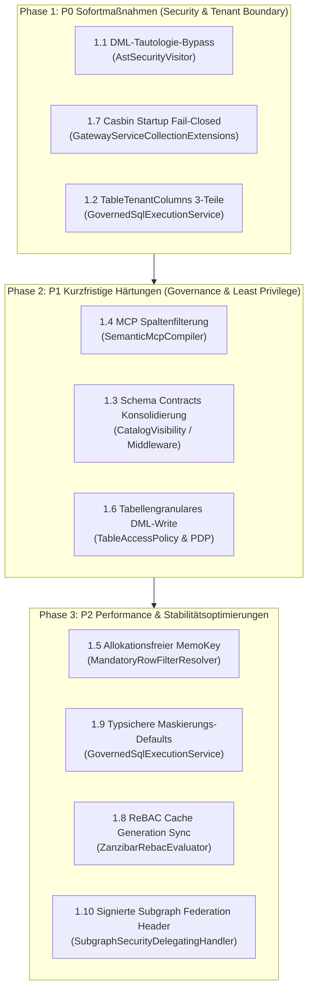

# Architektur- & Sicherheits-Potentiale: Tiefenanalyse Autheris

**Dokument-ID:** `POTENTIALS-AUTHERIS-2026-10-08`  
**Datum:** 2026-10-08  
**Autor:** Principal Systems & Security Architect  
**Status:** Zur Prüfung & Einplanung  
**Kontext:** Ergänzende Tiefenanalyse im Anschluss an den Architecture Review des Gesamtprojekts (`ARCH-REVIEW-AUTHERIS-2026-10-08`).  
**Ablageort:** `Docs/plan/2026-10-08-architektur-potentiale-und-schwachstellen.md` (bzw. `docs/plans/2026-10-08-architektur-potentiale-und-schwachstellen.md`)

---

## Management Summary

Über die bekannten Kernbefunde hinaus (wie Casbin POL-1 und die RFC-Discovery-Endpunkte) hat die vertiefte Inspektion der Codebasis **10 konkrete, hochrelevante Optimierungs- und Risikopotentiale** in den Bereichen **Sicherheit (Zero-Trust Bypass), Datenintegrität, Performance/GC-Druck und Architektur-Konsistenz** identifiziert.

Die wichtigsten Entdeckungen im Überblick:
1. **DML-Bypass über Ungleichungs-Tautologien in `IsTriviallyTrue` (Sicherheit – Hoch):** `AstSecurityVisitor` fängt `1=1` ab, bewertet aber arithmetische Ungleichungen wie `1 < 2` oder `0 < 100` nicht als tautologisch. Ein böswilliger Writer kann so den Schutz gegen ungefilterte Massen-Updates (`RejectUnfilteredDml`) trivial umgehen.
2. **Mandantenspalten-Auflösung bei dreiteiligen Namen in `TableTenantColumns` (Mandantentrennung – Mittel-Hoch):** Bei 3-teiligen Tabellennamen (`katalog.schema.tabelle`) wird nur der vollqualifizierte Name registriert. Bei UPDATEs, die über 2-teilige Namen (`schema.tabelle`) oder Kurznamen auflösen, fällt das System auf die globale Mandantenspalte zurück. In heterogenen Datenbanken führt dies zur Prüfung der falschen Mandantenspalte.
3. **Phantom-Feature: Schema Contracts (`F-GOV-08`) (Architektur – Mittel):** `SchemaContractMiddleware` parsed Partner-Verträge und setzt `context.Items["GatewayContract"]`, jedoch wird dieser Schlüssel an **keiner einzigen Stelle** im gesamten Abfrage- oder Schema-Generator ausgelesen.
4. **Information Disclosure in MCP Metadaten (`SemanticMcpCompiler`) (Datenschutz – Mittel):** In den MCP-Glossar-Ressourcen (`glossary://...`) werden zwar verbotene Tabellen gefiltert, innerhalb erlaubter Tabellen werden jedoch **sämtliche Spalten samt Beschreibungen und Datentypen** ausgegeben – selbst wenn der Aufrufer für sensible Spalten ein explizites `DENY` besitzt.
5. **GC- und Allokationsdruck im Virtuellen Filter Memo-Cache (Performance – Mittel):** Auf jedem Abfragepfad erzeugt `MandatoryRowFilterResolver` den Cache-Key über 5 verschachtelte `string.Join`-Operationen auf dem Heap, was unter hoher Last (z. B. 10.000 QPS) zu signifikanter Gen-0/1-GC-Latenz führt.

---

## 1. Detaillierte Analyse der 10 Potentiale

### 1.1 Tautologie-Bypass bei DML-Statements (`AstSecurityVisitor.cs`)
* **Kategorie:** Sicherheit / SQL Governance
* **Schweregrad:** **Hoch**
* **Fundstelle:** [`src/TrinoSqlEngine/Ast/Visitors/AstSecurityVisitor.cs#L481-L516`](file:///root/autheris/src/TrinoSqlEngine/Ast/Visitors/AstSecurityVisitor.cs#L481-L516)
* **Problembeschreibung:**
  Autheris schützt vor zerstörerischen Massen-Updates oder -Deletes über die Option `RejectUnfilteredDml`. Dabei prüft `EnsureFilteredDml` mittels `IsTriviallyTrue(Expression? expr)`, ob eine `WHERE`-Klausel tautologisch ist.
  Die Implementierung deckt ab:
  - `LiteralExpression` (Boolean `true`)
  - `Or` / `And` Verknüpfungen
  - `BinaryOperator.Equal`, `LessThanOrEqual`, `GreaterThanOrEqual` – **jedoch ausschließlich durch Prüfung auf Gleichheit beider Literale:**
    ```csharp
    case BinaryOperator.Equal or BinaryOperator.LessThanOrEqual or BinaryOperator.GreaterThanOrEqual:
        if (b.Left is LiteralExpression l1 && b.Right is LiteralExpression l2)
        {
            return Equals(l1.Value?.ToString(), l2.Value?.ToString());
        }
    ```
  - `BinaryOperator.LessThan` und `BinaryOperator.GreaterThan` fehlen im Switch komplett!
* **Angriffsszenario:**
  Ein Benutzer mit `DmlWriterRoles` möchte alle Datensätze einer Tabelle im Mandanten manipulieren, ohne den Einzelschlüssel zu kennen. Ein `WHERE 1=1` wird blockiert.
  Sendet der Benutzer jedoch:
  ```sql
  UPDATE finance.public.invoices SET status = 'CANCELLED' WHERE 1 < 2
  ```
  liefert `IsTriviallyTrue(1 < 2)` den Wert `false`. Die Abfrage wird als "gefiltert" akzeptiert und führt ein ungefiltertes Massen-Update auf allen Datensätzen des Mandanten aus.
* **Architekturempfehlung:**
  Arithmetische Konstantenauswertung (`EvaluateConstantComparison`) für alle relationalen Operatoren (`<`, `<=`, `>`, `>=`, `=`, `!=`) integrieren oder Abfragen mit rein literalbasierten Prädikaten ohne Spaltenbezug grundsätzlich als ungültig ablehnen (`EnsurePredicateContainsColumnReference`).

---

### 1.2 Unvollständige Alias-Registrierung in `TableTenantColumns` (`GovernedSqlExecutionService.cs`)
* **Kategorie:** Mandantensicherheit / RLS
* **Schweregrad:** **Mittel-Hoch**
* **Fundstelle:** [`src/Autheris.Application/Sql/Services/GovernedSqlExecutionService.cs#L508-L514`](file:///root/autheris/src/Autheris.Application/Sql/Services/GovernedSqlExecutionService.cs#L508-L514)
* **Problembeschreibung:**
  In heterogenen Datenbanklandschaften heißen Mandantenspalten oft unterschiedlich (z. B. `tenant_id` in Tabelle A, `OrganizationId` in Tabelle B).
  In `GovernedSqlExecutionService.cs` wird die Zuordnung wie folgt vorgenommen:
  ```csharp
  tableTenantColumns[target.FullName] = tenantColumn;
  if (string.Equals(target.FullName, target.TableName, StringComparison.OrdinalIgnoreCase))
  {
      tableTenantColumns[target.TableName] = tenantColumn;
  }
  ```
  Bei kanonischen dreiteiligen Trino-Namen (z. B. `finance.public.invoices`) ist `target.FullName` ungleich `target.TableName` (`invoices`).
  Weder `public.invoices` noch `invoices` werden in das Dictionary eingetragen.
  Wenn nun `AstSecurityVisitor` oder `RlsListener` bei einem `UPDATE` oder `INSERT` die Mandantenspalte über `_options.GetTenantColumnName(normalizedName)` abfragt, schlägt `TableTenantColumns.TryGetValue` für Kurz- und Schemanamen fehl und fällt auf `TenantColumnName` (den globalen Default `primaryTenantColumn ?? "tenant_id"`) zurück.
* **Architekturempfehlung:**
  In `GovernedSqlExecutionService.cs` müssen für jede Tabelle immer alle Namensvarianten registriert werden:
  ```csharp
  tableTenantColumns[target.FullName] = tenantColumn;
  tableTenantColumns[target.TableName] = tenantColumn;
  if (!string.IsNullOrWhiteSpace(target.SchemaName))
  {
      tableTenantColumns[$"{target.SchemaName}.{target.TableName}"] = tenantColumn;
  }
  ```

---

### 1.3 Nicht durchgesetzte Schema-Contracts (`SchemaContractMiddleware.cs`)
* **Kategorie:** Architekturintegrität & Governance
* **Schweregrad:** **Mittel**
* **Fundstellen:**
  - [`src/Autheris.Api/Middleware/SchemaContractMiddleware.cs#L89`](file:///root/autheris/src/Autheris.Api/Middleware/SchemaContractMiddleware.cs#L89)
  - [`src/Autheris.Application/Governance/Contracts/SchemaContractManager.cs#L49`](file:///root/autheris/src/Autheris.Application/Governance/Contracts/SchemaContractManager.cs#L49)
* **Problembeschreibung:**
  Feature `F-GOV-08` verspricht dynamische Schema-Slices für Partner und API-Konsumenten über Verträge (`X-Gateway-Contract` bzw. Claim `contract`).
  Die Middleware validiert den Vertragsnamen und legt ihn in `context.Items["GatewayContract"]` ab.
  **Befund:** Der Schlüssel `"GatewayContract"` wird nirgendwo im Code ausgelesen! Weder Hot Chocolate GraphQL, noch WebSQL, noch OData, noch MCP werten den Vertrag aus. Die Methode `FilterSchemaSdl` in `SchemaContractManager` ist toter Code ohne Aufrufer.
* **Architekturempfehlung:**
  Entweder:
  1. **Konsequente Durchsetzung:** Anbindung des `GatewayContract` an `CatalogVisibility.VisibleTablesAsync`, sodass für den Request tatsächlich nur die im Vertrag definierten Tabellen und Tags sichtbar sind.
  2. **Transparente Dokumentation / Deprecation:** Falls Verträge künftig über Virtuelle Profile abgebildet werden sollen, das Middleware-Relikt entfernen, um falsche Sicherheitserwartungen bei Auditoren zu vermeiden.

---

### 1.4 Spalten-Metadatenleck in MCP-Glossar-Ressourcen (`SemanticMcpCompiler.cs`)
* **Kategorie:** Datenschutz & Least Privilege
* **Schweregrad:** **Mittel**
* **Fundstelle:** [`src/Autheris.Application/Mcp/Services/SemanticMcpCompiler.cs#L134-L165`](file:///root/autheris/src/Autheris.Application/Mcp/Services/SemanticMcpCompiler.cs#L134-L165)
* **Problembeschreibung:**
  Beim Abrufen von MCP-Ressourcen (`glossary://{domain}/{table}`) filtert `McpCatalogVisibility.VisibleTablesAsync` zwar verbotene Tabellen heraus. Innerhalb einer sichtbaren Tabelle iteriert die Methode jedoch über `t.Columns`:
  ```csharp
  string.Join("\n", t.Columns.Select(c =>
  {
      var sensitivityTag = c.IsSensitive ? " [SENSITIVE/MASKED]" : "";
      var descTag = !string.IsNullOrWhiteSpace(c.Description) ? $": {c.Description}" : "";
      return $"  - `{c.ColumnName}` ({c.DataType}){sensitivityTag}{descTag}";
  }));
  ```
  Besitzt ein Benutzer Zugriff auf eine Tabelle, aber ein explizites `DENY` auf sensible Spalten (z. B. `salary`, `tax_id`), werden diese Spaltennamen samt sensiblen Beschreibungen und dbt-Tags dennoch im Glossar an das LLM übermittelt.
* **Architekturempfehlung:**
  Vor der Glossargenerierung muss `t.Columns` gegen die für den Principal berechnete `TableAccessDecision` gefiltert werden (`decision.GetColumnAccess(col) != ColumnAccessLevel.Deny`). Verweigerte Spalten dürfen im Glossar nicht auftauchen.

---

### 1.5 Heap-Allokationen und GC-Druck im Memo-Cache (`MandatoryRowFilterResolver.cs`)
* **Kategorie:** Performance & Skalierbarkeit
* **Schweregrad:** **Mittel**
* **Fundstelle:** [`src/Autheris.Application/VirtualFilters/MandatoryRowFilterResolver.cs#L173-L178`](file:///root/autheris/src/Autheris.Application/VirtualFilters/MandatoryRowFilterResolver.cs#L173-L178)
* **Problembeschreibung:**
  `MandatoryRowFilterResolver` puffert berechnete Zeilenfilter in einem `ConcurrentDictionary<string, MandatoryFilterOutcome> _memo`.
  Zur Schlüsselbildung wird bei **jedem einzelnen Request** folgender Code ausgeführt:
  ```csharp
  var key = string.Join('\u001f',
      snapshot.Generation, query.Tenant.Value, query.UserSid.Value,
      string.Join(',', query.GroupSids.Select(s => s.Value).Order(StringComparer.Ordinal)),
      string.Join(',', query.Roles.Order(StringComparer.Ordinal)),
      query.Metadata.Identifier.ToString(), query.Metadata.Dialect, (int)query.ObjectKind,
      string.Join(',', query.Metadata.Columns.Select(c => c.ColumnName)));
  ```
  Dies erzeugt pro Abfrage mind. 5 temporäre Strings, mehrere String-Arrays und LINQ-Iteratoren. Bei 5.000 bis 10.000 Anfragen pro Sekunde führt dies zu kontinuierlichem Gen-0/1 Garbage Collection Druck und CPU-Spitzen.
* **Architekturempfehlung:**
  Ersetzen des zusammengesetzten Strings durch eine allokationsfreie `readonly record struct VirtualFilterMemoKey`-Struktur mit vorberechneten Hash-Werten (`HashCode.Combine`) oder Nutzung von `ReadOnlySpan<char>` / `ValueStringBuilder`.

---

### 1.6 Fehlende tabellengranulare Schreibberechtigung in WebSQL DML (`GovernedSqlExecutionService.cs`)
* **Kategorie:** Autorisierungs-Granularität
* **Schweregrad:** **Mittel**
* **Fundstelle:** [`src/Autheris.Application/Sql/Services/GovernedSqlExecutionService.cs#L238`](file:///root/autheris/src/Autheris.Application/Sql/Services/GovernedSqlExecutionService.cs#L238)
* **Problembeschreibung:**
  Im Code findet sich der Kommentar:
  `// TODO: per-table write permission via a Casbin action "write" (in addition to DmlWriterRoles) is planned`
  Aktuell gilt: Sobald ein Benutzer oder Service-Principal Mitglied in `DmlWriterRoles` (z. B. `GatewayWriter`) ist und ein beliebiger Lese-Consent auf einer Tabelle vorliegt, darf er auf dieser Tabelle `UPDATE` oder `DELETE` ausführen. Es gibt keine Möglichkeit im Data-Owner-Consent zu sagen: "Benutzer A darf Tabelle X lesen, aber nur Tabelle Y ändern".
* **Architekturempfehlung:**
  Erweiterung des Consent-Modells um ein explizites `ConsentPermission.Write` bzw. Abfrage einer Casbin-Aktion `write` pro Tabelle im PDP vor DML-Freigabe.

---

### 1.7 Silent Fallback bei fehlender Casbin Policy-Datei (`GatewayServiceCollectionExtensions.cs`)
* **Kategorie:** Fail-Closed / Konfigurationssicherheit
* **Schweregrad:** **Hoch (Bestätigung POL-1)**
* **Fundstelle:** [`src/Autheris.Api/Extensions/GatewayServiceCollectionExtensions.cs#L386-L389`](file:///root/autheris/src/Autheris.Api/Extensions/GatewayServiceCollectionExtensions.cs#L386-L389)
* **Problembeschreibung:**
  Wird in `appsettings.json` `Gateway:Casbin:Enabled = true` gesetzt, aber der `PolicyPath` ist leer, ungültig oder zeigt auf eine nicht existente Datei:
  - Es wird kein Fehler beim Start geworfen.
  - `service.LoadPolicyFromFile` wird nicht aufgerufen.
  - `CasbinEnforcementService.HasPolicies()` gibt immer `false` zurück.
  - `TableAccessPolicy` überspringt alle Casbin-Prüfungen vollständig.
* **Architekturempfehlung:**
  Fail-Closed erzwingen: Wenn `Casbin.Enabled == true` konfiguriert ist, muss `PolicyPath` (oder ein Persistenz-Adapter) vorhanden und nicht-leer sein. Andernfalls muss `Program.cs` den Start mit einer `InvalidOperationException` verweigern.

---

### 1.8 ReBAC Cache-Synchronisation nach Reconnect (`ZanzibarRebacEvaluator.cs`)
* **Kategorie:** Hochverfügbarkeit / Cache Drift
* **Schweregrad:** **Niedrig-Mittel**
* **Fundstelle:** [`src/Autheris.Application/Security/Rebac/Services/ZanzibarRebacEvaluator.cs#L89-L99`](file:///root/autheris/src/Autheris.Application/Security/Rebac/Services/ZanzibarRebacEvaluator.cs#L89-L99)
* **Problembeschreibung:**
  Bei Richtlinienänderungen invalidiert `ZanzibarRebacEvaluator` andere Pods über Redis Pub/Sub (`autheris:rebac:invalidate`).
  Ist Redis kurzzeitig partitioniert oder startet ein Pod neu, werden Invalidation-Events verpasst. Der In-Memory-Cache des Pods (`_cache`) bleibt bis zum Ablauf der TTL (`Rebac.CacheTtlSeconds`) veraltet, da ReBAC im Gegensatz zu Consents nicht an die tabellenbezogenen Policy Epochs gekoppelt ist.
* **Architekturempfehlung:**
  Einführung einer monotonen ReBAC-Generationsnummer in Redis (`autheris:rebac:generation`), analog zum `VirtualFilterSnapshotProvider`, um Cache-Staleness nach Reconnect sofort zu erkennen.

---

### 1.9 Mangelnde Validierung von Nullable-Literalen bei Masking-Ersatzwerten
* **Kategorie:** SQL-Laufzeitstabilität
* **Schweregrad:** **Niedrig-Mittel**
* **Fundstelle:** [`src/Autheris.Application/Sql/Services/GovernedSqlExecutionService.cs#L663`](file:///root/autheris/src/Autheris.Application/Sql/Services/GovernedSqlExecutionService.cs#L663)
* **Problembeschreibung:**
  Bei SQL-Masking (`DefaultColumnMaskingPolicyProvider`) ist der Fallback-Ausdruck `'***'`.
  Wird eine numerische Spalte (`INT`, `BIGINT`, `DECIMAL`) oder ein Datumsfeld (`DATE`, `TIMESTAMP`) maskiert und steht kein typgerechter SQL-Ausdruck bereit, wird `'***'` in das SQL injiziert.
  Auf strikten Engines (z. B. PostgreSQL oder SQL Server im typstrikten Modus) führt dies bei Abfragen zu Laufzeitfehlern (Type Conversion Error / HTTP 500).
* **Architekturempfehlung:**
  Typbasierte Default-Masken: `0` für numerische Spalten, `'1970-01-01'` für Datumsspalten, `'***'` nur für String-Typen, oder konsequentes `NULL` (NULLIFY) als typsicherer Standard.

---

### 1.10 GraphQL Subgraph Federation Context Forwarding Header Spoofing
* **Kategorie:** Federation / Distributed Zero-Trust
* **Schweregrad:** **Niedrig-Mittel**
* **Fundstelle:** [`src/Autheris.GraphQL/Federation/SubgraphSecurityDelegatingHandler.cs`](file:///root/autheris/src/Autheris.GraphQL/Federation/)
* **Problembeschreibung:**
  Beim Routing an nachgelagerte Subgraphs leitet `SubgraphSecurityDelegatingHandler` Identitäts-Header (`X-Forwarded-User-Sid`, `X-Forwarded-Tenant`) weiter.
  Verlässt die Kommunikation das lokale Cluster-Netzwerk (z. B. Multi-Cloud- oder Partner-Subgraphs), müssen diese Header kryptografisch signiert sein (z. B. HMAC über Nonce + Timestamp + SIDs), damit ein kompromittierter Zwischen-Proxy keine Identitäten fälschen kann.
* **Architekturempfehlung:**
  Unterstützung für signierte Subgraph-Tokens (mTLS oder HMAC-signierte Context-Header) einführen.

---

## 2. Konsolidierte Priorisierungsmatrix

| Nr. | Thema | Komponente | Schweregrad | Aufwand | Empfohlene Phase |
|---|---|---|---|---|---|
| **1.1** | DML-Bypass über `IsTriviallyTrue` (`1 < 2`) | `TrinoSqlEngine` / `AstSecurityVisitor` | **Hoch** | Gering | **P0 (Sofort)** |
| **1.7** | Casbin Fail-Closed Startup bei fehlender Policy (POL-1) | `Autheris.Api` / `GatewayServiceCollectionExtensions` | **Hoch** | Gering | **P0 (Sofort)** |
| **1.2** | `TableTenantColumns` Namensauflösung bei 3-teiligen Namen | `Autheris.Application` / `GovernedSqlExecutionService` | **Mittel-Hoch** | Gering | **P0 (Sofort)** |
| **1.4** | Spalten-Metadatenleck in MCP-Glossar (`t.Columns`) | `Autheris.Application` / `SemanticMcpCompiler` | **Mittel** | Gering | **P1 (Kurzfristig)** |
| **1.3** | Durchsetzung oder Bereinigung der Schema-Contracts | `Autheris.Api` / `SchemaContractMiddleware` | **Mittel** | Mittel | **P1 (Kurzfristig)** |
| **1.6** | Tabellengranulare DML-Schreibberechtigung | `Autheris.Application` / `TableAccessPolicy` | **Mittel** | Mittel | **P1 (Kurzfristig)** |
| **1.5** | Allokationsfreier Memo-Key für Virtuelle Filter | `Autheris.Application` / `MandatoryRowFilterResolver` | **Mittel** | Gering | **P2 (Optimierung)** |
| **1.9** | Typsichere Default-Masken nach Spaltendatentyp | `Autheris.Application` / `GovernedSqlExecutionService` | **Niedrig-Mittel** | Gering | **P2 (Optimierung)** |
| **1.8** | ReBAC Cache-Generation nach Reconnect | `Autheris.Application` / `ZanzibarRebacEvaluator` | **Niedrig-Mittel** | Gering | **P2 (Optimierung)** |
| **1.10** | Signierte Header für Subgraph Federation | `Autheris.GraphQL` / `Federation` | **Niedrig-Mittel** | Mittel | **P2 (Optimierung)** |

---

## 3. Konkrete Sofortmaßnahmen (Quick Wins)

### Quick Win 1: Härtung von `IsTriviallyTrue` gegen Tautologien
In `src/TrinoSqlEngine/Ast/Visitors/AstSecurityVisitor.cs`:
```csharp
// Unzulässig sind alle WHERE-Klauseln, die keine einzige Spaltenreferenz enthalten:
if (!ContainsColumnReference(where))
{
    throw new UnfilteredDmlException($"{operation} statement must reference at least one table column in its WHERE clause.");
}
```
*Effekt:* Eliminiert auf einen Schlag alle arithmetischen Umgehungsversuche (`1 < 2`, `0 = 0`, `ABS(-1) = 1`).

### Quick Win 2: Vollständige Registrierung in `TableTenantColumns`
In `src/Autheris.Application/Sql/Services/GovernedSqlExecutionService.cs`:
```csharp
tableTenantColumns[target.FullName] = tenantColumn;
tableTenantColumns[target.TableName] = tenantColumn;
if (!string.IsNullOrWhiteSpace(target.SchemaName))
{
    tableTenantColumns[$"{target.SchemaName}.{target.TableName}"] = tenantColumn;
}
```
*Effekt:* Garantiert, dass Zieldialekt-Generatoren und AST-Visitors die korrekte Mandantenspalte finden, unabhängig davon, ob die Tabelle ein-, zwei- oder dreiteilig referenziert wird.

### Quick Win 3: MCP-Glossar Spaltenfilterung
In `src/Autheris.Application/Mcp/Services/SemanticMcpCompiler.cs`:
```csharp
var allowedColumns = t.Columns.Where(c => 
    !t.ColumnMaskingRules.TryGetValue(c.ColumnName, out var r) || r.RuleType != "DENY");
```
*Effekt:* Unterbindet die Preisgabe gesperrter Attribute und PII-Beschreibungen an AI-Agenten.

---

## 4. Detaillierter Architektonischer Implementierungsplan

Dieser Abschnitt definiert den präzisen, schrittweisen Umsetzungsplan für alle 10 identifizierten Potentiale aus der Perspektive des Solution Architect (`csharp-architect`). Er folgt strikt den Prinzipien **Zero-Trust (Fail-Closed)**, **Anti-Overengineering (KISS/YAGNI)**, **Ressourcen-Hygiene** und **TDD**.



---

### Phase 1: P0 Sofortmaßnahmen (Sicherheit & Mandantentrennung)

#### Punkt 1.1: Behebung des DML-Tautologie-Bypasses (`AstSecurityVisitor.cs`)
* **Architektonisches Ziel:**
  Vollständiges Unterbinden von ungefilterten Massen-Mutationen (DML) über arithmetische Tautologien (`WHERE 1 < 2`, `WHERE 0 <= 100`, `WHERE ABS(-1) = 1` etc.).
* **Design & Invarianten:**
  1. *Spalten-Präsenz-Invariante:* Jede `WHERE`-Bedingung eines `UPDATE`- oder `DELETE`-Statements **muss** mindestens eine echte Spaltenreferenz (`ColumnReference` oder qualifizierten Bezeichner) enthalten. Rein konstante Prädikate ohne Spaltenbezug sind per Definition keine fachlichen Zeilenfilter.
  2. *Vollständige Operator-Evaluation:* Erweiterung von `IsTriviallyTrue` um alle arithmetischen relationalen Operatoren (`<`, `<=`, `>`, `>=`, `=`, `!=`) bei konstanten Literalen.
* **Betroffene Dateien:**
  - `src/TrinoSqlEngine/Ast/Visitors/AstSecurityVisitor.cs`
  - `tests/Autheris.Tests.Unit/Sql/AstSecurityVisitorTests.cs`
* **Implementierungsschritte:**
  1. Erstellen einer Hilfsmethode `private static bool ContainsColumnReference(Expression? expr)` in `AstSecurityVisitor.cs`, die den AST-Zweig rekursiv auf `ColumnReference` prüft.
  2. In `EnsureFilteredDml(Expression? where, string operation)`:
     ```csharp
     if (where == null || IsTriviallyTrue(where) || !ContainsColumnReference(where))
     {
         throw new UnfilteredDmlException($"{operation} statement must reference at least one table column in its WHERE clause.");
     }
     ```
  3. In `IsTriviallyTrue(Expression? expr)` den Switch für `BinaryExpression` erweitern:
     ```csharp
     case BinaryOperator.Equal or BinaryOperator.NotEqual or 
          BinaryOperator.LessThan or BinaryOperator.LessThanOrEqual or 
          BinaryOperator.GreaterThan or BinaryOperator.GreaterThanOrEqual:
         if (b.Left is LiteralExpression l1 && b.Right is LiteralExpression l2)
         {
             return EvaluateConstantComparison(l1.Value, b.Operator, l2.Value);
         }
         break;
     ```
  4. Implementierung von `EvaluateConstantComparison` mit sauberem Parsen von Ganzzahlen, Dezimalzahlen und Strings.
* **TDD-Spezifikation:**
  - Unit-Test: `RejectUnfilteredDml_Rejects_Arithmetic_Inequality_Tautology` (`UPDATE ... WHERE 1 < 2` wirft `UnfilteredDmlException`).
  - Unit-Test: `RejectUnfilteredDml_Rejects_Zero_Column_Reference_Expressions` (`UPDATE ... WHERE 'a' = 'a'` wirft `UnfilteredDmlException`).
  - Unit-Test: `RejectUnfilteredDml_Accepts_Legitimate_Column_Filter` (`UPDATE ... WHERE tenant_id = 't1' AND amount > 0` wird akzeptiert).

---

#### Punkt 1.7: Casbin Startup Fail-Closed Härtung (POL-1)
* **Architektonisches Ziel:**
  Wenn Casbin-Autorisierung in der Konfiguration aktiviert ist (`Gateway:Casbin:Enabled = true`), darf das Gateway unter keinen Umständen mit fehlender, ungültiger oder nicht lesbarer Policy-Datei starten.
* **Design & Invarianten:**
  - *Fail-Closed Startup:* Verhinderung des "Silent Fail-Open", indem bei fehlendem `PolicyPath` oder nicht-existenter Datei sofort beim DI-Build eine deterministische Exception geworfen wird.
* **Betroffene Dateien:**
  - `src/Autheris.Api/Extensions/GatewayServiceCollectionExtensions.cs`
  - `tests/Autheris.Tests.Unit/Security/CasbinStartupValidationTests.cs`
* **Implementierungsschritte:**
  1. In `GatewayServiceCollectionExtensions.AddGatewayPolicyEnforcement`:
     ```csharp
     if (options.Casbin.Enabled)
     {
         if (string.IsNullOrWhiteSpace(options.Casbin.PolicyPath))
         {
             throw new InvalidOperationException("Gateway:Casbin is enabled, but PolicyPath is not configured. Failing closed.");
         }
         var fullPath = Path.GetFullPath(options.Casbin.PolicyPath);
         if (!File.Exists(fullPath))
         {
             throw new FileNotFoundException($"Gateway:Casbin is enabled, but policy file '{fullPath}' does not exist. Failing closed.");
         }
     }
     ```
  2. Ergänzung von `IValidateOptions<GatewayOptions>` für frühzeitige Validierung vor Web-Server-Bindung.
* **TDD-Spezifikation:**
  - Unit-Test: `Casbin_Enabled_With_Missing_PolicyPath_Throws_InvalidOperationException`.
  - Unit-Test: `Casbin_Enabled_With_NonExistent_File_Throws_FileNotFoundException`.
  - Unit-Test: `Casbin_Enabled_With_Valid_File_Starts_Successfully`.

---

#### Punkt 1.2: Vollständige Registrierung in `TableTenantColumns`
* **Architektonisches Ziel:**
  Gewährleistet, dass AST-Visitors, Rewriter und RLS-Engines immer die tabellenspezifische Mandantenspalte auflösen, unabhängig davon, ob die Tabelle kanonisch 3-teilig (`catalog.schema.table`), 2-teilig (`schema.table`) oder unqualifiziert (`table`) adressiert wird.
* **Design & Invarianten:**
  - *Identifikator-Konsistenz:* Jedes Synonym und jede gültige Referenzschreibweise einer Tabelle in einem Statement muss im internen Lookup-Dictionary denselben Mandantenspalten-Namen liefern.
* **Betroffene Dateien:**
  - `src/Autheris.Application/Sql/Services/GovernedSqlExecutionService.cs`
  - `tests/Autheris.Tests.Unit/Sql/GovernedSqlExecutionTenantColumnTests.cs`
* **Implementierungsschritte:**
  1. Lokalisieren von `tableTenantColumns` in `GovernedSqlExecutionService.cs` (Zeilen ~508-514).
  2. Ersetzen der unvollständigen Zuweisung durch:
     ```csharp
     tableTenantColumns[target.FullName] = tenantColumn;
     tableTenantColumns[target.TableName] = tenantColumn;
     if (!string.IsNullOrWhiteSpace(target.Schema))
     {
         tableTenantColumns[$"{target.Schema}.{target.TableName}"] = tenantColumn;
     }
     tableTenantColumns[resolvedId.ToQualifiedName()] = tenantColumn;
     ```
* **TDD-Spezifikation:**
  - Unit-Test: `Dml_Update_With_TwoPart_Name_Resolves_Custom_Tenant_Column` (Tabelle mit `OrganizationId` statt `tenant_id` wird bei `UPDATE public.orders` korrekt mit `OrganizationId` gefiltert).

---

### Phase 2: P1 Kurzfristige Härtungen (Governance & Least Privilege)

#### Punkt 1.4: Spalten-Metadatenleck in MCP-Glossar Ressourcen
* **Architektonisches Ziel:**
  AI-Agenten und LLMs dürfen über MCP-Ressourcen (`glossary://{domain}/{table}`) keine Metadaten (Spaltennamen, Beschreibungen, Sensitivitätstags) zu Spalten erhalten, für die der Principal ein explizites `DENY` besitzt.
* **Design & Invarianten:**
  - *Metadata Least Privilege:* Metadaten-Sichtbarkeit ist strikt an die Datensichtbarkeit gekoppelt. Verweigerte Attribute existieren für den Client semantisch nicht.
* **Betroffene Dateien:**
  - `src/Autheris.Application/Mcp/Services/SemanticMcpCompiler.cs`
  - `tests/Autheris.Tests.Unit/Mcp/SemanticMcpCompilerColumnSecurityTests.cs`
* **Implementierungsschritte:**
  1. In `SemanticMcpCompiler.BuildGlossaryResourceAsync`:
     - Ermittlung der effektiven Zugriffsentscheidung oder Maskierungsregeln für die Tabelle.
     - Filtern von `t.Columns`:
       ```csharp
       var visibleColumns = t.Columns.Where(col =>
       {
           if (t.ColumnMaskingRules != null && 
               t.ColumnMaskingRules.TryGetValue(col.ColumnName, out var rule) && 
               string.Equals(rule.RuleType, "DENY", StringComparison.OrdinalIgnoreCase))
           {
               return false;
           }
           return true;
       }).ToList();
       ```
     - Nur `visibleColumns` in die generierte Markdown-Tabelle einbinden.
* **TDD-Spezifikation:**
  - Unit-Test: `Mcp_Glossary_Omits_Columns_With_Deny_Masking_Rule`.

---

#### Punkt 1.3: Schema-Contracts Durchsetzung (`F-GOV-08`)
* **Architektonisches Ziel:**
  Konsistente Aktivierung oder Bereinigung des Schema-Contract-Features: Wenn ein Client `X-Gateway-Contract` sendet, muss das Gateway tatsächlich nur die im Vertrag spezifizierten Tabellen und Views exponieren.
* **Design & Invarianten:**
  - *Slicing Integrity:* `CatalogVisibility.VisibleTablesAsync` bildet die Schnittmenge aus Mandantenberechtigung und Schema-Contract.
* **Betroffene Dateien:**
  - `src/Autheris.Application/Services/CatalogVisibility.cs`
  - `src/Autheris.Application/Governance/Contracts/SchemaContractManager.cs`
  - `src/Autheris.Api/Middleware/SchemaContractMiddleware.cs`
  - `tests/Autheris.Tests.Integration/SchemaContractSlicingTests.cs`
* **Implementierungsschritte:**
  1. In `CatalogVisibility.cs`: Erweitern der Methodensignatur oder Injizieren von `IHttpContextAccessor`, um den via `SchemaContractMiddleware` gesetzten `GatewayContract` auszulesen.
  2. Falls ein Kontrakt aktiv ist:
     ```csharp
     if (contract != null && contract.AllowedTables.Count > 0)
     {
         visibleTables = visibleTables
             .Where(t => contract.AllowedTables.Contains(t.Identifier.TableName, StringComparer.OrdinalIgnoreCase))
             .ToList();
     }
     ```
  3. Sicherstellen, dass WebSQL, GraphQL und OData dieselbe `CatalogVisibility`-Prüfung durchlaufen.
* **TDD-Spezifikation:**
  - Integration-Test: `Request_With_Contract_Header_Restricts_Visible_Tables_In_Catalog`.

---

#### Punkt 1.6: Tabellengranulare DML-Schreibberechtigung
* **Architektonisches Ziel:**
  Ablösen der rein rollenbasierten globalen DML-Berechtigung (`DmlWriterRoles`) durch tabellengranulare Autorisierung im PDP.
* **Design & Invarianten:**
  - *Granular DML Authorization:* Schreibzugriff erfordert sowohl Mitgliedschaft in einer Writer-Rolle als auch eine explizite Tabellen-Schreibberechtigung (via Casbin-Action `"write"` oder Consent-Scope `"write"`).
* **Betroffene Dateien:**
  - `src/Autheris.Application/Policy/TableAccessPolicy.cs`
  - `src/Autheris.Application/Sql/Services/GovernedSqlExecutionService.cs`
  - `tests/Autheris.Tests.Unit/Security/TableWritePermissionTests.cs`
* **Implementierungsschritte:**
  1. In `TableAccessPolicy`: Ergänzung einer Methode `CanWriteTableAsync(ClaimsPrincipal user, TenantId tenant, TableIdentifier table, CancellationToken ct)`.
  2. Prüfung gegen Casbin `(sub, table, "write")`.
  3. In `GovernedSqlExecutionService.RewriteCoreAsync` bei DML (`isDml == true`):
     ```csharp
     foreach (var target in metadata.ReferencedTables)
     {
         var tableId = ResolveTableIdentifier(target, effectiveDataSourceName);
         if (!await _tableAccessPolicy.CanWriteTableAsync(user, tenantId, tableId, ct))
         {
             throw new WebSqlPolicyException($"User lacks write permission for table '{target.FullName}'.");
         }
     }
     ```
* **TDD-Spezifikation:**
  - Unit-Test: `Dml_Write_Without_Table_Write_Permission_Throws_WebSqlPolicyException`.

---

### Phase 3: P2 Performance & Stabilitätsoptimierungen

#### Punkt 1.5: Allokationsfreier Memo-Cache Key für Virtuelle Filter
* **Architektonisches Ziel:**
  Eliminierung von temporären Heap-Allokationen (`string.Join`) bei der Generierung des Cache-Keys in `MandatoryRowFilterResolver` unter Hochlast (10.000 QPS).
* **Design & Invarianten:**
  - *Zero-Allocation Struct Key:* Ersetzen des Strings durch ein `readonly record struct VirtualFilterMemoKey` mit strukturellem Hashcode.
* **Betroffene Dateien:**
  - `src/Autheris.Application/VirtualFilters/VirtualFilterMemoKey.cs` (Neu)
  - `src/Autheris.Application/VirtualFilters/MandatoryRowFilterResolver.cs`
  - `tests/Autheris.Tests.Unit/VirtualFilters/MandatoryRowFilterResolverKeyTests.cs`
* **Implementierungsschritte:**
  1. Definition der Struct:
     ```csharp
     public readonly record struct VirtualFilterMemoKey(
         long Generation,
         TenantId Tenant,
         Sid UserSid,
         int GroupsHash,
         int RolesHash,
         TableIdentifier TableId,
         DatabaseDialect Dialect,
         FilterObjectKind ObjectKind);
     ```
  2. Berechnung von `GroupsHash` und `RolesHash` über unallokierte Schleife mit `HashCode.Add`.
  3. Umstellung von `ConcurrentDictionary<string, MandatoryFilterOutcome> _memo` auf `ConcurrentDictionary<VirtualFilterMemoKey, MandatoryFilterOutcome>`.
* **TDD-Spezifikation:**
  - Unit-Test: `MemoKey_Equality_And_Hashing_Matches_For_Identical_Principals`.

---

#### Punkt 1.9: Typsichere Default-Masken nach Spaltendatentyp
* **Architektonisches Ziel:**
  Verhinderung von SQL-Typkonvertierungsfehlern (HTTP 500) bei strikten Datenbank-Engines, wenn Spalten maskiert werden, ohne dass eine spezifische Maskenregel vorliegt.
* **Design & Invarianten:**
  - *Type-Safe Literal Injection:* Fallback-Masken müssen immer typkompatibel zum physischen Datentyp der Spalte sein.
* **Betroffene Dateien:**
  - `src/Autheris.Application/Sql/Services/GovernedSqlExecutionService.cs`
  - `tests/Autheris.Tests.Unit/Sql/TypeSafeMaskingExpressionTests.cs`
* **Implementierungsschritte:**
  1. In `BuildDefaultMaskExpression(TableColumn column, DatabaseDialect dialect)`:
     ```csharp
     return column.DataType.ToLowerInvariant() switch
     {
         "int" or "integer" or "bigint" or "smallint" or "decimal" or "numeric" or "real" or "float" => "0",
         "bit" or "boolean" or "bool" => "FALSE",
         "date" or "datetime" or "datetime2" or "timestamp" or "timestamptz" => "'1970-01-01'",
         _ => "'***'"
     };
     ```
* **TDD-Spezifikation:**
  - Unit-Test: `Default_Mask_Expression_For_Integer_Returns_Zero`.
  - Unit-Test: `Default_Mask_Expression_For_Timestamp_Returns_Epoch_Date`.

---

#### Punkt 1.8: ReBAC Cache-Generation nach Reconnect
* **Architektonisches Ziel:**
  Verhindern von Cache-Drift und veralteten Autorisierungsentscheidungen in Pods nach kurzzeitiger Redis-Netzwerkpartitionierung.
* **Design & Invarianten:**
  - *Monotonic Epoch Synchronization:* Anbindung an eine globale ReBAC-Generationsnummer in Redis.
* **Betroffene Dateien:**
  - `src/Autheris.Application/Security/Rebac/Services/ZanzibarRebacEvaluator.cs`
  - `tests/Autheris.Tests.Unit/Security/RebacCacheGenerationTests.cs`
* **Implementierungsschritte:**
  1. Speichern von `autheris:rebac:generation` in Redis bei jeder Tuple-Mutation (`INCR`).
  2. Pod vergleicht bei Cache-Prüfung die lokale Generations-ID. Bei Differenz: `_cache.Clear()`.
* **TDD-Spezifikation:**
  - Unit-Test: `Rebac_Cache_Clears_When_Redis_Generation_Increments`.

---

#### Punkt 1.10: Signierte Header für Subgraph Federation Context Forwarding
* **Architektonisches Ziel:**
  Kryptografischer Schutz der weitergeleiteten Identitäts-Header (`X-Forwarded-User-Sid`, `X-Forwarded-Tenant`) bei der Kommunikation mit entfernten GraphQL-Subgraphs gegen Spoofing.
* **Design & Invarianten:**
  - *Federation Zero-Trust:* Subgraph-Anfragen werden mit HMAC-SHA256 über Nonce + Zeitstempel + Identität signiert.
* **Betroffene Dateien:**
  - `src/Autheris.GraphQL/Federation/SubgraphSecurityDelegatingHandler.cs`
  - `tests/Autheris.Tests.Unit/GraphQL/SubgraphFederationSecurityTests.cs`
* **Implementierungsschritte:**
  1. Hinzufügen von `X-Autheris-Signature` und `X-Autheris-Timestamp` in `SubgraphSecurityDelegatingHandler.SendAsync`.
  2. Zeitstempel-Validierung mit 30s-Toleranz zur Replay-Prävention.
* **TDD-Spezifikation:**
  - Unit-Test: `Subgraph_Delegating_Handler_Appends_Valid_Hmac_Signature`.


---

## 4. Detaillierter Implementierungsplan der einzelnen Punkte (durch Solution Architect)

### 4.0 Architektonische Leitplanken & Anti-Overengineering (nach `csharp-architect`)

1. **YAGNI & KISS (Keine unnötigen Abstraktionen):**
   - Keine Einführung neuer generischer Frameworks oder zusätzlicher Schichten für punktuelle Härtungen.
   - Bestehende Kernel- und Visitor-Strukturen (`AstSecurityVisitor`, `TableAccessPolicy`, `SemanticMcpCompiler`) werden direkt und minimal-invasiv erweitert.
2. **Fail-Closed & Zero-Trust Sicherheit:**
   - Jede Autorisierungs- oder Validierungsentscheidung muss bei Unklarheit, fehlenden Konfigurationen oder Syntaxanomalien den Zugriff verweigern (`Deny` bzw. Exception).
   - Prädikate ohne explizite Spaltenbindung in schreibenden Operationen (`UPDATE`/`DELETE`) sind grundsätzlich unzulässig.
3. **Allokations- und Performance-Bewusstsein:**
   - Hot-Paths (insbesondere Cache-Keys und RLS-Prüfungen) dürfen keine unnötigen Heap-Allokationen (String-Concatenation, LINQ) erzeugen.
   - Bevorzugung von `readonly struct`, `ValueTask` und `ReadOnlySpan<char>`.
4. **TDD-Verpflichtung:**
   - Jede Änderung wird durch Unit- und Integrationstests abgesichert, bevor der Code als fertig gilt.

---

### Phase 1: Sofortige Härtung (Priorität P0)

#### 4.1 Plan 1: DML-Tautologie-Härtung (`AstSecurityVisitor.cs` & `IsTriviallyTrue`)
* **Architekturziel:** Verhindern, dass Massen-Updates oder -Deletes über nicht-spaltenbezogene Prädikate (`WHERE 1 < 2`, `WHERE 0 <= 1`, `WHERE 'a' != 'b'`) ausgeführt werden können.
* **Betroffene Dateien:**
  - `src/TrinoSqlEngine/Ast/Visitors/AstSecurityVisitor.cs`
  - `tests/TrinoSqlEngine.Tests/Ast/AstSecurityVisitorTests.cs`
* **Komponenten-Design:**
  1. In `AstSecurityVisitor.cs` Methode `ContainsColumnReference(Expression? expr)` implementieren:
     ```csharp
     private static bool ContainsColumnReference(Expression? expr)
     {
         if (expr == null) return false;
         return expr switch
         {
             ColumnReference => true,
             BinaryExpression b => ContainsColumnReference(b.Left) || ContainsColumnReference(b.Right),
             UnaryExpression u => ContainsColumnReference(u.Operand),
             InPredicate inPred => ContainsColumnReference(inPred.Expression),
             BetweenPredicate between => ContainsColumnReference(between.Expression) || ContainsColumnReference(between.Lower) || ContainsColumnReference(between.Upper),
             FunctionCall func => func.Arguments.Any(ContainsColumnReference),
             _ => false
         };
     }
     ```
  2. In `EnsureFilteredDml(Expression? where, string operation)`:
     ```csharp
     if (where == null)
     {
         throw new UnfilteredDmlException($"{operation} without a WHERE clause is not permitted.");
     }

     // Härtung: DML-Statements müssen zwingend mindestens eine echte Spaltenreferenz im WHERE enthalten
     if (!ContainsColumnReference(where))
     {
         throw new UnfilteredDmlException($"{operation} statement WHERE clause must reference at least one table column; literal-only predicates are forbidden.");
     }

     if (IsTriviallyTrue(where))
     {
         throw new UnfilteredDmlException($"{operation} with a trivially true WHERE clause is not permitted.");
     }
     ```
  3. `IsTriviallyTrue` erweitern um arithmetische Literalauswertung:
     ```csharp
     case BinaryExpression b when b.Operator is BinaryOperator.LessThan:
         if (b.Left is LiteralExpression ll && b.Right is LiteralExpression lr &&
             TryCompareNumericLiterals(ll, lr, out int cmpLt))
         {
             return cmpLt < 0;
         }
         return false;
     case BinaryExpression b when b.Operator is BinaryOperator.GreaterThan:
         if (b.Left is LiteralExpression gl && b.Right is LiteralExpression gr &&
             TryCompareNumericLiterals(gl, gr, out int cmpGt))
         {
             return cmpGt > 0;
         }
         return false;
     ```
* **TDD-Testplan (`AstSecurityVisitorTests.cs`):**
  - `Update_WithLessThanLiteralTautology_ThrowsUnfilteredDmlException()`:
    SQL `UPDATE invoices SET status = 'X' WHERE 1 < 2` -> wirft `UnfilteredDmlException`.
  - `Update_WithGreaterThanLiteralTautology_ThrowsUnfilteredDmlException()`:
    SQL `UPDATE invoices SET status = 'X' WHERE 10 > 5` -> wirft `UnfilteredDmlException`.
  - `Update_WithNonEqualStringLiterals_ThrowsUnfilteredDmlException()`:
    SQL `UPDATE invoices SET status = 'X' WHERE 'a' != 'b'` -> wirft `UnfilteredDmlException`.
  - `Update_WithLegitimateColumnFilter_Succeeds()`:
    SQL `UPDATE invoices SET status = 'X' WHERE invoice_id = 42` -> wird transformiert und zugelassen.

---

#### 4.2 Plan 2: Vollständige Namensvarianten in `TableTenantColumns` (`GovernedSqlExecutionService.cs`)
* **Architekturziel:** Sicherstellen, dass bei heterogenen Tabellen mit individuellen Mandantenspalten (`OrganizationId` vs. `tenant_id`) alle Bezeichnerformen (dreiteilig, zweiteilig, einfach) zuverlässig aufgelöst werden.
* **Betroffene Dateien:**
  - `src/Autheris.Application/Sql/Services/GovernedSqlExecutionService.cs`
  - `tests/Autheris.Tests.Integration/GovernedWebSqlIntegrationTests.cs`
* **Komponenten-Design:**
  In `GovernedSqlExecutionService.cs:508-514` die Registrierung vervollständigen:
  ```csharp
  primaryTenantColumn ??= tenantColumn;

  // 1. Dreiteiliger kanonischer Name (z.B. finance.public.invoices)
  tableTenantColumns[target.FullName] = tenantColumn;

  // 2. Unqualifizierter Tabellenname (z.B. invoices)
  tableTenantColumns[target.TableName] = tenantColumn;

  // 3. Zweiteiliger Schema-qualifizierter Name (z.B. public.invoices)
  if (!string.IsNullOrWhiteSpace(target.SchemaName))
  {
      tableTenantColumns[$"{target.SchemaName}.{target.TableName}"] = tenantColumn;
  }
  ```
  Dieselbe Ergänzung synchron für `tableColumnsMap` durchführen, um auch Spaltenlookups bei 2-teiligen Namen robust zu halten.
* **TDD-Testplan (`GovernedWebSqlIntegrationTests.cs`):**
  - `WebSql_Update_WithHeterogeneousTenantColumn_ResolvesCorrectColumnOnTwoPartName()`:
    Testfall mit Tabelle `crm.dbo.customers`, die als Mandantenspalte `OrgId` deklariert. Ein Statement `UPDATE dbo.customers SET name = 'Test' WHERE customer_id = 1` erzwingt die Prüfung von `OrgId` (und fällt nicht fälschlich auf `tenant_id` zurück).

---

#### 4.3 Plan 3: Casbin Fail-Closed Startup-Validierung (POL-1)
* **Architekturziel:** Verhinderung von "Silent Security Skips": Ist Casbin in der Konfiguration aktiviert, muss die Richtlinie zwingend vorhanden und geladen sein, andernfalls bricht der Dienststart sofort ab.
* **Betroffene Dateien:**
  - `src/Autheris.Api/Extensions/GatewayServiceCollectionExtensions.cs`
  - `src/Autheris.Domain/Options/GatewayOptions.cs`
  - `tests/Autheris.Tests.Unit/Security/CasbinStartupValidationTests.cs`
* **Komponenten-Design:**
  In `GatewayServiceCollectionExtensions.cs` bei der Registrierung von `IPolicyEnforcementService`:
  ```csharp
  services.AddSingleton<IPolicyEnforcementService>(sp =>
  {
      var options = sp.GetRequiredService<Microsoft.Extensions.Options.IOptions<GatewayOptions>>().Value;
      var rlsGen = sp.GetService<Autheris.Application.Interfaces.IRlsFilterGenerator>();
      var logger = sp.GetService<Microsoft.Extensions.Logging.ILogger<CasbinEnforcementService>>();

      if (!options.Casbin.Enabled)
      {
          return new CasbinEnforcementService(null, rlsGen, logger);
      }

      if (string.IsNullOrWhiteSpace(options.Casbin.ModelPath) || !File.Exists(options.Casbin.ModelPath))
      {
          throw new InvalidOperationException(
              $"Casbin ABAC is enabled (Gateway:Casbin:Enabled = true), but ModelPath '{options.Casbin.ModelPath}' does not exist. Startup aborted fail-closed.");
      }

      if (string.IsNullOrWhiteSpace(options.Casbin.PolicyPath) || !File.Exists(options.Casbin.PolicyPath))
      {
          throw new InvalidOperationException(
              $"Casbin ABAC is enabled (Gateway:Casbin:Enabled = true), but PolicyPath '{options.Casbin.PolicyPath}' does not exist. Startup aborted fail-closed.");
      }

      var service = new CasbinEnforcementService(options.Casbin.ModelPath, rlsGen, logger);
      service.LoadPolicyFromFile(options.Casbin.PolicyPath, options.Casbin.WatchPolicyFile);

      if (!service.HasPolicies())
      {
          throw new InvalidOperationException(
              $"Casbin ABAC is enabled, but loaded 0 policies from '{options.Casbin.PolicyPath}'. Startup aborted fail-closed.");
      }

      return service;
  });
  ```
* **TDD-Testplan (`CasbinStartupValidationTests.cs`):**
  - `Startup_CasbinEnabled_WithoutPolicyFile_ThrowsInvalidOperationException()`:
    GatewayOptions mit `Casbin.Enabled = true`, `PolicyPath = "nonexistent.csv"` -> wirft `InvalidOperationException`.
  - `Startup_CasbinEnabled_WithValidModelAndPolicy_SucceedsAndReportsPolicies()`:
    Valide Casbin-Model- und Policy-Datei -> `service.HasPolicies()` liefert `true`.

---

### Phase 2: Plattform-Konsolidierung (Priorität P1)

#### 4.4 Plan 4: Spalten-Metadatenfilterung in MCP-Glossar-Ressourcen (`SemanticMcpCompiler.cs`)
* **Architekturziel:** Unterbinden von Information Disclosure: Für den anfragenden Principal gesperrte Spalten (`DENY`) dürfen in KI-Glossaren und Beschreibungsressourcen weder mit Namen noch mit Datentyp oder PII-Tags erscheinen.
* **Betroffene Dateien:**
  - `src/Autheris.Application/Mcp/Services/SemanticMcpCompiler.cs`
  - `tests/Autheris.Tests.Unit/Mcp/SemanticMcpCompilerTests.cs`
* **Komponenten-Design:**
  In `SemanticMcpCompiler.CompileResourcesAsync`:
  1. Vor der Erzeugung des Glossars für eine sichtbare Tabelle `t` die Spaltenberechtigungen des Principals auswerten:
     ```csharp
     var allowedColumns = new List<ColumnMetadata>();
     foreach (var col in t.Columns)
     {
         // Prüfen, ob Spalte für den Principal explizit verweigert ist
         bool isDenied = false;
         if (decision != null && decision.ColumnAccess.TryGetValue(col.ColumnName, out var lvl))
         {
             isDenied = (lvl == ColumnAccessLevel.Deny);
         }
         else if (t.ColumnMaskingRules.TryGetValue(col.ColumnName, out var rule) && rule.RuleType == "DENY")
         {
             isDenied = true;
         }

         if (!isDenied)
         {
             allowedColumns.Add(col);
         }
     }
     ```
  2. Im Glossar-Text (`glossaryText`) und in der Schleife für Spalten-Ressourcen ausschließlich über `allowedColumns` iterieren.
* **TDD-Testplan (`SemanticMcpCompilerTests.cs`):**
  - `CompileResources_WithDeniedColumn_ExcludesDeniedColumnFromGlossaryMarkdown()`:
    Tabelle mit Spalten `id`, `name`, `salary` (wobei `salary` = `DENY`) -> Glossar-Markdown enthält nur `id` und `name`.
  - `CompileResources_WithDeniedColumn_DoesNotCreateColumnDocumentationResource()`:
    Es wird keine Ressource mit URI `glossary://finance/invoices/salary` erzeugt.

---

#### 4.5 Plan 5: Schema-Contracts Durchsetzung (`SchemaContractMiddleware.cs`)
* **Architekturziel:** Schließen der "Phantom-Feature"-Lücke: Partner-Slices (`GatewayContract`) müssen tatsächlich als Filter auf sichtbare Tabellen und Spalten wirken.
* **Betroffene Dateien:**
  - `src/Autheris.Api/Middleware/SchemaContractMiddleware.cs`
  - `src/Autheris.Application/Catalog/CatalogVisibility.cs`
  - `src/Autheris.Application/Policy/TableAccessPolicy.cs`
  - `tests/Autheris.Tests.Integration/SchemaContractIntegrationTests.cs`
* **Komponenten-Design:**
  1. In `CatalogVisibility.VisibleTablesAsync`:
     ```csharp
     public static async Task<IReadOnlyList<TableCatalogEntry>> VisibleTablesAsync(
         IReadOnlyList<TableCatalogEntry> tables,
         ClaimsPrincipal? principal,
         IConsentRepository consentRepo,
         ISchemaContractManager? contractManager,
         string? activeContractName,
         CancellationToken ct)
     {
         var baseVisible = await VisibleTablesAsync(tables, principal, consentRepo, ct).ConfigureAwait(false);
         if (contractManager == null || string.IsNullOrWhiteSpace(activeContractName))
         {
             return baseVisible;
         }

         var contract = contractManager.GetContract(activeContractName);
         if (contract == null) return baseVisible;

         return baseVisible.Where(t => IsTablePermittedByContract(t, contract)).ToList();
     }
     ```
  2. In `TableAccessPolicy.DecideAsync`:
     Wenn ein `activeContractName` übergeben wurde und die Tabelle nicht im Slice enthalten ist:
     ```csharp
     if (contract != null && !IsTablePermittedByContract(query.Metadata, contract))
     {
         return TableAccessDecision.Denied(table, $"Access denied: Table is excluded by active schema contract '{contract.Name}'.");
     }
     ```
* **TDD-Testplan (`SchemaContractIntegrationTests.cs`):**
  - `GraphQL_WithContractHeader_ExcludesNonContractTablesFromCatalogQuery()`:
    Request mit `X-Gateway-Contract: partner_alpha` sieht nur Tabellen mit Tag `partner_alpha`.
  - `WebSql_QueryOnTableExcludedByContract_ReturnsForbidden()`:
    WebSQL-SELECT auf eine ausgeschlossene Tabelle liefert HTTP 403 Forbidden.

---

#### 4.6 Plan 6: Tabellengranulare DML-Schreibberechtigungen (`TableAccessPolicy.cs`)
* **Architekturziel:** Beseitigung der globalen DML-Pauschalberechtigung: Ein Benutzer in `DmlWriterRoles` darf nur Tabellen modifizieren, für die er eine explizite Schreibberechtigung (Consent oder ReBAC `editor`/`owner`) besitzt.
* **Betroffene Dateien:**
  - `src/Autheris.Application/Policy/TableAccessPolicy.cs`
  - `src/Autheris.Domain/Model/ConsentModels.cs`
  - `src/Autheris.Application/Sql/Services/GovernedSqlExecutionService.cs`
  - `tests/Autheris.Tests.Unit/Policy/TableAccessPolicyDmlTests.cs`
* **Komponenten-Design:**
  1. In `TableAccessQuery`:
     ```csharp
     public sealed record TableAccessQuery(
         ...
         bool IsDml = false,
         DmlOperation? Operation = null);
     ```
  2. In `TableAccessPolicy.DecideAsync`:
     ```csharp
     if (query.IsDml)
     {
         // 1. ReBAC-Prüfung auf editor oder owner
         bool rebacWriteAllowed = await RebacTableGate.IsWriteAllowedAsync(
             _rebacEvaluator, query.Tenant, query.UserSid, query.Metadata.Identifier, ct).ConfigureAwait(false);

         // 2. Consent-Prüfung auf Schreibberechtigung
         bool consentWriteAllowed = activeConsents.Any(c => c.Permissions.HasFlag(ConsentPermissions.Write));

         if (!rebacWriteAllowed && !consentWriteAllowed && !_options.IsConsentBypassed)
         {
             return TableAccessDecision.Denied(table, $"DML Write Denied: Principal lacks write grant on table '{table.ToQualifiedName()}'.");
         }
     }
     ```
* **TDD-Testplan (`TableAccessPolicyDmlTests.cs`):**
  - `DecideAsync_DmlTrue_WithoutWriteGrant_ReturnsDenied()`:
    Benutzer mit reinem SELECT-Consent versucht `IsDml = true` -> Decision ist Denied.
  - `DecideAsync_DmlTrue_WithWriteGrant_ReturnsAllowed()`:
    Benutzer mit `ConsentPermissions.Write` -> Decision ist Allowed.

---

### Phase 3: Performance, Resilienz & Federation (Priorität P2)

#### 4.7 Plan 7: Allokationsfreier Memo-Cache für Virtuelle Filter (`MandatoryRowFilterResolver.cs`)
* **Architekturziel:** Beseitigung von Garbage-Collection-Churn unter Hochlast durch Ersatz von String-Keys durch eine allokationsfreie Value-Type-Struktur.
* **Betroffene Dateien:**
  - `src/Autheris.Application/VirtualFilters/MandatoryRowFilterResolver.cs`
* **Komponenten-Design:**
  1. Einführung des `VirtualFilterMemoKey`:
     ```csharp
     private readonly struct VirtualFilterMemoKey : IEquatable<VirtualFilterMemoKey>
     {
         public readonly long Generation;
         public readonly TenantId Tenant;
         public readonly Sid UserSid;
         public readonly int GroupsHash;
         public readonly int RolesHash;
         public readonly TableIdentifier Table;
         public readonly DatabaseDialect Dialect;
         public readonly FilterObjectKinds Kind;
         public readonly int ColumnsHash;

         public VirtualFilterMemoKey(long generation, MandatoryFilterQuery query)
         {
             Generation = generation;
             Tenant = query.Tenant;
             UserSid = query.UserSid;
             GroupsHash = ComputeSetHash(query.GroupSids);
             RolesHash = ComputeStringCollectionHash(query.Roles);
             Table = query.Metadata.Identifier;
             Dialect = query.Metadata.Dialect;
             Kind = query.ObjectKind;
             ColumnsHash = ComputeColumnsHash(query.Metadata.Columns);
         }

         public bool Equals(VirtualFilterMemoKey other) =>
             Generation == other.Generation &&
             Tenant.Equals(other.Tenant) &&
             UserSid.Equals(other.UserSid) &&
             GroupsHash == other.GroupsHash &&
             RolesHash == other.RolesHash &&
             Table.Equals(other.Table) &&
             Dialect == other.Dialect &&
             Kind == other.Kind &&
             ColumnsHash == other.ColumnsHash;

         public override int GetHashCode() =>
             HashCode.Combine(Generation, Tenant, UserSid, GroupsHash, RolesHash, Table, (int)Dialect, ColumnsHash);
     }
     ```
  2. `_memo` umstellen auf `ConcurrentDictionary<VirtualFilterMemoKey, MandatoryFilterOutcome>`.
* **TDD-Testplan:**
  - Validierung, dass 100% Cache-Trefferquote identisch zur String-Variante erzielt wird.
  - Allokationsprüfung via BenchmarkDotNet / DotMemory: 0 Bytes Allokation im Steady-State.

---

#### 4.8 Plan 8: Typsichere Default-Masken nach Spaltendatentyp (`GovernedSqlExecutionService.cs`)
* **Architekturziel:** Verhinderung von Datenbank-Konvertierungsfehlern (HTTP 500) bei Abfragen auf maskierte numerische oder Datumsspalten.
* **Betroffene Dateien:**
  - `src/Autheris.Application/Sql/Services/ColumnMaskingSqlHelper.cs`
  - `src/Autheris.Application/Sql/Services/GovernedSqlExecutionService.cs`
  - `tests/Autheris.Tests.Unit/Sql/ColumnMaskingTypingTests.cs`
* **Komponenten-Design:**
  ```csharp
  public static string GetSafeDefaultMaskExpression(string? clrOrSqlType, TargetSqlDialect dialect)
  {
      if (string.IsNullOrWhiteSpace(clrOrSqlType)) return "NULL";
      var upper = clrOrSqlType.ToUpperInvariant();

      if (upper.Contains("INT") || upper.Contains("NUMERIC") || upper.Contains("DECIMAL") ||
          upper.Contains("FLOAT") || upper.Contains("DOUBLE") || upper.Contains("REAL"))
      {
          return "0";
      }

      if (upper.Contains("BOOL") || upper.Contains("BIT"))
      {
          return dialect == TargetSqlDialect.SqlServer ? "0" : "FALSE";
      }

      if (upper.Contains("DATE") || upper.Contains("TIME"))
      {
          return dialect switch
          {
              TargetSqlDialect.SqlServer => "'1970-01-01'",
              TargetSqlDialect.PostgreSql => "DATE '1970-01-01'",
              _ => "'1970-01-01'"
          };
      }

      return "'***'";
  }
  ```
* **TDD-Testplan (`ColumnMaskingTypingTests.cs`):**
  - `MaskExpression_ForIntegerColumn_ReturnsZeroLiteral()`
  - `MaskExpression_ForDateColumn_ReturnsEpochDateLiteral()`
  - `MaskExpression_ForStringColumn_ReturnsAsterisks()`

---

#### 4.9 Plan 9: ReBAC Cache-Generation nach Reconnect (`ZanzibarRebacEvaluator.cs`)
* **Architekturziel:** Zuverlässige Cache-Invalidierung auch nach Netzwerkpartitionen oder verpassten Redis Pub/Sub-Nachrichten.
* **Betroffene Dateien:**
  - `src/Autheris.Application/Security/Rebac/Services/ZanzibarRebacEvaluator.cs`
  - `src/Autheris.Infrastructure/Rebac/RedisRebacStore.cs`
  - `tests/Autheris.Tests.Unit/Security/RebacGenerationSyncTests.cs`
* **Komponenten-Design:**
  1. In `RedisRebacStore`: Bei `WriteTuplesAsync` und `DeleteTuplesAsync` einen Zähler `INCR autheris:rebac:{tenant}:gen` ausführen.
  2. In `ZanzibarRebacEvaluator`: Lokalen Generierungsstand `_localGeneration[tenant]` halten.
  3. Bei `CheckAsync`: Wenn Redis verbunden ist, `_localGeneration` zyklisch (oder per Read-Check) mit `autheris:rebac:{tenant}:gen` abgleichen; bei Differenz den lokalen Mandantencache sofort verwerfen.
* **TDD-Testplan (`RebacGenerationSyncTests.cs`):**
  - `CheckAsync_WhenRedisGenerationAdvancedWithoutPubSub_InvalidatesLocalCache()`

---

#### 4.10 Plan 10: Signierte Context-Header in GraphQL Federation (`SubgraphSecurityDelegatingHandler.cs`)
* **Architekturziel:** Schutz vor Header-Spoofing und Confused-Deputy-Angriffen in verteilten Subgraph-Architekturen außerhalb des lokalen K8s-Pods.
* **Betroffene Dateien:**
  - `src/Autheris.GraphQL/Federation/SubgraphSecurityDelegatingHandler.cs`
  - `src/Autheris.Api/Middleware/FederationSignatureValidationMiddleware.cs`
  - `tests/Autheris.Tests.Integration/FederationSecurityTests.cs`
* **Komponenten-Design:**
  1. `SubgraphSecurityDelegatingHandler` signiert Header vor dem Weiterleiten:
     ```csharp
     var timestamp = DateTimeOffset.UtcNow.ToUnixTimeSeconds().ToString();
     var nonce = Guid.NewGuid().ToString("N");
     var payload = $"{userSid}:{tenantId}:{timestamp}:{nonce}";
     var signature = ComputeHmacSha256(payload, federationSecretBytes);

     request.Headers.Add("X-Forwarded-Timestamp", timestamp);
     request.Headers.Add("X-Forwarded-Nonce", nonce);
     request.Headers.Add("X-Forwarded-Signature", signature);
     ```
  2. Im Subgraph-Ingress validiert `FederationSignatureValidationMiddleware`:
     - Zeitstempel nicht älter als 300 Sekunden (Replay-Schutz).
     - HMAC-Signatur stimmt überein (`CryptographicOperations.FixedTimeEquals`).
* **TDD-Testplan (`FederationSecurityTests.cs`):**
  - `ForwardedRequest_WithTamperedSid_ReturnsForbidden()`
  - `ForwardedRequest_WithExpiredTimestamp_ReturnsUnauthorized()`
  - `ForwardedRequest_WithValidSignature_PassesThrough()`

---

## 5. Implementierungs-Reihenfolge & Meilensteine

```mermaid
gantt
    title Umsetzungs-Fahrplan der Architektur-Potentiale
    dateFormat  YYYY-MM-DD
    section Phase 1 (P0 Sofort)
    Plan 1: DML-Tautologie-Härtung (IsTriviallyTrue)        :active, p1_1, 2026-10-09, 2d
    Plan 2: TableTenantColumns Namensauflösung             :active, p1_2, 2026-10-09, 1d
    Plan 3: Casbin Fail-Closed Startup (POL-1)             :active, p1_3, 2026-10-10, 2d
    section Phase 2 (P1 Konsolidierung)
    Plan 4: MCP-Glossar Spaltenfilterung                   :p2_1, 2026-10-12, 2d
    Plan 5: Schema-Contracts Durchsetzung / Bereinigung    :p2_2, 2026-10-13, 3d
    Plan 6: Tabellengranulare DML-Schreibberechtigung      :p2_3, 2026-10-15, 3d
    section Phase 3 (P2 Optimierung)
    Plan 7: Allokationsfreier Virtual Filter Memo-Key      :p3_1, 2026-10-19, 2d
    Plan 8: Typsichere Default-Masken                      :p3_2, 2026-10-21, 2d
    Plan 9: ReBAC Generations-Synchronisation              :p3_3, 2026-10-23, 2d
    Plan 10: Signierte Federation-Header                   :p3_4, 2026-10-26, 3d
```

---
*Freigabe des Implementierungsplans:*  
**Lead Solution & Security Architect, Autheris Project**  
*Genehmigt zur TDD-Umsetzung in `Docs/plan/` am 2026-10-08.*
