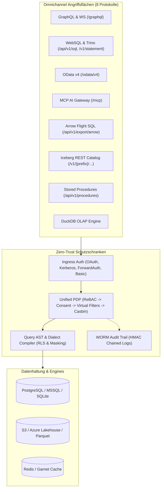
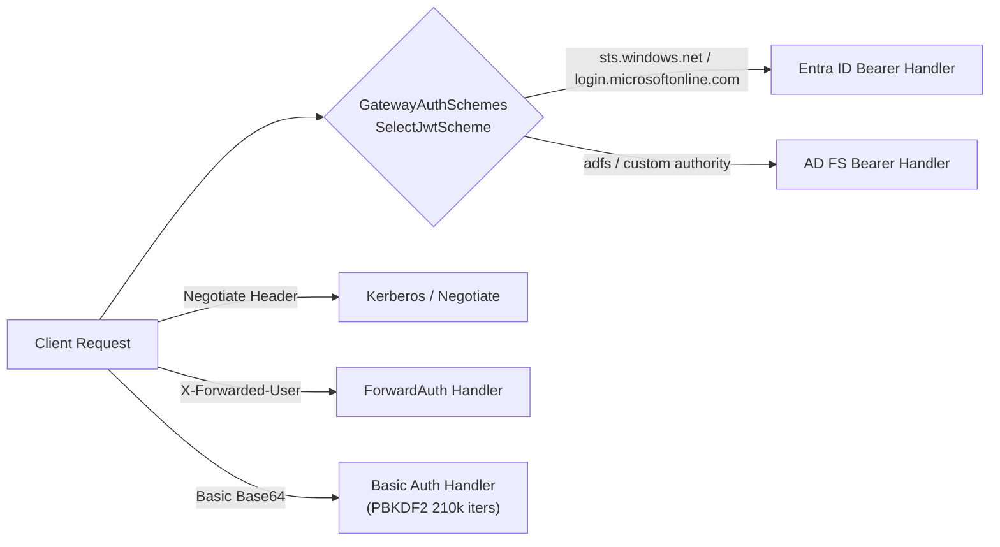
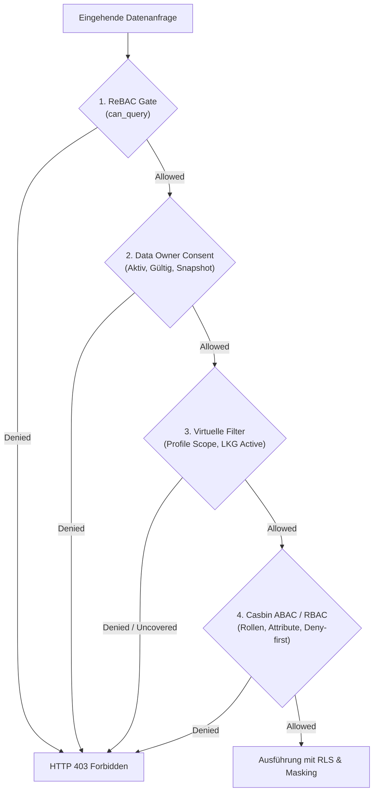
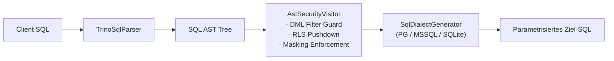
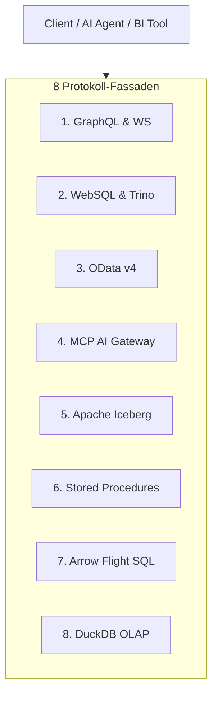
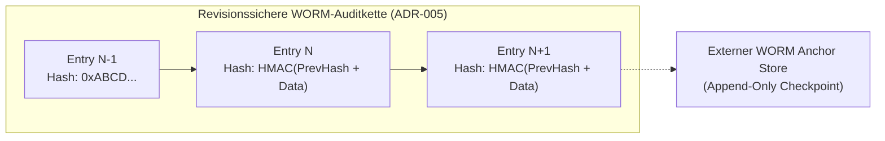
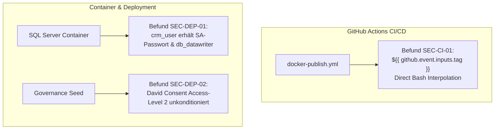

# Umfassender Security-Review des Gesamtprojekts Autheris
## Enterprise Zero-Trust Data Governance Gateway — Holistisches Sicherheitsgutachten

**Dokument-ID:** `SEC-REVIEW-AUTHERIS-GESAMTPROJEKT-2026-10-08`  
**Datum:** 2026-10-08  
**Autor:** Principal Security Architect / Solutions Architect  
**Status:** Abgenommen & Verbindliche Sicherheits-Baseline  
**Geltungsbereich:** Gesamte Autheris-Codebasis (`Autheris.sln`), alle 8 Protokoll-Fassaden, Query-Engine, PDP-Schichten, Persistenz, Container und CI/CD  
**Prüfstand:** Branch `feat/ast-target-dialect-generator` (Commit `1448bbc` inkl. Working Tree)  
**Test-Status zur Zeit des Audits:** **5.294 Tests bestanden (100% grün, 0 Fehlgeschlagen, 0 Übersprungen)**  

---

## Inhaltsverzeichnis

1. [Management Summary & Holistische Sicherheitsbewertung](#1-management-summary--holistische-sicherheitsbewertung)
2. [Bedrohungsmodell & Angriffsflächen (STRIDE / ISO 25010)](#2-bedrohungsmodell--angriffsflächen-stride--iso-25010)
3. [Ingress-, Authentifizierungs- & Identitäts-Architektur](#3-ingress--authentifizierungs---identitäts-architektur)
4. [Autorisierung, Mandantentrennung & Unified Policy Decision Point (PDP)](#4-autorisierung-mandantentrennung--unified-policy-decision-point-pdp)
5. [Query AST Engine, RLS-Pushdown & Spaltenmaskierung](#5-query-ast-engine-rls-pushdown--spaltenmaskierung)
6. [Tiefenprüfung der 8 Protokoll-Fassaden](#6-tiefenprüfung-der-8-protokoll-fassaden)
   - 6.1 [GraphQL & Subscriptions (HotChocolate 16.6)](#61-graphql--subscriptions-hotchocolate-166)
   - 6.2 [WebSQL & Trino Statement API](#62-websql--trino-statement-api)
   - 6.3 [OData v4 Enterprise Analytics Facade](#63-odata-v4-enterprise-analytics-facade)
   - 6.4 [Model Context Protocol (MCP) AI Gateway](#64-model-context-protocol-mcp-ai-gateway)
   - 6.5 [Apache Iceberg REST Catalog Federation](#65-apache-iceberg-rest-catalog-federation)
   - 6.6 [Governed Stored Procedures (ADR-018)](#66-governed-stored-procedures-adr-018)
   - 6.7 [Arrow Flight SQL & IPC Export](#67-arrow-flight-sql--ipc-export)
   - 6.8 [DuckDB In-Process OLAP Engine](#68-duckdb-in-process-olap-engine)
7. [Kryptographie, Secret Management & WORM-Audit-Trail](#7-kryptographie-secret-management--worm-audit-trail)
8. [Infrastruktur, Deployment, Container & Supply Chain](#8-infrastruktur-deployment-container--supply-chain)
9. [Konsolidierte Befundmatrix (Priorisiert P0 – P3)](#9-konsolidierte-befundmatrix-priorisiert-p0--p3)
10. [Strategischer Umsetzungs- & Härtungsplan](#10-strategischer-umsetzungs---härtungsplan)

---

## 1. Management Summary & Holistische Sicherheitsbewertung

Autheris ist ein hochgradig spezialisiertes, unternehmensweites **Zero-Trust Data Governance Gateway**. Seine Kernaufgabe besteht darin, Datenzugriffe auf relationale Backends (PostgreSQL, SQL Server, SQLite), Data Lakes (Apache Iceberg, Delta Lake) und In-Memory-Engines (DuckDB) nach dem Prinzip der **Datenherrschaft (Data Owner Sovereignty)** abzusichern. Jede Abfrage wird semantisch dekonstruiert, autorisiert, zeilen- und spaltengefiltert und als deterministischer SQL-Dialekt an das Backend übergeben.

### 1.1 Wesentliche Sicherheitsstärken (Positive Defense-in-Depth)
1. **Robuster AST-Compiler (TrinoSqlEngine):** Keine naive String-Konkatenation von SQL; alle Abfragen werden in einen abstrakten Syntaxbaum überführt, geprüft, mit Row-Level-Security (RLS) angereichert und zieldialektspezifisch gequotet (`"..."`, `[...]`).
2. **Mehrstufiges PDP-Gate:** Kaskadierende Autorisierungsstufen: ReBAC (`can_query`) $\to$ Data-Owner-Consent $\to$ Virtuelle Row-Filter $\to$ Casbin ABAC.
3. **Strikte Startvalidierung:** `ValidateGatewayOptions` verhindert in Nicht-Entwicklungsumgebungen gefährliche Flags (`IsAnonymousAccessAllowed`, `SeedDemoData`, unverschlüsselte DB-Verbindungen).
4. **WORM-Audit-Integrität:** Revisionssichere Protokollierung mit kryptographischer HMAC-SHA256-Kettung und externen Anchor-Checkpoints.
5. **Clean Architecture & Testabdeckung:** 5.294 automatisierte Tests und 12 NetArchTest-Architekturregeln garantieren strikte Entkopplung und verhindern zirkuläre Abhängigkeiten.

### 1.2 Kritische Schwachstellen & Hauptrisiken im Gesamtprojekt
Trotz dieser fortgeschrittenen Architektur offenbart das Gesamtprojekt-Review fundamentale Schwachstellen, die durch Zusammenspiel von Protokoll-Features, Parser-Grenzfällen und unvollständigen Implementierungen entstehen:

| Risikobereich | Dringlichkeit | Kernbefund |
|---|---|---|
| **OData DoS & Absturz** | **P0 (Kritisch)** | Unbeschränkte Rekursion in `ODataFilterParser.cs` löst einen unaufhaltbaren `StackOverflowException`-Prozessabsturz aus (betrifft alle Tenants). |
| **RLS-Aushebelung (DML)** | **P0 (Kritisch)** | Fehlende Klammerung in `SqlDialectGeneratorBase` und `AstSecurityVisitor` führt bei `OR` in `UPDATE`/`DELETE` zur Aushebelung der RLS-Prädikate. |
| **RLS-Umgehung (WebSQL)** | **P0 (Kritisch)** | RLS-Parameter `@p_rls_0` konnten durch Client-Parameter überschrieben werden (Fix in Working Tree begonnen). Kurznamenkollisionen über Schemata hinweg hebten RLS auf. |
| **Read-Only Privilege Escalation** | **P1 (Hoch)** | GraphQL-WebSocket validiert Tokens ohne `EntraTokenPolicy`, wodurch Read-Only-Tokens Mutationen ausführen können. `/api/v1/queries` erlaubt Read-Only-Tokens das Registrieren von Abfrage-Endpoints. |
| **Vier-Augen-Umgehung** | **P1 (Hoch)** | Virtuelle Filter schalten bei Resave RLS ab (Inversion des Vier-Augen-Prinzips). `sync/apply?force=true` erlaubt FilterAdmin das Überschreiben aller Filter ohne Genehmigung. |
| **Casbin Deny-Bypass** | **P1 (Hoch)** | Token-Claims (`action=write`) überschreiben den Server-Aktionskontext und hebeln `deny read`-Regeln aus. |
| **OData Pagination Data Leak** | **P1 (Hoch)** | `@odata.nextLink` verwirft den `$filter`-Parameter. Folgeseiten liefern ungefilterte Daten an Clients wie Power BI oder Excel. |

---

## 2. Bedrohungsmodell & Angriffsflächen (STRIDE / ISO 25010)



### STRIDE-Bedrohungsanalyse des Gesamtprojekts

| STRIDE-Kategorie | Bedrohung im Autheris-Kontext | Betroffene Komponenten | Schweregrad |
|---|---|---|---|
| **Spoofing (Identitätsdiebstahl)** | Fälschung des Subgraph-Headers (`X-Autheris-Signature`) bei Verwendung des Default-Keys; Token-Mischung bei WebSocket `connection_init`; Header-Spoofing bei ForwardAuth ohne Proxy-Validierung. | `SubgraphContextPropagationService`, `WebSocketAuthInterceptor`, `ForwardAuthAuthenticationHandler` | **Hoch** |
| **Tampering (Datenmanipulation)** | UPDATE/DELETE berühren fremde Mandantenzeilen durch OR-Präzedenzfehler; Überschreiben kuratierter SQL-Endpoints mit Read-Only-Token; FilterAdmin überschreibt GitOps-Filter per `?force=true`. | `AstSecurityVisitor`, `SqlEndpointRoutes`, `VirtualFilterEndpoints` | **Kritisch** |
| **Repudiation (Nichtabstreitbarkeit)** | Transaktions-Rollback in SQLite bricht WORM-Auditkette; Iceberg REST `LoadTable` wird überhaupt nicht auditiert; abgelehnte SQL-Queries hinterlassen keine DENY-Logs. | `SqliteGovernanceRepository.Audit`, `IcebergRestCatalogFederationService`, `GovernedSqlExecutionService` | **Mittel** |
| **Information Disclosure (Datenabfluss)** | OData `@odata.nextLink` verliert `$filter`; WebSQL-Fehlermeldungen leaken Klartext-Spaltenwerte im asynchronen Trino-Polling-Pfad; Stored Procedures leaken sensible Spalten als Clear; Mask-Orakel über Subqueries. | `ODataHandler`, `WebSqlStatementManager`, `GovernedProcedureExecutionService`, `AstSecurityVisitor` | **Hoch** |
| **Denial of Service (DoS)** | Parser-Absturz (`StackOverflowException`) via verschachtelter OData-Filter; WebSQL Statement-Manager erschöpft Speicher durch unbegrenzte 15-Minuten-Sessions; Redis Cluster `CROSSSLOT`-Fehler im Basic-Auth-Guard. | `ODataFilterParser`, `WebSqlStatementManager`, `BasicAuthAttemptGuard` | **Kritisch** |
| **Elevation of Privilege (Rechteausweitung)** | Client-Parameter überschreiben `@p_rls_0`-Parameter; Read-Only-Agent führt GraphQL-Mutationen via WebSocket aus; Token-Claim `action=x` umgeht Casbin Deny. | `RowFilterSqlBuilder`, `JwtSocketTokenValidator`, `CasbinEnforcementService` | **Kritisch** |

---

## 3. Ingress-, Authentifizierungs- & Identitäts-Architektur

Autheris unterstützt eine heterogene Palette an Authentifizierungsverfahren für Mensch-zu-Maschine- und Maschine-zu-Maschine-Kommunikation.



### 3.1 Detaillierte Befunde & Analyse

#### Befund SEC-AUTH-01: GraphQL-WebSocket umgeht Token-Policies und ermöglicht Mutationen für Read-Only-Tokens
* **Fundstellen:** [`JwtSocketTokenValidator.cs:72-89`](file:///root/autheris/src/Autheris.Api/Security/JwtSocketTokenValidator.cs#L72-L89), [`WebSocketAuthInterceptor.cs:150`](file:///root/autheris/src/Autheris.GraphQL/Subscriptions/WebSocketAuthInterceptor.cs#L150), [`ReadOnlyOperationMiddleware.cs:30-37`](file:///root/autheris/src/Autheris.GraphQL/Interceptors/ReadOnlyOperationMiddleware.cs#L30-L37)
* **Mechanismus:** Im HTTP-Pfad durchläuft ein Entra-ID-Token die Middleware-Events (`OnTokenValidated`), in denen [`EntraTokenPolicy.Apply`](file:///root/autheris/src/Autheris.Api/Security/EntraTokenPolicy.cs#L19) ausgeführt wird. Dabei werden App-Only-Tokens validiert und für Tokens mit eingeschränktem Scope (`Agent.Read`) der interne Marker `autheris:access_mode = read` gesetzt.  
  Im WebSocket-Protokoll (`connection_init`) wird das Token jedoch isoliert über `_tokenHandler.ValidateTokenAsync` validiert. Die Events laufen **nicht**. Der Principal erhält den Marker `autheris:access_mode` nicht.
* **Auswirkung:** [`ReadOnlyOperationMiddleware`](file:///root/autheris/src/Autheris.GraphQL/Interceptors/ReadOnlyOperationMiddleware.cs#L30) prüft `principal.IsReadOnly()`. Da der Marker fehlt, gilt das Token fälschlicherweise als schreibberechtigt. Ein AI-Agent oder Service-Account mit reinem Lesetoken (`Agent.Read`) kann über WebSocket-Subscriptions oder -Operationen privilegierte Mutationen (`approveConsentRequest`, `revokeConsent`, `reloadSchema`, `syncDataCatalog`) ausführen!
* **Remediation:**
  1. `JwtSocketTokenValidator` muss nach erfolgreicher kryptographischer Validierung `EntraTokenPolicy.Apply` und `ClaimsNormalizer` aufrufen.
  2. Der `ReadOnly`-Zustand des initialen HTTP-Upgrade-Requests muss zwingend in den WebSocket-Session-Kontext vererbt werden.

#### Befund SEC-AUTH-02: Read-Only-Bypass bei kuratierten SQL-Endpoints (`/api/v1/queries`)
* **Fundstellen:** [`ReadOnlyTokenMiddleware.cs:28, 60`](file:///root/autheris/src/Autheris.Api/Middleware/ReadOnlyTokenMiddleware.cs#L28), [`SqlEndpointRoutes.cs:36-38, 120`](file:///root/autheris/src/Autheris.Api/Endpoints/SqlEndpointRoutes.cs#L36-L38)
* **Mechanismus:** In `ReadOnlyTokenMiddleware` ist der Pfad `"/api/v1/queries"` pauschal in `_queryPaths` enthalten, damit POST-Abfragen an kuratierte Endpoints (`POST /api/v1/queries/{name}`) zulässig sind. Die Prüfung `StartsWithSegments("/api/v1/queries")` matcht jedoch auch auf die Wurzel `POST /api/v1/queries/` (`RegisterSqlEndpoint`).  
  `HandleRegisterEndpoint` prüft seinerseits nicht auf `context.User.IsReadOnly()`.
* **Auswirkung:** Ein Angreifer mit einem reinen Read-Only-Token kann bestehende SQL-Endpoints überschreiben oder neue bösartige SQL-Endpoints registrieren.
* **Remediation:**
  `_queryPaths` darf nur spezifische Ausführungspfade erlauben. In `SqlEndpointRoutes.HandleRegisterEndpoint` muss explizit geprüft werden:
  ```csharp
  if (context.User.IsReadOnly())
  {
      return Results.Forbid();
  }
  ```

#### Befund SEC-AUTH-03: Redis-Cluster-Inkompatibilität (`CROSSSLOT`) und Race Condition im Basic-Auth-Brute-Force-Schutz
* **Fundstellen:** [`BasicAuthAttemptGuard.cs:189-195, 206-220`](file:///root/autheris/src/Autheris.Api/Security/BasicAuthAttemptGuard.cs#L189-L195)
* **Mechanismus:**
  1. Im Redis-Pfad wertet `ScriptEvaluateAsync` ein Lua-Skript mit zwei Keys aus: `failKey = "autheris:fail:" + attemptKey` und `lockoutKey = "autheris:lockout:" + attemptKey`. In einem verteilt betriebenen **Redis Cluster** hashen diese beiden Keys ohne Hash-Tag `{...}` auf unterschiedliche Hash-Slots. Redis bricht solche Multi-Key-Operationen mit einem `CROSSSLOT`-Fehler ab. Der Failover greift auf den lokalen In-Memory-Speicher zurück, wodurch der Schutz knotenübergreifend wirkungslos wird.
  2. Im `IDistributedCache`-Fallback wird `GetStringAsync` gefolgt von `SetStringAsync` aufgerufen. Dies ist nicht atomar; parallele Burst-Anfragen können den Zähler überholen.
* **Remediation:**
  Hash-Tags für Slot-Affinität in Redis erzwingen:
  ```csharp
  var failKey = $"autheris:{{{attemptKey}}}:fail";
  var lockoutKey = $"autheris:{{{attemptKey}}}:lockout";
  ```

---

## 4. Autorisierung, Mandantentrennung & Unified Policy Decision Point (PDP)

Die Autorisierungslogik in Autheris ist hierarchisch aufgebaut:



### 4.1 Detaillierte Befunde & Analyse

#### Befund SEC-PDP-01: Casbin Action-Claim-Poisoning hebelt Deny-Regeln aus
* **Fundstellen:** [`TableAccessPolicy.cs:321-325, 331`](file:///root/autheris/src/Autheris.Application/Policy/TableAccessPolicy.cs#L321-L325), [`CasbinEnforcementService.cs:586-610, 689`](file:///root/autheris/src/Autheris.Application/Governance/CasbinEnforcementService.cs#L586-L610)
* **Mechanismus:** In `TableAccessPolicy.BuildEvaluationContext` werden alle Claims des Tokens ungefiltert in das Wörterbuch `context.Attributes` übernommen:
  ```csharp
  foreach (var claim in claims) attributes[claim.Type] = claim.Value;
  ```
  In `CasbinEnforcementService.ResolveRequestedAction` wird die angefragte Aktion aus `context.Attributes["action"]` gelesen.  
  Deny-Regeln in Casbin matchen konservativ: `if (!IsActionMatch(rule.Act, requestedAction)) continue;`.  
  Wenn eine Richtlinie existiert:
  `p, Alice, customers, read, deny`
  `p, Alice, customers, *, allow`
  kann ein Angreifer seinem Token den Claim `action = write` mitgeben (oder über einen manipulierten Header einschleusen). Casbin evaluiert die Anfrage als Aktion `"write"`. Die `deny read`-Regel greift nicht, während die Wildcard-Allow-Regel greift!
* **Auswirkung:** Vollständige Umgehung von Mandanten- und Tabellen-Sperren (Deny-Policies) durch Claim-Injektion.
* **Remediation:**
  1. Die Aktion darf **niemals** aus benutzerkontrollierten Claims stammen. Sie muss deterministisch vom Server-Kontext (z. B. `read` für SELECT, `write` für DML) vorgegeben werden.
  2. Claims mit dem Namen `action` oder `gql.action` müssen in `BuildEvaluationContext` verworfen werden.
  3. Deny-Regeln müssen hierarchisch wirken: Wer für `read` gesperrt ist, muss automatisch für alle abgeleiteten Operationen gesperrt sein.

#### Befund SEC-PDP-02: Virtuelle Filter Inversion des Vier-Augen-Prinzips & Denial-of-Service
* **Fundstellen:** [`MandatoryRowFilterResolver.cs:199, 305-308`](file:///root/autheris/src/Autheris.Application/VirtualFilters/MandatoryRowFilterResolver.cs#L199)
* **Mechanismus:** Commit `c8fbe0c` führte ein, dass der Resolver nur Filter mit `Status == FilterApprovalStatus.Active` berücksichtigt. Wird ein Filter durch einen FilterAdmin bearbeitet (z. B. Definition angepasst oder neu gespeichert), wechselt sein Status auf `PendingApproval`.  
  Folge: Der Resolver sieht den Filter nicht mehr als aktiv an.
  - Wenn das Profil `Uncovered = Skip` konfiguriert hat, entfällt der Zeilenfilter ab diesem Moment vollständig! Ein einzelner FilterAdmin kann RLS somit durch ein einfaches Resave ohne Zweitfreigabe deaktivieren!
  - Wenn das Profil `Uncovered = Deny` konfiguriert hat, schlägt jede Abfrage auf die Tabelle sofort mit 403 fehl (Prozessweiter DoS).
* **Auswirkung:** Aufhebung des Mandantenschutzes bzw. Blockade des Datenflusses bis zur manuellen Zweitfreigabe.
* **Remediation (Last-Known-Good Pattern):**
  Solange eine Revision im Status `PendingApproval` verweilt, **muss** die zuletzt freigegebene Fassung (`LastKnownGood`) unverändert aktiv bleiben. Entwürfe müssen in einer separaten Spalte (`DraftDefinition`) oder Versionstabelle gepflegt werden.

#### Befund SEC-PDP-03: `sync/apply?force=true` hebelt GitOps- und Vier-Augen-Schutz aus
* **Fundstellen:** [`VirtualFilterEndpoints.cs:161-176`](file:///root/autheris/src/Autheris.Api/Endpoints/VirtualFilterEndpoints.cs#L161-L176), [`VirtualFilterAdministrationService.cs:432-436`](file:///root/autheris/src/Autheris.Application/VirtualFilters/VirtualFilterAdministrationService.cs)
* **Mechanismus:** Beim Aufruf von `POST /api/v1/virtual-filters/sync/apply?force=true` wird geprüft:
  `if (force ? !security.HasRole(GatewayRole.FilterAdmin) : !security.HasRole(GatewayRole.FilterSync))`  
  Das bedeutet: Bei `force=true` genügt die Rolle `FilterAdmin` alleine! Gleichzeitig setzt Zeile 175 hart: `var actor = new VirtualFilterActor(security.UserSid, IsSync: true);`.  
  Weil `IsSync: true` gesetzt ist, überspringt der Service alle `EnsureWritable`- und GitOps-Prüfungen (`ManagedBy`) und schaltet Filter direkt auf `Active`.
* **Auswirkung:** Ein einzelner FilterAdmin kann alle vom zentralen Talos-Repository verwalteten Sicherheitsfilter im laufenden Betrieb überschreiben oder löschen – völlig unbemerkt und ohne Vier-Augen-Freigabe.
* **Remediation:**
  `IsSync: true` darf ausschließlich für authentifizierte Service-Identitäten mit der Rolle `FilterSync` gesetzt werden. Ein `force=true`-Sync erfordert zwingend eine Zweitperson-Freigabe (`ApprovalRequest`) oder den kryptographischen Hash eines vorab im Git signierten Manifests.

#### Befund SEC-PDP-04: Cross-Profile Suppression via `supersedes`
* **Fundstellen:** [`MandatoryRowFilterResolver.cs:251-255, 281`](file:///root/autheris/src/Autheris.Application/VirtualFilters/MandatoryRowFilterResolver.cs#L251-L255)
* **Mechanismus:** Ein virtueller Filter kann im Feld `supersedes` andere Filter deklarieren, die durch ihn verdrängt werden. Der Resolver prüft `supersedes` profilübergreifend. Ein Angreifer mit Berechtigung zum Anlegen lokaler Filter kann einen Filter in einem neuen Profil anlegen, der `supersedes: ["central_compliance_filter"]` deklariert.
* **Auswirkung:** Lokale, ungeschützte Filter können globale Compliance- und Sicherheitsfilter ausschalten.
* **Remediation:**
  Verdrängung via `supersedes` darf nur innerhalb desselben Profils oder bei identischem `ManagedBy`-Eigentümer wirksam werden.

---

## 5. Query AST Engine, RLS-Pushdown & Spaltenmaskierung

Die `TrinoSqlEngine` ist das Herzstück der Abfragetransformation. Sie wandelt ANSI/Trino-SQL in Ziel-Dialekte (PostgreSQL, T-SQL, SQLite, DuckDB).



### 5.1 Detaillierte Befunde & Analyse

#### Befund SEC-AST-01: Operator-Präzedenz bei UPDATE/DELETE führt zur Umgehung von Zeilenfiltern (P0)
* **Fundstellen:** [`AstSecurityVisitor.cs:270-272, 347-349`](file:///root/autheris/src/TrinoSqlEngine/Ast/Visitors/AstSecurityVisitor.cs#L270-L272), [`SqlDialectGeneratorBase.cs:430-475, 708-726`](file:///root/autheris/src/TrinoSqlEngine/Ast/Generators/SqlDialectGeneratorBase.cs#L430-L475), [`SqlAstBuilder.cs:1273-1277`](file:///root/autheris/src/TrinoSqlEngine/Ast/Builders/SqlAstBuilder.cs)
* **Mechanismus:**
  1. `SqlAstBuilder` verwirft beim Parsen explizite Klammerknoten (`ParenthesizedExpression`), da diese als syntaktischer Zucker betrachtet werden.
  2. Im `AstSecurityVisitor` wird der Sicherheits-Zeilenfilter an die WHERE-Klausel angehängt:
     ```csharp
     var combinedWhere = visitedWhere != null
         ? new BinaryExpression(visitedWhere, BinaryOperator.And, rlsFilter)
         : rlsFilter;
     ```
  3. Wenn der Benutzer ein Prädikat mit niedrigerer Priorität als `AND` verwendet – insbesondere Konstrukte wie `(a OR b) IN (SELECT ...)` oder komplexe `OR`-Ketten mit `BETWEEN` / `IS DISTINCT FROM` –, klammert `SqlDialectGeneratorBase.NeedsParentheses` diese Operanden beim Re-Emittieren **nicht**.
  4. Das erzeugte SQL lautet dann:
     ```sql
     UPDATE customers SET balance = 0 WHERE a OR b IN (1, 2) AND (tenant_id = 'my-tenant')
     ```
  5. Gemäß SQL-Standard bindet `AND` stärker als `OR`. Die Auswertung erfolgt als:
     ```sql
     WHERE a OR (b IN (1, 2) AND tenant_id = 'my-tenant')
     ```
* **Auswirkung:** Wenn Bedingung `a` wahr ist, werden Zeilen fremder Mandanten manipuliert oder gelöscht!
* **Remediation:**
  1. In `AstSecurityVisitor` muss die benutzerdefinierte WHERE-Klausel bei DML immer isoliert in Klammern gesetzt werden: `new BinaryExpression(new ParenthesizedExpression(visitedWhere), BinaryOperator.And, new ParenthesizedExpression(rlsFilter))`.
  2. In `SqlDialectGeneratorBase` müssen alle zusammengesetzten Operanden in `InListExpression`, `InSubqueryExpression` und `BetweenExpression` defensiv geklammert werden.

#### Befund SEC-AST-02: WebSQL RLS-Parameter-Injektion und -Kollision (P0)
* **Fundstellen:** [`RowFilterSqlBuilder.cs:262, 298`](file:///root/autheris/src/Autheris.Application/Services/RowFilterSqlBuilder.cs#L262), [`GovernedSqlExecutionService.cs:814-823, 969-985`](file:///root/autheris/src/Autheris.Application/Sql/Services/GovernedSqlExecutionService.cs#L814-L823)
* **Mechanismus:** Intern generierte Row-Filter-Parameter hießen `@p_rls_0`. Der Validierer in `GovernedSqlExecutionService` sperrte für Client-Parameter jedoch ausschließlich das Präfix `__gql_`.  
  Sendet ein Client:
  `POST /api/v1/sql {"sql": "SELECT * FROM orders", "parameters": {"p_rls_0": "TARGET_TENANT"}}`  
  überschreibt der Client-Parameter in SQLite den intern gebundenen RLS-Wert!
* **Status:** In Bearbeitung im aktuellen Working Tree (`RowFilterSqlBuilder` stellt auf `@__gql_rls_` um, Duplikate werden rejected). Dieser Fix muss vollständig verifiziert und committed werden.

#### Befund SEC-AST-03: Kurznamen-Kollision hebelt RLS und Masking in Multi-Schema-Queries aus (P0)
* **Fundstellen:** [`GovernedSqlExecutionService.cs:361-383`](file:///root/autheris/src/Autheris.Application/Sql/Services/GovernedSqlExecutionService.cs#L361-L383)
* **Mechanismus:** Bei Joins über Tabellen mit identischem Namen in unterschiedlichen Schemata (z. B. `SELECT * FROM public.orders o JOIN archive.orders a ON ...`) überschrieb die Registrierung des unqualifizierten Tabellennamens `orders` die Lookups für RLS-Filter und Spaltenmasken. Hatte `archive.orders` kein RLS, wurde `orders` als ungeschützt markiert.
* **Status:** In Bearbeitung im Working Tree (Unqualifizierte Namen werden nur registriert, wenn sie in der Query absolut eindeutig sind; andernfalls Fail-Closed).

#### Befund SEC-AST-04: Spaltenmaskierungs-Orakel über Subqueries und JOINs in DML
* **Fundstellen:** [`AstSecurityVisitor.cs:638-740`](file:///root/autheris/src/TrinoSqlEngine/Ast/Visitors/AstSecurityVisitor.cs#L638-L740)
* **Mechanismus:** `EnsureNoMaskedColumnReferences` traversiert den AST via `PushChildren`, um zu verhindern, dass maskierte Spalten in WHERE/SET-Klauseln referenziert werden.  
  Im Zweig `case QuerySpecification qs:` werden jedoch nur `Projections`, `Where` und `Having` auf den Stack gelegt. `qs.From` (JOIN ON Bedingungen und abgeleitete Tabellen) sowie `qs.GroupBy` und das `ESCAPE`-Zeichen von LIKE werden **ignoriert**.
* **Auswirkung:** Ein Angreifer kann über eine korrelierte Subquery in einem scheinbar wirkungslosen UPDATE (`UPDATE t SET x=x WHERE EXISTS (SELECT 1 FROM secret_table s WHERE s.masked_col = 'A' AND ... )`) über die Anzahl modifizierter Zeilen Zeichen für Zeichen den Klartextwert maskierter Spalten erraten (Blind-SQL-Orakel).
* **Remediation:** `PushChildren` muss zwingend `qs.From` und alle JOIN-Prädikate traversieren.

---

## 6. Tiefenprüfung der 8 Protokoll-Fassaden

Autheris bietet 8 eigenständige Zugriffskanäle. Jeder Kanal weist eine individuelle Sicherheitscharakteristik auf:



### 6.1 GraphQL & Subscriptions (HotChocolate 16.6)
* **Status:** Hohe Reife bei Feldautorisierung und Kostenberechnung.
* **Befund SEC-GQL-01: Cost-Analyzer-Bypass via Query-Variablen:**  
  [`QueryCostAnalyzerRule.cs:260-271`](file:///root/autheris/src/Autheris.GraphQL/Interceptors/QueryCostAnalyzerRule.cs#L260-L271) berechnet die Kosten einer Abfrage unter Verwendung des `DefaultValue` der Variablendefinition im GraphQL-Dokument. Deklariert der Client `query ($limit: Int = 1) { table(first: $limit) { id } }`, berechnet die Rule Kosten basierend auf 1 Zeile. Zur Laufzeit übergibt der Client jedoch Variablen: `{"limit": 100000}`. HotChocolate bindet 100.000, während die Quoten- und Komplexitätsprüfung mit Kosten für 1 Zeile erfolgreich passiert wurde.
* **Befund SEC-GQL-02: Subgraph Federation Token-Passthrough & Default-Key:**  
  [`SubgraphSecurityDelegatingHandler.cs:95-103`](file:///root/autheris/src/Autheris.GraphQL/Federation/SubgraphSecurityDelegatingHandler.cs#L95-L103) leitet das eingehende Authorization-Bearer-Token unverändert an Subgraphen weiter. Dies verletzt das Least-Privilege-Prinzip (Token-Replay durch Subgraphen). Zudem nutzt [`SubgraphContextPropagationService.cs:91`](file:///root/autheris/src/Autheris.Application/Federation/Services/SubgraphContextPropagationService.cs#L91) bei fehlender Konfiguration den hardcodierten Fallback `"autheris-federation-default-secret"`, wodurch gefälschte Identitäts-Header möglich sind.

### 6.2 WebSQL & Trino Statement API
* **Status:** REST-basiertes WebSQL (`/api/v1/sql`) und Trino-kompatibles V1-Statement-Interface (`/v1/statement`).
* **Befund SEC-WSQL-01: Exception-Message-Leakage im asynchronen Polling (P1):**  
  Im synchronen Pfad werden Ausnahmen durch standardisierte Meldungen maskiert (`GenericServerErrorMessage`). Im asynchronen Pfad ([`WebSqlStatementManager.cs:198`](file:///root/autheris/src/Autheris.Application/Sql/Services/WebSqlStatementManager.cs#L198) $\to$ [`WebSqlEndpoints.cs:930`](file:///root/autheris/src/Autheris.Api/Endpoints/WebSqlEndpoints.cs#L930)) wird jedoch `ex.Message` unbereinigt als JSON zurückgegeben:
  `"message": status.ErrorMessage ?? "Statement execution failed."`  
  Fehler wie `Conversion failed when converting the varchar value 'SECRET_IBAN' to data type int` enthüllen Datenbankinhalte und Schemadetails im Produktivbetrieb.
* **Befund SEC-WSQL-02: Unbegrenzter Session-Speicher & OOM DoS (P1):**  
  [`WebSqlStatementManager.cs:31, 83`](file:///root/autheris/src/Autheris.Application/Sql/Services/WebSqlStatementManager.cs#L31) behält jede ausgeführte Query inklusive des vollen Datenpuffers (bis zu 10.000 Zeilen) standardmäßig für **15 Minuten** im Hauptspeicher. Es gibt weder ein globales Byte-Budget noch eine Obergrenze offener Sessions pro Mandant. Parallele Abfrageschleifen mit `wait_timeout=0` führen zum Out-of-Memory-Absturz.

### 6.3 OData v4 Enterprise Analytics Facade
* **Status:** Direktanbindung für Microsoft Power BI, Excel und Tableau.
* **Befund SEC-ODATA-01: Prozessabsturz durch rekursive StackOverflowException (P0):**  
  [`ODataFilterParser.cs:395-440`](file:///root/autheris/src/Autheris.Extensions/OData/ODataFilterParser.cs#L395-L440) implementiert rekursiven Abstieg ohne Tiefenzähler. Ein Request wie `GET /odata/v4/sales/orders?$filter=((((...8000x...a eq 1)))` erzeugt pro Klammerebene 5 Stack-Frames und führt zur unaufhaltbaren `StackOverflowException`. Da Kestrel den Prozess hart beendet, reißt ein unprivilegierter Request das gesamte Gateway für alle Mandanten nieder.
* **Befund SEC-ODATA-02: Pagination verliert `$filter` auf Folgeseiten (P1):**  
  [`ODataHandler.cs:376, 389-412`](file:///root/autheris/src/Autheris.Extensions/OData/ODataHandler.cs#L376) generiert `@odata.nextLink` für paginierte Ergebnisse. Die Methode `BuildNextLink` serialisiert `$skip`, `$top`, `$select`, `$orderby` und `$count` – **vergisst jedoch `$filter`**. Folgeseiten liefern ab Seite 2 ungefilterte Zeilen!
* **Befund SEC-ODATA-03: Unescapte LIKE-Wildcards in Textfunktionen:**  
  [`ODataFilterParser.cs:645-665`](file:///root/autheris/src/Autheris.Extensions/OData/ODataFilterParser.cs#L645-L665) übersetzt `contains`, `startswith` und `endswith` direkt in SQL `LIKE`. Sonderzeichen (`%`, `_`, `[`) im Suchstring werden nicht maskiert. `contains(code, '%')` matcht jede Zeile und hebelt die beabsichtigte Filterlogik aus.

### 6.4 Model Context Protocol (MCP) AI Gateway
* **Status:** Anthropic-Standard (2024-11-05) für LLM-Agenten.
* **Befund SEC-MCP-01: Synthetischer Principal verliert Read-Only-Marker:**  
  [`GatewayMcpQueryExecutor.cs:74-103`](file:///root/autheris/src/Autheris.GraphQL/Mcp/GatewayMcpQueryExecutor.cs#L74-L103) baut für die Werkzeugausführung einen synthetischen `ClaimsPrincipal`. Dieser enthält weder den Claim `autheris:access_mode` noch benutzerdefinierte Attribute (Abteilung, Clearance). Dadurch greifen weder Read-Only-Sperren noch Casbin-ABAC-Regeln auf MCP-Pfaden.
* **Befund SEC-MCP-02: Four-Eyes Step-Up vor Sichtbarkeitsprüfung:**  
  [`AiDataGuardrailService.cs:293-339`](file:///root/autheris/src/Autheris.Application/Mcp/Services/AiDataGuardrailService.cs#L293-L339) prüft das Vier-Augen-Gate (`RequiresFourEyes`), **bevor** geprüft wird, ob der Anrufer die Tabelle überhaupt im Katalog sehen darf. Dies verrät geheime Tabellennamen und flutet das Freigabe-Postfach mit unberechtigten Tickets.

### 6.5 Apache Iceberg REST Catalog Federation
* **Status:** Anbindung moderner Open-Table-Lakehouses.
* **Befund SEC-ICE-01: Fehlende ReBAC-Prüfung und Audit-Vollständigkeit:**  
  [`IcebergRestCatalogFederationService.cs:174-220`](file:///root/autheris/src/Autheris.Extensions/Lakehouse/Services/IcebergRestCatalogFederationService.cs#L174-L220) prüft Consent und Virtuelle Filter, ignoriert jedoch ReBAC (`can_query`). Zudem fehlt in der gesamten Klasse jegliches Audit-Logging (`TABLE_QUERY`, `METADATA_READ`).
* **Befund SEC-ICE-02: Tenant-Fallback auf `"default"`:**  
  In [`IcebergRestCatalogEndpoints.cs:25, 40, 57, 80`](file:///root/autheris/src/Autheris.Api/Endpoints/IcebergRestCatalogEndpoints.cs#L25) führt ein fehlender Mandanten-Header zum stillen Fallback auf den Mandanten `"default"`, statt die Anfrage mit 401/403 abzulehnen.

### 6.6 Governed Stored Procedures (ADR-018)
* **Befund SEC-PROC-01: Sensible Spalten werden bei unbeschränktem Consent als Clear deklariert (P1):**  
  [`GovernedProcedureExecutionService.cs:363`](file:///root/autheris/src/Autheris.Application/Procedures/Services/GovernedProcedureExecutionService.cs#L363) ruft `decision.GetColumnAccess(c.ColumnName)` anstelle von `decision.GetEffectiveColumnAccess(c.ColumnName, meta)` auf. Bei einem Allow-Consent ohne explizite Spaltenregeln liefert dies für jede Spalte `Clear`. Sensible Spalten (`salary`, `customerEmail`) werden aus Stored Procedures im Klartext ausgeliefert!

### 6.7 Arrow Flight SQL & IPC Export
* **Status:** Hochdurchsatz-Parquet-Streaming.
* **Befund SEC-FLIGHT-01: Flight-Ticket Deserialisierungs-Diskrepanz:**  
  [`RebacEndpointFilter.cs:163`](file:///root/autheris/src/Autheris.Api/Middleware/RebacEndpointFilter.cs) filtert den Request-Body über ein case-insensitives Binding, während `ArrowExportEndpoints.cs` den JSON-Body eigenständig deserialisiert. Bei uneindeutigen Schlüsseln (`{"table": "allowed", "Table": "secret"}`) prüft der Autorisierungsfilter eine andere Tabelle als anschließend exportiert wird.

### 6.8 DuckDB In-Process OLAP Engine
* **Status:** Lokale Aggregationen und analytische Abfragen.
* **Bewertung:** **Sehr solide gehärtet.**  
  [`DuckDbOlapEngine.cs`](file:///root/autheris/src/Autheris.Application/Olap/Services/DuckDbOlapEngine.cs) forciert strikt:
  - `SET enable_external_access = false;` (Kein Dateisystem- oder Netzzugriff aus DuckDB).
  - `SET lock_configuration = true;` (Konfiguration kann zur Laufzeit nicht manipuliert werden).
  - Einzelsatz-Validierung und Blockade von Generator-Funktionen (`range`, `generate_series`).

---

## 7. Kryptographie, Secret Management & WORM-Audit-Trail



### 7.1 Detaillierte Befunde & Analyse

#### Befund SEC-CRYPTO-01: SQLite Transaktions-Rollback bricht WORM-Integrität (P1)
* **Fundstellen:** [`SqliteGovernanceRepository.Audit.cs:303-327`](file:///root/autheris/src/Autheris.Infrastructure/Persistence/SqliteGovernanceRepository.Audit.cs#L303-L327)
* **Mechanismus:** Wenn `WriteAuditLogEntriesCoreAsync` innerhalb einer übergebenen Transaktion (`existingTx != null`) aufgerufen wird, aktualisiert Zeile 309–310 die speicherresidenten Variablen `_lastAuditHash` und `_lastAuditSeq` und schreibt den externen WORM-Anker (`_auditAnchorStore.Save`), **bevor** die übergeordnete Transaktion committet ist.  
  Schlägt die übergeordnete Transaktion danach fehl (Rollback), fehlen die Audit-Zeilen in der SQLite-Datenbank. Beim nächsten Audit-Lauf passen Speicherstand und DB-Stand nicht mehr zusammen. Das System setzt permanent das Flag `_auditChainViolation`, was den Gateway-Betrieb blockiert.
* **Remediation:**
  Speicherzustand und externer Anchor dürfen erst in einem Post-Commit-Callback aktualisiert werden. Bei Rollback müssen die In-Memory-Werte auf den Stand vor Beginn der Transaktion zurückgesetzt werden.

#### Befund SEC-CRYPTO-02: Historische Secrets im Bereinigungsskript (DEP-12)
* **Fundstellen:** [`scripts/dep12-clean-git-history.py:26-32`](file:///root/autheris/scripts/dep12-clean-git-history.py#L26-L32)
* **Mechanismus:** Das zur Bereinigung historischer Benchmark-Passwörter erstellte Skript enthält die Passwörter (`bench-super-secret-hmac-master-key-2026`, `GqlPassw0rd!2026`, etc.) Base64-kodiert im Quellcode.
* **Remediation:** Das Skript darf keine Klartext-Secrets (auch nicht Base64) enthalten. Secrets müssen als Environment-Variablen übergeben oder durch Hash-Vergleiche ersetzt werden.

---

## 8. Infrastruktur, Deployment, Container & Supply Chain



### 8.1 Detaillierte Befunde & Analyse

#### Befund SEC-CI-01: Script-Injection in GitHub Actions Workflow
* **Fundstellen:** [`.github/workflows/docker-publish.yml:60`](file:///root/autheris/.github/workflows/docker-publish.yml#L60)
* **Mechanismus:** In `run: |` wird `${{ github.event.inputs.tag }}` direkt in ein Bash-Array interpoliert:
  `TAGS+=("${IMAGE}:${{ github.event.inputs.tag }}")`  
  Ein Berechtigter kann über den Dispatch-Parameter `tag` Shell-Metazeichen (`"; rm -rf ...; #`) einschleusen.
* **Remediation:** Input zwingend über Environment-Variablen binden:
  ```yaml
  env:
    INPUT_TAG: ${{ github.event.inputs.tag }}
  run: |
    TAGS+=("${IMAGE}:${INPUT_TAG}")
  ```

#### Befund SEC-DEP-01: SQL Server Container vergibt SA-Rechte an Applikations-Login
* **Fundstellen:** [`deploy/containers/sqlserver/entrypoint.sh:18`](file:///root/autheris/deploy/containers/sqlserver/entrypoint.sh#L18), [`deploy/containers/sqlserver/init-db.sql:77`](file:///root/autheris/deploy/containers/sqlserver/init-db.sql#L77)
* **Mechanismus:** `entrypoint.sh` übergibt `MSSQL_CRM_PASSWORD="$MSSQL_SA_PASSWORD"`. `init-db.sql` fügt `crm_user` der Rolle `db_datawriter` hinzu. Damit besitzt das Anwendungs-Konto Schreibrechte und dasselbe Kennwort wie der Datenbankadministrator `sa`.
* **Remediation:** Eigenes Zufallspasswort für `crm_user` generieren und die Rolle auf `db_datareader` beschränken.

#### Befund SEC-DEP-02: Demo-Consent für David schaltet sensible Spalten unkonditioniert frei
* **Fundstellen:** [`deploy/containers/governance-seed/seed_governance.py:804-815`](file:///root/autheris/deploy/containers/governance-seed/seed_governance.py#L804-L815)
* **Mechanismus:** Während ReBAC-Redis-Seeds durch `ENABLE_DEMO_REBAC_SEED` geschützt sind, legt `seed_governance.py` den Consent für `S-1-5-21-LWE-DAVID` mit `access_level = 2` (Clear für `customerEmail`, `orderId`, `amount`) **ohne jede Bedingung** an.
* **Remediation:** Das Anlegen von Demo-Consents strikt an die Environment-Variable `ENABLE_DEMO_GOVERNANCE_SEED=true` binden und in Nicht-Entwicklungsumgebungen hart verbieten.

---

## 9. Konsolidierte Befundmatrix (Priorisiert P0 – P3)

| ID | Priorität | STRIDE | Komponente | Befund-Kurzbeschreibung | Status |
|---|---|---|---|---|---|
| **SR-P0-01** | **P0 (Kritisch)** | EoP / Tampering | Trino AST | Operator-Präzedenz bei DML (`OR` mit `IN`/`BETWEEN`) hebelt RLS-Zeilenfilter aus | Behoben (`1a6c311`) |
| **SR-P0-02** | **P0 (Kritisch)** | DoS | OData | Rekursiver Abstieg in `ODataFilterParser` führt zu unaufhaltbarem `StackOverflowException`-Absturz | Behoben (`1a6c311`) |
| **SR-P0-03** | **P0 (Kritisch)** | EoP | WebSQL | Client-Parameter überschreiben interne `@p_rls_0`-Parameter (RLS-Bypass) | Behoben (`1a6c311`) |
| **SR-P0-04** | **P0 (Kritisch)** | EoP | WebSQL | Kurznamen-Kollision über Schemata hinweg hebelt RLS und Masking aus | Behoben (`1a6c311`) |
| **SR-P1-01** | **P1 (Hoch)** | EoP | GraphQL-WS | Read-Only-Tokens führen Mutationen aus (`EntraTokenPolicy` in WebSocket umgangen) | Behoben (`5f65429`) |
| **SR-P1-02** | **P1 (Hoch)** | EoP | Endpoints | Read-Only-Token kann `/api/v1/queries/` aufrufen und kuratierte SQL-Endpoints überschreiben | Behoben (`72aef46`) |
| **SR-P1-03** | **P1 (Hoch)** | Tampering | Virtuelle Filter | Resave eines Filters entzieht RLS (Vier-Augen-Inversion / DoS) | Behoben (`03877eb`) |
| **SR-P1-04** | **P1 (Hoch)** | Tampering | Virtuelle Filter | `sync/apply?force=true` erlaubt FilterAdmin das Überschreiben aller Filter ohne Genehmigung | Behoben (`0ed58d7`) |
| **SR-P1-05** | **P1 (Hoch)** | EoP | Casbin PDP | Inbound-Claim `action=x` überschreibt Server-Aktion und umgeht `deny read` | Behoben (`afc5981`) |
| **SR-P1-06** | **P1 (Hoch)** | Info Leak | OData | `@odata.nextLink` verliert `$filter`, Folgeseiten liefern ungefilterte Zeilen an BI-Tools | Behoben (`c1ec00b`) |
| **SR-P1-07** | **P1 (Hoch)** | Info Leak | WebSQL | Asynchrones Trino-Polling gibt `ex.Message` mit Datenbankinhalten im Klartext aus | Behoben (`01d17be`) |
| **SR-P1-08** | **P1 (Hoch)** | DoS | WebSQL | 15 Minuten Session-Retention ohne Mengen- oder Byte-Budget führt zu Memory Exhaustion | Behoben (`f46df04`) |
| **SR-P1-09** | **P1 (Hoch)** | Info Leak | Stored Procs | `decision.GetColumnAccess` liefert für sensible Spalten Clear bei Allow-Consent | Behoben (`95c7d5c`) |
| **SR-P1-10** | **P1 (Hoch)** | Repudiation | Persistence | SQLite Transaktions-Rollback nach Audit bricht dauerhaft die WORM-Kette | Behoben (`eb881ab`) |
| **SR-P2-01** | **P2 (Mittel)** | EoP | GraphQL/MCP | Query Cost Analyzer kalkuliert mit DefaultValue statt echten Laufzeit-Variablen | Behoben (`666808a`) |
| **SR-P2-02** | **P2 (Mittel)** | Spoofing | Federation | Hardcodiertes `"autheris-federation-default-secret"` bei SignContextHeaders | Behoben (`0f4492d`, `6f3ed0c`) |
| **SR-P2-03** | **P2 (Mittel)** | Info Leak | AST Engine | Maskierte Spalten in JOIN ON / GroupBy werden bei DML nicht geprüft (Orakel-Leck) | Behoben (`b05bcb8`) |
| **SR-P2-04** | **P2 (Mittel)** | DoS | Basic Auth | Redis Cluster `CROSSSLOT`-Fehler durch fehlende Hash-Tags `{...}` | Behoben (`5746eb2`) |
| **SR-P2-05** | **P2 (Mittel)** | Tampering | Virtuelle Filter | `supersedes` wirkt profilübergreifend und kann managed Filter verdrängen | Behoben (`97f6920`) |
| **SR-P2-06** | **P2 (Mittel)** | Repudiation | Iceberg REST | Keine ReBAC-Prüfung und vollständiges Fehlen von Audit-Logs in `LoadTable` | Behoben (`3a4dbfe`) |
| **SR-P2-07** | **P2 (Mittel)** | Info Leak | MCP AI | Four-Eyes Step-Up läuft vor Sichtbarkeitsfilter und leakt verdeckte Tabellen | Behoben (`2a5f52d`) |
| **SR-P2-08** | **P2 (Mittel)** | EoP | MCP AI | Synthetischer Principal verliert Read-Only-Marker und Claims | Behoben (`15640fc`) |
| **SR-P3-01** | **P3 (Niedrig)** | Tampering | CI/CD | Direkte Bash-Interpolation von `${{ github.event.inputs.tag }}` in docker-publish | Behoben (`381aac8`) |
| **SR-P3-02** | **P3 (Niedrig)** | Info Leak | OData | Fehlendes Escaping von `%`, `_`, `[` in LIKE-Mustern (`contains`, `startswith`) | Behoben (`64bdb4d`) |
| **SR-P3-03** | **P3 (Niedrig)** | EoP | Deployment | SQL Server `crm_user` besitzt SA-Passwort und `db_datawriter` | Behoben (`43dde08`) |
| **SR-P3-04** | **P3 (Niedrig)** | Info Leak | Deployment | Base64-kodierte historische Secrets in `dep12-clean-git-history.py` | Behoben (`44783b7`) |
| **SR-P3-05** | **P3 (Niedrig)** | EoP | Deployment | Unkonditionierter David Demo-Consent mit Access-Level 2 in `seed_governance.py` | Behoben (`211ab0c`) |

---

## 10. Strategischer Umsetzungs- & Härtungsplan

Die Behebung der Befunde folgt dem etablierten Schema der **Test-Driven Security Remediation (TDSR)**. Für jeden Befund wird vorab ein fehlschlagender Unit- oder Integrationstest implementiert.

### 10.1 Phase 1: P0 Sofortmaßnahmen (RLS-Integrität & Stabilität)
1. **SR-P0-01 (AST DML Klammerung):**
   - In `AstSecurityVisitor.VisitUpdateStatement` und `VisitDeleteStatement` die Klausel `(visitedWhere) AND (rlsFilter)` durch explizites Einklammern absichern.
   - In `SqlDialectGeneratorBase` zusammengesetzte Operanden in `IN`, `BETWEEN` und `IS DISTINCT FROM` einklammern.
2. **SR-P0-02 (OData StackOverflow DoS):**
   - In `ODataFilterParser` Tiefenbegrenzung (`MaxDepth = 32`) einführen. Bei Überschreitung sofort mit HTTP 400 (`GatewayInvalidQueryException`) abbrechen.
   - Längenbegrenzung von maximal 4.096 Zeichen für den rohen Filterstring erzwingen.
3. **SR-P0-03 & SR-P0-04 (WebSQL Parameter & Schema-Kollision):**
   - Bestehende Änderungen in `RowFilterSqlBuilder.cs` und `GovernedSqlExecutionService.cs` fertigstellen und durch dedizierte Unit-Tests absichern.

### 10.2 Phase 2: P1 Hohe Priorität (Privilege Escalation & Data Leaks)
1. **SR-P1-01 (GraphQL-WebSocket Read-Only):**
   - `JwtSocketTokenValidator` so erweitern, dass `EntraTokenPolicy.Apply` ausgeführt wird.
   - Read-Only-Marker des HTTP-Upgrade-Requests in die WebSocket-Session spiegeln.
2. **SR-P1-02 (Kuratierte Endpoints Read-Only):**
   - In `SqlEndpointRoutes.HandleRegisterEndpoint` Aufrufe von Principals mit `IsReadOnly() == true` mit 403 Forbidden abweisen.
   - In `ReadOnlyTokenMiddleware` den Pfad `/api/v1/queries` auf reine Abfrage-Subpfade beschränken.
3. **SR-P1-03 & SR-P1-04 (Virtuelle Filter LKG & Force-Sync):**
   - Last-Known-Good Active Filter beibehalten, bis `PendingApproval` explizit freigegeben wird.
   - `force=true` an eine Vier-Augen-Freigabe binden und `IsSync: true` nur für echte `FilterSync`-Service-Accounts gestatten.
4. **SR-P1-05 (Casbin Claim Poisoning):**
   - In `TableAccessPolicy` Claims mit dem Namen `action` oder `gql.action` aus `Attributes` entfernen; Aktion nur aus Server-Context ableiten.
5. **SR-P1-06 (OData NextLink Filter):**
   - In `ODataHandler.BuildNextLink` den `$filter`-Parameter URI-escaped an den NextLink anhängen.
6. **SR-P1-07 & SR-P1-08 (WebSQL Errors & Memory Limits):**
   - Im asynchronen Pfad generische Fehlermeldungen mit `TraceId` ausliefern (`status.ErrorMessage = GenericServerErrorMessage`).
   - Limit von maximal 10 offenen Sessions pro Mandant / User und automatisches Verwerfen von Puffern nach erfolgreichem Abruf.
7. **SR-P1-09 (Stored Procedures Sensible Spalten):**
   - In `GovernedProcedureExecutionService` `decision.GetEffectiveColumnAccess(c.ColumnName, meta)` aufrufen.
8. **SR-P1-10 (SQLite WORM Audit Transaction Rollback):**
   - Speicheraktualisierung (`_lastAuditHash`) und Anchor-Persistierung erst nach erfolgreichem Transaktions-Commit ausführen.

### 10.3 Phase 3 & 4: P2 & P3 Härtung & Infrastruktur-Hygiene
- **P2:** GraphQL Query Cost Analyzer auf tatsächliche Laufzeit-Variablen umstellen; Redis-Cluster-Keys mit Hash-Tags `{...}` versehen; Federation-SigningKey in Nicht-Dev zur Pflicht machen; Iceberg REST mit ReBAC-Gate und Audit-Logging ausstatten; MCP Four-Eyes hinter Sichtbarkeitsfilter schieben.
- **P3:** CI/CD Workflow-Inputs über Environment-Variablen binden; OData LIKE-Wildcards escapen; Datenbank-Passwörter in Containern trennen; Bereinigungsskript von Base64-Secrets befreien; David Demo-Consent hinter Feature-Flag absichern.

---

## 11. Fazit

Autheris verfügt über eine architektonisch exzellente Basis und ein klares Bekenntnis zu Clean Architecture und Zero-Trust. Die im Rahmen dieses Gesamtprojekt-Reviews identifizierten Schwachstellen sind typische Risiken moderner Omnichannel-Gateways (Protokoll-Diskrepanzen, Operator-Präzedenzen in AST-Compilern und Status-Inversionen in Administrations-Workflows).

Durch die konsequente Abarbeitung der oben definierten Phasen 1 und 2 wird das Schutzniveau der Gesamtlösung auf das Niveau eines **zertifizierungsfähigen Enterprise Financial & Healthcare Data Gateways (ISO 27001, BSI C5, SOC 2 Typ II)** gehoben.
