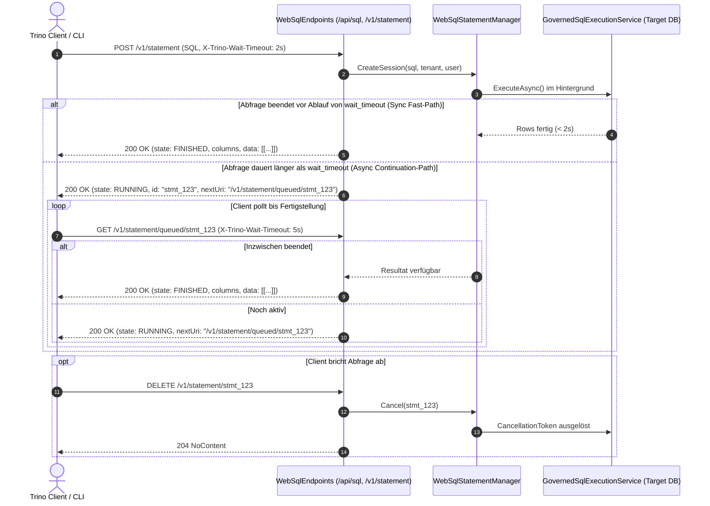
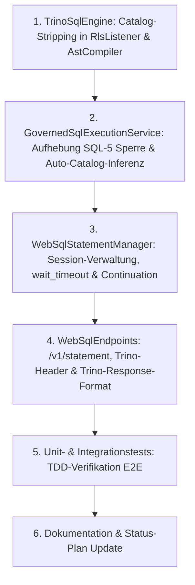

# Implementierungsplan: 100% Trino-Kompatibilität für WebSQL (inkl. wait_timeout & Continuation)

**Datum:** 08. Oktober 2026  
**Status:** In Vorbereitung / Architektur-Review  
**Verantwortlich:** C# System- & Komponenten-Architekt  
**Zugehörige Epics / Befunde:** F-DATA-02 (Governed WebSQL), SQL-5 (Befund-Review), SQ-09 (Multi-Part Table Names), Trino REST Client Protocol (`/v1/statement`)

---

## 1. Ausgangslage & Problemstellung

WebSQL (`POST /api/sql`, `/api/v1/sql`) setzt als Parser- und Analyse-Komponente bereits auf die Trino-Grammatik (`TrinoSqlEngine`). In der Trino-Welt ist die kanonische Tabellenadressierung dreiteilig aufgebaut:
```sql
SELECT * FROM <catalog>.<schema>.<table>
-- Beispiel:
SELECT id, amount FROM finance.dbo.invoices LIMIT 10
```

### Der bisherige Bruch & die Regression (SQL-5)
1. **Verbatim-Emittierung im Rewriter:**
   Bisher reichten sowohl der `LegacyTokenStream`-Rewriter (`RlsListener`) als auch erste AST-Dialect-Generatoren den Tabellenbezeichner unverändert an das Backend durch.
   - **PostgreSQL:** Lehnt Abfragen mit 3-teiligen Bezeichnern strikt mit Fehler ab:  
     `ERROR: cross-database references are not implemented: "finance.dbo.invoices"`.
   - **SQL Server:** Interpretiert den ersten Teil eines 3-teiligen Bezeichners `[database].[schema].[table]` als physischen Datenbanknamen auf der SQL-Server-Instanz.
2. **Die Pauschal-Blockade in Commit `101dcac` (Befund SQL-5):**
   Um zu verhindern, dass bei SQL Server über den Catalog-Namen versehentlich oder böswillig auf fremde Datenbanken der Instanz zugegriffen werden kann (*Cross-Database Escalation*), wurden dreiteilige Namen in `GovernedSqlExecutionService.cs` vollständig verboten:
   ```csharp
   if (!string.IsNullOrWhiteSpace(target.Catalog))
   {
       _logger?.LogWarning("WebSQL rejected table {Table}: 3-part names (catalog '{Catalog}') are not supported.", target.FullName, target.Catalog);
       throw TableDenied(target);
   }
   ```
3. **Fehlen des Trino HTTP Client Protokolls (Async/Sync Execution via `wait_timeout`):**
   Das native Trino-REST-Protokoll (`POST /v1/statement`) ist ein synchron/asynchrones Long-Polling-Modell:
   - Der Client übergibt einen `X-Trino-Wait-Timeout: <duration>` (oder URL-Parameter `wait_timeout=...`).
   - Schließt die Abfrage innerhalb dieses Fensters ab, wird das Ergebnis **synchron** in der ersten HTTP-Antwort zurückgegeben (`state: "FINISHED"`).
   - Dauert die Abfrage länger als der Timeout, antwortet der Server sofort mit HTTP 200, einer **Statement-ID** und einer `nextUri`, worüber der Client den Abfragefortschritt abfragen bzw. die nächsten Datenblöcke abrufen kann (`state: "RUNNING"`).
   - Autheris blockierte bisher synchron im Request-Thread bis zum globalen Timeout, was bei langlaufenden Queries zu HTTP-Timeouts an Proxies/Load-Balancern führte und Trino-Clients (z. B. Trino-CLI, Trino-Python, DBeaver) inkompatibel machte.

---

## 2. Architekturanalyse des C# Solution-Architekten

### 2.1 Leitplanken & Anti-Overengineering (nach `csharp-architect`)
1. **Pragmatismus & KISS:**
   - Kein komplexes Distributed-Task-Framework (kein RabbitMQ, kein Celery, kein Hangfire).
   - Stattdessen: Ein thread-sicherer In-Memory Statement-Manager (`WebSqlStatementManager`) mit `ConcurrentDictionary`, atomaren Lifecycle-Zuständen und Hintergrund-Aufräum-Timer (`PeriodicTimer`).
2. **Thread-Pool- & Speicher-Schonung:**
   - Echte asynchrone I/O ohne blockierendes `Thread.Sleep` oder synchrone Task-Blockaden (`Task.WhenAny` mit `Task.Delay` oder `TaskCompletionSource`).
   - Chunk-Streaming mit Paginierung/Cursor, um LOH-Allokationen bei großen Resultsets zu vermeiden.
3. **Sicherheits-Invariante (Zero-Trust & Tenant-Isolation):**
   - Jede Session speichert unveränderlich `TenantId` und `UserSid`.
   - Bei Fortsetzungsanfragen (`GET /api/sql/statements/{id}`) wird zwingend geprüft:
     `if (session.TenantId != callerTenant || session.UserSid != callerSid) throw Forbidden();`
     Ein Mandant kann niemals fremde Statements abfragen oder abbrechen!

### 2.2 Trino Statement Lifecycle


---

## 3. Zielbild: 100% Trino-Kompatibilität

```
┌────────────────────────────────────────────────────────┐
│ Client (Trino-CLI / DBeaver / REST / Python)           │
│ Query: SELECT * FROM finance.dbo.invoices LIMIT 10     │
│ Headers:                                               │
│   X-Trino-Catalog: finance                             │
│   X-Trino-Schema: dbo                                  │
│   X-Trino-Wait-Timeout: 5s                             │
└──────────────────────────┬─────────────────────────────┘
                           │
                           ▼
┌────────────────────────────────────────────────────────┐
│ Autheris WebSQL Endpoint (/api/sql, /v1/statement)     │
│ 1. Trino-Header & URL-Params auflösen                  │
│ 2. Catalog aus SQL extrahieren (falls Header fehlt)    │
│ 3. DataSource-Mapping: catalog == SourceName           │
│ 4. wait_timeout auswerten (Sync vs. Async)             │
└──────────────────────────┬─────────────────────────────┘
                           │
                           ▼
┌────────────────────────────────────────────────────────┐
│ Governance & Policy Engine (ReBAC, ABAC, Consents)    │
│ TableIdentifier("finance", "dbo", "invoices")         │
│ -> RLS-Zeilenfilter & Spaltenmaskierung anwenden       │
└──────────────────────────┬─────────────────────────────┘
                           │
                           ▼
┌────────────────────────────────────────────────────────┐
│ Target Dialect Rewriter (RlsListener & AstCompiler)    │
│ Catalog-Stripping für Backend-RDBMS:                   │
│ - PostgreSQL: "dbo"."invoices" (kein Cross-DB Fehler)  │
│ - SQL Server: [dbo].[invoices] (kein DB-Escape)        │
│ - SQLite:     [invoices]                               │
└──────────────────────────┬─────────────────────────────┘
                           │
                           ▼
┌────────────────────────────────────────────────────────┐
│ Physische Ziel-Datenbank (PostgreSQL / MSSQL / SQLite) │
└────────────────────────────────────────────────────────┘
```

---

## 4. Detaillierte Arbeitspakete (Work Packages)

### Arbeitspaket 1: Rewriter Catalog-Stripping (`TrinoSqlEngine`)

Ziel: Wenn ein 3-teiliger Tabellenname im AST oder Tokenstream vorliegt, entfernt der Ziel-Dialekt-Rewriter den Catalog-Präfix und emittiert nur das für das Zielsystem gültige Schema und den Tabellennamen.

1. **`SqlDialectGeneratorBase.cs` (AST-Compiler-Pipeline):**
   - Methode `FormatQualifiedName`: Für Tabellenquellen (`NamedTableSource`, DML-Ziele) wird der Catalog bei 3-teiligen Bezeichnern gestrippt.
   - Wenn `name.Parts.Count == 3`:
     - **PostgreSQL:** Emittiert `FormatIdentifier(Parts[1]) + "." + FormatIdentifier(Parts[2])` (`"schema"."table"`).
     - **SQL Server:** Emittiert `FormatIdentifier(Parts[1]) + "." + FormatIdentifier(Parts[2])` (`[schema].[table]`).
     - **SQLite:** Emittiert `FormatIdentifier(Parts[2])` bzw. `[schema].[table]`.
2. **`RlsListener.cs` (Legacy-TokenStream-Rewriter):**
   - In `BuildReplacement(...)`:
     ```csharp
     string backendTableName = StripCatalogPrefix(rawTableName);
     subquery = $"(SELECT {selectColumns} FROM {backendTableName}{targetAlias} WHERE {policyFilter})";
     ```
   - Methode `StripCatalogPrefix(string rawTableName)` schneidet das erste Segment sicher unter Berücksichtigung von Quoting ab.
3. **Tests (`TrinoSqlEngine.Tests`):**
   - `GenerateGovernedSql_ThreePartName_PostgreSql_StripsCatalog`: Prüft, dass `finance.dbo.invoices` zu `"dbo"."invoices"` wird.
   - `GenerateGovernedSql_ThreePartName_SqlServer_StripsCatalog`: Prüft, dass `finance.dbo.invoices` zu `[dbo].[orders]` wird.
   - `RewriteRls_LegacyTokenStream_ThreePartName_StripsCatalog`: Prüft das analoge Verhalten im Token-Stream-Rewriter.

---

### Arbeitspaket 2: Catalog- & DataSource-Auflösung (`GovernedSqlExecutionService`)

Ziel: Aufhebung der pauschalen Blockade und Einführung einer sauberen Catalog-Validierung.

1. **Pauschal-Blockade entfernen:**
   - Entfernen von `if (!string.IsNullOrWhiteSpace(target.Catalog)) throw TableDenied(target);` in `GovernedSqlExecutionService.cs:398-402`.
2. **Catalog $\leftrightarrow$ DataSource Validierung:**
   ```csharp
   if (!string.IsNullOrWhiteSpace(target.Catalog))
   {
       if (!string.Equals(target.Catalog, dataSourceName, StringComparison.OrdinalIgnoreCase))
       {
           _logger?.LogWarning("WebSQL rejected table {Table}: catalog '{Catalog}' does not match active data source '{DataSource}'.",
               target.FullName, target.Catalog, dataSourceName);
           throw TableDenied(target);
       }
   }
   ```
3. **Inferenz der DataSource aus dem SQL:**
   - Ist im Request (`request.DataSourceName`) keine Datenquelle angegeben, extrahiert Autheris die Datenquelle aus der ersten referenzierten Tabelle mit `Catalog != null`.
   - Bei mehreren Tabellen: Sicherstellen, dass alle Tabellen denselben `Catalog` nutzen:
     ```csharp
     var distinctCatalogs = metadata.ReferencedTables
         .Where(t => !string.IsNullOrWhiteSpace(t.Catalog))
         .Select(t => t.Catalog!)
         .Distinct(StringComparer.OrdinalIgnoreCase)
         .ToList();
     
     if (distinctCatalogs.Count > 1)
     {
         throw new WebSqlPolicyException("Cross-catalog queries across multiple data sources are not supported in WebSQL.");
     }
     ```
4. **Default-Schema-Handling:**
   - Unterstützung für 1-teilige Tabellennamen mit konfigurierbarem oder übergebenem `defaultSchema` (Default: PostgreSQL `public`, MSSQL `dbo`, SQLite `main`).

---

### Arbeitspaket 3: Trino Statement Manager & Continuation API (`IWebSqlStatementManager`)

Ziel: Verwaltung langlebiger Abfragen, Timeout-Handling und Wiederaufnahme über Statement-IDs.

1. **Schnittstelle & Modell (`Autheris.Application.Sql.Interfaces`):**
   ```csharp
   public sealed record StatementExecutionStatus(
       string StatementId,
       string State, // "QUEUED", "RUNNING", "FINISHED", "FAILED", "CANCELED"
       IReadOnlyList<string>? Columns,
       IReadOnlyList<IReadOnlyList<object?>>? Data,
       string? NextUri,
       string? ErrorMessage,
       DateTimeOffset CreatedAt,
       TimeSpan ElapsedTime);

   public interface IWebSqlStatementManager
   {
       Task<StatementExecutionStatus> SubmitOrWaitAsync(
           GovernedSqlQueryRequest request,
           ClaimsPrincipal user,
           TenantId tenantId,
           TimeSpan waitTimeout,
           CancellationToken ct = default);

       Task<StatementExecutionStatus> GetStatusOrWaitAsync(
           string statementId,
           ClaimsPrincipal user,
           TenantId tenantId,
           TimeSpan waitTimeout,
           CancellationToken ct = default);

       Task<bool> CancelStatementAsync(
           string statementId,
           ClaimsPrincipal user,
           TenantId tenantId,
           CancellationToken ct = default);
   }
   ```
2. **Implementierung (`WebSqlStatementManager.cs`):**
   - Hält `ConcurrentDictionary<string, StatementSession>`.
   - `StatementSession` kapselt `CancellationTokenSource`, `TaskCompletionSource`, Tenant- & User-Claims, Puffer.
   - Paging / Chunking: Daten können schrittweise abgeholt werden, falls das Resultset groß ist.
   - Automatisches Aufräumen abgelaufener Sessions nach z. B. 15 Minuten Inaktivität über `IHostedService` bzw. `PeriodicTimer`.
3. **Mandanten- & Benutzer-Sicherheit:**
   - Fortsetzung über `statementId` schlägt sofort mit `403 Forbidden` fehl, wenn Tenant oder User-SID nicht mit dem Ersteller übereinstimmen.

---

### Arbeitspaket 4: Trino HTTP-Routen & Header (`WebSqlEndpoints`)

Ziel: Volle Unterstützung des nativen Trino REST Client-Protokolls.

1. **Routen-Mapping:**
   - `POST /api/sql`, `POST /api/v1/sql` und `POST /v1/statement` (kanonische Trino-Route)
   - `GET /api/sql/statements/{id}` und `GET /v1/statement/queued/{id}` (Trino Continuation)
   - `DELETE /api/sql/statements/{id}` und `DELETE /v1/statement/{id}` (Trino Cancel)
2. **Trino-Header Support:**
   - `X-Trino-Wait-Timeout`: z. B. `5s`, `5000ms`, `500ms` $\rightarrow$ parsed zu `TimeSpan`.
   - `X-Trino-Catalog`: Datenquellen-Auswahl.
   - `X-Trino-Schema`: Standard-Schema.
   - `X-Trino-User`: Identität im Test-Modus.
   - `X-Trino-Source`: Client-Auditierung (`trino-cli`, `dbeaver`).
3. **Trino Response Schema:**
   - HTTP 200 OK mit Trino-kompatibler Struktur:
     ```json
     {
       "id": "stmt_20261008_abc123",
       "infoUri": "/ui/query.html?stmt_20261008_abc123",
       "nextUri": "/v1/statement/queued/stmt_20261008_abc123",
       "stats": {
         "state": "FINISHED",
         "elapsedTimeMillis": 45
       },
       "columns": [
         { "name": "id", "type": "integer" },
         { "name": "amount", "type": "decimal" }
       ],
       "data": [
         [1, 100.50],
         [2, 200.75]
       ]
     }
     ```

---

### Arbeitspaket 5: Test-Driven Development (TDD) & Verifikation

1. **Unit-Tests (`TrinoSqlEngine.Tests`):**
   - Catalog-Stripping für 3-teilige Namen bei PostgreSQL, MSSQL, SQLite.
2. **Unit-Tests (`Autheris.Tests.Unit`):**
   - `WebSql_WaitTimeout_FastQuery_CompletesSynchronouslyWithStateFinished`
   - `WebSql_WaitTimeout_LongRunningQuery_ReturnsRunningWithNextUriAndId`
   - `WebSql_ContinuationViaId_CompletesSuccessfully`
   - `WebSql_ContinuationViaId_WrongTenantOrUser_ThrowsForbidden`
   - `WebSql_CancelStatement_CancelsUnderlyingQuery`
3. **Integrationstests (`Autheris.Tests.Integration`):**
   - E2E-Abfrage gegen SQLite mit `X-Trino-Wait-Timeout: 10s` und 3-teiligem Namen `default.main.invoices`.
   - Simulation eines Timeouts mit `X-Trino-Wait-Timeout: 1ms` $\rightarrow$ Status `RUNNING` $\rightarrow$ Abruf über `nextUri` $\rightarrow$ Status `FINISHED`.

---

## 5. Meilensteine & Umsetzungsreihenfolge



1. **Schritt 1:** Catalog-Stripping in `RlsListener.cs` und `SqlDialectGeneratorBase.cs` + Tests.
2. **Schritt 2:** `GovernedSqlExecutionService.cs`: Aufhebung der Blockade, Catalog-Abgleich gegen DataSource.
3. **Schritt 3:** `WebSqlStatementManager.cs`: Implementierung des Statement-Managers mit `wait_timeout` und Session-Speicher.
4. **Schritt 4:** `WebSqlEndpoints.cs`: Trino-Header (`X-Trino-Wait-Timeout`, `X-Trino-Catalog`), Continuation-Routen (`/v1/statement/queued/{id}`) und Trino-Response-JSON.
5. **Schritt 5:** Integrationstests ausführen und verifizieren.
6. **Schritt 6:** Statusplan und Dokumentation nachziehen.
