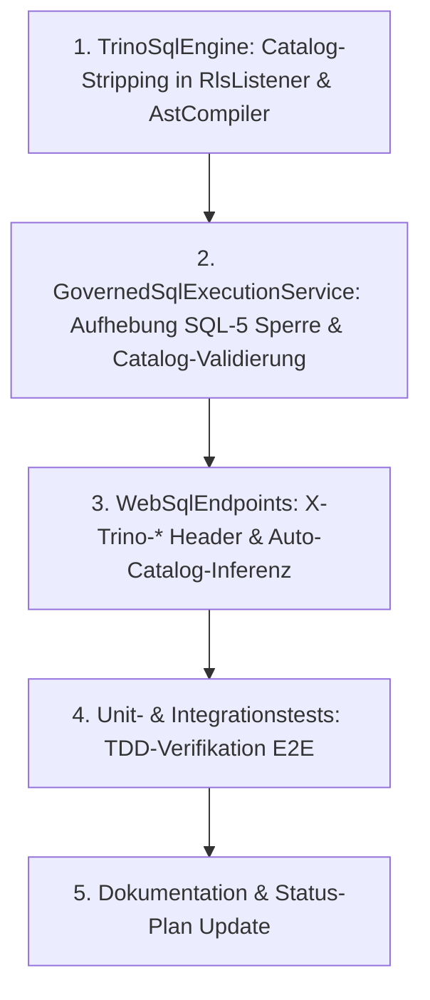

# Implementierungsplan: 100% Trino-Kompatibilität für WebSQL

**Datum:** 08. Oktober 2026  
**Status:** In Vorbereitung  
**Verantwortlich:** C# System- & Komponenten-Architekt  
**Zugehörige Epics / Befunde:** F-DATA-02 (Governed WebSQL), SQL-5 (Befund-Review), SQ-09 (Multi-Part Table Names)

---

## 1. Ausgangslage & Problemstellung

WebSQL (`POST /api/sql`, `/api/v1/sql`) setzt als Parser- und Analyse-Komponente bereits auf die Trino-Grammatik (`TrinoSqlEngine`). In der Trino-Welt ist die kanonische Tabellenadressierung dreiteilig aufgebaut:
```sql
SELECT * FROM <catalog>.<schema>.<table>
-- Beispiel:
SELECT id, amount FROM finance.dbo.invoices LIMIT 10
```

### Der bisherige Bruch & die Regression (SQL-5)
1. **Verbatim-Emittierung im Rewriter:**
   Bisher reichten sowohl der `LegacyTokenStream`-Rewriter (`RlsListener`) als auch erste AST-Dialect-Generatoren den Tabellenbezeichner unverändert an das Backend durch.
   - **PostgreSQL:** Lehnt Abfragen mit 3-teiligen Bezeichnern strikt mit Fehler ab:  
     `ERROR: cross-database references are not implemented: "finance.dbo.invoices"`.
   - **SQL Server:** Interpretiert den ersten Teil eines 3-teiligen Bezeichners `[database].[schema].[table]` als physischen Datenbanknamen auf der SQL-Server-Instanz.
2. **Die Pauschal-Blockade in Commit `101dcac` (Befund SQL-5):**
   Um zu verhindern, dass bei SQL Server über den Catalog-Namen versehentlich oder böswillig auf fremde Datenbanken der Instanz zugegriffen werden kann (*Cross-Database Escalation*), wurden dreiteilige Namen in `GovernedSqlExecutionService.cs` vollständig verboten:
   ```csharp
   if (!string.IsNullOrWhiteSpace(target.Catalog))
   {
       _logger?.LogWarning("WebSQL rejected table {Table}: 3-part names (catalog '{Catalog}') are not supported.", target.FullName, target.Catalog);
       throw TableDenied(target);
   }
   ```
3. **Folge:**
   Standardabfragen aus Trino-Tools (Trino-CLI, DBeaver, Trino-Python-Client, BI-Konnektoren) scheitern an Autheris mit `403 Access Denied`. Auch Dokumentation und OpenAPI-Beispiele in `WebSqlEndpoints.cs` stehen im Widerspruch zu dieser Blockade.

---

## 2. Zielbild: 100% Trino-Kompatibilität

Autheris soll Anfragen und Abfragen so annehmen, wie es ein nativer Trino-Server tun würde:

```
┌────────────────────────────────────────────────────────┐
│ Client (Trino-CLI / DBeaver / REST / Python)           │
│ Query: SELECT * FROM finance.dbo.invoices LIMIT 10     │
│ Headers: X-Trino-Catalog: finance, X-Trino-Schema: dbo │
└──────────────────────────┬─────────────────────────────┘
                           │
                           ▼
┌────────────────────────────────────────────────────────┐
│ Autheris WebSQL Endpoint (/api/sql, /api/v1/sql)       │
│ 1. Trino-Header & URL-Params auflösen                  │
│ 2. Catalog aus SQL extrahieren (falls Header fehlt)    │
│ 3. DataSource-Mapping: catalog == SourceName           │
└──────────────────────────┬─────────────────────────────┘
                           │
                           ▼
┌────────────────────────────────────────────────────────┐
│ Governance & Policy Engine (ReBAC, ABAC, Consents)    │
│ TableIdentifier("finance", "dbo", "invoices")         │
│ -> RLS-Zeilenfilter & Spaltenmaskierung anwenden       │
└──────────────────────────┬─────────────────────────────┘
                           │
                           ▼
┌────────────────────────────────────────────────────────┐
│ Target Dialect Rewriter (RlsListener & AstCompiler)    │
│ Catalog-Stripping für Backend-RDBMS:                   │
│ - PostgreSQL: "dbo"."invoices" (kein Cross-DB Fehler)  │
│ - SQL Server: [dbo].[invoices] (kein DB-Escape)        │
│ - SQLite:     [invoices]                               │
└──────────────────────────┬─────────────────────────────┘
                           │
                           ▼
┌────────────────────────────────────────────────────────┐
│ Physische Ziel-Datenbank (PostgreSQL / MSSQL / SQLite) │
└────────────────────────────────────────────────────────┘
```

### Kernprinzipien
1. **Catalog = Autheris DataSource:** Der Trino-`catalog` entspricht exakt der logischen `SourceName` im Autheris-Metadatenkatalog (`TableMetadata.Table.SourceName`).
2. **Sicheres Catalog-Stripping:** Der `catalog`-Teil wird für Authentifizierung, Autorisierung und Governance genutzt, wird aber **niemals** an das Ziel-RDBMS gesendet. Dadurch ist Befund SQL-5 architektonisch dauerhaft gelöst.
3. **Flexible Adressierung:** Zulässig sind 3-teilig (`catalog.schema.table`), 2-teilig (`schema.table` mit Default-Catalog) und 1-teilig (`table` mit Default-Catalog & Default-Schema).
4. **Federation-Boundary:** Alle in einer einzelnen SQL-Anweisung referenzierten Tabellen müssen demselben Catalog angehören. Werden Tabellen aus unterschiedlichen Catalogs in einer Query referenziert, weist Autheris dies mit einer verständlichen Fehlermeldung ab (`Cross-catalog joins across distinct data sources are not supported in a single query`).

---

## 3. Detaillierte Arbeitspakete (Work Packages)

### Arbeitspaket 1: Rewriter Catalog-Stripping (`TrinoSqlEngine`)

Ziel: Wenn ein 3-teiliger Tabellenname im AST oder Tokenstream vorliegt, entfernt der Ziel-Dialekt-Rewriter den Catalog-Präfix und emittiert nur das für das Zielsystem gültige Schema und den Tabellennamen.

1. **`SqlDialectGeneratorBase.cs` (AST-Compiler-Pipeline):**
   - Methode `FormatQualifiedName`: Für Tabellenquellen (`NamedTableSource`, DML-Ziele) wird ein Modus `stripCatalog: true` ergänzt.
   - Wenn `name.Parts.Count == 3`:
     - **PostgreSQL:** Emittiert `FormatIdentifier(Parts[1]) + "." + FormatIdentifier(Parts[2])` (`"schema"."table"`).
     - **SQL Server:** Emittiert `FormatIdentifier(Parts[1]) + "." + FormatIdentifier(Parts[2])` (`[schema].[table]`).
     - **SQLite:** Emittiert `FormatIdentifier(Parts[2])` bzw. `[schema].[table]`.
2. **`RlsListener.cs` (Legacy-TokenStream-Rewriter):**
   - In `BuildReplacement(...)`:
     ```csharp
     // Wenn rawTableName dreiteilig ist (z. B. "finance.dbo.invoices" oder "\"finance\".\"dbo\".\"invoices\""):
     string backendTableName = StripCatalogPrefix(rawTableName);
     subquery = $"(SELECT {selectColumns} FROM {backendTableName}{targetAlias} WHERE {policyFilter})";
     ```
   - Methode `StripCatalogPrefix(string rawTableName)` schneidet das erste Segment sicher unter Berücksichtigung von Quoting ab.
3. **Tests (`TrinoSqlEngine.Tests`):**
   - `GenerateGovernedSql_ThreePartName_PostgreSql_StripsCatalog`: Prüft, dass `finance.dbo.invoices` zu `"dbo"."invoices"` wird.
   - `GenerateGovernedSql_ThreePartName_SqlServer_StripsCatalog`: Prüft, dass `finance.dbo.invoices` zu `[dbo].[orders]` wird.
   - `RewriteRls_LegacyTokenStream_ThreePartName_StripsCatalog`: Prüft das analoge Verhalten im Token-Stream-Rewriter.

---

### Arbeitspaket 2: Catalog- & DataSource-Auflösung (`GovernedSqlExecutionService`)

Ziel: Aufhebung der pauschalen Blockade und Einführung einer sauberen Catalog-Validierung.

1. **Pauschal-Blockade entfernen:**
   - Entfernen von `if (!string.IsNullOrWhiteSpace(target.Catalog)) throw TableDenied(target);` in `GovernedSqlExecutionService.cs:398-402`.
2. **Catalog $\leftrightarrow$ DataSource Validierung:**
   ```csharp
   // Wenn ein Catalog im SQL angegeben ist:
   if (!string.IsNullOrWhiteSpace(target.Catalog))
   {
       // Der Catalog muss der für diese Abfrage autorisierten DataSource entsprechen
       if (!string.Equals(target.Catalog, dataSourceName, StringComparison.OrdinalIgnoreCase))
       {
           _logger?.LogWarning("WebSQL rejected table {Table}: catalog '{Catalog}' does not match active data source '{DataSource}'.",
               target.FullName, target.Catalog, dataSourceName);
           throw TableDenied(target);
       }
   }
   ```
3. **Inferenz der DataSource aus dem SQL:**
   - Ist im Request (`request.DataSourceName`) keine Datenquelle angegeben, extrahiert Autheris die Datenquelle aus der ersten referenzierten Tabelle mit `Catalog != null`.
   - Bei mehreren Tabellen: Sicherstellen, dass alle Tabellen denselben `Catalog` nutzen:
     ```csharp
     var distinctCatalogs = metadata.ReferencedTables
         .Where(t => !string.IsNullOrWhiteSpace(t.Catalog))
         .Select(t => t.Catalog!)
         .Distinct(StringComparer.OrdinalIgnoreCase)
         .ToList();
     
     if (distinctCatalogs.Count > 1)
     {
         throw new WebSqlPolicyException("Cross-catalog queries across multiple data sources are not supported in WebSQL.");
     }
     ```
4. **Default-Schema-Handling:**
   - Unterstützung für 1-teilige Tabellennamen mit konfigurierbarem oder übergebenem `defaultSchema` (Default: PostgreSQL `public`, MSSQL `dbo`, SQLite `main`).

---

### Arbeitspaket 3: Trino HTTP-Protokoll & Header (`WebSqlEndpoints`)

Ziel: Unterstützung von Trino-spezifischen Headern und Parametern am WebSQL-Endpoint.

1. **Header-Unterstützung in `WebSqlEndpoints.cs`:**
   - `X-Trino-Catalog`: Wird als `dataSource` interpretiert, falls im Body/Query nicht explizit gesetzt.
   - `X-Trino-Schema`: Wird als `defaultSchema` an die Query-Pipeline übergeben.
   - `X-Trino-User`: Dient als Fallback für die Benutzer-Identität in Entwicklungsumgebungen / TestAuth.
   - `X-Trino-Source`: Wird in den Audit-Log-Metadaten als Client-Identifier (`source: "trino-cli"`, `"dbeaver"`, etc.) festgehalten.
2. **Query-Parameter Ergänzung:**
   - Neben Body-JSON auch Auswertung von URL-Parametern:
     - `?dataSource=...` oder `?catalog=...`
     - `?schema=...`
3. **Content-Type Ergänzung:**
   - Unterstützung von rohen SQL-Bodys (`text/plain`, `application/sql`) in Kombination mit `X-Trino-*` Headern.
4. **Aktualisierung der OpenAPI-Dokumentation:**
   - Korrektur der API-Beschreibungen in `WebSqlEndpoints.cs`, Bereinigung widersprüchlicher Docstrings.

---

### Arbeitspaket 4: Test-Driven Development (TDD) & Verifikation

1. **Unit-Tests (`Autheris.Tests.Unit`):**
   - `WebSql_ThreePartTable_ResolvesCorrectDataSourceAndSucceeds`
   - `WebSql_ThreePartTable_DifferentCatalogs_RejectsWithClearError`
   - `WebSql_TrinoHeader_CatalogAndSchema_AppliedCorrectly`
   - `WebSql_CatalogStrippedInRewrittenSql_DoesNotLeakToBackend`
2. **Integrationstests (`Autheris.Tests.Integration`):**
   - E2E-Abfrage gegen SQLite: `SELECT * FROM default.main.invoices LIMIT 5`.
   - E2E-Abfrage mit `X-Trino-Catalog: finance` und 2-teiligem Namen `dbo.invoices`.
   - E2E-Abfrage mit Spaltenmaskierung (z. B. E-Mail maskiert) über 3-teiligen Namen `finance.dbo.invoices`.
   - Verifikation des Audit-Logs: `AccessedTables` enthält die korrekte `TableIdentifier("finance", "dbo", "invoices")`.

---

## 4. Sicherheits- & Architekturbewertung

| Kriterium | Bewertung & Schutzmaßnahme |
|---|---|
| **SQL-5 Schutz (Cross-Database Escalation)** | **Vollständig gewährleistet:** Da der Catalog-Teil vor dem Senden an das Ziel-RDBMS gestrippt wird, kann kein SQL Server jemals den Catalog als DB-Präfix fehlinterpretieren. |
| **Cross-Tenant Isolation** | **Unverändert strikt:** Der Tenant-Filter (RLS) wird wie bisher auf die normalisierte Tabelle angewendet. |
| **Catalog Enumeration Protection** | **Gewährleistet:** Unbekannte Catalogs oder nicht freigegebene Tabellen werfen weiterhin ein neutrales `TableDenied` / `403`. |
| **Zero-Trust Consents** | **Vollständig aktiv:** Die `TableIdentifier(catalog, schema, table)` wird gegen den Consent- und Casbin-PDP geprüft. |

---

## 5. Meilensteine & Umsetzungsreihenfolge



1. **Schritt 1:** Catalog-Stripping in `RlsListener.cs` und `SqlDialectGeneratorBase.cs` implementieren + Unit Tests.
2. **Schritt 2:** `GovernedSqlExecutionService.cs`: Aufhebung der Blockade, Catalog-Abgleich gegen DataSource.
3. **Schritt 3:** `WebSqlEndpoints.cs`: Trino-Header (`X-Trino-Catalog`, `X-Trino-Schema`, `X-Trino-User`, `X-Trino-Source`) und Auto-Catalog-Auflösung.
4. **Schritt 4:** Integrationstests gegen SQLite / Postgres ausführen und verifizieren.
5. **Schritt 5:** Statusplan und Dokumentation nachziehen.
