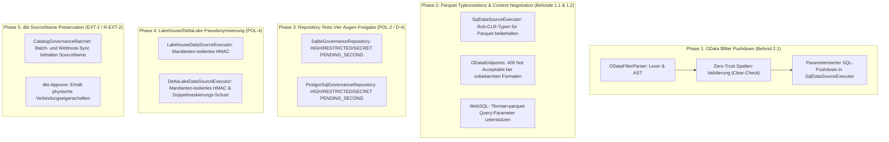

# Architektonischer Umsetzungsplan: Priorität 2 – OData & API-Conformance (Mittel)

**Dokument-ID:** `PLAN-ODATA-API-CONFORMANCE-2026-10-08`  
**Datum:** 2026-10-08  
**Autor:** Solution Architect (`csharp-architect`)  
**Status:** Genehmigungsreif / Bereit für TDD-Umsetzung  
**Scope:** Vollständige Spezifikation und Umsetzungsleitfaden für alle Themen der Priorität 2 (OData `$filter`, Parquet-Typkonsistenz, Content Negotiation, Governance-Repository Vier-Augen, Lakehouse/DeltaLake Pseudonymisierung, dbt SourceName Preservation).

---

## 1. Architektonische Leitplanken & Anti-Overengineering (nach `csharp-architect`)

1. **YAGNI & Pragmatismus (KISS):**
   - Kein Einsatz schwergewichtiger OData-Frameworks (z. B. `Microsoft.AspNetCore.OData`), die das gesamte Routing und DI-Modell überladen.
   - Unser bestehender leichtgewichtiger Minimal-API-Handler (`ODataEndpoints` + `ODataHandler`) bleibt die Kernarchitektur.
   - `$filter` wird durch einen fokussierten, zustandslosen Lexer/Parser zerlegt, der nur die in Enterprise-Clients (Power Query, Excel, Tableau) gebräuchlichen OData-Filterkonstrukte unterstützt (`eq`, `ne`, `gt`, `ge`, `lt`, `le`, `and`, `or`, `not`, String-Literale, Zahlen, Datums- und Null-Werte).
2. **Fail-Closed & Zero-Trust Sicherheit:**
   - Filterung auf Spalten mit Zugriffsstufe `Deny` oder `Mask` (bzw. katalog-sensiblen Spalten ohne expliziten Clear-Consent) wird **vor** der Datenbankausführung abgewiesen (HTTP 403 Forbidden).
   - Alle Filter-Werte werden ausschließlich als parametrisierte SQL-Variablen (`@p_odata_filter_N`) gebunden (100% SQL-Injection-Schutz).
3. **I/O- und Type-System-Konsistenz:**
   - Datums- und Zeitspalten müssen in Parquet-Exporten als echte typisierte Arrow-/Parquet-Timestamp-Felder erhalten bleiben statt als String.
   - Strikte HTTP-Content-Negotiation (HTTP 406 Not Acceptable bei nicht unterstützten `Accept`-Headern).

---

## 2. Detaillierte Phasenarchitektur

---

## 3. Phasenspezifikation

### Phase 1: OData `$filter` Pushdown (Befund 2.1)
- **Problem:**
  Power Query schiebt Filter per Query Folding als `$filter` an Autheris und erhält derzeit HTTP 501 NotImplemented.
- **Architektonischer Entwurf:**
  1. `ODataFilterParser`:
     - Implementierung eines leichtgewichtigen Recursive-Descent-Parsers in `Autheris.Extensions.OData`:
       - Operatoren: `eq`, `ne`, `gt`, `ge`, `lt`, `le`, `and`, `or`, `not`
       - Literale: Strings (`'...'`), Zahlen (Integer, Decimal/Float), Booleans (`true`, `false`), `null`, ISO-8601 Datumsangaben (`2026-10-08T...`)
     - Erzeugt einen zustandslosen `ODataFilterExpression`-Baum.
  2. Zero-Trust Spaltenvalidierung:
     - Prüfung aller referenzierten Spalten gegen `AccessDecision.GetEffectiveColumnAccess(col, metadata) == ColumnAccessLevel.Clear`.
     - Bei Verstoß: Sofortiger Abbruch mit HTTP 403 Forbidden (`ACCESS_DENIED`, „Filtering on column '{col}' is not permitted“).
  3. SQL Dialekt-Pushdown:
     - Generierung von dialektspezifischem SQL (`PostgreSql`, `SqlServer`, `Sqlite`, `Oracle`).
     - Bindung aller Konstanten als SQL-Parameter (`@p_od_0`, `@p_od_1`).
  4. Integration in `TableQueryExecutionRequest` und `SqlDataSourceExecutor.cs`.

### Phase 2: Parquet-Export Typverlust & Content Negotiation (Befunde 1.1 & 1.2)
- **Problem:**
  1. OData serialisiert Datums- und Zeitspalten in `SqlDataSourceExecutor.FormatValue` zu Strings (`dto.UtcDateTime.ToString("O")`), wodurch der Parquet-Export diese Spalten als `string` statt als `timestamp` ausgibt.
  2. Unbekannte `Accept`-Header (z.B. CSV, NDJSON) werden bei OData still ignoriert und mit JSON beantwortet; WebSQL ignoriert `?format=parquet`.
- **Architektonischer Entwurf:**
  1. In `ParquetExportService`: Wenn ein String im ISO-8601-Format für eine Tabellenspalte vorliegt, die im Katalog als `TIMESTAMP`, `DATETIME` oder `DATE` definiert ist, wird der Wert typisiert in das Arrow-Timestamp-Array serialisiert (bzw. Bereitstellung der unformatierten CLR-Objekte über den `DataSourceExecutionContext`).
  2. In `ODataEndpoints`:
     - Explizite Auswertung des `Accept`-Headers: Erlaubt sind `application/json`, `application/json;odata.metadata=...`, `*/*`, und `application/vnd.apache.parquet`.
     - Bei unverständlichen Headern wie `Accept: text/csv` oder `application/x-ndjson`: Rückgabe von HTTP 406 Not Acceptable.
  3. In `WebSqlEndpoints`:
     - Auswertung von `context.Request.Query["format"] == "parquet"` äquivalent zu `Accept: application/vnd.apache.parquet`.

### Phase 3: Repository-Tests für Vier-Augen-Freigabe (POL-2 / D-4)
- **Problem:**
  Fehlende automatisierte Repository-Tests für `SqliteGovernanceRepository` und `PostgreSqlGovernanceRepository`, die sicherstellen, dass bei `requires_four_eyes = false` die Einstufungen `HIGH`, `RESTRICTED` und `SECRET` nach dem ersten Genehmigungsschritt im Status `PENDING_SECOND_APPROVAL` verharren.
- **Architektonischer Entwurf:**
  - Dedizierte Integrationstests in `Autheris.Tests.Unit/Governance/` für beide Repositories.
  - Prüffälle: Sensitivitäts-Einstufungen in Groß-, Klein- und Mixed-Case (`HIGH`, `high`, `Restricted`, `SECRET`).

### Phase 4: Lakehouse- & DeltaLake-Mandanten-Pseudonymisierung (POL-4)
- **Problem:**
  Lakehouse- und DeltaLake-Datenquellen dürfen keine statischen oder globalen Pseudonyme ausgeben, sondern müssen dieselben mandantenspezifischen HMAC-Regeln wie WebSQL anwenden.
- **Architektonischer Entwurf:**
  - Verifikationstests in `LakehouseDataSourceExecutorTests` und `DeltaLakeDataSourceExecutorTests`.
  - Sicherstellen, dass derselbe Klartextwert für Mandant A und Mandant B deterministisch unterschiedliche Pseudonyme liefert.
  - Sicherstellen, dass keine Doppelmaskierung auf bereits pseudonymisierten Feldern erfolgt.

### Phase 5: dbt-Approve & Webhook SourceName Preservation (EXT-2 / R-EXT-2)
- **Problem:**
  Bei externen Syncs (dbt, DataHub, Webhook) darf ein bestehendes Tabellen-Metadata-Objekt nicht auf eine andere physische Verbindung (`SourceName`) umgebogen werden.
- **Architektonischer Entwurf:**
  - `CatalogGovernanceRatchet`: Erweiterung der Tests auf Batch- und Webhook-Syncs.
  - Verifikation: Bestehende `SourceName` bleibt unveränderlich erhalten; dbt-Approve behält alle physischen Verbindungsparameter.

---

## 4. Schritt-für-Schritt TDD-Implementierungsreihenfolge

1. **Schritt 1 (TDD Red):** Erstellung von `ODataFilterParserTests.cs` mit Testfällen für Syntax, Operatoren und Parsing-Fehler.
2. **Schritt 2 (Green):** Implementierung des zustandslosen `ODataFilterParser` in `Autheris.Extensions.OData`.
3. **Schritt 3 (TDD Red):** Erstellung von `ODataFilterPushdownTests.cs` mit Testfällen für Zero-Trust-Ablehnung (`Deny`/`Mask`) und korrekte SQL-Parameter-Generierung.
4. **Schritt 4 (Green):** Anbindung in `ODataEndpoints.cs`, `ODataHandler.cs` und `SqlDataSourceExecutor.cs`.
5. **Schritt 5 (TDD Red & Green):** Content-Negotiation-Tests (406 bei CSV/NDJSON in OData, `?format=parquet` in WebSQL).
6. **Schritt 6 (TDD Red & Green):** Parquet-Datums-Typisierung in `ParquetExportServiceTests.cs`.
7. **Schritt 7 (TDD Red & Green):** POL-2/D-4 Repository-Tests für Vier-Augen-Freigabe.
8. **Schritt 8 (TDD Red & Green):** POL-4 Lakehouse/DeltaLake Pseudonymisierungs-Tests.
9. **Schritt 9 (TDD Red & Green):** EXT-2 dbt SourceName Preservation Tests.
10. **Schritt 10 (Abnahme):** Vollständiger Testlauf (`dotnet test Autheris.sln -c Release`).
