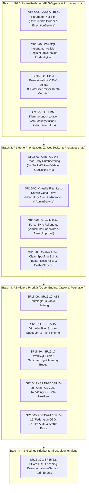

# Detaillierter Architektonischer Umsetzungsplan: Security-Review (15h)

**Dokument-ID:** `PLAN-SR15-2026-10-08`  
**Datum:** 2026-10-08  
**Autor:** Solution Architect / Principal Security & Systems Architect  
**Status:** Genehmigt zur schrittweisen Umsetzung (TDD)  
**Referenzdokument:** [`docs/plans/2026-10-08-security-review-letzte-15h.md`](file:///root/autheris/docs/plans/2026-10-08-security-review-letzte-15h.md)  
**Integritätsanforderung:** `<TreatWarningsAsErrors>true</TreatWarningsAsErrors>`, Clean Architecture, Zero-Trust (Fail-Closed), Zero Regressions über die bestehenden 5.290 Tests.

---

## 1. Übersicht & Phasen-Matrix

Die 52 Befunde (`SR15-01` bis `SR15-52`) werden in vier disjunkte, risikobasierte Phasen gegliedert. Jede Phase folgt dem Zyklus: **Architect-Plan $\to$ TDD-Umsetzung $\to$ Code-Review & Verifikation**.

---

## 2. Detaillierter Plan Batch 1 (P0 Sofortmaßnahmen)

### 2.1 SR15-01: WebSQL Client-Parameter überschreiben Row-Filter-Parameter
* **Architektonisches Ziel:**
  Vollständiges Unterbinden von RLS-Parameter-Injektionen oder -Manipulationen (`@p_rls_0`) durch Client-Parameter.
* **Root Cause:**
  `RowFilterSqlBuilder.cs` erzeugte Parameter im Format `@p_rls_{paramIndex++}`, während `GovernedSqlExecutionService.cs` Client-Parameter nur gegen das Präfix `__gql_` blockierte. In SQLite überschrieb der Client-Wert den internen RLS-Wert; in PostgreSQL/SQL Server traten Fehler oder Orakel-Lecks auf.
* **Design & Invarianten:**
  1. *Internes Präfix:* Alle durch `RowFilterSqlBuilder` generierten internen Parameter erhalten das kanonische Präfix `__gql_rls_` (oder binden direkt an `InternalParameterPrefix`).
  2. *Defensive Client-Validierung:* In `GovernedSqlExecutionService.ExecuteQueryCoreAsync` werden alle Client-Parameter abgewiesen, die:
     - mit `__gql_` beginnen, ODER
     - mit `p_rls_` beginnen, ODER
     - mit einem bereits im `GovernedRewrite.Parameters` existierenden Parameter kollidieren.
* **Betroffene Dateien:**
  - `src/Autheris.Application/Services/RowFilterSqlBuilder.cs`
  - `src/Autheris.Application/Sql/Services/GovernedSqlExecutionService.cs`
  - `tests/Autheris.Tests.Unit/Sql/GovernedSqlExecutionParameterSecurityTests.cs` (Neu)
* **TDD-Spezifikation:**
  - `Client_Parameter_With_Rls_Prefix_Throws_WebSqlPolicyException`
  - `Client_Parameter_Matching_Internal_Rewrite_Parameter_Throws_WebSqlPolicyException`
  - `Consent_RowFilter_Parameters_Are_Bound_With_Internal_Prefix`

---

### 2.2 SR15-02: WebSQL Kurzname-Kollision hebelt RLS und Masking aus
* **Architektonisches Ziel:**
  Garantie, dass Tabellen mit identischem Kurznamen aus unterschiedlichen Schemas (z. B. `public.orders` und `archive.orders`) in Multi-Table-Queries niemals die RLS-Filter oder Maskierungsregeln der jeweils anderen Tabelle überschreiben oder aushebeln.
* **Root Cause:**
  `RegisterTableLookup` und `RegisterTableSet` registrierten unkonditioniert `target.TableName` im Lookup-Dictionary. Wenn die zweite Tabelle kein RLS besaß, wurde `orders` in `tablesWithoutRls` eingetragen und überschrieb die Schutzmaßnahmen von `public.orders`.
* **Design & Invarianten:**
  1. *Eindeutigkeitsprüfung vor Registrierung:* Unqualifizierte Kurznamen (`target.TableName`) und zweistufige Namen (`target.Schema.target.TableName`) werden **nur dann** im Lookup registriert, wenn dieser Kurzname innerhalb aller referenzierten Tabellen der aktuellen Query (`metadata.ReferencedTables`) **genau einmal** vorkommt.
  2. *Fail-Closed:* Treten zwei Tabellen mit demselben `TableName` auf, müssen alle Lookups über den vollqualifizierten Namen (`target.FullName` / `resolvedId.ToQualifiedName()`) erfolgen. Unqualifizierte Referenzen auf kollidierende Tabellen werden zur Compile-Zeit abgewiesen.
* **Betroffene Dateien:**
  - `src/Autheris.Application/Sql/Services/GovernedSqlExecutionService.cs`
  - `tests/Autheris.Tests.Unit/Sql/GovernedSqlExecutionMultiSchemaShortNameTests.cs` (Neu)
* **TDD-Spezifikation:**
  - `MultiSchema_Query_With_Same_TableName_Does_Not_Overwrite_Rls_Or_Masking`
  - `Table_With_Rls_Joined_With_Table_Without_Rls_Preserves_Rls_On_Protected_Table`

---

### 2.3 SR15-04: OData Rekursiver DoS-Schutz (Anti-StackOverflow)
* **Architektonisches Ziel:**
  Schutz des Gateway-Prozesses gegen unbegrenzte Rekursion in `$filter`-Ausdrücken (`((((...8000x...))))` oder `tolower(tolower(...))`).
* **Root Cause:**
  `ODataFilterParser.cs` besaß keinen Tiefenzähler im rekursiven Abstieg. Ein 8 KB großer Request mit tief verschachtelten Klammern löste eine unaufhaltbare `StackOverflowException` aus.
* **Design & Invarianten:**
  1. *Längenlimit:* Der Roh-Filter-String darf maximal 4.096 Zeichen umfassen.
  2. *Rekursionslimit:* Im Parser wird ein `_depth`-Zähler geführt. Überschreitet `_depth` das Limit von `MaxDepth = 32`, bricht der Parser sofort mit `GatewayInvalidQueryException("OData $filter expression exceeds maximum recursion depth of 32.")` ab (HTTP 400).
  3. *AST-Walker-Schutz:* Die Methoden `ToSql()` und `CollectReferencedColumns()` im generierten AST prüfen ebenfalls die Maximaltiefe.
* **Betroffene Dateien:**
  - `src/Autheris.Extensions/OData/ODataFilterParser.cs`
  - `tests/Autheris.Extensions.Tests/ODataFilterParserRecursionTests.cs` (Neu)
* **TDD-Spezifikation:**
  - `Deeply_Nested_Parentheses_Exceeding_MaxDepth_Throws_GatewayInvalidQueryException`
  - `Deeply_Nested_Functions_Exceeding_MaxDepth_Throws_GatewayInvalidQueryException`
  - `Filter_String_Exceeding_MaxLength_Throws_GatewayInvalidQueryException`

---

### 2.4 SR15-05: AST-Engine DML-Klammerungsisolation bei Nutzer-OR
* **Architektonisches Ziel:**
  Mathematisch wasserdichte Konjunktions-Isolation bei allen DML-Statements (`UPDATE` / `DELETE`), sodass Nutzer-Prädikate mit Operatoren niedrigerer Präzedenz (`OR`, `IN`, `BETWEEN`, `IS DISTINCT FROM`) niemals das angehängte RLS-Prädikat aufbrechen können.
* **Root Cause:**
  In `AstSecurityVisitor.cs` wurde bei `VisitUpdateStatement` und `VisitDeleteStatement` ein `BinaryExpression(visitedWhere, BinaryOperator.And, rlsFilter)` erzeugt, ohne sicherzustellen, dass zusammengesetzte Operanden innerhalb von `visitedWhere` (z. B. `(a OR b) IN (1, 2)`) im Zieldialekt geklammert bleiben. In `SqlDialectGeneratorBase.cs` fehlte bei `InListExpression.Operand`, `BetweenExpression`, `IsDistinctFrom` etc. die Klammerung für innere `BinaryExpression`-Operanden.
* **Design & Invarianten:**
  1. *Klammerung in SqlDialectGeneratorBase:* Bei `InListExpression`, `InSubqueryExpression`, `BetweenExpression` und `IsDistinctFromExpression` wird der Operand geklammert, wenn er eine `BinaryExpression` oder ein Operator niedrigerer Präzedenz ist.
  2. *DML WHERE-Klammerung:* In `AstSecurityVisitor.cs` wird die Nutzer-Bedingung in DML immer so geklammert, dass die generierte SQL-Form `(visitedWhere) AND (rlsFilter)` entspricht.
* **Betroffene Dateien:**
  - `src/TrinoSqlEngine/Ast/Generators/SqlDialectGeneratorBase.cs`
  - `src/TrinoSqlEngine/Ast/Visitors/AstSecurityVisitor.cs`
  - `tests/TrinoSqlEngine.Tests/Ast/AstSecurityDmlPrecedenceTests.cs` (Neu)
* **TDD-Spezifikation:**
  - `Update_With_User_Or_In_Operand_Emits_Parentheses_Preserving_Rls`
  - `Delete_With_User_Or_Condition_Does_Not_Bypass_Tenant_Rls`

---

## 3. Detaillierter Plan Batch 2 (P1 AuthZ, WebSocket & Freigabeschutz)

### 3.1 SR15-03: GraphQL-WebSocket Read-Only Durchsetzung
* **Architektonisches Ziel:**
  Garantie, dass Tokens mit `ReadOnlyScopes` (z. B. `Agent.Read`) oder App-Only-Read-Only-Tokens über GraphQL WebSockets keine Mutationen (`mutation { ... }`) ausführen können.
* **Root Cause:**
  `JwtSocketTokenValidator.cs` validierte das Token direkt über `JsonWebTokenHandler`, rief jedoch weder `EntraTokenPolicy.Apply()` noch `ClaimsNormalizer` auf. Dadurch fehlte der Claim `autheris:access_mode = "read"`.
* **Design & Invarianten:**
  1. `JwtSocketTokenValidator` injiziert `IOptions<GatewayOptions>` und `IIdentitySubjectResolver` und wendet `EntraTokenPolicy.Apply(principal, ...)` auf die validierte Identität an.
  2. `WebSocketAuthInterceptor` übernimmt das `IsReadOnly()`-Attribut des HTTP-Upgrade-Handshakes auf die WebSocket-Session.
  3. `ReadOnlyOperationMiddleware` blockiert jede Mutation über WebSockets, sobald `principal.IsReadOnly()` wahr ist.
* **Betroffene Dateien:**
  - `src/Autheris.Api/Security/JwtSocketTokenValidator.cs`
  - `src/Autheris.GraphQL/Subscriptions/WebSocketAuthInterceptor.cs`
  - `tests/Autheris.Tests.Unit/GraphQL/WebSocketReadOnlyMutationSecurityTests.cs` (Neu)

---

### 3.2 SR15-06: Virtuelle Filter: Vier-Augen-Freigabe (Last-Known-Good)
* **Architektonisches Ziel:**
  Keine Umkehrung des Vier-Augen-Prinzips: Das Bearbeiten oder Neueinreichen eines Filters/Profils darf die bestehende aktive Schutzwirkung nicht bis zur Freigabe deaktivieren.
* **Design & Invarianten:**
  1. *Versionierung / Entwurfs-Trennung:* `VirtualFilter` und `AccessProfile` halten aktive Fassungen (`ActiveVersion`) und Entwürfe (`Draft` / `PendingApproval`).
  2. *Resolver Fail-Closed:* `MandatoryRowFilterResolver` verwendet die zuletzt freigegebene aktive Fassung. Entwürfe werden erst nach vollständiger Genehmigung (`ApproveAsync`) aktiviert.
  3. *Hash-gebundene Freigabe:* `ApproveAsync(name, expectedHash)` verifiziert den kryptografischen Hash des Entwurfs gegen TOCTOU-Angriffe.
  4. *Löschschutz:* Das Löschen eines aktiven Filters ist freigabepflichtig (`PendingDeletion`).
* **Betroffene Dateien:**
  - `src/Autheris.Application/VirtualFilters/MandatoryRowFilterResolver.cs`
  - `src/Autheris.Application/VirtualFilters/VirtualFilterAdministrationService.cs`
  - `tests/Autheris.Tests.Unit/VirtualFilters/VirtualFilterFourEyesApprovalTests.cs` (Neu)

---

### 3.3 SR15-07: Virtuelle Filter: Sync `force=true` Rollensperre
* **Architektonisches Ziel:**
  Verhindern, dass ein einzelner `FilterAdmin` über den Parameter `?force=true` Freigaben und `managed_by`-Sperren umgehen kann.
* **Design & Invarianten:**
  1. `IsSync = true` darf nur gesetzt werden, wenn der Caller explizit über die Rolle `FilterSync` (Service-Principal / CI/CD) verfügt.
  2. Der Parameter `force=true` erfordert zwingend beide Rollen (`FilterAdmin` UND `FilterSync`) oder die signierte Genehmigung einer zweiten Identität.
* **Betroffene Dateien:**
  - `src/Autheris.Api/Endpoints/VirtualFilterEndpoints.cs`
  - `src/Autheris.Application/VirtualFilters/VirtualFilterAdministrationService.cs`
  - `tests/Autheris.Tests.Unit/VirtualFilters/VirtualFilterSyncForceSecurityTests.cs` (Neu)

---

### 3.4 SR15-08: Casbin Action-Claim Spoofing-Schutz
* **Architektonisches Ziel:**
  Unterbinden von Claim-Spoofing: Ein Benutzer darf durch das Mitsenden eines JWT-Claims `action=read` oder `action=write` nicht die Gateway-interne Aktionsbestimmung verfälschen.
* **Design & Invarianten:**
  1. In `TableAccessPolicy.BuildEvaluationContext` werden Claims mit dem Namen `action` oder `gql.action` herausgefiltert und verworfen.
  2. Die Aktion darf ausschließlich aus den vertrauenswürdigen Server-`ExtraAttributes` (`TableAccessQuery.ExtraAttributes`) stammen.
  3. Deny-Regeln in Casbin behalten Fail-Closed-Semantik bezüglich Lese-/Schreibberechtigungen.
* **Betroffene Dateien:**
  - `src/Autheris.Application/Policy/TableAccessPolicy.cs`
  - `src/Autheris.Application/Governance/CasbinEnforcementService.cs`
  - `tests/Autheris.Tests.Unit/Security/CasbinActionClaimSpoofingTests.cs` (Neu)

---

## 4. Detaillierter Plan Batch 3 & 4 (P2 & P3 Härtungen)

- **SR15-09:** Erweiterung der Tautologie-Prüfung in `AstSecurityVisitor` auf `<=`, `>=`.
- **SR15-10:** Vollständiger generischer AST-Walker für Masked Columns in Subqueries, JOIN ON und GroupBy.
- **SR15-11:** Virtuelle Filter: Subquery-Tabellen auf Allowlist beschränken und Tenant-Prädikat in Subquery forcieren.
- **SR15-12:** `supersedes` in virtuellen Filtern strikt auf dasselbe Profil bzw. denselben `managed_by`-Kontext begrenzen.
- **SR15-13:** Fehlende Spalten in virtuellen Filtern führen zu Fail-Closed (Deny).
- **SR15-14:** Strukturierte Filter: Strikte Typisierung von String-Literalen gegen SQL Server Typ-Coercion.
- **SR15-16 / SR15-17:** WebSQL/Trino Fehler-Sanitisierung mit Trace-ID; Statement-Manager Memory- und Concurrency-Limits.
- **SR15-19:** GraphQL QueryCostAnalyzer: Berechnung anhand der tatsächlichen Variablenwerte nach Coercion.
- **SR15-20:** Read-Only Token Route Whitelist: Explizite Sperre von `POST /api/v1/queries/` (Kuration).
- **SR15-22:** Federation DelegatingHandler: Unterbindung von rohem Bearer-Token Passthrough an unvertraute Subgraphs.
- **SR15-28:** OData Handler: Automatische Weitergabe des `$filter`-Ausdrucks im `@odata.nextLink`.
- **SR15-30 bis SR15-52:** OData LIKE-Wildcard-Escaping, Bereinigung historischer Secrets/Doku-Passwörter und WORM-Audit-Fixes.

---

## 5. Arbeitsanweisung & Ausführungsmodus

1. **Reihenfolge:** 
   - Zuerst **Batch 1 (P0: SR15-01, SR15-02, SR15-04, SR15-05)**.
   - Anschließend **Batch 2 (P1: SR15-03, SR15-06, SR15-07, SR15-08)**.
   - Anschließend **Batch 3 (P2)** und **Batch 4 (P3)**.
2. **Parallelisierung via Subagents:**
   - Unabhängige Module (z. B. `ODataFilterParser` [Batch 1], `SqlDialectGeneratorBase` [Batch 1], `JwtSocketTokenValidator` [Batch 2]) können an spezialisierte Subagents delegiert werden.
3. **Qualitätsgarantie:**
   - Vor jedem Git-Commit: TDD-Verifikation (Fail-First) und Full-Suite Build (`dotnet test Autheris.sln`).
   - Abschließendes Review-Dokument.
