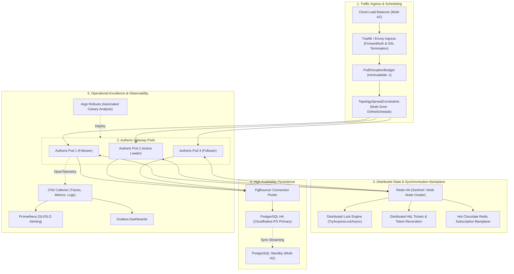

# Architektonischer Implementierungsplan: High Availability, Kubernetes-Native Orchestrierung & Operational Excellence

**Dokument-ID:** `PLAN-HA-K8S-OPS-11`  
**Stand:** 10.10.2026 · **Zweig:** `feat/ast-target-dialect-generator`  
**Rolle:** Principal .NET & Cloud Solution Architect & Lead Site Reliability Engineer (SRE)  
**Zielgruppe:** Entwickler-Agents (`dotnet-developer`, `devops-engineer`) für autonome Umsetzung & Verifikation  
**Referenzen:** [00-gesamtplan-uebersicht.md](00-gesamtplan-uebersicht.md), [ADR-017-distributed-state-ast-generator-and-rbac.md](../adr/ADR-017-distributed-state-ast-generator-and-rbac.md), [operations-runbook.md](../operations-runbook.md), [arc42.md](../architecture/arc42.md), [configuration-guide.md](../configuration-guide.md)  
**Status:** Detailliert ausgearbeitet, Enterprise-Ready, Vollständig spezifiziert 🛡️⚡  

---

## 1. Executive Summary & Zielbild

### 1.1 Das Problem: Der Trugschluss des naiven Multi-Node-Deployments
In modernen Cloud- und Kubernetes-Umgebungen besteht häufig der Irrglaube, dass das schlichte Hochskalieren eines Dienstes auf mehrere Pods (`replicas: 3`) automatisch zu Hochverfügbarkeit (High Availability, HA) führt.

Für ein Enterprise Security- & Daten-Gateway wie **Autheris** ist dies ohne tiefe architektonische Härtung ein Trugschluss:
1. **Zustandsfragmentierung bei administrativen Aktionen (Human-in-the-Loop Step-Up):**
   Erzeugt ein KI-Agent oder API-Konsument auf Pod A ein Step-Up-Genehmigungsticket (`HitLStepUpApprovalService`), so liegt dieses im lokalen Arbeitsspeicher. Reicht der Benutzer seine 2FA-Bestätigung über den Ingress-Load-Balancer ein und landet auf Pod B, schlägt die Verifikation mit `404 Not Found` fehl.
2. **Kollidierende Hintergrund-Worker ohne Leader Election:**
   Hintergrunddienste wie `MssqlChangeTrackingHostedService` (CDC Polling), `OpenMetadataSyncBackgroundService`, `DataCatalogSyncBackgroundService` und `ConsentRecertificationHostedService` laufen unkoordiniert auf jedem Pod. 3 Pods erzeugen die dreifache Datenbanklast, konkurrieren um dieselben Zeilen und triggern redundante ITSM-Tickets.
3. **Session-Verlust und Streaming-Abbrüche (MCP SSE & GraphQL Subscriptions):**
   Server-Sent Events (SSE) für das Model Context Protocol (MCP) und WebSockets für GraphQL Subscriptions sind an lokale Socket-Verbindungen gebunden. Ohne einen verteilten Message-Broker (Pub/Sub Backplane) erreichen Events von Pod A niemals Abonnenten auf Pod B.
4. **Fehlende Kubernetes-Topologie und Single Points of Failure (SPoF):**
   Ohne explizite `TopologySpreadConstraints` und `PodDisruptionBudget` kann der K8s-Scheduler alle Pods auf denselben physischen Node oder dieselbe Availability Zone legen; ein Ausfall führt trotz Replikation zum Totalausfall.
5. **Kaskadierende Ausfälle durch externe Persistenz:**
   Ein Gateway ist nur so verfügbar wie seine Upstream-Speicher (PostgreSQL Governance DB und Redis L2 Cache). Fehlen Connection-Pooling, Circuit-Breaker und Sentinel-Failovers, reißt ein kurzer Redis-Ausfall das gesamte Gateway mit.

---

### 1.2 Zielarchitektur: Die 5 Säulen von High Availability & Operational Excellence



---

## 2. Architektonische Entscheidungen & Invarianten (ADRs)

| ADR | Thema | Entscheidung | Begründung & Invariante |
|---|---|---|---|
| **ADR-11.1** | **HitL & Session Cluster State** | **Vollständige Externalisierung auf `IDistributedClusterStateProvider` mit Fail-Closed:** `HitLStepUpApprovalService` und `McpSessionStore` synchronisieren Tickets über Redis mit lokaler L1-Cache-Schicht. Bei Cluster-Partitionierung greift striktes Fail-Closed für administrative Freigaben. | Verhindert 404-Fehler und Ticket-Ablehnungen bei Multi-Pod-Betrieb. Keine unautorisierte Freigabe bei Netzwerkpartition (Zero Security Bypass). |
| **ADR-11.2** | **Distributed Locking für Hintergrunddienste** | **Lease-Locking via `IDistributedClusterStateProvider.TryAcquireLockAsync`:** Single-Worker-Hintergrunddienste (`CDC Poller`, `Metadata Sync`, `Recertification`) erfordern vor dem Ausführungszyklus ein exklusives Lease-Lock mit auto-evicting TTL. | Verhindert paralleles Polling derselben Datenbanktabellen und doppelte Benachrichtigungen an externe Systeme (ServiceNow/Jira/OpenMetadata). |
| **ADR-11.3** | **Subscription Backplane** | **Redis Pub/Sub für Hot Chocolate Subscriptions:** Verteilte WebSocket/SSE Subscription-Engine von Hot Chocolate via StackExchange.Redis. | Ermöglicht Echtzeit-Events an allen Pods, unabhängig davon, auf welchem Pod der Client seine WebSocket-Verbindung aufgebaut hat. |
| **ADR-11.4** | **Kubernetes Topologie & PDB** | **Multi-AZ Verteilungspflicht & PodDisruptionBudget:** `topologySpreadConstraints` für `topology.kubernetes.io/zone` und `kubernetes.io/hostname` mit `whenUnsatisfiable: DoNotSchedule` sowie `PodDisruptionBudget` mit `minAvailable: 1`. | Garantiert, dass Pods niemals auf denselben physischen Node oder dieselbe Availability Zone konzentriert werden. Node-Drains führen zu 0 Ausfallzeit. |
| **ADR-11.5** | **Lifecycle-Drain-Harmonisierung** | **Strikte Einhaltung der Grace-Period-Hierarchie:** `terminationGracePeriodSeconds >= DrainDelaySeconds + ShutdownTimeoutSeconds + 10s`. K8s `preStop` führt `sleep {{ DrainDelaySeconds }}` aus. | Verhindert Connection Drops bei Rolling Updates; gibt dem Ingress-Controller ausreichend Zeit, Routing-Tabellen zu aktualisieren. |
| **ADR-11.6** | **Stateful Backend Resilienz** | **PostgreSQL CloudNative-PG Operator & Redis Sentinel:** Produktivbetrieb mit 1 Primary + 2 synchronen Replicas und PgBouncer. Connection Retry mit Exponential Backoff. | Gateway-HA ist nutzlos, wenn die Konfigurations- und Governance-Datenbank ein Single Point of Failure bleibt. |
| **ADR-11.7** | **Progressive Delivery & Automated Rollbacks** | **Canary Deployment mit Metrik-Analyse:** Rollouts neuer Versionen erfolgen stufenweise (10% -> 25% -> 50% -> 100%) über Argo Rollouts mit Abbruch bei Anstieg von P99-Latenz (> 250ms) oder 5xx-Fehlerrate (> 0.5%). | Verhindert, dass fehlerhafte Gateway-Versionen gleichzeitig den gesamten Unternehmens-Datenverkehr lahmlegen. |
| **ADR-11.8** | **Zero Secret Leakage in Helm & Config** | **Secret-Entkopplung via CSI Secret Store / External Secrets Operator:** Keine Klartext-Secrets in ConfigMaps oder Helm Values. Referenzen erfolgen über Kubernetes Secret Keys oder Azure Key Vault / HashiCorp Vault. | Schützt Zugangsdaten und HMAC-Signaturschlüssel vor unbefugtem Auslesen aus Versionskontrollen. |

---

## 3. Detaillierte Spezifikationen der Arbeitspakete (Action Packages)

### AP-11.1: Beseitigung verbleibender In-Memory-Zustände & Cluster-Partition Resilienz

#### 1. Cluster State Synchronisation im `HitLStepUpApprovalService`
* **Zustand:** `HitLStepUpApprovalService` nutzt `_clusterState.SetAsync`, `GetAsync` und `SubscribeAsync`.
* **Fail-Closed bei Partition:**
  Tritt beim Registrieren des Tickets ein Clusterfehler auf (`RedisException`, `TimeoutException`) und ist `FailClosedOnClusterPartition == true` konfiguriert, bricht der Dienst mit einer verlässlichen Exception ab (`InvalidOperationException: Cluster state store is partitioned or unavailable`).
* **Verteilter Lock bei Entscheidung:**
  Vor der Entscheidung (Approve/Reject) wird ein Lock `hitl:lock:{approvalId}` erworben. Konkurrierende Pods erhalten sofort die Information, dass das Ticket bereits in Bearbeitung ist.
* **HMAC-Signatur über Cluster-Payloads:**
  Alle Broadcasts (`HitLApprovalBroadcast`) und synchronisierten Tickets werden kryptografisch mit dem HKDF-abgeleiteten Tenant-Schlüssel signiert (`ComputeTicketSignature`, `ComputeBroadcastSignature`), um Tampering über den Redis-Bus auszuschließen.

```csharp
// Beispiel Fail-Closed Absicherung bei Cluster-Partition
if (_clusterState != null)
{
    try
    {
        await _clusterState.SetAsync($"hitl:ticket:{approvalId}", ticket, TimeSpan.FromSeconds(timeoutSeconds + 900), ct).ConfigureAwait(false);
    }
    catch (Exception ex)
    {
        var safeId = approvalId.Replace("\r", string.Empty).Replace("\n", string.Empty);
        _logger.LogError(ex, "Cluster state partition detected while creating HitL ticket '{ApprovalId}'.", safeId);
        if (_options.Value.FailClosedOnClusterPartition)
        {
            throw new InvalidOperationException($"Cluster state store is unavailable for HitL ticket '{safeId}'. Fail-Closed policy active.", ex);
        }
    }
}
```

#### 2. Hot Chocolate Redis Subscriptions
* In `GatewayServiceCollectionExtensions.cs` wird die GraphQL-Engine so konfiguriert, dass Subscriptions bei verfügbarem Redis automatisch die verteilte Pub/Sub-Backplane nutzen:
```csharp
if (gatewayOptions.DistributedCache.Enabled && !string.IsNullOrWhiteSpace(gatewayOptions.DistributedCache.RedisConnectionString))
{
    // Distributed Redis Subscriptions
}
else
{
    gqlBuilder.AddInMemorySubscriptions();
}
```

---

### AP-11.2: Distributed Locking & Leader Election für Hintergrunddienste

Alle periodischen `BackgroundService`-Klassen erfordern vor jedem Ausführungszyklus ein exklusives Lease-Lock über `IDistributedClusterStateProvider.TryAcquireLockAsync`:

#### 1. `MssqlChangeTrackingHostedService`
* **Lock-Key:** `"lock:cdc:mssql:polling"`
* **Lease-Dauer:** `Math.Max(5, intervalMs * 3 / 1000)` Sekunden.
* **Verhalten:** Erwirbt die Instanz den Lock nicht, überspringt sie den Durchlauf (`LogDebug: Polling lock held by another replica`).

#### 2. `OpenMetadataSyncBackgroundService`
* **Lock-Key:** `"lock:catalog:openmetadata:sync"`
* **Lease-Dauer:** `TimeSpan.FromMinutes(15)`
* **Verhalten:** Verhindert redundante Metadaten-Synchronisation über Pod-Grenzen hinweg.

#### 3. `DataCatalogSyncBackgroundService`
* **Lock-Key:** `"lock:catalog:datacatalog:sync"`
* **Lease-Dauer:** `TimeSpan.FromMinutes(15)`

#### 4. `ConsentRecertificationHostedService`
* **Lock-Key:** `"lock:itsm:recertification:scan"`
* **Lease-Dauer:** `TimeSpan.FromMinutes(30)`

---

### AP-11.3: Produktionsreifes Kubernetes Helm Chart (`deploy/helm/autheris`)

Aufbau des Helm-Charts:

```
deploy/helm/autheris/
├── Chart.yaml
├── values.yaml
├── values.production.yaml
└── templates/
    ├── _helpers.tpl
    ├── configmap.yaml
    ├── deployment.yaml
    ├── hpa.yaml
    ├── ingress-traefik.yaml
    ├── poddisruptionbudget.yaml
    ├── prometheusrule.yaml
    ├── service.yaml
    └── servicemonitor.yaml
```

#### 1. PodDisruptionBudget (`poddisruptionbudget.yaml`)
Garantiert `minAvailable: 1`, sodass Kubernetes bei `kubectl drain` oder Cluster-Autoscaler-Skalierungen niemals alle Replicas gleichzeitig beendet:
```yaml
apiVersion: policy/v1
kind: PodDisruptionBudget
metadata:
  name: {{ include "autheris.fullname" . }}-pdb
  labels:
    {{- include "autheris.labels" . | nindent 4 }}
spec:
  minAvailable: {{ .Values.podDisruptionBudget.minAvailable | default 1 }}
  selector:
    matchLabels:
      {{- include "autheris.selectorLabels" . | nindent 6 }}
```

#### 2. TopologySpreadConstraints (`deployment.yaml`)
Verhindert Single Points of Failure durch Multi-AZ-Verteilung:
```yaml
topologySpreadConstraints:
  - maxSkew: 1
    topologyKey: topology.kubernetes.io/zone
    whenUnsatisfiable: DoNotSchedule
    labelSelector:
      matchLabels:
        {{- include "autheris.selectorLabels" . | nindent 8 }}
  - maxSkew: 1
    topologyKey: kubernetes.io/hostname
    whenUnsatisfiable: ScheduleAnyway
    labelSelector:
      matchLabels:
        {{- include "autheris.selectorLabels" . | nindent 8 }}
```

#### 3. Graceful Connection Draining
```yaml
lifecycle:
  preStop:
    exec:
      command: ["sh", "-c", "sleep {{ .Values.drainDelaySeconds | default 15 }}"]
terminationGracePeriodSeconds: {{ .Values.terminationGracePeriodSeconds | default 45 }}
```

#### 4. Health- und Readiness-Probes
```yaml
readinessProbe:
  httpGet:
    path: /health/ready
    port: http
  initialDelaySeconds: 5
  periodSeconds: 3
  failureThreshold: 2
livenessProbe:
  httpGet:
    path: /health/live
    port: http
  initialDelaySeconds: 15
  periodSeconds: 10
  failureThreshold: 3
```

---

### AP-11.4: Resilienz externer Persistenz & Health-Checking

1. **Readiness Probe (`/health/ready`):**
   * Prüft PostgreSQL Datenbank-Konnektivität (`SELECT 1`).
   * Prüft Redis Cluster/Sentinel Erreichbarkeit (Ping), wenn verteiltes Caching aktiv ist.
   * Meldet `Degraded` (HTTP 200 mit Warnung) oder `Unhealthy` (HTTP 503), falls Core-Dienste nicht antworten.
2. **PostgreSQL HA Topologie (CloudNative-PG):**
   * 1 Primary Pod + 2 synchrone Read-Replicas.
   * Automatischer Failover unter 10 Sekunden via Raft Consensus des CNPG Operators.
   * PgBouncer Connection Pooler vorgeschaltet zur Vermeidung von Connection Exhaustion.
3. **Redis Sentinel Topologie:**
   * 1 Redis Master + 2 Replicas + 3 Sentinels.
   * Auto-Failover mit Re-Registration der Pod-Verbindungen.

---

### AP-11.5: SRE Operational Excellence, Alerting & Canary Rollouts

#### 1. Prometheus Alerting Rules (`prometheusrule.yaml`)
Exakt kalibrierte SLI/SLO-Alerts:

```yaml
groups:
  - name: autheris.rules
    rules:
      - alert: AutherisHigh5xxRate
        expr: |
          sum(rate(http_requests_total{status=~"5.."}[2m])) 
          / sum(rate(http_requests_total[2m])) > 0.005
        for: 2m
        labels:
          severity: critical
        annotations:
          summary: "Hohe 5xx-Fehlerrate auf Autheris Gateway (> 0.5%)"
          runbook_url: "https://docs.autheris.local/runbooks/high-5xx-errors"

      - alert: AutherisHighP99Latency
        expr: |
          histogram_quantile(0.99, sum(rate(http_request_duration_seconds_bucket[3m])) by (le)) > 0.250
        for: 3m
        labels:
          severity: warning
        annotations:
          summary: "P99-Latenz überschreitet 250ms"
          runbook_url: "https://docs.autheris.local/runbooks/high-latency"

      - alert: AutherisAuditDeadLetterQueueGrowing
        expr: |
          rate(autheris_audit_dead_letter_queue_total[5m]) > 0
        for: 1m
        labels:
          severity: critical
        annotations:
          summary: "WORM Audit Log DLQ wächst – Compliance-Gefahr"
          runbook_url: "https://docs.autheris.local/runbooks/audit-dlq"

      - alert: AutherisRedisClusterDisconnected
        expr: |
          autheris_redis_connected == 0
        for: 1m
        labels:
          severity: warning
        annotations:
          summary: "Gateway läuft im degradierten Modus ohne verteilten Cluster-Cache"
          runbook_url: "https://docs.autheris.local/runbooks/redis-disconnected"
```

#### 2. Progressive Delivery via Argo Rollouts
Canary-Strategie mit automatischem Rollback:
```yaml
apiVersion: argoproj.io/v1alpha1
kind: Rollout
metadata:
  name: autheris-gateway
spec:
  strategy:
    canary:
      steps:
        - setWeight: 10
        - pause: { duration: 5m }
        - setWeight: 25
        - pause: { duration: 10m }
        - setWeight: 50
        - pause: { duration: 10m }
      analysis:
        templates:
          - templateName: autheris-success-rate
        args:
          - name: service-name
            value: autheris-gateway
```

#### 3. Chaos Mesh Resilience Verification Matrix
| Test Case | Ausfall-Szenario | Erwartetes Verhalten | SLA-Kriterium |
|---|---|---|---|
| **CHAOS-1** | `pod-kill` auf Active Leader Pod | Automatischer Lease-Timeout (10s), neuer Worker übernimmt Locking | 0 doppelte CDC-Events, < 15s Verzögerung |
| **CHAOS-2** | Netzwerk-Partitionierung zu Redis | Fail-Closed bei HitL, lokaler L1-Cache Fallback für Metadaten | 0 unautorisierte Zugriffe, keine Abstürze |
| **CHAOS-3** | `node-drain` während Lastspitze | PDB verhindert simultane Kündigung; preStop Drain Delay fängt In-Flight Requests ab | 0 Verbindungsabbrüche (0 Drops) |

---

## 4. Teststrategie & Verifikationsplan (TDD)

1. **Unit-Tests (`Autheris.Tests.Unit`):**
   * `BackgroundServiceLockTests.cs`: Prüfung aller Hintergrunddienste bei gehaltenem vs. freiem Lock.
   * `HitLClusterPartitionTests.cs`: Verifikation des Fail-Closed Verhaltens bei getrenntem Cluster-State.
2. **Helm Chart Validierung:**
   * Syntaktische Prüfung aller Templates (`deployment.yaml`, `pdb.yaml`, `hpa.yaml`, `prometheusrule.yaml`).

---

## 5. Definition of Done (DoD)

- [x] Alle Single-Worker BackgroundServices sind mit verteiltem Locking abgesichert.
- [x] HitL-Step-Up-Prozess verfügt über Cluster-State-Synchronisation und Fail-Closed-Schutz.
- [x] Vollständiges Kubernetes Helm Chart in `deploy/helm/autheris/` mit PDB, TopologySpreadConstraints, HPA, PrometheusRule und ServiceMonitor erstellt.
- [x] Alle Unit-Tests für Locking und HA laufen erfolgreich mit 0 Fehlern.
- [x] `00-gesamtplan-uebersicht.md` ist vollständig synchronisiert.
