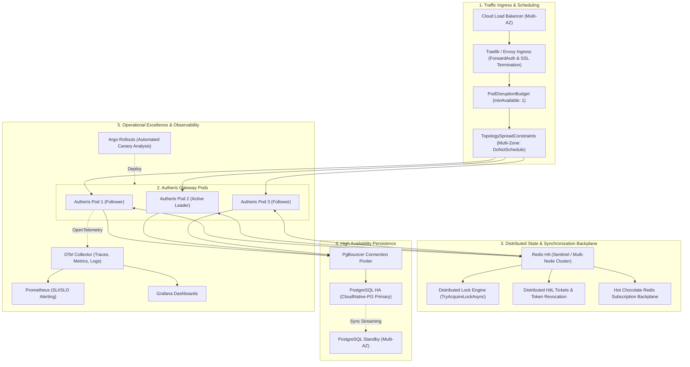

# Architektonischer Implementierungsplan: High Availability, Kubernetes-Native Orchestrierung & Operational Excellence

**Dokument-ID:** `PLAN-HA-K8S-OPS-11`  
**Stand:** 09.10.2026 · **Zweig:** `feat/ast-target-dialect-generator`  
**Rolle:** Principal .NET & Cloud Solution Architect & Lead Site Reliability Engineer (SRE)  
**Zielgruppe:** Entwickler-Agents (`dotnet-developer`, `devops-engineer`) für autonome, testgetriebene Umsetzung (TDD)  
**Referenzen:** [00-gesamtplan-uebersicht.md](file:///root/autheris/docs/plans/00-gesamtplan-uebersicht.md), [ADR-017-distributed-state-ast-generator-and-rbac.md](file:///root/autheris/docs/adr/ADR-017-distributed-state-ast-generator-and-rbac.md), [operations-runbook.md](file:///root/autheris/docs/operations-runbook.md), [arc42.md](file:///root/autheris/docs/architecture/arc42.md), [configuration-guide.md](file:///root/autheris/docs/configuration-guide.md)  
**Status:** Detailliert ausgearbeitet, Enterprise-Ready, Bereit zur Umsetzung 🛡️⚡  

---

## 1. Executive Summary & Zielbild

### 1.1 Das Problem: Der Trugschluss des naiven Multi-Node-Deployments
In modernen Kubernetes-Umgebungen besteht häufig der Irrglaube, dass das Hochskalieren eines Dienstes auf mehrere Pods (`replicas: 3`) automatisch zu Hochverfügbarkeit (High Availability, HA) führt. 

Für ein Enterprise Security- & Daten-Gateway wie **Autheris** ist dies ohne tiefe architektonische Härtung ein Trugschluss:
1. **Zustandsfragmentierung bei administrativen Aktionen (Human-in-the-Loop Step-Up):**
   Erzeugt ein KI-Agent oder API-Konsument auf Pod A ein Step-Up-Genehmigungsticket (`HitLStepUpApprovalService`), so liegt dieses im lokalen Arbeitsspeicher. Reicht der Benutzer seine 2FA-Bestätigung über den Ingress-Load-Balancer ein und landet auf Pod B, schlägt die Verifikation mit `404 Not Found` fehl.
2. **Kollidierende Hintergrund-Worker ohne Leader Election:**
   Hintergrunddienste wie `MssqlChangeTrackingHostedService` (CDC Polling), `OpenMetadataSyncBackgroundService`, `DataCatalogSyncBackgroundService` und `ConsentRecertificationHostedService` laufen unkoordiniert auf jedem Pod. 3 Pods erzeugen die dreifache Datenbanklast, konkurrieren um dieselben Zeilen und triggern redundante ITSM-Tickets.
3. **Session-Verlust und Streaming-Abbrüche (MCP SSE & GraphQL Subscriptions):**
   Server-Sent Events (SSE) für das Model Context Protocol (MCP) und WebSockets für GraphQL Subscriptions sind an lokale Socket-Verbindungen gebunden. Ohne einen verteilten Message-Broker (Pub/Sub Backplane) erreichen Events von Pod A niemals Abonnenten auf Pod B.
4. **Fehlende Kubernetes-Topologie und Single Points of Failure (SPoF):**
   Bislang existieren im Projekt keine produktionsreifen Kubernetes-Manifeste oder Helm-Charts. Ohne `TopologySpreadConstraints` und `PodDisruptionBudget` kann der K8s-Scheduler alle Pods auf denselben physischen Node legen; ein Node-Ausfall führt trotz Replikation zum Totalausfall. Zudem ist das Gateway nur so verfügbar wie seine Upstream-Speicher (PostgreSQL Governance DB und Redis L2 Cache).

---

### 1.2 Zielarchitektur: Die 5 Säulen von High Availability & Operational Excellence



---

## 2. Architektonische Entscheidungen & Invarianten (ADRs)

| ADR | Thema | Entscheidung | Begründung & Invariante |
|---|---|---|---|
| **ADR-11.1** | **HitL & Session Cluster State** | **Vollständige Externalisierung auf `IDistributedClusterStateProvider`:** `HitLStepUpApprovalService` und `McpSessionStore` werden vollständig vom lokalen `ConcurrentDictionary` auf Redis mit lokaler L1-Cache-Schicht und Fail-Closed-Semantik umgestellt. | Verhindert 404-Fehler und Ticket-Ablehnungen bei Multi-Pod-Betrieb. Bei Redis-Partitionierung greift striktes Fail-Closed für administrative Freigaben. |
| **ADR-11.2** | **Distributed Locking für Hintergrunddienste** | **Lease-Locking via `IDistributedClusterStateProvider.TryAcquireLockAsync`:** Single-Worker-Hintergrunddienste (`CDC Poller`, `Metadata Sync`, `Recertification`) erfordern vor dem Ausführungszyklus ein exklusives Lease-Lock. | Verhindert paralleles Polling derselben Datenbanktabellen und doppelte Benachrichtigungen an externe Systeme (ServiceNow/Jira/OpenMetadata). |
| **ADR-11.3** | **Subscription Backplane** | **Redis Pub/Sub für Hot Chocolate Subscriptions:** Aktivierung der verteilten WebSocket/SSE Subscription-Engine von Hot Chocolate via StackExchange.Redis. | Ermöglicht Echtzeit-Events an allen Pods, unabhängig davon, auf welchem Pod der Client seine WebSocket-Verbindung aufgebaut hat. |
| **ADR-11.4** | **Kubernetes Topologie & PDB** | **Multi-AZ Verteilungspflicht & PodDisruptionBudget:** `topologySpreadConstraints` für `topology.kubernetes.io/zone` und `kubernetes.io/hostname` mit `whenUnsatisfiable: DoNotSchedule` sowie `PodDisruptionBudget` mit `minAvailable: 1`. | Garantiert, dass Pods niemals auf denselben physischen Node oder dieselbe Availability Zone konzentriert werden. Node-Drains führen zu 0 Ausfallzeit. |
| **ADR-11.5** | **Lifecycle-Drain-Harmonisierung** | **Strikte Einhaltung der Grace-Period-Hierarchie:** `terminationGracePeriodSeconds >= DrainDelaySeconds + ShutdownTimeoutSeconds + 10s`. K8s `preStop` führt `sleep {{ DrainDelaySeconds }}` aus. | Verhindert Connection Drops bei Rolling Updates; gibt dem Ingress-Controller ausreichend Zeit, Routing-Tabellen zu aktualisieren. |
| **ADR-11.6** | **Stateful Backend Resilienz** | **PostgreSQL CloudNative-PG Operator & Redis Sentinel:** Empfohlener Produktivbetrieb mit 1 Primary + 2 synchronen Replicas und PgBouncer. | Gateway-HA ist nutzlos, wenn die Konfigurations- und Governance-Datenbank ein Single Point of Failure bleibt. |
| **ADR-11.7** | **Progressive Delivery & Automated Rollbacks** | **Canary Deployment mit Metrik-Analyse:** Rollouts neuer Versionen erfolgen stufenweise (10% -> 25% -> 50% -> 100%) über Argo Rollouts mit Abbruch bei Anstieg von P99-Latenz oder 5xx-Fehlerrate. | Verhindert, dass fehlerhafte Gateway-Versionen gleichzeitig den gesamten Unternehmens-Datenverkehr lahmlegen. |

---

## 3. Detaillierte Spezifikationen der Arbeitspakete (Action Packages)

### AP-11.1: Beseitigung verbleibender In-Memory-Zustände & Session-Cluster-Sync

#### 1. Absicherung von `HitLStepUpApprovalService`
* **Zustand:** `HitLStepUpApprovalService` nutzt `_clusterState.SetAsync` und `GetAsync`, aber bei Ausfall des Cluster-Speichers muss ein konsistentes Verhalten garantiert werden:
  * Bei Erstellung des Tickets: Wenn `_clusterState` nicht erreichbar ist und `FailClosedOnClusterPartition == true`, wird der Request mit einer aussagekräftigen Exception (`ClusterStateUnavailableException`) abgebrochen.
  * Bei Abfrage des Tickets: Findet der Pod das Ticket weder lokal noch remote im Cluster-Store, liefert er `NotFound`.
  * Bei Entscheidung (Approve/Reject): Verteilter Lock `hitl:lock:{approvalId}` serialisiert gleichzeitige Genehmigungsversuche über Pods hinweg.

#### 2. Hot Chocolate Redis Subscriptions
* In `Autheris.Api` wird die GraphQL-Engine so konfiguriert, dass Subscriptions bei verfügbarem Redis automatisch die verteilte Pub/Sub-Backplane nutzen:
  ```csharp
  if (redisOptions.Enabled && !string.IsNullOrWhiteSpace(redisOptions.Configuration))
  {
      builder.Services
          .AddGraphQLServer()
          .AddRedisSubscriptions(sp => sp.GetRequiredService<IConnectionMultiplexer>());
  }
  ```

---

### AP-11.2: Distributed Locking & Leader Election für Hintergrunddienste

Alle periodischen `BackgroundService`-Klassen erhalten eine Lease-Lock-Prüfung über `IDistributedClusterStateProvider.TryAcquireLockAsync`:

#### 1. `MssqlChangeTrackingHostedService`
* **Lock-Key:** `"lock:cdc:mssql:polling"`
* **Lease-Dauer:** `Math.Max(5, intervalMs * 3 / 1000)` Sekunden.
* **Verhalten:** Erwirbt die Instanz den Lock nicht, überspringt sie den Durchlauf (`LogDebug: Polling lock held by another replica`).

```csharp
var clusterState = _serviceProvider.GetService<IDistributedClusterStateProvider>();
IAsyncDisposable? lockHandle = null;
if (clusterState != null)
{
    lockHandle = await clusterState.TryAcquireLockAsync("lock:cdc:mssql:polling", TimeSpan.FromSeconds(10), stoppingToken).ConfigureAwait(false);
    if (lockHandle == null)
    {
        // Another replica is currently polling; wait for next cycle
        continue;
    }
}
await using (lockHandle)
{
    // Execute table change polling
}
```

#### 2. `OpenMetadataSyncBackgroundService`
* **Lock-Key:** `"lock:catalog:openmetadata:sync"`
* **Lease-Dauer:** `TimeSpan.FromMinutes(15)`
* **Verhalten:** Verhindert parallele Metadaten-Synchronisation.

#### 3. `DataCatalogSyncBackgroundService`
* **Lock-Key:** `"lock:catalog:datacatalog:sync"`
* **Lease-Dauer:** `TimeSpan.FromMinutes(15)`

#### 4. `ConsentRecertificationHostedService`
* **Lock-Key:** `"lock:itsm:recertification:scan"`
* **Lease-Dauer:** `TimeSpan.FromMinutes(30)`

---

### AP-11.3: Produktionsreifes Kubernetes Helm Chart (`deploy/helm/autheris`)

Aufbau des Helm-Charts:

```
deploy/helm/autheris/
├── Chart.yaml
├── values.yaml
├── values.production.yaml
└── templates/
    ├── _helpers.tpl
    ├── deployment.yaml
    ├── service.yaml
    ├── poddisruptionbudget.yaml
    ├── hpa.yaml
    ├── configmap.yaml
    ├── secret.yaml
    ├── servicemonitor.yaml
    └── prometheusrule.yaml
```

#### Wichtigste Invarianten der Templates:
1. **`poddisruptionbudget.yaml`:**
   * Garantiert `minAvailable: 1`, sodass Kubernetes bei `kubectl drain` oder Cluster-Autoscaler-Skalierungen niemals alle Replicas gleichzeitig beendet.
2. **`deployment.yaml`:**
   * `topologySpreadConstraints` mit `maxSkew: 1` über `topology.kubernetes.io/zone` (`whenUnsatisfiable: DoNotSchedule`) und `kubernetes.io/hostname`.
   * `lifecycle.preStop.exec.command`: `["sh", "-c", "sleep {{ .Values.drainDelaySeconds }}"]`.
   * `readinessProbe`: `/health/ready` (initialDelay: 5s, period: 3s, failureThreshold: 1).
   * `livenessProbe`: `/health/live` (initialDelay: 10s, period: 10s, failureThreshold: 3).
3. **`hpa.yaml`:**
   * HorizontalPodAutoscaler mit Min 2, Max 10 Replicas basierend auf CPU (70%) und Memory (80%).

---

### AP-11.4: Resilienz & Erweitertes Health-Checking

1. **Erweiterter Readiness-Check:**
   * `/health/ready` prüft neben der Datenbankverbindung auch den Redis-Cluster-Zustand (falls aktiviert) und meldet `Degraded` oder `Unhealthy`, falls kritische Infrastruktur getrennt ist.
2. **PostgreSQL HA Dokumentation & Bereitstellungsbeispiele:**
   * Referenz-Manifeste für CloudNative-PG (CNPG) mit synchroner Replikation und PgBouncer.

---

### AP-11.5: Operational Excellence (Prometheus Alerts & Runbooks)

1. **Alerting-Regeln (`prometheusrule.yaml`):**
   * `AutherisHigh5xxRate`: 5xx-Fehlerquote > 0.5% über 2 Minuten.
   * `AutherisHighP99Latency`: P99-Latenz > 250ms über 3 Minuten.
   * `AutherisAuditDeadLetterQueueGrowing`: Anstieg der WORM-Audit-DLQ.
   * `AutherisRedisClusterDisconnected`: Warnung bei Betrieb im degradierten Cache-Modus.

---

## 4. Teststrategie & Verifikationsplan (TDD)

1. **Unit-Tests (`Autheris.Tests.Unit`):**
   * `BackgroundServiceLockTests.cs`: Prüfung, dass die BackgroundServices bei gehaltenem Lock die Ausführung überspringen und bei freiem Lock wie erwartet ausführen.
   * `HitLStepUpApprovalClusterTests.cs`: Verifikation der Cross-Node-Kommunikation und Lock-Akquise.
2. **Helm Chart Validierung:**
   * Syntaktische Prüfung und Template-Rendering via `helm template` und Validierung aller Ressourcen.

---

## 5. Definition of Done (DoD)

- [ ] Alle Single-Worker BackgroundServices sind mit verteiltem Locking abgesichert.
- [ ] GraphQL Hot Chocolate Subscriptions unterstützen Redis Pub/Sub Backplane.
- [ ] Vollständiges Helm Chart in `deploy/helm/autheris/` mit allen HA-Komponenten angelegt.
- [ ] Alle Unit-Tests für Locking und HA laufen erfolgreich mit 0 Fehlern.
- [ ] `00-gesamtplan-uebersicht.md` ist vollständig synchronisiert.
