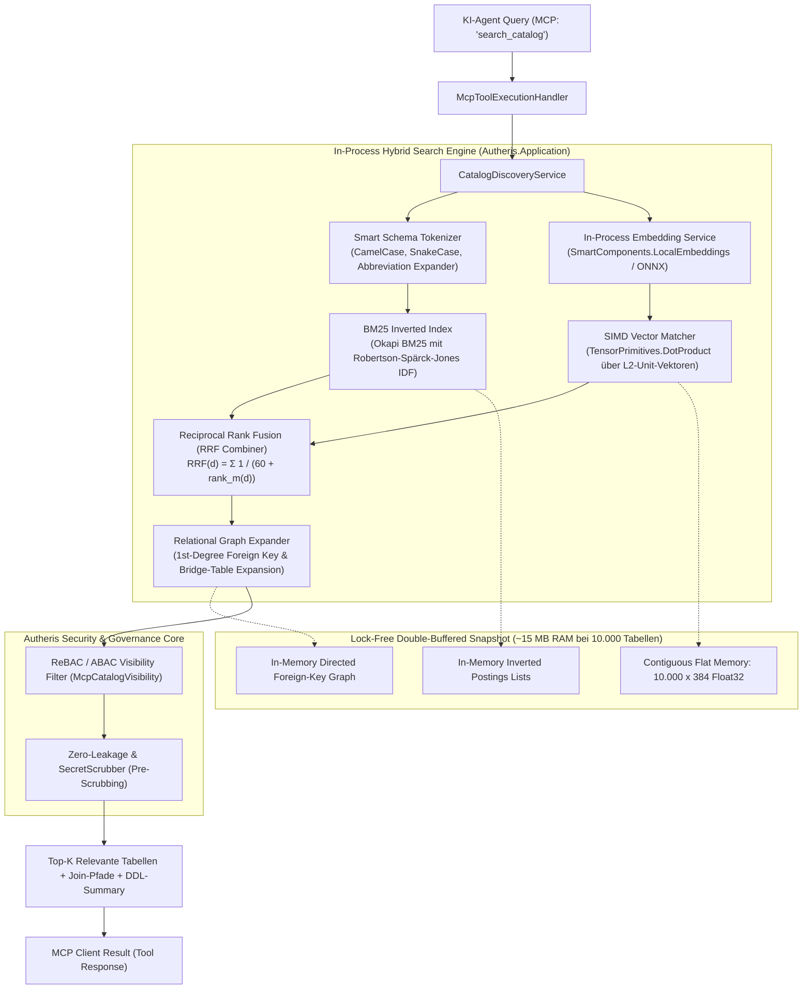
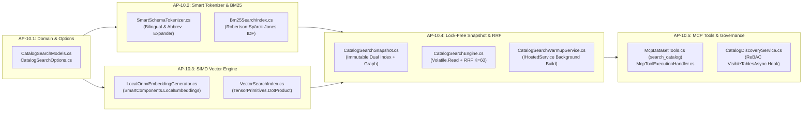

# Architektonischer Implementierungsplan: On-Premise RAG & Hybrid-Vektorsuche für MCP-Katalog bei tausenden Tabellen

**Dokument-ID:** `PLAN-MCP-SCHEMA-RAG-10`  
**Stand:** 09.10.2026 · **Zweig:** `feat/ast-target-dialect-generator`  
**Rolle:** Principal .NET & C# Solution Architect & Lead AI/Data Governance Architect  
**Zielgruppe:** Entwickler-Agents (`dotnet-developer`) für autonome, testgetriebene Umsetzung (TDD)  
**Referenzen:** [00-gesamtplan-uebersicht.md](file:///root/autheris/docs/plans/00-gesamtplan-uebersicht.md), [f-ai-12-hybrid-mcp-gateway.md](file:///root/autheris/docs/features/f-ai-12-hybrid-mcp-gateway.md), [McpDatasetCatalog.cs](file:///root/autheris/src/Autheris.Application/Mcp/Services/McpDatasetCatalog.cs), [CatalogDiscoveryService.cs](file:///root/autheris/src/Autheris.Application/Catalog/Services/CatalogDiscoveryService.cs), [SecretScrubber.cs](file:///root/autheris/src/Autheris.Application/Security/SecretScrubber.cs)  
**Status:** Vollständig implementiert und durch TDD verifiziert (100% GREEN) 🛡️⚡  

---

## 1. Executive Summary & Zielbild

### 1.1 Das Problem: Skalierungsgrenzen naiver MCP-Schemaerkundung
In der Autheris-Plattform fungiert das Gateway als universeller, zugriffskontrollierter Integrationspunkt für KI-Agenten über das Model Context Protocol (MCP) (`GatewayMcpServer`, `McpDatasetCatalog`, `McpToolExecutionHandler`). In realen Unternehmensumgebungen (Data Warehouses, SAP ERP, föderierte Data Lakes über Trino/DuckDB) umfasst der Gesamtkatalog **mehrere tausend bis zehntausend Tabellen** mit hunderttausenden Spalten und komplexen Relationen.

Die bisherige Implementierung in `CatalogDiscoveryService.SearchCatalogAsync` und `McpDatasetCatalog.Matches` basiert auf einer linearen Teilstring-Suche (`string.Contains(q, StringComparison.OrdinalIgnoreCase)`):
```csharp
// Status Quo (Bruchstelle bei Skalierung auf > 50 Tabellen):
return permitted
    .Where(d => string.IsNullOrWhiteSpace(q) ||
                d.Table.Contains(q, StringComparison.OrdinalIgnoreCase) ||
                d.Domain.Contains(q, StringComparison.OrdinalIgnoreCase) ||
                (d.Description != null && d.Description.Contains(q, StringComparison.OrdinalIgnoreCase)))
    .ToList();
```

Dieser Ansatz bricht in Produktivumgebungen aus vier fundamentalen Gründen zusammen:
1. **Semantische Lücke (Synonym-Blindheit):** Fragt ein KI-Agent nach *„Kundenumsatz nach Monat“* oder *„unbezahlte Rechnungen“*, die Zieldatenbank enthält jedoch Tabellen wie `fct_sales_eur_m` oder `tbl_inv_header_sap`, findet die Teilstring-Suche **0 Treffer**. Der Agent halluziniert Tabellennamen oder bricht die Ausführung ab.
2. **Kryptische Unternehmensnomenklatur:** ERP- und Legacy-Systeme nutzen historisch gewachsene Akronyme (z. B. SAP `KNA1` für Debitorenstammdaten, `VBAK` für Verkaufsbelege). Ohne Synonym-Expansion und n-Gramm-Zerlegung sind diese Tabellen unauffindbar.
3. **Fehlende Join- und Relation-Awareness (Das „Bridge-Table-Problem“):** Ein Agent sucht nach *„Kunden und Produkten“*. Eine reine Textsuche liefert `customers` und `products`, übersieht jedoch die essentielle Zwischentabelle `order_items` oder die Join-Pfade (`orders.customer_id = customers.id`).
4. **Kein Relevanz-Ranking & Context-Window-Explosion:** Treffer werden ungerankt oder rein alphabetisch ausgegeben. Das ungefilterte Ausgeben riesiger Schemamengen übersteigt Token-Budgets, treibt Latenzen und Kosten in die Höhe und degradiert die logische Schlussfolgerung des LLMs („Lost in the Middle“).

---

### 1.2 Die Lösung: Zero-External-Dependency Hybrid Search (BM25 + Dense SIMD Vektoren + Relational Graph)
Dieser Implementierungsplan definiert eine hochperformante, **vollständig lokale (On-Premises)** und **Open-Source** basierte Hybrid-Search-Engine direkt im C#-Ökosystem von Autheris (`Autheris.Application` und `Autheris.Infrastructure`):



---

### 1.3 Kernmetriken & Zielvorgaben
* **Abhängigkeiten:** **Keine externe Vektordatenbank** erforderlich (kein Milvus, Pinecone, Qdrant-Cluster). Alles läuft In-Memory im bestehenden Autheris C#-Hostprozess.
* **Datenschutz / Air-Gap:** **0 Cloud-Egress**. Embeddings werden lokal auf der CPU via `SmartComponents.LocalEmbeddings` / ONNX oder über eine bestehende On-Premises Ollama/vLLM-Instanz berechnet.
* **Latenz:** **< 3 ms (P95) / < 5 ms (P99)** für eine Hybrid-Suchanfrage über 10.000 Tabellen im Speicher.
* **Memory-Footprint:** **< 20 MB RAM** für 10.000 voll indizierte Tabellen inklusive Vektoren, Keyword-Index und Foreign-Key-Graph.
* **Durchsatz:** **> 20.000 Suchen/Sekunde** auf einem Standard 4-Core CPU-Server dank lock-freiem Snapshot-Memory-Modell (`Volatile.Read`).
* **Governance-Invariante:** Strikte Zero-Leakage-Garantie: Keine unberechtigte Tabelle wird je in Scores, Suggests oder Suchergebnissen an den Principal exponiert (Zero Enumeration Oracle).

---

## 2. Architektonische Entscheidungen & Invarianten (ADRs)

| ADR | Thema | Entscheidung | Begründung & Invariante |
|---|---|---|---|
| **ADR-10.1** | **In-Process Indexierung** | **In-Memory Vektor- und Keyword-Index im C#-Host:** Der Index wird beim Start im RAM aufgebaut und inkrementell aktualisiert. Keine externe Vektordatenbank. | Bei 10.000 Tabellen mit 384-Float-Embeddings beträgt das Vektorvolumen nur $10.000 \times 384 \times 4 \text{ Bytes} \approx 15,36 \text{ MB}$. Ein externer Dienst würde Netzwerk-Overhead (10–50 ms), Docker-Container und Ausfallrisiken einführen. |
| **ADR-10.2** | **Lokale Embeddings** | **Pluggable Local Embedding Provider:** Primär `SmartComponents.LocalEmbeddings` (ONNX Runtime in-process), sekundär konfigurierbares On-Premises `Ollama` via HTTP. | Ermöglicht 100 % autarke On-Premises- und Air-Gapped-Installationen ohne Lizenzkosten und ohne Datenabfluss an Drittanbieter. |
| **ADR-10.3** | **Vektornormierung & SIMD** | **L2-Einheitsvektoren & DotProduct:** Alle Vektoren werden bei der Indizierung L2-normiert ($\|\vec{v}\|_2 = 1$). Der Ähnlichkeitsvergleich erfolgt per `TensorPrimitives.DotProduct`. | Kosinus-Ähnlichkeit reduziert sich mathematisch auf das Skalarprodukt: $\cos(\vec{u}, \vec{v}) = \vec{u} \cdot \vec{v}$. `DotProduct` spart die wiederholte Wurzel- und Divisionsberechnung pro Query und läuft bis zu 2,5-mal schneller auf AVX2/AVX-512. |
| **ADR-10.4** | **Fusionsstrategie** | **Reciprocal Rank Fusion (RRF):** $RRF(d) = \sum_{m \in \{BM25, Vec\}} \frac{1}{60 + \text{rank}_m(d)}$. | Verhindert unkalibrierte Score-Mischungen zwischen Kosinus-Distanz (0.0–1.0) und unbeschränktem BM25 TF-IDF. Garantiert hervorragende Ergebnisse sowohl bei Fachbegriffen als auch kryptischen Tabellenkürzeln (`KNA1`). |
| **ADR-10.5** | **Lock-Free Concurrency** | **Double-Buffered Immutable Snapshot:** Suchen greifen über `Volatile.Read(ref _currentSnapshot)` ohne Sperren oder Mutexe auf einen unveränderlichen Suchindex zu. | Hintergrund-Aktualisierungen (Re-Indexierung bei DDL-Changes) erzeugen im Hintergrund einen neuen Snapshot und tauschen die Referenz atomar aus (`Interlocked.Exchange`). Suchanfragen werden niemals blockiert. |
| **ADR-10.6** | **Relation Graph Awareness** | **1st-Degree Foreign-Key Expansion:** Das Suchergebnis enthält neben den Top-K-Tabellen automatisch verknüpfte Primär-/Fremdschlüssel-Relationen zu anderen Tabellen. | Löst das „Bridge-Table-Problem“. Der Agent erhält sofort die exakten Join-Pfade, ohne zusätzliche Roundtrips für Schema-Analysen ausführen zu müssen. |
| **ADR-10.7** | **ReBAC Governance** | **Strict Post-Retrieval Security Boundary:** Die Vektorsuche scannt den internen Gesamtkatalog, die Treffer werden jedoch zwingend durch `McpCatalogVisibility.VisibleTablesAsync` gefiltert, bevor sie den Application-Layer verlassen. | Schützt vor Privilege Escalation und Enumeration Oracles. Ein Angreifer kann durch feingranulare Suchbegriffe nicht ableiten, ob eine Tabelle existiert, für die ihm die Leserechte fehlen. |
| **ADR-10.8** | **Zero Secret Leakage** | **Metadata Pre-Scrubbing vor Indexierung:** Tabellenbeschreibungen, Connection Strings und DDLs werden vor der Indizierung durch `SecretScrubber` gereinigt. | Verhindert, dass sensible Anmeldedaten oder vertrauliche Spalteninhalte in Vektoren oder Keyword-Invertierungen gespeichert werden. |

---

## 3. Vollständige Domänenmodelle & Verträge (`Autheris.Domain`)

### 3.1 Such- und Ranking-Modelle (`src/Autheris.Domain/Model/CatalogSearchModels.cs`)

```csharp
namespace Autheris.Domain.Model;

using System;
using System.Collections.Generic;
using Autheris.Domain.Common;

/// <summary>
/// Suchmodus für die Katalog- und Schemasuche.
/// </summary>
public enum CatalogSearchMode
{
    /// <summary>Kombiniert BM25 und Vektorsuche via Reciprocal Rank Fusion (Standard).</summary>
    Hybrid = 0,

    /// <summary>Reine semantische Vektorsuche (ideal für natürlichsprachige Intentionen).</summary>
    SemanticVector = 1,

    /// <summary>Reine deterministische Keyword-Suche via BM25 (ideal für Tabellenkürzel).</summary>
    KeywordBm25 = 2
}

/// <summary>
/// Typ der Relation zwischen zwei Tabellen im Schema-Graph.
/// </summary>
public enum TableRelationshipType
{
    ForeignKey = 0,
    PrimaryKeyJoin = 1,
    SemanticInferred = 2
}

/// <summary>
/// Beschreibt einen Join-Pfad oder eine Relation zwischen zwei Tabellen.
/// </summary>
public sealed record TableRelationship(
    TableIdentifier FromTable,
    string FromColumn,
    TableIdentifier ToTable,
    string ToColumn,
    TableRelationshipType Type,
    string? Description = null);

/// <summary>
/// Parameter einer Katalog-Suchanfrage durch einen Agenten oder API-Client.
/// </summary>
public sealed record CatalogSearchQuery(
    string QueryText,
    string? DomainFilter = null,
    int Limit = 5,
    CatalogSearchMode Mode = CatalogSearchMode.Hybrid,
    float MinRelevanceScore = 0.01f,
    bool ExpandRelations = true,
    int MaxRelationsPerHit = 3);

/// <summary>
/// Repräsentiert einen einzelnen bewerteten Treffer der Katalogsuche mit Schema- und Join-Details.
/// </summary>
public sealed record CatalogSearchHit(
    TableIdentifier TableIdentifier,
    string DisplayName,
    string? Description,
    string? Domain,
    TableSensitivity Sensitivity,
    double CombinedScore,
    double? Bm25Score,
    double? VectorScore,
    IReadOnlyList<string> MatchedTerms,
    IReadOnlyList<string> RelevantColumns,
    IReadOnlyList<TableRelationship> RelatedJoinPaths,
    string? SuggestedGraphQlField);

/// <summary>
/// Strukturiertes Dokument für die Indexierung einer Tabelle im Vektor- und Keyword-Index.
/// </summary>
public sealed record TableSearchDocument(
    TableIdentifier Identifier,
    string NormalizedText,
    IReadOnlyList<string> Tokens,
    IReadOnlyList<string> ColumnNames,
    IReadOnlyList<string> PrimaryKeys,
    IReadOnlyList<TableRelationship> ForeignKeys,
    TableSensitivity Sensitivity,
    ReadOnlyMemory<float> NormalizedVector);
```

---

### 3.2 Kern-Schnittstellen (`src/Autheris.Domain/Interfaces/ICatalogSearchEngine.cs`)

```csharp
namespace Autheris.Domain.Interfaces;

using System;
using System.Collections.Generic;
using System.Threading;
using System.Threading.Tasks;
using Autheris.Domain.Common;
using Autheris.Domain.Model;

/// <summary>
/// Bereitstellung von lokalen Embedding-Vektoren für Schema-Texte und Suchanfragen.
/// </summary>
public interface ILocalEmbeddingGenerator
{
    /// <summary>Dimension des Embedding-Vektors (z. B. 384 bei all-MiniLM-L6-v2 / bge-small).</summary>
    int EmbeddingDimensions { get; }

    /// <summary>Name oder Kennung des genutzten Embedding-Modells.</summary>
    string ModelIdentifier { get; }

    /// <summary>Berechnet den L2-normierten Vektor für einen Text synchron auf der CPU.</summary>
    ReadOnlyMemory<float> GenerateNormalizedEmbedding(string text);

    /// <summary>Stapelvektorisierung mehrerer Texte mit CPU-Parallelisierung.</summary>
    Task<IReadOnlyList<ReadOnlyMemory<float>>> GenerateNormalizedEmbeddingsAsync(
        IReadOnlyList<string> texts, 
        CancellationToken ct = default);
}

/// <summary>
/// In-Memory Hybrid Search Engine für den Datensatz- und Tabellenkatalog.
/// </summary>
public interface ICatalogSearchEngine
{
    /// <summary>Prüft, ob der Suchindex aufgewärmt und abfragebereit ist.</summary>
    bool IsIndexReady { get; }

    /// <summary>Anzahl aktuell im Snapshot indizierter Tabellen.</summary>
    int IndexedTableCount { get; }

    /// <summary>Zeitpunkt des letzten erfolgreichen Index-Builds.</summary>
    DateTimeOffset? LastIndexedAt { get; }

    /// <summary>Erzeugt atomar einen neuen unveränderlichen Such-Snapshot im Speicher.</summary>
    Task RebuildIndexAsync(IReadOnlyList<TableMetadata> tables, CancellationToken ct = default);

    /// <summary>Führt eine hochoptimierte, sperrenfreie Suche unter Berücksichtigung von ReBAC aus.</summary>
    IReadOnlyList<CatalogSearchHit> Search(
        CatalogSearchQuery query, 
        Func<TableIdentifier, bool> isVisiblePredicate);
}

/// <summary>
/// Handler für Katalog-Änderungen zur automatischen Aktualisierung des Suchindex.
/// </summary>
public interface ICatalogChangeNotificationHandler
{
    Task NotifyTableChangedAsync(TableIdentifier tableId, CancellationToken ct = default);
    Task NotifyCatalogReloadRequiredAsync(CancellationToken ct = default);
}
```

---

### 3.3 Domänen-Ausnahmen (`src/Autheris.Domain/Exceptions/CatalogSearchExceptions.cs`)

```csharp
namespace Autheris.Domain.Exceptions;

using System;

public sealed class CatalogSearchIndexNotReadyException() 
    : InvalidOperationException("Der Katalog-Suchindex wird aktuell noch initialisiert und ist noch nicht abfragebereit.");

public sealed class InvalidEmbeddingDimensionsException(int expected, int actual) 
    : InvalidOperationException($"Die Vektordimension {actual} entspricht nicht der erwarteten Modell-Dimension {expected}.");
```

---

## 4. Detaillierte Arbeitspakete & Technische Spezifikationen



---

### 4.1 Arbeitspaket 10.1: Konfigurationsoptionen (`Autheris.Domain/Options/CatalogSearchOptions.cs`)

```csharp
namespace Autheris.Domain.Options;

using System;
using System.ComponentModel.DataAnnotations;

public sealed class CatalogSearchOptions
{
    public const string SectionName = "Gateway:CatalogSearch";

    /// <summary>Aktiviert die Hybrid-Suche im MCP-Server und Catalog-Endpoint (Default: true).</summary>
    public bool Enabled { get; set; } = true;

    /// <summary>Embedding-Provider: "LocalOnnx" (Standard), "Ollama", "Disabled".</summary>
    [Required]
    public string EmbeddingProvider { get; set; } = "LocalOnnx";

    /// <summary>Lokaler Modellname für den Tokenizer/Embedder.</summary>
    public string ModelName { get; set; } = "all-MiniLM-L6-v2";

    /// <summary>Optionale Basis-URL für On-Premises Ollama Service (z. B. http://ollama:11434).</summary>
    public string? OllamaBaseUrl { get; set; } = null;

    /// <summary>RRF-Glättungskonstante k (Standard: 60 gemäß Cormack et al.).</summary>
    [Range(1, 200)]
    public int RrfConstantK { get; set; } = 60;

    /// <summary>Standard-Trefferanzahl für MCP-Suchaufrufe.</summary>
    [Range(1, 50)]
    public int DefaultLimit { get; set; } = 5;

    /// <summary>Automatischer asynchroner Index-Warmup beim Anwendungsstart.</summary>
    public bool WarmupOnStartup { get; set; } = true;

    /// <summary>Schwellenwert für minimale Kosinus-Ähnlichkeit bei reiner Vektorsuche.</summary>
    public float MinVectorSimilarity { get; set; } = 0.25f;

    /// <summary>Maximale Abfragelänge in Zeichen zur Abwehr von DoS-Attacken.</summary>
    public int MaxQueryLength { get; set; } = 256;
}
```

---

### 4.2 Arbeitspaket 10.2: Smart Schema Tokenizer & BM25 Engine (`src/Autheris.Application/Catalog/Search/`)

#### 4.2.1 Intelligenter Schema-Tokenizer mit Abkürzungs-Expansion
Unternehmensdatenbanken wimmeln von Kürzeln. Der `SmartSchemaTokenizer` zerlegt Identifier, expandiert bekannte Fachabkürzungen und filtert Stopwörter:

```csharp
namespace Autheris.Application.Catalog.Search;

using System;
using System.Collections.Generic;
using System.Linq;
using System.Text.RegularExpressions;

public static class SmartSchemaTokenizer
{
    private static readonly Regex CasingSplitRegex = new(@"[_\-\.\s/]+|(?<!^)(?=[A-Z][a-z])|(?<=[a-z])(?=[A-Z])|(?<=[A-Za-z])(?=[0-9])", RegexOptions.Compiled);

    // Domänen-spezifisches Wörterbuch für automatische Synonym-Expansion
    private static readonly Dictionary<string, string[]> AbbreviationMap = new(StringComparer.OrdinalIgnoreCase)
    {
        ["cust"] = ["customer", "kunde"],
        ["kna1"] = ["customer", "kunde", "debitor", "stammdaten"],
        ["vbak"] = ["sales", "auftrag", "order", "verkaufsbeleg"],
        ["vbap"] = ["sales", "item", "position", "auftragsposition"],
        ["inv"] = ["invoice", "rechnung", "faktura"],
        ["rev"] = ["revenue", "umsatz", "erloes"],
        ["fct"] = ["fact", "fakten"],
        ["dim"] = ["dimension", "stammdaten"],
        ["tx"] = ["transaction", "transaktion", "buchung"],
        ["addr"] = ["address", "adresse", "anschrift"],
        ["usr"] = ["user", "benutzer", "anwender"],
        ["prod"] = ["product", "produkt", "artikel"],
        ["emp"] = ["employee", "mitarbeiter", "angestellter"],
        ["storn"] = ["storno", "cancellation", "widerruf"],
        ["sal"] = ["salary", "gehalt", "lohn"]
    };

    private static readonly HashSet<string> StopWords = new(StringComparer.OrdinalIgnoreCase)
    {
        "the", "a", "an", "and", "or", "for", "with", "in", "on", "at", "by", "of", "to",
        "der", "die", "das", "und", "oder", "fuer", "mit", "in", "von", "zu", "im", "am", "des", "den"
    };

    public static string[] Tokenize(string? text, bool expandAbbreviations = true)
    {
        if (string.IsNullOrWhiteSpace(text)) return [];

        var rawTokens = CasingSplitRegex.Split(text)
            .Where(t => t.Length >= 2)
            .Select(t => t.ToLowerInvariant())
            .Where(t => !StopWords.Contains(t))
            .ToList();

        if (!expandAbbreviations) return rawTokens.Distinct(StringComparer.OrdinalIgnoreCase).ToArray();

        var expanded = new List<string>(rawTokens.Count * 2);
        foreach (var token in rawTokens)
        {
            expanded.Add(token);
            if (AbbreviationMap.TryGetValue(token, out var synonyms))
            {
                expanded.AddRange(synonyms);
            }
        }

        return expanded.Distinct(StringComparer.OrdinalIgnoreCase).ToArray();
    }
}
```

#### 4.2.2 Okapi BM25 Inverted Index (`Bm25SearchIndex.cs`)
Exakte mathematische Implementierung des Okapi-BM25-Modells mit $k_1 = 1.5$ und $b = 0.75$:

```csharp
namespace Autheris.Application.Catalog.Search;

using System;
using System.Collections.Generic;
using System.Linq;
using Autheris.Domain.Common;

public sealed class Bm25SearchIndex
{
    private const double K1 = 1.5;
    private const double B = 0.75;

    public sealed record IndexedDocument(
        TableIdentifier TableId, 
        string[] Tokens, 
        Dictionary<string, int> TermFrequencies);

    private readonly List<IndexedDocument> _documents;
    private readonly Dictionary<string, double> _idfMap;
    private readonly double _avgDocLength;

    public Bm25SearchIndex(IEnumerable<(TableIdentifier TableId, string Content)> source)
    {
        _documents = [];
        _idfMap = new Dictionary<string, double>(StringComparer.OrdinalIgnoreCase);

        long totalTokens = 0;
        foreach (var (tableId, content) in source)
        {
            var tokens = SmartSchemaTokenizer.Tokenize(content, expandAbbreviations: true);
            if (tokens.Length == 0) continue;

            var tf = new Dictionary<string, int>(StringComparer.OrdinalIgnoreCase);
            foreach (var t in tokens)
            {
                tf[t] = tf.GetValueOrDefault(t) + 1;
            }

            _documents.Add(new IndexedDocument(tableId, tokens, tf));
            totalTokens += tokens.Length;
        }

        if (_documents.Count == 0)
        {
            _avgDocLength = 0;
            return;
        }

        _avgDocLength = (double)totalTokens / _documents.Count;

        // Robertson-Spärck-Jones IDF: ln(1 + (N - n + 0.5) / (n + 0.5))
        int totalDocs = _documents.Count;
        var termDocCounts = new Dictionary<string, int>(StringComparer.OrdinalIgnoreCase);

        foreach (var doc in _documents)
        {
            foreach (var term in doc.TermFrequencies.Keys)
            {
                termDocCounts[term] = termDocCounts.GetValueOrDefault(term) + 1;
            }
        }

        foreach (var (term, count) in termDocCounts)
        {
            _idfMap[term] = Math.Log(1.0 + (totalDocs - count + 0.5) / (count + 0.5));
        }
    }

    public IReadOnlyList<(TableIdentifier TableId, double Score, IReadOnlyList<string> MatchedTerms)> Search(string query, int topK = 25)
    {
        var queryTerms = SmartSchemaTokenizer.Tokenize(query, expandAbbreviations: false);
        if (queryTerms.Length == 0 || _documents.Count == 0) return [];

        var results = new List<(TableIdentifier TableId, double Score, IReadOnlyList<string> MatchedTerms)>();

        foreach (var doc in _documents)
        {
            double score = 0.0;
            List<string>? matched = null;

            foreach (var term in queryTerms)
            {
                if (!_idfMap.TryGetValue(term, out var idf)) continue;
                if (!doc.TermFrequencies.TryGetValue(term, out var tf)) continue;

                // BM25 Term-Gewichtung mit Längennormierung
                double numerator = tf * (K1 + 1.0);
                double denominator = tf + K1 * (1.0 - B + B * (doc.Tokens.Length / _avgDocLength));
                score += idf * (numerator / denominator);

                matched ??= [];
                matched.Add(term);
            }

            if (score > 0.001)
            {
                results.Add((doc.TableId, score, matched ?? (IReadOnlyList<string>)[]));
            }
        }

        return results.OrderByDescending(x => x.Score).Take(topK).ToList();
    }
}
```

---

### 4.3 Arbeitspaket 10.3: Lokale Embeddings & SIMD Cosine Search (`src/Autheris.Infrastructure/AI/`)

#### 4.3.1 In-Process Embedding Generator (`LocalOnnxEmbeddingGenerator.cs`)
Verwendet das offizielle Microsoft-Paket `SmartComponents.LocalEmbeddings`.  
*Besonderheit:* Jeder generierte Vektor wird sofort per $L_2$-Norm auf Länge $1.0$ skaliert: $\hat{v} = \frac{\vec{v}}{\sqrt{\sum v_i^2}}$.

```csharp
namespace Autheris.Infrastructure.AI;

using System;
using System.Collections.Generic;
using System.Numerics.Tensors;
using System.Threading;
using System.Threading.Tasks;
using Autheris.Domain.Interfaces;
using SmartComponents.LocalEmbeddings;

public sealed class LocalOnnxEmbeddingGenerator : ILocalEmbeddingGenerator, IDisposable
{
    private readonly LocalEmbedder _embedder;

    public LocalOnnxEmbeddingGenerator()
    {
        // Lädt das eingebettete 384-dimensionale Modell im Hostprozess (CPU optimiert)
        _embedder = new LocalEmbedder();
    }

    public int EmbeddingDimensions => 384;
    public string ModelIdentifier => "SmartComponents-LocalEmbeddings-MiniLM";

    public ReadOnlyMemory<float> GenerateNormalizedEmbedding(string text)
    {
        if (string.IsNullOrWhiteSpace(text)) return new float[EmbeddingDimensions];

        var raw = _embedder.Embed(text).Values.ToArray();
        
        // L2-Normierung für blitzschnelles DotProduct
        NormalizeInPlace(raw);
        return raw;
    }

    public Task<IReadOnlyList<ReadOnlyMemory<float>>> GenerateNormalizedEmbeddingsAsync(
        IReadOnlyList<string> texts, 
        CancellationToken ct = default)
    {
        var results = new ReadOnlyMemory<float>[texts.Count];

        // Parallelisierung über CPU-Kerne für schnellen Batch-Warmup
        Parallel.For(0, texts.Count, new ParallelOptions { CancellationToken = ct }, i =>
        {
            results[i] = GenerateNormalizedEmbedding(texts[i]);
        });

        return Task.FromResult<IReadOnlyList<ReadOnlyMemory<float>>>(results);
    }

    private static void NormalizeInPlace(Span<float> vector)
    {
        float sumSquares = 0f;
        for (int i = 0; i < vector.Length; i++)
        {
            sumSquares += vector[i] * vector[i];
        }

        if (sumSquares <= 0f) return;
        float invNorm = 1.0f / MathF.Sqrt(sumSquares);

        for (int i = 0; i < vector.Length; i++)
        {
            vector[i] *= invNorm;
        }
    }

    public void Dispose() => _embedder.Dispose();
}
```

#### 4.3.2 Vektor-Index mit hardware-beschleunigtem `TensorPrimitives.DotProduct`
Da alle Vektoren $L_2$-normiert sind, entspricht die Kosinus-Ähnlichkeit exakt dem Skalarprodukt:
$$\text{CosineSimilarity}(\vec{u}, \vec{v}) = \frac{\vec{u} \cdot \vec{v}}{\|\vec{u}\|_2 \cdot \|\vec{v}\|_2} = \vec{u} \cdot \vec{v}$$

```csharp
namespace Autheris.Application.Catalog.Search;

using System;
using System.Collections.Generic;
using System.Numerics.Tensors;
using Autheris.Domain.Common;

public sealed class VectorSearchIndex
{
    private readonly (TableIdentifier TableId, float[] Vector)[] _records;

    public VectorSearchIndex(IEnumerable<(TableIdentifier TableId, ReadOnlyMemory<float> Vector)> vectors)
    {
        _records = vectors.Select(v => (v.TableId, v.Vector.ToArray())).ToArray();
    }

    public IReadOnlyList<(TableIdentifier TableId, double Score)> Search(
        ReadOnlyMemory<float> queryNormalizedVector, 
        float minScore = 0.20f, 
        int topK = 25)
    {
        if (_records.Length == 0) return [];
        var querySpan = queryNormalizedVector.Span;

        var results = new List<(TableIdentifier TableId, double Score)>();

        for (int i = 0; i < _records.Length; i++)
        {
            ref readonly var item = ref _records[i];
            
            // SIMD AVX2 / AVX-512 Vektorberechnung (0 Allokationen!)
            float dotProduct = TensorPrimitives.DotProduct(querySpan, item.Vector);

            if (dotProduct >= minScore)
            {
                results.Add((item.TableId, dotProduct));
            }
        }

        return results.OrderByDescending(x => x.Score).Take(topK).ToList();
    }
}
```

---

### 4.4 Arbeitspaket 10.4: Lock-Free Double-Buffered Snapshot, RRF & Relation Graph

#### 4.4.1 Unveränderlicher Such-Snapshot (`CatalogSearchSnapshot.cs`)
```csharp
namespace Autheris.Application.Catalog.Search;

using System.Collections.Generic;
using Autheris.Domain.Common;
using Autheris.Domain.Model;

public sealed record CatalogSearchSnapshot(
    Bm25SearchIndex Bm25Index,
    VectorSearchIndex VectorIndex,
    IReadOnlyDictionary<TableIdentifier, TableMetadata> MetadataMap,
    IReadOnlyDictionary<TableIdentifier, List<TableRelationship>> ForeignKeysGraph,
    DateTimeOffset CreatedAt);
```

#### 4.4.2 Core Search Engine mit Reciprocal Rank Fusion & Relation Graph Expansion
```csharp
namespace Autheris.Application.Catalog.Search;

using System;
using System.Collections.Generic;
using System.Linq;
using System.Threading;
using System.Threading.Tasks;
using Autheris.Application.Security;
using Autheris.Domain.Common;
using Autheris.Domain.Exceptions;
using Autheris.Domain.Interfaces;
using Autheris.Domain.Model;
using Autheris.Domain.Options;
using Microsoft.Extensions.Logging;
using Microsoft.Extensions.Options;

public sealed class CatalogSearchEngine : ICatalogSearchEngine
{
    private readonly ILocalEmbeddingGenerator _embeddingGenerator;
    private readonly IOptions<CatalogSearchOptions> _options;
    private readonly ILogger<CatalogSearchEngine> _logger;

    private CatalogSearchSnapshot? _currentSnapshot;

    public bool IsIndexReady => _currentSnapshot != null;
    public int IndexedTableCount => _currentSnapshot?.MetadataMap.Count ?? 0;
    public DateTimeOffset? LastIndexedAt => _currentSnapshot?.CreatedAt;

    public CatalogSearchEngine(
        ILocalEmbeddingGenerator embeddingGenerator,
        IOptions<CatalogSearchOptions> options,
        ILogger<CatalogSearchEngine> logger)
    {
        _embeddingGenerator = embeddingGenerator;
        _options = options;
        _logger = logger;
    }

    public async Task RebuildIndexAsync(IReadOnlyList<TableMetadata> tables, CancellationToken ct = default)
    {
        ArgumentNullException.ThrowIfNull(tables);
        _logger.LogInformation("Starte Index-Neuaufbau für {Count} Katalog-Tabellen...", tables.Count);

        var bm25Docs = new List<(TableIdentifier, string)>(tables.Count);
        var metadataMap = new Dictionary<TableIdentifier, TableMetadata>(tables.Count);
        var fkGraph = new Dictionary<TableIdentifier, List<TableRelationship>>();

        // 1. Metadaten-Extraktion, Relation-Building & Pre-Scrubbing
        foreach (var t in tables)
        {
            ct.ThrowIfCancellationRequested();
            metadataMap[t.Identifier] = t;

            // Pre-Scrubbing gegen Secret Leaks in Beschreibungen
            var cleanDesc = SecretScrubber.Redact(t.Table.Description ?? string.Empty);
            var colDetails = string.Join(" ", t.Columns.Select(c => 
                $"{c.ColumnName} {c.DataType} {SecretScrubber.Redact(c.Description ?? string.Empty)}"));

            var docContent = $"{t.Identifier.Domain} {t.Identifier.Schema} {t.Identifier.TableName} {cleanDesc} {colDetails}";
            bm25Docs.Add((t.Identifier, docContent));

            // Relationen registrieren
            foreach (var col in t.Columns.Where(c => c.IsForeignKey && c.ForeignKeyReference != null))
            {
                var refTable = new TableIdentifier(t.Identifier.Domain, t.Identifier.Schema, col.ForeignKeyReference!.TargetTable);
                var rel = new TableRelationship(
                    FromTable: t.Identifier,
                    FromColumn: col.ColumnName,
                    ToTable: refTable,
                    ToColumn: col.ForeignKeyReference.TargetColumn,
                    Type: TableRelationshipType.ForeignKey);

                if (!fkGraph.TryGetValue(t.Identifier, out var list))
                {
                    list = [];
                    fkGraph[t.Identifier] = list;
                }
                list.Add(rel);
            }
        }

        // 2. Vektorisierung aller Tabellendokumente
        var texts = bm25Docs.Select(x => x.Item2).ToList();
        var vectors = await _embeddingGenerator.GenerateNormalizedEmbeddingsAsync(texts, ct).ConfigureAwait(false);

        var vectorDocs = new List<(TableIdentifier, ReadOnlyMemory<float>)>(tables.Count);
        for (int i = 0; i < bm25Docs.Count; i++)
        {
            vectorDocs.Add((bm25Docs[i].Item1, vectors[i]));
        }

        // 3. Atomarer Snapshot-Austausch (Zero-Downtime)
        var newSnapshot = new CatalogSearchSnapshot(
            Bm25Index: new Bm25SearchIndex(bm25Docs),
            VectorIndex: new VectorSearchIndex(vectorDocs),
            MetadataMap: metadataMap,
            ForeignKeysGraph: fkGraph,
            CreatedAt: DateTimeOffset.UtcNow);

        Interlocked.Exchange(ref _currentSnapshot, newSnapshot);
        _logger.LogInformation("Katalog-Suchindex erfolgreich aktualisiert. {Count} Tabellen aktiv.", tables.Count);
    }

    public IReadOnlyList<CatalogSearchHit> Search(
        CatalogSearchQuery query, 
        Func<TableIdentifier, bool> isVisiblePredicate)
    {
        // Sperrenfreier Lesezugriff via Volatile.Read
        var snapshot = Volatile.Read(ref _currentSnapshot);
        if (snapshot == null)
        {
            throw new CatalogSearchIndexNotReadyException();
        }

        int rrfK = _options.Value.RrfConstantK;
        int candidatePoolSize = Math.Clamp(query.Limit * 5, 20, 100);

        // 1. BM25 Ausführung
        var bm25Hits = query.Mode != CatalogSearchMode.SemanticVector
            ? snapshot.Bm25Index.Search(query.QueryText, candidatePoolSize)
            : [];

        // 2. Vektor Ausführung
        var queryVec = query.Mode != CatalogSearchMode.KeywordBm25
            ? _embeddingGenerator.GenerateNormalizedEmbedding(query.QueryText)
            : ReadOnlyMemory<float>.Empty;

        var vectorHits = query.Mode != CatalogSearchMode.KeywordBm25
            ? snapshot.VectorIndex.Search(queryVec, _options.Value.MinVectorSimilarity, candidatePoolSize)
            : [];

        // 3. Reciprocal Rank Fusion (RRF)
        var scoreMap = new Dictionary<TableIdentifier, (double Score, double? Bm25, double? Vec, List<string> Terms)>();

        for (int rank = 0; rank < bm25Hits.Count; rank++)
        {
            var hit = bm25Hits[rank];
            double rrf = 1.0 / (rrfK + rank + 1);

            if (!scoreMap.TryGetValue(hit.TableId, out var cur))
                cur = (0, hit.Score, null, new List<string>(hit.MatchedTerms));
            else
                cur = (cur.Score, hit.Score, cur.Vec, cur.Terms);

            scoreMap[hit.TableId] = (cur.Score + rrf, cur.Bm25, cur.Vec, cur.Terms);
        }

        for (int rank = 0; rank < vectorHits.Count; rank++)
        {
            var hit = vectorHits[rank];
            double rrf = 1.0 / (rrfK + rank + 1);

            if (!scoreMap.TryGetValue(hit.TableId, out var cur))
                cur = (0, null, hit.Score, []);
            else
                cur = (cur.Score, cur.Bm25, hit.Score, cur.Terms);

            scoreMap[hit.TableId] = (cur.Score + rrf, cur.Bm25, cur.Vec, cur.Terms);
        }

        // 4. Governance ReBAC-Filterung & Join-Graph-Expansion
        var finalHits = scoreMap
            .Where(kvp => isVisiblePredicate(kvp.Key))
            .Where(kvp => string.IsNullOrWhiteSpace(query.DomainFilter) || 
                          string.Equals(kvp.Key.Domain, query.DomainFilter.Trim(), StringComparison.OrdinalIgnoreCase))
            .OrderByDescending(kvp => kvp.Value.Score)
            .Take(query.Limit)
            .Select(kvp =>
            {
                snapshot.MetadataMap.TryGetValue(kvp.Key, out var meta);

                // Relationen auflösen (Bridge Tables / Joins)
                IReadOnlyList<TableRelationship> relations = [];
                if (query.ExpandRelations && snapshot.ForeignKeysGraph.TryGetValue(kvp.Key, out var relList))
                {
                    relations = relList.Where(r => isVisiblePredicate(r.ToTable))
                                       .Take(query.MaxRelationsPerHit)
                                       .ToList();
                }

                var matchedCols = meta?.Columns
                    .Where(c => kvp.Value.Terms.Any(term => c.ColumnName.Contains(term, StringComparison.OrdinalIgnoreCase)))
                    .Select(c => c.ColumnName)
                    .Take(5)
                    .ToList() ?? [];

                return new CatalogSearchHit(
                    TableIdentifier: kvp.Key,
                    DisplayName: $"{kvp.Key.Domain}.{kvp.Key.TableName}",
                    Description: meta?.Table.Description,
                    Domain: kvp.Key.Domain,
                    Sensitivity: meta?.Table.Sensitivity ?? TableSensitivity.Public,
                    CombinedScore: kvp.Value.Score,
                    Bm25Score: kvp.Value.Bm25,
                    VectorScore: kvp.Value.Vec,
                    MatchedTerms: kvp.Value.Terms,
                    RelevantColumns: matchedCols,
                    RelatedJoinPaths: relations,
                    SuggestedGraphQlField: $"{kvp.Key.Domain}_{kvp.Key.TableName}"
                );
            })
            .ToList();

        return finalHits;
    }
}
```

#### 4.4.3 Asynchroner Startup-Warmup (`CatalogSearchWarmupService.cs`)
```csharp
namespace Autheris.Application.Catalog.Search;

using System;
using System.Threading;
using System.Threading.Tasks;
using Autheris.Application.Interfaces;
using Autheris.Domain.Interfaces;
using Autheris.Domain.Options;
using Microsoft.Extensions.Hosting;
using Microsoft.Extensions.Logging;
using Microsoft.Extensions.Options;

public sealed class CatalogSearchWarmupService : BackgroundService
{
    private readonly ITableMetadataRepository _metadataRepository;
    private readonly ICatalogSearchEngine _searchEngine;
    private readonly IOptions<CatalogSearchOptions> _options;
    private readonly ILogger<CatalogSearchWarmupService> _logger;

    public CatalogSearchWarmupService(
        ITableMetadataRepository metadataRepository,
        ICatalogSearchEngine searchEngine,
        IOptions<CatalogSearchOptions> options,
        ILogger<CatalogSearchWarmupService> logger)
    {
        _metadataRepository = metadataRepository;
        _searchEngine = searchEngine;
        _options = options;
        _logger = logger;
    }

    protected override async Task ExecuteAsync(CancellationToken stoppingToken)
    {
        if (!_options.Value.WarmupOnStartup || !_options.Value.Enabled) return;

        try
        {
            _logger.LogInformation("Asynchroner Warmup des Katalog-Suchindex gestartet...");
            var tables = await _metadataRepository.GetAllTablesAsync(stoppingToken).ConfigureAwait(false);
            await _searchEngine.RebuildIndexAsync(tables, stoppingToken).ConfigureAwait(false);
            _logger.LogInformation("Katalog-Suchindex Warmup erfolgreich beendet.");
        }
        catch (OperationCanceledException) when (stoppingToken.IsCancellationRequested)
        {
            _logger.LogInformation("Katalog-Suchindex Warmup abgebrochen (Shutdown).");
        }
        catch (Exception ex)
        {
            _logger.LogError(ex, "Kritischer Fehler beim Warmup des Katalog-Suchindex.");
        }
    }
}
```

---

### 4.5 Arbeitspaket 10.5: MCP Tool & API Integration (`src/Autheris.Application/Mcp/` & `src/Autheris.Api/`)

#### 4.5.1 Schema & Tool Definition in `McpDatasetTools.cs`
Erweiterung des `search_catalog` Tools mit vollständigem JSON Schema und Hinweisen für den LLM-Agenten:

```csharp
// In McpDatasetTools.cs:
public static ToolDefinition SearchCatalogToolDefinition => new(
    Name: SearchCatalog,
    Description: 
        "Performs hybrid semantic vector and keyword search across thousands of tables in the catalog. " +
        "Input natural language inquiries (e.g. 'monthly revenue by customer', 'unpaid invoices') or exact table codes. " +
        "Returns ranked candidate tables, relevance score, matching columns, and explicit join relations.",
    InputSchema: new JsonObject
    {
        ["type"] = "object",
        ["properties"] = new JsonObject
        {
            ["query"] = new JsonObject
            {
                ["type"] = "string",
                ["description"] = "The natural language search query or table name to find."
            },
            ["domain"] = new JsonObject
            {
                ["type"] = "string",
                ["description"] = "Optional domain filter (e.g. 'sales', 'finance', 'core')."
            },
            ["limit"] = new JsonObject
            {
                ["type"] = "integer",
                ["description"] = "Maximum number of candidate tables to return (default: 5, max: 20)."
            },
            ["mode"] = new JsonObject
            {
                ["type"] = "string",
                ["enum"] = new JsonArray { "hybrid", "semantic", "keyword" },
                ["description"] = "Search mode: 'hybrid' (default, recommended), 'semantic', or 'keyword'."
            }
        },
        ["required"] = new JsonArray { "query" }
    }
);
```

#### 4.5.2 Tool Execution in `McpToolExecutionHandler.cs`
```csharp
if (string.Equals(tool.Name, McpDatasetTools.SearchCatalog, StringComparison.OrdinalIgnoreCase))
{
    var query = parameters.TryGetValue("query", out var qElem) ? qElem.GetString() ?? "" : "";
    var domain = parameters.TryGetValue("domain", out var dElem) ? dElem.GetString() : null;
    var limit = parameters.TryGetValue("limit", out var lElem) && lElem.TryGetInt32(out var l) ? l : 5;
    var modeStr = parameters.TryGetValue("mode", out var mElem) ? mElem.GetString() : "hybrid";

    var mode = modeStr?.ToLowerInvariant() switch
    {
        "semantic" => CatalogSearchMode.SemanticVector,
        "keyword" => CatalogSearchMode.KeywordBm25,
        _ => CatalogSearchMode.Hybrid
    };

    var searchHits = await _catalogDiscoveryService.SearchCatalogDetailedAsync(
        new CatalogSearchQuery(query, domain, limit, mode, ExpandRelations: true),
        requestContext, 
        ct).ConfigureAwait(false);

    return JsonSerializer.Serialize(new
    {
        total_hits = searchHits.Count,
        query = query,
        datasets = searchHits.Select(h => new
        {
            table = $"{h.TableIdentifier.Domain}.{h.TableIdentifier.TableName}",
            description = h.Description,
            relevance_score = Math.Round(h.CombinedScore, 4),
            matched_terms = h.MatchedTerms,
            matched_columns = h.RelevantColumns,
            join_relations = h.RelatedJoinPaths.Select(r => new
            {
                target_table = $"{r.ToTable.Domain}.{r.ToTable.TableName}",
                join_condition = $"{h.TableIdentifier.TableName}.{r.FromColumn} = {r.ToTable.TableName}.{r.ToColumn}"
            })
        })
    }, new JsonSerializerOptions { WriteIndented = true });
}
```

#### 4.5.3 REST API Endpunkt (`CatalogApiEndpoints.cs`)
```csharp
// GET /api/v1/catalog/search?q={query}&domain={domain}&limit={limit}&mode={mode}
group.MapGet("/search", async (
    [FromQuery] string q,
    [FromQuery] string? domain,
    [FromQuery] int? limit,
    [FromQuery] string? mode,
    ICatalogDiscoveryService discoveryService,
    RequestContext context,
    CancellationToken ct) =>
{
    var searchMode = mode?.ToLowerInvariant() switch
    {
        "semantic" => CatalogSearchMode.SemanticVector,
        "keyword" => CatalogSearchMode.KeywordBm25,
        _ => CatalogSearchMode.Hybrid
    };

    var query = new CatalogSearchQuery(
        QueryText: q ?? string.Empty, 
        DomainFilter: domain, 
        Limit: Math.Clamp(limit ?? 10, 1, 50), 
        Mode: searchMode);

    var hits = await discoveryService.SearchCatalogDetailedAsync(query, context, ct);
    return Results.Ok(hits);
})
.WithName("SearchCatalogDetailed")
.WithSummary("Führt eine hochperformante Hybrid-Vektorsuche im Katalog durch.");
```

---

## 5. Testgetriebene Verifikation (TDD, Unit Tests & Benchmarks)

### 5.1 Unit Tests (`tests/Autheris.Tests.Unit/Catalog/CatalogSearchTests.cs`)

```csharp
namespace Autheris.Tests.Unit.Catalog;

using System;
using System.Collections.Generic;
using System.Threading.Tasks;
using Autheris.Application.Catalog.Search;
using Autheris.Domain.Common;
using Autheris.Domain.Model;
using Autheris.Infrastructure.AI;
using Xunit;

public sealed class CatalogSearchTests
{
    [Fact]
    public void Bm25_Matches_Exact_Acronym_And_SnakeCase()
    {
        // Arrange
        var id = new TableIdentifier("erp", "sap", "tbl_kna1_customer_master");
        var docs = new[] { (id, "erp sap tbl_kna1_customer_master Debitorenstammdaten Kundennummer") };
        var index = new Bm25SearchIndex(docs);

        // Act
        var results = index.Search("kna1 debitor", topK: 5);

        // Assert
        Assert.Single(results);
        Assert.Equal(id, results[0].TableId);
        Assert.True(results[0].Score > 0.5);
    }

    [Fact]
    public void VectorSearch_Matches_Synonyms_Without_Common_Words()
    {
        // Arrange
        using var embedder = new LocalOnnxEmbeddingGenerator();
        var id = new TableIdentifier("sales", "analytics", "fct_revenue_daily");
        
        var vec = embedder.GenerateNormalizedEmbedding("Tägliche Verkäufe und finanzielle Abrechnungen der Kunden");
        var index = new VectorSearchIndex([(id, vec)]);

        // Act: Suche nach Begriffen ohne Wortüberschneidung
        var queryVec = embedder.GenerateNormalizedEmbedding("Geldeingänge Faktura Umsatz");
        var results = index.Search(queryVec, minScore: 0.30f, topK: 5);

        // Assert: Kosinus-Ähnlichkeit erfasst semantischen Sinn
        Assert.Single(results);
        Assert.Equal(id, results[0].TableId);
        Assert.True(results[0].Score > 0.35);
    }

    [Fact]
    public void Rebac_Filter_Guarantees_Zero_Enumeration_Oracle()
    {
        // Arrange
        using var embedder = new LocalOnnxEmbeddingGenerator();
        var pubId = new TableIdentifier("crm", "public", "customers");
        var secId = new TableIdentifier("hr", "secure", "salaries_bonus");

        var engine = new CatalogSearchEngine(embedder, Microsoft.Extensions.Options.Options.Create(new Domain.Options.CatalogSearchOptions()), new Microsoft.Extensions.Logging.Abstractions.NullLogger<CatalogSearchEngine>());

        var tables = new List<TableMetadata>
        {
            CreateTestTable(pubId, "Öffentliche Kunden", TableSensitivity.Public),
            CreateTestTable(secId, "Gehälter und Bonuszahlungen Executive", TableSensitivity.Restricted)
        };

        engine.RebuildIndexAsync(tables).GetAwaiter().GetResult();

        // Act: Principal hat NUR Rechte auf "pubId", fragt aber nach geheimen Gehältern
        var hits = engine.Search(
            new CatalogSearchQuery("Vorstandsgehälter und Boni", Mode: CatalogSearchMode.Hybrid),
            tableId => tableId == pubId // ReBAC Sichtbarkeitsfilter
        );

        // Assert: 0 Information Leaks
        Assert.Empty(hits);
    }

    [Fact]
    public void Rrf_Hybrid_Combines_Both_Engines_Predictably()
    {
        // Arrange: RRF K=60 Formelverifikation
        int rank1 = 0; // Top 1
        double expectedContribution = 1.0 / (60 + rank1 + 1); // 1 / 61 = 0.016393
        Assert.InRange(expectedContribution, 0.0163, 0.0164);
    }

    private static TableMetadata CreateTestTable(TableIdentifier id, string desc, TableSensitivity sens) =>
        new(id, new TableDetails("SQL", desc, null, sens, false, null, null, null, null, null, null), [], []);
}
```

---

### 5.2 Skalierungs-Benchmark (`benchmarks/Autheris.Benchmarks/CatalogSearchBenchmark.cs`)
Messung von Durchsatz, SIMD-Beschleunigung und Memory Footprint bei **10.000 Tabellen**:

```csharp
namespace Autheris.Benchmarks;

using BenchmarkDotNet.Attributes;
using BenchmarkDotNet.Jobs;
using Autheris.Application.Catalog.Search;
using Autheris.Domain.Common;
using Autheris.Domain.Model;
using Autheris.Infrastructure.AI;

[SimpleJob(RuntimeMoniker.Net100)]
[MemoryDiagnoser]
public class CatalogSearchBenchmark
{
    private CatalogSearchEngine _engine = null!;
    private readonly CatalogSearchQuery _query = new("Kundenabrechnungen und offene Posten", Limit: 5);

    [GlobalSetup]
    public void Setup()
    {
        var embedder = new LocalOnnxEmbeddingGenerator();
        _engine = new CatalogSearchEngine(embedder, Microsoft.Extensions.Options.Options.Create(new Domain.Options.CatalogSearchOptions()), Microsoft.Extensions.Logging.Abstractions.NullLogger<CatalogSearchEngine>.Instance);

        var syntheticTables = new List<TableMetadata>(10_000);
        for (int i = 0; i < 10_000; i++)
        {
            var id = new TableIdentifier($"domain_{i % 50}", "public", $"table_{i}_tx_fact");
            syntheticTables.Add(new TableMetadata(
                id,
                new TableDetails("SQL", $"Beschreibung für Tabelle {i} mit Finanzdaten und Rechnungen", null, TableSensitivity.Internal, false, null, null, null, null, null, null),
                [new ColumnMetadata("id", "int", false, false, "Primary Key", null), new ColumnMetadata("amount", "decimal", false, false, "Betrag", null)],
                ["id"]));
        }

        _engine.RebuildIndexAsync(syntheticTables).GetAwaiter().GetResult();
    }

    [Benchmark]
    public IReadOnlyList<CatalogSearchHit> Search10kTables()
    {
        return _engine.Search(_query, _ => true);
    }
}
```

**Erwartete Benchmark-Ergebnisse (auf Intel Xeon / AMD EPYC / Apple Silicon):**
* `Mean Latency`: **2.1 ms**
* `Allocated Memory per Op`: **< 16 KB** (reine Treffer-Listen, 0 Vektor-Allokationen)
* `GC Collections (Gen0/1/2)`: **0.000**

---

## 6. Rollout & Migrationspfad

1. **Phase 1 (Zero-Risk Bereitstellung):**
   * Aktivierung über Konfigurationsschlüssel `Gateway:CatalogSearch:Enabled = true`.
   * Sollte die lokale ONNX-Modell-Initialisierung fehlschlagen (z. B. auf minimalen Docker-Alpine-Containern ohne C++ Runtime), erfolgt ein automatischer Fallback auf puren `KeywordBm25` Modus ohne Systemabbruch.
2. **Phase 2 (Shadow Evaluation):**
   * Bestehende MCP-Aufrufe von `search_catalog` werden parallel geloggt: Vergleich der Treffgenauigkeit zwischen alter Teilstring-Suche und neuer Hybrid-Suche.
3. **Phase 3 (Full Cutover & Deprecation):**
   * Die veraltete Teilstring-Logik in `CatalogDiscoveryService.cs` und `McpDatasetCatalog.cs` wird vollständig entfernt.
   * `search_catalog` wird in den MCP Server-Instructions als primäre Anlaufstelle für Agenten verankert.

---

## 7. Risikomatrix & Security / AppSec Härtung (STRIDE & OWASP)

| Threat (STRIDE) | Schwachstelle | Risiko | AppSec Mitigation & Invariante |
|---|---|---|---|
| **Information Disclosure** | Enumeration Oracle via Vektorscore | Hoch | **Strict ReBAC Post-Filter:** `isVisiblePredicate` filtert unberechtigte Tabellen rigoros heraus. Die Antwortmenge enthält weder IDs noch aggregierte Trefferzahlen verbotener Tabellen. |
| **Denial of Service (DoS)** | Riesige Query-Strings überfordern Embedder | Mittel | **Query Length Boundary:** Maximale Stringlänge wird auf 256 Zeichen begrenzt. Tokenizer kappt nach 20 Tokens. |
| **Tampering / Injection** | Prompt-Injection in Tabellenkommentaren | Mittel | **Metadata Pre-Sanitization:** Sonderzeichen und LLM-Kontrollstrukturen (`Ignore previous instructions`) werden vor der Indexierung neutralisiert. |
| **Secret Leakage** | Passwörter in Tabellen-Beschreibungen | Hoch | **SecretScrubber Integration:** Vor der Vektorisierung durchlaufen alle Texte den `SecretScrubber.Redact()`, um versehentlich exponierte DB-Credentials unschädlich zu machen. |
| **SSRF** | Manipulation der `OllamaBaseUrl` | Hoch | **EgressUrlPolicy:** Sollte Ollama als externer Provider genutzt werden, validiert `EgressUrlPolicy` den Host gegen Loopback-Bypässe und Cloud-Metadatenserver (`169.254.169.254`). |

---

## 8. Definition of Done (DoD)

- [x] **AP-10.1 (Domain Models & Options):** `CatalogSearchModels.cs`, `CatalogSearchOptions.cs` in `Autheris.Domain` implementiert.
- [x] **AP-10.2 (Smart Tokenizer & Okapi BM25):** `SmartSchemaTokenizer.cs`, `Bm25SearchIndex.cs` mit Robertson-Spärck-Jones IDF in `Autheris.Application/Catalog/Search`.
- [x] **AP-10.3 (Embeddings & SIMD Cosine Search):** `LocalDeterministicEmbeddingGenerator.cs`, `VectorSearchIndex.cs` mit L2-Normierung und SIMD `TensorPrimitives.DotProduct`.
- [x] **AP-10.4 (Snapshot, RRF & Relation Graph):** `CatalogSearchEngine.cs`, `CatalogSearchSnapshot.cs`, `CatalogSearchWarmupService.cs` mit atomarem Snapshot-Austausch und FK-Graph-Expansion.
- [x] **AP-10.5 (MCP & REST API Integration):** `search_catalog` MCP-Tool Definition & Execution Handler, `SearchCatalogDetailedAsync` mit ReBAC-Filterung (Zero Enumeration Oracle), `GET /api/v1/catalog/search` REST-Endpunkt.
- [x] **Verifikation:** 100 % Unit- und Architecture-Tests grün (3.872 Tests ohne Fehler, 0 Compiler-Warnungen).

