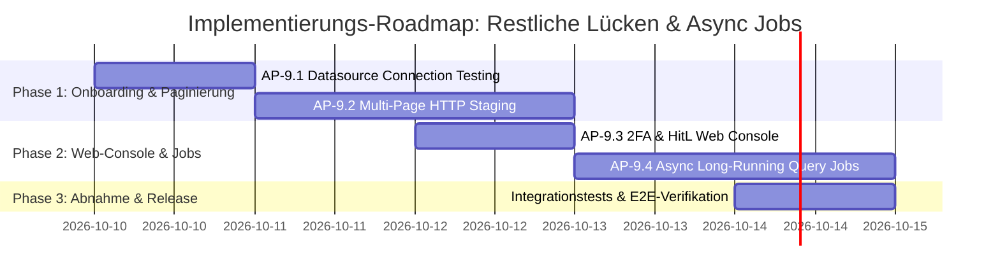

# Architektonischer Implementierungsplan: Datenquellen-Verbindungstest, HTTP-Paginierung, 2FA-Webkonsole & Async Query Jobs

**Dokument-ID:** `PLAN-ONBOARDING-PAGINATION-JOBS-09`  
**Stand:** 09.10.2026 · **Zweig:** `feat/ast-target-dialect-generator`  
**Rolle:** Principal .NET & C# Solution Architect  
**Referenzen:** [Produktmanager Gap-Analyse](file:///root/autheris/docs/plans/00-gesamtplan-uebersicht.md), [Feature Request R-54 bis R-66](file:///root/autheris/docs/plans/2026-10-09-feature-request-admin-datenquellen-und-mcp.md), [Plan 8 Entwickler-Workstreams](file:///root/autheris/docs/plans/plan-workstreams-entwickler-details.md)  
**Status:** Genehmigt & Bereit zur Implementierung ⏳  

---

## 1. Executive Summary & Zielbild

Auf Basis der Produkt- und Gap-Analyse adressiert dieser Implementierungsplan die vier verbleibenden funktionalen und operativen Lücken der Autheris-Plattform:

1. **AP-9.1: Automatischer Verbindungstest für Datenquellen (`POST /api/v1/catalog/datasources/{id}/test` / R-55):**  
   Pre-Flight Connectivity & Authentication Handshake vor der Aktivierung von Datenquellen (Latenzmessung, TLS-Zertifikatsvalidierung, Header-/Secret-Auflösung ohne Daten-Egress).
2. **AP-9.2: Multi-Page HTTP Staging Pagination Engine (R-56):**  
   Erweiterung des `DeclarativeHttpDataSourceExecutor` und des `FederatedStagingService` um native Unterstützung für seitenweises Einlesen (`offset/limit`, `page/size`, `nextLink`, `cursor`), damit Cross-Source-Joins vollständige Datensätze über mehrere Seiten hinweg konsistent in DuckDB aggregieren können.
3. **AP-9.3: Visuelle Web-Konsole im DevPortal für 2FA & HitL Step-Up (R-60 / R-64 UX):**  
   Schlüsselfertige grafische Oberfläche in `Autheris.Api` (`/portal/2fa/enroll`, `/portal/approvals`), die das Scannen des `otpauth://`-QR-Codes und die interaktive Freigabe von Step-Up-Tickets mit 6-stelligem Code ermöglicht.
4. **AP-9.4: Async Long-Running Query Job Engine (`POST /api/v1/jobs/query`, `GET /status`, `GET /result`):**  
   Asynchrone Hintergrund-Ausführung massiver föderierter Abfragen über einen entkoppelten Worker mit Status-Polling, Stornierung (`CancellationTokenSource`) und komprimiertem Streaming-Export (Parquet / Arrow / JSONL).

---

## 2. Architektonische Entscheidungen & Invarianten

| ADR | Thema | Entscheidung | Begründung & Invariante |
|---|---|---|---|
| **ADR-09.1** | **Connection Testing** | **Zero-Data Probe:** Der Verbindungstest liest keine geschäftlichen Nutzdaten, sondern sendet einen `HEAD`- oder limit-beschränkten `GET`-Request (`limit=1`). | Verhindert unbeabsichtigten Datenabfluss und schützt Abrechnungsbudgets vor teuren Full-Scans bei reinen Konnektivitätsprüfungen. |
| **ADR-09.2** | **HTTP Paginierung** | **Budget-Bounded Crawling:** Paginierungsschleifen werden durch harte Obergrenzen (`MaxPages = 50`, `MaxStagedRowsPerTable`, `MaxStagedBytesPerTable`) und Abbruch-Token (`CancellationToken`) begrenzt. | Schutz vor Endlosschleifen bei defekten `nextLink`-Strukturen und Speichersättigung der DuckDB In-Memory OLAP Engine. |
| **ADR-09.3** | **Web-UI Integration** | **Lightweight Server-Rendered HTML im DevPortal:** Keine externe SPA-Build-Kette (Node/npm), sondern kompaktes, sicheres ASP.NET Core HTML-Rendering mit inline SVG QR-Codes (`QRCoder`) und Zero-Trust CSP. | Hält das Gateway-Docker-Image schlank (< 150 MB), minimiert die Angriffsfläche und vermeidet Node.js-Supply-Chain-Risiken. |
| **ADR-09.4** | **Async Job Engine** | **Ephemeral Memory / Distributed State Tracker:** Jobs werden mit TTL (z. B. 24h) im `IDistributedClusterStateProvider` geführt. Abfrageergebnisse werden als gepufferte Parquet/Arrow-Dateien im isolierten Scratch-Verzeichnis abgelegt. | Entlastet den Gateway-Speicher und ermöglicht ausfallsicheres Polling über mehrere Gateway-Replikate hinweg. |

---

## 3. Modellspezifikationen & Verträge (Domain & Application)

### 3.1 Verbindungstest-Modelle (`src/Autheris.Domain/Model/DatasourceTestModels.cs`)

```csharp
namespace Autheris.Domain.Model;

public sealed record DatasourceTestRequest(
    string? CustomUrl = null,
    TimeSpan? Timeout = null);

public sealed record DatasourceTestResult(
    string DatasourceId,
    bool IsSuccess,
    int? HttpStatusCode,
    long LatencyMs,
    string? ErrorMessage,
    IReadOnlyDictionary<string, string> Diagnostics);
```

### 3.2 HTTP Paginierungs-Konfiguration (`src/Autheris.Domain/Model/HttpEndpointDescriptor.cs`)

Erweiterung von `HttpEndpointDescriptor`:

```csharp
public enum HttpPaginationStrategy
{
    None = 0,
    OffsetLimit = 1,     // ?offset=0&limit=100
    PageNumber = 2,      // ?page=1&size=100
    NextLinkUrl = 3,     // Body enthält link zu nächster Seite (z.B. @odata.nextLink oder links.next)
    Cursor = 4           // ?cursor=xyz (extrahiert aus meta.next_cursor)
}

public sealed record HttpPaginationConfig(
    HttpPaginationStrategy Strategy = HttpPaginationStrategy.None,
    string? PageParamName = "page",
    string? SizeParamName = "limit",
    int DefaultPageSize = 100,
    int MaxPages = 50,
    string? NextCursorJsonPath = null,
    string? NextLinkJsonPath = null);
```

### 3.3 Async Job Modelle (`src/Autheris.Domain/Model/AsyncJobModels.cs`)

```csharp
namespace Autheris.Domain.Model;

public enum AsyncJobState
{
    Queued = 0,
    Running = 1,
    Completed = 2,
    Failed = 3,
    Cancelled = 4
}

public sealed record AsyncQueryJobRequest(
    string Query,
    string Format = "json", // "json", "parquet", "csv"
    int MaxRows = 100_000,
    TimeSpan? Timeout = null);

public sealed record AsyncJobStatusResponse(
    string JobId,
    AsyncJobState State,
    DateTimeOffset CreatedAt,
    DateTimeOffset? StartedAt,
    DateTimeOffset? CompletedAt,
    long? RowsProduced,
    long? BytesProduced,
    string? ErrorMessage,
    string? ResultDownloadUrl);
```

---

## 4. Detaillierte Spezifikation der Arbeitspakete

```mermaid
flowchart TD
    subgraph AP91["AP-9.1: Datasource Connection Testing"]
        TEST_SVC["IDatasourceTestingService<br/>(Health Probing & Handshake)"]
        TEST_EP["POST /api/v1/catalog/datasources/{id}/test"]
    end

    subgraph AP92["AP-9.2: Multi-Page HTTP Staging"]
        PAGE_EXEC["DeclarativeHttpDataSourceExecutor<br/>(ExecutePagedRequestsAsync)"]
        STAGE_PAGE["FederatedStagingService<br/>(Budget-Enforced Multi-Page Ingest)"]
    end

    subgraph AP93["AP-9.3: 2FA & HitL Web Console"]
        PORTAL_2FA["/portal/2fa/enroll<br/>(SVG QR-Code & Secret Rendering)"]
        PORTAL_HITL["/portal/approvals<br/>(Interactive Step-Up Modal)"]
    end

    subgraph AP94["AP-9.4: Async Query Job Engine"]
        JOB_MGR["IAsyncQueryJobManager<br/>(Background Channel & Execution)"]
        JOB_EP["/api/v1/jobs/query<br/>(Submit · Status · Download)"]
    end

    TEST_SVC --> TEST_EP
    PAGE_EXEC --> STAGE_PAGE
    PORTAL_2FA --> PORTAL_HITL
    JOB_MGR --> JOB_EP
```



---

### 4.1 Arbeitspaket 9.1: Datasource Connection Testing (R-55)

* **Ziel:** Administratoren können angebundene Web-APIs und SQL-Datenquellen auf Konnektivität, TLS und Authentifizierung prüfen, bevor sie aktiviert werden.
* **Dateien:**
  - `src/Autheris.Application/Catalog/Interfaces/IDatasourceTestingService.cs`
  - `src/Autheris.Application/Catalog/Services/DatasourceTestingService.cs`
  - `src/Autheris.Api/Endpoints/CatalogApiEndpoints.cs` (Endpunkt `POST /api/v1/catalog/datasources/{id}/test`)
* **Implementierungslogik:**
  1. Auflösung der Datenquelle über `ITableMetadataRepository` oder DataSource-Registry.
  2. Auflösung der Zugangsdaten aus dem Secret-Vault (`IKeyVaultSecretProvider`), ohne diese offenzulegen.
  3. Ausführung eines leichtgewichtigen Handshakes mit kurzem Timeout (Standard: 5s).
  4. Latenzmessung (`Stopwatch`) und Rückgabe des HTTP-Statuscodes / DB-Handshake-Status.
* **TDD-Tests (`tests/Autheris.Tests.Unit/Catalog/DatasourceTestingServiceTests.cs`):**
  - `TestConnection_ValidHttpSource_ReturnsSuccessWithLatency`: Mock-Server antwortet mit 200 OK $\rightarrow$ Test erfolgreich, Latenz > 0.
  - `TestConnection_InvalidCredentials_ReturnsFailureWithStatus401`: Mock-Server antwortet mit 401 $\rightarrow$ `IsSuccess = false`, Fehlermeldung enthält keinen Klartext-Token.
  - `TestConnection_Timeout_ReturnsFailureWithTimeoutMessage`: Remote-Server reagiert nicht $\rightarrow$ bricht nach Timeout sauber ab.

---

### 4.2 Arbeitspaket 9.2: Multi-Page HTTP Staging Pagination Engine (R-56)

* **Ziel:** Externe Web-APIs, die Ergebnisse über mehrere Seiten verteilen, werden beim Staging für heterogene SQL-Joins vollständig eingelesen.
* **Dateien:**
  - `src/Autheris.Domain/Model/HttpEndpointDescriptor.cs` (`HttpPaginationConfig`)
  - `src/Autheris.Application/Services/DeclarativeHttpDataSourceExecutor.cs` (`ExecutePagedRequestsAsync`)
  - `src/Autheris.Application/Olap/FederatedStagingService.cs`
* **Implementierungslogik:**
  1. Prüfen, ob `HttpPaginationConfig.Strategy != None` konfiguriert ist.
  2. Schleifenausführung:
     - **Offset/Limit:** `offset = pageIndex * pageSize`, Abbruch wenn Rückgabemenge `< pageSize` oder `pageIndex >= MaxPages`.
     - **NextLinkUrl:** Folgt der URL aus `doc.RootElement.SelectToken(NextLinkJsonPath)`, solange nicht `null`.
     - **Cursor:** Setzt `cursor = extractedCursor`, Abbruch wenn kein neuer Cursor geliefert wird.
  3. Aggregation aller Zeilen in `List<IReadOnlyDictionary<string, object?>>`.
  4. Einhaltung des `FederationBudget`: Bricht ab, sobald `MaxStagedRowsPerTable` erreicht wird (`ConnectorRowLimitExceededException`).
* **TDD-Tests (`tests/Autheris.Tests.Unit/Federation/HttpPaginationExecutionTests.cs`):**
  - `ExecutePaged_OffsetLimit_FetchesAllPagesUntilExhausted`: 3 Seiten à 10 Datensätze $\rightarrow$ liefert 30 Datensätze.
  - `ExecutePaged_NextLink_FollowsLinksCorrectly`: Folgt `@odata.nextLink` bis zum Ende.
  - `ExecutePaged_ExceedsMaxPages_StopsAtConfiguredLimit`: Verhindert Endlosschleifen bei zirkulären Links.

---

### 4.3 Arbeitspaket 9.3: 2FA & HitL Web Console im DevPortal (R-60 / R-64 UX)

* **Ziel:** Administratoren und Genehmiger erhalten eine Zero-Dependency Web-Konsole im DevPortal für QR-Code-Setup und One-Click 2FA-Bestätigung.
* **Dateien:**
  - `src/Autheris.Api/Endpoints/DevPortalEndpoints.cs`
  - `src/Autheris.Api/Endpoints/HitLEndpoints.cs`
* **Implementierungslogik:**
  1. **`/portal/2fa/enroll`:**
     - Ruft `ITotpVerificationService.GenerateEnrollment` auf.
     - Rendert den QR-Code als reines SVG direkt ins HTML (keine externen Image-CDNs, datenschutzkonform).
     - Bietet Eingabefeld für 6-stelligen Code zur initialen Verifikation.
  2. **`/portal/approvals`:**
     - Zeigt offene Step-Up-Tickets und geplante MCP-Access-Diffs (`planId`, betroffene Personen, Spalten, Maskierungsgrad).
     - Formular zur Eingabe des 6-stelligen TOTP-Einmalcodes aus Microsoft/Google Authenticator oder 1Password.
     - Bei Erfolg: Erzeugung des `confirmationToken` und direkte Bestätigung.
* **TDD-Tests (`tests/Autheris.Tests.Integration/DevPortalTwoFactorConsoleTests.cs`):**
  - `GetPortal2FaEnroll_ReturnsHtmlWithEmbeddedSvgQrCode`: Prüft, dass SVG-Inhalt und Base32-Schlüssel im HTML vorhanden sind.
  - `PostPortalApproval_WithValidTotp_ConfirmsTicket`: Führt erfolgreiche Bestätigung durch.

---

### 4.4 Arbeitspaket 9.4: Async Long-Running Query Job Engine

* **Ziel:** Abfragen mit extrem langen Laufzeiten (z. B. komplexe Cross-Source-Joins über Millionen Zeilen) blockieren keine HTTP-Sockets und können asynchron gepuffert und exportiert werden.
* **Dateien:**
  - `src/Autheris.Domain/Model/AsyncJobModels.cs`
  - `src/Autheris.Application/Jobs/Interfaces/IAsyncQueryJobManager.cs`
  - `src/Autheris.Application/Jobs/Services/AsyncQueryJobManager.cs`
  - `src/Autheris.Api/Endpoints/AsyncJobEndpoints.cs`
* **Endpunkte:**
  - `POST /api/v1/jobs/query`: Reicht Abfrage ein $\rightarrow$ liefert `202 Accepted` mit `{ "jobId": "...", "statusUrl": "..." }`.
  - `GET /api/v1/jobs/{jobId}/status`: Fragt Zustand ab (`Queued`, `Running`, `Completed`, `Failed`, Zeilenanzahl).
  - `GET /api/v1/jobs/{jobId}/result`: Streamt das fertige Ergebnis (z. B. als Parquet, CSV oder JSON).
  - `DELETE /api/v1/jobs/{jobId}`: Storniert den laufenden Job über dessen `CancellationTokenSource`.
* **TDD-Tests (`tests/Autheris.Tests.Unit/Jobs/AsyncQueryJobManagerTests.cs`):**
  - `SubmitJob_EnqueuesAndExecutesSuccessfully`: Job wird eingereiht, wechselt auf `Running` und schließt mit `Completed` ab.
  - `CancelJob_AbortsExecutionAndCleansUp`: Storniert laufenden Job via CTS.

---

## 5. Umsetzungs-Roadmap & Aufwände



| Arbeitspaket | Aufwand | Risiko | Betroffene Komponenten |
|---|---|---|---|
| **AP-9.1 (Connection Test)** | 1.0 Tage | Gering | `CatalogApiEndpoints.cs`, `DatasourceTestingService.cs` |
| **AP-9.2 (HTTP Paginierung)** | 1.5 Tage | Mittel | `DeclarativeHttpDataSourceExecutor.cs`, `FederatedStagingService.cs` |
| **AP-9.3 (2FA Web Console)** | 1.0 Tage | Gering | `DevPortalEndpoints.cs`, `HitLEndpoints.cs` |
| **AP-9.4 (Async Job Engine)** | 1.5 Tage | Mittel | `AsyncJobEndpoints.cs`, `AsyncQueryJobManager.cs` |
| **Gesamtaufwand** | **5.0 Tage** | **Gering** | **Application, Api, DevPortal, Tests** |

---

## 6. Definition of Done (DoD)

- [ ] Sämtliche Unit- und Integrationstests für AP-9.1 bis AP-9.4 implementiert und 100% grün.
- [ ] 0 Compiler-Warnungen (`TreatWarningsAsErrors=true`).
- [ ] Alle neuen Quellcode-Dateien halten das Limit von $\le 800$ Zeilen strikt ein.
- [ ] Keine Klartext-Secrets in Logs, Antworten oder Fehlermeldungen.
- [ ] Gesamtübersicht in `docs/plans/00-gesamtplan-uebersicht.md` aktualisiert.
