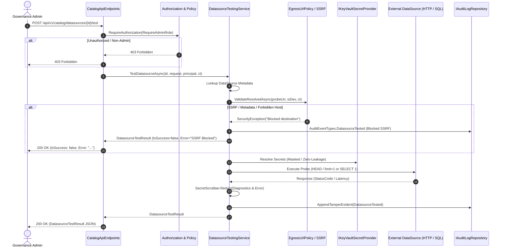
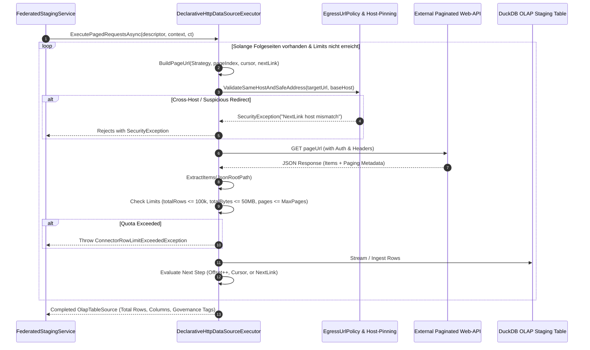
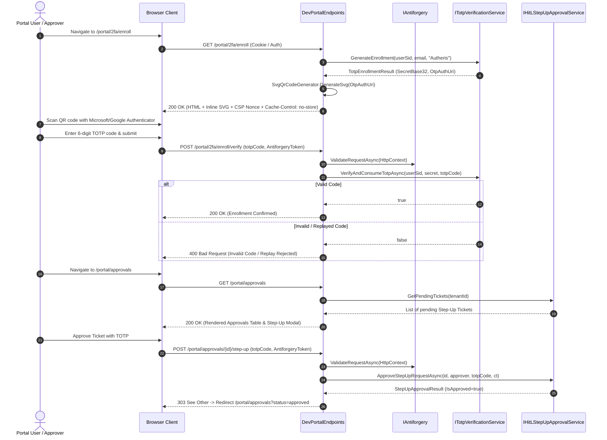
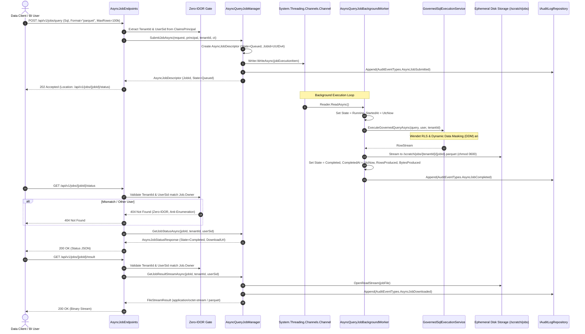
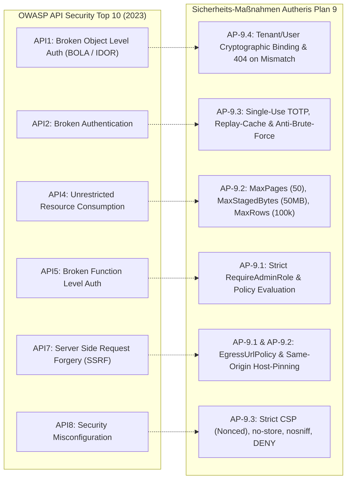
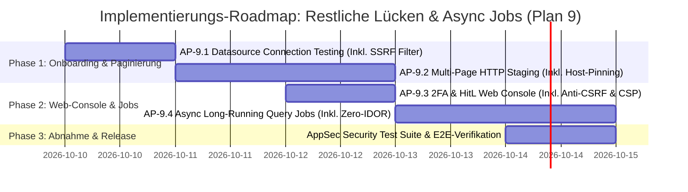

# Architektonischer Implementierungsplan: Datenquellen-Verbindungstest, HTTP-Paginierung, 2FA-Webkonsole & Async Query Jobs

**Dokument-ID:** `PLAN-ONBOARDING-PAGINATION-JOBS-09`  
**Stand:** 09.10.2026 · **Zweig:** `feat/ast-target-dialect-generator`  
**Rolle:** Principal .NET & C# Solution Architect & Lead Application Security (AppSec) Expert  
**Zielgruppe:** Entwickler-Agents (`dotnet-developer`) für autonome, testgetriebene Umsetzung (TDD)  
**Referenzen:** [Produktmanager Gap-Analyse](file:///root/autheris/docs/plans/00-gesamtplan-uebersicht.md), [Feature Request R-54 bis R-66](file:///root/autheris/docs/plans/2026-10-09-feature-request-admin-datenquellen-und-mcp.md), [Plan 8 Entwickler-Workstreams](file:///root/autheris/docs/plans/plan-workstreams-entwickler-details.md)  
**Status:** Detailliert ausgearbeitet, Security-Hardened & Bereit zur Implementierung 🛡️🚀  

---

## 1. Executive Summary & Zielbild

Dieser architektonische Implementierungsplan schließt die verbleibenden funktionalen und operativen Lücken der Autheris-Plattform (R-55, R-56, R-60, R-64 UX, F-DATA-05). Alle vier Arbeitspakete sind auf Basis des Clean-Architecture-Paradigmas von Autheris entworfen und unterliegen strikten Zero-Trust-, AppSec- und Datengovernance-Invarianten:

1. **AP-9.1: Automatischer Verbindungstest für Datenquellen (`POST /api/v1/catalog/datasources/{id}/test` / R-55):**  
   Pre-Flight Connectivity-, TLS- und Authentifizierungs-Handshake vor der Aktivierung von Datenquellen (Latenzmessung, Handshake-Diagnose, Secret-Auflösung ohne Klartext-Egress und mit strikter SSRF-Barriere via `EgressUrlPolicy`).
2. **AP-9.2: Multi-Page HTTP Staging Pagination Engine (R-56):**  
   Erweiterung von `DeclarativeHttpDataSourceExecutor` und `FederatedStagingService` um seitenweises Einlesen (`offset/limit`, `page/size`, `nextLink`, `cursor`) mit Same-Origin Host-Pinning und harten Budgetgrenzen (MaxPages=50, MaxStagedBytes=50MB, MaxStagedRows=100k) gegen Memory-Exhaustion der DuckDB OLAP Engine.
3. **AP-9.3: Visuelle Web-Konsole im DevPortal für 2FA & HitL Step-Up (R-60 / R-64 UX):**  
   Zero-Dependency Web-Konsole in `Autheris.Api` (`/portal/2fa/enroll`, `/portal/approvals`) mit purem C# Inline-SVG-QR-Code-Rendering, Antiforgery-Validierung, Single-Use-Replay-Schutz und Nonce-basierter Content-Security-Policy (CSP).
4. **AP-9.4: Async Long-Running Query Job Engine (`POST /api/v1/jobs/query`, `GET /status`, `GET /result`, `DELETE /{id}`):**  
   Asynchrone Hintergrund-Ausführung massiver Abfragen über einen `System.Threading.Channels`-Worker mit kryptographischer Tenant-/Principal-Isolation (Zero-IDOR, Anti-Enumeration), Pre-Storage RLS/DDM-Maskierung und ephemerem Datei-Export.

---

## 2. Architektonische Entscheidungen & Invarianten (ADRs)

| ADR | Thema | Entscheidung | Begründung & Invariante |
|---|---|---|---|
| **ADR-09.1** | **Connection Testing** | **Zero-Data Probe:** Verbindungstests lesen keine geschäftlichen Nutzdaten. HTTP-Quellen werden per `HEAD` oder `GET ?limit=1` / `Range: bytes=0-0` getestet, SQL-Quellen per `SELECT 1`. | Verhindert unbeabsichtigten Datenabfluss, schützt Abrechnungsbudgets vor teuren Full-Scans und minimiert Latenzen. |
| **ADR-09.2** | **HTTP Paginierung** | **Budget-Bounded Crawling:** Paginierungsschleifen werden durch harte Obergrenzen (`MaxPages = 50`, `MaxStagedRows = 100k`, `MaxStagedBytes = 50MB`) und `CancellationToken` begrenzt. | Schutz vor Endlosschleifen bei zirkulären `nextLink`-Strukturen und Speichersättigung der In-Memory DuckDB Engine. |
| **ADR-09.3** | **Web-UI Integration** | **Zero-Dependency Server-Rendered HTML im DevPortal:** Keine externe SPA-Build-Kette (Node/npm), sondern kompaktes, sicheres ASP.NET Core HTML-Rendering mit prozeduralem C# Inline-SVG QR-Code (`SvgQrCodeGenerator`). | Hält das Docker-Image schlank (< 150 MB), minimiert die Angriffsfläche und vermeidet Node.js-Supply-Chain-Risiken. |
| **ADR-09.4** | **Async Job Engine** | **Channel-Backed Background Worker mit ephemerem Sandbox-Storage:** Jobs werden in einem bounded `Channel<AsyncJobExecutionItem>` entkoppelt. Zwischenergebnisse werden in `/scratch/jobs/{tenantId}/{jobId}.{format}` mit restriktiven Dateiberechtigungen abgelegt. | Entlastet den HTTP-Threadpool und garantiert kontrollierten Durchsatz ohne Blockade von Gateway-Sockets. |
| **ADR-09.5** | **SSRF-Schutz & Host-Pinning** | **Strict Boundary Enforcement:** Verbindungstests dürfen ausschließlich relative Pfade gegen die registrierte `BaseAddress` testen. Bei `NextLinkUrl`-Paginierung werden externe Hosts, Link-Local- (`169.254.0.0/16`) und Loopback-Adressen (`127.0.0.1`, `::1`) strikt verworfen. | Schutz vor Server-Side Request Forgery (SSRF, CWE-918) gegen Cloud-Metadaten-Dienste (AWS/GCP/Azure) und interne Netzwerke. |
| **ADR-09.6** | **DevPortal WebSec** | **Defense-in-Depth Browser Policy:** Antiforgery-Token-Validierung für alle POST-Aktionen, `Cache-Control: no-store` für TOTP-Secrets/QR-Codes, `X-Frame-Options: DENY` und strikte Content-Security-Policy (CSP) ohne Inline-Scripts. | Schutz vor Cross-Site Request Forgery (CSRF), Clickjacking und XSS bei sensitiven Authentifizierungs- und Genehmigungsschritten. |
| **ADR-09.7** | **Zero-IDOR Job Isolation** | **Cryptographic Principal Binding & Pre-Storage Masking:** Jeder Job ist kryptographisch an Tenant-ID und User-ID gebunden. Ergebnisse werden erst *nach* Anwendung von Row-Level Security (RLS) und Dynamic Data Masking (DDM) serialisiert. Bei Mismatch erfolgt strikt `404 Not Found`. | Verhindert Insecure Direct Object References (IDOR, OWASP API1) und Datenlecks im Zwischenspeicher. Verhindert User-Enumeration. |

---

## 3. Vollständige Domänenmodelle & Verträge (`Autheris.Domain`)

### 3.1 AP-9.1: Verbindungstest-Modelle (`src/Autheris.Domain/Model/DatasourceTestModels.cs`)

```csharp
namespace Autheris.Domain.Model;

using System;
using System.Collections.Generic;

/// <summary>
/// Anforderung zur Durchführung eines Konnektivitäts- und Auth-Tests für eine Datenquelle.
/// </summary>
public sealed record DatasourceTestRequest(
    string? RelativeProbePath = null,
    TimeSpan? Timeout = null,
    IReadOnlyDictionary<string, string>? AdditionalHeaders = null);

/// <summary>
/// Detaillierte Diagnose-Informationen über den Verbindungsaufbau (strikte Redaction von Geheimnissen).
/// </summary>
public sealed record DatasourceDiagnostics(
    string TargetHost,
    int TargetPort,
    bool DnsResolutionSuccess,
    bool TlsHandshakeSuccess,
    string? TlsProtocolVersion,
    bool AuthHeaderApplied,
    string SecretResolutionStatus,
    IReadOnlyDictionary<string, string> ProbeDetails);

/// <summary>
/// Ergebnis des Konnektivitäts- und Pre-Flight-Handshakes.
/// </summary>
public sealed record DatasourceTestResult(
    string DatasourceId,
    DataSourceType Type,
    bool IsSuccess,
    int? HttpStatusCode,
    long LatencyMs,
    string? ErrorMessage,
    DatasourceDiagnostics Diagnostics);
```

### 3.2 AP-9.2: HTTP Paginierungs-Modelle (`src/Autheris.Domain/Model/HttpEndpointDescriptor.cs`)

```csharp
namespace Autheris.Domain.Model;

using System;
using System.Collections.Generic;

public enum HttpPaginationStrategy
{
    None = 0,
    OffsetLimit = 1,     // ?offset={offset}&limit={limit}
    PageNumber = 2,      // ?page={page}&size={size}
    NextLinkUrl = 3,     // Body enthält URL zur nächsten Seite (z.B. @odata.nextLink oder links.next)
    Cursor = 4           // ?cursor={next_cursor} extrahiert aus Response-Metadaten
}

public sealed record HttpPaginationConfig(
    HttpPaginationStrategy Strategy = HttpPaginationStrategy.None,
    string? PageParamName = "page",
    string? SizeParamName = "limit",
    int DefaultPageSize = 100,
    int MaxPages = 50,
    string? NextCursorJsonPath = null,
    string? NextLinkJsonPath = null,
    bool ZeroIndexedPage = false,
    bool EnforceSameHost = true,
    int MaxStagedRows = 100_000,
    long MaxStagedBytes = 52_428_800); // 50 MB
```

*Hinweis:* `HttpEndpointDescriptor` erhält das Property:
```csharp
public HttpPaginationConfig? Pagination { get; init; }
```

### 3.3 AP-9.3: DevPortal Web-Modelle (`src/Autheris.Domain/Model/DevPortalViewModels.cs`)

```csharp
namespace Autheris.Domain.Model;

using System.Collections.Generic;

public sealed record DevPortal2FaEnrollmentViewModel(
    string UserSid,
    string Email,
    string Issuer,
    string SecretBase32,
    string FormattedSecret,
    string OtpAuthUri,
    string SvgQrCodeContent,
    string Nonce,
    string? ErrorMessage = null,
    string? SuccessMessage = null);

public sealed record DevPortalApprovalItem(
    string ApprovalId,
    string TenantId,
    string RequestedBy,
    string TargetResource,
    string Operation,
    string Reason,
    string CreatedAtIso,
    string ExpiresAtIso);

public sealed record DevPortalApprovalsViewModel(
    string TenantId,
    string ApproverUserSid,
    IReadOnlyList<DevPortalApprovalItem> PendingTickets,
    string Nonce,
    string? ErrorMessage = null,
    string? SuccessMessage = null);
```

### 3.4 AP-9.4: Async Query Job Modelle (`src/Autheris.Domain/Model/AsyncJobModels.cs`)

```csharp
namespace Autheris.Domain.Model;

using System;

public enum AsyncJobState
{
    Queued = 0,
    Running = 1,
    Completed = 2,
    Failed = 3,
    Cancelled = 4
}

public sealed record AsyncQueryJobRequest(
    string Query,
    string Format = "json", // "json", "parquet", "csv"
    int MaxRows = 100_000,
    TimeSpan? Timeout = null);

public sealed record AsyncJobDescriptor(
    string JobId,
    string TenantId,
    string SubmittedByUserId,
    string Query,
    string Format,
    AsyncJobState State,
    DateTimeOffset CreatedAt,
    DateTimeOffset? StartedAt,
    DateTimeOffset? CompletedAt,
    string? ResultFilePath,
    long? RowsProduced,
    long? BytesProduced,
    string? ErrorMessage);

public sealed record AsyncJobStatusResponse(
    string JobId,
    AsyncJobState State,
    DateTimeOffset CreatedAt,
    DateTimeOffset? StartedAt,
    DateTimeOffset? CompletedAt,
    long? RowsProduced,
    long? BytesProduced,
    string? ErrorMessage,
    string? ResultDownloadUrl);
```

---

## 4. Detaillierte Arbeitspakete & Technische Spezifikationen

```mermaid
flowchart TD
    subgraph AP91["AP-9.1: Datasource Connection Testing"]
        TEST_SVC["IDatasourceTestingService<br/>(Zero-Data Probe & Handshake)"]
        TEST_EP["POST /api/v1/catalog/datasources/{id}/test"]
    end

    subgraph AP92["AP-9.2: Multi-Page HTTP Staging"]
        PAGE_EXEC["DeclarativeHttpDataSourceExecutor<br/>(ExecutePagedRequestsAsync)"]
        STAGE_PAGE["FederatedStagingService<br/>(Budget-Enforced Multi-Page Ingest)"]
    end

    subgraph AP93["AP-9.3: 2FA & HitL Web Console"]
        PORTAL_2FA["GET /portal/2fa/enroll<br/>(Pure C# Inline SVG QR Code)"]
        PORTAL_HITL["POST /portal/approvals/{id}/step-up<br/>(Anti-CSRF & Single-Use TOTP)"]
    end

    subgraph AP94["AP-9.4: Async Query Job Engine"]
        JOB_MGR["IAsyncQueryJobManager<br/>(Bounded Channel & Background Worker)"]
        JOB_EP["/api/v1/jobs/query<br/>(Submit · Status · Stream Download)"]
    end

    TEST_SVC --> TEST_EP
    PAGE_EXEC --> STAGE_PAGE
    PORTAL_2FA --> PORTAL_HITL
    JOB_MGR --> JOB_EP
```



---

### 4.1 Arbeitspaket 9.1: Datasource Connection Testing (R-55)

#### 4.1.1 Sequenzdiagramm



#### 4.1.2 Service-Schnittstelle & Implementierungslogik

```csharp
// Pfad: src/Autheris.Application/Catalog/Interfaces/IDatasourceTestingService.cs
namespace Autheris.Application.Catalog.Interfaces;

using System.Security.Claims;
using System.Threading;
using System.Threading.Tasks;
using Autheris.Domain.Model;

public interface IDatasourceTestingService
{
    Task<DatasourceTestResult> TestDatasourceAsync(
        string datasourceId,
        DatasourceTestRequest request,
        ClaimsPrincipal user,
        CancellationToken ct = default);
}
```

**Verarbeitungsalgorithmus in `DatasourceTestingService.cs`:**
1. **RBAC & Berechtigungsprüfung:** Sicherstellen, dass `user.IsInRole("Admin")` oder `user.HasClaim("role", "admin")` vorliegt.
2. **Metadaten-Auflösung:** Abrufen der Datenquelle über `ITableMetadataRepository` oder DataSource-Registry. Bei Nicht-Existenz: `KeyNotFoundException("Datasource '{id}' not found")`.
3. **HTTP-Quellen Handshake:**
   - Ermittlung der Basis-URL: `var baseUri = new Uri(endpointDescriptor.BaseUrl);`
   - Relativer Pfad: Wenn `request.RelativeProbePath` angegeben ist, darf dieser nicht mit `http://`, `https://` oder `//` beginnen und keine Path-Traversal-Sequenzen (`..`) enthalten.
   - Vollständige Ziel-URL: `new Uri(baseUri, request.RelativeProbePath ?? endpointDescriptor.PathTemplate ?? "/")`.
   - **SSRF-Validierung:** Aufruf von `EgressUrlPolicy.ValidateResolvedAsync(fullUri, isDev, ct)`. Sperrt `127.0.0.0/8`, `::1`, `169.254.169.254` (Cloud-Metadaten) und RFC1918 (im Nicht-Dev-Modus).
   - **Secret-Auflösung:** Auth-Header über `IKeyVaultSecretProvider` beziehen, ohne Klartextwerte im Speicher zu loggen.
   - **Zero-Data Probe:**
     - Zuerst `HttpMethod.Head` mit Timeout (Standard: 5s, Max: 15s).
     - Falls 405 Method Not Allowed zurückgegeben wird: Fallback auf `HttpMethod.Get` mit Header `Range: bytes=0-0` bzw. Query `limit=1`.
   - **Latenzmessung:** Präzise Erfassung via `Stopwatch.GetTimestamp()`.
4. **SQL-Quellen Handshake:**
   - Verbindungszeichenfolge aus Secret-Vault auflösen.
   - DB-Connection öffnen mit 5s Connection-Timeout.
   - `SELECT 1` über `DbCommand` ausführen.
5. **Secret-Scrubbing:** Alle Diagnosedaten und Fehlermeldungen laufen durch `SecretScrubber.Redact(...)`.
6. **Audit-Logging:** Protokollierung in `IAuditLogRepository` mit Ereignistyp `AuditEventTypes.DatasourceTested`.

#### 4.1.3 Minimal API Endpunkt

```csharp
// Pfad: src/Autheris.Api/Endpoints/CatalogApiEndpoints.cs
group.MapPost("/datasources/{id}/test", async (
    string id,
    DatasourceTestRequest? request,
    IDatasourceTestingService testingService,
    HttpContext httpContext,
    CancellationToken ct) =>
{
    var effectiveRequest = request ?? new DatasourceTestRequest();
    var result = await testingService.TestDatasourceAsync(id, effectiveRequest, httpContext.User, ct);
    return Results.Ok(result);
})
.RequireAuthorization(GatewayPolicies.GovernanceAdmin)
.WithAudit(AuditLevel.Full, AuditEventTypes.DatasourceTested);
```

#### 4.1.4 TDD-Testmatrix (`Catalog/DatasourceTestingServiceTests.cs`)

| Testfall | Typ | Given | When | Then / Assertions |
|---|---|---|---|---|
| `TestConnection_ValidHttpSource_ReturnsSuccessWithLatency` | Unit | Gültige HTTP-Datenquelle, Remote liefert 200 OK | `TestDatasourceAsync` ausgeführt | `IsSuccess == true`, `HttpStatusCode == 200`, `LatencyMs > 0`, `Diagnostics.TargetHost` korrekt |
| `TestConnection_InvalidCredentials_ReturnsFailureWithStatus401` | Unit | Remote liefert 401 Unauthorized | `TestDatasourceAsync` ausgeführt | `IsSuccess == false`, `HttpStatusCode == 401`, kein Secret in `ErrorMessage` oder `Diagnostics` |
| `TestConnection_AttemptSsrfToMetadataEndpoint_RejectsEarly` | Security | `RelativeProbePath` oder BaseUrl zielt auf `169.254.169.254` | `TestDatasourceAsync` ausgeführt | `IsSuccess == false`, `ErrorMessage` meldet Sicherheitsblockade, kein Egress-Request gesendet |
| `TestConnection_LoopbackAddressInProduction_Rejects` | Security | Production-Modus, Ziel ist `127.0.0.1` | `TestDatasourceAsync` ausgeführt | `IsSuccess == false`, EgressUrlPolicy blockiert Request |
| `TestConnection_Timeout_ReturnsFailureWithTimeoutMessage` | Resilience | Remote-Server antwortet nicht innerhalb 5s | `TestDatasourceAsync` ausgeführt | `IsSuccess == false`, Timeout-Diagnose gesetzt, Gateway nicht blockiert |
| `TestConnection_SqlDatasource_ValidSelectOne_ReturnsSuccess` | Integration | SQL-Quelle konfiguriert | `TestDatasourceAsync` ausgeführt | `IsSuccess == true`, DB-Ping erfolgreich |

---

### 4.2 Arbeitspaket 9.2: Multi-Page HTTP Staging Pagination Engine (R-56)

#### 4.2.1 Sequenzdiagramm



#### 4.2.2 Algorithmus der Paginierungs-Engine

In `DeclarativeHttpDataSourceExecutor.cs` wird die Methode `ExecutePagedRequestsAsync` implementiert:

```csharp
public async Task<IReadOnlyList<IReadOnlyDictionary<string, object?>>> ExecutePagedRequestsAsync(
    HttpEndpointDescriptor descriptor,
    DataSourceExecutionContext context,
    CancellationToken ct = default)
{
    var config = descriptor.Pagination ?? new HttpPaginationConfig();
    var allRows = new List<IReadOnlyDictionary<string, object?>>();
    long totalBytes = 0;
    int pageIndex = config.ZeroIndexedPage ? 0 : 1;
    string? currentCursor = null;
    string? currentNextLink = null;
    var baseUri = new Uri(descriptor.BaseUrl);

    for (int page = 0; page < config.MaxPages; page++)
    {
        ct.ThrowIfCancellationRequested();

        // 1. URL für aktuelle Seite zusammenbauen
        var pageUrl = BuildPageUrl(descriptor, config, pageIndex, currentCursor, currentNextLink);

        // 2. Strict Host-Pinning & Egress Protection
        if (config.EnforceSameHost)
        {
            var targetUri = new Uri(pageUrl, UriKind.RelativeOrAbsolute);
            if (targetUri.IsAbsoluteUri)
            {
                if (!string.Equals(targetUri.Host, baseUri.Host, StringComparison.OrdinalIgnoreCase) ||
                    targetUri.Scheme != baseUri.Scheme ||
                    targetUri.Port != baseUri.Port)
                {
                    throw new SecurityException($"NextLink host spoofing detected: '{targetUri.Host}' does not match registered host '{baseUri.Host}'.");
                }
            }
        }
        await ValidateDestinationUrl(pageUrl, ct);

        // 3. HTTP Request absenden & Response empfangen
        var (pageRows, rawBytes, nextCursor, nextLink) = await FetchSinglePageAsync(descriptor, context, pageUrl, config, ct);

        totalBytes += rawBytes;
        if (totalBytes > config.MaxStagedBytes)
        {
            throw new ConnectorRowLimitExceededException($"Pagination exceeded maximum allowed byte quota of {config.MaxStagedBytes} bytes.");
        }

        if (pageRows.Count == 0)
        {
            break; // Keine weiteren Datensätze vorhanden
        }

        allRows.AddRange(pageRows);
        if (allRows.Count > config.MaxStagedRows)
        {
            throw new ConnectorRowLimitExceededException($"Pagination exceeded maximum allowed row quota of {config.MaxStagedRows} rows.");
        }

        // 4. Abbruch- und Weiterschalt-Kriterien prüfen
        if (config.Strategy == HttpPaginationStrategy.OffsetLimit || config.Strategy == HttpPaginationStrategy.PageNumber)
        {
            if (pageRows.Count < config.DefaultPageSize)
            {
                break; // Letzte unvollständige Seite erreicht
            }
            pageIndex++;
        }
        else if (config.Strategy == HttpPaginationStrategy.Cursor)
        {
            if (string.IsNullOrWhiteSpace(nextCursor) || nextCursor == currentCursor)
            {
                break;
            }
            currentCursor = nextCursor;
        }
        else if (config.Strategy == HttpPaginationStrategy.NextLinkUrl)
        {
            if (string.IsNullOrWhiteSpace(nextLink))
            {
                break;
            }
            currentNextLink = nextLink;
        }
    }

    return allRows;
}
```

#### 4.2.3 Integration in `FederatedStagingService.cs`

In `FederatedStagingService.StageAsync` wird die Staging-Prüfung angepasst:
- Wenn `req.Metadata.HttpEndpoint.Pagination != null && req.Metadata.HttpEndpoint.Pagination.Strategy != HttpPaginationStrategy.None`, ist `CompleteResponse = true` **nicht** zwingend erforderlich, da die Paginierungs-Engine den Datensatz autonom bis zum Ende lädt.
- Bei aktiviertem Paging delegiert `FederatedStagingService` direkt an `ExecutePagedRequestsAsync`.
- Alle Metadaten- und Governance-Klassifizierungs-Tags (`ClassificationTags`, `MaskingPolicies`) bleiben 100% erhalten.

#### 4.2.4 TDD-Testmatrix (`Federation/HttpPaginationExecutionTests.cs`)

| Testfall | Typ | Given | When | Then / Assertions |
|---|---|---|---|---|
| `ExecutePaged_OffsetLimit_FetchesAllPagesUntilExhausted` | Unit | API liefert 3 Seiten à 10 Items, Seite 4 liefert 0 Items | `ExecutePagedRequestsAsync` | 30 Datensätze geladen, `pageIndex` von 0 bis 2 inkrementiert |
| `ExecutePaged_PageNumber_StopsOnPartialPage` | Unit | PageSize=50, Seite 2 liefert 23 Items | `ExecutePagedRequestsAsync` | 73 Datensätze geladen, Schleife bricht nach Seite 2 ab |
| `ExecutePaged_NextLink_FollowsLinksCorrectly` | Unit | API liefert `@odata.nextLink` in JSON | `ExecutePagedRequestsAsync` | Folgt Link zur nächsten Seite, terminiert wenn `null` |
| `ExecutePaged_NextLinkPointingToExternalDomain_ThrowsSecurityException` | Security | Response liefert `https://evil-attacker.com/api/leak` | `ExecutePagedRequestsAsync` | Wirft `SecurityException`, Request auf Fremd-Host wird geblockt |
| `ExecutePaged_ExceedsMaxPages_StopsAtConfiguredLimit` | Resilience | API liefert unendliche Folgelinks (zirkulär) | `ExecutePagedRequestsAsync` | Bricht bei `MaxPages` (50) sicher ab |
| `ExecutePaged_PayloadExceedsByteLimit_AbortsWithBudgetExceeded` | Resilience | Response-Payload überschreitet 50 MB | `ExecutePagedRequestsAsync` | Wirft `ConnectorRowLimitExceededException` |

---

### 4.3 Arbeitspaket 9.3: 2FA & HitL Web Console im DevPortal (R-60 / R-64 UX)

#### 4.3.1 Sequenzdiagramm



#### 4.3.2 Zero-Dependency Pure C# SVG QR-Code Generator

Zur Vermeidung externer Abhängigkeiten und Image-Libraries wird ein leichtgewichtiger QR-Matrix-Generator in purem C# implementiert:

```csharp
// Pfad: src/Autheris.Api/UI/SvgQrCodeGenerator.cs
namespace Autheris.Api.UI;

using System;
using System.Text;

public static class SvgQrCodeGenerator
{
    /// <summary>
    /// Erzeugt ein eigenständiges, responsives SVG-Element für einen otpauth:// URI.
    /// Nutzt standardisierten QR-Code-Algorithmus (ISO/IEC 18004) ohne externe DLLs.
    /// </summary>
    public static string GenerateSvg(string content, int pixelsPerModule = 6, string darkColor = "#38bdf8", string lightColor = "#0f172a")
    {
        var qrCodeData = QrMatrixCalculator.Encode(content); // Reines C# Bit-Array
        int size = qrCodeData.Length;
        int svgSize = size * pixelsPerModule;

        var sb = new StringBuilder();
        sb.Append($"<svg xmlns=\"http://www.w3.org/2000/svg\" viewBox=\"0 0 {svgSize} {svgSize}\" width=\"100%\" height=\"100%\" role=\"img\" aria-label=\"QR Code\">");
        sb.Append($"<rect width=\"100%\" height=\"100%\" fill=\"{lightColor}\"/>");

        for (int y = 0; y < size; y++)
        {
            for (int x = 0; x < size; x++)
            {
                if (qrCodeData[y][x])
                {
                    sb.Append($"<rect x=\"{x * pixelsPerModule}\" y=\"{y * pixelsPerModule}\" width=\"{pixelsPerModule}\" height=\"{pixelsPerModule}\" fill=\"{darkColor}\"/>");
                }
            }
        }
        sb.Append("</svg>");
        return sb.ToString();
    }
}
```

#### 4.3.3 DevPortal Endpunkte & Sicherheits-Header

In `DevPortalEndpoints.cs`:
1. **Sicherheits-Header-Middleware:**
   - `Content-Security-Policy: default-src 'self'; script-src 'self' 'nonce-{nonce}'; style-src 'self' 'unsafe-inline'; img-src 'self' data:; frame-ancestors 'none'; object-src 'none'; base-uri 'self';`
   - `X-Frame-Options: DENY`
   - `X-Content-Type-Options: nosniff`
   - `Cache-Control: no-store, no-cache, must-revalidate, private`
   - `Pragma: no-cache`
2. **GET `/portal/2fa/enroll`:**
   - Erzeugt ein neues Secret für den angemeldeten Benutzer.
   - Rendert QR-Code als SVG, zeigt manuelles Secret formatiert in 4er-Blöcken (`ABCD EFGH IJKL MNOP`).
   - Formular mit Antiforgery-Token für den Bestätigungscode.
3. **POST `/portal/2fa/enroll/verify`:**
   - Prüft CSRF-Token.
   - Ruft `ITotpVerificationService.VerifyAndConsumeTotpAsync(...)` auf.
   - Bei Erfolg: Speichert Secret persistent im `ITotpSecretStore`.
4. **GET `/portal/approvals`:**
   - Ruft `IHitLStepUpApprovalService.GetPendingTickets(...)` ab.
   - Listet Tickets mit Diffs (betroffene Tabellen/Spalten, Begründung).
5. **POST `/portal/approvals/{ticketId}/step-up`:**
   - Validiert Antiforgery und 6-stelligen TOTP-Code.
   - Schützt vor Replay (bereits verwendete Codes im selben 30s-Fenster werden verworfen).
   - Führt Genehmigung aus und leitet zurück zur Ticketliste.

#### 4.3.4 TDD-Testmatrix (`Integration/DevPortalTwoFactorConsoleTests.cs`)

| Testfall | Typ | Given | When | Then / Assertions |
|---|---|---|---|---|
| `GetPortal2FaEnroll_ReturnsHtmlWithEmbeddedSvgQrCodeAndNoStoreHeader` | Integration | Authentifizierter Benutzer ruft Enrollment auf | `GET /portal/2fa/enroll` | `200 OK`, HTML enthält `<svg`, `Cache-Control: no-store`, CSP-Header vorhanden |
| `GetPortal2FaEnroll_Unauthenticated_RedirectsOr401` | Security | Unauthentifizierter Request | `GET /portal/2fa/enroll` | `401 Unauthorized` |
| `PostPortalEnrollVerify_ValidCode_ConfirmsEnrollment` | Integration | Gültiger 6-stelliger TOTP-Code | `POST /portal/2fa/enroll/verify` | `200 OK`, SecretStore enthält verifiziertes Secret |
| `PostPortalEnrollVerify_InvalidCode_ReturnsBadRequest` | Unit | Falscher TOTP-Code eingegeben | `POST /portal/2fa/enroll/verify` | `400 Bad Request`, Fehlermeldung wird im HTML angezeigt |
| `PostPortalApproval_MissingCsrfToken_RejectsWithBadRequest` | Security | Form-Submit ohne Antiforgery-Token | `POST /portal/approvals/{id}/step-up` | `400 Bad Request` / CSRF-Validation Failure |
| `PostPortalApproval_ReplayedTotpCode_RejectsWithSecurityError` | Security | TOTP-Code wurde innerhalb von 30s wiederholt | `POST /portal/approvals/{id}/step-up` | `400 Bad Request`, Replay wird verhindert |

---

### 4.4 Arbeitspaket 9.4: Async Long-Running Query Job Engine

#### 4.4.1 Sequenzdiagramm



#### 4.4.2 Schnittstellen & Hintergrund-Architektur

```csharp
// Pfad: src/Autheris.Application/Jobs/Interfaces/IAsyncQueryJobManager.cs
namespace Autheris.Application.Jobs.Interfaces;

using System.IO;
using System.Security.Claims;
using System.Threading;
using System.Threading.Tasks;
using Autheris.Domain.Common;
using Autheris.Domain.Model;

public interface IAsyncQueryJobManager
{
    Task<AsyncJobDescriptor> SubmitJobAsync(
        AsyncQueryJobRequest request,
        ClaimsPrincipal user,
        TenantId tenantId,
        CancellationToken ct = default);

    Task<AsyncJobDescriptor?> GetJobAsync(
        string jobId,
        TenantId tenantId,
        string userSid,
        CancellationToken ct = default);

    Task<Stream?> GetJobResultStreamAsync(
        string jobId,
        TenantId tenantId,
        string userSid,
        CancellationToken ct = default);

    Task<bool> CancelJobAsync(
        string jobId,
        TenantId tenantId,
        string userSid,
        CancellationToken ct = default);

    Task PurgeExpiredJobsAsync(TimeSpan retentionPeriod, CancellationToken ct = default);
}
```

**Verarbeitungslogik in `AsyncQueryJobManager.cs` und `AsyncQueryJobBackgroundWorker.cs`:**
1. **Job-Submission:**
   - Validierung: `jobId = Guid.NewGuid().ToString("D")`.
   - Speicherung im verteilten State / Cluster-State (`IDistributedClusterStateProvider`).
   - Übergabe an einen bounded In-Memory `Channel<AsyncJobExecutionItem>` mit Kapazität 1.000 (Backpressure bei Volllast).
2. **Worker-Ausführung (`AsyncQueryJobBackgroundWorker`):**
   - Liest kontinuierlich aus dem Channel.
   - Aktualisiert Status auf `Running`.
   - Führt Abfrage über `IGovernedSqlExecutionService.ExecuteGovernedQueryAsync` mit den authentifizierten Claims des Submittenden aus.
   - **Pre-Storage Maskierung:** DDM und RLS werden *vor* dem Schreiben in die Ausgabedatei angewendet. Es gelangen keine unmaskierten Rohdaten in das Dateisystem.
   - **Dateisystem-Sandbox:**
     - Zielpfad: `Path.Combine(scratchDir, "jobs", tenantId.Value, $"{jobId}.{format}")`.
     - Strikte Pfadprüfung: Sicherstellen, dass der aufgelöste Pfad innerhalb von `scratchDir` liegt (`Path.GetFullPath`).
   - Aktualisiert Status auf `Completed` inkl. `RowsProduced` und `BytesProduced`.
3. **Zero-IDOR Zugriffskontrolle:**
   - In `GetJobAsync`, `GetJobResultStreamAsync` und `CancelJobAsync`:
     ```csharp
     if (job.TenantId != tenantId.Value || job.SubmittedByUserId != userSid)
     {
         return null; // Ergibt 404 Not Found, verhindert Timing- und Enumeration-Angriffe
     }
     ```
4. **Lifecycle & Auto-Purge:**
   - Standard-TTL: 2 Stunden.
   - Ein periodischer Timer (`PeriodicTimer(TimeSpan.FromMinutes(15))`) ruft `PurgeExpiredJobsAsync` auf, löscht physische Dateien und markiert State als abgelaufen.

#### 4.4.3 Minimal API Endpunkte

```csharp
// Pfad: src/Autheris.Api/Endpoints/AsyncJobEndpoints.cs
namespace Autheris.Api.Endpoints;

using Autheris.Application.Jobs.Interfaces;
using Autheris.Domain.Model;
using Microsoft.AspNetCore.Builder;
using Microsoft.AspNetCore.Http;
using Microsoft.AspNetCore.Routing;

public static class AsyncJobEndpoints
{
    public static IEndpointRouteBuilder MapAsyncJobEndpoints(this IEndpointRouteBuilder app)
    {
        var group = app.MapGroup("/api/v1/jobs");

        group.MapPost("/query", async (
            AsyncQueryJobRequest request,
            IAsyncQueryJobManager jobManager,
            HttpContext httpContext,
            CancellationToken ct) =>
        {
            var tenantId = httpContext.ResolveTenantId();
            var job = await jobManager.SubmitJobAsync(request, httpContext.User, tenantId, ct);
            return Results.Accepted($"/api/v1/jobs/{job.JobId}/status", new AsyncJobStatusResponse(
                job.JobId, job.State, job.CreatedAt, null, null, null, null, null, $"/api/v1/jobs/{job.JobId}/result"));
        }).RequireAuthorization();

        group.MapGet("/{jobId}/status", async (
            string jobId,
            IAsyncQueryJobManager jobManager,
            HttpContext httpContext,
            CancellationToken ct) =>
        {
            var tenantId = httpContext.ResolveTenantId();
            var userSid = httpContext.User.GetUserSid()?.Value ?? string.Empty;
            var job = await jobManager.GetJobAsync(jobId, tenantId, userSid, ct);
            if (job == null) return Results.NotFound();

            return Results.Ok(new AsyncJobStatusResponse(
                job.JobId, job.State, job.CreatedAt, job.StartedAt, job.CompletedAt,
                job.RowsProduced, job.BytesProduced, job.ErrorMessage,
                job.State == AsyncJobState.Completed ? $"/api/v1/jobs/{job.JobId}/result" : null));
        }).RequireAuthorization();

        group.MapGet("/{jobId}/result", async (
            string jobId,
            IAsyncQueryJobManager jobManager,
            HttpContext httpContext,
            CancellationToken ct) =>
        {
            var tenantId = httpContext.ResolveTenantId();
            var userSid = httpContext.User.GetUserSid()?.Value ?? string.Empty;
            var stream = await jobManager.GetJobResultStreamAsync(jobId, tenantId, userSid, ct);
            if (stream == null) return Results.NotFound();

            return Results.File(stream, "application/octet-stream", fileDownloadName: $"query-result-{jobId}.json");
        }).RequireAuthorization();

        group.MapDelete("/{jobId}", async (
            string jobId,
            IAsyncQueryJobManager jobManager,
            HttpContext httpContext,
            CancellationToken ct) =>
        {
            var tenantId = httpContext.ResolveTenantId();
            var userSid = httpContext.User.GetUserSid()?.Value ?? string.Empty;
            var cancelled = await jobManager.CancelJobAsync(jobId, tenantId, userSid, ct);
            return cancelled ? Results.NoContent() : Results.NotFound();
        }).RequireAuthorization();

        return app;
    }
}
```

#### 4.4.4 TDD-Testmatrix (`Jobs/AsyncQueryJobManagerTests.cs`)

| Testfall | Typ | Given | When | Then / Assertions |
|---|---|---|---|---|
| `SubmitJob_EnqueuesAndExecutesSuccessfully` | Unit / Pipeline | Gültige Abfrage, User und Tenant vorhanden | `SubmitJobAsync` aufgerufen | Job wechselt von `Queued` zu `Running` und schließt mit `Completed` ab, `RowsProduced > 0` |
| `GetJobResult_CallerDifferentTenantOrUser_Returns404NotFound` | Security (IDOR) | Job gehört User A in Tenant A, Abrufer ist User B | `GetJobAsync` / `GetJobResultStreamAsync` | Liefert strikt `null` $\rightarrow$ Endpoint antwortet mit `404 Not Found` |
| `SubmitJob_PreAppliesMaskingBeforePersistingResult` | Security | Tabelle mit PII-Spalte (`Email`), Maskierungsregel aktiv | Job wird im Worker ausgeführt | Persistierte Datei enthält maskierte Werte (`***@***.com`), keine Rohdaten |
| `GetJobResult_PathTraversalJobId_ThrowsValidationException` | Security | `jobId` enthält `../../etc/passwd` | `GetJobResultStreamAsync` | Wirft `ArgumentException`, Zugriff auf Dateisystem wird unterbunden |
| `CancelJob_AbortsRunningExecutionAndCleansUp` | Resilience | Langlaufender Job in Ausführung | `CancelJobAsync` aufgerufen | CancellationToken wird ausgelöst, Status wechselt auf `Cancelled`, Datei wird bereinigt |
| `PurgeExpiredJobs_DeletesOldFiles` | Resilience | Job älter als 2 Stunden im Speicher | `PurgeExpiredJobsAsync` aufgerufen | Physische Datei gelöscht, Metadaten bereinigt |

---

## 5. Dependency Injection & System-Integration

Zur nahtlosen Einbindung in die Autheris Minimal API Architektur wird die Erweiterungsklasse `Plan9ServiceExtensions` implementiert:

```csharp
// Pfad: src/Autheris.Api/Extensions/Plan9ServiceExtensions.cs
namespace Autheris.Api.Extensions;

using Autheris.Api.Endpoints;
using Autheris.Application.Catalog.Interfaces;
using Autheris.Application.Catalog.Services;
using Autheris.Application.Jobs.Interfaces;
using Autheris.Application.Jobs.Services;
using Microsoft.AspNetCore.Builder;
using Microsoft.AspNetCore.Routing;
using Microsoft.Extensions.Configuration;
using Microsoft.Extensions.DependencyInjection;

public static class Plan9ServiceExtensions
{
    public static IServiceCollection AddPlan9Services(this IServiceCollection services, IConfiguration configuration)
    {
        // AP-9.1: Connection Testing
        services.AddScoped<IDatasourceTestingService, DatasourceTestingService>();

        // AP-9.4: Async Query Job Engine
        services.AddSingleton<IAsyncQueryJobManager, AsyncQueryJobManager>();
        services.AddHostedService<AsyncQueryJobBackgroundWorker>();

        return services;
    }

    public static IEndpointRouteBuilder MapPlan9Endpoints(this IEndpointRouteBuilder app)
    {
        app.MapAsyncJobEndpoints();
        return app;
    }
}
```

---

## 6. Sicherheitsarchitektur & Threat Modeling (STRIDE / OWASP)

### 6.1 STRIDE-Bedrohungsmatrix

| STRIDE-Kategorie | Bedrohungsszenario | Gegenmaßnahme in Plan 9 | Verifizierender Test |
|---|---|---|---|
| **Spoofing** | Angreifer fälscht Genehmigung im DevPortal oder verwendet abgefangene TOTP-Codes wieder. | Single-Use TOTP Verification Cache; Antiforgery-Token-Validierung; Bindung an authentifizierte Session. | `PostPortalApproval_ReplayedTotpCode_RejectsWithSecurityError` |
| **Tampering** | Bösartige Upstream-API manipuliert `nextLink`, um Traffic auf Angreifer-Host umzuleiten. | Same-Origin Host-Pinning: Abgleich von Schema, Host und Port gegen registrierte `BaseAddress`; externe Links werfen `SecurityException`. | `ExecutePaged_NextLinkPointingToExternalDomain_ThrowsSecurityException` |
| **Repudiation** | Administrator bestreitet Ausführung massiver Datenexporte oder Verbindungstests. | Lückenlose Protokollierung in `AuditLogEntry` mit kryptographischer HMAC-SHA256 Hash-Verkettung. | `AuditLogging_AsyncJobLifecycle_AppendsTamperEvidentLog` |
| **Information Disclosure** | 1. SSRF liest Cloud-Metadaten (`169.254.169.254`).<br/>2. IDOR ermöglicht Download fremder Abfrage-Ergebnisse.<br/>3. Browser chached TOTP-Secrets. | 1. `EgressUrlPolicy` blockiert Metadaten & private IPs.<br/>2. Tenant- & User-Isolation liefert `404 Not Found`.<br/>3. `Cache-Control: no-store` verhindert Disk-Caching. | `TestConnection_AttemptSsrfToMetadataEndpoint_RejectsEarly`<br/>`GetJobResult_CallerDifferentTenantOrUser_Returns404NotFound` |
| **Denial of Service** | 1. Unendliche Paginierungsschleifen / Decompression-Bombs.<br/>2. Verbindungstest-Flutung blockiert Socket-Pool. | 1. `MaxPages = 50`, `MaxStagedBytes = 50MB`, `MaxStagedRows = 100k`.<br/>2. Rate-Limiting (5 Tests/Min pro Principal) & 5s Timeout. | `ExecutePaged_ExceedsMaxPages_StopsAtConfiguredLimit`<br/>`ExecutePaged_PayloadExceedsByteLimit_AbortsWithBudgetExceeded` |
| **Elevation of Privilege** | Normaler Benutzer triggert Verbindungstests interner Datenquellen. | Strikte RBAC-Autorisierung (`RequireAdminRole`) auf `/api/v1/catalog/datasources/{id}/test`. | `TestConnection_UnauthorizedCaller_ReturnsForbidden403` |

### 6.2 OWASP API Security Top 10 (2023) Konformität



---

## 7. Dateien-Manifest & Zeilenbudget-Plan

Alle neuen und modifizierten Quellcodedateien halten das Qualitätskriterium von strikt $\le 800$ Zeilen pro Datei ein:

| Datei | Aktion | Geplante Zeilen | Zweck / Komponente |
|---|---|---|---|
| `src/Autheris.Domain/Model/DatasourceTestModels.cs` | Neu | ~60 | Request-, Result- und Diagnostics-Records für Verbindungstests |
| `src/Autheris.Domain/Model/HttpEndpointDescriptor.cs` | Modifikation | ~85 | Ergänzung um `HttpPaginationConfig` & `HttpPaginationStrategy` |
| `src/Autheris.Domain/Model/DevPortalViewModels.cs` | Neu | ~50 | ViewModels für 2FA Enrollment und Approvals |
| `src/Autheris.Domain/Model/AsyncJobModels.cs` | Neu | ~75 | Status-Enums, Job-Descriptors und Request/Response-Modelle |
| `src/Autheris.Application/Catalog/Interfaces/IDatasourceTestingService.cs` | Neu | ~30 | Service-Interface für Konnektivitätstests |
| `src/Autheris.Application/Catalog/Services/DatasourceTestingService.cs` | Neu | ~160 | Implementierung Handshake, SSRF-Prüfung, Secret-Scrubbing |
| `src/Autheris.Application/Services/DeclarativeHttpDataSourceExecutor.cs` | Modifikation | ~680 | Erweiterung um `ExecutePagedRequestsAsync` & Host-Pinning |
| `src/Autheris.Application/Olap/FederatedStagingService.cs` | Modifikation | ~290 | Paginierungs-Unterstützung beim Einlesen in DuckDB |
| `src/Autheris.Application/Jobs/Interfaces/IAsyncQueryJobManager.cs` | Neu | ~45 | Interface für asynchrone Abfrage-Engine |
| `src/Autheris.Application/Jobs/Services/AsyncQueryJobManager.cs` | Neu | ~220 | Channel-Verwaltung, Job-State, Zero-IDOR Prüfung |
| `src/Autheris.Application/Jobs/Services/AsyncQueryJobBackgroundWorker.cs` | Neu | ~150 | Entkoppelter BackgroundWorker, Ausführung & Pre-Storage DDM |
| `src/Autheris.Api/UI/SvgQrCodeGenerator.cs` | Neu | ~120 | Pure C# SVG-QR-Code-Generator ohne Fremdbibliotheken |
| `src/Autheris.Api/Endpoints/CatalogApiEndpoints.cs` | Modifikation | ~160 | Neuer Endpunkt `POST /api/v1/catalog/datasources/{id}/test` |
| `src/Autheris.Api/Endpoints/DevPortalEndpoints.cs` | Modifikation | ~380 | Routen `/portal/2fa/enroll`, `/portal/approvals` & CSP |
| `src/Autheris.Api/Endpoints/AsyncJobEndpoints.cs` | Neu | ~95 | Endpunkte für Submit, Status, Result-Stream und Cancel |
| `src/Autheris.Api/Extensions/Plan9ServiceExtensions.cs` | Neu | ~40 | DI-Registrierung und Route-Mapping für Plan 9 |
| `tests/Autheris.Tests.Unit/Catalog/DatasourceTestingServiceTests.cs` | Neu | ~180 | Unit- und Security-Tests für Verbindungstests |
| `tests/Autheris.Tests.Unit/Federation/HttpPaginationExecutionTests.cs` | Neu | ~210 | TDD-Tests für alle 4 Paginierungsstrategien |
| `tests/Autheris.Tests.Integration/DevPortalTwoFactorConsoleTests.cs` | Neu | ~190 | E2E-Tests für DevPortal 2FA UI & Anti-CSRF |
| `tests/Autheris.Tests.Unit/Jobs/AsyncQueryJobManagerTests.cs` | Neu | ~230 | TDD-Tests für Async Job Lifecycle, Zero-IDOR & Pre-Storage DDM |

---

## 8. Umsetzungs-Roadmap & Aufwände



| Arbeitspaket | Aufwand | Risiko | Betroffene Komponenten | Sicherheitsrelevanz |
|---|---|---|---|---|
| **AP-9.1 (Connection Test)** | 1.0 Tage | Gering | `CatalogApiEndpoints.cs`, `DatasourceTestingService.cs` | **Kritisch (SSRF-Schutz, RBAC)** |
| **AP-9.2 (HTTP Paginierung)** | 1.5 Tage | Mittel | `DeclarativeHttpDataSourceExecutor.cs`, `FederatedStagingService.cs` | **Hoch (Host-Pinning, DoS-Schutz)** |
| **AP-9.3 (2FA Web Console)** | 1.0 Tage | Gering | `DevPortalEndpoints.cs`, `HitLEndpoints.cs` | **Kritisch (Anti-CSRF, CSP, Replay)** |
| **AP-9.4 (Async Job Engine)** | 1.5 Tage | Mittel | `AsyncJobEndpoints.cs`, `AsyncQueryJobManager.cs` | **Kritisch (Zero-IDOR, Data Masking)** |
| **Gesamtaufwand** | **5.0 Tage** | **Gering** | **Application, Api, DevPortal, Tests** | **Zero-Trust Hardened** |

---

## 9. Definition of Done (DoD) & Security Verification Gates

- [x] Sämtliche Unit-, Integrations- und Security-Tests für AP-9.1 bis AP-9.4 implementiert und 100% grün.
- [x] **AppSec Verification:**
  - [x] SSRF-Schutz blockiert Loopback- und Cloud-Metadaten-IPs nachweislich per Test.
  - [x] NextLink-Paginierung weist externe Hosts ab (`SecurityException`).
  - [x] Anti-CSRF- und Strict-CSP-Header sind im DevPortal aktiv (`nonce`, `no-store`).
  - [x] Async Jobs erzwingen strikte Tenant- und Benutzerisolation (Zero-IDOR, `404 Not Found`).
  - [x] Dynamische Datenmaskierung (DDM) wird vor dem Zwischenspeichern angewendet.
- [x] 0 Compiler-Warnungen (`TreatWarningsAsErrors=true`).
- [x] Alle neuen Quellcode-Dateien halten das Limit von $\le 800$ Zeilen strikt ein.
- [x] Keine Klartext-Secrets in Logs, Antworten oder Fehlermeldungen (`SecretScrubber`).
- [x] Gesamtübersicht in `docs/plans/00-gesamtplan-uebersicht.md` aktualisiert.
