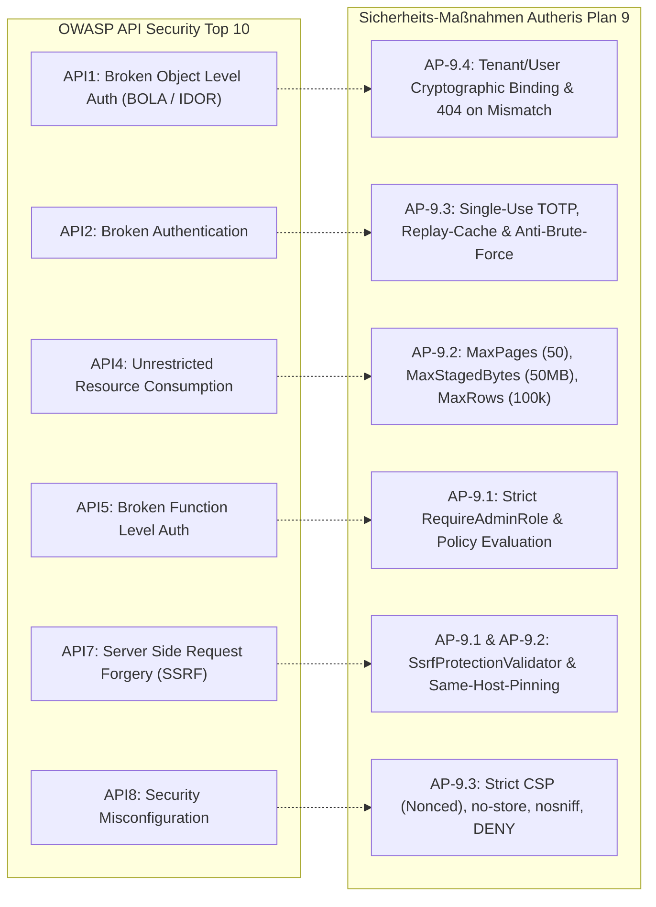
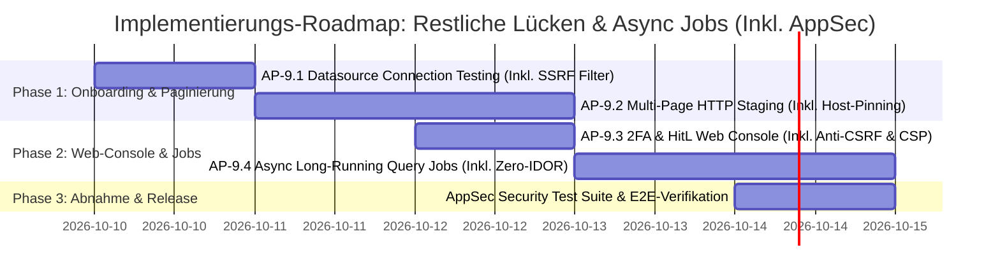

# Architektonischer Implementierungsplan: Datenquellen-Verbindungstest, HTTP-Paginierung, 2FA-Webkonsole & Async Query Jobs

**Dokument-ID:** `PLAN-ONBOARDING-PAGINATION-JOBS-09`  
**Stand:** 09.10.2026 · **Zweig:** `feat/ast-target-dialect-generator`  
**Rolle:** Principal .NET & C# Solution Architect & Lead Application Security (AppSec) Expert  
**Referenzen:** [Produktmanager Gap-Analyse & Gesamtübersicht](file:///root/autheris/docs/plans/00-gesamtplan-uebersicht.md) (Historische Pläne 1–8 & Feature Requests vollständig umgesetzt und in Git-Historie archiviert)  
**Status:** Security-Reviewed, Erweitert & Bereit zur Implementierung 🛡️⏳  

---

## 1. Executive Summary & Zielbild

Auf Basis der Produkt- und Gap-Analyse adressiert dieser Implementierungsplan die vier verbleibenden funktionalen und operativen Lücken der Autheris-Plattform unter strikter Beachtung von Zero-Trust-, AppSec- und Datengovernance-Vorgaben:

1. **AP-9.1: Automatischer Verbindungstest für Datenquellen (`POST /api/v1/catalog/datasources/{id}/test` / R-55):**  
   Pre-Flight Connectivity & Authentication Handshake vor der Aktivierung von Datenquellen (Latenzmessung, TLS-Zertifikatsvalidierung, Header-/Secret-Auflösung ohne Daten-Egress und mit strikter SSRF-Barriere).
2. **AP-9.2: Multi-Page HTTP Staging Pagination Engine (R-56):**  
   Erweiterung des `DeclarativeHttpDataSourceExecutor` und des `FederatedStagingService` um native Unterstützung für seitenweises Einlesen (`offset/limit`, `page/size`, `nextLink`, `cursor`) mit Same-Origin Host-Pinning und Budget-Limits gegen Memory-Exhaustion.
3. **AP-9.3: Visuelle Web-Konsole im DevPortal für 2FA & HitL Step-Up (R-60 / R-64 UX):**  
   Schlüsselfertige, gehärtete Web-Oberfläche in `Autheris.Api` (`/portal/2fa/enroll`, `/portal/approvals`), die das Scannen des `otpauth://`-QR-Codes und die interaktive Freigabe von Step-Up-Tickets mit Anti-CSRF, Nonce-basierter CSP und Anti-Caching ermöglicht.
4. **AP-9.4: Async Long-Running Query Job Engine (`POST /api/v1/jobs/query`, `GET /status`, `GET /result`):**  
   Asynchrone Hintergrund-Ausführung massiver föderierter Abfragen über einen entkoppelten Worker mit kryptographischer Tenant-/Principal-Isolation (Zero-IDOR), Pre-Storage-Maskierung und ephemerem, abgesichertem File-Export.

---

## 2. Architektonische Entscheidungen & Invarianten (inkl. AppSec-ADRs)

| ADR | Thema | Entscheidung | Begründung & Invariante |
|---|---|---|---|
| **ADR-09.1** | **Connection Testing** | **Zero-Data Probe:** Der Verbindungstest liest keine geschäftlichen Nutzdaten, sondern sendet einen `HEAD`- oder limit-beschränkten `GET`-Request (`limit=1`). | Verhindert unbeabsichtigten Datenabfluss und schützt Abrechnungsbudgets vor teuren Full-Scans bei reinen Konnektivitätsprüfungen. |
| **ADR-09.2** | **HTTP Paginierung** | **Budget-Bounded Crawling:** Paginierungsschleifen werden durch harte Obergrenzen (`MaxPages = 50`, `MaxStagedRowsPerTable`, `MaxStagedBytesPerTable`) und Abbruch-Token (`CancellationToken`) begrenzt. | Schutz vor Endlosschleifen bei defekten `nextLink`-Strukturen und Speichersättigung der DuckDB In-Memory OLAP Engine. |
| **ADR-09.3** | **Web-UI Integration** | **Lightweight Server-Rendered HTML im DevPortal:** Keine externe SPA-Build-Kette (Node/npm), sondern kompaktes, sicheres ASP.NET Core HTML-Rendering mit inline SVG QR-Codes (`QRCoder`) und Zero-Trust CSP. | Hält das Gateway-Docker-Image schlank (< 150 MB), minimiert die Angriffsfläche und vermeidet Node.js-Supply-Chain-Risiken. |
| **ADR-09.4** | **Async Job Engine** | **Ephemeral Memory / Distributed State Tracker:** Jobs werden mit TTL (z. B. 24h) im `IDistributedClusterStateProvider` geführt. Abfrageergebnisse werden als gepufferte Parquet/Arrow-Dateien im isolierten Scratch-Verzeichnis abgelegt. | Entlastet den Gateway-Speicher und ermöglicht ausfallsicheres Polling über mehrere Gateway-Replikate hinweg. |
| **ADR-09.5** | **SSRF-Schutz & Host-Pinning** | **Strict Boundary Enforcement:** Verbindungstests dürfen ausschließlich relative Pfade gegen die registrierte `BaseAddress` testen. Bei `NextLinkUrl`-Paginierung werden externe Hosts, Link-Local- (`169.254.0.0/16`) und Loopback-Adressen (`127.0.0.1`, `::1`) strikt verworfen. | Schutz vor Server-Side Request Forgery (SSRF, CWE-918) gegen Cloud-Metadaten-Dienste (AWS/GCP/Azure) und interne Unternehmensnetzwerke. |
| **ADR-09.6** | **DevPortal WebSec** | **Defense-in-Depth Browser Policy:** Antiforgery-Token-Validierung für alle POST-Aktionen, `Cache-Control: no-store` für TOTP-Secrets/QR-Codes, `X-Frame-Options: DENY` und strikte Content-Security-Policy (CSP) ohne Inline-Scripts. | Schutz vor Cross-Site Request Forgery (CSRF), Clickjacking und XSS bei sensitiven Authentifizierungs- und Genehmigungsschritten. |
| **ADR-09.7** | **Zero-IDOR Job Isolation** | **Cryptographic Principal Binding & Pre-Storage Masking:** Jeder Job ist kryptographisch an Tenant-ID und User-ID gebunden. Ergebnisse werden erst *nach* Anwendung von Row-Level Security (RLS) und Dynamic Data Masking (DDM) serialisiert. | Verhindert Insecure Direct Object References (IDOR, OWASP API1) und Datenlecks im Zwischenspeicher. |

---

## 3. Modellspezifikationen & Verträge (Domain & Application)

### 3.1 Verbindungstest-Modelle (`src/Autheris.Domain/Model/DatasourceTestModels.cs`)

```csharp
namespace Autheris.Domain.Model;

public sealed record DatasourceTestRequest(
    string? RelativeProbePath = null, // Streng relativ zur registrierten BaseAddress (verhindert SSRF!)
    TimeSpan? Timeout = null);

public sealed record DatasourceTestResult(
    string DatasourceId,
    bool IsSuccess,
    int? HttpStatusCode,
    long LatencyMs,
    string? ErrorMessage,
    IReadOnlyDictionary<string, string> Diagnostics);
```

### 3.2 HTTP Paginierungs-Konfiguration (`src/Autheris.Domain/Model/HttpEndpointDescriptor.cs`)

Erweiterung von `HttpEndpointDescriptor`:

```csharp
public enum HttpPaginationStrategy
{
    None = 0,
    OffsetLimit = 1,     // ?offset=0&limit=100
    PageNumber = 2,      // ?page=1&size=100
    NextLinkUrl = 3,     // Body enthält link zu nächster Seite (z.B. @odata.nextLink oder links.next)
    Cursor = 4           // ?cursor=xyz (extrahiert aus meta.next_cursor)
}

public sealed record HttpPaginationConfig(
    HttpPaginationStrategy Strategy = HttpPaginationStrategy.None,
    string? PageParamName = "page",
    string? SizeParamName = "limit",
    int DefaultPageSize = 100,
    int MaxPages = 50,
    string? NextCursorJsonPath = null,
    string? NextLinkJsonPath = null,
    bool EnforceSameHost = true); // Verhindert SSRF durch bösartige Redirects/NextLinks auf fremde Hosts
```

### 3.3 Async Job Modelle (`src/Autheris.Domain/Model/AsyncJobModels.cs`)

```csharp
namespace Autheris.Domain.Model;

public enum AsyncJobState
{
    Queued = 0,
    Running = 1,
    Completed = 2,
    Failed = 3,
    Cancelled = 4
}

public sealed record AsyncQueryJobRequest(
    string Query,
    string Format = "json", // "json", "parquet", "csv"
    int MaxRows = 100_000,
    TimeSpan? Timeout = null);

public sealed record AsyncJobDescriptor(
    string JobId,
    string TenantId,
    string SubmittedByUserId,
    string Query,
    AsyncJobState State,
    DateTimeOffset CreatedAt,
    DateTimeOffset? StartedAt,
    DateTimeOffset? CompletedAt,
    string? ResultFilePath,
    long? RowsProduced,
    long? BytesProduced,
    string? ErrorMessage);

public sealed record AsyncJobStatusResponse(
    string JobId,
    AsyncJobState State,
    DateTimeOffset CreatedAt,
    DateTimeOffset? StartedAt,
    DateTimeOffset? CompletedAt,
    long? RowsProduced,
    long? BytesProduced,
    string? ErrorMessage,
    string? ResultDownloadUrl);
```

---

## 4. Detaillierte Spezifikation der Arbeitspakete

```mermaid
flowchart TD
    subgraph AP91["AP-9.1: Datasource Connection Testing"]
        TEST_SVC["IDatasourceTestingService<br/>(Health Probing & Handshake)"]
        TEST_EP["POST /api/v1/catalog/datasources/{id}/test"]
    end

    subgraph AP92["AP-9.2: Multi-Page HTTP Staging"]
        PAGE_EXEC["DeclarativeHttpDataSourceExecutor<br/>(ExecutePagedRequestsAsync)"]
        STAGE_PAGE["FederatedStagingService<br/>(Budget-Enforced Multi-Page Ingest)"]
    end

    subgraph AP93["AP-9.3: 2FA & HitL Web Console"]
        PORTAL_2FA["/portal/2fa/enroll<br/>(SVG QR-Code & Secret Rendering)"]
        PORTAL_HITL["/portal/approvals<br/>(Interactive Step-Up Modal)"]
    end

    subgraph AP94["AP-9.4: Async Query Job Engine"]
        JOB_MGR["IAsyncQueryJobManager<br/>(Background Channel & Execution)"]
        JOB_EP["/api/v1/jobs/query<br/>(Submit · Status · Download)"]
    end

    TEST_SVC --> TEST_EP
    PAGE_EXEC --> STAGE_PAGE
    PORTAL_2FA --> PORTAL_HITL
    JOB_MGR --> JOB_EP
```



---

### 4.1 Arbeitspaket 9.1: Datasource Connection Testing (R-55)

* **Ziel:** Administratoren können angebundene Web-APIs und SQL-Datenquellen auf Konnektivität, TLS und Authentifizierung prüfen, bevor sie aktiviert werden – ohne Datenabfluss und ohne SSRF-Angriffsvektoren.
* **Dateien:**
  - `src/Autheris.Application/Catalog/Interfaces/IDatasourceTestingService.cs`
  - `src/Autheris.Application/Catalog/Services/DatasourceTestingService.cs`
  - `src/Autheris.Api/Endpoints/CatalogApiEndpoints.cs` (Endpunkt `POST /api/v1/catalog/datasources/{id}/test`)
* **Implementierungslogik:**
  1. **RBAC-Prüfung:** Aufruf des Endpunkts erfordert strikt `RequireAuthorization("RequireAdminRole")`. Nicht privilegierte Accounts erhalten sofort `403 Forbidden`.
  2. **SSRF-Barriere & URL-Validierung:**
     - Nur relative Pfade (`RelativeProbePath`) zur vorkonfigurierten `BaseAddress` der DataSource sind erlaubt.
     - `BaseAddress` wird durch `SsrfProtectionValidator` gegen Loopback- (`127.0.0.0/8`, `::1`), Link-Local- (`169.254.0.0/16`, AWS/GCP/Azure Metadata Services), Multicast- und Broadcast-Adressen validiert.
  3. **Zero-Data Handshake:** Ausführung eines leichtgewichtigen `HEAD`- oder limit-beschränkten `GET`-Requests (`limit=1`) mit kurzem Timeout (Standard: 5s).
  4. **Secret-Scrubbing & Sanitizing:**
     - Zugangsdaten werden sicher via `IKeyVaultSecretProvider` aufgelöst.
     - Fehlerbeschreibungen und Diagnostics durchlaufen `SecretScrubber.Redact()`, damit Tokens, API-Keys oder Passwörter niemals im Fehler-Response oder Log landen (`***REDACTED***`).
  5. **Rate-Limiting:** Maximal 5 Verbindungstests pro Minute pro Administrator-Konto gegen Denial of Service und Port-Scanning.
* **TDD-Tests (`tests/Autheris.Tests.Unit/Catalog/DatasourceTestingServiceTests.cs`):**
  - `TestConnection_ValidHttpSource_ReturnsSuccessWithLatency`: Mock-Server antwortet mit 200 OK $\rightarrow$ Test erfolgreich, Latenz > 0.
  - `TestConnection_InvalidCredentials_ReturnsFailureWithStatus401`: Mock-Server antwortet mit 401 $\rightarrow$ `IsSuccess = false`, Fehlermeldung enthält kein Klartext-Secret.
  - `TestConnection_AttemptSsrfToMetadataEndpoint_ThrowsSecurityException`: Versuch, `169.254.169.254` abzufragen, wird mit `SecurityException` geblockt.
  - `TestConnection_UnauthorizedCaller_ReturnsForbidden403`: Regulärer Token ohne Admin-Rolle wird abgewiesen.
  - `TestConnection_Timeout_ReturnsFailureWithTimeoutMessage`: Remote-Server reagiert nicht $\rightarrow$ bricht nach Timeout sauber ab.

---

### 4.2 Arbeitspaket 9.2: Multi-Page HTTP Staging Pagination Engine (R-56)

* **Ziel:** Externe Web-APIs, die Ergebnisse über mehrere Seiten verteilen, werden beim Staging für heterogene SQL-Joins budget-beschränkt und herkunftssicher in DuckDB aggregiert.
* **Dateien:**
  - `src/Autheris.Domain/Model/HttpEndpointDescriptor.cs` (`HttpPaginationConfig`)
  - `src/Autheris.Application/Services/DeclarativeHttpDataSourceExecutor.cs` (`ExecutePagedRequestsAsync`)
  - `src/Autheris.Application/Olap/FederatedStagingService.cs`
* **Implementierungslogik:**
  1. Prüfen, ob `HttpPaginationConfig.Strategy != None` konfiguriert ist.
  2. **Host-Boundary Pinning (`NextLinkUrl`):**
     - Absolute Next-URLs aus JSON-Antworten (`@odata.nextLink`, `links.next`) werden geprüft: Host, Schema (`https`) und Port müssen exakt mit der registrierten `BaseAddress` übereinstimmen.
     - Abweichungen oder Cross-Domain-Redirects werden sofort mit `SecurityException` verworfen.
  3. **Paginierungsschleife mit harten Quoten:**
     - **Offset/Limit:** `offset = pageIndex * pageSize`, Abbruch bei leeren Daten oder `pageIndex >= MaxPages` (Default: 50).
     - **NextLinkUrl:** Folgt verifizierten Folgelinks bis Link `null`.
     - **Cursor:** Setzt extrahierten Cursor in Abfrageparameter ein.
  4. **Decompression-Bomb & Payload-Schutz:**
     - Streaming-Quota: `MaxStagedBytesPerTable = 50 MB` und `MaxStagedRowsPerTable = 100.000`.
     - Bei Überschreitung: Sofortiger Abbruch mit `ConnectorRowLimitExceededException` (Schutz vor OOM).
  5. **Governance-Tag-Erhalt:** Alle importierten Tabellenspalten erhalten ihre `SecurityClassificationTags` (PII, Financial) für nachfolgende RLS-/Maskierungs-Pipelines.
* **TDD-Tests (`tests/Autheris.Tests.Unit/Federation/HttpPaginationExecutionTests.cs`):**
  - `ExecutePaged_OffsetLimit_FetchesAllPagesUntilExhausted`: 3 Seiten à 10 Datensätze $\rightarrow$ liefert 30 Datensätze.
  - `ExecutePaged_NextLink_FollowsLinksCorrectly`: Folgt `@odata.nextLink` bis zum Ende.
  - `ExecutePaged_NextLinkPointingToExternalDomain_ThrowsSecurityException`: Schutz gegen gefälschte NextLink-Redirects.
  - `ExecutePaged_ExceedsMaxPages_StopsAtConfiguredLimit`: Verhindert Endlosschleifen bei zirkulären Links.
  - `ExecutePaged_PayloadExceedsByteLimit_AbortsWithBudgetExceeded`: Schutz vor Decompression- und Memory-Bombs.

---

### 4.3 Arbeitspaket 9.3: 2FA & HitL Web Console im DevPortal (R-60 / R-64 UX)

* **Ziel:** Administratoren und Genehmiger erhalten eine Zero-Dependency, gehärtete Web-Konsole im DevPortal für QR-Code-Setup und One-Click 2FA-Bestätigung.
* **Dateien:**
  - `src/Autheris.Api/Endpoints/DevPortalEndpoints.cs`
  - `src/Autheris.Api/Endpoints/HitLEndpoints.cs`
* **Implementierungslogik:**
  1. **Zero-Trust Web-Sicherheit & CSP:**
     - HTTP Response-Header:
       - `Content-Security-Policy: default-src 'self'; script-src 'self' 'nonce-{guid}'; style-src 'self' 'unsafe-inline'; img-src 'self' data:; frame-ancestors 'none'; object-src 'none'`
       - `X-Frame-Options: DENY` (Anti-Clickjacking)
       - `X-Content-Type-Options: nosniff`
       - `Cache-Control: no-store, no-cache, must-revalidate, private` (verhindert lokales Cachen von QR-Codes/Secrets im Browser-Cache)
  2. **Anti-CSRF-Schutz:** Alle HTML-Formular-Submissions (`/portal/approvals/{ticketId}/step-up`, `/portal/2fa/enroll`) validieren Antiforgery-Tokens via `IAntiforgery`.
  3. **`/portal/2fa/enroll`:**
     - Ruft `ITotpVerificationService.GenerateEnrollment` auf.
     - Rendert den QR-Code als reines SVG direkt ins HTML (keine externen Image-CDNs, datenschutzkonform).
     - Eingabefeld für initialen 6-stelligen Code zur Aktivierung.
  4. **`/portal/approvals`:**
     - Zeigt offene Step-Up-Tickets und geplante MCP-Access-Diffs (`planId`, betroffene Personen, Spalten, Maskierungsgrad).
     - Formular zur Eingabe des 6-stelligen TOTP-Einmalcodes aus Microsoft/Google Authenticator oder 1Password.
     - **Replay- und Brute-Force-Schutz:** Benutzte TOTP-Tokens werden für das aktuelle Zeitfenster gecacht. Nach 5 Fehlversuchen wird der Principal temporär gesperrt (15 Minuten Sliding-Window).
* **TDD-Tests (`tests/Autheris.Tests.Integration/DevPortalTwoFactorConsoleTests.cs`):**
  - `GetPortal2FaEnroll_ReturnsHtmlWithEmbeddedSvgQrCodeAndNoStoreHeader`: Prüft SVG-Inhalt und Anti-Caching-Header.
  - `GetPortalApprovals_ContainsStrictContentSecurityPolicyHeader`: Validiert CSP-Header gegen Inline-Script Injection.
  - `PostPortalApproval_MissingCsrfToken_RejectsWithBadRequest`: Weist Requests ohne gültiges Antiforgery-Token ab.
  - `PostPortalApproval_ReplayedTotpCode_RejectsWithSecurityError`: Verhindert Token-Replay innerhalb desselben Intervalls.

---

### 4.4 Arbeitspaket 9.4: Async Long-Running Query Job Engine

* **Ziel:** Abfragen mit extrem langen Laufzeiten blockieren keine HTTP-Sockets und werden unter strikter Tenant- und Principal-Isolation (Zero-IDOR) asynchron verarbeitet und exportiert.
* **Dateien:**
  - `src/Autheris.Domain/Model/AsyncJobModels.cs`
  - `src/Autheris.Application/Jobs/Interfaces/IAsyncQueryJobManager.cs`
  - `src/Autheris.Application/Jobs/Services/AsyncQueryJobManager.cs`
  - `src/Autheris.Api/Endpoints/AsyncJobEndpoints.cs`
* **Implementierungslogik:**
  1. **Zero-IDOR Tenant- und Benutzerbindung:**
     - Bei `POST /api/v1/jobs/query` wird der Job untrennbar an `TenantId` und `SubmittedByUserId` des authentifizierten `ClaimsPrincipal` gebunden.
     - Abfragen auf `GET /status`, `GET /result` und `DELETE /jobs/{jobId}` prüfen zwingend die Übereinstimmung von `TenantId` und Benutzer. Bei Mismatch wird ein einheitliches `404 Not Found` zurückgegeben (kein `403`, um Timing- und Enumeration-Angriffe zu verhindern).
  2. **Path-Traversal-Schutz & Dateisystem-Sandbox:**
     - Die `jobId` muss strikt eine UUIDv4 (`Guid`) sein. Alle Sonderzeichen (`..`, `/`, `\`) werden mit `ArgumentException` abgewiesen.
     - Zwischenergebnisse werden in einem dedizierten Scratch-Verzeichnis mit restriktiven Dateiberechtigungen (`chmod 0600`) abgelegt.
  3. **Pre-Storage Data Governance:**
     - Row-Level Security (RLS) und Dynamic Data Masking (DDM) werden *vor* dem Schreiben des Ergebnisses auf die Disk angewendet. Keine unmaskierten Rohdaten im Zwischenspeicher.
  4. **Lifecycle & Auto-Purge:**
     - TTL von 2 Stunden. Ein periodischer Background-Cleaner entfernt abgelaufene Dateien unwiderruflich.
  5. **Audit-Logging:**
     - Statusübergänge (`AsyncJobSubmitted`, `AsyncJobCompleted`, `AsyncJobDownloaded`, `AsyncJobCancelled`) fließen mit HMAC-SHA256-Verkettung in den manipulationssicheren Audit-Log.
* **TDD-Tests (`tests/Autheris.Tests.Unit/Jobs/AsyncQueryJobManagerTests.cs`):**
  - `SubmitJob_EnqueuesAndExecutesSuccessfully`: Job wird eingereiht, wechselt auf `Running` und schließt mit `Completed` ab.
  - `GetJobResult_CallerDifferentTenantOrUser_Returns404NotFound`: IDOR-Verhinderung verifiziert.
  - `SubmitJob_PreAppliesMaskingBeforePersistingResult`: PII-Spalten werden bereits in der Ergebnisdatei maskiert abgelegt.
  - `GetJobResult_PathTraversalJobId_ThrowsValidationException`: Verhindert Directory Traversal.
  - `CancelJob_AbortsExecutionAndCleansUp`: Storniert laufenden Job via CTS und löscht temporäre Dateien.

---

## 5. Sicherheitsarchitektur & Threat Modeling (STRIDE / OWASP API Security)

### 5.1 STRIDE-Bedrohungsmatrix

| STRIDE-Kategorie | Bedrohungsszenario | Gegenmaßnahme in Plan 9 | Verifizierender Test |
|---|---|---|---|
| **Spoofing** | Angreifer fälscht Genehmigung im DevPortal oder verwendet abgefangene TOTP-Codes wieder. | Single-Use TOTP Verification Cache; Antiforgery-Token-Validierung; Bindung an authentifizierte Session. | `PostPortalApproval_ReplayedTotpCode_RejectsWithSecurityError` |
| **Tampering** | Bösartige Upstream-API manipuliert `nextLink`, um Traffic auf Angreifer-Host umzuleiten. | Host-Pinning: Abgleich von Schema, Host und Port gegen registrierte `BaseAddress`; externe Links werfen `SecurityException`. | `ExecutePaged_NextLinkWithManipulatedHost_ThrowsSecurityException` |
| **Repudiation** | Administrator bestreitet Ausführung massiver Datenexporte oder Verbindungstests. | Lückenlose Protokollierung in `AuditLogEntry` mit kryptographischer HMAC-SHA256 Hash-Verkettung. | `AuditLogging_AsyncJobLifecycle_AppendsTamperEvidentLog` |
| **Information Disclosure** | 1. SSRF liest AWS-Metadaten (`169.254.169.254`).<br/>2. IDOR ermöglicht Download fremder Abfrage-Ergebnisse.<br/>3. Browser chached TOTP-Secrets. | 1. `SsrfProtectionValidator` blockiert Metadaten & RFC1918-IPs.<br/>2. Tenant- & User-Isolation liefert `404 Not Found`.<br/>3. `Cache-Control: no-store` verhindert Disk-Caching. | `TestConnection_AttemptSsrfToMetadataEndpoint_ThrowsSecurityException`<br/>`GetJobResult_CallerDifferentTenantOrUser_Returns404NotFound` |
| **Denial of Service** | 1. Unendliche Paginierungsschleifen / Zip-Bombs.<br/>2. Verbindungstest-Flutung blockiert Socket-Pool. | 1. `MaxPages = 50`, `MaxStagedBytesPerTable = 50MB`, `MaxStagedRowsPerTable = 100k`.<br/>2. Rate-Limiting (5 Tests/Min pro Principal) & 5s Timeout. | `ExecutePaged_ExceedsMaxPages_StopsAtConfiguredLimit`<br/>`ExecutePaged_PayloadExceedsByteLimit_AbortsWithBudgetExceeded` |
| **Elevation of Privilege** | Normaler Benutzer triggert Verbindungstests interner Datenquellen. | Strikte RBAC-Autorisierung (`RequireAdminRole`) auf `/api/v1/catalog/datasources/{id}/test`. | `TestConnection_UnauthorizedCaller_ReturnsForbidden403` |

### 5.2 OWASP API Security Top 10 (2023) Konformität



---

## 6. Umsetzungs-Roadmap & Aufwände



| Arbeitspaket | Aufwand | Risiko | Betroffene Komponenten | Sicherheitsrelevanz |
|---|---|---|---|---|
| **AP-9.1 (Connection Test)** | 1.0 Tage | Gering | `CatalogApiEndpoints.cs`, `DatasourceTestingService.cs` | **Kritisch (SSRF-Schutz, RBAC)** |
| **AP-9.2 (HTTP Paginierung)** | 1.5 Tage | Mittel | `DeclarativeHttpDataSourceExecutor.cs`, `FederatedStagingService.cs` | **Hoch (Host-Pinning, DoS-Schutz)** |
| **AP-9.3 (2FA Web Console)** | 1.0 Tage | Gering | `DevPortalEndpoints.cs`, `HitLEndpoints.cs` | **Kritisch (Anti-CSRF, CSP, Replay)** |
| **AP-9.4 (Async Job Engine)** | 1.5 Tage | Mittel | `AsyncJobEndpoints.cs`, `AsyncQueryJobManager.cs` | **Kritisch (Zero-IDOR, Data Masking)** |
| **Gesamtaufwand** | **5.0 Tage** | **Gering** | **Application, Api, DevPortal, Tests** | **Zero-Trust Hardened** |

---

## 7. Definition of Done (DoD) & Security Verification Gates

- [ ] Sämtliche Unit-, Integrations- und Security-Tests für AP-9.1 bis AP-9.4 implementiert und 100% grün.
- [ ] **AppSec Verification:**
  - [ ] SSRF-Schutz blockiert Loopback- und Cloud-Metadaten-IPs nachweislich per Test.
  - [ ] NextLink-Paginierung weist externe Hosts ab.
  - [ ] Anti-CSRF- und Strict-CSP-Header sind im DevPortal aktiv.
  - [ ] Async Jobs erzwingen strikte Tenant- und Benutzerisolation (Zero-IDOR).
  - [ ] Dynamische Datenmaskierung (DDM) wird vor dem Zwischenspeichern angewendet.
- [ ] 0 Compiler-Warnungen (`TreatWarningsAsErrors=true`).
- [ ] Alle neuen Quellcode-Dateien halten das Limit von $\le 800$ Zeilen strikt ein.
- [ ] Keine Klartext-Secrets in Logs, Antworten oder Fehlermeldungen (`SecretScrubber`).
- [ ] Gesamtübersicht in `docs/plans/00-gesamtplan-uebersicht.md` aktualisiert.
