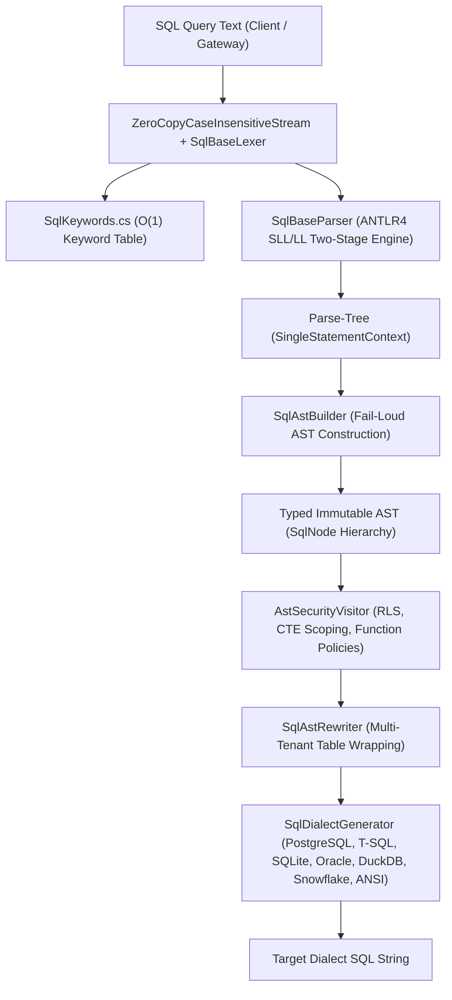
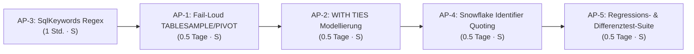

# Prüfung des SQL-AST & Downstream-Prozesses auf Keyword- & Konstrukt-Unterstützung

**Stand:** 09.10.2026 · **Zweig:** `feat/ast-target-dialect-generator`  
**Rolle:** Solution Architect & SQL Compiler Lead  
**Bezug:** WebSQL, `TrinoSqlEngine` (`AstCompiler`), Multi-Dialect Code Generation, Security Guardrails  

---

## 1. Management Summary & Zielsetzung

Im Rahmen des Vorhabens, den AST-Compiler (`SqlRewriterEngine=AstCompiler`) produktionsreif über alle Zieldatenbanken hinweg bereitzustellen, wurde eine vollständige Prüfung der SQL-Grammatik (`SqlBase.g4`), des Lexers, des AST-Parsings (`SqlAstBuilder.cs`), der Downstream-Visitors (`AstSecurityVisitor`, `SqlAstRewriter`) und der Code-Generatoren (`SqlDialectGeneratorBase` und Ziel-Dialekte) durchgeführt.

### Kern-Ergebnisse:
1. **Sehr hoher Abdeckungsgrad für Abfrage- & DML-Workloads:** Sämtliche Standard-SQL- und Trino-Konstrukte für relationale Abfragen (`SELECT`, `JOIN`, `WHERE`, `HAVING`, `ORDER BY`, `LIMIT/OFFSET/FETCH`, `UNION/INTERSECT/EXCEPT`, `CASE`, `CAST/TRY_CAST`, `EXTRACT`, `TRIM`, `SUBSTRING`, `POSITION`, Datumsarithmetik, Fensterfunktionen mit Frames und Aggregat-`FILTER`) sind vollständig im AST modelliert und auf 7 Ziel-Dialekte abgebildet.
2. **Fail-Loud-Architektur greift:** Nicht implementierte Regeln fallen dank `SqlAstBuilder.VisitChildren` deterministisch auf `AstBuildException` zurück und werden an der API als sauberer HTTP-400-Fehler abgewiesen, statt unvollständigen SQL-Code auszuführen.
3. **Sicherheits-Lockout aktiv:** Sämtliche DDL-, Session-, Transaktions- und Privilege-Keywords werden vom AST und RLS-Rewriter fail-closed abgewiesen.
4. **4 konkrete Befunde identifiziert (F-01 bis F-04):** Neben den bereits gelösten Themen existieren 2 stille Überleser (`TABLESAMPLE`/`PIVOT` und `WITH TIES`), eine Ziffern-Lücke im Keyword-Lookup (`UTF8`) sowie ein potenzielles Quoting-Problem bei unquoted Identifikatoren unter Snowflake.

---

## 2. Pipeline-Architektur & Stufen



---

## 3. Vollständige Matrix der Keyword- & Konstrukt-Unterstützung

### A. Vollständig unterstützt (End-to-End im AST und allen Generatoren)

| Keyword / Konstrukt | AST-Knoten | Downstream-Generierung & Dialekt-Besonderheiten |
|---|---|---|
| `SELECT [DISTINCT \| ALL]` | `QuerySpecification` | Vollständig; `DISTINCT` wird auf allen Dialekten sauber emittiert. |
| `FROM` | `TableSource` | `NamedTableSource`, `SubqueryTableSource`, `LateralTableSource`, `JoinedTableSource`. |
| `WHERE` | `QuerySpecification.Where` | Geklammerte Prädikatsverknüpfungen mit RLS-Splicing. |
| `GROUP BY` | `GroupByClause` | Standard-Ausdrücke; Unterstützung für `GROUP BY [DISTINCT]` (Postgres/DuckDB). |
| `ROLLUP`, `CUBE`, `GROUPING SETS`, `GROUPING()` | `GroupingElement`, `GroupingOperationExpression` | Vollständig in Phasen 5 umgesetzt; wird in ANSI-Form auf Postgres, SQL Server, Oracle, Snowflake emittiert (SQLite wirft 400). |
| `HAVING` | `QuerySpecification.Having` | Filter-Prädikate auf Aggregat-Ebene. |
| `ORDER BY ... [ASC \| DESC] [NULLS FIRST \| LAST]` | `OrderByClause`, `OrderByElement` | `NULLS FIRST/LAST` wird nativ emittiert oder in SQL Server über `CASE WHEN col IS NULL` emuliert. |
| `LIMIT`, `OFFSET`, `FETCH FIRST/NEXT ... ROWS ONLY` | `PaginationClause` | Postgres/DuckDB/SQLite: `LIMIT/OFFSET`; SQL Server: `OFFSET ... ROWS FETCH NEXT ... ROWS ONLY` oder `TOP`; Oracle: `FETCH FIRST`. |
| `WITH [RECURSIVE]` | `WithClause`, `CommonTableExpression` | Lexikalische CTE-Isolation, Zieldialekt-Aliasing. |
| `INNER`, `LEFT [OUTER]`, `RIGHT [OUTER]`, `FULL [OUTER]`, `CROSS`, `NATURAL JOIN` | `JoinedTableSource`, `JoinType` | Vollständige Join-Semantik über alle Dialekte. |
| `UNION [ALL]`, `INTERSECT [ALL]`, `EXCEPT [ALL]` | `SetOperationQuery` | Mengenoperatoren mit Distinct-/All-Quantoren. |
| `AND`, `OR`, `NOT` | `BinaryExpression`, `UnaryExpression` | Vollständige Präzedenz-Klammerung gegen Hijacking. |
| `IS [NOT] NULL` | `UnaryExpression` | Nativ auf allen Dialekten. |
| `[NOT] BETWEEN ... AND ...` | `BetweenExpression` | Nativ auf allen Dialekten. |
| `[NOT] IN (...)` | `InListExpression`, `InSubqueryExpression` | Listen und Unterabfragen. |
| `[NOT] LIKE ... ESCAPE ...` | `LikeExpression` | Automatische Klammerung des Escape-Musters (SG-05 Härtung). |
| `EXISTS (...)` | `ExistsExpression` | Nativ auf allen Dialekten. |
| `ALL`, `ANY`, `SOME` (Quantified Comparison) | `QuantifiedComparisonExpression` | Z. B. `x > ALL (SELECT y FROM t)`. |
| `CASE WHEN ... THEN ... [ELSE ...] END` | `SearchedCaseExpression`, `SimpleCaseExpression` | Searched und Simple Form; Schutz gegen doppeltes Einpacken in T-SQL. |
| `CAST`, `TRY_CAST` | `CastExpression` | Mappt Trino-Typen auf Zieldialekt (`double` $\to$ `float`, `boolean` $\to$ `bit`, `timestamp` $\to$ `datetime2`); `TRY_CAST` nativ oder emuliert. |
| `EXTRACT` | `ExtractExpression` | ISO-Wochentage und Datumsbestandteile übersetzt per Dialekt (`DATEPART` in T-SQL, `strftime` in SQLite). |
| `CURRENT_DATE`, `CURRENT_TIMESTAMP`, `LOCALTIMESTAMP` | `CurrentDateTimeExpression` | Dialektspezifisch gemappt (`SYSDATETIME()` etc.). |
| `SUBSTRING`, `TRIM`, `POSITION` | Eigene AST-Knoten | Spezialformen (`FROM/FOR`, `LEADING/TRAILING/BOTH`, `IN`) sauber übersetzt. |
| `OVER (PARTITION BY ... ORDER BY ... [ROWS\|RANGE])` | `WindowSpecification`, `WindowFrame` | Fensterrahmen mit `PRECEDING`, `FOLLOWING`, `CURRENT ROW`, `UNBOUNDED`. |
| `FILTER (WHERE ...)` | `FunctionCallExpression.Filter` | Postgres/DuckDB nativ; SQL Server/SQLite/Oracle automatisch als `CASE WHEN`-Aggregat emuliert. |
| `COUNT(*)`, Aggregat-`ORDER BY` | `FunctionCallExpression` | Spezieller Star-Argument-Knoten; `WITHIN GROUP` für SQL Server `STRING_AGG`. |
| `INSERT INTO`, `UPDATE`, `DELETE` | `InsertStatement`, `UpdateStatement`, `DeleteStatement` | Unterstützt bei `EnforceReadOnlyQueries = false` mit Tautologie-Guard und `WITH CHECK OPTION`. |

---

### B. Teilweise unterstützt / Dialektabhängig eingeschränkt

| Keyword / Konstrukt | Dialekt-Verhalten | Status / Begründung |
|---|---|---|
| `JOIN ... USING (...)` | In Postgres, SQLite, Oracle, DuckDB, ANSI nativ unterstützt. | **In SQL Server bewusst mit 400 abgewiesen:** T-SQL unterstützt kein `USING (...)`. Ein Umschreiben auf `ON a.x = b.x` verändert die Projektionssemantik (kein Column-Merge), daher sichere Ablehnung. |
| `GROUP BY DISTINCT` | In Postgres, DuckDB, ANSI nativ unterstützt. | **In SQL Server & SQLite mit 400 abgewiesen:** Beide Engines kennen kein `GROUP BY DISTINCT`. |
| `IS [NOT] DISTINCT FROM` | In Postgres, DuckDB, SQLite nativ unterstützt. | **In SQL Server emuliert:** Wird auf `< 2022` als `NOT EXISTS (SELECT a INTERSECT SELECT b)` übersetzt. |
| `INTERVAL '...' unit` | In Postgres, DuckDB, Oracle nativ unterstützt. | **In SQL Server & SQLite eingeschränkt:** Nur in Verbindung mit Datumsarithmetik (`current_date + INTERVAL '1' DAY`) über Date-Funktionen unterstützt. Reines Intervall-Literal ohne Kontext wird abgewiesen (kein nativer Typ). |

---

### C. Bewusst NICHT unterstützt (Fail-Loud / Security Lockout)

Zur Abwehr von Privilege Escalation, Server-Probing und Denial-of-Service werden folgende Keywords und Syntaxformen im AST-Compiler **strikt abgewiesen**:

1. **Administrative & DDL Statements:**  
   `CREATE`, `ALTER`, `DROP`, `TRUNCATE`, `RENAME`, `GRANT`, `REVOKE`, `DENY`, `MERGE` $\to$ Blockiert durch `SingleStatementContext`-Validierung (`SecurityException`).
2. **Session- & Transaktionsverwaltung:**  
   `USE`, `SET SESSION`, `RESET SESSION`, `START TRANSACTION`, `COMMIT`, `ROLLBACK`, `CALL`, `PREPARE`, `EXECUTE`, `DEALLOCATE` $\to$ Nicht als Abfrage-Statement zulässig.
3. **Erweiterte relationale Spezialoperatoren:**  
   - `UNNEST (...) [WITH ORDINALITY]` $\to$ Löst `AstBuildException("SQL construct 'Unnest' is not supported")` aus.
   - `JSON_TABLE (...)`, `JSON_QUERY`, `JSON_VALUE`, `JSON_EXISTS` $\to$ Löst `AstBuildException` aus.
   - `WINDOW w AS (...)` (benannte Fensterdefinitionen) $\to$ Löst `AstBuildException` aus (Inline `OVER (...)` wird voll unterstützt).
   - `LAMBDA` (`x -> x + 1`) $\to$ Löst `AstBuildException` aus.
   - `LISTAGG ... WITHIN GROUP` $\to$ Löst `AstBuildException` aus (anstatt fehlerhaftes SQL zu generieren).
   - `OVERLAY`, `NORMALIZE` $\to$ Löst `AstBuildException` aus.
   - `METHOD CALL` / `STATIC METHOD CALL` (`expr.method()`, `Type::method()`) $\to$ Löst `SecurityException` aus.
   - `TIME TRAVEL` (`FOR TIMESTAMP AS OF`, `FOR VERSION AS OF`) $\to$ Abgewiesen bei aktiver Standardoption `RejectTimeTravelQueries = true`.

---

## 4. Detaillierte Befunde & Handlungsbedarf

### Befund F-01: Stilles Überlesen von `TABLESAMPLE`, `PIVOT` und `MATCH_RECOGNIZE`
* **Ort:** `TrinoSqlEngine/Ast/Builder/SqlAstBuilder.cs:485-488`
* **Code:**
  ```csharp
  public override SqlNode VisitSampledRelation(SqlBaseParser.SampledRelationContext context)
  {
      return Visit(context.pivot().patternRecognition().aliasedRelation());
  }
  ```
* **Problem:** Enthält eine Query z. B. `FROM orders TABLESAMPLE BERNOULLI (10)` oder eine `PIVOT`- bzw. `MATCH_RECOGNIZE`-Klausel, navigiert der Visitor direkt zum Kindknoten `aliasedRelation`. Die Sampling- bzw. Pivot-Klausel wird **lautlos ignoriert**, und die Abfrage liest die gesamte Tabelle ohne Sampling.
* **Risiko:** Abweichende Ergebnismengen und unerwartete Last auf Backend-Datenbanken (kein Fail-Loud).
* **Maßnahme:** Explizite Prüfung im Visitor:
  ```csharp
  if (context.TABLESAMPLE() != null) throw Unsupported("TABLESAMPLE");
  if (context.pivot().PIVOT() != null) throw Unsupported("PIVOT");
  if (context.pivot().patternRecognition().MATCH_RECOGNIZE() != null) throw Unsupported("MATCH_RECOGNIZE");
  ```

---

### Befund F-02: Verlust des `WITH TIES`-Flags bei `FETCH FIRST/NEXT`
* **Ort:** `TrinoSqlEngine/Ast/Builder/SqlAstBuilder.cs:304-315`
* **Code:**
  ```csharp
  else if (context.FETCH() != null)
  {
      if (context.fetchFirst != null)
          limit = ParseRowCount(context.fetchFirst);
      else
          limit = new LiteralExpression(1L, LiteralType.Integer);
  }
  ```
* **Problem:** Die Grammatik erlaubt `FETCH FIRST n ROWS WITH TIES`. Das `PaginationClause`-Modell speichert jedoch nur `(Offset, Limit)`. Das Flag `WITH TIES` wird verworfen; der Generator emittiert lediglich `ONLY`.
* **Maßnahme:** `PaginationClause` um `bool WithTies = false` erweitern und im Dialekt-Generator bei `FETCH ... WITH TIES` abbilden (bzw. auf Dialekten ohne TIES-Unterstützung mit 400 ablehnen).

---

### Befund F-03: Keyword-Lookup-Tabelle erfasst keine Tokens mit Ziffern
* **Ort:** `TrinoSqlEngine/SqlKeywords.cs:16`
* **Code:**
  ```csharp
  var keywordLiteralRegex = new Regex(@"^'[A-Z_]+'$", RegexOptions.Compiled);
  ```
* **Problem:** Die ANTLR-Lexer-Literale `'UTF8'`, `'UTF16'`, `'UTF32'` enthalten Ziffern und werden durch `[A-Z_]+` nicht gematcht. Für diese Token-IDs gibt `SqlKeywords.IsKeyword(tokenType)` fälschlicherweise `false` zurück.
* **Entwarnung / Auswirkung:** Da `UTF8`, `UTF16` und `UTF32` in der Parser-Regel `nonReserved` aufgeführt sind, werden sie über die `identifier`-Regel weiterhin erfolgreich als Identifikatoren geparst. Lediglich die `methodName`-Prädikatsprüfung `{isKeyword()}?` greift für sie nicht als Keyword.
* **Maßnahme:** Regex auf `^'[A-Z0-9_]+'$` korrigieren, um vollständige Parität mit dem Trino-Standard zu gewährleisten.

---

### Befund F-04: Snowflake Identifier-Quoting bei unquoted Keywords
* **Ort:** `TrinoSqlEngine/Ast/Generators/AnalyticalDialectGenerators.cs:152-164`
* **Code:**
  ```csharp
  public override void FormatIdentifier(ref ValueStringBuilder builder, SqlIdentifier identifier, SqlEmitterContext context)
  {
      if (identifier.IsQuoted)
      {
          builder.Append('"');
          builder.Append(identifier.Value.Replace("\"", "\"\"", StringComparison.Ordinal));
          builder.Append('"');
      }
      else
      {
          builder.Append(identifier.Value.ToUpperInvariant());
      }
  }
  ```
* **Problem:** Im Gegensatz zu PostgreSQL (`"..."`) und SQL Server (`[...]`) emittiert Snowflake unquoted Bezeichner ohne Anführungszeichen (nur in Großbuchstaben). Enthält eine Trino-Abfrage Spalten mit Namen aus `nonReserved` (z. B. `date`, `role`, `user`, `account`, `level`), die in Snowflake reservierte Keywords sind, scheitert die Ausführung in Snowflake mit einem Syntaxfehler.
* **Maßnahme:** Entweder generelles Quoting mit `"` auch für unquoted Bezeichner in Snowflake aktivieren (wie in PostgreSQL) oder eine Snowflake-Reserved-Keyword-Prüfung vorschalten.

---

## 5. Architektonischer Implementierungsplan (Workstreams AP-1 bis AP-5)

### 5.1 Leitprinzipien & Invarianten
1. **Striktes Fail-Loud-Prinzip:** Kein Konstrukt darf still ignoriert oder verstümmelt emittiert werden. Was der AST-Compiler oder der Zieldialekt nicht semantisch korrekt abbilden kann, wird mit `AstBuildException` abgewiesen (HTTP 400 Bad Request im Gateway).
2. **Zero-Allocation im Lexer/Keyword Hot-Path:** `SqlKeywords.IsKeyword(tokenType)` bleibt ein ungebundener $O(1)$-Array-Lookup ohne Allokationen oder Locks.
3. **Immutability & Record Consistency:** AST-Knoten bleiben unveränderliche C#-Records mit `IReadOnlyList<T>`.
4. **TDD-Mandat (Test-First):** Für jedes Arbeitspaket werden zuerst die fehlschlagenden Unit-Tests erstellt, bevor der Compiler angepasst wird.

---

### 5.2 Workstream 1: Fail-Loud Härtung für TABLESAMPLE, PIVOT und MATCH_RECOGNIZE (Befund F-01)

#### 5.2.1 Problem & Architektur-Entscheidung
In `SqlBase.g4` ist `sampledRelation` definiert als:
```antlr
sampledRelation: pivot (TABLESAMPLE sampleType '(' percentage=expression ')')?;
pivot: patternRecognition (PIVOT '(' ... ')')?;
patternRecognition: aliasedRelation (MATCH_RECOGNIZE '(' ... ')')?;
```
Bislang navigiert `SqlAstBuilder.VisitSampledRelation` unkonditioniert durch:
```csharp
// Vorher (Fehlerhaft: stilles Überlesen):
public override SqlNode VisitSampledRelation(SqlBaseParser.SampledRelationContext context)
{
    return Visit(context.pivot().patternRecognition().aliasedRelation());
}
```
Die Klauseln `TABLESAMPLE`, `PIVOT` und `MATCH_RECOGNIZE` besitzen keine eigenen Visitor-Einstiegspunkte und fielen durch das unvollständige Durchreichen nicht auf `VisitChildren` zurück.

#### 5.2.2 Technische Spezifikation
In `src/TrinoSqlEngine/Ast/Builder/SqlAstBuilder.cs` wird `VisitSampledRelation` gehärtet:

```csharp
public override SqlNode VisitSampledRelation(SqlBaseParser.SampledRelationContext context)
{
    using var _ = EnterScope();

    // 1. Guard gegen TABLESAMPLE (BERNOULLI / SYSTEM)
    if (context.TABLESAMPLE() != null)
    {
        throw Unsupported("TABLESAMPLE");
    }

    var pivotCtx = context.pivot();
    if (pivotCtx != null)
    {
        // 2. Guard gegen PIVOT-Klauseln
        if (pivotCtx.PIVOT() != null)
        {
            throw Unsupported("PIVOT");
        }

        var patternCtx = pivotCtx.patternRecognition();
        if (patternCtx != null)
        {
            // 3. Guard gegen MATCH_RECOGNIZE (Row Pattern Recognition)
            if (patternCtx.MATCH_RECOGNIZE() != null)
            {
                throw Unsupported("MATCH_RECOGNIZE");
            }

            return Visit(patternCtx.aliasedRelation());
        }
    }

    return VisitChildren(context);
}
```

#### 5.2.3 TDD-Testspezifikation (`tests/TrinoSqlEngine.Tests/Ast/AstBuilderFailLoudTests.cs`)
```csharp
[Theory]
[InlineData("SELECT id FROM orders TABLESAMPLE BERNOULLI (10)")]
[InlineData("SELECT id FROM orders TABLESAMPLE SYSTEM (5)")]
[InlineData("SELECT * FROM orders PIVOT (SUM(amount) FOR dept IN ('Sales', 'Dev'))")]
[InlineData("SELECT * FROM stock MATCH_RECOGNIZE (MEASURES A.price AS price ONE ROW PER MATCH AFTER MATCH SKIP PAST LAST ROW PATTERN (A+ B+) DEFINE A AS A.price > 10)")]
public void SampledAndPatternRelations_AreRejectedWithFailLoud(string sql)
{
    var ex = Assert.Throws<AstBuildException>(() => Build(sql));
    Assert.Contains("not supported", ex.Message, StringComparison.OrdinalIgnoreCase);
}
```

---

### 5.3 Workstream 2: WITH TIES AST-Modellierung & Dialekt-Unterstützung (Befund F-02)

#### 5.3.1 Problem & Architektur-Entscheidung
Standard-SQL erlaubt `FETCH FIRST n ROWS WITH TIES`. Bislang erfasste `PaginationClause` nur `(Offset, Limit)`. Das Flag ging verloren und der Generator emittierte fälschlicherweise `ONLY`.

#### 5.3.2 Modell- & Visitor-Erweiterung
1. **Modellanpassung in `src/TrinoSqlEngine/Ast/Nodes/Clauses.cs`:**
   ```csharp
   public sealed record PaginationClause(
       Expression? Offset,
       Expression? Limit,
       bool WithTies = false) : SqlNode;
   ```

2. **Builder-Anpassung in `src/TrinoSqlEngine/Ast/Builder/SqlAstBuilder.cs`:**
   In `BuildQueryNoWith`:
   ```csharp
   bool withTies = false;
   if (context.limit != null)
   {
       if (context.limit.rowCount() != null)
       {
           limit = ParseRowCount(context.limit.rowCount());
       }
   }
   else if (context.FETCH() != null)
   {
       withTies = context.TIES() != null;
       if (context.fetchFirst != null)
       {
           limit = ParseRowCount(context.fetchFirst);
       }
       else
       {
           limit = new LiteralExpression(1L, LiteralType.Integer);
       }
   }

   if (offset != null || limit != null)
   {
       pagination = new PaginationClause(offset, limit, withTies);
   }
   ```

3. **Visitor-Konsistenz in `SqlAstRewriter.cs`:**
   ```csharp
   public override SqlNode? VisitPagination(PaginationClause node)
   {
       var offset = node.Offset != null ? (Expression)Visit(node.Offset)! : null;
       var limit = node.Limit != null ? (Expression)Visit(node.Limit)! : null;
       return (offset != node.Offset || limit != node.Limit)
           ? new PaginationClause(offset, limit, node.WithTies)
           : node;
   }
   ```

#### 5.3.3 Dialekt-Generierungsmatrix für WITH TIES

| Dialekt | Syntax / Unterstützung | Verhalten in Generator |
|---|---|---|
| **SQL Server** | `OFFSET o ROWS FETCH NEXT n ROWS WITH TIES` (nur mit `ORDER BY`) | Unterstützt; emittiert `WITH TIES`. |
| **PostgreSQL** | `FETCH FIRST n ROWS WITH TIES` ($\ge 13$) | Unterstützt; emittiert `FETCH FIRST n ROWS WITH TIES`. |
| **Oracle** | `FETCH FIRST n ROWS WITH TIES` | Unterstützt; emittiert `FETCH FIRST n ROWS WITH TIES`. |
| **Snowflake** | `FETCH FIRST n ROWS WITH TIES` | Unterstützt; emittiert `FETCH FIRST n ROWS WITH TIES`. |
| **SQLite** | Keine native Unterstützung | **Fail-Loud:** Wirft `UnsupportedConstruct("FETCH ... WITH TIES", TargetDialect)`. |
| **DuckDB** | Keine native Unterstützung (nur `LIMIT ...`) | **Fail-Loud:** Wirft `UnsupportedConstruct("FETCH ... WITH TIES", TargetDialect)`. |

**Code in `SqlDialectGeneratorBase.cs`:**
```csharp
protected virtual void GeneratePagination(
    PaginationClause pagination,
    OrderByClause? orderBy,
    ref ValueStringBuilder builder,
    SqlEmitterContext context)
{
    if (pagination.WithTies && !SupportsWithTies)
    {
        throw UnsupportedConstruct("FETCH … WITH TIES", TargetDialect);
    }

    if (pagination.WithTies && orderBy == null)
    {
        throw new AstBuildException("FETCH … WITH TIES requires an ORDER BY clause.");
    }
    // Dialektspezifische Emission von ONLY vs WITH TIES ...
}
```

#### 5.3.4 TDD-Testspezifikation (`tests/TrinoSqlEngine.Tests/Ast/PaginationWithTiesTests.cs`)
```csharp
public sealed class PaginationWithTiesTests
{
    private readonly FastSqlEngine _engine = new();

    [Theory]
    [InlineData(TargetSqlDialect.SqlServer, "FETCH NEXT 5 ROWS WITH TIES")]
    [InlineData(TargetSqlDialect.PostgreSql, "FETCH FIRST 5 ROWS WITH TIES")]
    [InlineData(TargetSqlDialect.Oracle, "FETCH FIRST 5 ROWS WITH TIES")]
    [InlineData(TargetSqlDialect.Snowflake, "FETCH FIRST 5 ROWS WITH TIES")]
    public void WithTies_SupportedDialects_EmitCorrectClause(TargetSqlDialect dialect, string expectedSnippet)
    {
        string sql = "SELECT id, score FROM scores ORDER BY score DESC FETCH FIRST 5 ROWS WITH TIES";
        string generated = _engine.GenerateGovernedSql(sql, new RlsOptions { TargetDialect = dialect });
        Assert.Contains(expectedSnippet, generated);
    }

    [Theory]
    [InlineData(TargetSqlDialect.Sqlite)]
    [InlineData(TargetSqlDialect.DuckDb)]
    public void WithTies_UnsupportedDialects_ThrowAstBuildException(TargetSqlDialect dialect)
    {
        string sql = "SELECT id, score FROM scores ORDER BY score DESC FETCH FIRST 5 ROWS WITH TIES";
        var ex = Assert.Throws<AstBuildException>(() => _engine.GenerateGovernedSql(sql, new RlsOptions { TargetDialect = dialect }));
        Assert.Contains("WITH TIES", ex.Message);
    }

    [Fact]
    public void WithTies_WithoutOrderBy_ThrowsValidationException()
    {
        string sql = "SELECT id FROM scores FETCH FIRST 5 ROWS WITH TIES";
        Assert.Throws<AstBuildException>(() => _engine.GenerateGovernedSql(sql, new RlsOptions { TargetDialect = TargetSqlDialect.SqlServer }));
    }
}
```

---

### 5.4 Workstream 3: Härtung der O(1) Keyword-Lookup-Tabelle (`SqlKeywords.cs`) (Befund F-03)

#### 5.4.1 Problem & Architektur-Entscheidung
In `src/TrinoSqlEngine/SqlKeywords.cs`:
```csharp
// Vorher:
var keywordLiteralRegex = new Regex(@"^'[A-Z_]+'$", RegexOptions.Compiled);
```
Die Literale `'UTF8'`, `'UTF16'`, `'UTF32'` werden ausgeschlossen, da Ziffern nicht im Zeichensatz `[A-Z_]` enthalten sind.

#### 5.4.2 Technische Umsetzung
1. Regex erweitern auf alphanumerische Token-Literale:
   ```csharp
   private static readonly Regex KeywordLiteralRegex = new(@"^'[A-Z0-9_]+'$", RegexOptions.Compiled);
   ```
2. Statische Initialisierung verifizieren:
   Max-Token-Prüfung gegen `SqlBaseLexer.DefaultVocabulary.MaxTokenType` absichern, sodass keine Tokens abgeschnitten werden:
   ```csharp
   static SqlKeywords()
   {
       var vocab = SqlBaseLexer.DefaultVocabulary;
       int maxTokenType = Math.Max(512, vocab.MaxTokenType + 1);
       IsKeywordTable = new bool[maxTokenType];

       for (int i = 0; i < maxTokenType; i++)
       {
           string? name = vocab.GetLiteralName(i);
           if (name != null && KeywordLiteralRegex.IsMatch(name))
           {
               IsKeywordTable[i] = true;
           }
       }
   }
   ```

#### 5.4.3 TDD-Testspezifikation (`tests/TrinoSqlEngine.Tests/SqlKeywordsTests.cs`)
```csharp
public sealed class SqlKeywordsTests
{
    [Theory]
    [InlineData(SqlBaseLexer.SELECT, true)]
    [InlineData(SqlBaseLexer.WHERE, true)]
    [InlineData(SqlBaseLexer.GROUP, true)]
    [InlineData(SqlBaseLexer.UTF8, true)]
    [InlineData(SqlBaseLexer.UTF16, true)]
    [InlineData(SqlBaseLexer.UTF32, true)]
    [InlineData(SqlBaseLexer.JSON_TABLE, true)]
    [InlineData(SqlBaseLexer.MATCH_RECOGNIZE, true)]
    public void Keywords_WithAlphanumerics_AreRecognized(int tokenType, bool expected)
    {
        Assert.Equal(expected, SqlKeywords.IsKeyword(tokenType));
    }

    [Theory]
    [InlineData(SqlBaseLexer.IDENTIFIER, false)]
    [InlineData(SqlBaseLexer.INTEGER_VALUE, false)]
    [InlineData(SqlBaseLexer.EQ, false)]
    [InlineData(SqlBaseLexer.PLUS, false)]
    [InlineData(-1, false)]
    [InlineData(9999, false)]
    public void NonKeywordsAndSymbols_AreNotKeywords(int tokenType, bool expected)
    {
        Assert.Equal(expected, SqlKeywords.IsKeyword(tokenType));
    }
}
```

---

### 5.5 Workstream 4: Snowflake Identifier-Quoting & Keyword-Kollisionsschutz (Befund F-04)

#### 5.5.1 Problem & Architektur-Entscheidung
In `src/TrinoSqlEngine/Ast/Generators/AnalyticalDialectGenerators.cs`:
```csharp
// Vorher (Fehlerhaft bei unquoted reserved names):
public override void FormatIdentifier(ref ValueStringBuilder builder, SqlIdentifier identifier, SqlEmitterContext context)
{
    if (identifier.IsQuoted)
    {
        builder.Append('"');
        builder.Append(identifier.Value.Replace("\"", "\"\"", StringComparison.Ordinal));
        builder.Append('"');
    }
    else
    {
        builder.Append(identifier.Value.ToUpperInvariant());
    }
}
```
Enthält eine Abfrage z. B. `SELECT date, role, account, user FROM orders`, emittiert Snowflake unquoted `SELECT DATE, ROLE, ACCOUNT, USER FROM ORDERS`. Da `ACCOUNT`, `USER`, `DATE` in Snowflake reservierte Keywords sind, wirft die Datenbank einen Syntaxfehler.

#### 5.5.2 Technische Umsetzung
Snowflake unterstützt das ANSI-Standard-Quoting mit doppelten Anführungszeichen (`"..."`). Bei unquoted Identifikatoren wird der Bezeichner zuerst in Großbuchstaben konvertiert (gemäß Snowflake Standard-Case-Folding) und anschließend gequotet:

```csharp
public override void FormatIdentifier(ref ValueStringBuilder builder, SqlIdentifier identifier, SqlEmitterContext context)
{
    builder.Append('"');
    string val = identifier.IsQuoted 
        ? identifier.Value 
        : identifier.Value.ToUpperInvariant();
    builder.Append(val.Replace("\"", "\"\"", StringComparison.Ordinal));
    builder.Append('"');
}
```

**Vorteile:**
1. **100 % Keyword-Kollisionssicherheit:** Keine Kollisionen mehr mit Snowflake-spezifischen Schlüsselwörtern.
2. **Case-Insensitivity-Parität:** Da Snowflake unquoted Bezeichner intern in Großbuchstaben speichert, matcht `"ORDERS"` exakt die mit `CREATE TABLE orders` erzeugte Tabelle.
3. **Einheitlichkeit:** Gleiche Sicherheitsgarantie wie bei PostgreSQL (`ToLowerInvariant()` + Quotes) und SQL Server (`[...]`).

#### 5.5.3 TDD-Testspezifikation (`tests/TrinoSqlEngine.Tests/Ast/DialectGenerators/AnalyticalDialectTests.cs`)
```csharp
[Fact]
public void Snowflake_EmitsQuotedUpperIdentifiers_ProtectingKeywords()
{
    string sql = "SELECT user, account, date FROM orders WHERE role = 'admin'";
    var engine = new FastSqlEngine();
    string generated = engine.GenerateGovernedSql(sql, new RlsOptions { TargetDialect = TargetSqlDialect.Snowflake });

    // Assert: Alle Bezeichner müssen gequotet und upper-case sein
    Assert.Contains("\"USER\"", generated);
    Assert.Contains("\"ACCOUNT\"", generated);
    Assert.Contains("\"DATE\"", generated);
    Assert.Contains("\"ORDERS\"", generated);
    Assert.Contains("\"ROLE\"", generated);
}
```

---

### 5.6 Workstream 5: End-to-End Differenz- & Regressions-Testsuite

#### 5.6.1 Testkorpus & Automatisierung
Zur Absicherung gegen Seiteneffekte wird die bestehende Testsuite um folgende Validierungen ergänzt:
1. **Compliance-Suite-Lauf:** Sämtliche 790 Trino-Compliance-Tests in `TrinoSqlEngine` müssen unverändert bestanden werden.
2. **AstSecurityVisitor DML & RLS Parität:** Überprüfung, dass `WithTies`, `TABLESAMPLE` und Identifier-Quoting keine Bypass-Möglichkeiten in `AstSecurityVisitor` oder `AstSimplificationVisitor` eröffnen.
3. **Multi-Dialect Execution Differential Tests:** Ausführung des gesamten WebSQL-Benchmark-Korpus gegen In-Memory SQLite und Testcontainers (Postgres, SQL Server).

---

## 6. Umsetzungsreihenfolge, Aufwände & Definition of Done

### 6.1 Roadmap & Abhängigkeiten



### 6.2 Aufwandschätzung

| Arbeitspaket | Aufwand | Risiko | Betroffene Komponenten |
|---|---|---|---|
| **AP-3 (SqlKeywords)** | 1 Stunde | Gering | `SqlKeywords.cs`, Unit-Tests |
| **AP-1 (Fail-Loud Härtung)** | 0.5 Tage | Gering | `SqlAstBuilder.cs`, FailLoud-Tests |
| **AP-2 (WITH TIES)** | 0.5 Tage | Mittel | `Clauses.cs`, `SqlAstBuilder.cs`, alle 7 Generatoren |
| **AP-4 (Snowflake Quoting)** | 0.5 Tage | Gering | `AnalyticalDialectGenerators.cs`, Dialekt-Tests |
| **AP-5 (Regressionssuite)** | 0.5 Tage | Gering | `TrinoSqlEngine.Tests`, CI-Pipeline |
| **Gesamtaufwand** | **2.0 Personentage** | **Sehr gering** | **AST-Compiler & Dialektgeneratoren** |

### 6.3 Definition of Done (DoD)
- [ ] Alle Unit-Tests für AP-1 bis AP-4 implementiert und grün.
- [ ] Gesamte Testsuite in `autheris/tests/TrinoSqlEngine.Tests` (1.400+ Tests) läuft mit 0 Fehlern durch.
- [ ] Kein silent dropping von SQL-Konstrukten im gesamten AST-Builder.
- [ ] 0 Compiler-Warnungen (`TreatWarningsAsErrors=true`).
- [ ] Dokumentation und Gesamtübersicht in `docs/plans/00-gesamtplan-uebersicht.md` aktualisiert.

