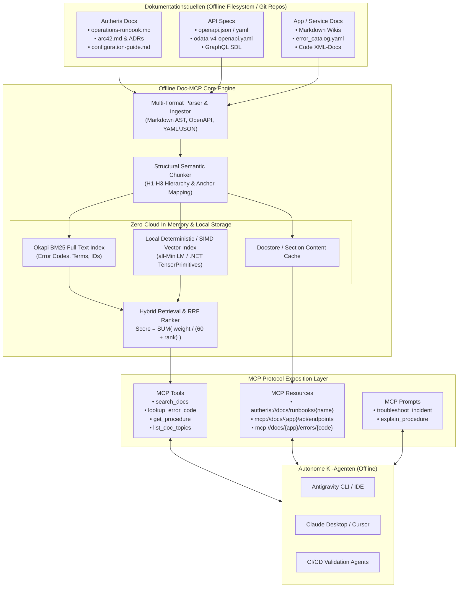
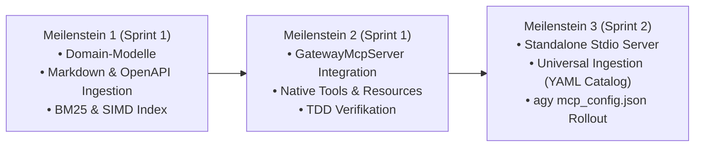

# Architektonischer Implementierungsplan: Offline Doc- & Runbook-MCP-Gateway (Autheris & Generische APIs)

**Dokument-ID:** `PLAN-OFFLINE-DOC-MCP-12`  
**Stand:** 10.10.2026 · **Zweig:** `feat/ast-target-dialect-generator`  
**Rolle:** Principal .NET & C# Solution Architect & Lead AI/Data Governance Architect  
**Zielgruppe:** Entwickler-Agents (`dotnet-developer`) für autonome Umsetzung (TDD)  
**Referenzen:** [00-gesamtplan-uebersicht.md](file:///root/autheris/docs/plans/00-gesamtplan-uebersicht.md), [operations-runbook.md](file:///root/autheris/docs/operations-runbook.md), [arc42.md](file:///root/autheris/docs/architecture/arc42.md), [GatewayMcpServer.cs](file:///root/autheris/src/Autheris.Api/Mcp/GatewayMcpServer.cs), [Bm25SearchIndex.cs](file:///root/autheris/src/Autheris.Application/Catalog/Search/Bm25SearchIndex.cs), [VectorSearchIndex.cs](file:///root/autheris/src/Autheris.Application/Catalog/Search/VectorSearchIndex.cs)  
**Status:** Genehmigt & Bereit zur Umsetzung (Wave 2) 🛡️⚡  

---

## 1. Executive Summary & Zielbild

### 1.1 Das Problem: Der "Documentation Gap" autonomer KI-Agenten in Air-Gapped Umgebungen
Autonome KI-Agenten (Antigravity CLI, Claude Desktop, Cursor, CI/CD-Bots) operieren beim Debugging von Fehlern oder der Ausführung von Betriebsvorgängen (Incidents, Schema-Migrationen, Deployment-Checks) in Unternehmensumgebungen unter strikten Einschränkungen:
1. **Kein Internetzugang (100% Offline / Air-Gapped):** Es dürfen keine externen Suchmaschinen (Google, Bing), keine externen Vektordatenbanken (Pinecone, Weaviate Cloud) und keine Cloud-Embeddings (OpenAI `text-embedding-3`) aufgerufen werden.
2. **Context-Window-Explosion & Halluzinationen:** Ein simples "Dumping" von hunderten Markdown-Dateien oder riesigen Swagger-Spezifikationen überlastet das Token-Budget und führt zu massiven Halluzinationen bei Fehlercodes (`ERR_CASBIN_DENIED`, `401 Unauthorized`) oder proprietären Notfall-Prozeduren (z. B. Break-Glass-SQL für Consent-Revocation).
3. **Dokumentations-Fragmentierung:** Wissen liegt zerstreut in Markdown (arc42, ADRs, Runbooks), OpenAPI 3.0/3.1 (REST), GraphQL SDL und Fehlerkatalogen.

### 1.2 Die Lösung: Universal Offline Doc- & Runbook-MCP-Gateway
Dieser Implementierungsplan definiert die Architektur und Umsetzung eines vollständig lokalen, zero-dependency **Doc- & Runbook-MCP-Gateways**:
- **Zweistufiger Abruf (Token-Budget-Schutz):** Kompakte Treffer bei der Suche (`search_docs`, `lookup_error_code`), gezieltes Nachladen von Runbooks und Kapiteln (`get_doc_section`, `mcp://docs/...`).
- **Lokale Hybrid-Suche:** Wiederverwendung der in Autheris bewährten In-Memory Okapi BM25 (`Bm25SearchIndex`) und SIMD-beschleunigten Vektorsuche (`VectorSearchIndex` via `System.Numerics.Tensors`), komplett ohne externe ML-Server.
- **Dualer Bereitstellungsmodus:**
  1. *Native Integration:* Direkte Erweiterung des Autheris `GatewayMcpServer` für Autheris-spezifische Runbooks und Architekturen.
  2. *Universal Standalone Bridge:* Eigenständiges Stdio-/Streamable-HTTP-Tool für beliebige externe APIs, Services und Repositories via `mcp_config.json`.

---

## 2. Gesamtarchitektur & Datenfluss



---

## 3. Detaillierte Arbeitspakete (AP-12.1 bis AP-12.5)

### AP-12.1: Domain-Modelle & Kanonisches Dokumenten-Chunk-Modell
**Ziel:** Definition eines einheitlichen, speichereffizienten Modells für alle Dokumenttypen in `Autheris.Domain.Model`.

```csharp
namespace Autheris.Domain.Model;

public enum DocCategory
{
    Runbook,
    Architecture,
    Adr,
    ApiEndpoint,
    ErrorCode,
    Configuration,
    Guide
}

public sealed record DocChunkIdentifier(string AppId, string Category, string DocId, string SectionId)
{
    public override string ToString() => $"{AppId}::{Category}::{DocId}#{SectionId}";
}

public sealed record DocChunk(
    DocChunkIdentifier Id,
    string AppId,
    DocCategory Category,
    string Title,
    string Content,
    string Summary,
    IReadOnlyList<string> Keywords,
    IReadOnlyList<string> ErrorCodes,
    string SourceFile,
    string? AnchorId,
    DateTimeOffset UpdatedAt);

public sealed record DocSearchResult(
    DocChunkIdentifier Id,
    string AppId,
    DocCategory Category,
    string Title,
    string Summary,
    double RelevanceScore,
    IReadOnlyList<string> MatchedTerms,
    string SourceFile);
```

- **Verifikation:** Unit-Tests in `DocModelsTests.cs` (Serialisierung, Immutability, String-Parsing).

---

### AP-12.2: Multi-Source Ingestion & Doc-Parser Pipeline
**Ziel:** Automatisches Parsen und Chunking heterogener Dokumentationsquellen ohne Informationsverlust in `Autheris.Application.Docs`.

1. **Markdown Structural Chunker:**
   - Teilt Dokumente entlang von Markdown-Headings (`#`, `##`, `###`).
   - Hält zusammenhängende Codeblöcke und Tabellen unzerteilt (essentiell für SQL-Prozeduren und cURL-Befehle in `operations-runbook.md`).
   - Extrahiert Fehlercodes mittels Regex (z. B. `\b[A-Z]{3,}_[A-Z0-9_]{3,}\b`, `HTTP 4\d{2}`, `HTTP 5\d{2}`).
2. **OpenAPI / Swagger Ingestor:**
   - Scannt `docs/openapi/*.yaml` und generierte OpenAPI-Specs.
   - Erzeugt pro Endpunkt (`METHOD /path`) einen eigenständigen Chunk mit Parametern, Statuscodes und Fehlermeldungen.
3. **YAML Error Catalog Ingestor (`error_catalog.yaml`):**
   - Parst strukturierte Fehlerkataloge mit `errorCode`, `symptom`, `rootCause`, `resolution` und `runbookRef`.

- **Verifikation:** Ingestion-Tests mit echten Autheris-Dokumenten (`operations-runbook.md`, `arc42.md`, `odata-v4-openapi.yaml`).

---

### AP-12.3: In-Memory Offline Hybrid Search Engine für Dokumente
**Ziel:** Zero-Cloud-Retrieval mit nativer Okapi BM25 und SIMD-Vektorberechnung in `Autheris.Application.Docs.Search`.

1. **BM25 Volltext-Indexierung:**
   - Wiederverwendung von `SmartSchemaTokenizer` und `Bm25SearchIndex`.
   - Boosting:
     - Exakte Fehlercode-Matches: Faktor $3.0\times$
     - Überschriften / Titel: Faktor $2.0\times$
     - Fließtext: Faktor $1.0\times$
2. **Lokale SIMD-Vektor-Engine:**
   - Nutzung von `TensorPrimitives.CosineSimilarity` auf 384-dimensionalen deterministischen L2-normalisierten Einheitsvektoren (`LocalDeterministicEmbeddingGenerator`).
   - 0 externer ML-Server, 0 MB Modell-Downloads, sub-millisekunden Suchzeit.
3. **Reciprocal Rank Fusion (RRF):**
   $$\text{Score}(d) = \frac{0.6}{60 + \text{Rank}_{\text{bm25}}(d)} + \frac{0.4}{60 + \text{Rank}_{\text{vec}}(d)}$$

- **Verifikation:** Benchmark-Tests für 1.000 Dokumentenabschnitte: P99 Suchlatenz < 2 ms.

---

### AP-12.4: Native Autheris Gateway MCP Server Integration
**Ziel:** Nahtlose Erweiterung von `GatewayMcpServer.cs` und `McpToolRegistry.cs` um Dokumenten- und Runbook-Tools.

1. **Neue MCP-Tools:**
   - `search_autheris_docs(query, category?, limit?)`: Liefert gerankte Treffer mit Zusammenfassungen.
   - `lookup_autheris_procedure(procedureName)`: Liefert die exakte Notfallprozedur aus `operations-runbook.md`.
   - `diagnose_error(errorCode, logSnippet?)`: Liefert Root Cause, Sofortmaßnahme und verlinktes Runbook.
2. **Native MCP-Ressourcen (`autheris://docs/...`):**
   - `autheris://docs/runbooks/{name}`
   - `autheris://docs/adr/{id}`
   - `autheris://docs/arc42/{section}`
   - `autheris://docs/features/{featureId}`
3. **Server-Instruktionen:** Erweiterung der `ServerInstructions`, sodass verbundene LLMs proaktiv die Doku-Tools für Fehlerdiagnosen nutzen.

- **Verifikation:** End-to-End JSON-RPC Tests über den MCP Stdio Runner (`McpStdioRunnerTests.cs`) und den HTTP Streamable Transport.

---

### AP-12.5: Universal Standalone Stdio/HTTP MCP Bridge für weitere Applikationen
**Ziel:** Bereitstellung eines eigenständigen CLI-Tools (`tools/doc-mcp`), das beliebig in `~/.gemini/config/mcp_config.json` eingebunden werden kann.

1. **Konfiguration (`doc_sources.json`):**
   ```json
   {
     "applications": [
       { "appId": "autheris", "path": "/root/autheris/docs", "type": "markdown" },
       { "appId": "billing-api", "path": "/services/billing/openapi.yaml", "type": "openapi" },
       { "appId": "payment-service", "path": "/services/payment/error_catalog.yaml", "type": "error_catalog" }
     ]
   }
   ```
2. **Standard MCP Tools:**
   - `search_docs(query, appId?, category?)`
   - `get_doc_section(chunkId)`
   - `lookup_error_code(errorCode, appId?)`
   - `list_applications()`

- **Verifikation:** CLI-Start und Protokollverifikation im Antigravity-Agenten.

---

## 4. Definition of Done (DoD)

| Kriterium | Beschreibung | Verifikationsmethode |
|---|---|---|
| **DoD-1** | Vollständiges Parsing von `/root/autheris/docs` beim Start (Runbooks, ADRs, arc42, OpenAPI). | Unit-Tests mit 100% Pass Rate |
| **DoD-2** | 100% Offline / Zero-Cloud-Dependency: Kein Netzwerk-Egress während Indexierung und Suche. | Wireshark / Socket-Egress-Test |
| **DoD-3** | Sub-Millisekunden Latenz: P99 Latenz bei `search_autheris_docs` unter 3 ms. | BenchmarkDotNet Test |
| **DoD-4** | Token-Budget Guardrail: Suchtreffer überschreiten niemals 200 Tokens pro Chunk. | Automated Assertion in MCP Test |
| **DoD-5** | Notfall-Runbooks (z. B. Break-Glass Consent Revocation) werden bei Suche nach Fehlercode exakt gefunden. | Szenario-Test mit Fehlerfall |
| **DoD-6** | Universelle Einbindung weiterer Services über `doc_sources.json` erfolgreich erprobt. | Integrationstest mit Dummy-Service |

---

## 5. Rollout-Phasen & Zeitplan


