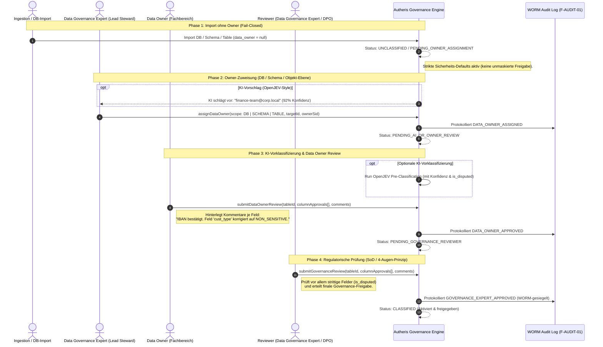
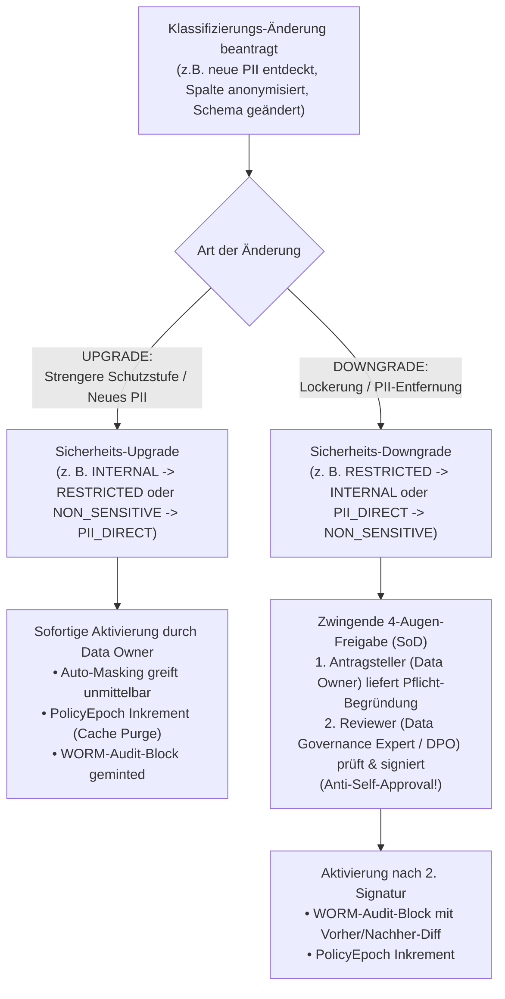
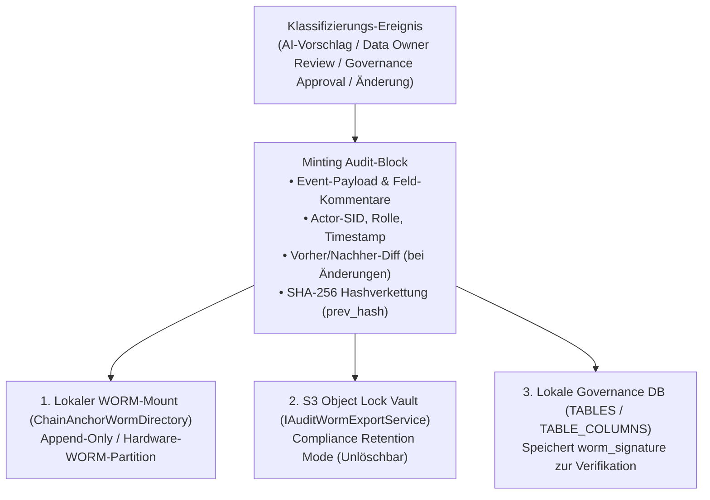
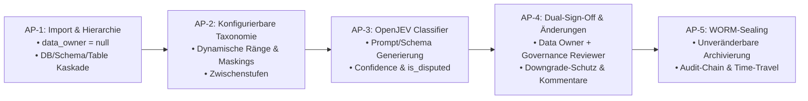

# Grobkonzept & Plan: Datenobjekt-Klassifizierung & KI-Vorklassifizierung (OpenJEV-Style)

**Dokument-ID:** `PLAN-GOV-KI-VORKLASSIFIZIERUNG-13`  
**Stand:** 10.10.2026 · **Zweig:** `feat/ast-target-dialect-generator`  
**Rolle:** Lead Data Governance & AI Architect  
**Status:** Grobkonzept / Genehmigt 🛡️⚡  

---

## 1. Executive Summary & Kernarchitektur

Dieses Konzept definiert den End-to-End-Lebenszyklus zur Registrierung, Zuweisung, Klassifizierung und Governance von Datenobjekten (Tabellen, Schemata und Spalten) in Autheris:

1. **Import ohne Vorbedingungen & ohne Vorab-Owner:**  
   Beim Import oder der automatischen Erkennung (SQL-Datenbanken, Lakehouses, dbt, OpenAPI) muss noch **kein Dateneigentümer feststehen**. Das System blockiert den Import nicht, sondern registriert Objekte sicher als `data_owner: null` im Status `UNCLASSIFIED` / `PENDING_OWNER_ASSIGNMENT` (Fail-Closed Schutz).
2. **Owner-Zuweisung durch den Data Governance Expert (Lead Data Steward):**  
   Der **Data Governance Expert** weist den fachlich zuständigen **Data Owner** zu – wahlweise hierarchisch pro Datenbank, pro Schema oder granular pro Tabelle. Optional schlägt die KI basierend auf Namensmustern und Metadaten einen passenden Owner vor.
3. **Frei konfigurierbare Schutzstufen & Maskings (inkl. Zwischenstufen):**  
   Schutzklassen, Ränge, Zwischenstufen (z. B. `INTERNAL_AUDIT_ONLY`, `CONFIDENTIAL_FINANCE`) sowie Maskierungsregeln (`PARTIAL_MASK` mit individuellen Parametern, `GEO_JITTER`, `REGEX_REPLACE`) sind vollständig deklarativ in der Konfiguration definiert.
4. **Optionale KI-Vorklassifizierung (OpenJEV-Style):**  
   Ein robuster Klassifizierungsdienst (angelehnt an [`OpenJevClient`](file:///root/autheris/src/Autheris.Extensions/Lineage/OpenJevClient.cs)) analysiert Spaltennamen, Typen und Schema-Metadaten. Der Prompt und das JSON-Schema werden **dynamisch aus den konfigurierten Schutzstufen und Maskings generiert**.
5. **Konfidenz & Strittigkeits-Erkennung (`is_disputed`):**  
   Die KI weist jedem Feld einen Konfidenzwert ($0.0 - 1.0$) zu und markiert **strittige Fälle (`is_disputed = true`)** explizit, damit Fachexperten Zweifelsfälle sofort erkennen.
6. **Zweistufiger Freigabe-Workflow (Dual-Sign-Off mit Feld-Kommentaren):**  
   Die finale Aktivierung erfordert ein 4-Augen-Prinzip (Segregation of Duties):
   - **Schritt 1 (Data Owner):** Fachliche Bestätigung aus Sicht des Fachbereichs.
   - **Schritt 2 (Data Governance Expert / Reviewer):** Regulatorische & rechtliche Compliance-Freigabe (DSGVO, Compliance, Security).
   - Beide Rollen können **pro Feld / Option individuelle Kommentare** und Korrekturen erfassen.

---

## 2. Rollenmodell & Begriffsdefinitionen

In Enterprise Data Governance (nach DAMA-DMBOK / Data Mesh) etablieren wir folgende klare Rollenteilung:

| Rolle | Bezeichnung in Autheris | Hauptverantwortung |
| :--- | :--- | :--- |
| **Data Governance Expert** *(Lead Data Steward)* | `GovernanceAdmin` / `DataGovernanceOfficer` | **Katalog-Lotse & Richtlinien-Hüter:** Weist nach dem Import den zuständigen Data Owner pro DB/Schema/Objekt zu; führt nach dem Data Owner das finale regulatorische 4-Augen-Review durch. |
| **Data Owner** *(Business Domain Owner)* | `DataOwner` (Fachbereichsverantwortlicher) | **Fachlicher Dateneigentümer:** Verantwortlich für fachliche Korrektheit der Daten und Einstufungen (z. B. Head of Finance, HR Operations Lead). Prüft und kommentiert die KI-Vorklassifizierung als erster Freigabeschritt. |
| **Reviewer** *(Compliance / DPO)* | `DataGovernanceReviewer` | **Unabhängiger Prüfer:** Führt das 4-Augen-Review durch (kann der Data Governance Expert oder ein dedizierter Datenschutzbeauftragter/DPO sein; **strikte SoD:** darf nicht identisch mit dem Data Owner sein). |

---

## 3. Lebenszyklus eines Datenobjekts (End-to-End Workflow)



---

## 4. Hierarchische Owner-Zuweisung (DB -> Schema -> Tabelle)

Damit der Data Governance Expert nicht hunderte Tabellen einzeln zuweisen muss, unterstützt Autheris eine dreistufige Vererbungskaskade:

1. **Zuweisung auf Datenbank- / Datasource-Ebene:**  
   `POST /api/v1/governance/datasources/{id}/owner`  
   *Beispiel:* Alle Tabellen der PostgreSQL-Instanz `erp-finance` gehören standardmäßig dem Owner `finance-steward@corp.local`.
2. **Zuweisung auf Schema- / Domain-Ebene (Überschreibung möglich):**  
   `POST /api/v1/governance/schemas/{schemaId}/owner`  
   *Beispiel:* Das Schema `hr_payroll` in einer geteilten Unternehmens-DB gehört `hr-owner@corp.local`.
3. **Zuweisung auf Tabellen-Ebene (Granulare Ausnahme):**  
   `PUT /api/v1/governance/tables/{tableId}/owner`  
   *Beispiel:* Eine geteilte Lookup-Tabelle `dbo.shared_currencies` wird einem zentralen Stammdaten-Owner zugewiesen.

---

## 5. Frei konfigurierbare Schutzstufen & Maskierungsregeln

### 5.1 Dynamische Schutzstufen & Zwischenstufen (`SensitivityLevels`)
Unternehmen definieren ihre Schutzstufen in `GatewayOptions.Classification.SensitivityLevels`. Durch numerische Ränge mit Abständen (`10, 20, 25, 30, 35, 40, 50`) können jederzeit beliebig feingliedrige Zwischenstufen eingefügt werden:

```json
{
  "Gateway": {
    "Classification": {
      "DefaultSensitivity": "UNCLASSIFIED",
      "FourEyesThresholdRank": 35,
      "SensitivityLevels": [
        { "key": "PUBLIC", "displayName": "Öffentlich", "rank": 10, "requiresFourEyes": false, "maxConsentTtlDays": 365 },
        { "key": "INTERNAL", "displayName": "Unternehmensintern", "rank": 20, "requiresFourEyes": false, "maxConsentTtlDays": 180 },
        { "key": "INTERNAL_AUDIT_ONLY", "displayName": "Intern (Nur Revision & Compliance)", "rank": 25, "requiresFourEyes": false, "maxConsentTtlDays": 90 },
        { "key": "CONFIDENTIAL", "displayName": "Vertraulich", "rank": 30, "requiresFourEyes": false, "maxConsentTtlDays": 60 },
        { "key": "CONFIDENTIAL_FINANCE", "displayName": "Vertraulich (Finanzen)", "rank": 35, "requiresFourEyes": true, "maxConsentTtlDays": 30 },
        { "key": "RESTRICTED", "displayName": "Streng vertraulich", "rank": 40, "requiresFourEyes": true, "requiresStepUpAuth": true, "maxConsentTtlDays": 30 },
        { "key": "STRICTLY_CONFIDENTIAL", "displayName": "Höchste Geheimhaltung", "rank": 50, "requiresFourEyes": true, "requiresStepUpAuth": true, "maxConsentTtlDays": 7 }
      ]
    }
  }
}
```

---

### 5.2 Frei konfigurierbare Maskierungsstrategien (`MaskingRules`)

Kunden können neben Standard-Maskings eigene benannte Maskierungsregeln mit individuellen Parametern hinterlegen:

```json
{
  "Gateway": {
    "Classification": {
      "MaskingRules": [
        {
          "name": "IBAN_STANDARD_4_4",
          "baseStrategy": "PARTIAL_MASK",
          "parameters": { "prefixLength": 4, "suffixLength": 4, "maskChar": "*" }
        },
        {
          "name": "IBAN_RETAIN_BLZ",
          "baseStrategy": "PARTIAL_MASK",
          "parameters": { "prefixLength": 8, "suffixLength": 2, "maskChar": "X" }
        },
        {
          "name": "EMAIL_DOMAIN_RETAIN",
          "baseStrategy": "REGEX_REPLACE",
          "parameters": { "pattern": "(?<=.)[^@\\n](?=[^@\\n]*?@)", "replacement": "*" }
        },
        {
          "name": "GEO_DISTRICT_500M",
          "baseStrategy": "GEO_JITTER",
          "parameters": { "jitterRadiusMeters": 500 }
        }
      ],
      "AutoMaskingPolicyMatrix": [
        { "piiType": "PII_DIRECT", "namePattern": "iban", "ruleName": "IBAN_STANDARD_4_4" },
        { "piiType": "PII_DIRECT", "namePattern": "email", "ruleName": "EMAIL_DOMAIN_RETAIN" },
        { "piiType": "PII_INDIRECT", "namePattern": "lat|lon", "ruleName": "GEO_DISTRICT_500M" }
      ]
    }
  }
}
```

---

## 6. Dynamische KI-Vorklassifizierung (OpenJEV-Style)

### 6.1 Konfigurierbare KI-Engine & Dynamisches Schema
Der `ClassificationAiClient` generiert den Systemprompt und das JSON-Schema zur Laufzeit dynamisch aus den registrierten Schutzstufen und Maskierungsregeln. Timeout-Guard (max. 150-200 ms) und Injection-Filter schützen vor Latenzen und Manipulation.

### 6.2 Strittigkeits-Erkennung (`is_disputed = true`)
- **Konfidenz $\ge 90\%$ (Eindeutig):** `is_disputed = false` (Grün).
- **Konfidenz $50\% - 89\%$ oder konkurrierende Kategorien:** `is_disputed = true` (Gelb/Hervorgehoben).
- **Vorteil:** Data Owner und Reviewer filtern im Dashboard/MCP direkt nach `is_disputed == true`, um sich sofort auf die kritischen Zweifelsfälle zu konzentrieren.

---

## 7. Feld- und Optionsspezifische Kommentare im Dual-Sign-Off

Jedes Freigabepaket speichert detaillierte Anmerkungen je Feld:

```json
{
  "tableId": "finance.dbo.customers",
  "reviewerRole": "DATA_OWNER",
  "reviewerSid": "S-1-5-21-finance-lead",
  "overallComment": "Fachbereichsfreigabe für Kundenstammdaten Q4/2026.",
  "columns": [
    {
      "columnName": "iban",
      "action": "ACCEPT_PROPOSAL",
      "effectiveClassification": "PII_DIRECT",
      "effectiveMasking": "IBAN_STANDARD_4_4",
      "comment": "Bestätigt. Entspricht Firmen-IBAN Richtlinie."
    },
    {
      "columnName": "customer_segment",
      "action": "OVERRIDE_PROPOSAL",
      "effectiveClassification": "INTERNAL",
      "effectiveMasking": "NONE",
      "comment": "KI-Vorschlag 'CONFIDENTIAL' korrigiert auf 'INTERNAL', da Segmente öffentlich in AGB genannt werden."
    }
  ]
}
```

---

## 8. Nachträgliche Änderungen & Re-Klassifizierung (Change Management)

Klassifizierungen sind nicht statisch; Schema-Evolution, geänderte Geschäftsprozesse, neue gesetzliche Vorgaben oder Korrekturen früherer Fehleinschätzungen erfordern **nachträgliche Änderungen an Tabellen- und Spalteneinstufungen**:



### 8.1 Schutzmechanismen bei Änderungen:
1. **Asymmetrisches Sicherheits-Design (Upgrade vs. Downgrade):**
   - **Upgrades (Verschärfung):** Können im Sinne von *Privacy by Default* sofort durch den zuständigen Data Owner oder Data Governance Expert aktiviert werden, damit keine sensiblen Daten ungeschützt abfließen.
   - **Downgrades (Lockerung):** Stellen ein gravierendes Compliance- und Datenabfluss-Risiko dar. Sie erfordern **zwingend die Gegenzeichnung des Data Governance Experts / DPOs (4-Augen-Prinzip)** mit Angabe einer triftigen Begründung (`justification`) und Feld-Kommentaren.
2. **Versionierung & Vorher/Nachher-Diff im WORM-Drive:**
   - Jede Änderung inkrementiert die `classification_version` des Objekts.
   - Der historische Zustand bleibt unberührt im WORM-Speicher erhalten. Auditoren können lückenlos nachvollziehen: Wer hat wann welches Feld von `PII_DIRECT` auf `NON_SENSITIVE` herabgestuft und welche Begründung lag vor.
3. **Sofortige Cache-Invalidierung (`PolicyEpoch` Inkrement):**
   - Bei jeder Änderung inkrementiert Autheris die clusterweite `PolicyEpoch`. Alle Worker-Nodes und Kestrel-Instanzen verwerfen gecachte Abfragepläne und L1-Zugriffsprofile sofort.
4. **Auswirkung auf aktive Consents:**
   - Wird eine Tabelle auf `RESTRICTED` hochgestuft, werden zuvor erteilte einfache Consents automatisch suspendiert und erfordern eine erneute 4-Augen-Rezertifizierung.

---

## 9. WORM-Drive Archivierung & Revisionssichere Versiegelung

Um strengste regulatorische Vorgaben (DSGVO Art. 30/32 Verzeichnis von Verarbeitungstätigkeiten, BaFin / MaRisk / VAIT, SOX 404, HIPAA) zu erfüllen, werden alle Klassifizierungsvorgänge, KI-Analysen, Bestätigungen, nachträglichen Änderungen und Feld-Kommentare **direkt auf dem WORM-Laufwerk (Write Once, Read Many)** unveränderbar versiegelt:



### 9.1 WORM-Event Struktur (`WormClassificationRecord`)
Jedes Klassifizierungs-, Freigabe- und Änderungs-Ereignis erzeugt einen kryptografisch signierten Block:
```csharp
public sealed record WormClassificationRecord(
    Guid EventId,
    string EventType, // e.g. "CLASSIFICATION_PROPOSED", "DATA_OWNER_APPROVED", "GOVERNANCE_REVIEWER_SEALED", "CLASSIFICATION_CHANGED"
    string TableIdentifier,
    int ClassificationVersion,
    string ActorSid,
    string ActorRole, // "DATA_OWNER" | "DATA_GOVERNANCE_REVIEWER"
    string? ApproverSid, // Bei Downgrades: SID des 2. Prüfers
    string? OverallComment,
    string? Justification,
    IReadOnlyList<WormColumnDecision> ColumnDecisions, // Inkl. individueller Feld-Kommentare & Diffs
    string PreviousHash,
    string Sha256Hash,
    string WormSignature,
    DateTimeOffset TimestampUtc);
```

### 9.2 Garantien des WORM-Speichers:
1. **Unveränderbarkeit (Tamper-Evidence):** Weder ein lokaler DBA noch ein kompromittierter `root`-Benutzer kann historische Klassifizierungsentscheidungen manipulieren oder löschen.
2. **Lückenlose Prüfpfad-Verifikation:** Auditoren und Datenschutzprüfer können anhand der SHA-256-Kette mathematisch beweisen, dass die Klassifizierung seit dem Tag der Freigabe unverändert ist.
3. **Hardware-/Cloud-WORM-Unterstützung:** Nahtlose Integration mit physischen WORM-Appliances (NetApp SnapLock, Dell EMC Centera) über Dateisystem-Mounts (`ChainAnchorWormDirectory`) sowie Cloud-WORM (AWS S3 Object Lock / Azure Immutable Blob).

---

## 10. Arbeitspakete für die Umsetzung



1. **AP-1: Unklassifizierter Import & Hierarchische Owner-Zuweisung:**  
   Import ohne Owner-Zwang; Zuweisung durch den Data Governance Expert auf DB-, Schema- oder Tabellenebene mit Vererbung.
2. **AP-2: Konfigurierbare Taxonomie & Maskierungs-Registry:**  
   Schutzstufen mit numerischen Rängen (inkl. Zwischenstufen) und benannte Maskierungsregeln mit Parametern.
3. **AP-3: Dynamischer OpenJEV Classifier mit Strittigkeits-Kennzeichnung:**  
   Laufzeit-Generierung des Prompts/Schemas; Erkennung unstrittiger vs. strittiger Felder (`is_disputed`).
4. **AP-4: Dual-Sign-Off & Änderungs-Management (Change Management):**  
   2-Stufen-Freigabe mit SoD-Prüfung, Feld-Kommentaren und obligatorischem 4-Augen-Prozess bei Klassifizierungs-Downgrades.
5. **AP-5: WORM-Drive-Archivierung & Revisionssicherheit:**  
   Lückenloser Export aller Klassifizierungszustände und Änderungen auf das WORM-Laufwerk (`IAuditWormExportService` / `ChainAnchorWormDirectory`).

---

## 11. Zusammenfassung

Dieses Modell stellt sicher, dass:
1. Der **Import niemals blockiert** wird, wenn noch kein Owner bekannt ist.
2. Der **Data Governance Expert** den Owner flexibel pro Datenbank, Schema oder Einzelobjekt zuweist.
3. Die **KI als Assistenzsystem** (OpenJEV-Style) Schutzstufen und Maskings vorschlägt und strittige Fälle markiert.
4. Der **fachliche Data Owner** und der **Data Governance Expert** in einem revisionssicheren 4-Augen-Prozess mit Feld-Kommentaren die finale Freigabe erteilen.
5. **Nachträgliche Änderungen jederzeit möglich sind** – mit schnellen Upgrades und strengem 4-Augen-Schutz bei Downgrades.
6. **Jeder Vorgang, jede Änderung und jede Freigabe unveränderbar auf einem WORM-Drive versiegelt** wird.
