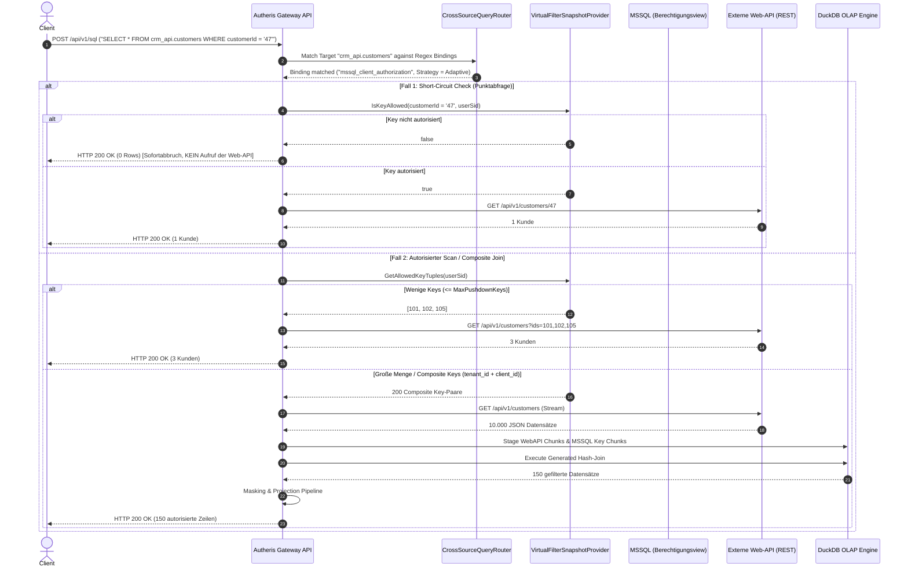

# Architektur- & Sicherheitskonzept: Föderierte Virtual Filters auf Web-APIs via DuckDB

**Dokument-ID:** `AUTHERIS-ARCH-SEC-2026-10-10-VF-WEBAPI-DUCKDB`  
**Autoren:** Autheris Chief Architect, Principal Performance Engineer & Application Security Expert  
**Status:** Detailliert & Review abgeschlossen (Bereit zur Implementierung)  
**Datum:** 10. Oktober 2026  
**Zielpfad:** `docs/plans/2026-10-10-konzept-federated-virtual-filter-web-api-duckdb.md`

---

## 1. Executive Summary & Problemstellung

### 1.1 Ausgangslage
Autheris schützt relationale Datenquellen (PostgreSQL, MSSQL, Oracle) über **Virtual Filters**. Ein Virtual Filter ist ein wiederverwendbares Prädikat-Template (z. B. `FROM conf.client c WHERE target.client_id = c.client_id AND c.is_active = 1`). Das Schlüsselwort `target` fungiert dabei als dynamischer Alias für die jeweils geschützte Tabelle.

In modernen Enterprise-Architekturen liegen Geschäftsdaten jedoch zunehmend hinter **REST-/Web-APIs** (Microservices, SaaS-APIs, SAP OData, CRM-Dienste). 

### 1.2 Das Kernproblem
1. **Kein Pushdown in Web-APIs:** Eine Web-API kennt keine SQL-Subqueries und kann keinen relationalen `EXISTS (SELECT 1 FROM mssql.dbo.v_allowed_tenants WHERE ...)`-Join gegen eine MSSQL-Datenbank ausführen.
2. **Fail-Closed Sicherheitsblockade:** Der Autheris In-Memory-Evaluator (`InMemoryRowFilterEvaluator.EnsureInMemoryFilterIsEnforceable`) blockiert Virtual Filters auf reinen HTTP-Quellen derzeit strikt mit **HTTP 403 Forbidden**, um Datenleaks und unvollständige Filterung zu verhindern.
3. **Das Performance-Dilemma bei naivem Staging:**
   - Lädt man stets *alle* Zeilen der Web-API und filtert danach im Gateway, erzeugt dies massiven Netzwerk-Overhead (z. B. Abruf von 100.000 Zeilen, von denen 99 % verworfen werden).
   - Fragt ein Benutzer gezielt nach `WHERE client_id = 47`, und `47` ist in der MSSQL-Berechtigungsview gar nicht enthalten, darf der Webservice **überhaupt nicht** aufgerufen werden (**Short-Circuit Protection**).
4. **Zusammengesetzte Schlüssel (Composite Keys):**
   Berechtigungen basieren in der Praxis selten auf einfachen Integer-IDs, sondern auf zusammengesetzten Schlüsseln (z. B. `(tenant_id, company_code, client_id)`).
5. **Heterogene Web-API Parameter-Formate:**
   Unterschiedliche Webservices erwarten ID-Filterungen in verschiedenen Formaten (z. B. Kommagetrennt `?ids=1,2`, wiederholte Query-Keys `?id=1&id=2`, OData `$filter=id in (1,2)` oder JSON-Batch-Bodies).

---

## 2. Zielarchitektur: Das adaptive 3-Stufen-Föderierungsmodell (Architect)

Zur Lösung dieses Problems wird eine **adaptive 3-Stufen-Föderierungsarchitektur** eingeführt, die den `CrossSourcePlanner`, den `FederatedDuckDbExecutionService` und den `VirtualFilterSnapshotProvider` nahtlos verbindet.

```text
                               ┌───────────────────────────────────────────────────────────┐
                               │                    Client Query                           │
                               │   SELECT * FROM crm_api.customers WHERE id = 47           │
                               └─────────────────────────────┬─────────────────────────────┘
                                                             │
                                                             ▼
                               ┌───────────────────────────────────────────────────────────┐
                               │             Autheris Query Routing & Policy               │
                               │      (Ermittelt VirtualFilterBinding via Regex)           │
                               └─────────────────────────────┬─────────────────────────────┘
                                                             │
                    ┌────────────────────────────────────────┴────────────────────────────────────────┐
                    │                                                                                 │
         [Fall A: Punktabfrage]                                                             [Fall B: Listen/Scan]
         WHERE target.id = 47                                                               SELECT * FROM customers
                    │                                                                                 │
                    ▼                                                                                 ▼
     ┌─────────────────────────────┐                                                   ┌─────────────────────────────┐
     │  Stufe 1: Short-Circuit     │                                                   │   Stufe 2 oder Stufe 3      │
     │  In-Memory Key-Set prüfen   │                                                   │   Entscheidung nach Menge   │
     └──────────────┬──────────────┘                                                   └──────────────┬──────────────┘
                    │                                                                                 │
         ┌──────────┴──────────┐                                                   ┌──────────────────┴──────────────────┐
         │                     │                                                   │                                     │
      [Erlaubt]           [Verboten]                                      [Kleine ID-Menge <= N]               [Composite Key / Große Menge]
         │                     │                                                   │                                     │
         ▼                     ▼                                                   ▼                                     ▼
┌──────────────────┐   ┌──────────────────┐                              ┌───────────────────┐                 ┌───────────────────┐
│ Web-API Aufruf   │   │  SOFORT-ABBRUCH  │                              │ Stufe 2: Pushdown │                 │ Stufe 3: DuckDB   │
│ ?id=47           │   │  0 Zeilen (404)  │                              │ Web-API Call      │                 │ In-Memory Hash-   │
└──────────────────┘   │  0 Netzwerk-I/O  │                              │ ?ids=10,20,30     │                 │ Join über Chunks  │
                       └──────────────────┘                              └───────────────────┘                 └───────────────────┘
```

---

### Stufe 1: Short-Circuit Guard (Punktabfragen & Miss-Eliminierung)

* **Trigger:** Die eingehende Abfrage enthält ein Prädikat auf den Primärschlüssel (z. B. `WHERE target.id = '47'`).
* **Ablauf:**
  1. Autheris prüft das Prädikat gegen den lokalen In-Memory-Snapshot der MSSQL-Berechtigungsview (`VirtualFilterSnapshotProvider` / `AccessProfileCache`).
  2. **Miss:** Befindet sich `'47'` **nicht** in den erlaubten Schlüsseln des Benutzers, bricht die Pipeline **sofort ab**. Es wird kein HTTP-Call an den Webservice abgesetzt. Rückgabe: Leeres Result-Set (`rowCount = 0`).
  3. **Hit:** Ist `'47'` erlaubt, wird die Web-API gezielt mit dem parameterisierten Request `GET /api/customers/47` aufgerufen.
* **Latenzvorteil:** Punktabfragen für nicht autorisierte Entitäten werden in $< 50\,\mu\text{s}$ beantwortet, anstatt 50–200 ms auf ein externes REST-System zu warten.

---

### Stufe 2: Semi-Join Parameter Pushdown (Kleine Schlüsselmengen)

* **Trigger:** Der Benutzer führt eine unbeschränkte oder breite Abfrage aus, aber die MSSQL-Berechtigungsview liefert eine überschaubare Anzahl an erlaubten Schlüsseln ($\le N$, konfigurierbar via `MaxPushdownKeys`, Standard: $\le 100$).
* **Ablauf:**
  1. Autheris ruft die erlaubten IDs aus dem Cache / MSSQL ab: `[101, 102, 105]`.
  2. Autheris generiert den parameterisierten HTTP-Request anhand des konfigurierten `PushdownFormat`:
     - `CommaSeparated`: `GET /api/customers?ids=101,102,105`
     - `RepeatedParam`: `GET /api/customers?id=101&id=102&id=105`
     - `ODataIn`: `GET /api/customers?$filter=id in (101, 102, 105)`
     - `PostBatch`: `POST /api/customers/query` mit Body `{"ids": [101, 102, 105]}`
  3. Die Web-API liefert nur die vorselektierten Daten zurück.

---

### Stufe 3: Föderierter DuckDB In-Memory Hash-Join (Große Mengen & Composite Keys)

* **Trigger:**
  - Die Web-API unterstützt keine URL-Filterung (nur Gesamtexport / Dump).
  - Die Anzahl der erlaubten IDs übersteigt `MaxPushdownKeys` (Gefahr von HTTP 414 URI Too Long).
  - Es liegt ein **zusammengesetzter Schlüssel (Composite Key)** vor (z. B. `tenant_id` + `client_id` + `division_code`), der nicht über URL-Parameter abbildbar ist.
* **Ablauf:**
  1. Autheris liest den Datenstrom der Web-API über den `HttpDeclarative`-Connector in Streaming-Batches.
  2. Autheris liest parallel die autorisierten Schlüssel/Tupel aus der MSSQL-View.
  3. **DuckDB In-Memory Execution:** Beide Streams werden in ephemere DuckDB-Tabellen gestagt. DuckDB führt einen optimierten Hash-Join aus:
     ```sql
     SELECT web.*
     FROM staged_webapi web
     INNER JOIN staged_mssql_keys mssql
        ON web.customerId = mssql.client_id
       AND web.tenantCode = mssql.tenant_id
     ```
  4. **Post-Join Governance Pipeline:** Erst auf dem Ergebnis des Joins greift das Autheris-Column-Masking und das Stripping nicht autorisierter Spalten.

---

## 3. Performance & Memory Engineering (Performance Engineer)

Zur Vermeidung von GC-Spitzen und Large Object Heap (LOH) Allokationen werden folgende Prinzipien strikt durchgesetzt:

### 3.1 Puffer- & Stream-Management
1. **LOH-Vermeidung ($\ge 85.000$ Bytes):**
   - Große JSON-Payloads von Web-APIs werden **nicht** in ein monolithisches `List<Dictionary<string, object?>>` deserialisiert.
   - Stattdessen nutzt der HTTP-Reader `ArrayPool<byte>.Shared` und streamt die Daten in Blöcken von 1.024 bis 2.048 Zeilen direkt in DuckDBs Appender-Schnittstelle.
2. **DuckDB Memory Envelope:**
   - DuckDB operiert mit strikter RAM-Obergrenze (`MaxMemory = "256MB"`).
   - `MaxTempDirectorySize = "0B"` stellt sicher, dass keine temporären Daten auf die Festplatte geschrieben werden (Zero-Disk-Leakage).
3. **In-Memory Key Indexing:**
   - Der `VirtualFilterSnapshotProvider` hält autorisierte Schlüssel in einem `FrozenSet<T>` / `HashSet<T>` im RAM. 
   - Ein Short-Circuit-Lookup hat damit eine zeitliche Komplexität von $O(1)$ ohne jegliche I/O-Latenz.

---

## 4. Deklaratives Regex- & Mapping-Modell

Um die Bindung flexibel und entkoppelt zu halten, wird das bestehende [`VirtualFilterBinding`](file:///root/autheris/src/Autheris.Domain/Model/VirtualFilterModels.cs#L273-L312) erweitert:

### 4.1 Konfigurations-Schema (`VirtualFilterBinding`)

```csharp
public sealed record VirtualFilterBinding
{
    public string FilterName { get; init; } = string.Empty;
    
    /// <summary>Regex- oder Wildcard-Muster auf Quell- und Tabellennamen (z.B. "^crm_api\.v[12]\..*")</summary>
    public string TargetPattern { get; init; } = string.Empty;

    /// <summary>Strategie: Adaptive, ShortCircuitOnly, DuckDbHashJoin, PushdownOnly</summary>
    public VirtualFilterExecutionStrategy Strategy { get; init; } = VirtualFilterExecutionStrategy.Adaptive;

    /// <summary>URL-Pushdown-Format: CommaSeparated, RepeatedParam, ODataIn, PostBatch</summary>
    public PushdownParameterFormat PushdownFormat { get; init; } = PushdownParameterFormat.CommaSeparated;

    /// <summary>Maximale Anzahl an Einzelschlüsseln für Stufe 2 (URL-Pushdown)</summary>
    public int MaxPushdownKeys { get; init; } = 100;

    /// <summary>Mapping zwischen Filterspalten (MSSQL) und Zielattributen (Web-API JSON)</summary>
    public IReadOnlyDictionary<string, string> ColumnMap { get; init; } = new Dictionary<string, string>();

    /// <summary>Zusammengesetzte Schlüssel für mehrdimensionale Joins</summary>
    public IReadOnlyList<string> CompositeKeys { get; init; } = [];
}

public enum VirtualFilterExecutionStrategy
{
    Adaptive = 0,             // Short-Circuit bei Punktabfrage -> Pushdown bei kleiner Menge -> DuckDB bei Rest
    ShortCircuitOnly = 1,     // Nur Punktabfragen erlauben, Scans verweigern
    DuckDbHashJoin = 2,       // Immer vollen DuckDB Hash-Join durchführen
    PushdownOnly = 3          // Nur URL-Parameter Pushdown zulassen
}

public enum PushdownParameterFormat
{
    CommaSeparated = 0,       // ?ids=101,102,105
    RepeatedParam = 1,        // ?id=101&id=102&id=105
    ODataIn = 2,              // ?$filter=id in (101, 102, 105)
    PostBatch = 3             // POST Body: { "ids": [101, 102, 105] }
}
```

### 4.2 Beispiel-Konfiguration

```json
{
  "VirtualFilters": {
    "Bindings": [
      {
        "FilterName": "mssql_client_authorization",
        "TargetPattern": "^crm_api\\.public\\.customers.*",
        "Strategy": "Adaptive",
        "PushdownFormat": "CommaSeparated",
        "MaxPushdownKeys": 50,
        "ColumnMap": {
          "client_id": "customerId",
          "tenant_id": "tenantCode"
        },
        "CompositeKeys": ["client_id", "tenant_id"]
      }
    ]
  }
}
```

---

## 5. Komponenten-Interaktion & Sequenzdiagramm



---

## 6. Security Expert Review & STRIDE-Bedrohungsanalyse

Geprüft nach Zero-Trust- und Defense-in-Depth-Vorgaben durch den **Application Security Expert**:

| STRIDE-Kategorie | Bedrohungsszenario | Gegenmaßnahme & Sicherheitsgarantie |
| :--- | :--- | :--- |
| **Spoofing (Identitätsfälschung)** | Client täuscht Ziel-Tabelle oder Identitäts-Claim vor. | Strikte Bindung an validierten `ClaimsPrincipal` und katalogisierte `TableIdentifier`. Keine Akzeptanz unauthentifizierter Target-Overrides. |
| **Tampering (Datenmanipulation)** | Manipulation des Staging-Streams oder der Join-Bedingungen. | DuckDB operiert rein in-memory (`MaxTempDirectorySize = "0B"`). Staging-Tabellen sind temporär und instanzgebunden. Parameterisierte Abfragen verhindern SQL-Injection. |
| **Repudiation (Nachvollziehbarkeit)** | Unklare Nachvollziehbarkeit, wer welche Web-API-Zeilen gesehen hat. | Einheitlicher W3C-TraceId-Kontext. Generierung zweier Audit-Events (`WEBSQL_CROSS_SOURCE_SOURCE_READ` für MSSQL und Web-API) sowie eines aggregierten `WEBSQL_CROSS_SOURCE_QUERY`-Audit-Records. |
| **Information Disclosure (Datenleak)** | **Inference Oracle via Error-Messages:** Angreifer ermittelt durch gezielte ID-Anfragen, ob eine ID in der Web-API existiert. | **Garantie:** Bei Short-Circuit Miss liefert Autheris dasselbe ununterscheidbare leere Ergebnis (0 Rows) wie bei einer nicht-existenten ID. Kein Unterschied zwischen "Existiert nicht" und "Keine Berechtigung" (No Oracle). |
| **Denial of Service (DoS / ReDoS)** | 1. Bösartiges Regex-TargetPattern blockiert Gateway.<br>2. Riesiger Web-API Dump erschöpft Gateway-RAM. | 1. Alle Regex-Evaluierungen laufen mit explizitem Timeout (`TimeSpan.FromMilliseconds(50)`).<br>2. DuckDB unterliegt strikten Limits (`MaxMemory = "256MB"`, `MaxRows`). Bei Überschreitung bricht die Pipeline mit `ConnectorRowLimitExceededException` sauber ab. |
| **Elevation of Privilege** | Umgehung des Virtual Filters bei Ausfall der MSSQL-Datenbank. | **Fail-Closed Prinzip:** Kann die Berechtigungsview in MSSQL nicht abgefragt werden (Timeout, Verbindungsausfall), wird der Web-API-Aufruf verweigert (`GatewaySecurityException`). |

---

## 7. Phasenweiser Implementierungsplan

### Phase 1: Domain- & Options-Erweiterung
1. Erweitern von `VirtualFilterBinding` in `Autheris.Domain/Model/VirtualFilterModels.cs` um `VirtualFilterExecutionStrategy`, `PushdownParameterFormat`, `CompositeKeys` und `MaxPushdownKeys`.
2. Hinzufügen von Timeout-geschützten Regex-Matchern für `TargetPattern`.

### Phase 2: Short-Circuit & Pre-Filter Engine
1. Implementieren des `VirtualFilterShortCircuitEvaluator` in `Autheris.Application/VirtualFilters/Services/`.
2. Erkennen von Punktabfragen (`target.key = literal`) im AST des `CrossSourcePlanner`.
3. Anbinden an den `VirtualFilterSnapshotProvider` für In-Memory-Verifikation ohne Roundtrips.

### Phase 3: DuckDB Hash-Join Pipeline & Pushdown-Formatierer
1. Erweitern des `CrossSourcePlanner`: Wenn ein Target auf ein `HttpDeclarative`-Objekt matcht und ein Virtual Filter aktiv ist, wird automatisch ein föderierter DuckDB-Plan generiert.
2. Implementieren der URL-Pushdown-Formatierer (`CommaSeparated`, `RepeatedParam`, `ODataIn`).
3. Generierung des `INNER JOIN`-Statements unter Berücksichtigung der `ColumnMap` (Unterstützung beliebiger Composite Keys).
4. Integration in `FederatedDuckDbExecutionService`.

### Phase 4: Integrations- & End-to-End-Tests
1. **E2E Test 1 (Short-Circuit Miss):** Abfrage `WHERE id = 999` $\rightarrow$ Verifikation, dass Web-API **0-mal** aufgerufen wird und 0 Zeilen zurückkommen.
2. **E2E Test 2 (Short-Circuit Hit):** Abfrage `WHERE id = 47` $\rightarrow$ Web-API wird gezielt mit ID 47 aufgerufen.
3. **E2E Test 3 (Parameter Pushdown):** Abfrage mit 3 erlaubten IDs $\rightarrow$ Web-API wird mit `?ids=101,102,105` aufgerufen.
4. **E2E Test 4 (Composite Key DuckDB Join):** Web-API liefert Datensätze mit `(tenant_id, client_id)` $\rightarrow$ MSSQL liefert autorisierte Paare $\rightarrow$ DuckDB führt Join aus und filtert korrekt.
5. **E2E Test 5 (Fail-Closed bei DB-Ausfall):** MSSQL nicht erreichbar $\rightarrow$ Request wird mit HTTP 503/403 abgebrochen, Web-API wird nicht exponiert.

---

## 8. Abnahme-Kriterien & Definition of Done

- [ ] **Zero Warnings:** Kompilierung unter `/warnaserror` auf dem gesamten Repository.
- [ ] **Keine Zeilenüberschreitung:** Alle Quellcode-Dateien bleiben strikt $\le 800$ Zeilen.
- [ ] **E2E-Testabdeckung:** Alle 5 Testfälle in `tests/Autheris.Tests.Integration/` sind grün.
- [ ] **Audits:** Lückenlose Erfassung der Zugriffe auf beide Teilsysteme im Audit-Log.
- [ ] **Kein automatischer Push:** Code verbleibt zur finalen Begutachtung lokal auf dem Branch.
