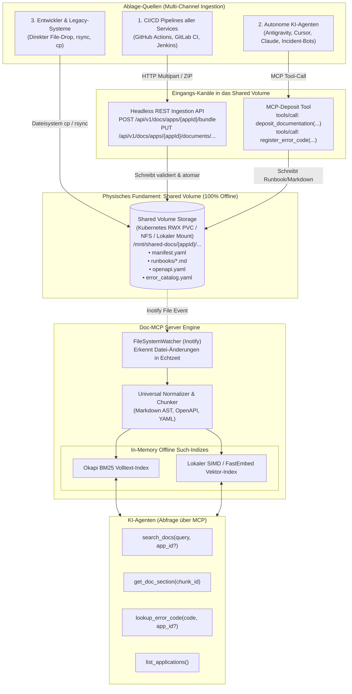
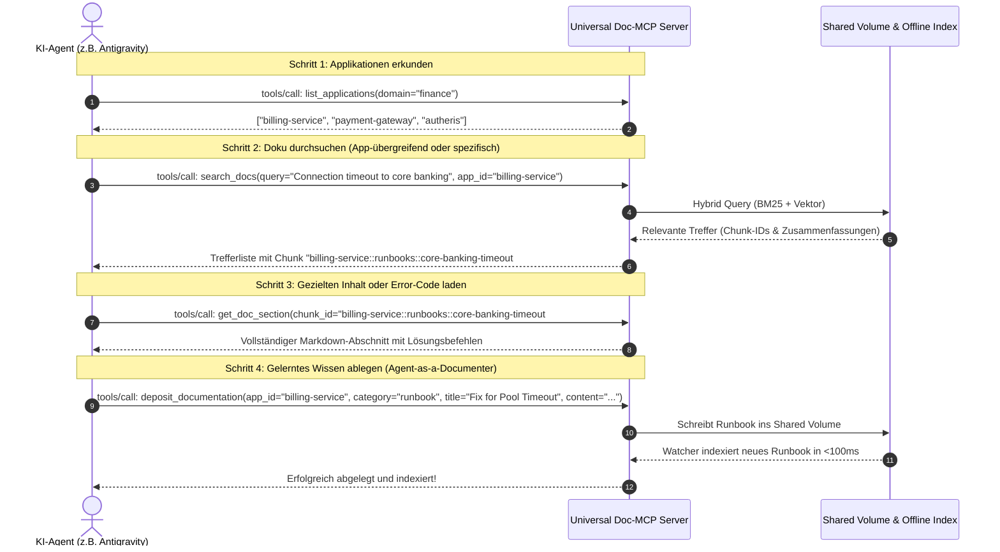

# Konzept: Universelle Dokumentenablage für alle Applikationen via MCP

**Dokument-ID:** `PLAN-UNIVERSAL-DOC-STORE-14`  
**Stand:** 10.10.2026 · **Zweig:** `feat/ast-target-dialect-generator`  
**Rolle:** Lead Cloud & AI Infrastructure Architect  
**Ziel:** Konzeptionelles Modell zur firmenweiten Ablage, Ingestion und MCP-Bereitstellung beliebiger Dokumentationen aus allen Applikationen – vereint als **Headless Ingestion API & MCP-Deposit auf Shared Volume** (100% Offline / Air-Gapped fähig)  

---

## 1. Problemstellung & Zielbild

### 1.1 Die Herausforderung: Heterogene Dokumentationsinseln
In modernen Softwarelandschaften existiert kein einheitlicher Speicherort für Dokumentationen:
- Service A pflegt Markdown-Dateien in Git (`/docs`).
- Service B generiert eine OpenAPI-Spezifikation (`openapi.json`) zur Build-Zeit.
- Service C pflegt Runbooks und Notfallprozeduren in einem internen Wiki oder Ticketsystem.
- Service D hat strukturierte Fehlerkataloge (`error_catalog.yaml`).

KI-Agenten (wie Antigravity, Cursor, Claude Desktop oder interne Ops-Bots) können diese Inseln offline nicht durchsuchen.

### 1.2 Das Ziel: Ein universeller "Doc-Lake" mit MCP-Exposition
Es wird ein System benötigt, bei dem:
1. **Beliebige Applikationen** ihre Dokumente einfach, automatisiert und formatunabhängig **ablegen** können.
2. Der physische Speicher **100% offline und air-gapped** als geteiltes Netzlaufwerk (**Shared Volume** / NFS / Kubernetes PVC) betrieben wird.
3. Die Ablage sowohl über eine **Headless REST Ingestion API** (für CI/CD-Pipelines), als auch über ein **MCP-Deposit-Tool** (für KI-Agenten) und per **direktem Dateidrop** erfolgen kann.
4. Ein zentraler **Doc-MCP-Server** diese Dokumente aggregiert, in Echtzeit per File-Watcher indexiert und KI-Agenten über ein einheitliches Tool- und Ressourcen-Set zur Verfügung stellt.

---

## 2. Das vereinte Zielmodell: Ingestion API & MCP-Deposit auf Shared Volume



---

### 2.1 Schicht 1: Das physische Shared Volume (`/mnt/shared-docs/`)
Das Fundament ist ein geteiltes, langlebiges Dateisystem (Kubernetes `ReadWriteMany` PVC, NFS-Share oder lokaler Mount):
- **Vorteil:** Die Dokumente liegen im **Klartext als echte Dateien** vor. Sie können auch ohne Server-Instanz mit Standard-Tools (`cat`, `grep`, `git`, `rsync`) eingesehen und gesichert werden.
- **Verzeichnisstruktur pro Applikation:**
  ```text
  /mnt/shared-docs/
  ├── autheris/
  │   ├── manifest.yaml
  │   ├── runbooks/
  │   │   ├── consent-revocation.md
  │   │   └── sqlite-recovery.md
  │   ├── architecture/
  │   │   └── arc42.md
  │   └── api/
  │       └── odata-v4-openapi.yaml
  ├── billing-service/
  │   ├── manifest.yaml
  │   ├── openapi.json
  │   └── error_catalog.yaml
  └── crm-backend/
      ├── manifest.yaml
      └── runbooks/
  ```

---

### 2.2 Schicht 2: Die Ingestion-Kanäle in das Shared Volume

#### Kanal A: Headless REST Ingestion API (für CI/CD-Pipelines)
CI/CD-Pipelines (z. B. GitHub Actions, GitLab CI oder Jenkins) laden Dokumentations-Bundles beim Release hoch:
- `POST /api/v1/docs/apps/{appId}/bundle`  
  *Nimmt ein ZIP- oder Tarball-Archiv entgegen, validiert das `manifest.yaml` und entpackt die Dateien atomar in `/mnt/shared-docs/{appId}/`.*
- `PUT /api/v1/docs/apps/{appId}/documents/{category}/{docId}`  
  *Erstellt oder überschreibt eine einzelne Markdown- oder OpenAPI-Datei im Shared Volume.*

#### Kanal B: MCP-Deposit-Tools für autonome KI-Agenten ("Agent-as-a-Documenter")
KI-Agenten (z. B. nach der Analyse eines Incidents oder einer Fehlerursache) können ihr Wissen direkt im Shared Volume ablegen:
```json
{
  "name": "deposit_documentation",
  "description": "Deposits or updates documentation, a troubleshooting runbook, or an error resolution guide directly into the enterprise shared volume.",
  "inputSchema": {
    "type": "object",
    "required": ["appId", "category", "title", "content"],
    "properties": {
      "appId": { "type": "string", "description": "Unique identifier of the application (e.g. 'autheris', 'billing-service')" },
      "category": { "type": "string", "enum": ["runbook", "architecture", "api", "error_code", "guide"] },
      "title": { "type": "string", "description": "Title of the document or procedure" },
      "content": { "type": "string", "description": "Markdown content, OpenAPI YAML or JSON specification" },
      "errorCode": { "type": "string", "description": "Optional associated error code (e.g. 'PAY_ERR_5002')" },
      "tags": { "type": "array", "items": { "type": "string" } }
    }
  }
}
```
*Der MCP-Server schreibt den Inhalt direkt als Markdown-Datei unter `/mnt/shared-docs/{appId}/{category}/{fileName}.md` ins Shared Volume.*

#### Kanal C: Direkter File-Drop (Volume Mount / rsync)
Entwickler, Admins oder Legacy-Builds können Dateien auch ohne API direkt in das gemountete Verzeichnis kopieren (`cp -r docs/* /mnt/shared-docs/my-app/`).

---

### 2.3 Schicht 3: Reaktive In-Memory Indexierung (FileSystemWatcher)
- Der Doc-MCP-Server bindet einen `FileSystemWatcher` (unter Linux via `Inotify`) an `/mnt/shared-docs/`.
- **Ereignisgesteuerte Aktualisierung:**
  - Sobald eine Datei über die REST-API, über das MCP-Deposit-Tool oder direkt per Dateisystem abgelegt oder geändert wird, fängt der Watcher das Event ab.
  - Nur die geänderte Datei wird geparst und im In-Memory Okapi BM25- und SIMD-Vektor-Index aktualisiert (Null-Downtime, keine Neustarts).
  - Latenz vom Upload bis zur Durchsuchbarkeit: **< 100 ms**.

---

## 3. Der einheitliche Metadaten-Standard (`manifest.yaml`)

Jede Applikation hinterlegt im Wurzelverzeichnis ihrer Doku ein `manifest.yaml`:

```yaml
app_id: billing-service
name: "Enterprise Billing & Invoicing Service"
version: "2.4.1"
domain: "finance"
owner: "finance-billing-team@corp.local"
governance_tier: "Tier-1"

entry_points:
  architecture: "architecture/arc42.md"
  runbooks: "runbooks/"
  api_spec: "api/openapi.yaml"
  error_catalog: "errors/error_catalog.yaml"

tags:
  - "PCI-DSS"
  - "CoreBanking"
  - "Invoicing"
```

---

## 4. MCP Schnittstelle für KI-Agenten

Unabhängig davon, wie die Dokumente in das Shared Volume gelangt sind, greifen KI-Agenten immer über die gleichen 5 Standard-Tools zu:



### Standard-Tools im Überblick:
1. `list_applications(domain?, tag?)`: Listet alle im Doc-Store registrierten Services und deren Status.
2. `search_docs(query, app_id?, category?, limit?)`: Volltext- & semantische Suche über alle Dokumente aller Apps.
3. `get_doc_section(chunk_id)`: Lädt einen konkreten Text- oder Code-Abschnitt nach.
4. `lookup_error_code(error_code, app_id?)`: Blitzschneller Direkt-Lookup nach Fehlercodes (z. B. `PAY_ERR_5002` oder `ORA-01017`).
5. `deposit_documentation(...)`: Erlaubt es berechtigten Agenten oder Deployern, Dokumente direkt per MCP im Shared Volume abzulegen.

---

## 5. Vorteile der vereinten Architektur

| Aspekt | Vorteil des vereinten Modells (API + MCP auf Shared Volume) |
| :--- | :--- |
| **Zero Vendor Lock-in** | Keine Abhängigkeit von proprietären Cloud-Diensten; rein offener Dateisystem-Standard. |
| **Multi-Channel Input** | CI/CD-Pipelines nutzen REST-API, KI-Agenten nutzen MCP, Admins nutzen `cp`/`rsync`. |
| **Sofortige Suchbereitschaft** | FileSystemWatcher indexiert Änderungen ereignisgesteuert in unter 100 ms. |
| **Agent Writable (Self-Healing)** | KI-Agenten können selbst Runbooks und Problemlösungen verfassen und persistieren. |
| **Air-Gapped & Offline** | Funktioniert zu 100% in geschlossenen Rechenzentren ohne Internetzugriff. |
| **Auditierbarkeit & Backup** | Das Shared Volume kann mit Standard-Backup-Tools (Bacula, Velero, ZFS-Snapshots) gesichert werden. |

---

## 6. Zusammenfassung

Durch die Vereinigung von **Headless Ingestion API**, **MCP-Deposit-Tools** und **Shared Volume** entsteht eine extrem robuste, zukunftssichere Dokumentationsplattform für das gesamte Unternehmen:
- Dokumente lagern transparent im Shared Volume als "Single Source of Truth".
- Pipelines und KI-Agenten haben moderne Schnittstellen zum Ablegen und Aktualisieren.
- KI-Agenten können das gebündelte Wissen aller Services offline in Sub-Millisekunden über standardisierte MCP-Tools abfragen.
